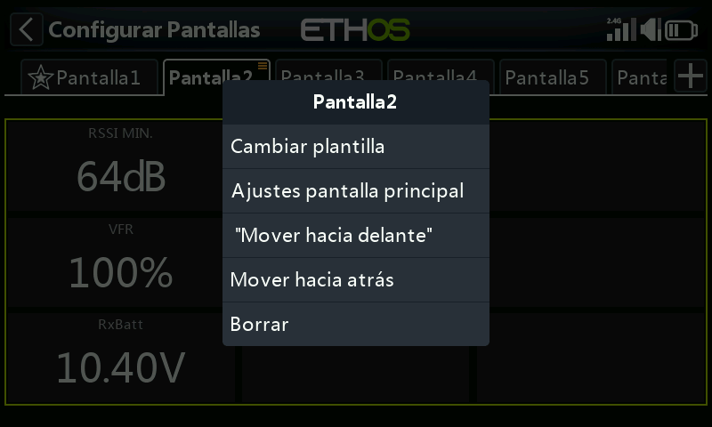
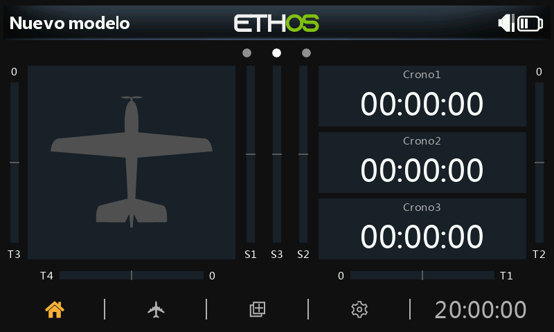

# Pantallas adicionales

El modelo por defecto incluye una sola pantalla (la imagen del modelo más tres widgets de cronómetro), pero se admiten hasta **ocho** pantallas en total. Toque el símbolo **+** situado junto a "Screen1" para añadir otra:

- Puede elegir entre **15** diseños, incluidos dos diseños dedicados a la pantalla de inicio y una opción a pantalla completa, con capacidad para hasta 9 widgets, que se configuran exactamente igual que en la primera pantalla.
- Las pantallas se pueden reordenar o eliminar desde su propio cuadro de diálogo de edición (toque Screen1, Screen2, etc.).

## Ejemplo práctico

Un diseño típico: la imagen del modelo (configurada en [Model Edit → Picture](../model-setup/model-edit.md)) a la izquierda y, apilados a la derecha, la tensión de la batería del receptor, el RSSI y un widget de estado "Throttle ACTIVE" (un widget Lua creado por la comunidad, procedente del hilo de rcgroups *FrSky - ETHOS Lua Script Programming*). Al tocar cualquier widget se abre su configuración, o se salta a la función principal de configuración de pantallas.

## Opciones de cada pantalla

Más allá de los widgets individuales, cada pantalla tiene sus propios ajustes: el tamaño de la cuadrícula del diseño, el fondo y qué pantallas se incluyen en el ciclo de `PAGE`.

Vaya a la sección [Pantallas](index.md) para los widgets en sí, y a [Widgets personalizados](custom-widgets.md) para añadir widgets programados en Lua más allá de los ya incorporados.
