# Configuración de la pantalla principal

Un contorno verde indica que estamos en modo de configuración. Un widget puede configurarse tocándolo.

## Configurar el mapa de bits del modelo

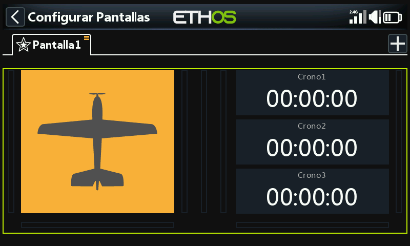

Toque el widget de la imagen del modelo para entrar en el modo de edición.

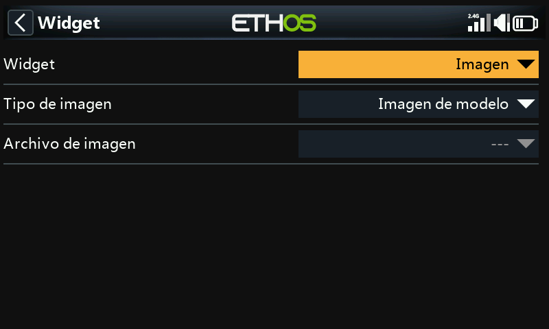

Por defecto, el widget de mapa de bits en la pantalla principal tiene el 'Tipo de imagen' configurado como 'Imagen del modelo'. Aquí no se puede seleccionar la imagen, se configura en 'Modelo /  [Editar modelo](#Edit model)' o en los nuevos asistentes de modelo. El mapa de bits del modelo debe estar ubicado en la carpeta [/bitmaps/model](#bitmaps-models-).

Por defecto, los tres widgets a la derecha muestran los tres cronómetros.

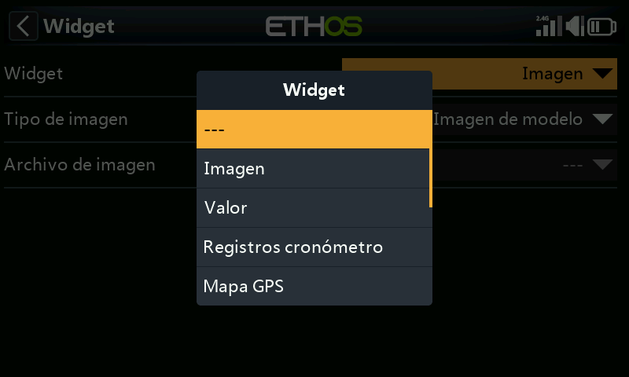

Se pueden reconfigurar para mostrar otros parámetros seleccionando cada widget y luego cambiando el tipo de widget cuando se abra el diálogo. Vea abajo para más detalles.  
  
Los widgets Lua personalizados también aparecerán en la lista.

## Ejemplo de widgets de la pantalla principal

En el ejemplo anterior, a la izquierda el widget de la imagen del modelo, se muestra la imagen del modelo que se configuró en Modelo / Editar modelo / Imagen. El widget superior a la derecha muestra el voltaje de la batería del receptor, el del medio muestra RSSI, mientras que el inferior muestra 'Throttle ACTIVE'. Este es el widget de Estado disponible en el hilo de programación de scripts Lua de FrSky - ETHOS en rcgroups.

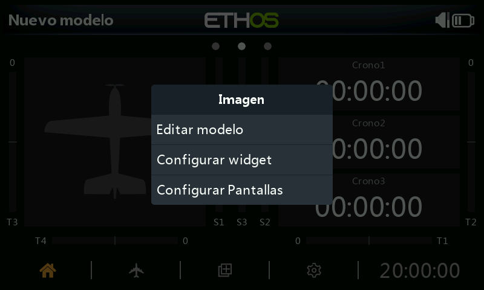

Toca cualquier widget desde las pantallas principales para abrir un cuadro de diálogo para ir a Modelo / Editar para configurar el mapa de bits del modelo, o para configurar el widget, o para ir a la función principal  [Configurar pantallas](index.md).

### Widgets en la pantalla superior (sólo en las serie XE)

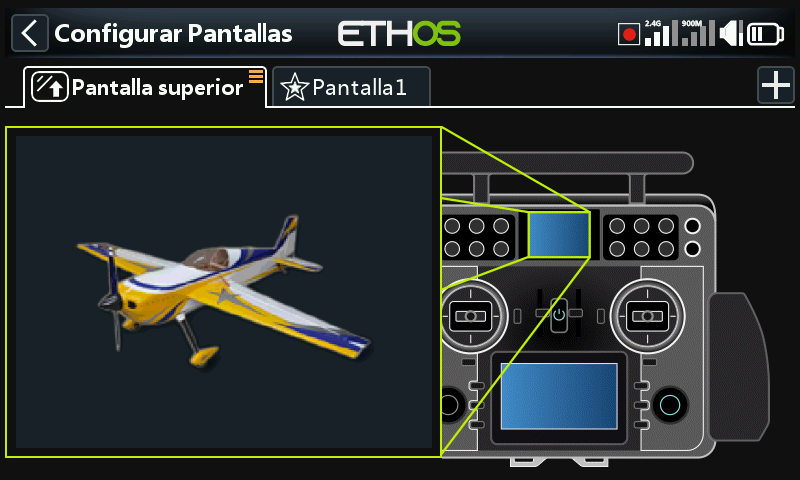

En las radios de la serie XE, el widget predeterminado de la pantalla superior es del tipo ‘Bitmap’ configurado como ‘Foto del modelo’. El bitmap no se puede seleccionar ahí, sino que se configura en ‘Modelo /  [Editar modelo](#Edit model)’  o en los asistentes para nuevo modelo. La foto del modelo debe estar ubicado en la carpeta [/bitmaps/model](#bitmaps-models-).

Para cambiar el widget, toque el widget de la foto del modelo para entrar en modo de edición. Por favor, consulte los widgets estándar a continuación para seleccionar un widget diferente para mostrar en la pantalla superior.

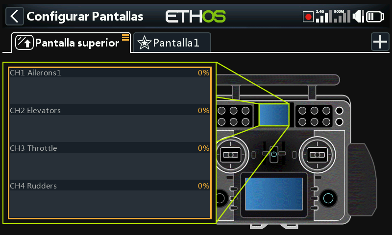

En el ejemplo de arriba se ha seleccionado el widget de Canales.

## Widgets estándar

### Imagen de modelos

Permite visualizar la foto del modelo seleccionado.

En el ejemplo anterior, el widget mostrará la imagen del modelo, que deberá estar guardada en la carpeta /bitmaps/model.

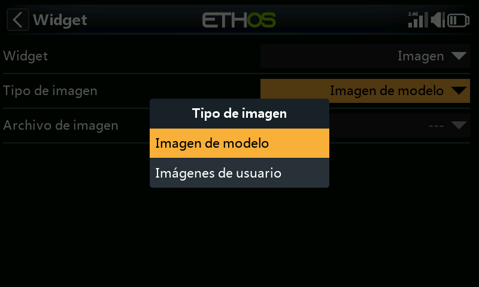

El widget también puede mostrar una imagen definida por el usuario, que deberá estar guardada en la carpeta /bitmaps/user.

### Valor

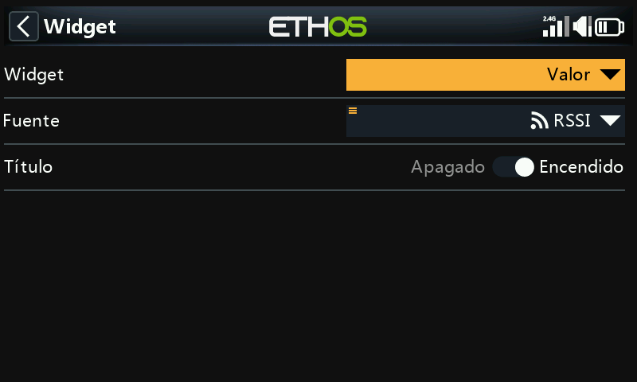

El widget con ‘Valor’ mostrará sencillamente el valor de la Fuente seleccionada.

#### Valor Min/Max

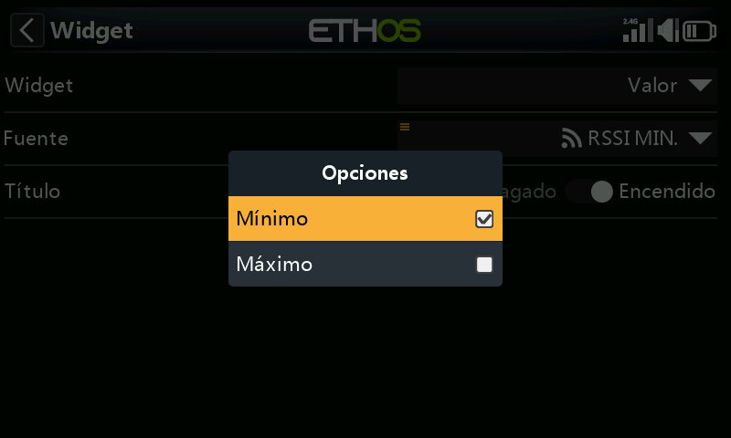

Cuando se muestran valores de telemetría, manteniendo pulsado el sensor después de su selección, le permitirá mostrar sus valores Mínimo y Máximo.

En este ejemplo, se mostrará el valor mínimo de RSSI en el widget de ‘valor’.

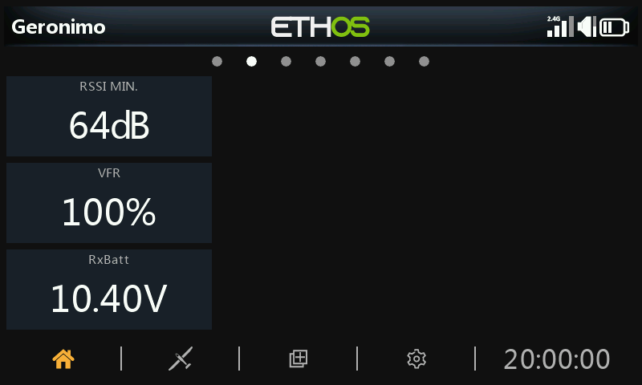

Ejemplos de widgets con ‘valor’, incluyendo RSSI Mín.

### Registros de cronómetro

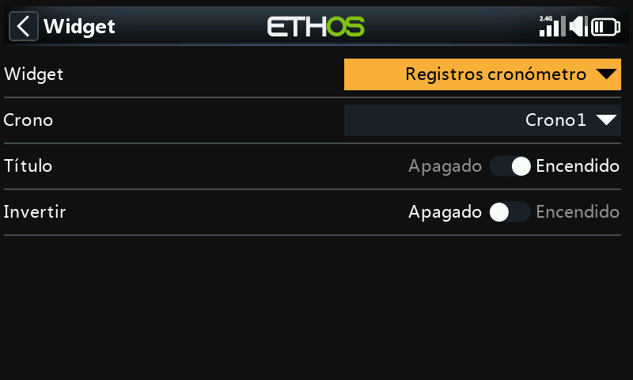

Se pueden seleccionar los cronómetros a registrar. Si se selecciona ‘Invertir’ se pondrá la nueva entrada al principio del registro.

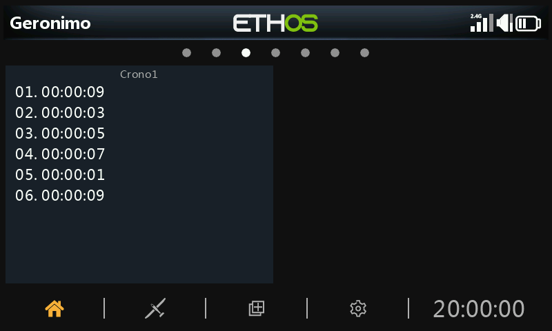

Los registros de cronómetros proporcionan un registro de los valores de cronómetrado. Los valores del mismo se empiezan a escribir cuando se reinicia el temporizador.

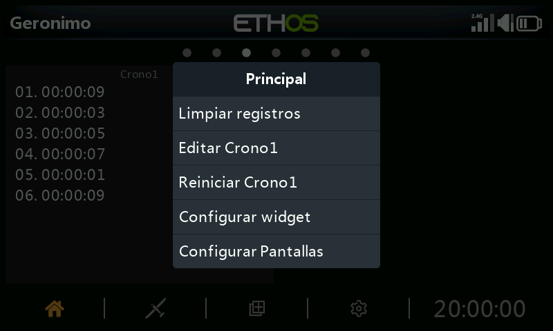

Si realiza una pulsación larga en el widget, aparecen las opciones de arriba: Borrar registros, Editar temporizador(n), Reiniciar temporizador(n), configurar el widget, o configurar las pantallas.

### Mapa GPS

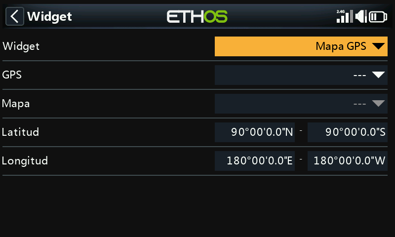

Este widget es compatible con la visualización de mapas GPS. Por favor, consulte el hilo X20 Ethos en rcgroups para más detalles, especialmente el post [#8854](https://www.rcgroups.com/forums/showpost.php?p=47392275&postcount=8854).

### LiPo

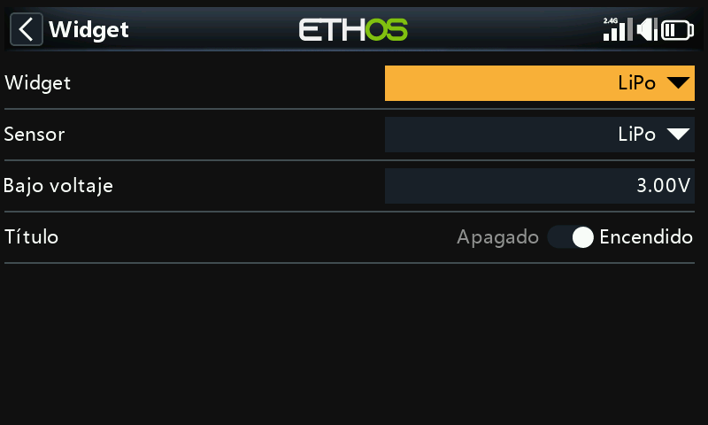

El widget Lipo mostrará la información de voltaje de la Lipo mostrados por los sensores, como por ejemplo el FLVSS.

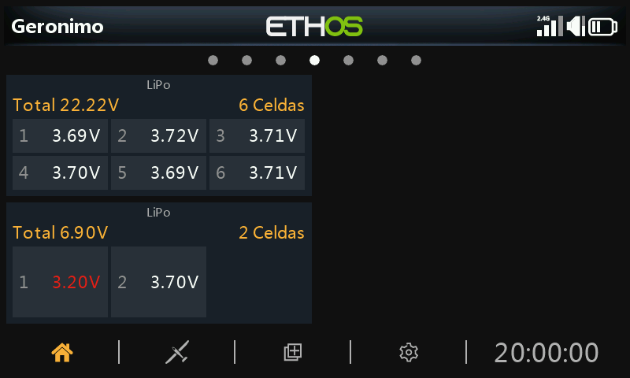

El widget para Lipo muestra el voltaje total de la batería, el número de celdas y el voltaje individual de cada una de ellas.

Si el voltaje de una celda está por debajo del umbral de "Bajo voltaje", los voltajes se muestran en color rojo. En el segundo widget Lipo de arriba, se ajustó el umbral de bajo voltaje a 3.3v con lo que el valor se muestra en rojo.

### Canales

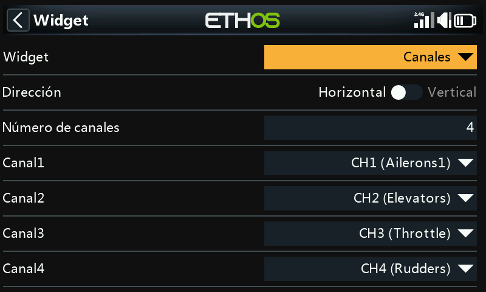

El widget ‘Canales’ permite visualizar hasta 8 canales en formato de gráfico de barras, con barras horizontales o barras verticales.

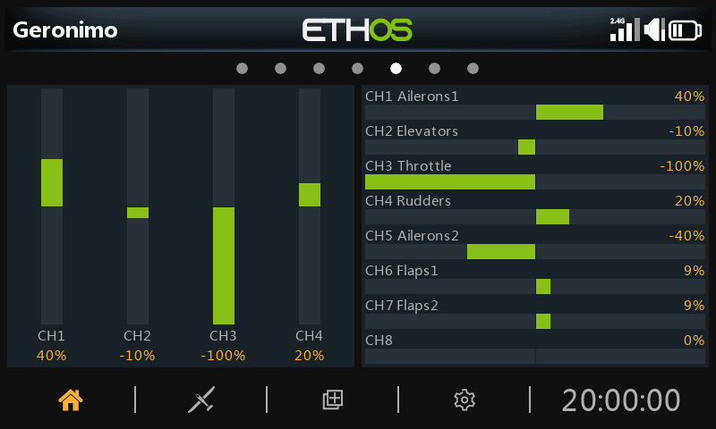

El ejemplo anterior muestra dos widgets de Canales, el de la izquierda muestra 4 canales verticalmente, mientras que el de la derecha muestra 8 canales horizontalmente.

### Gráficos lineales

#### Configuración

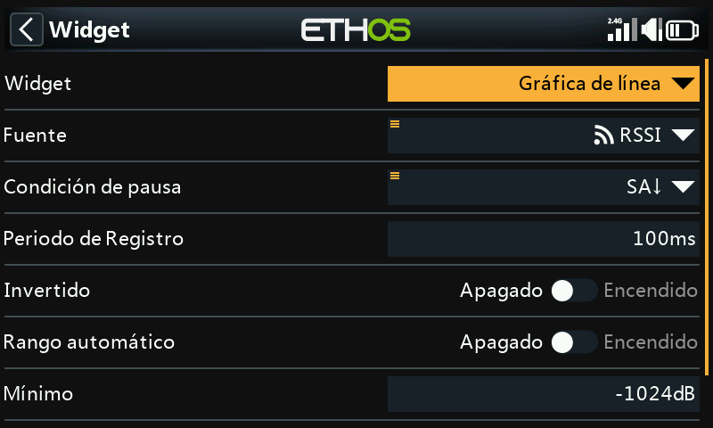

El widget de ‘gráfico de lineas’ permite representar gráficamente la fuente seleccionada.

Tenga en cuenta que el widget reiniciará sus datos cuando se realice un ‘Reseteo del vuelo’.

##### Fuente

Seleccione la fuente que se quiere mostrar en el gráfico

##### Condición de pausa

Seleccione la fuente que se va a usar como condición de pausa. Si no hay ninguna disponible, también puede pausar y resumir la línea del gráfico tocando en el widget cuando está en marcha.

##### Periodo de registro

El periodo de registro puede ajustarse. Con un periodo de 500 ms, el gráfico cubrirá unos 6 minutos antes de empezar a desplazarse fuera de la página, mientras que con 1s cubrirá unos 12 minutos.

##### Invertido

La curva del gráfico puede invertirse.

##### Rango automático

Si el Rango automático está activado, el eje vertical se escalará para ajustarse a la entrada. Si está desactivado, entonces el eje vertical se escalará de acuerdo con los ajustes Mín y Máx. En el ejemplo anterior, el widget superior se ha configurado para Rango automático y el gráfico muestra una oscilación de la fuente de +26% a -22% hasta ese momento.

##### Min/Max

En el ejemplo anterior, el widget inferior tiene el rango automático desconectado y está usando un rango fijo de -100% a +100%.

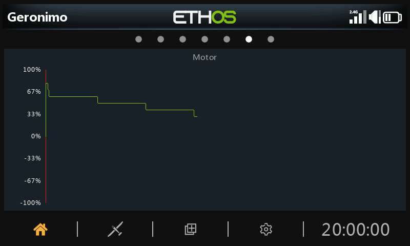

#### Opciones de funcionamiento (Run-time options)

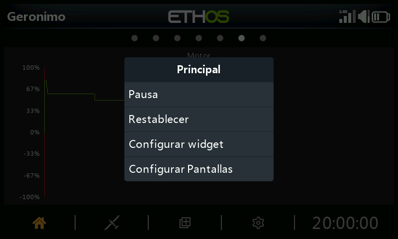

Tocando en el gráfico mientras el widget está funcionando aparecerá un cuadro de diálogo que le permitirá:

- Pausar o resumir el registro
- Reiniciar el gráfico y empezar de nuevo
- Configurar los ajustes del widget
- Ir al menú de la página ‘Configurar pantallas’

### Texto

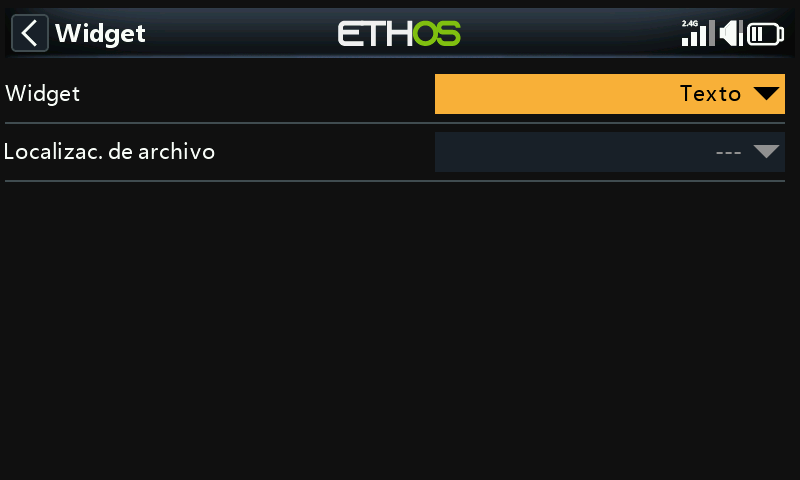

Un widget de texto mostrará el contenido de un archivo de texto. Se permiten formatos de realzado del texto.

El archive debe estar localizado en una carpeta llamada documents/user.

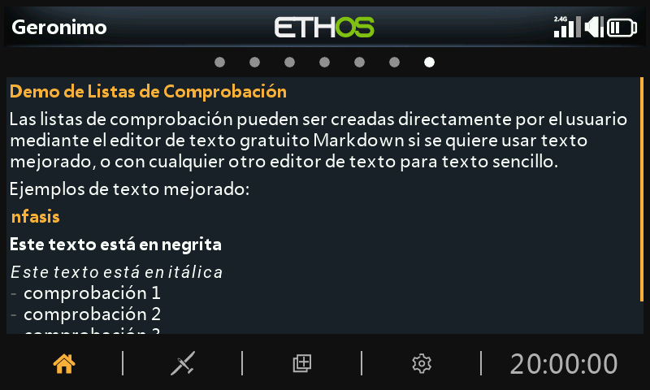

Se mostrará el contenido del archivo.  Se permite el realzado del texto.
