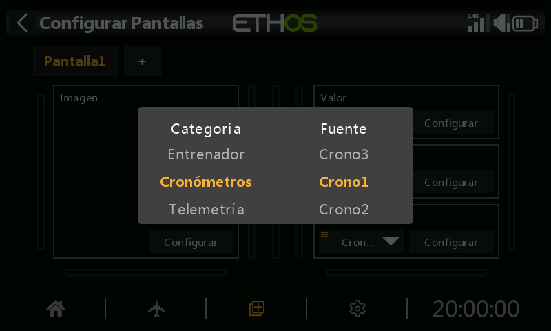

# Pantallas

La pantalla de inicio consta de una o más **pantallas de visualización**, cada una construida a partir de **widgets** que usted mismo coloca y configura. Al pulsar `DISP` se abre el editor de la pantalla actual.

Hay disponibles hasta **ocho** pantallas, cada una partiendo de uno de **trece** diseños (con capacidad para hasta **nueve** celdas de widget). Los widgets pueden mostrar telemetría, pero también cualquiera de otras diecisiete categorías de información: estado del modelo/emisora, temporizadores, canales y más. Se accede a las pantallas configuradas deslizando el dedo o con `PAGE` arriba/abajo; las barras superior e inferior permanecen visibles en todas las pantallas, excepto en un diseño a pantalla completa.

## Añadir un widget

Cada pantalla es una cuadrícula; al tocar una celda vacía se abre el selector de widgets. Los widgets abarcan desde simples lecturas de texto y numéricas hasta indicadores, gráficos y registros completos de telemetría. Una vez colocado, al tocar de nuevo un widget se abre el mismo menú de opciones que se utiliza para redimensionarlo, moverlo o eliminarlo:

Al seleccionar los ajustes propios de un widget se abre un formulario de configuración específico de ese widget. El campo **fuente** —el valor que muestra el widget— utiliza el mismo [selector de fuentes](../getting-started/user-interface-and-navigation.md#choosing-a-source) que el resto de Ethos:

## Tipos de widget {: #widget-types }

**Valor** — una única lectura numérica o de telemetría, mostrada como texto:

La mayoría de las fuentes también admiten reducirse a un **mín** o **máx** en vivo —tras seleccionar la fuente, manténgala pulsada y elija Min o Max—, lo que resulta útil para cosas como el peor RSSI registrado durante un vuelo:

Una vez colocado, se muestra como una lectura simple en la pantalla:

**Bitmap** — muestra una imagen estática (por ejemplo, una foto del modelo) o un conjunto de imágenes que se intercambian según el valor de una fuente (por ejemplo, un icono de batería que cambia con la tensión):

**LiPo** — un indicador de batería específico que lee de un sensor como el FLVSS: tensión total del pack, número de celdas y la tensión de cada celda individual. Al caer por debajo del umbral de **Tensión baja** configurado, la pantalla se vuelve roja; en el ejemplo siguiente, un umbral de 3,3 V se activa en la celda más baja:

**Canales** — hasta 8 canales de salida en forma de gráfico de barras, horizontal o vertical:

**Gráfico de líneas** — traza el valor de una fuente a lo largo del tiempo, reiniciándose con un Reinicio de vuelo:

- **Fuente** — lo que se está representando.
- **Condición de pausa** — una fuente que pausa/reanuda el registro (o simplemente toque el widget en funcionamiento, si no dispone de una fuente libre para esto).
- **Periodo de registro** — intervalo de muestreo; 500 ms cubre aproximadamente 6 minutos antes de desplazarse, 1 s aproximadamente 12 minutos.
- **Invertido** — voltea el gráfico verticalmente.
- **Rango automático** — escala el eje vertical para ajustarse automáticamente a los datos; desactivado, utiliza en su lugar valores fijos de **Mín**/**Máx** (por ejemplo, un rango constante de −100 %…+100 %).

Al tocar un gráfico en funcionamiento aparecen **Pausar/reanudar**, **Reiniciar** (borrar y empezar de nuevo), **Configurar widget** o el acceso directo a **Configurar pantallas**:

**Texto** — muestra el contenido de un archivo de texto Markdown (leído de `documents/user/` — véase el [Gestor de archivos](../system-setup/file-manager.md#top-level-folders)):

**Registro de temporizador** — un registro desplazable de los valores pasados de un temporizador elegido, escrito cada vez que ese temporizador se reinicia (útil para llevar el control del uso de los packs de vuelo a lo largo de una sesión); **Invertir** coloca la entrada más reciente en la parte superior:

Mantenga pulsada una entrada (o el widget) para acceder a **Borrar registros**, editar/reiniciar el temporizador subyacente o saltar a la configuración del widget o de la pantalla:

**Mapa GPS** — traza la posición GPS en vivo como una ruta, para modelos con un sensor GPS (véase el hilo *FrSky - ETHOS Lua Script Programming* en rcgroups, mensaje n.º 8854, para más detalles sobre este widget en concreto):

## Opciones a nivel de pantalla

Más allá de los widgets individuales, cada pantalla tiene sus propios ajustes: tamaño de la cuadrícula del diseño, fondo y qué pantallas se incluyen en el ciclo de `PAGE`:

Una pantalla de inicio completamente configurada combina varios widgets en un único diseño de lectura rápida:

Véase [Pantallas adicionales](additional-displays.md) para añadir más pantallas además de la predeterminada, y [Widgets personalizados](custom-widgets.md) para widgets basados en scripts Lua más allá del conjunto integrado.
