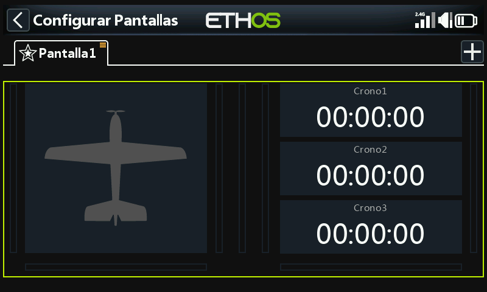
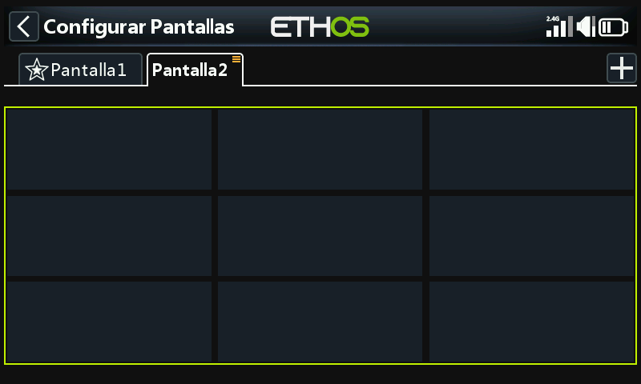

# Añadir pantallas adicional**es**

Pulse el botón "+" junto a la pestaña "Pantalla1" para añadir una pantalla adicional.

Se abrirá un diálogo que le permitirá seleccionar entre 15 distribuciones diferentes (incluyendo pantalla completa y una elección de cuatro pantallas de inicio) con hasta 9 widgets. También puede asignar cualquier pantalla como su pantalla de inicio.

En este ejemplo se ha seleccionado una pantalla de 9 widgets. Toque cualquier widget para configurarlo como se detalló arriba.
