# Operación

## Sección de dispositivos

FrSky Suite admite tres tipos de dispositivos FrSky, es decir, radios Ethos, radios ECOS y controladores de vuelo Aegis. Por favor, consulte sus secciones respectivas a continuación para más detalles.

### Ethos

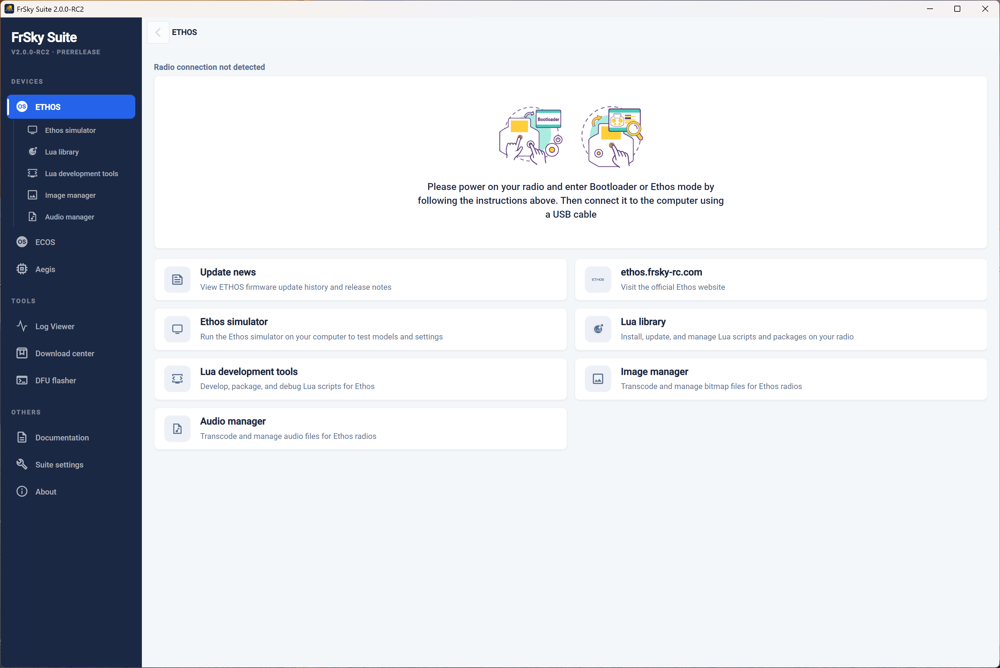

FrSky Suite se abre por defecto en la sección de dispositivos Ethos, con la vista que se muestra arriba si no se ha detectado ninguna radio Ethos al iniciar.

Puede conectar la radio en modo bootloader o mientras está encendida en modo ‘FrSky Suite’. Por favor, para más información consulte la sección [Modos de Conexión USB a PC](#USB Connection To PC modes).

Una vez que se detecta una radio Ethos, sus detalles se mostrarán como en el ejemplo de arriba. El mensaje de estado 'Conexión de radio no detectada' ha sido reemplazado por 'Conectado a X20 Pro' para mostrar que hay un X20 Pro conectada.

#### Información de la radio

##### Conectada

Las versiones actuales del firmware y del bootloader están listadas, con etiquetas rojas de ‘Desactualizado’ o verdes de ‘Actualizado’.

Debajo de eso, un mensaje confirma la compatibilidad del firmware y del bootloader. Por ejemplo, si solo actualizó el firmware, podría recibir mensajes que indiquen que el firmware requiere una versión más nueva del bootloader.

El estado del módulo RF se mostrará junto al panel de 'Información de radio', por favor consulte la sección del módulo RF más abajo.

##### Copia de seguridad y recuperación

Antes de realizar actualizaciones, es prudente hacer clic en la opción  ‘[Copia de seguridad y recuperación](operation.md)’ para hacer copias del estado actual de su radio.

##### Gestionar Ethos

Haga clic en el botón 'Administrar Ethos' para abrir la página de actualización.

El ejemplo de arriba muestra que una X20 Pro está conectado en modo Bootloader. Si quiere, haga clic en el botón ‘Cambiar a Ethos’ para cambiar el modo, por ejemplo, para flashear un receptor o módulo. En general, no es necesario preocuparse por el modo en el que se está, porque Suite cambiará automáticamente entre modos cuando sea necesario.

Se muestran las versiones del firmware, del bootloader y de los archivos de audio (ya sea en la tarjeta SD o en el almacenamiento interno de la radio). La versión del firmware aparece como desactualizada. Las versiones del bootloader y de los archivos de audio están al día.

Por favor, tenga en cuenta que los archivos del sistema en la memoria Flash ahora se actualizan junto con el firmware, así que ya no es necesario gestionarlos por separado.

##### Realizando actualizaciones

##### Opción de actualizar con versiones de prueba

Si quiere actualizar a versiones de prueba del firmware, la configuración del servidor en ‘Ajustes de Suite’ debe cambiarse de ‘Servidor FrSky’ a ‘GitHub’. Por favor, consulta la sección  [Ubicación del servidor](#Server location) más abajo.

##### Selecionar las opciones de actualización

Si la radio no está al día, podrá:

1. Seleccionar la versión que desea, primero eligiendo la rama que prefiera, 'Estable' o 'Versión de prueba', y luego seleccionando la versión deseada, así como los idiomas de pantalla y audio.
2. Entonces puedes 'Escribir todos los componentes' haciendo clic en el botón 'Escribir todos los componentes'.
3.  Alternativamente, hacer clic en el botón de flecha hacia abajo a la derecha, que abrirá una lista desplegable en la que se mostrarán las opciones alternativas para escribir todos los componentes obsoletos, o solo escribir individualmente el firmware y los archivos del sistema (necesarios para ejecutar el firmware), el bootloader o los archivos de audio.	

##### Instalar los updates

Una vez que se hayan seleccionado el alcance deseado de la actualización, haga clic en la opción elegida para continuar. En el ejemplo de arriba hemos seleccionado la opción 'Escribir firmware y archivos del sistema'.

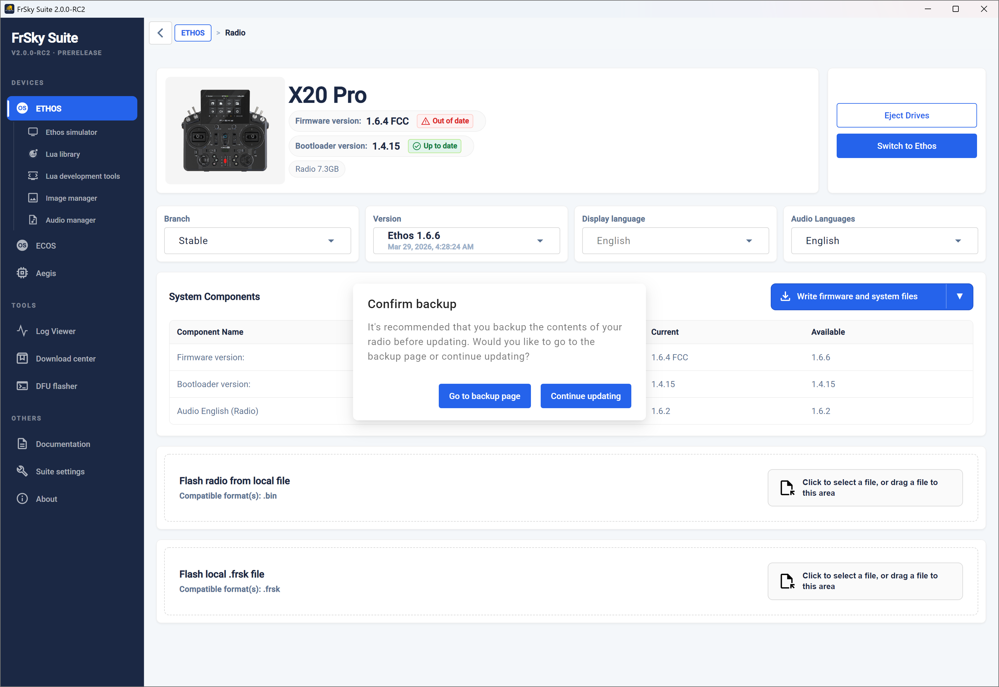

Después de hacer clic en la opción 'Escribir firmware y archivos del sistema', se le pedirá que primero vaya a la página de copias de seguridad y realice una copia de seguridad completa antes de continuar. Por favor, consulte la sección de [Copia de seguridad y recuperación](operation.md).

Esto es especialmente importante porque después de la actualización, sus archivos de modelo se actualizarán a la nueva versión en cuanto se carguen. Este proceso es irreversible, así que una vez actualizados, los modelos ya no se podrán cargar si decide volver a una versión anterior de su radio. Después de degradar su firmware, necesitará recuperar sus modelos, etc., desde tus copias de seguridad.

Habiendo hecho una copia de seguridad, vuelva a la página 'Administrar Ethos' y haga clic en la opción 'Escribir firmware y archivos del sistema', luego selecciona la opción 'Continuar actualizando'.

Si tu módulo RF interno no está en la versión 3.0.1 o posterior, necesitará actualizar el módulo RF antes de poder continuar con la instalación de la versión 1.6.0 o superior. Haga clic en ‘Administrar módulo interno’ en la página principal para actualizar el módulo RF interno, luego regrese a esta página para continuar.

Se mostrará una barra de progreso en la página, así como en la radio.

Al completarse, se mostrará un mensaje de ‘Actualización con éxito’. La versión del firmware ahora aparecerá como actualizada.

De manera similar, se pueden ejecutar las opciones alternativas para escribir de manera individual los componentes obsoletos, el cargador de arranque, o los archivos de audio.

Siempre es prudente expulsar las unidades manualmente con el botón 'Expulsar unidades' antes de desconectar el cable USB.

##### Actualizar la radio desde un archivo local

##### Actualizar desde un archivo local .frsk

##### Expulsar unidades

Haga clic en el botón ‘Expulsar unidades’ para desconectar la radio.

#### Módulo RF

El administrador del módulo RF se usa para actualizar el firmware del módulo RF.

##### Gestionar módulo interno

Selecciona la versión que se desee (normalmente la más reciente). Los detalles del firmware de la versión seleccionada se muestran en el panel de la derecha.

Haga clic en ‘Flash’ para escribir el firmware en el módulo RF interno.

Al finalizar el proceso aparecerá un cuadro de diálogo 'FRSK se ha actualizado correctamente'.

#### Copia de seguridad y recuperación

Usando la función de 'Copia de seguridad y recuperación', se puede guardar en el disco una copia de seguridad de los modelos y configuraciones del radio, o se puede restaurar una copia de seguridad previamente guardada al radio. Los modelos no son compatibles con versiones anteriores, así que los archivos de modelos más antiguos tienen que restaurarse desde el PC haciendo una degradación a un firmware más antiguo.

##### ¡Advertencia!

¡La recuperación NO restaura el firmware! Después de recuperar sus modelos y configuraciones, todavía tienes que usar Suite para reescribir el firmware usando la versión que coincida con su copia de seguridad. Por favor, consulte la sección  ‘[Actualizar el firmware](#Updating the Firmware)’ descrita más arriba.

##### Ubicación de la copia de seguridad

Haga clic en el ícono de la carpeta para buscar y seleccionar la ubicación de respaldo deseada. La ruta de respaldo se guardará para cada tipo de radio.

La fecha y hora de la última copia de seguridad se muestra debajo de la ubicación.

##### Iniciar copia de seguridad

Selecciona los modelos y las áreas de 'Almacenamiento interno' que se van a respaldar, y agrega algunos comentarios relevantes.

Haga clic en ‘Iniciar copia de seguridad’ para crear una copia de los archivos de modelo y las áreas de almacenamiento seleccionadas en la radio. La versión actual de Ethos se registrará al crear la copia de seguridad.

##### Restaurar datos

Haga clic en 'Restaurar datos' para restaurar los archivos de modelo previamente guardados en la radio. Esto puede ser necesario cuando se degrade el firmware de la radio a una versión anterior.

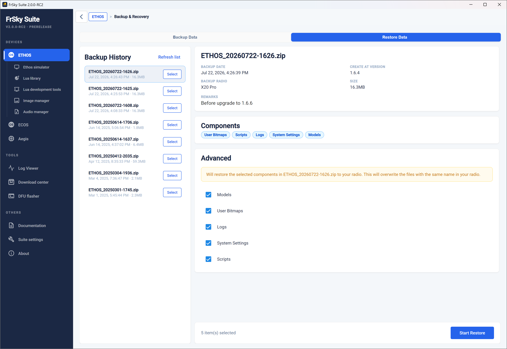

##### Historial de copias de seguridad

El historial de copias de seguridad muestra todas las copias encontradas en la ubicación de respaldo seleccionada. Seleccione una para revisar sus datos de respaldo.

El panel derecho mostrará los detalles como la fecha de la copia de seguridad, la versión de Ethos en la que se creó, la opción de copia de seguridad, el tamaño de la copia y los comentarios guardados de la copia de seguridad.

También se listarán los componentes guardados en la copia de seguridad.

##### Recuperación

Los componentes seleccionados con la opción ‘Avanzado’ se restaurarán en la radio. Tenga en cuenta que los archivos existentes con el mismo nombre se sobrescribirán durante el proceso de recuperación.  
  
Haga clic en ‘Iniciar restauración’ para restaurar los archivos de respaldo seleccionados en su radio.

#### Noticias sobre actualizaciones

Haga clic en 'Noticias sobre actualizaciones' para ver el historial de actualizaciones de firmware de Ethos y las notas de la versión.

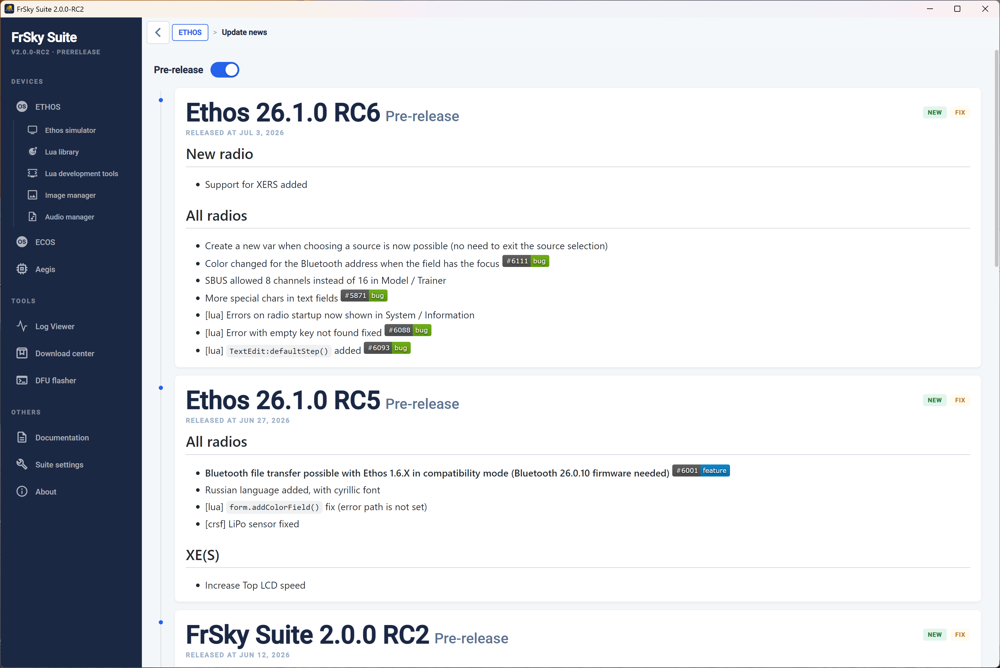

Active ‘Pre-lanzamientos’ en la parte superior de la página para incluir versiones de prueba en el historial de actualizaciones y notas del firmware Ethos.

#### ethos.frsky-rc.com

Haz clic en el botón ‘ethos.frsky-rc.com’ para visitar el sitio web oficial de Ethos.

El sitio web incluye las siguientes categorías:

- Una introducción a Ethos, 
        - Una sección de ‘Primeros Pasos’ que incluye información sobre el proceso de actualización de Ethos y enlaces de descarga para FrSky Suite, etc.
        - Una sección de ‘Cómo usar Ethos’ que incluye guías importantes, preguntas frecuentes y un sistema de tickets para soporte
        - El 'Centro de Recursos Ethos', que incluye Plantillas de Modelo, Scripts LUA, Widgets, etc.
        - El proceso de colaboración con terceros y los detalles de la aplicación

### Simulador Ethos

El simulador Ethos le permite explorar las capacidades de radio y probar la funcionalidad o las mejoras planeadas del modelo sin necesidad de tener la radio real. También le permite explorar las nuevas versiones antes de actualizar su radio.  
  
Para comenzar, seleccione el tipo de radio a simular, la versión de lanzamiento de Ethos deseada y el protocolo RF. Luego haga clic en ‘Iniciar Simulador’.

Tenga en cuenta que las versiones Nightly previas al lanzamiento solo se ofrecerán si se ha seleccionado 'GitHub' como la [Ubicación del servidor](#Server location) en la pestaña 'Configuración de la suite'.

#### Configuración simple

Si no se encuentra información de radio válida, se c0omenzará una secuencia de inicialización.

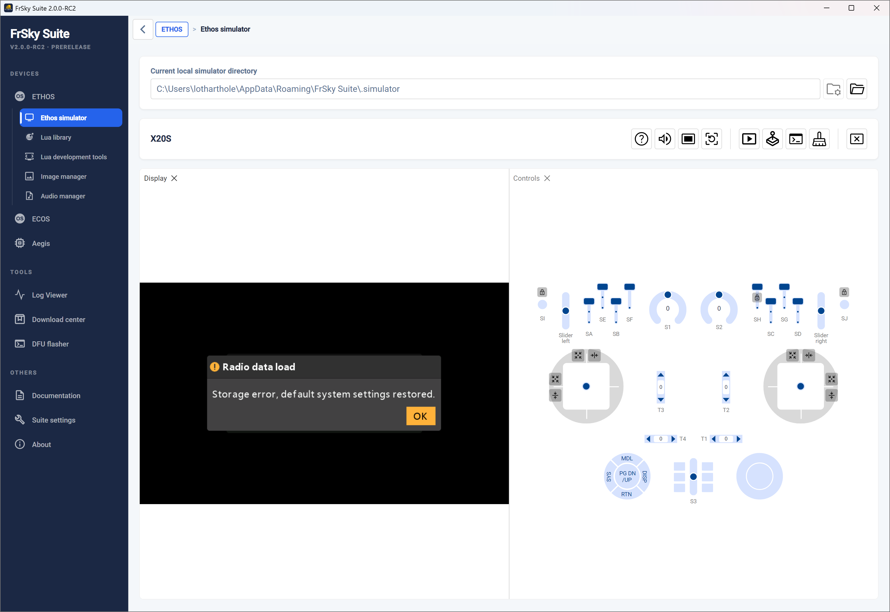

For a quick exploration simply use the new model wizard that starts after clicking OK. This will allow you to explore the simulator with minimum effort or to evaluate Ethos before purchasing an FrSky radio.

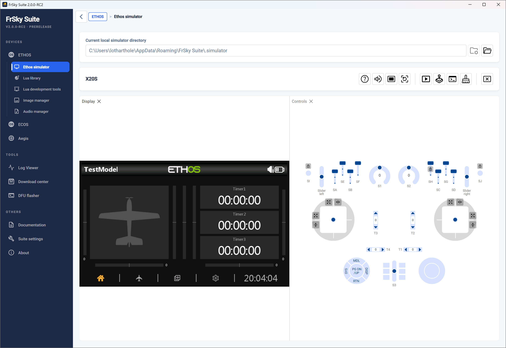

En el ejemplo de arriba, el asistente para el nuevo modelo se ha completado y el modelo se llama ‘TestModel’.

El panel 'Pantalla' a la izquierda imita la pantalla LCD de la radio, mientras que el panel ‘[Controles](#Controls Panel)’ imita los controles físicos de la radio elegida.

En la parte superior de la ventana se muestra el 'directorio local actual del simulador'.

#### Configuración recomendada

Es mejor replicar la configuración de su radio en el simulador. Esto proporcionará la misma funcionalidad que tiene en su radio, facilitando probar mejoras en sus modelos sin afectar su entorno de vuelo o de modelismo hasta que todo funcione como planeado.

Alternativamente, puede crear y probar un modelo completamente nuevo, quizás basándolo en una de sus plantillas, o haciendo un clon de un modelo existente y modificándolo. Estos enfoques maximizan la reutilización sin tener que programar un modelo desde cero. Una vez completado, el archivo de modelo .bin se puede copiar desde la carpeta /models en la ruta del simulador a la carpeta /models del radio, siempre que el simulador no esté ejecutándose en una versión de firmware Ethos más reciente.

Los pasos recomendados para configurarlo son:

1. Haga una copia de seguridad de su radio usando la función  [Copia de Seguridad y recuperación](operation.md) de la Suite.

2. Es mejor completar primero el asistente de nuevo modelo para un modelo simple. Esto facilita encontrar y reemplazar esta configuración con la copia de seguridad de su radio. Consulta la sección ‘Configuración simple’ arriba.

3. Determine la ruta del archivo del simulador haciendo clic en el ícono de ayuda. El cuadro de diálogo emergente de ayuda explica la estructura de la ruta del archivo del simulador (mire arriba).  
  
También se muestra el ‘Directorio local actual del simulador’ en la parte superior de la ventana.

4. Usando el Explorador de Windows, busque y navegue hasta la carpeta de la radio elegida en la estructura de archivos del simulador. Un ejemplo de estructura se muestra arriba.

5. Importante: Cierre FrSky Suite antes de continuar.

Dentro de la carpeta de la radio que elegió, reemplace el contenido actual (es decir, la carpeta de modelos y radio.bin) con su copia de seguridad de la radio. (Si deja la carpeta de modelos en su lugar, el contenido se combinará con los modelos de su copia de seguridad de la radio). Arriba se muestra un ejemplo de la estructura, que debería resultarle muy familiar ya que es la misma que la de su radio.

6. Reinicie FrSky Suite y el simulador.

Debería comenzar con el modelo que estaba en su radio cuando hizo la copia de seguridad. En este ejemplo, un Spitfire era el modelo actual.

7. Abra el panel de la consola haciendo clic en el ícono ‘Abrir panel de consola’. Se abrirá junto al panel de visualización.

8. Arrastre la pestaña del panel 'Consola' hacia la parte inferior de la ventana de la Suite hasta que aparezca una barra sombreada delgada a lo largo de ambos paneles justo en la parte inferior. El panel 'Consola' debería ocupar ahora la mitad inferior del simulador, lo que facilita leer líneas largas en el registro, mientras se mantiene visible el panel de Pantalla y Controles. La consola es útil para confirmar la secuencia de inicio del simulador y para monitorear eventos y mensajes de error.

#### Barra de tareas del simulador

La barra de tareas del simulador tiene los siguientes controles:

##### General

	Ayuda

	Silenciar/Activar altavoz

	Recargar simulador

##### Panel controls

	Abrir panel de pantalla (imita el LCD de la radio)

	Abre el panel de controles (imita los controles de radio)

	Abre el panel de la Consola que muestra un registro de texto de la ejecución del simulador

	Borrar la salida de la consola

##### Controles Macro

	Ejecutar macro - Pide la ruta de sus macros, luego muestra cualquier macro encontrada y ofrece ejecutar una o más.

	Se empezará a ejecutar la macro cargada

	Ejecutará una línea de la macro a la vez

	Pausará la macro

	Detiene la ejecución de la macro

##### Salir

	Cierra el simulador

#### Controls Panel

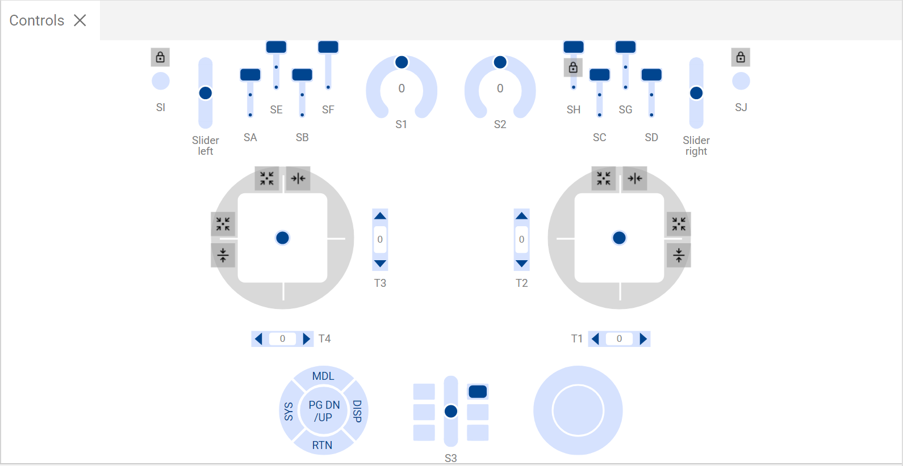

El panel de 'Controles' imita los controles físicos de la radio elegida.

##### Gimbals

Las palancas se pueden manejar arrastrándolos con el ratón. Durante la depuración es útil limitar o restringir el movimiento de las palancas.

	Centrará automáticamente el joystick en uno o ambos ejes.

	Restringirá únicamente el movimiento de la palanca al plano vertical.

	Restringirá únicamente el movimiento de la palanca al plano horizontal.

##### Interruptores momentáneos y botones

	Bloqueará los interruptores y los botones momentáneos para que puedan alternarse entre encendido y apagado, pero permanecerán en el estado seleccionado de encendido o apagado para depuración.

### Biblioteca Lua

La biblioteca Lua contiene enlaces de descarga y opciones de instalación para varios herramientas y scripts Lua.

También puede instalar scripts Lua desde un archivo zip local en su radio.

Una vez que haya instalado algunos scripts en la radio, la herramienta de la biblioteca Lua mostrará los scripts instalados en el panel izquierdo y la biblioteca remota en el panel derecho.

### Herramientas de desarrollo Lua

Esta sección le permite ver la documentación de Ethos Lua, acceder a los scripts Lua de demostración, preparar un paquete Lua y también proporciona una terminal para depuración.

#### Documentos Lua

Proporciona un enlace a la guía de referencia Lua de Ethos.

También consulte el hilo de [Programación de Scripts Lua de FrSky - ETHOS Programming](https://www.rcgroups.com/forums/showthread.php?4018791-FrSky-ETHOS-Lua-Script-Programming) en rcgroups para obtener información adicional y scripts y widgets de usuarios.

#### Scripts LUA de demostración

Este botón abre la página web de la comunidad Ethos-Feedback en Github, donde se pueden encontrar enlaces a algunos scripts Lua de demostración que proporcionan ejemplos de programación.

#### Paquete Ethos lua (archivo ZIP)

Este botón abre la página web que describe cómo preparar un paquete ZIP de script Lua para ETHOS que pueda ser reconocido e instalado correctamente por el instalador de la biblioteca Lua.

#### Depuración

La función de depuración proporciona una ventana de registro de depuración para mostrar los rastros Lua de depuración enviados por USB-Serial mientras la radio está en modo Serial.

1. Primero conecte el transmisor a la Suite como de costumbre.

2. Cambie al modo Ethos. Ahora puede editar su lua directamente en la radio, usando el Explorador de Windows o el Finder de macOS y su editor de código favorito.

3. Abra la pestaña de Herramientas Lua de Desarrollo.

4. Haga clic en ‘INICIAR DEPURACIÓN’, con esto se cambiará el transmisor al ‘modo de depuración’, que es el modo serial.

5. Su transmisor se reiniciará y volverá a inicializar los scripts lua. Todas las salidas de impresión de los scripts lua que estén activos en su modelo se envían a la ventana de terminal integrada de Suite a través del modo serial.

6. Si se ha detectado un problema o un error, se utiliza la herramienta de desarrollo para volver al modo Ethos haciendo clic en ‘STOP DEBUG’.

7. El script lua se puede editar de nuevo.

8. El error que se muestra en el ejemplo de arriba ha sido corregido, y se puede confirmar que funciona normalmente.

### Gestor de imágenes

El gestor de imágenes se puede usar para recortar una imagen y ajustar su tamaño antes de transcodificarla al formato Ethos.

Dimensiones:	Como el usuario especifique, pero manteniendo la relación de aspecto.

Formato:	32bit BMP

Espacio de Color:	RGB

Canal Alpha:	Solo se añadirá alfa si es necesario y si la opción está marcada.

Tenga en cuenta que las imágenes a pantalla completa para la X20 son de 800x480 píxeles, y para X18 son de 480x320.

Consulte la sección [bitmaps](#bitmaps) en el Administrador de Archivos para las reglas de nombrado de archivos.

#### Lista para ser transcodificada

Crea la lista de imágenes que se van a transcodificar en el panel izquierdo.  
  
El botón 'Borrar todo' borrará la lista.

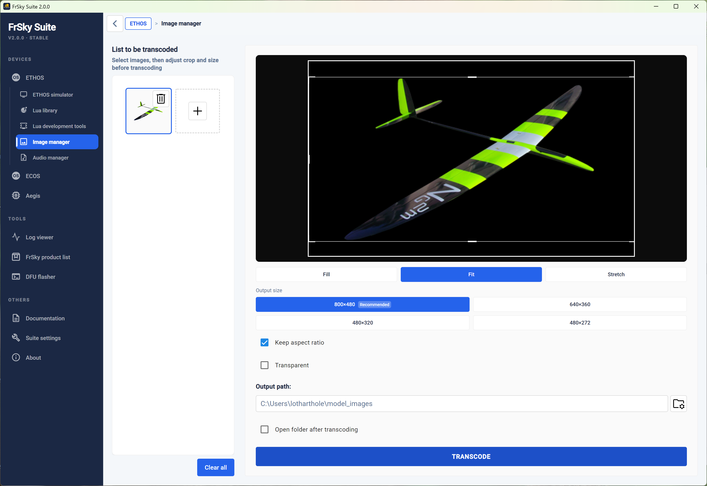

#### Configuración de resolución

Introduzca o seleccione el tamaño de imagen deseado. Generalmente, Ethos redimensionará la imagen automáticamente

#### Mantener relación de aspecto

La relación de aspecto puede estar bloqueada.

#### Transparente

Se añadirá un canal alfa para transparencia solo si aún no está presente.

#### Ruta de salida

Introduzca o busque la carpeta de salida que desee.

#### Abrir carpeta después de la transcodificación

Es una opción para abrir el directorio (carpeta) después de la transcodificación.

#### Transcodificar

El gestor de imágenes transcodificará las imágenes al tamaño deseado y a la opción de Relleno/Ajuste/Estirado seleccionada, y guardará la(s) imagen(es) en la ruta de salida seleccionada.  
  
Nota: Cualquier cambio realizado encima de "Ruta de salida" está vinculado a la imagen seleccionada actualmente. Incluso si cambia a otra imagen en la lista de la izquierda y luego vuelve, esos cambios se mantendrán hasta que la imagen se transcodifique y se exporte.

### Gestor de Audio

El administrador de audio convertirá tus archivos de audio al siguiente formato:

Formato:	PCM lineal

Tasa de muestreo:	32kHz

Canales:	1 (mono)

Bits por muestra:	16 bits, low endian (pcm\_s16le)

#### Lista para ser transcodificada

Crea la lista de archivos de audio que se van a transcodificar en el panel izquierdo.  
  
El botón 'Borrar todo' limpiará la lista.

#### Ruta de salida

Introduzca o busque la carpeta de salida que desee.

#### Transcodificar

El gestor de audio convertirá los archivos de sonido al tamaño deseado y guardará la(s) imagen(es) en la ruta de salida seleccionada.

#### Opciones

Finalmente hay una opción para abrir el directorio (carpeta) después de la conversión.

### ECOS

ECOS es un sistema operativo totalmente nuevo y simplificado desarrollado por FrSky e introducido con el transmisor FrSky EX14. Es una versión más simple y básica derivada del ETHOS OS con pantalla a color táctil, diseñada específicamente para radios con pantalla en blanco y negro, pensadas para principiantes y programas educativos.

Descargue el manual de instrucciones de la radio desde la sección de Descargas de frsky-rc.com para obtener orientación sobre el sistema ECOS.

#### Puerto Com

Conecte su radio ECOS al PC con un cable USB. Seleccione el puerto COM al que se conecta. (Puede que necesite revisarlo en el Administrador de dispositivos.)

#### Seleccione firmware

Usando la ‘Página de productos Frsky’ de abajo, descargue la actualización de firmware que quiera para su radio ECOS. Descomprima la descarga e identifique la versión que necesita, ya sea EU, FCC o SRRC. Seleccione o arrastre ese archivo al área designada en la página.

#### Flash

Después de seleccionar el puerto COM y el archivo de firmware, haga clic en Flash para escribir el archivo en la radio.

### Aegis

Aegis es un nuevo controlador de vuelo de FrSky.  
  
Siga el flujo de la guía en la página de Aegis para actualizar su FC.

## Herramientas

### Visor de registros

El visor de registros se usa para ver los archivos de registro que genera Ethos cuando está activada la función especial 'Escribir registros'.

#### Seleccionar archivo CSV

Seleccione el archivo de registro csv que quiere ver.

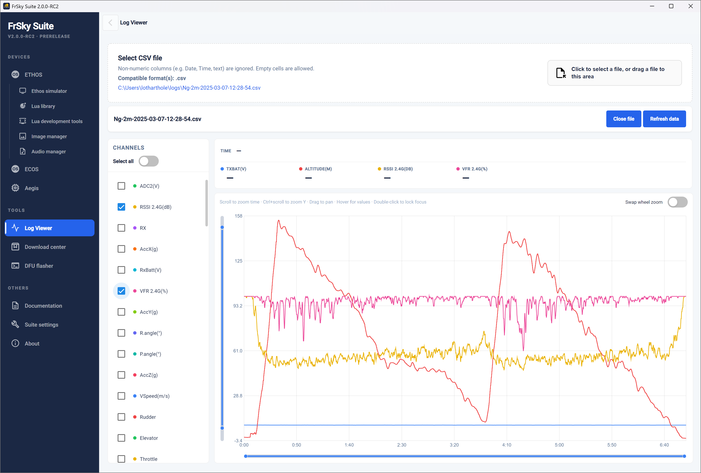

Todo el registro se cargará y se mostrará.

#### Canales

A la izquierda, seleccione los canales que quiera ver.

#### Display

Estos controles se pueden usar para enfocarse en el área de interés:  
	Desplazarse para hacer zoom en el eje X (tiempo)  
	Ctrl + desplazamiento para hacer zoom en el eje Y (o cambiar 'Intercambiar zoom con la rueda')  
	Haga clic y arrastre para mover el gráfico  
	Coloque el cursor para leer todos los valores en ese instante (doble clic para bloquear)

#### Actualizar datos

Haz clic en ‘Actualizar datos’ para recargar el archivo. Esto también eliminará el cursor si lo tiene bloqueado.

### Página de productos Frsky

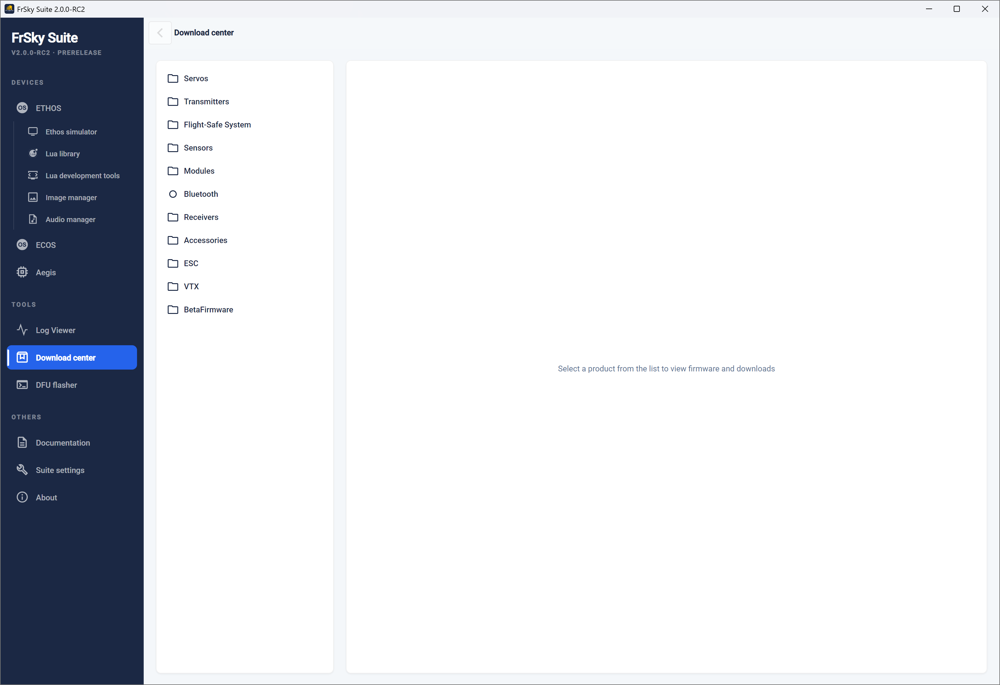

La página de productos Frsky se puede usar para descargar cualquier firmware desde el sitio de descargas de FrSky, y para usar la radio como un proxy para actualizar directamente cualquier módulo, sensor, servo o receptor desde FrSky Suite.

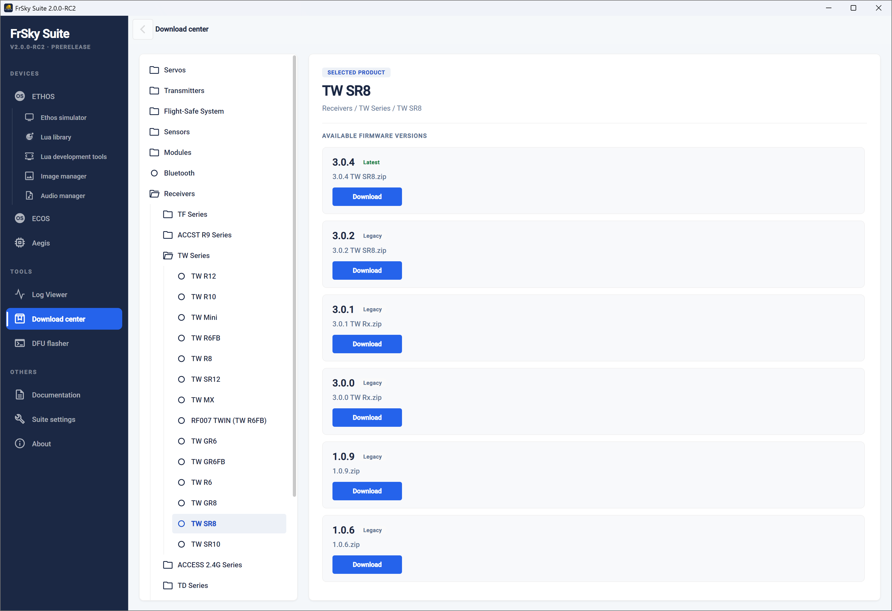

En la lista de productos, navegue para seleccionar el dispositivo que se va a actualizar. En el ejemplo de arriba, se ha seleccionado un receptor TW SR8. Luego, el centro de descargas mostrará los 'recursos' disponibles.

Haciendo clic en el botón de Descargar se abrirá una ventana para elegir la carpeta de destino y descargar el archivo.

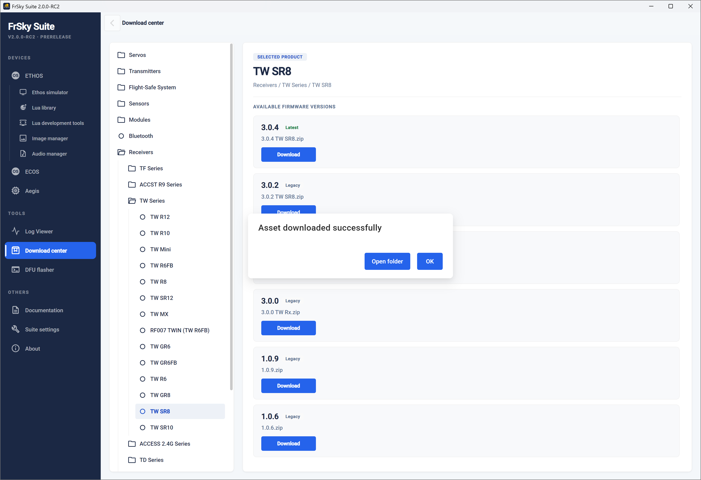

El archivo se ha descargado con éxito.

### DFU Flasher

Haga clic en la pestaña ‘DFU Flasher’.   
  
Conecte su radio apagada al PC con un cable USB. Debería ver un mensaje verde que dice ‘Dispositivo DFU conectado’.   
  
Haga clic en el botón “Seleccionar binario” para buscar el archivo del bootloader que descargó y selecciónelo. FrSky Suite evaluará el archivo seleccionado y le dirá su versión y si es adecuado.  
  
Haga clic en el botón ‘Iniciar flasheo’ para flashear el bootloader seleccionado. Se le informará del éxito cuando haya terminado.

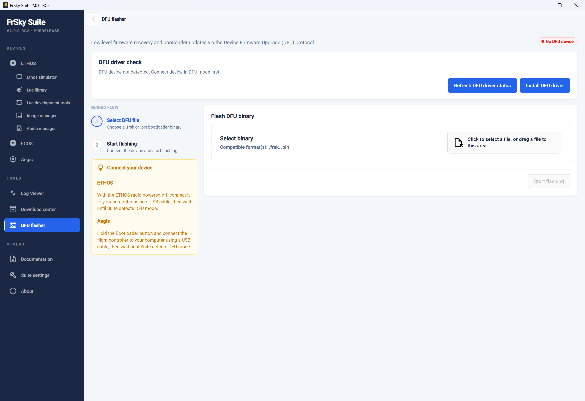

En caso de que aparezca un error de color rojo ‘No hay dispositivo DFU’, necesitará instalar el driver DFU correcto. Puede usar los botones ‘Actualizar estado del driver DFU’ e ‘Instalar driver DFU’ para instalar un driver DFU.  
  
En la mayoría de los PCs con Windows 10 o superior, los sistemas Tandem se conectan usando el driver DFU USB de Windows por defecto y ya están listos para actualizar el bootloader. Sin embargo, las actualizaciones de Windows a menudo reemplazan los drivers con drivers genéricos que pueden no funcionar con la radio.

Revise el Administrador de dispositivos para ver si su dispositivo DFU (es decir, su radio) es reconocido y funciona. Si FrSky Suite no pudo instalar un controlador DFU, otra opción podría ser ver si se puede usar el Impulse Driver Fixer para corregir el controlador. Se puede descargar desde [https://impulserc.com/pages/downloads](https://impulserc.com/pages/downloads). Para más información, también puede ia al post [Ethos Suite Update](https://www.rcgroups.com/forums/showpost.php?p=48919119&postcount=15884) post.

Nota para los usuarios de Horus X10: Windows 10 no instalará por defecto el controlador de dispositivo USB STM32bootloader que se necesita para los sistemas Horus. Será necesario instalarlo con un programa como Impulse Driver Fixer o Zadig.

### Herramienta de reparación

La herramienta de reparación es para los radios X18/S, TW Lite, XE, X20 Pro/R/RS. Si tu radio no puede leer del NAND o no se pueden guardar los ajustes, esta herramienta reformateará el almacenamiento interno.

## Sección de otros

### Documentación

La sección de documentación tiene enlaces a los Manuales de Ethos y a la Comunidad Ethos-Feedback en Github.

#### Manuales Ethos

El manual más actualizado de Ethos se puede descargar aquí.

#### Ethos Github

El botón abrirá la página web de la comunidad Ethos-Feedback en Github, donde podrá acceder a las versiones de Ethos o informar de un problema si cree que ha encontrado un error. Sin embargo, para evitar duplicados, por favor haga una búsqueda previa entre los problemas existentes antes de publicar.

### Ajustes de la Suite

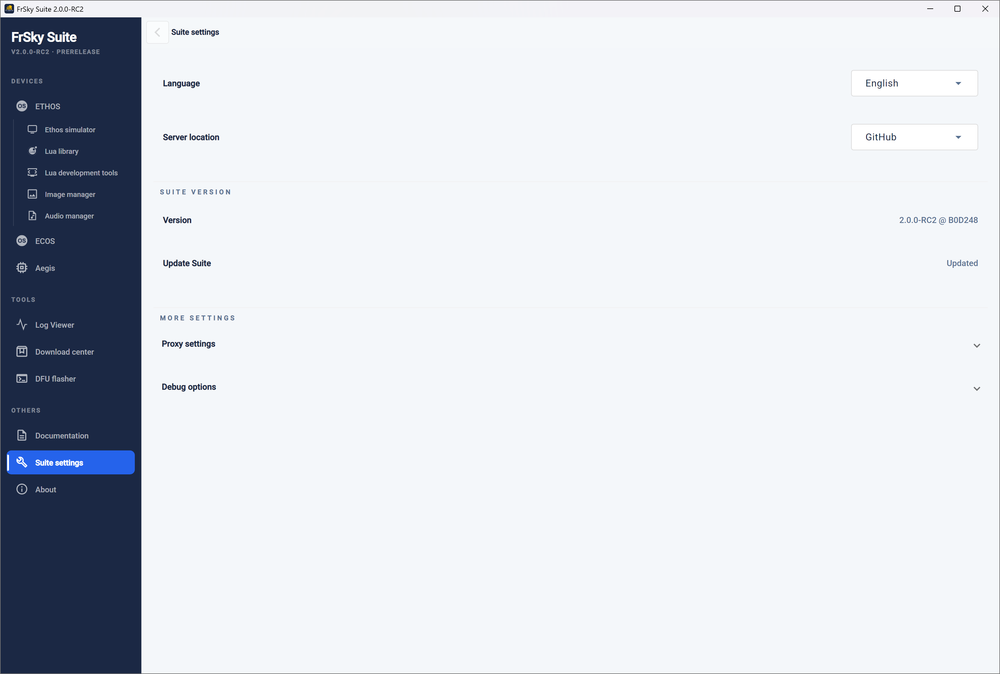

##### Idioma

El idioma de la Suite se puede seleccionar entre checo, alemán, inglés, español, francés, hebreo, italiano, neerlandés, noruego, portugués, esloveno y chino.

##### Localización del Servidor

La ubicación del servidor puede ser Github o el servidor de FrSky. Para la Suite v1.6.0, el servidor se restableció al servidor de FrSky (solo esta vez). Cualquier cambio se guardará después de la modificación.

#### Versión de la Suite

##### Versión

Muestra la versión actual de Suite.

##### Actualización de la Suite

Se indicará ‘Actualizado’ si está al día, o de lo contrario haga clic en el botón para buscar actualizaciones de Suite.

#### Más ajustes

##### Proxy

Aquí se pueden actualizar las configuraciones del proxy.

##### Opciones de depuración

- • Se puede habilitar o deshabilitar un cuadro de diálogo emergente cuando ocurre un error fatal.  
• El modo de depuración de la Suite registrará todas las trazas (no solo los bloqueos) en Suite.  
• Abre la carpeta de registros para revisar los registros de fallos.

### Acerca de

Muestra la versión y la información de copyright.
