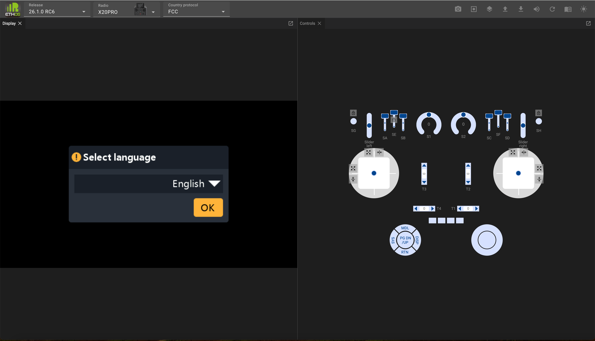
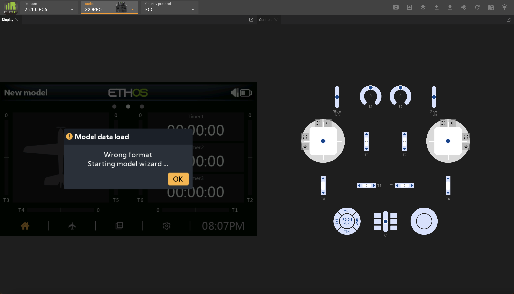
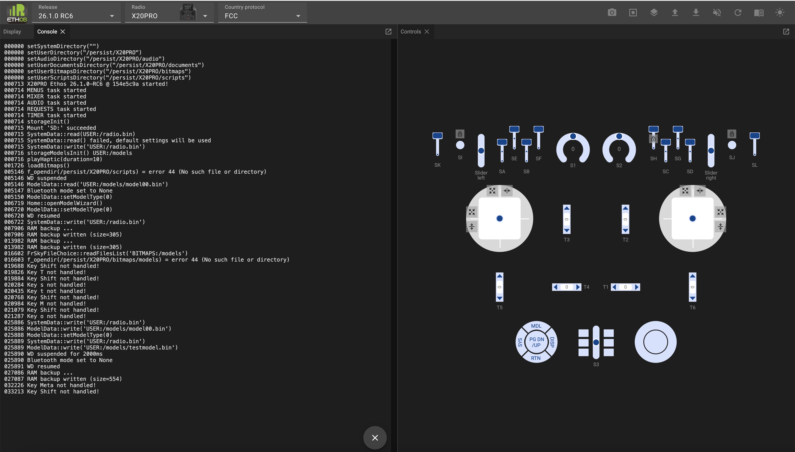
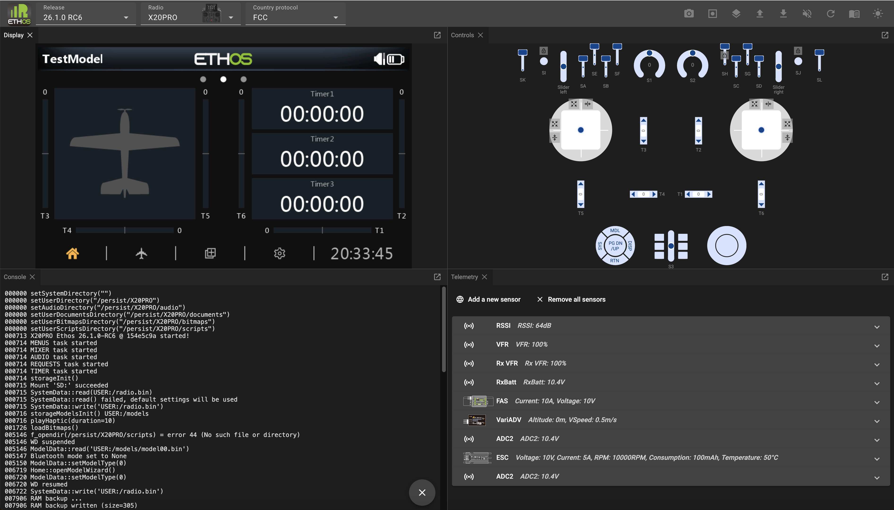
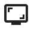

# Simulador Web de Ethos

El simulador web Ethos está construido como WebAssembly (abreviado Wasm), que es una solución portátil que permite su despliegue en la web. Esto significa que se ejecuta dentro de un navegador y no necesita instalación en un PC. Chrome es el navegador recomendado.

El simulador web Ethos le permite explorar las capacidades de la radio y probar la funcionalidad o las mejoras planificadas del modelo sin usar la radio real. También le permite explorar muy fácilmente los nuevos lanzamientos antes de actualizar su radio.

El simulador web se encuentra en [https://ethos-simulator.frsky-rc.com/](https://ethos-simulator.frsky-rc.com/)

La selección inicial predeterminada es la versión 26.1.0-RC6 (al momento de escribir), la radio X20 Pro y el protocolo FCC. Para empezar, seleccione el idioma de la pantalla.

Cuando se cargue por primera vez, no se encontrará ningún dato de modelo válido, así que se comenzará a ejecutar automáticamente el asistente de nuevo modelo.

Complete el asistente para configurar un modelo de prueba básico.

Si la versión predeterminada y la radio no son las opciones deseadas, selecciona la versión de lanzamiento de Ethos que quiera, el tipo de radio que se va a simular y el protocolo RF.

 Haga click en este icono en la barra superior del menu Panel, y seleccione la Consola.

La Consola aparecerá junto al panel de visualización.

Haz clic y arrastre la barra de título de la Consola, y arrástrela hacia abajo. Mueva el ratón hasta que la Consola ocupe el cuadrante inferior izquierdo.

La consola es útil para confirmar la secuencia de inicio del simulador y para monitorizar eventos y mensajes de error.

Haga clic en el icono de Paneles de nuevo, y repita con el panel de Telemetría, moviéndolo al cuadrante inferior derecho.

En el panel de Telemetría, haga clic repetidamente en ‘Agregar un nuevo sensor’ y añada los sensores a los que quiera acceder en sus simulaciones.

 Haga click en este icono para guardar sus sensores para futuras sesiones, y seleccione ‘Guardar configuración de telemetría’. La configuración de telemetría se guardará en un archivo llamado ‘telemetry.json’ en la carpeta de descargas. Muévelo a un lugar conveniente. En las sesiones posteriores del simulador, haga clic en el ícono de ‘Cargar’ y seleccione ‘Cargar un archivo JSON de telemetría’, luego busque su en el archivo ‘telemetry.json’ guardado.

Ahora está listo para empezar a simular. El navegador recordará la disposición de sus paneles, así que no necesitará seguir corrigiéndola.

### Configuración recomendada

Es mejor replicar la configuración de su radio en el simulador. Esto proporcionará la misma funcionalidad que tiene en su radio, facilitando probar mejoras en sus modelos sin afectar su vuelo o entorno de modelismo hasta que todo funcione como planeado.

Los pasos recomendados para la configuración son:

1. Haga una copia de seguridad de su radio usando la función de [Copia de seguridad y recuperación](operation.md) de la Suite.

2. En el menú de Subir, seleccione 'Subir una copia de seguridad de la radio' y busque el archivo de copia de seguridad que guardó. (Consulte los menús a continuación.)

3. Debería empezar con el modelo que estaba vigente en su radio cuando hizo la copia de seguridad. En este ejemplo, un planeador Ng2 era el modelo vigente.

Con su entorno de radio acostumbrado, ahora puede crear y probar un modelo completamente nuevo, tal vez basándolo en una de sus plantillas, o haciendo un clon de un modelo existente y modificándolo. Estos enfoques maximizan la reutilización sin tener que programar un modelo desde cero. Una vez completado, utilice la opción 'Descargar un archivo de modelo' para bajar el archivo .bin del modelo a su ruta de descargas. Luego cópielo a su radio.

### Barra de tareas del simulador

The simulator task bar has the following controls:

	Captura de pantalla (a la carpeta de descargas)

	Iniciar grabación (graba una macro – más allá del alcance de este resumen)

	Paneles (lista los paneles que aún no se han abierto)

	Subir… (ver menú abajo)

	Descargar... (ver menú abajo)

	Audio Activado/Desactivado

	Reiniciar simulador

	Documentación (contiene un enlace al manual más reciente)

	Modo claro/oscuro

##### Menú de subidas

	Sube un archivo de modelo (.bin)

	Sube una copia de seguridad de la radio (.bin)

	Sube un paquete de audio (.zip)

	Sube un plugin de Lua (.zip)

	Sube un archivo de traducciones CSV (.csv)

	Sube un archivo de telemetría JSON (.json)

	Inicia una macro (.zip)

##### Menú de descargas

	Guarda el archivo del modelo actual (.bin)

	Edita el modelo actual

	Edita el archivo del modelo actual (JSON)

	Guarda todas las capturas de pantalla (navegua a la carpeta de destino, guarda como .png)

	Guardar una copia de respaldo de la radio (.zip)

	Guardar la configuración de la telemetría (.json)

##### Panel de Controles

El panel de 'Controles' imita los controles físicos de la radio elegida.

###### Gimbals

Las palancas se pueden manejar arrastrándolas con el ratón. Durante la depuración es útil limitar o restringir el movimiento de las palancas.

	Alineará automáticamente la palanca en uno o en ambos ejes.

	Restringirá el movimiento de las palancas al sentido vertical únicamente.

	Restringirá el movimiento de las palancas al sentido horizontal únicamente.

###### Interruptores y botones momentáneos

	Bloqueará los interruptores y los botones momentáneos para que puedan alternar entre encendido y apagado, pero permanecerán en el estado seleccionado de encendido o apagado para depuración.
