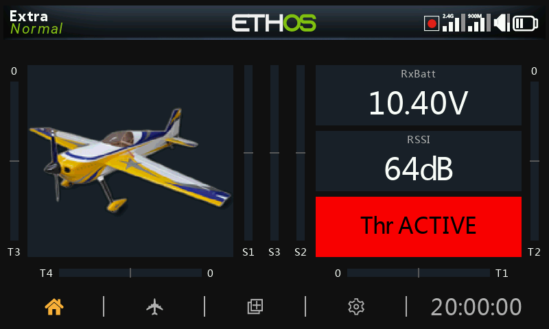
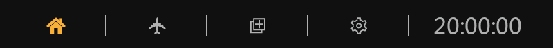

# Vistas principales

## Pantalla de inicio

La pantalla de inicio es lo que se ve cuando no hay ningún menú abierto: un conjunto
de hasta **ocho** pantallas que el propio usuario configura (consulte
[Pantallas](../displays/index.md)), entre las que se pasa mediante un gesto táctil o
con la tecla `PAGE`. Un modelo recién creado empieza con una sola pantalla que muestra
una imagen del modelo, tres widgets de cronómetro y los indicadores de los compensadores
y los pots; a partir de ahí, todo lo que contiene puede configurarlo el usuario.

Las pantallas normalmente comparten las barras superior e inferior descritas más abajo,
pero también existe la opción de tener una pantalla completa, ocultando ambas barras.

## La barra superior

La barra superior muestra el nombre del modelo a la izquierda, así como el Modo de Vuelo
activo si está configurado, y a la derecha una fila de iconos de estado:

- Si el registro de datos está activo
- Icono de Entrenador (Maestro o Esclavo) según corresponda
- RSSI — enlace 2.4G
- RSSI — enlace 900MHz (si hay instalado un módulo de doble banda o de largo alcance)
- Volumen del altavoz
- Estado de la batería de la radio

Al tocar los iconos del altavoz o de la batería, aparecerán directamente los paneles de
control correspondientes: [General](../system-setup/general.md) (Audio, etc.) o
[Batería](../system-setup/battery.md).

### Alertas de error

Cuando Ethos detecta un error, en la barra superior aparecerá un icono de alerta
consistente en un triángulo rojo: las causas más habituales son los errores de los
scripts Lua, un error en el backup de la RAM o que se haya cargado un firmware
nightly/inestable. El detalle que hay detrás del aviso se muestra siempre en la página
**System → Info**, en la misma página que el tiempo de uso de la radio y los
[registros de errores](../system-setup/information.md).

## La barra inferior

La barra inferior tiene cuatro pestañas para acceder a las funciones de nivel superior:
**Inicio**, **Configuración del Modelo**, **Configurar Pantallas** y **Configuración del
sistema**, con la hora del sistema a la derecha (tocando la hora se accede directamente a
[Fecha y hora](../system-setup/date-and-time.md)).

## El área de widgets

La zona central de cada pantalla está formada por **widgets**: imagen del modelo,
cronómetros, datos de telemetría, barras de compensadores y pots, y mucho más, todos ellos
colocados y configurados por el usuario. Consulte [Pantallas](../displays/index.md) para
saber cómo añadir, mover y configurar los widgets, y
[Pantallas adicionales](../displays/additional-displays.md) para añadir más pantallas
además de la única que hay por defecto.
