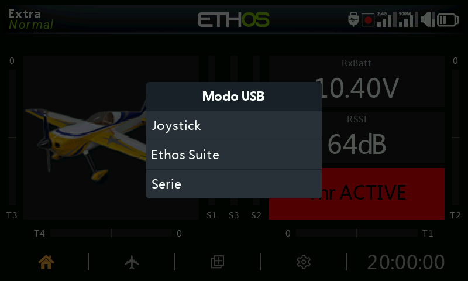

# Modos de conexión USB

Lo que hace una conexión USB a un PC depende de cómo estuviera alimentada
la radio en el momento de conectarla.

## Modo apagada

Conectar la radio a un PC mediante USB **estando apagada** la pone en modo
DFU, que se utiliza para grabar el propio bootloader.

## Modo bootloader {: #bootloader-mode }

Encienda la radio **manteniendo pulsado `ENT`** para arrancar en modo
bootloader (la pantalla muestra "Bootloader"). Al conectar el USB en ese
momento, el estado cambia a "USB Plugged" y el PC monta **dos** unidades:
la memoria flash interna de la radio y el contenido de la SD card/eMMC.
Este es el modo para leer y escribir archivos directamente en cualquiera de
las dos áreas de almacenamiento, y también es la forma en que [Ethos
Suite](../ethos-suite/index.md) actualiza el firmware de la radio —
consulte la sección Modo bootloader de Ethos Suite.

## Modo encendida

Conectar el USB con la radio **encendida normalmente** hace que aparezca un
selector de modo:

- **Joystick** — presenta la radio como un joystick USB HID, para manejar
  simuladores de vuelo en el PC.
- **FrSky Suite** — pone la radio en "modo Ethos" para la comunicación
  con [Ethos Suite](../ethos-suite/index.md).
- **Serial** — envía las trazas de depuración de Lua por USB-serie
  (115200 bps). La pestaña Lua Development Tools de Ethos Suite dispone de
  un terminal integrado para mostrarlas; puede que sea necesario un
  controlador de puerto COM virtual en Windows.
