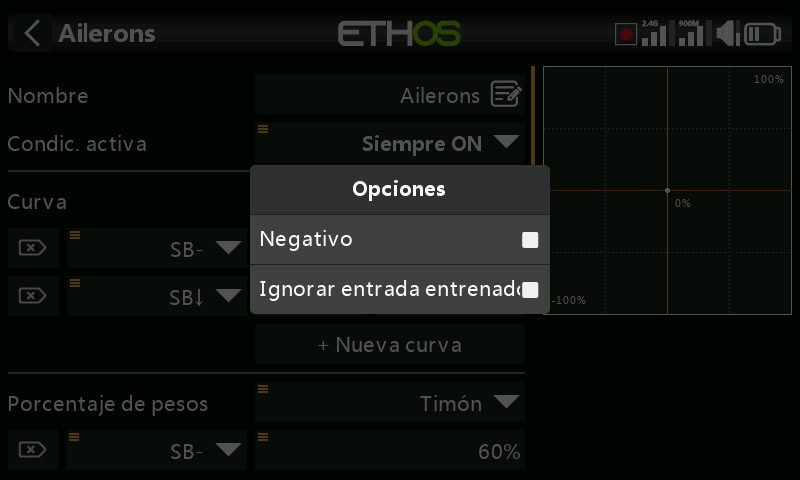

# Interfaz de usuario y navegación

Ethos puede manejarse por completo con el **encoder rotativo** de la derecha
(gírelo para mover el resaltado, púlselo para `ENT`) y la tecla `RTN` para
salir de un menú: la pantalla táctil, en los modelos que la incorporan, es un
atajo para las mismas acciones, no una forma de trabajo distinta. `MDL`,
`DISP` y `SYS` acceden directamente a Configuración del modelo, Configurar
pantallas y Configuración del sistema respectivamente (las mismas tres
casillas de la barra inferior); una pulsación larga de `RTN` desde cualquier
lugar devuelve directamente a la pantalla de inicio.

## El menú de reinicio

Una pulsación larga de `ENT` desde la pantalla de inicio abre un menú de
reinicio:

- **Reset flight** — reinicia la telemetría, los temporizadores y los
  interruptores de función, y vuelve a ejecutar la [lista de
  verificación](../model-setup/checklist.md) previa al vuelo.
- **Reset telemetry** — reinicia únicamente la telemetría.
- **Reset timers** — reinicia únicamente los temporizadores.
- **Lock touchscreen** — también accesible pulsando `ENT` + `PAGE`
  simultáneamente durante un segundo desde la pantalla de inicio, o como
  disparador de una [función
  especial](../model-setup/special-functions.md).

## Controles de edición

**Añadir elementos funcionales** — un temporizador, interruptor lógico,
función especial, curva o variable se crea tocando el **+** situado junto a
los encabezados de columna del menú correspondiente. En una emisora sin
pantalla táctil, resalte un elemento existente, pulse `ENT` y elija **Add**
en el menú: la misma opción está disponible también en las emisoras táctiles.

### Teclado virtual

Al tocar cualquier campo de texto (o pulsar `ENT` sobre él) se abre el
teclado en pantalla. La tecla de retroceso borra a la izquierda del cursor;
`PAGE` borra a la derecha y, una vez que el cursor llega al final del texto,
continúa borrando desde la izquierda. Tocar el propio campo mueve el cursor a
esa posición, o bien use `SYS`/`DISP` para desplazarlo a izquierda/derecha sin
pantalla táctil. La tecla **?123**/**abc** activa el teclado numérico (que
también incluye caracteres especiales):

En una **emisora sin pantalla táctil**, pulsar `ENT` sobre un campo de texto
entra directamente en modo de edición: gire el encoder para recorrer
minúsculas, mayúsculas, dígitos y después caracteres especiales, pulsando
`ENT` para insertar cada uno. `MDL` alterna entre mayúscula y minúscula el
carácter situado inmediatamente a la derecha del cursor (y todos los
caracteres escritos después mantienen ese formato hasta que se vuelva a
alternar). `PAGE` borra a la derecha del cursor; `SYS`/`DISP` lo desplazan a
izquierda/derecha.

## Controles de valores numéricos

Al tocar un campo numérico se abre una tira de controles en la parte inferior
de la pantalla: **`<`**/**`>`** cambian el tamaño de paso (alternando entre
décadas, p. ej. 0,01/0,1/1,0/10,0), **`-`**/**`+`** (o el encoder rotativo)
ajustan el valor según ese paso, y **More** abre más opciones:

- Ir al valor predeterminado del campo
- Ajustar al mínimo / ajustar al máximo
- Sustituir el paso a paso por un **deslizador**

El deslizador (también ajustable con el encoder rotativo) es más rápido para
cambios gruesos; **Disable slider** vuelve al paso a paso. Los valores de
rango de telemetría se editan del mismo modo:

## La función Options {: #the-options-feature }

Casi en cualquier lugar donde se espere un valor o una
[fuente](#choosing-a-source), una pulsación larga de `ENT` abre un cuadro de
diálogo **Options**: busque el pequeño icono de menú («hamburguesa») en la
esquina superior izquierda de un campo como indicación de que está disponible.

### Opciones de valor

El cuadro de diálogo de opciones de valor indica el parámetro que se está
editando y ofrece la elección entre un mínimo/máximo fijo o controlarlo desde
una **fuente** (p. ej. un potenciómetro, para ajustar el valor en vuelo). Si
el campo ya utiliza una fuente, la misma pulsación larga ofrece en su lugar
convertir el valor actual de esa fuente en un valor fijo:

### Elegir una fuente {: #choosing-a-source }

Al seleccionar **Choose a source** se abre un selector de dos columnas:
primero una **categoría** (analógicos, interruptores, interruptores lógicos,
trims, canales, un eje del giróscopo, un canal de entrenador, un temporizador,
un sensor de telemetría o un puñado de valores especiales) y después el
elemento concreto dentro de ella:

Una vez definida la fuente, la misma pulsación larga abre opciones específicas
según el tipo de fuente:

**Cualquier fuente** —

- **Invert** — invierte la fuente (p. ej. activa cuando un interruptor *no*
  está arriba, en lugar de cuando sí lo está).
- **Edge** — se dispara una sola vez en una transición (falso→verdadero o
  verdadero→falso) en lugar de permanecer activa durante todo el estado; se
  muestra con el prefijo `†` en la fuente. Está disponible en los
  interruptores en general y, en particular, en la condición de disparo del
  [interruptor lógico Sticky](../model-setup/logical-switches.md).

**Fuentes de stick** — opciones de tipo calibración/subtrim:

**Fuentes de interruptor** —

- **Negative** — invierte la acción del interruptor.
- **HalfRange** — en un interruptor de 2 posiciones o un interruptor lógico,
  cambia su rango de salida de ±100 % a 0–100 %.

**Fuentes de trim** —

- **Negative** — invierte la acción del trim (útil dentro de las Actions de
  una mezcla libre).
- **Full range** — los trims son de ±25 % por defecto; como fuente, esto
  puede ampliarse a ±100 %.
- **Ignore trainer input** — en un [interruptor
  lógico](../model-setup/logical-switches.md), excluye el movimiento
  procedente de la entrada de entrenador como causa de activación del
  interruptor. Uso típico: detectar el movimiento del stick del propio
  entrenador *maestro* (p. ej. para intervenir de inmediato si el alumno hace
  algo mal) sin que las entradas del stick del alumno lo activen también.

**Fuentes de variable** —

- **Negative** — niega el valor de la variable para este uso.
- **Ignore range** — algunos campos tienen rangos asimétricos (p. ej. los
  Min/Max de Salidas, que van de −150–0 % y de 0–150 % respectivamente). A
  menos que una [variable](../model-setup/variables.md) usada como fuente de
  ese campo tenga un rango idéntico, active esta opción para omitir la
  conversión automática de rango de Ethos y evitar valores inesperados.

**Fuentes de sensor de telemetría** — reducen la fuente a su mínimo o máximo
en vivo en lugar de la lectura instantánea (algunos sensores añaden más
opciones específicas del sensor además de esta):

