# Interfaz de usuario y Navegación

La radio tiene una pantalla táctil, lo que hace que la interfaz de usuario sea bastante intuitiva. Tocando las pestañas Configuración del Modelo (icono del avión) [Configurar Pantallas](../displays/index.md) (icono de varias pantallas) y Configuración del Sistema (icono de un engranaje) le llevan directamente a esas funciones, que se describen en sus correspondientes secciones de este manual. También se puede acceder a ellas mediante las teclas \[MDL\], \[DISP\] y \[SYS\] respectivamente.

Alternativamente, se puede usar el selector rotatorio para mover la selección para resaltar la pestaña o el parámetro deseados, apretando Enter para seleccionarlo.

Una pulsación larga de la tecla \[RTN\] te devolverá a la pantalla de inicio desde cualquier submenú.

Tocando la hora del sistema a la derecha de la barra inferior se accede a la sección Fecha y hora, que permite ajustar la hora y la fecha de la radio.

Si toca los iconos del altavoz o de la batería en la barra superior, aparecerán los paneles de control correspondientes a “Sonido y vibración” y “Batería”.

## Menú restablecer

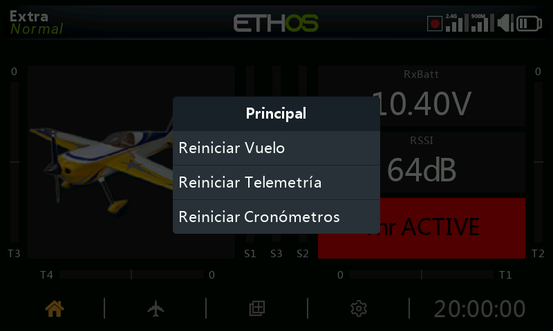

Una pulsación larga de la tecla \[ENT\] lleva a un menú de en el que se puede reiniciar:

### Reiniciar vuelo

Pondrá a cero simultáneamente la telemetría, los cronómetros y todos los interruptores de función. Tenga en cuenta que las comprobaciones previas al vuelo se volverán a realizar después de un 'Reinicio del Vuelo'.

### Reiniciar telemetría

Restablecerá la telemetría y borrará cualquier alerta de punto rojo de 'sensor perdido' o 'conflicto de sensor'. Por favor, consulte las alertas de sensor perdido / conflicto. [Sensor perdido / alertas de conflicto](#Sensor lost - conflict alerts).

### Reiniciar cronómetros

Pondrá a cero los cronómetros

## Blocaje de la pantalla táctil

La pantalla táctil LCD puede blocarse y desbloquearse para prevenir su operación inadvertida. Si se presionan simultáneamente las teclas \[ENT\] y \[Page\] por más de 1 segundo cuando se está en la pantalla inicial. También es posible hacerlo como una función especial.

## Controles de edición

### Añadir elementos funcionales

Pueden crearse nuevos elementos funcionales, como pueden ser cronómetros, interruptores lógicos, funciones especiales curvas o variables, seleccionando el símbolo ‘+’ situado junto a la cabecera de la columna de los menús principales relevantes.

En las radios sin pantalla táctil, use el selector rotatorio hasta llegar a símbolo ‘+’ y presione \[Enter\].

### Teclado virtual

Ethos dispone de un teclado virtual para editar campos de texto.

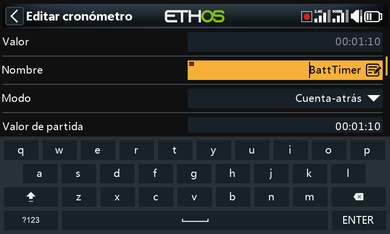

Basta con tocar en cualquier campo de texto (o hacer clic en \[ENT\]) para que aparezca el teclado.

Toque la techa de borrado hacia atrás (encima del botón de Enter) para retroceder une spacio, borrando caracteres a la izquierda del curso. Presione la tecla \[Page\] para borrar caracteres a la derecha del cursor. Una vez que llegue al final hacia el lado derecho, la tecla \[Page\] empezará a borrar los restantes que estén a la izquierda del cursor.

Toque el campo de texto para mover el cursor a la posición deseada. Alternativamente, presione la tecla \[SYS\] para mover el cursos hacia la izquierda, o la de \[DISP\] para moverlo hacia la derecha.

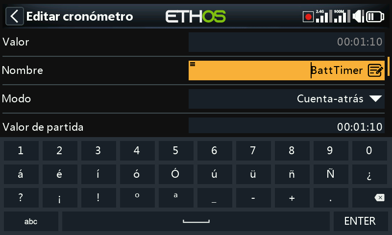

Pulse '?123' o 'abc' para alternar entre los teclados alfabético y numérico. El teclado numérico incluye caracteres especiales. También hay un bloqueo de mayúsculas para introducir letras mayúsculas.

#### Radios sin pantalla táctil

En aquellas radios que no dispongan de pantalla táctil, presione la tecla \[ENT\] en cualquier campo de texto para entrar en el modo de edición.

Rote el selector rotatorio para moverse a través de los alfabetos con minúsculas y mayúsculas y a los números, seguidos de los caracteres especiales. Presione \[ENT\] para insertar el carácter. La tecla \[MDL\] cambiará la caja del carácter que esté inmediatamente a la derecha del cursos. Cualquier carácter que se introduzca a partir de ahí mantendrá el último estado (mayúsculas o minúsculas) hasta que se cambie de nuevo.

Presione la tecla \[PAGE\] para borrar caracteres a la derecha del cursor.

Presione la tecla \[SYS\] para mover el cursor a la izquierda, o la de \[DISP\] para moverlo hacia la derecha.

### Controles para valores numéricos

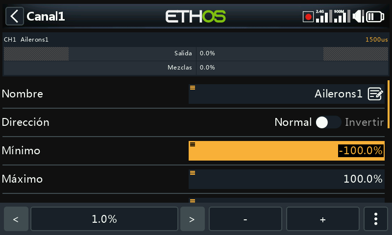

Al tocar un campo que contenga un valor numérico, aparece en la parte de debajo de la pantalla un cuadro de diálogo con los siguientes controles:

- a) Los botones ‘<’ y ‘>’ cambian el tamaño de cada paso entre el mínimo (cuando sea apropiado) hacia arriba en decimales, por ejemplo 0,01%, 0,1%, 1,0%, ó 10%.
- 
- b) Los botones ‘-’ y ‘+’ incrementan o reducen el valor, en función del tamaño del paso que se tenga. También se puede usar el selector rotatorio para ajustarlo.
- 
- c) También hay una tecla con tres puntos verticales \[‘More’\] a la derecha que proporciona más opciones adicionales. Mire las imágenes de abajo.

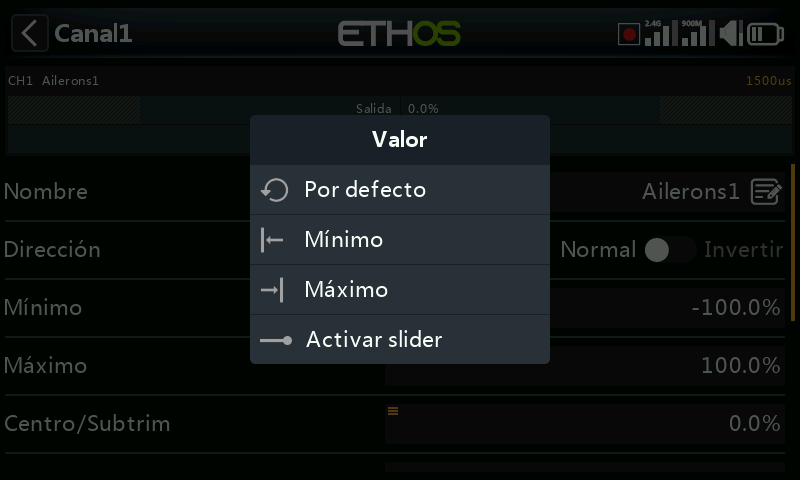

Al seleccionar ese botón ‘More’, se abre otro cuadro de diálogo para opciones adicionales:

- d) El valor por defecto
- e) Ajuste al mínimo
- f) Ajuste al máximo

g) Reemplazar los controles con un slider, como se muestra en las imágenes de abajo

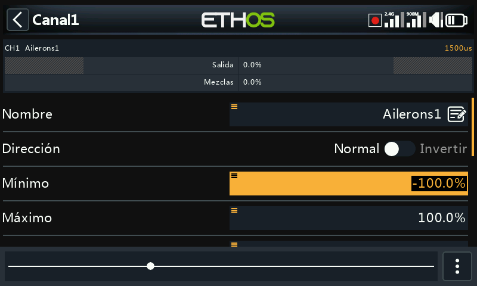

El slider permite ajustar los valores más rápidamente. También se puede usar el selector rotatorio.

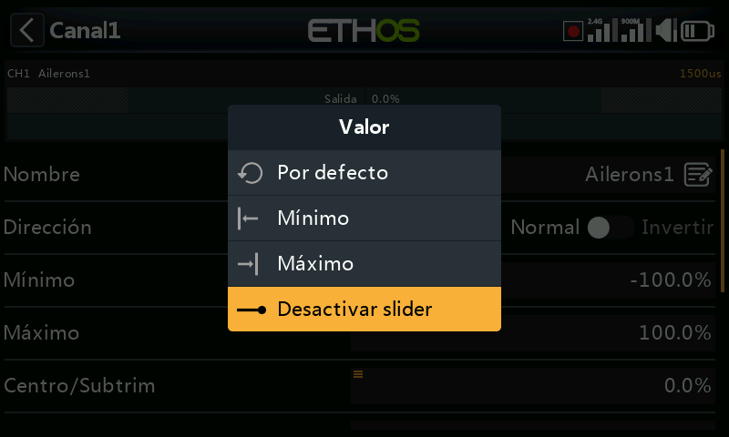

Para volver otra vez a los controles de ajuste normales, seleccione ‘Desactivar slider’.

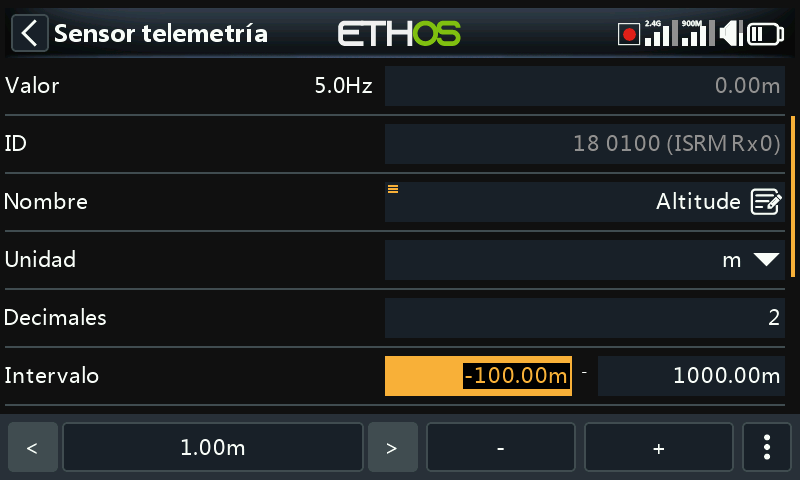

Otro ejemplo son los valores de Rango de Telemetría, que pueden editarse de forma similar.

### Características para opciones

Ethos dispone de una potente característica para "Opciones". Casi en cualquier lugar en el que se espere introducir un valor o una fuente, una pulsación larga de la tecla Enter hará aparecer un cuadro de diálogo con opciones.

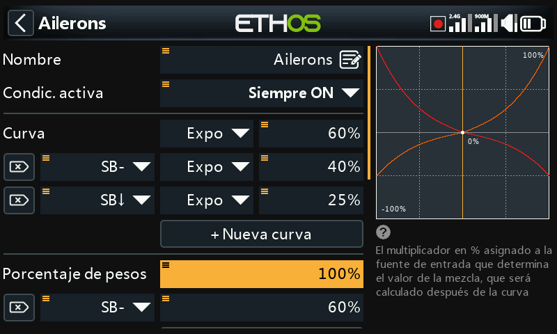

Los campos con esta función se identifican por el icono de menú (símbolo de hamburguesa) en la esquina superior izquierda del campo.

Para ajustes a nivel de radio , como pueden ser el volumen principal, silencio del altavoz, volumen del vario, brillo de la pantalla y brillo en modo suspensión, no se puede seleccionar una fuente que dependa del modelo (como un interruptor lógico, interruptor de función o un modo de vuelo).

#### Opciones con valor

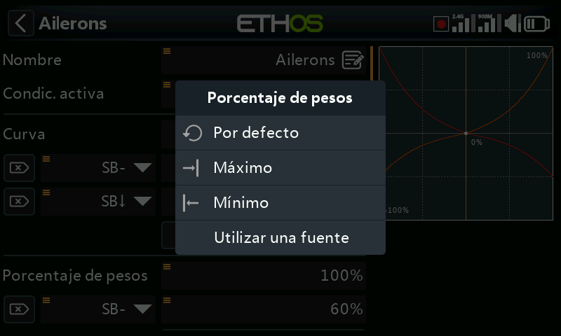

El cuadro de diálogo muestra, para opciones con valor, qué parámetro se está configurando. En este ejemplo tiene la opción de configurar el Peso/Ratio al máximo, a 0 (cero) ó al mínimo, o bien utilizar una fuente. Usar una fuente (por ejemplo, un Pot) permitiría ajustar el Peso/Rate en vuelo.

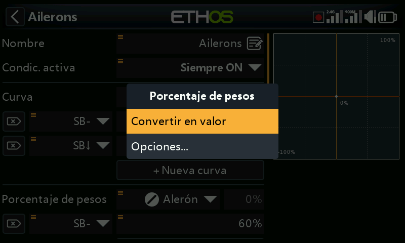

Si mantiene pulsado Enter en un campo tipo Valor que ya ha sido modificado para utilizar una fuente, aparecerá un cuadro de diálogo que le permitirá convertir el valor actual de la fuente en un valor fijo.

Al hacer clic en "Opciones" aparecerán opciones para la fuente, vea el punto siguiente.

#### Opciones con fuente

#### 	Opciones con fuente para interruptores lógicos

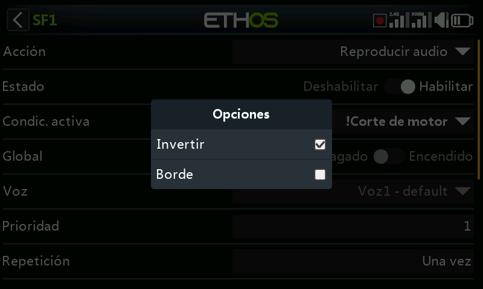

##### Invertir

Invertir permite negar o invertir una fuente, como la posición de un interruptor. Por ejemplo, en lugar de estar activa cuando el interruptor SA está arriba, estaría activa cuando el interruptor SA no está arriba, es decir, en las posiciones media o baja de ese interruptor.

##### Borde

Puede seleccionar la opción "Borde" si necesita efectuar una única acción cuando la fuente pasa de Falso a Verdadero o de Verdadero a Falso. Solo se actúa sobre la transición, no sobre el estado Verdadero o Falso.

Un símbolo ‘†’ aparecerá en la pantalla delante de la fuente para indicar que se ha seleccionado la opción borde.

Tenga en Cuenta que la opción ‘Edge’ estará disponible en los interruptores, dependiendo del contexto. También estará disponible en las condiciones de activación de interruptores lógicos [Sticky](#Sticky).

##### Opciones de fuentes para interruptores físicos

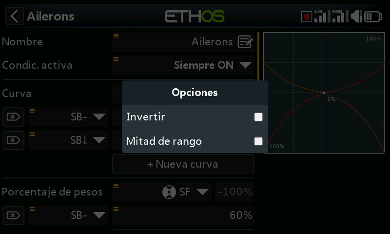

###### Invertir

La opción Invertir permite invertir la acción del interruptor.

###### Mitad de rango

La opción ‘Mitad de rango’ estará disponible cundo se use un interruptor de 2 posiciones o un interruptor lógico como fuente. El movimiento será de: \[0-100%\] en lugar de \[-100% hasta +100%\].

##### Opciones de fuente para entradas del acelerador

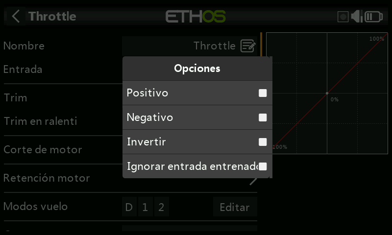

- Si se activa la opción ‘Positivo’, sólo la mitad positiva del recorrido del control de entrada alimentaría la mezcla.
- Si se activa ‘Negativo’ Solo la mitad negativa del recorrido del control de entrada alimentaría la mezcla.

Las dos opciones de arriba se usan normalmente en modelos de superficie donde el gatillo opera a la vez el acelerador (parte positiva) y los frenos (parte negativa).

- Active ‘Invertir’ para revertir el control de entrada.
- Si se activa ‘Ignorar entrada entrenador’ se previene que la radio del estudiate afecte a la mezcla. Vaya a la sección ‘Ignorar entrada de entrenador’ para más detalles.
-

##### Opciones de fuentes para compensadores

###### Invertir

La opción ‘Invertir’ permite invertir la acción del compensador, util en las mezclas con Acciones.

###### Todo el rango

Los compensadores tienen un régimen de movimiento por defecto de +/- 25%. Cuando se seleccionan como Fuente, se pueden opcionalmente cambiar para que tengan un recorrido total de +/- 100% (manteniendo pulsada la tecla Enter en el compensador).

##### Ignorar entrada del entrenador

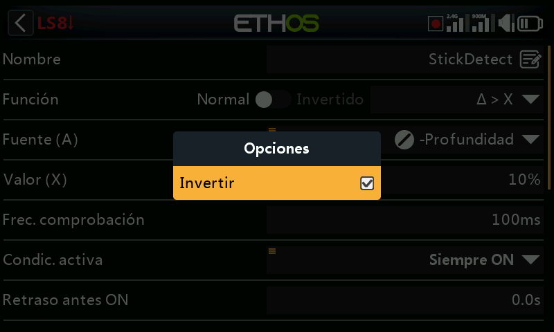

En los Interruptores Lógicos, las fuentes pueden tener esta opción configurada para ignorar las fuentes procedentes de las entradas del alumno. Una aplicación típica es cuando se configura un interruptor lógico para que detecte el movimiento de las palancas del maestro (por ejemplo, la palanca del elevador) para permitir la intervención instantánea si las cosas van mal. Esta opción es necesaria para evitar que las entradas de palanca del alumno activen el interruptor lógico.

#### Opciones con Var

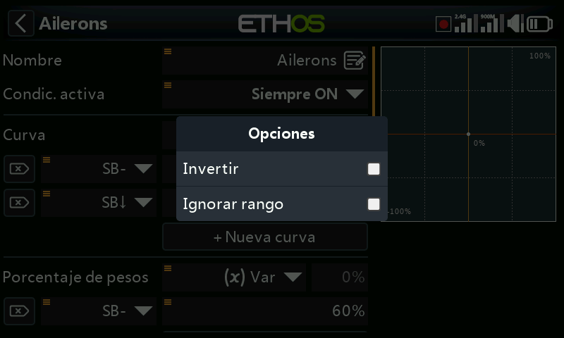

##### Invertir

Activando ‘Invertir’ hará que el valor del Var sea negativo para esa situación.

##### Ignorar rango

Algunos parámetros tienen rangos asimétricos, como pudieran ser los parámetros Mín/Max en la sección de canales, que tienen márgenes de (-150% hasta 0%) y (0% hasta +150%) respectivamente. Cuando se usan VARs como fuente para ajustar los parámetros Mín/Max, a menos que el Var tenga unos márgenes idénticos, será necesario ajustar los márgenes para ‘Ignorar rango’ al objeto de evitar valores inesperados debidos a la conversión de esos márgenes.

#### Opciones de sensores

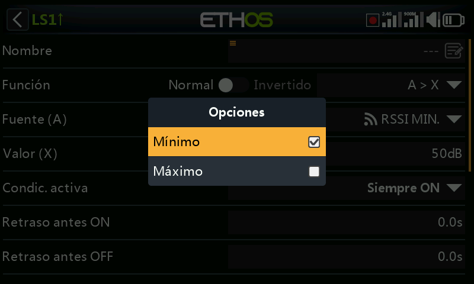

En una fuente de Telemetría, el cuadro de diálogo de Opciones permite utilizar los valores máximo o mínimo del sensor.

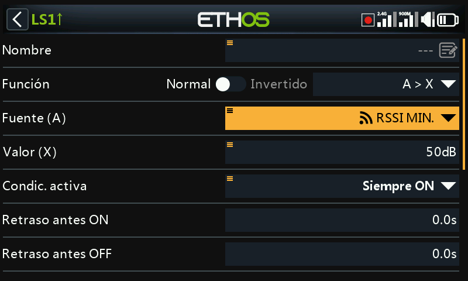

Algunos sensores tendrán opciones adicionales específicas para ese sensor.
