# Aviso de capacidad de batería

Aviso basado en la **capacidad consumida** (mAh) en lugar del voltaje: una
medida más directa de cuánto se ha gastado realmente del pack. Hay dos
formas de conseguirlo, según el hardware instalado.

## Opción A: un ESC de la serie Neuron

Los ESC Neuron de FrSky informan del consumo directamente, sin necesidad de
un sensor calculado. Ajusta [Opciones del receptor → Puerto de
telemetría](../system-setup/devices.md) a S.Port, conecta el cable de
telemetría del Neuron y [descubre los
sensores](../model-setup/telemetry.md#discovering-sensors): el sensor que
interesa es **ESC Consumption**.

1. Añade un [interruptor lógico](../model-setup/logical-switches.md) sobre `ESC
   Consumption`, verdadero por encima de (por ejemplo) 900mAh, aproximadamente
   el 60% de un pack dimensionado para aterrizar con un ~30% de reserva.
2. Añade una [función especial Reproducir
   audio](../model-setup/special-functions.md), con el nuevo interruptor como
   condición de activación y un paso **Reproducir valor** para `ESC Consumption`.

Como segunda línea de defensa, los ESC Neuron también informan del **ESC
Voltage**: configura un segundo interruptor lógico igual que en [Aviso de
voltaje bajo de batería](low-battery-warning.md) (por debajo de 3,4V/celda,
es decir, 13,6V para un pack 4S), con su propia función Reproducir audio
repitiéndose cada 5 segundos.

## Opción B: un sensor de corriente + sensor calculado

Si el ESC no informa del consumo, un sensor de corriente (por ejemplo, el
FrSky FASxxx) combinado con un [sensor calculado de
**Consumo**](../model-setup/telemetry.md#calculated-sensors) hace el mismo
trabajo.

### 1. Conectar y descubrir

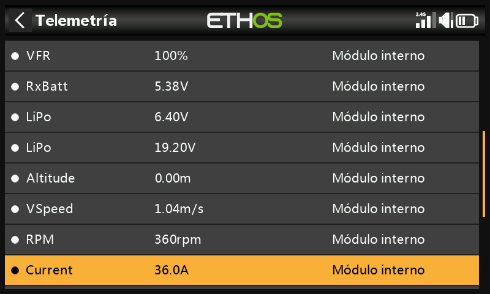

Conecta el cable S.Port del sensor de corriente y descúbrelo: aparecerá como
**Current**. Ajusta su **Rango** para que coincida con el sensor (por ejemplo,
0–100A para un FAS100):

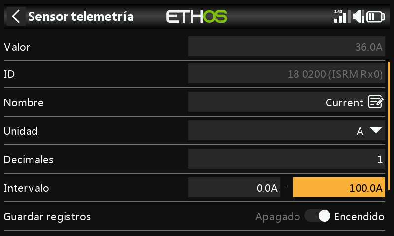

### 2. Crear el sensor calculado de consumo

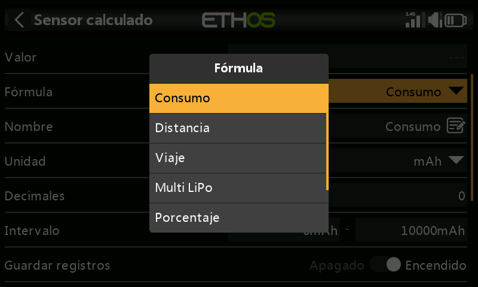
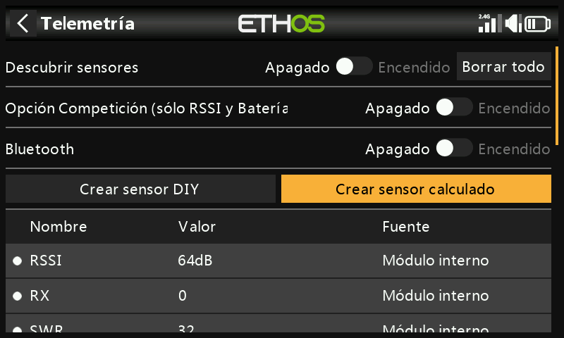

En Telemetría, **Crear sensor calculado** → **Consumo**. Ajusta las unidades
a `mAh` y el **Rango** a la capacidad del pack (por ejemplo, 2800mAh); la
**Fuente** a `Current`.

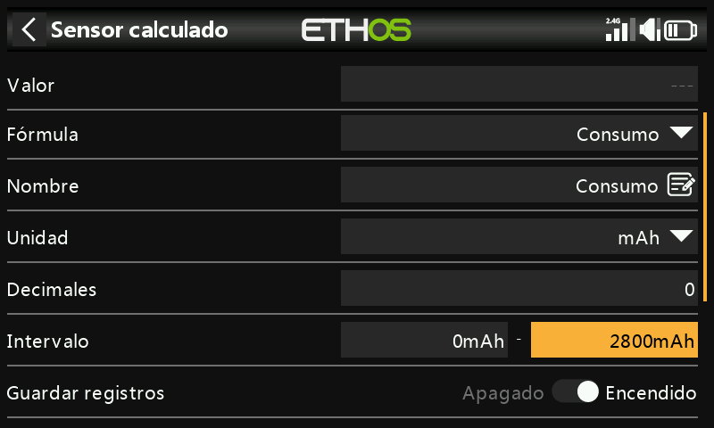
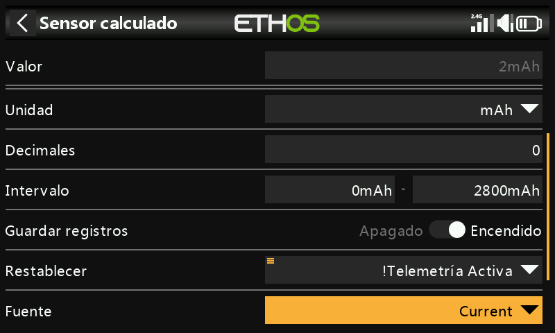

Ajusta **Reset** al evento de sistema `!Telemetry Active`: selecciona
**Telemetry Active**, mantén pulsado `ENT` y elige **Invertir**, de modo que
el total acumulado se reinicie automáticamente cuando se pierda la telemetría
(es decir, cuando se apague el modelo).

### 3. Avisos por tramos

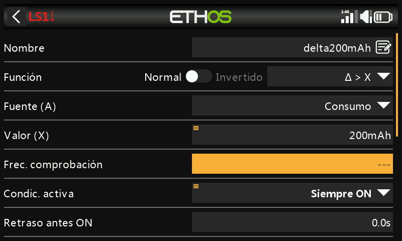

Añade un interruptor lógico con la función **Δ > X** sobre `Consumption`, que
se dispare cada vez que suba un incremento fijo: por ejemplo, cada 200mAh, una
fracción cómoda de un pack de 2800mAh.

!!! tip
    Ajusta el **Intervalo de comprobación** a `---` (infinito) para que siga
    acumulando indefinidamente hacia el siguiente umbral en lugar de reiniciarse
    tras una ventana fija. Asigna a **Duración mín.** un valor pequeño distinto
    de cero mientras depuras: con 0.0 el disparo es demasiado breve para verse
    en pantalla.

Añade una función Reproducir audio, con este interruptor como condición de
activación y un paso Reproducir valor para `Consumption`:

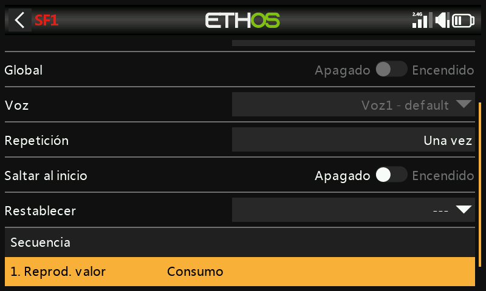

### 4. Aviso de capacidad baja

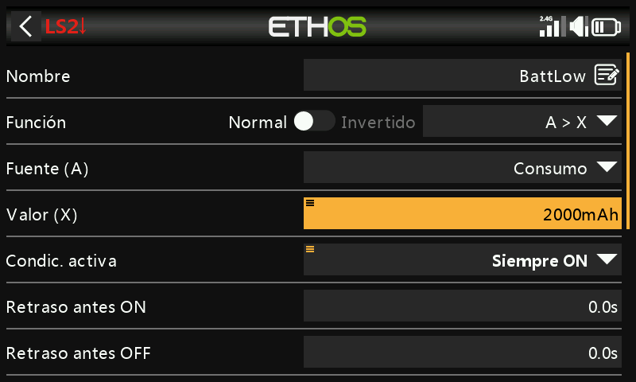

Un segundo interruptor lógico se dispara una sola vez, al superar un umbral
fijo de capacidad baja (por ejemplo, 2000mAh de un pack de 2800mAh),
combinado con una función Reproducir audio que se repite cada 10 segundos
hasta que se reinicie el modelo:

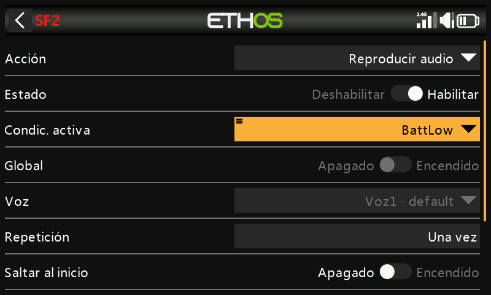
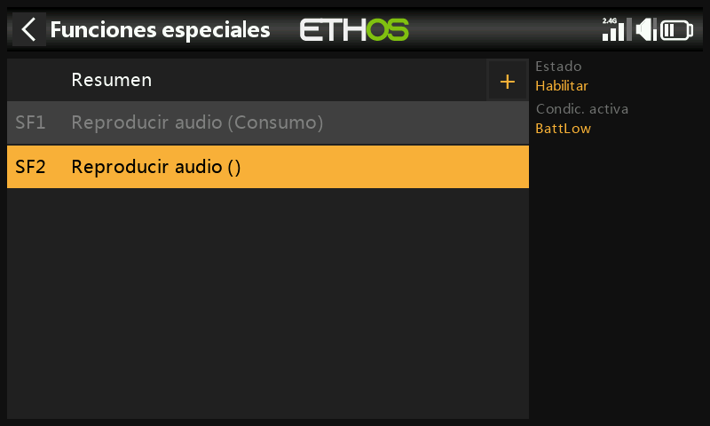
