# Mezclador Butterfly (Cuervo)

El frenado butterfly (también conocido como *crow*) controla la velocidad
de descenso, principalmente en veleros: los alerones suben una cantidad
moderada mientras los flaps bajan mucho, generando una resistencia
considerable — ideal para controlar una aproximación de aterrizaje. Este
recorrido asume un velero cuyos canales de flaps ya existen (creados por
el asistente de [Selección de modelo](../model-setup/model-select.md)),
utilizando el stick de acelerador como entrada de freno: sin butterfly con
el stick arriba, progresivamente más a medida que baja, con compensación
de profundidad para que el velero no ascienda bruscamente al aplicar crow.

## 1. Desactivar la mezcla de flaps predeterminada

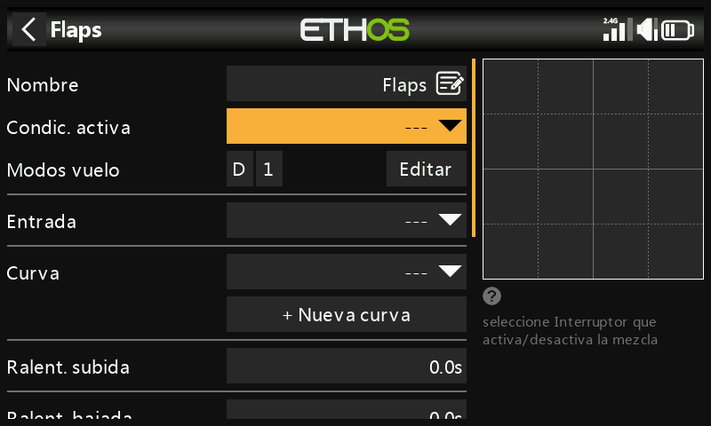

Ajuste la **Condición activa** de la mezcla de flaps creada por el
asistente a `---` — no se utilizará.

## 2. Crear la mezcla Butterfly

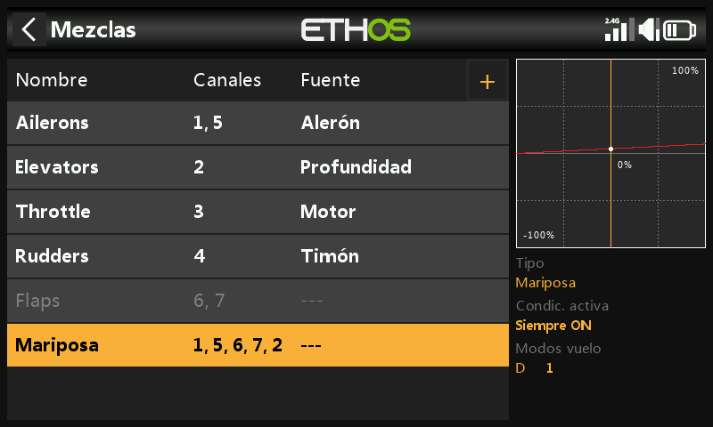

Pulse sobre cualquier mezcla, **Añadir mezcla** → **Butterfly** desde la
[biblioteca de mezclas](../model-setup/mixes.md#mix-libraries),
colocándola después de la mezcla de flaps (ahora desactivada).

## 3. Configurar la entrada

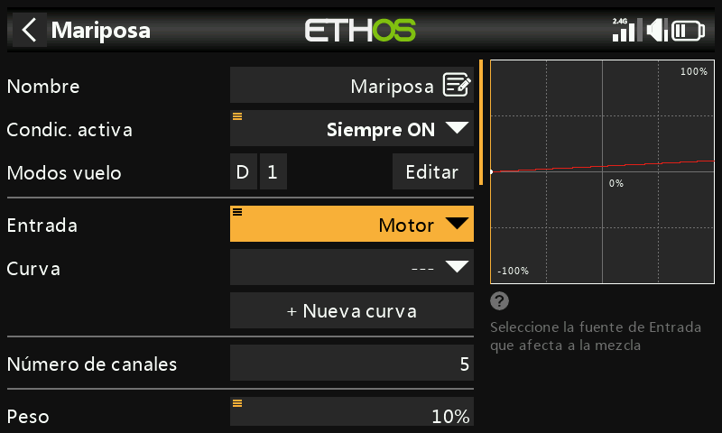

Ajuste **Entrada** a **Acelerador**. Como el acelerador normalmente marca
el máximo con el stick arriba, y el butterfly debe ser 0 con el stick
arriba, mantenga pulsado `ENT` sobre Acelerador y seleccione **Invertir**:

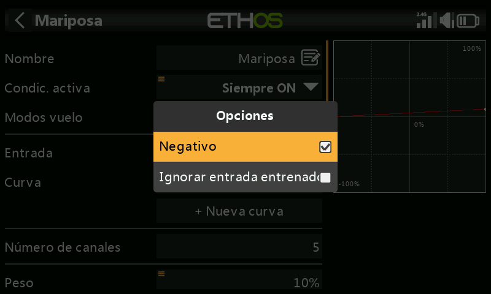
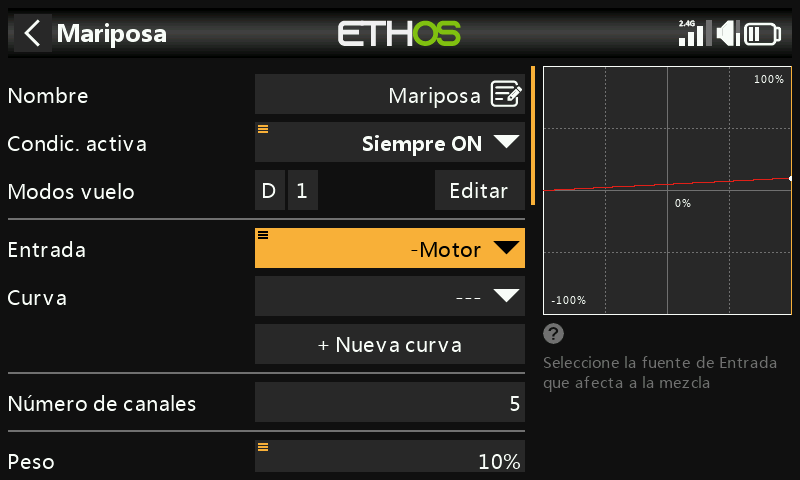

Ahora la entrada marca 0 con el stick completamente arriba, y el campo
muestra `-Throttle` para confirmar la inversión. Ajuste la **Condición
activa** a una fase de vuelo de aterrizaje (u otro interruptor) si el
butterfly no debe estar siempre disponible.

## 4. Añadir una curva con zona muerta

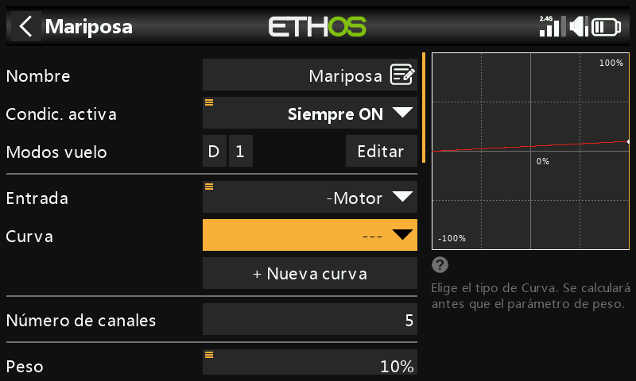

Una pequeña zona muerta en el extremo cero del stick evita un despliegue
accidental por pequeñas variaciones del stick cerca del tope. Añada una
curva personalizada de 3 puntos (por ejemplo, llamada «Crowdb») con el
**Modo fácil** desactivado, de modo que se puedan mover los puntos X:

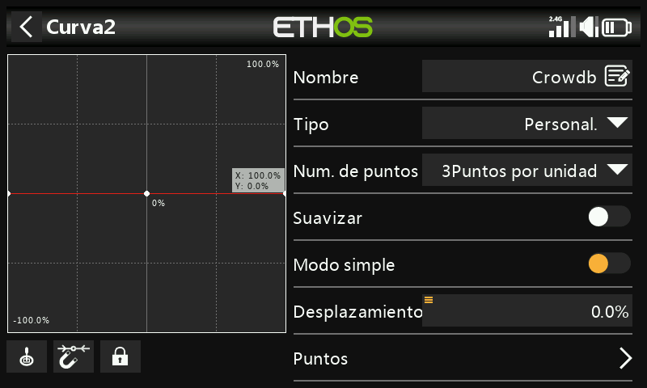
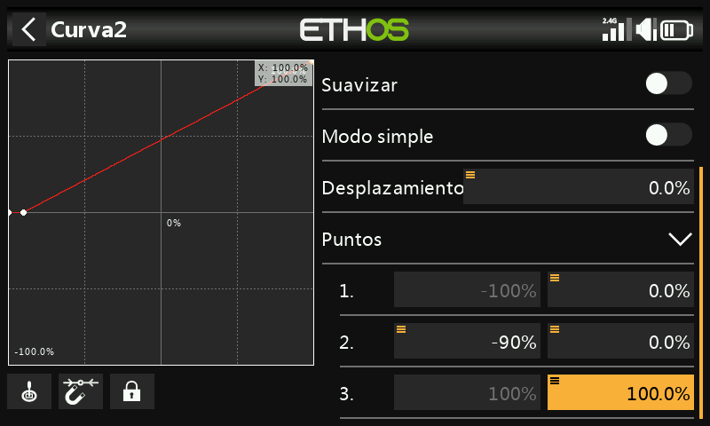

!!! note
    Al añadir una curva personalizada a la mezcla Butterfly se elimina su
    desplazamiento interno de 0–100 (aplicado normalmente de forma
    automática) — ahora la propia curva debe reproducir esa
    transformación 0–100. En este ejemplo, la salida permanece al 0 %
    hasta que el stick de acelerador alcanza −90 %, y después sube
    linealmente hasta el 100 %:

    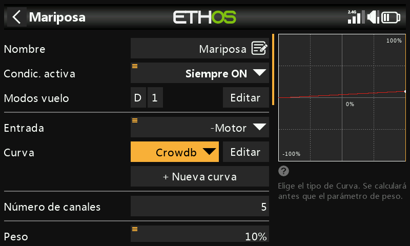

## 5. Configurar alerones y flaps

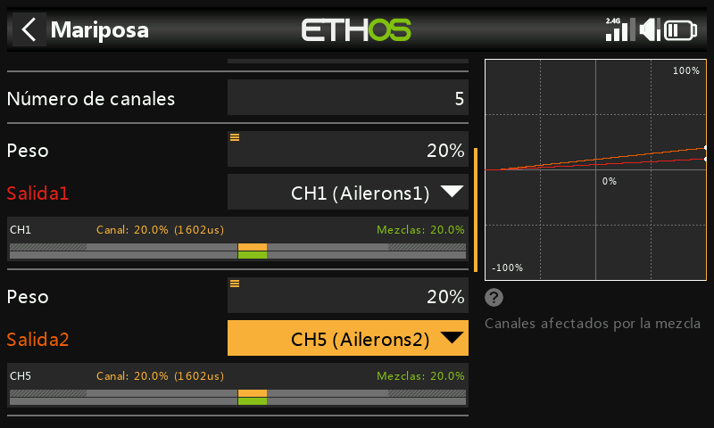

Un ascenso moderado de los alerones (por ejemplo, 20 %) combinado con una
gran deflexión de flaps es el reparto habitual. Los flaps normalmente
necesitan mucho más recorrido hacia abajo que hacia arriba, lo que suele
conseguirse desplazando los brazos de los servos de flaps 20–30° respecto
al neutro en el propio varillaje, lo que deja los flaps aproximadamente a
medio bajar con el servo en neutro:

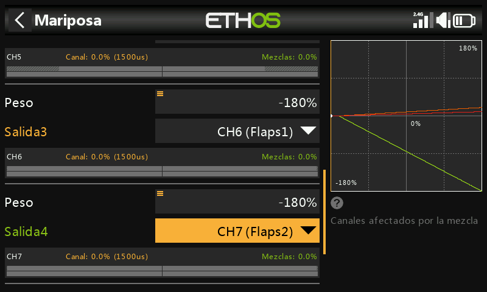
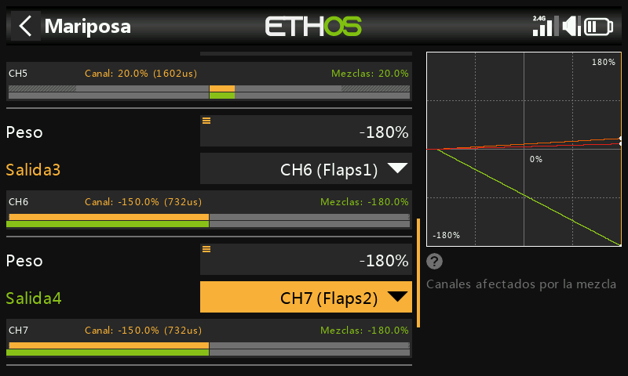

Ajuste un peso alto en la mezcla de flaps (por ejemplo, −180 %) para
obtener el máximo recorrido; el recorrido físico real está determinado por
los valores Mín/Máx de [Salidas](../model-setup/outputs.md).

!!! tip
    Para evitar forzar los servos, empiece con valores Mín/Máx
    conservadores en Salidas (por ejemplo, ±30 %) y amplíelos con cuidado
    durante el ajuste final, vigilando que no haya bloqueos mecánicos.

## 6. Añadir una mezcla de offset «Flaps Neutral»

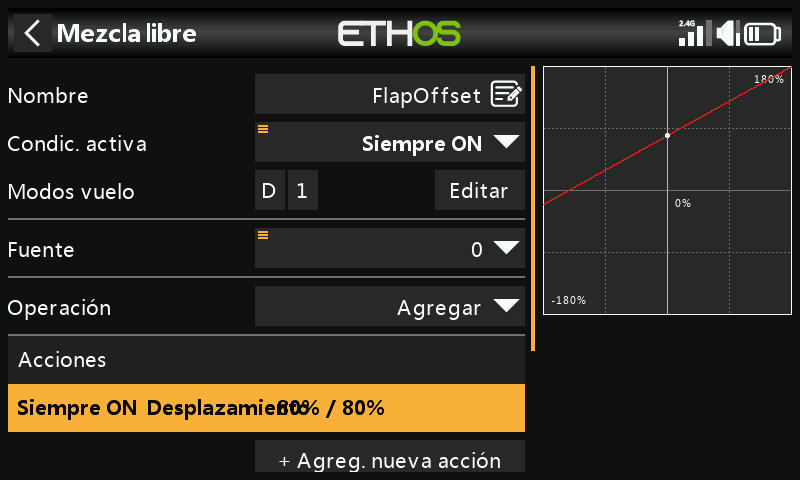

Como el desplazamiento de los brazos de los servos deja los flaps con una
deflexión de ~20–30 % con el servo en neutro, una **Mezcla Offset** los
devuelve a la posición neutra real del ala para el vuelo normal. Empiece
con un offset del 80 % (a ajustar), con 2 canales de salida asignados a
ambos canales de flaps:

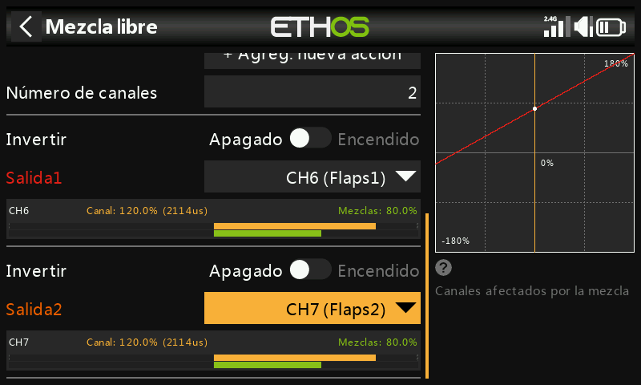
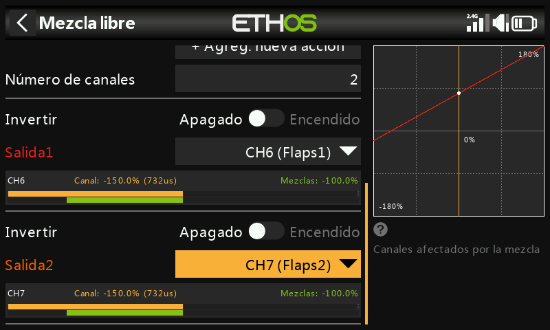

Con el stick de acelerador completamente arriba (mezcla Butterfly
desactivada), compruebe que los valores del mezclador de flaps se sitúan en
el offset (80 %); al llevar el stick de flaps al despliegue total, la
salida del mezclador debería desplazarse el peso completo (por ejemplo,
desde el 80 % hasta −100 %, un recorrido del 180 %). Ajuste con precisión
los límites de recorrido reales en Salidas mediante Mín/Máx o una curva.

## 7. Añadir la curva y la mezcla de compensación de profundidad {: #7-add-the-elevator-compensation-curve-and-mix }

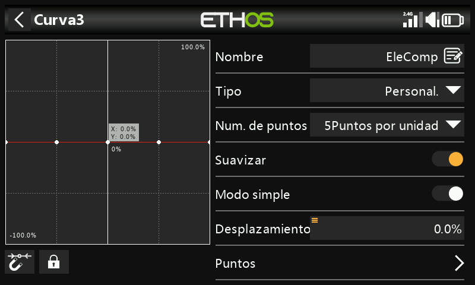
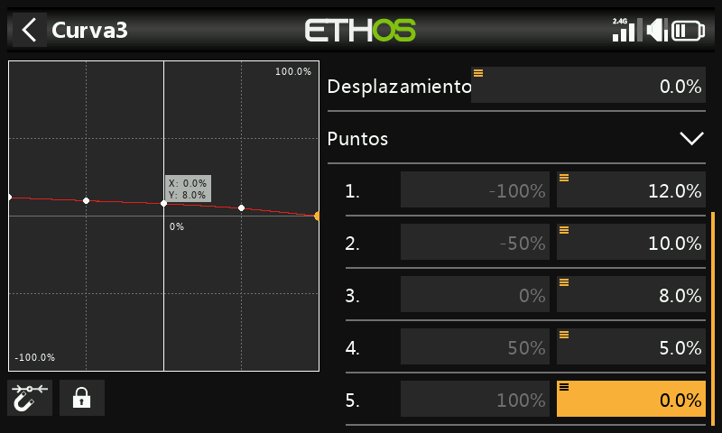

Como la compensación necesaria no es lineal, utilice una curva en lugar de
un peso fijo. Defina una curva personalizada de 5 puntos (por ejemplo,
«EleComp») — este ejemplo parte de 12 %/10 %/8 %/5 %/0 % en sus puntos; sin
un punto de partida conocido para su modelo, estos valores deben
determinarse empíricamente.

A continuación, convierta esa curva en un valor utilizable como **Peso**
de una mezcla: añada una [Mezcla libre](../model-setup/mixes.md#mix-libraries)
(«EleCompx») con Acelerador como fuente y la curva EleComp asociada, con
salida a un canal alto sin utilizar (por ejemplo, CH20):

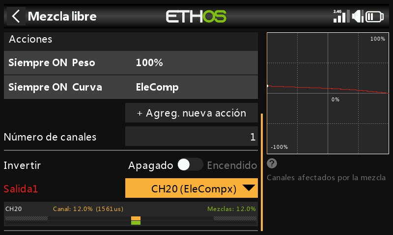

De vuelta en la mezcla Butterfly, mantenga pulsado `ENT` sobre el **Peso**
de la salida de Profundidad, **Usar una fuente**, y luego seleccione CH20
(EleCompx) en la categoría Canales:

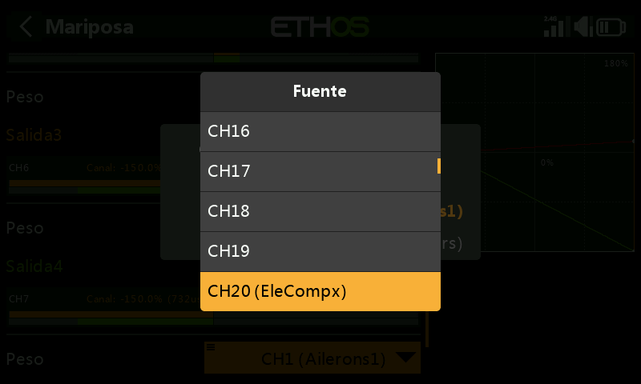
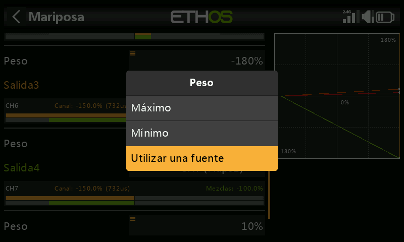

La mezcla Butterfly queda ahora completamente configurada:

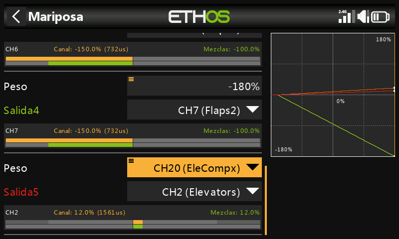

## 8. Verificar con la vista por canal

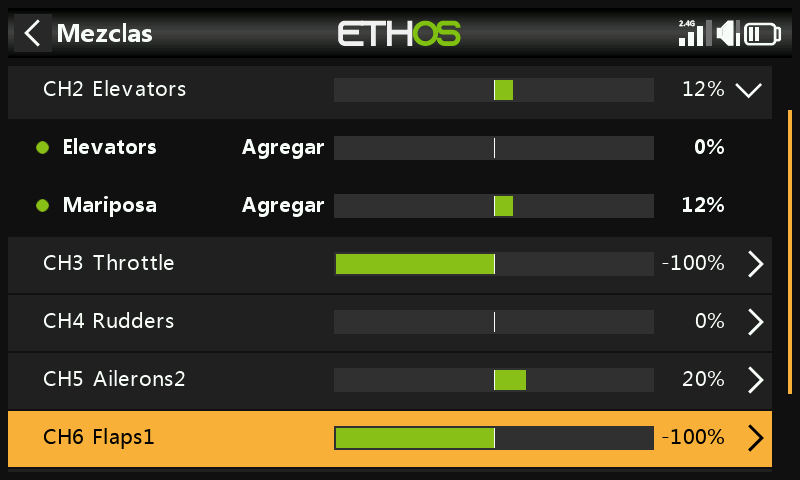

Cambie a la [vista por canal](../model-setup/mixes.md#per-channel-view) en
Profundidad para observar cómo se actualizan conjuntamente todas las
mezclas que intervienen (entrada del stick + compensación Butterfly) al
mover el stick de acelerador/freno — mucho más fácil de depurar que la
vista de tabla plana.

!!! tip
    Conviene disponer de datos sobre el recorrido de profundidad necesario
    en función de la deflexión de flaps (del fabricante del modelo o de
    fuentes de la comunidad) antes de definir los valores iniciales de la
    curva de compensación. A falta de ellos, empiece con unos pocos
    milímetros de recorrido de profundidad por despliegue completo de
    flaps y refine a partir de ahí.
