# Curva de compensación ajustable en vuelo

## Por qué

Desplegar los flaps modifica la curvatura del ala — los aviones de ala
alta tienden a "encabritarse", los de ala baja tienden a hundirse — lo
que exige una corrección de profundidad que no es lineal con la
deflexión de los flaps, de ahí una curva en lugar de un desplazamiento
fijo. Este recorrido utiliza [Vars](../model-setup/variables.md) para
hacer que los puntos de una curva de compensación sean ajustables **en
vuelo**, mediante un trim de acelerador reutilizado, condicionado por el
punto de la curva al que está más próximo el stick de flaps en cada
momento — ampliando el paso de compensación de profundidad de [Guía
práctica: mezclador butterfly](butterfly-mixer.md).

## 1. Elegir el tipo de curva

Una [curva personalizada](../model-setup/curves.md) de 5 puntos basta
para lograr una compensación suave sin complejidad excesiva. El punto 5
(el más a la derecha, stick de flaps totalmente arriba / sin flaps) queda
siempre fijo en cero — no se necesita compensación si no hay flaps
desplegados. Los otros 4 puntos se hacen ajustables mediante Vars. Dado
que el stick de flaps a menudo quedará entre dos puntos definidos, ambos
puntos situados a cada lado deben poder ajustarse a la vez en esa zona de
solapamiento.

## 2. Calcular los rangos solapados

Rangos punto a punto (adaptados, con permiso, del "Crow-aware adaptive
elevator trim" de Mike Shellim para OpenTX en rc-soar.com — ampliados
ligeramente para que el rango del Pt2 llegue hasta el +100%, por el
motivo explicado en el [Paso 6](#6-apply-the-curve)):

| Rango del stick de flaps | Punto(s) activo(s) |
|---|---|
| +100% a +45% | Solo Pt2 |
| +45% a +20% | Pt2 y Pt3 |
| +20% a −20% | Solo Pt3 |
| −20% a −45% | Pt3 y Pt4 |
| −45% a −90% | Solo Pt4 |
| −90% a −100% | Solo Pt5 |

## 3. Configurar los interruptores lógicos

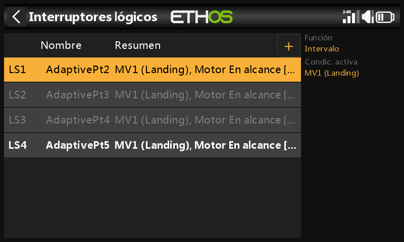

Cuatro [interruptores lógicos](../model-setup/logical-switches.md), cada
uno usando **Rango** sobre el stick de flaps (acelerador), activos
mientras el stick se encuentra en la zona de ese punto:

- `AdaptivePt2` — rango 20% a 100% (ampliado hasta el 100%
  específicamente para que el Pt2 pueda ajustarse incluso sin flaps
  desplegados — véase el Paso 6).

  

- `AdaptivePt3` — rango −45% a 45%.

  

- `AdaptivePt4` — rango −90% a −20%.

  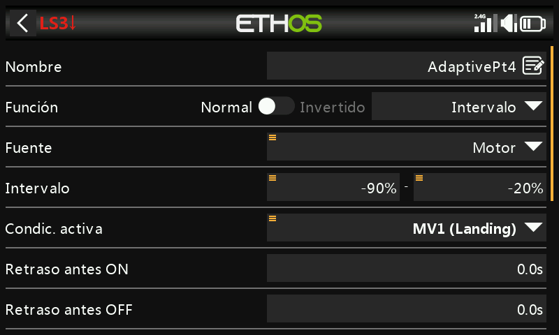

- `AdaptivePt5` — rango −100% a −90%.

  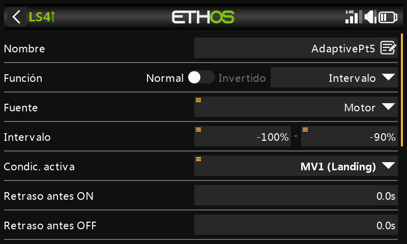

## 4. Definir las Vars de ajuste

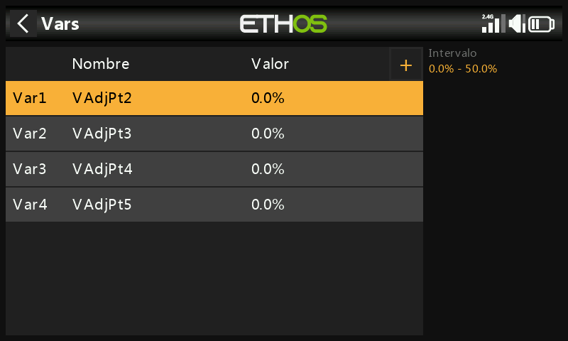

Cuatro [Vars](../model-setup/variables.md), `VAdjPt2`–`VAdjPt5`, cada una
con rango 0–50% (amplíalo si es necesario) y una acción de **trim de
acelerador reutilizado** — tamaño de paso 1.0%, con el interruptor lógico
correspondiente como condición de activación:

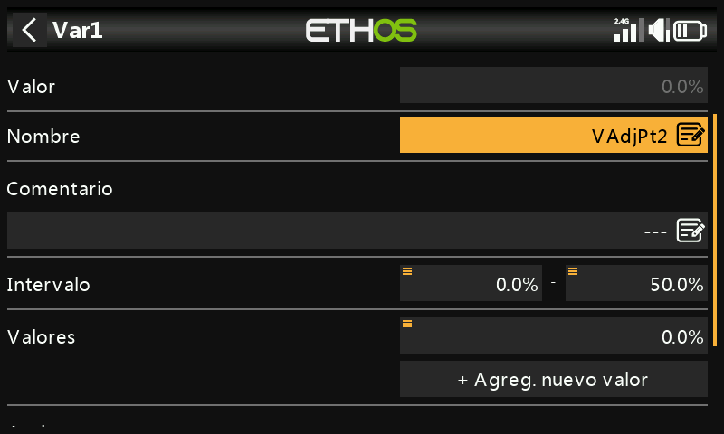
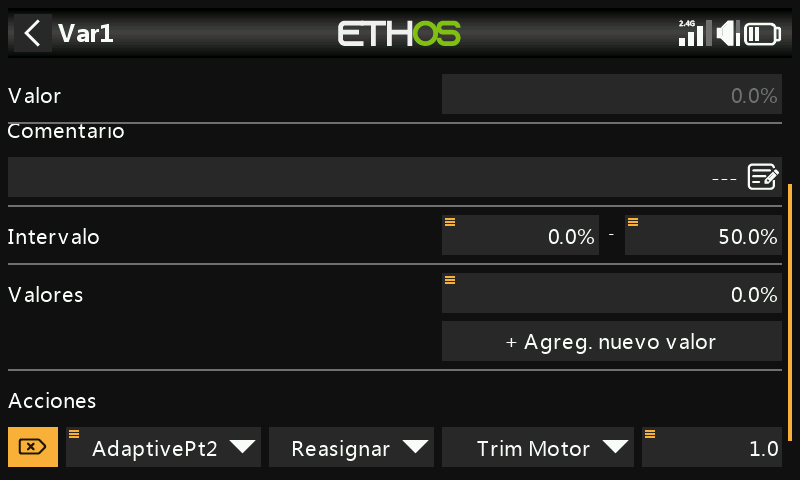

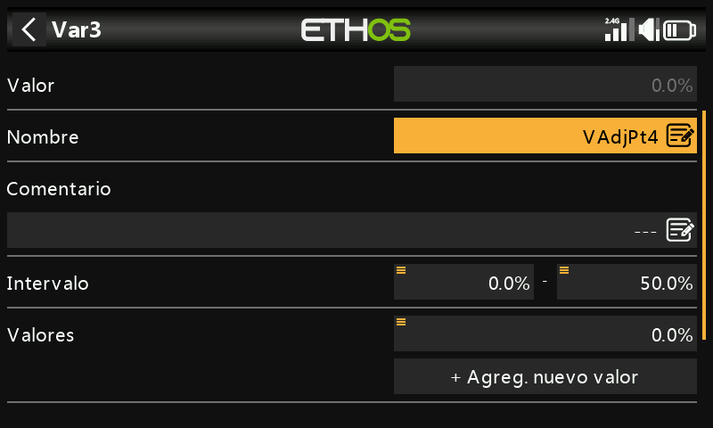
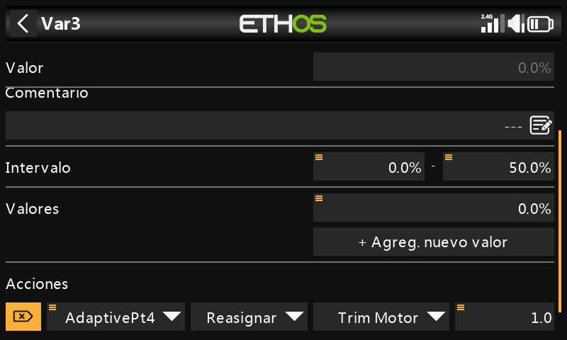

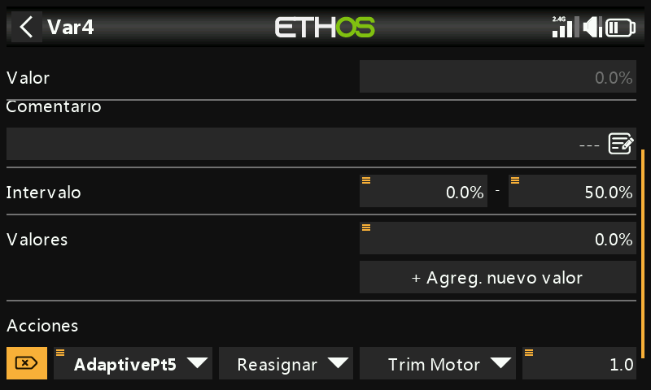

Como solo hay un interruptor lógico activo a la vez (dos como máximo, en
las zonas de solapamiento), el mismo trim físico ajusta con seguridad
distintas Vars según la posición de los flaps.

## 5. Definir la curva de compensación

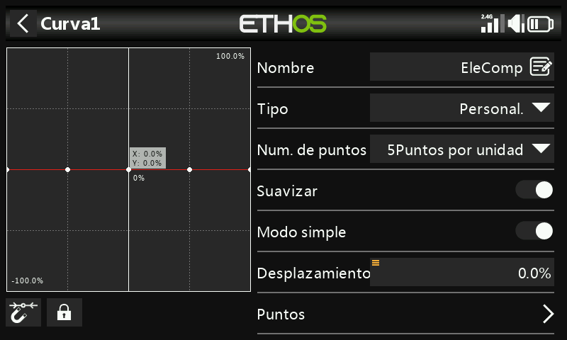
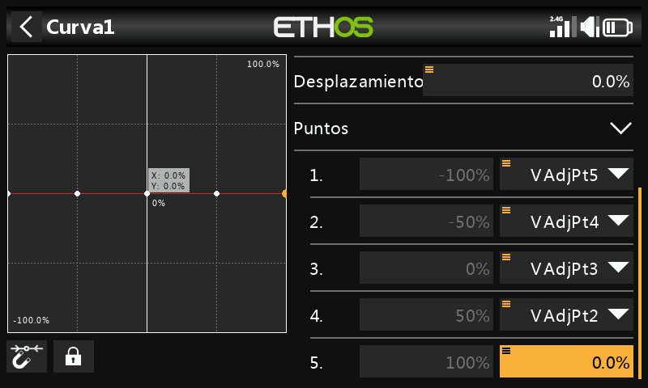

Una nueva curva personalizada de 5 puntos (por ejemplo, "EleComp") con
**Smooth** activado. Pulsa de forma prolongada `ENT` sobre los puntos 1–4
y usa **Usar una fuente** para asignar `VAdjPt5`…`VAdjPt2`
respectivamente (el punto 5 permanece fijo en 0, según el Paso 1).

## 6. Aplicar la curva {: #6-apply-the-curve }

Utiliza esta curva exactamente donde [Guía práctica: mezclador
butterfly](butterfly-mixer.md#7-add-the-elevator-compensation-curve-and-mix)
asocia su curva EleComp a la mezcla de compensación de profundidad.

Cuando sea posible, parte de datos reales (indicaciones del fabricante,
publicaciones de la comunidad) sobre cuánto recorrido de profundidad
requiere una deflexión de flaps determinada; en caso contrario, unos
pocos milímetros de compensación con flaps al máximo es un punto de
partida razonable.

!!! tip "Método de ajuste"
    Empieza con cantidades pequeñas de flap y ajustes de trim pequeños.
    `AdaptivePt2` puede ajustarse **sin ningún flap desplegado** — aplica
    un poco de flap, retíralo de nuevo y añade un toque de compensación
    cada vez, en lugar de pelearte con un modelo que se encabrita o se
    hunde mientras intentas trimarlo bajo presión. Vuelve a aplicar un
    poco de flap para comprobarlo y reajusta según sea necesario. Una vez
    que el Pt2 se sienta correcto, pasa al punto siguiente, en torno al
    centro del stick — si el Pt2 requirió un cambio de trim grande, vale
    la pena aterrizar y ajustar los puntos restantes para que cada uno
    sea ligeramente mayor que el anterior, en lugar de ir a ciegas.
