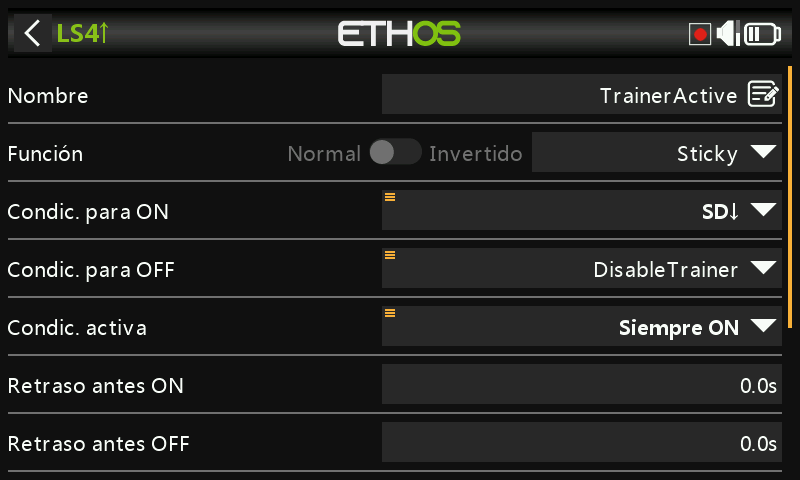
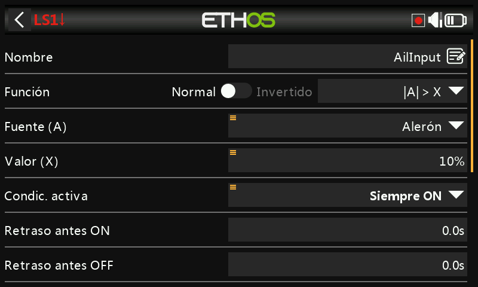
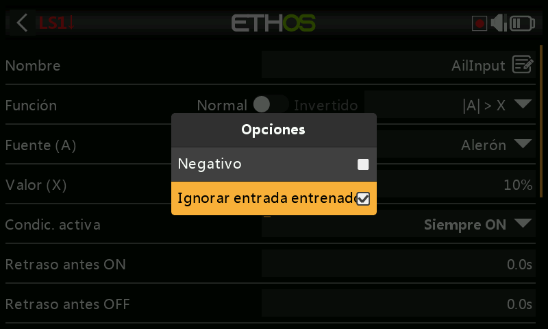
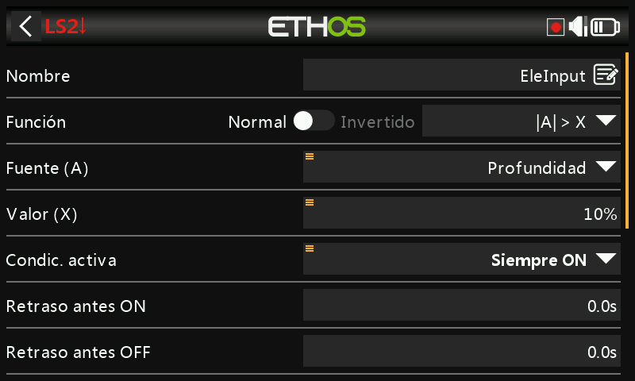
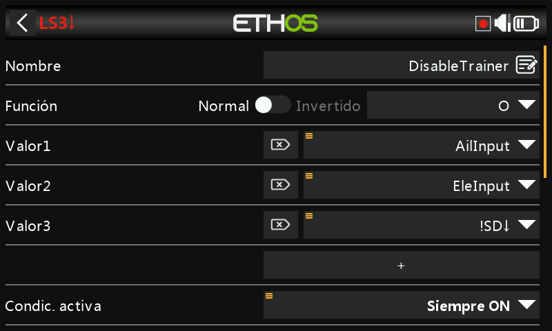

# Recuperación instantánea del control para la función Trainer

Una mejora útil para la función [Trainer](../model-setup/trainer.md): en
lugar de depender únicamente de un interruptor, el instructor puede
recuperar el control al instante simplemente moviendo el stick de
alerones o de profundidad — sin necesidad de buscar primero el
interruptor de trainer si algo va mal.

El interruptor de trainer sigue siendo el que inicia la sesión; un
[interruptor lógico Sticky](../model-setup/logical-switches.md#sticky)
controla la función Trainer en sí, cancelándose bien al desactivarse el
interruptor **o** al detectarse movimiento en los sticks del instructor.

## 1. Interruptor lógico de detección de alerones

Un interruptor lógico que utiliza **|A| > X** sobre el stick de alerones,
verdadero cuando este se desplaza más del 10 % del centro en cualquiera
de las dos direcciones. Mantenga pulsada la fuente de alerones y
seleccione **Ignorar entrada de trainer**, para que el movimiento de
alerones del *alumno* (que llega a través del enlace de trainer) no lo
active también:

## 2. Interruptor lógico de detección de profundidad

El mismo esquema, aplicado al stick de profundidad.

## 3. Interruptor lógico de cancelación

Un interruptor lógico **OR**, verdadero cuando el interruptor de
detección de alerones o el de profundidad es verdadero, **o** cuando el
interruptor de trainer (por ejemplo SD) no está abajo — es decir,
cualquiera de las condiciones «el instructor ha movido un stick» o «el
interruptor de trainer se ha desactivado» finaliza la sesión.

## 4. Interruptor lógico Sticky de activación del trainer

Un interruptor lógico **Sticky**: **Trigger ON** es el interruptor de
trainer (SD abajo) y **Trigger OFF** es el interruptor de cancelación del
paso 3. Utilice este interruptor Sticky — llámelo `TrainerActive` — como
condición de activación de la función Trainer en lugar del interruptor
directo.

## 5. Señal acústica

Añada [funciones especiales Play Audio](../model-setup/special-functions.md)
que anuncien cuándo `TrainerActive` pasa a verdadero y cuándo se
desactiva, de modo que ambos pilotos reciban un aviso audible claro del
momento exacto en que cambia el control.
