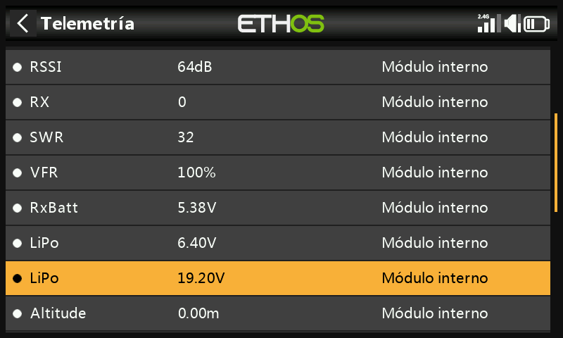
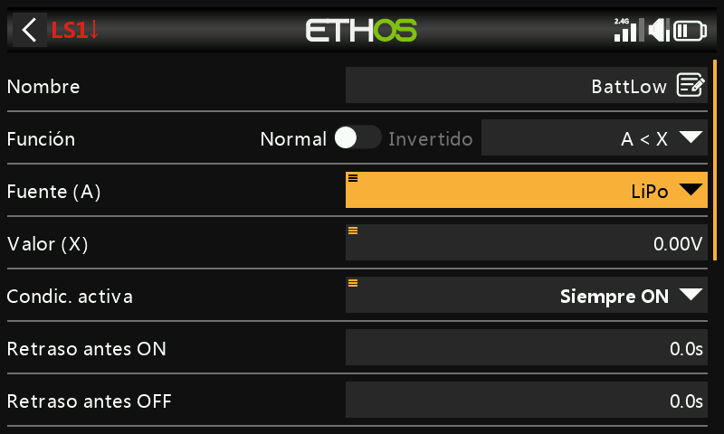
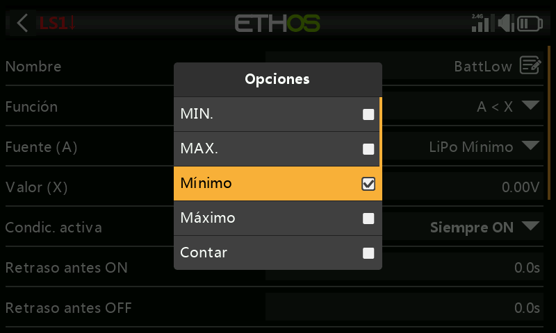
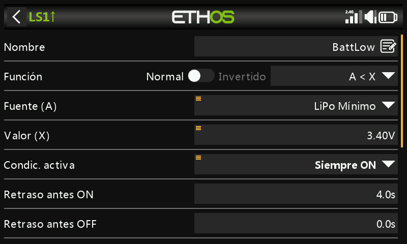
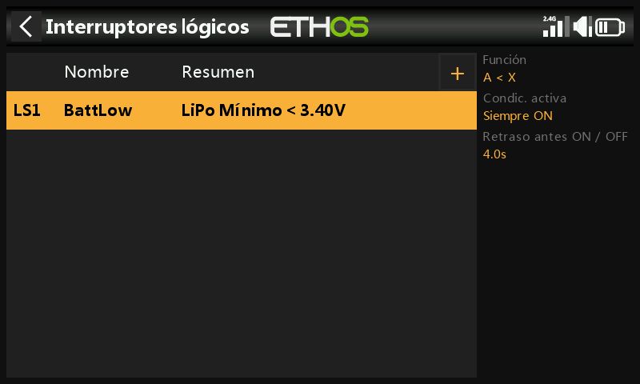
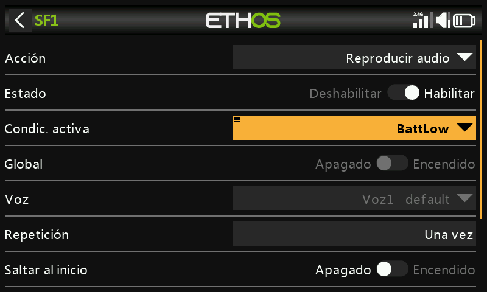
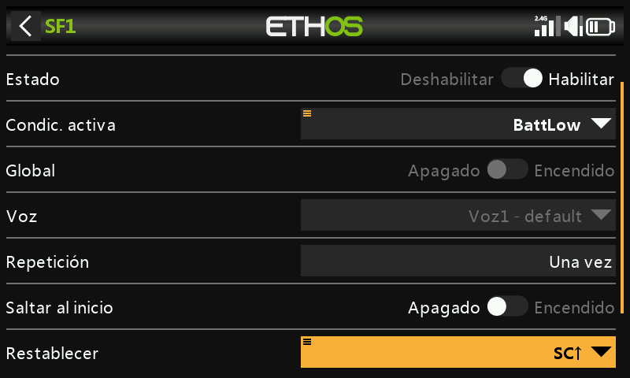
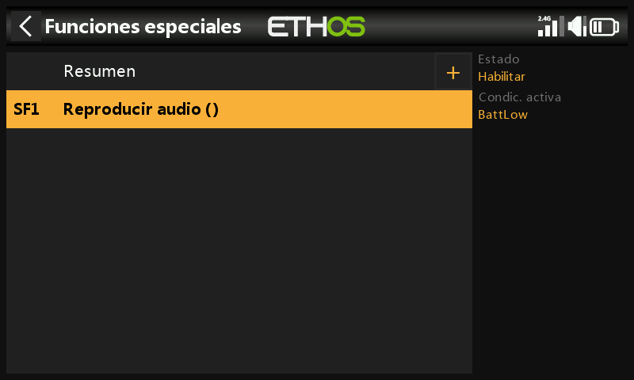

# Aviso de batería baja

Monitorizar la tensión del pack de vuelo **bajo carga** y avisar por debajo de un
umbral es un método más fiable que confiar en un temporizador fijo — un
sensor como el FrSky FLVSS lo hace muy sencillo.

## 1. Conectar y detectar el sensor

Configure [Opciones del receptor → Puerto de
telemetría](../system-setup/devices.md) como **S.Port**, conecte el FLVSS al
receptor mediante un cable S.Port y active **Detectar nuevos sensores** en
[Telemetría](../model-setup/telemetry.md) — el sensor LiPo aparecerá
junto a los demás ya detectados.

## 2. Añadir un interruptor lógico

Añada un nuevo [interruptor lógico](../model-setup/logical-switches.md) con el
sensor LiPo como fuente. Mantenga pulsado `ENT` sobre el sensor resaltado para
elegir cuál de sus valores utilizar:

- Tensión mínima del pack / Tensión máxima del pack
- **Tensión de la celda más baja** / Tensión de la celda más alta
- Número de celdas
- Tensiones de celdas individuales (solo seleccionables mientras el sensor está
  realmente conectado a un receptor vinculado con una LiPo conectada)

Seleccione **Lowest** (tensión de celda) — el valor que importa para una
protección de tipo LVC.

Establezca el valor de comparación en torno a **3,4 V** y **Retardo antes de activar**
en **4 segundos** — el interruptor pasa a verdadero cuando la celda más baja se
mantiene por debajo de 3,4 V por celda de forma continua durante 4 s o más. (3,4 V
*bajo carga* normalmente se recupera hasta unos 3,7 V al retirar la carga, por lo que
este umbral refleja una caída real y no simplemente ruido momentáneo.)

## 3. Añadir una función especial

Añada una [función especial de reproducción de audio](../model-setup/special-functions.md),
con la **Condición de activación** ajustada al interruptor lógico `BattLow`, elija una voz
y, en **Secuencia**, añada un paso **Reproducir valor** para la tensión total del
LiPo:

Con **Repetir** ajustado a 10 segundos, la tensión del LiPo se anuncia cada 10 s
mientras la celda más baja permanezca por debajo del umbral de 3,4 V/4 s.
