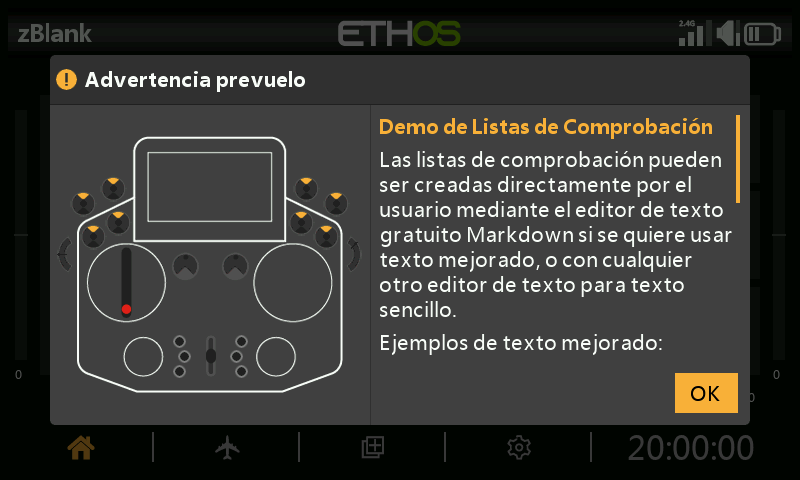

# Lista de verificación con texto definido por el usuario



La función [Lista de verificación](../model-setup/checklist.md) puede mostrar
texto personalizado al inicio —texto plano o con formato Markdown— de forma
automática, cada vez que se carga ese modelo.

## 1. Crear el texto de la lista de verificación

**Texto plano** — escríbelo en cualquier editor de texto (Notepad++, o incluso
MS Word guardando como texto plano) y guárdalo como `<model name>.txt`.

**Texto mejorado (Markdown)** — Ethos admite formato Markdown, por ejemplo
`##` para un encabezado o `**negrita**` para texto en negrita. Utiliza cualquier
editor de texto (incorporando la sintaxis Markdown manualmente) o un editor
Markdown específico (Nextpad, MarkText, etc.), y guárdalo como `<model name>.md`.

```markdown
## Emphasis
**this is bold text**
*this is italic text*
```

## 2. Copiarlo a la emisora

Copia el archivo en la misma carpeta `models/` donde se encuentra el archivo
`.bin` del propio modelo (consulta [Administrador de archivos](../system-setup/file-manager.md#top-level-folders)),
y después expulsa de forma segura las unidades de la emisora antes de
desconectarla.

## 3. Revisarlo

Carga el modelo: el texto de la lista de verificación aparecerá ahora
automáticamente como parte de las comprobaciones de inicio, con posibilidad de
desplazamiento si ocupa más de una pantalla.
