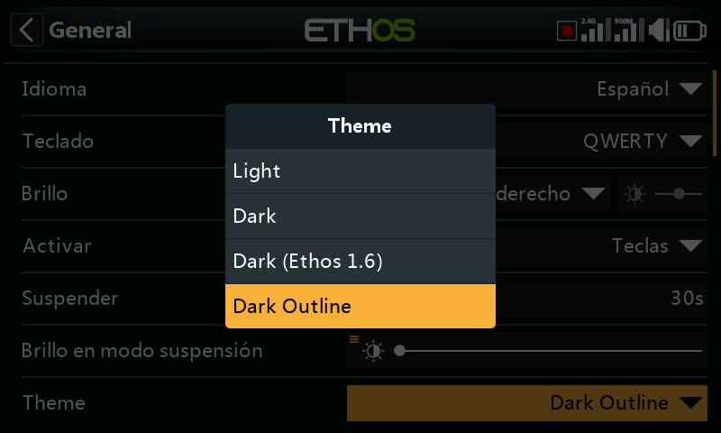
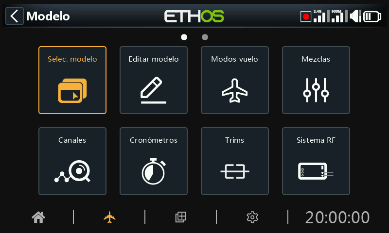

# Temas alternativos de visualización de Lua

Se pueden instalar temas alternativos para la pantalla utilizando un script de Lua. Se dan cuatro ejemplos en la carpeta lua/examples/theme en la rama 26.1 del repositorio Ethos-Feedback-Community en GitHub

| Oscuro (Ethos 1.6) | -- Colores desde Ethos 1.6.6 |
| --- | --- |
| Oscuro con reborde | -- Colores desde el tema modo Oscuro por defecto, pero con el estilo de borde enfocado (2px ancho de borde) |
| Oscuro (Copia) | -- Colores del tema Oscuro por defecto(como comentado) |
| Claro (copia) | -- Colores del modo Claro por defecto (como comentado) |

Para instalar estos temas, consulte la 'ubicación de los archivos de ejemplo de script ETHOS Lua' mencionada arriba y descargue el archivo 'theme/main.lua', y guárdelo en una carpeta 'theme' dentro de la carpeta de scripts en su SD o eMMC, o use una herramienta de descarga para descargar la carpeta 'theme'. Cuando reinicie la radio, los temas alternativos estarán instalados y disponibles en la lista desplegable Sistema / General / Tema.

El archivo de temas de ejemplo incluye copias de los temas estándar claro y oscuro que se pueden modificar para adaptarse a tus preferencias.

Una vez instalado, aparecerán dos temas adicionales en la lista de opciones Sistema / General / Tema. El primero es el tema ‘Oscuro (Ethos1.6)’ con los colores y sombreados de Ethos 1.6.

El segundo tema adicional usa contornos para el enfoque en lugar del resaltado invertido estándar.
