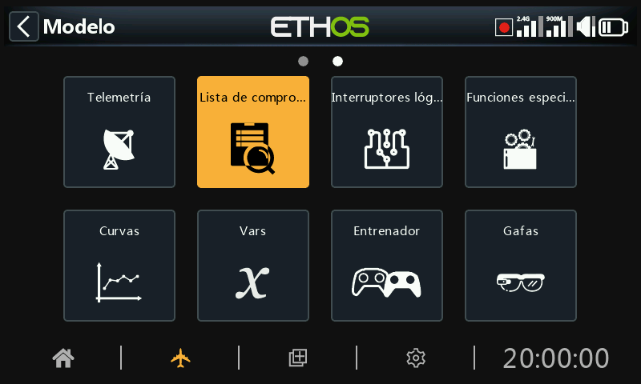

# Lista de Comprobación (Checklist)

La función Lista de Comprobación proporciona un conjunto de Comprobaciones Previas al Vuelo. Se trata de un grupo de características de seguridad que se comprueban al encender la radio y/o cargar un modelo de la lista de modelos.

Las comprobaciones por defecto incluyen que la radio está en modo silencioso, el failsafe no está activado, comprobación de posiciones de interruptores y potenciómetros, batería baja de la radio, batería RTC baja, etc. La comprobación de interruptores muestra la dirección en la que debe moverse el interruptor, que se ve en los puntos rojos en el ejemplo de la pantalla de advertencia anterior.

Tenga en cuenta que, contrariamente a la alerta, sólo la tecla OK o RTN permitirán omitir las deficiencias en las comprobaciones previas al vuelo.

Se pueden establecer comprobaciones adicionales, como se muestra más abajo.

## Comprobación del acelerador

Para activar la comprobación del acelerador, seleccione el operador que debe utilizarse. Las opciones son '<' menor que, '~' aproximadamente igual, o '>' mayor que. La comprobación previa al vuelo le avisará si la palanca del acelerador está fuera del valor establecido en el parámetro de valor.

## Comprobación del Failsafe

Cuando está activada, le avisará si no se ha configurado el Failsafe para el modelo actual. Es muy recomendable dejar esta opción activada.

## Comprobación de interruptores

Para cada interruptor, puede definir que la radio solicite que los interruptores estén en las posiciones predefinidas deseadas. Si los interruptores han recibido nombres definidos por el usuario en Sistema / Hardware / Configuración de interruptores, se mostrarán los nombres asignados.

La opción "Cargar todas las posiciones de los interruptores" permite leer las posiciones deseadas a partir de las posiciones actuales de los interruptores, excepto aquellas marcadas para no comprobarse (‘No Check’).

Las opciones a comprobarse se muestran arriba.

## Comprobación de los interruptores de función

Para cada interruptor de función, puede definir que la radio solicite que los interruptores estén en las posiciones predefinidas deseadas. Las opciones disponibles se muestran en la imagen de arriba.

La opción "Cargar todas las posiciones de los interruptores de función" permite leer las posiciones deseadas a partir de las posiciones actuales de los interruptores de función, excepto para aquellos marcados con la opción ‘No comprobar’.

## Comprobación de los Pots / Sliders

Define si la radio comprueba que los potenciómetros y deslizadores estén en posiciones predefinidas al encender la radio. Se pueden introducir los valores deseados para cada potenciómetro y deslizador.

La opción 'Cargar todas las posiciones de los pots' puede utilizarse para leer las posiciones deseadas a partir de las posiciones actuales de los pots, excepto para aquellos marcados como ‘No comprobar’. Debe comprobarse cuidadosamente que los operadores seleccionados automáticamente son los deseados (por ejemplo, '~' frente a '<' o '>').

Alternativamente, las funciones de comprobación se pueden ajustar individualmente (por ejemplo, ‘~’ vs ‘<’ o ‘>’).

## Texto definido por el usuario

La función ‘Checklist’ puede también mostrar un texto definido por el usuario. El texto puede ser normal o mejorado.

Una vez que hemos instalado un texto para un modelo determinado, cuando se seleccione este modelo la radio lo presentará como parte de la rutina de encendido de la radio. Para más detalle, vaya a la sección Cómo hacer un texto definido por el usuario para aprender a añadir un texto definido por el usuario.
