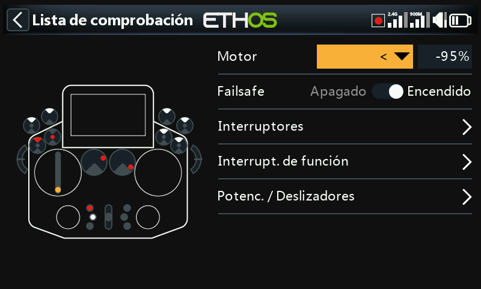
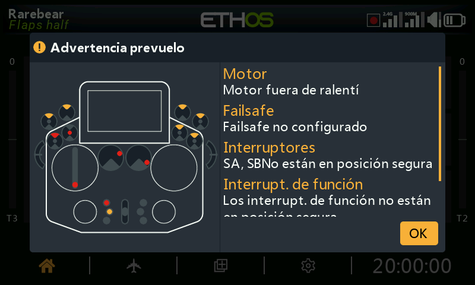
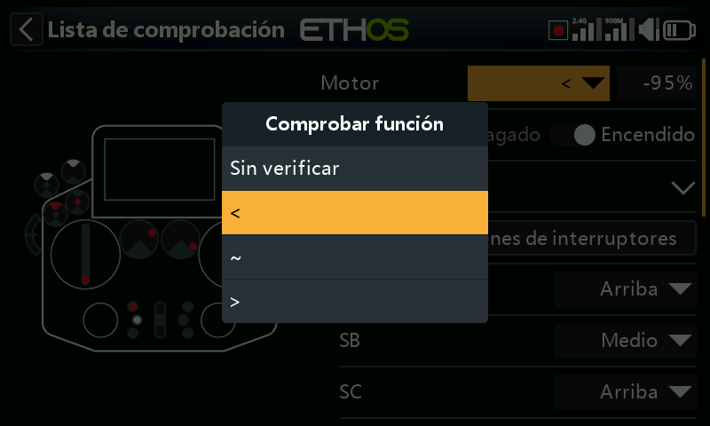
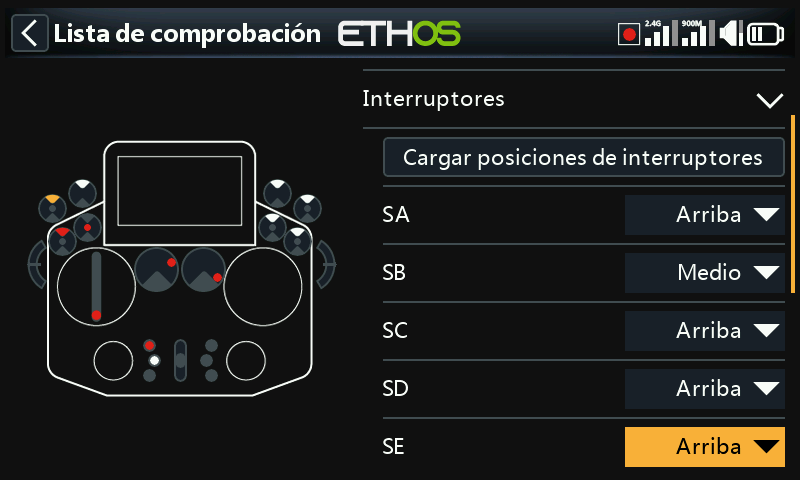
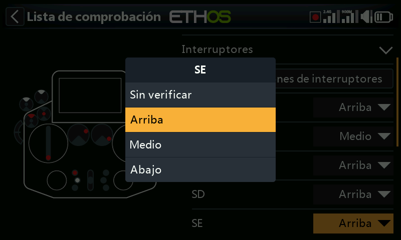
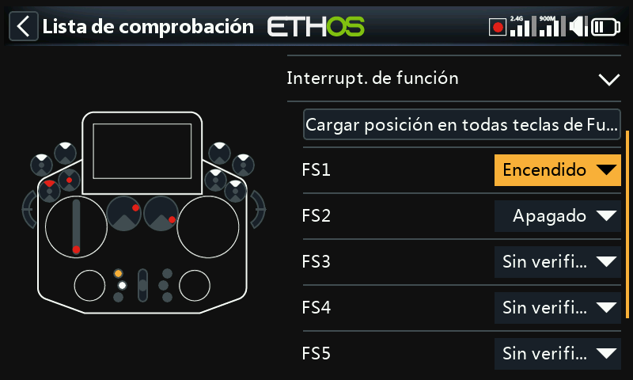
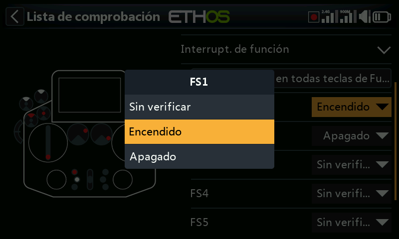
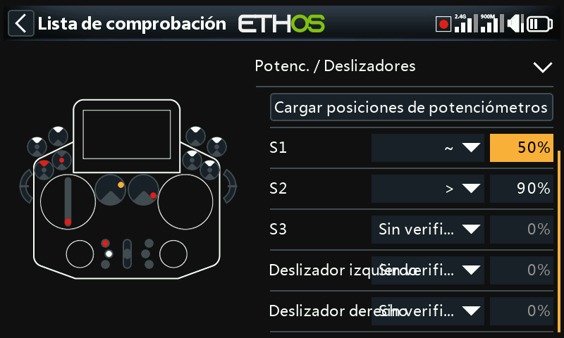
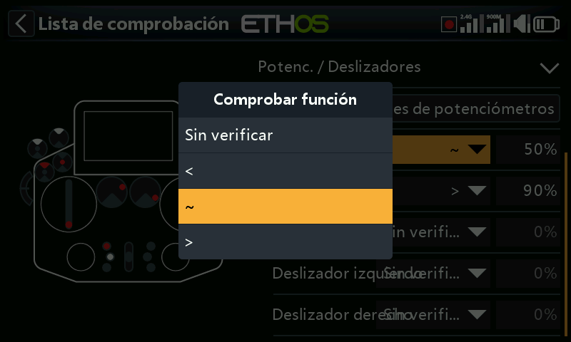

# Lista de verificación

Un conjunto de comprobaciones de seguridad previas al vuelo que se ejecutan
al encender la emisora y/o al cargar un modelo. Las comprobaciones
integradas incluyen el modo silencioso, el failsafe sin configurar, las
posiciones de los interruptores/potenciómetros y las baterías de la emisora
y del RTC: la comprobación de interruptores indica en qué dirección debe
moverse cada interruptor, señalado con puntos rojos en la pantalla de
advertencia:

!!! note
    Tanto `OK` como `RTN` omiten por completo las comprobaciones previas al
    vuelo, independientemente de lo que sugiera la advertencia en pantalla.

## Comprobación del acelerador

Actívela y elija un operador — `<` (menor que), `~` (aproximadamente igual)
o `>` (mayor que) — respecto a un valor; avisa si la palanca del acelerador
está fuera de lo que permite esa comparación.

## Comprobación del failsafe

Avisa si no se ha configurado el [failsafe](rf-system.md#failsafe) para el
modelo actual.

!!! tip
    Se recomienda encarecidamente dejar esta opción activada.

## Comprobación de interruptores

Permite exigir una posición concreta al arrancar para cada interruptor (los
interruptores con nombres personalizados definidos en [Configuración del
sistema → Hardware](../system-setup/hardware.md#switches-settings) muestran
esos nombres). **Cargar todas las posiciones de los interruptores** captura
las posiciones físicas *actuales* como posiciones deseadas para todos los
interruptores que no estén marcados como **Sin comprobación**.

## Comprobación de interruptores de función

La misma idea, aplicada a los seis [interruptores de
función](model-edit.md#function-switches). **Cargar todas las posiciones de
los interruptores de función** funciona igual que en el caso anterior.

## Comprobación de potenciómetros / deslizadores

Exige posiciones concretas de los potenciómetros/deslizadores al arrancar,
de forma individual para cada mando (`~`/`<`/`>`, igual que en la
comprobación del acelerador). **Cargar todas las posiciones de los
potenciómetros** captura automáticamente las posiciones actuales; revise
después con atención los operadores seleccionados automáticamente, ya que
`~` frente a `<`/`>` puede no corresponder con lo que realmente pretendía.

## Texto definido por el usuario

Muestra un archivo de texto plano o de texto enriquecido como parte de la
lista de verificación de arranque, una vez instalado para el modelo. Consulte
[Guía práctica: lista de verificación con texto definido por el
usuario](../how-to/user-defined-checklist.md) para la configuración completa.
