# Curvas

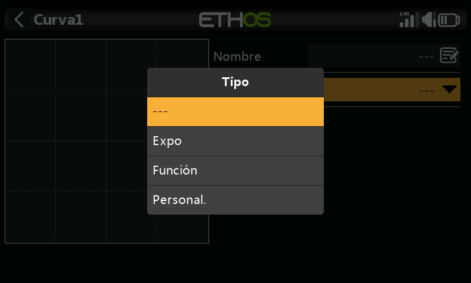

Curvas de respuesta reutilizables para [Mezclas](mixes.md#anatomy-of-a-mix) o
[Salidas](outputs.md#editing-a-channel) — el Expo integrado está disponible
directamente en ambas, pero cualquier cosa más elaborada se define aquí (o
mediante **Añadir curva**, accesible directamente desde cualquiera de las dos
pantallas de edición). Se dispone de hasta 50 curvas; no existe ninguna por
defecto (el Expo siempre está integrado, independientemente de ello). Añada una
con **+**; toque una curva existente para
**Editar**/**Mover**/**Copiar-pegar**/**Clonar**/**Eliminar**.

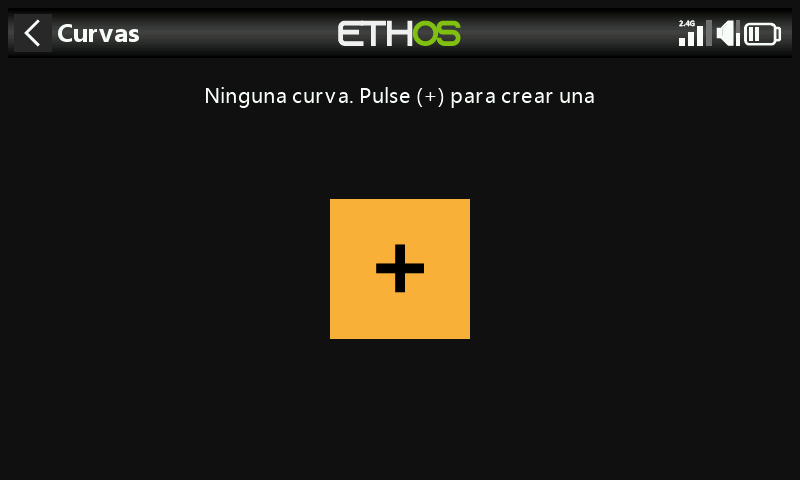

## Tipos de curva

- **Expo** — valor por defecto 40; un valor positivo suaviza la respuesta en
  torno al centro, uno negativo la hace más agresiva. Suavizar la zona central
  del stick ayuda a evitar el sobrecontrol, especialmente en pilotos con menos
  experiencia.

  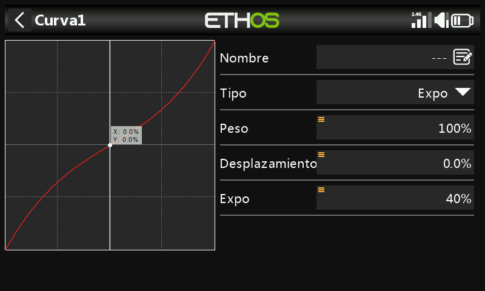

- **Función** — un pequeño conjunto de formas matemáticas fijas:

  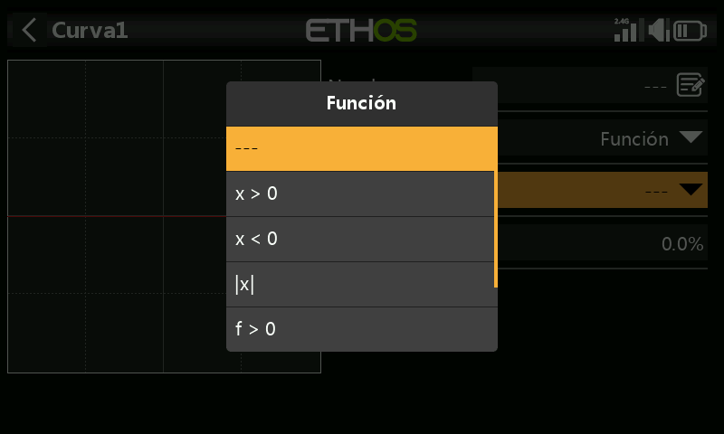

  - **x > 0** — deja pasar la fuente sin modificar mientras es positiva;
    devuelve 0 mientras es negativa.

    

  - **x < 0** — el reflejo: deja pasar la fuente mientras es negativa, 0
    mientras es positiva.

    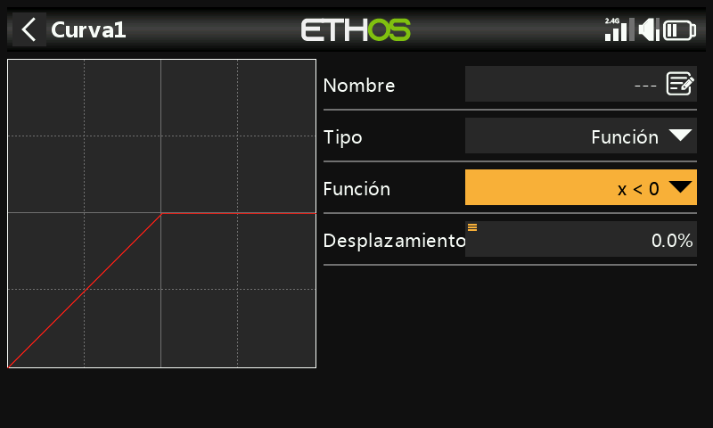

  - **|x|** — deja pasar la fuente como su valor absoluto (siempre
    positivo).

    

  - **f > 0** — devuelve 100 % mientras la fuente es positiva, 0 mientras es
    negativa (un conmutador brusco, no un paso directo).

    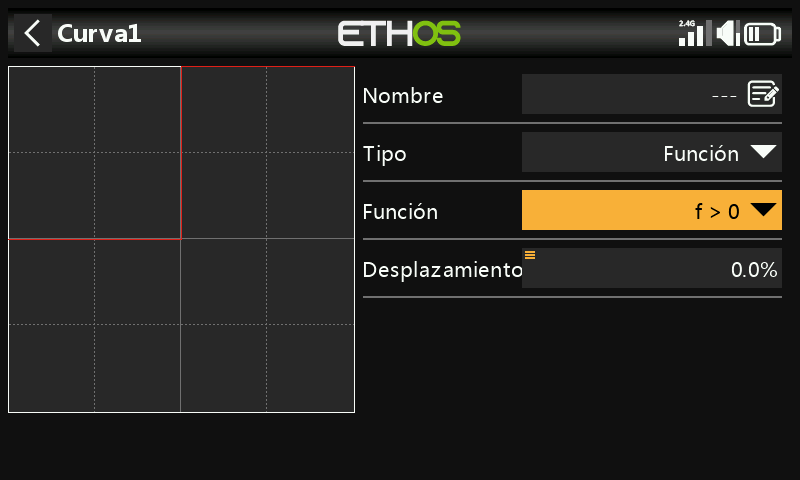

  - **f < 0** — devuelve −100 % mientras es negativa, 0 mientras es positiva.

    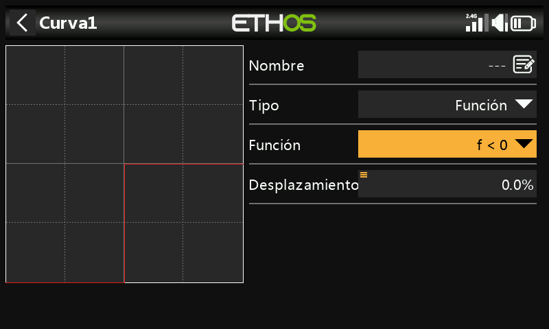

  - **|f|** — devuelve −100 % mientras es negativa, +100 % mientras es
    positiva.

    

  Todos los tipos de curva —incluida la Función— disponen además de un
  **Offset**, que la desplaza hacia arriba o hacia abajo en el eje Y (con
  precisión de un decimal, igual que los valores de Y en general):

  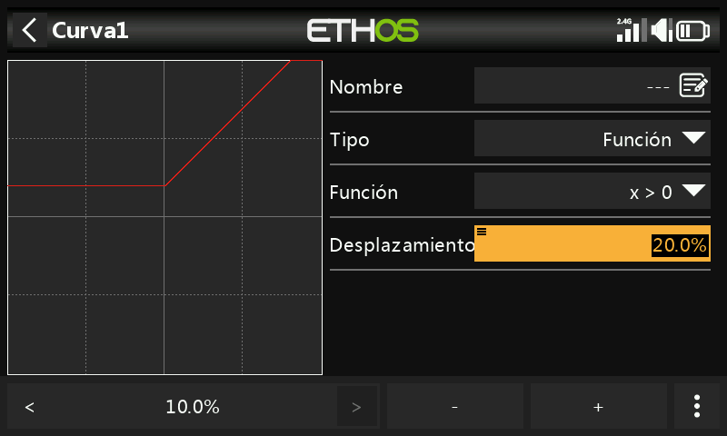

- **Personalizada** — una curva basada en puntos, 5 puntos por defecto, hasta
  21.

  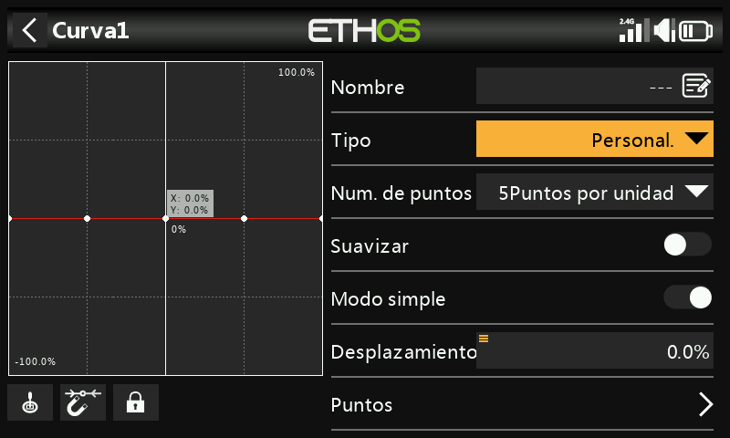

  - **Suavizado** — traza una curva suave que pasa por todos los puntos en
    lugar de segmentos rectos entre ellos.

    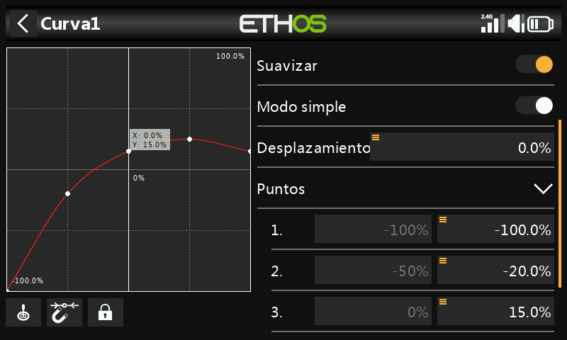

  - **Modo fácil** — **On** limita la edición a coordenadas Y con separación
    uniforme (X queda fija); **Off** permite editar tanto X como Y en cada
    punto, salvo los extremos de −100 %/+100 %, que están bloqueados porque la
    curva debe cubrir siempre todo el rango de la señal.

    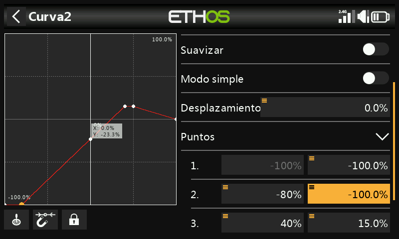

  **Controles del editor** (mismo esquema que el [editor de curvas de
  equilibrado de Salidas](outputs.md#balance-channels)):

  - **Fuente** — por defecto, la(s) propia(s) fuente(s) de mezcla de la curva,
    o **Entrada analógica automática** para capturar el primer
    stick/deslizador/potenciómetro que se mueva.
  - Ajuste al punto más cercano con el codificador rotatorio, y un conmutador
    **Bloquear** para congelar las entradas mientras se observa el movimiento
    resultante de la superficie de control.
  - Un cursor en vivo muestra el valor de entrada actual que acciona la curva,
    para ayudar a alinearlo con un punto antes de ajustarlo.

## Accionar una curva desde una Var

Tanto el **Offset** de una curva de Función como un punto individual de una
curva **Personalizada** pueden ser accionados por una [Var](variables.md) en
lugar de por un valor fijo — y esa Var, a su vez, puede ajustarse en vuelo
mediante un trim reasignado:

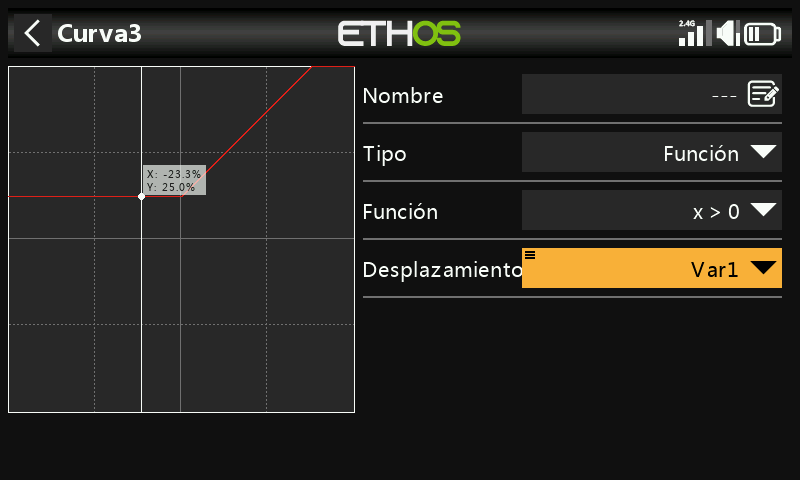
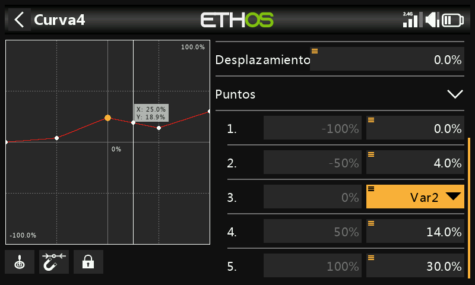

Consulte [Variables](variables.md) y [Guía práctica: curva de compensación
ajustable en vuelo](../how-to/in-flight-compensation-curve.md) para ver un
ejemplo completo y detallado de este patrón.
