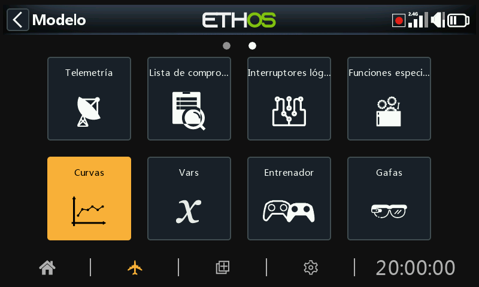
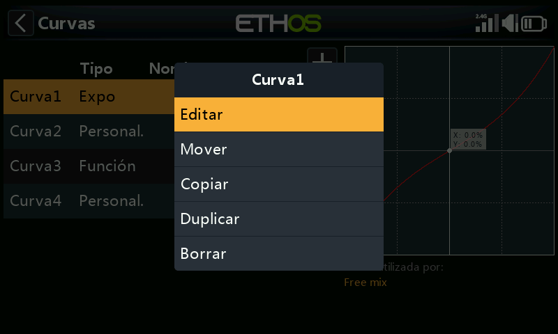
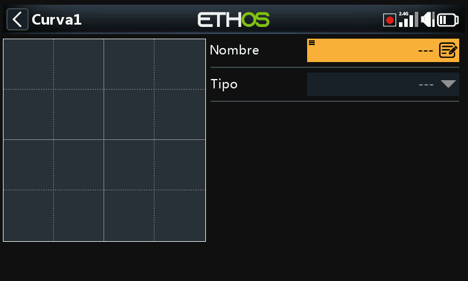
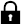
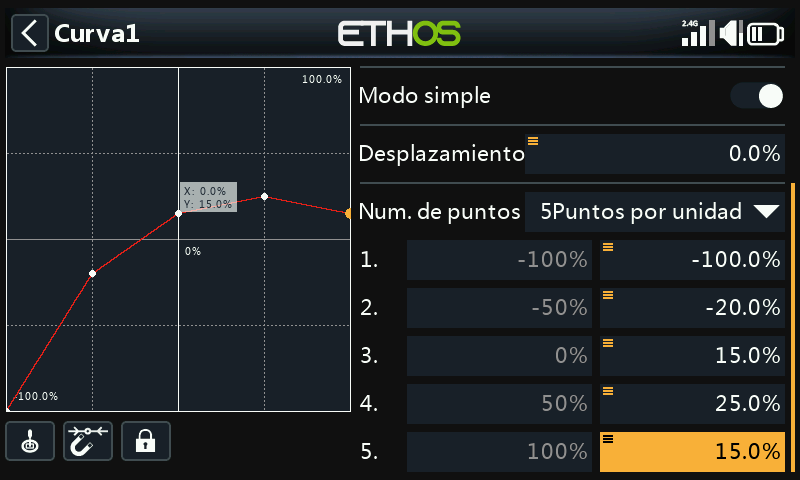

# Curvas

Las curvas se pueden utilizar para modificar la respuesta de control en las Mezclas o las Salidas. Aunque la curva Expo estándar está disponible directamente aquí, esta sección se utiliza para definir cualquier curva personalizada que pueda ser necesaria. También se puede acceder a la función "Añadir curva" directamente desde las pantallas de edición de Mezclas y de Salidas.

Hay 50 curvas disponibles.

No hay curvas por defecto (excepto Expo que es una siempre disponible). Pulse el botón "+" para añadir una nueva curva.

Una vez que se haya definido alguna curva, al pulsar sobre una de ellas, aparece un cuadro de diálogo que le permite Editar, Mover, Copiar/pegar, Duplicar o Borrar la curva resaltada.

La pantalla inicial le permite asignar un nombre a su curva y seleccionar el tipo de curva.

Los tipos de curva disponibles son:

## Expo

La curva exponencial por defecto tiene un valor de 40.

Un valor positivo suavizará la respuesta en torno a 0, mientras que un valor negativo agudizará la respuesta en torno a 0. Suavizar la respuesta en torno a la mitad de la palanca ayuda a evitar un control excesivo del modelo, especialmente para los principiantes.

## Función

Están disponibles las siguientes curvas de funciones matemáticas:

### x > 0

Si el valor de la fuente es positivo, la salida de la curva sigue a la fuente. Si el valor de la fuente es negativo, la salida de la curva es 0.

#### Desplazamiento (Offset)

Tenga en Cuenta que en todas las curvas se puede configurar un desplazamiento positivo o negativo que moverá la curva en el eje Y hacia arriba o hacia abajo.Los desplazamientos de las curvas y los valores de Y tienen un decimal de precisión.

### x < 0

Si el valor de la fuente es negativo, la salida de la curva sigue a la fuente. Si el valor de la fuente es positivo, la salida de la curva es 0.

### |x|

La salida de la curva sigue a la fuente, pero siempre es positiva (también llamada "valor absoluto").

### f > 0

Si el valor de la fuente es negativo, entonces la salida de la curva es 0. Si el valor de la fuente es positivo, entonces la salida de la curva es 100%.

### f < 0

Si el valor de la fuente es negativo, la salida de la curva es -100%. Si el valor de la fuente es positivo, la salida de la curva es 0.

### |f|

Si el valor de la fuente es negativo, la salida de la curva es -100%.

Si el valor de la fuente es positivo, la salida de la curva es +100%.

## A medida

### Número de Puntos

La curva personalizada por defecto tiene 5 puntos. Se pueden tener hasta 21 puntos en cada curva.

##### Menu buttons

 Se pueden usar la/s fuente/s que se hayan configurado en las mezclas de la curva, u opcionalmente cualquier otra entrada analógica. Si selecciona esta opción de 'Entrada analógica automática’ la primerar palanca, slider o pot que se mueva se usará como fuente de las X.

Tenga en cuenta que este botón sólo aparecerá si la curva está asociada a una mezcla.

Cuando se selecciona este icono, El punto más cercano del eje X de la curva se seleccionará automáticamente para su ajuste con el selector rotatorio.

La entrada debe ajustarse para alinear el valor X de la curva con un punto de la curva, antes de hacer el ajuste.

 Tocando este icono, o presionando la tecla ENTER mientras se está en el modo de edición del gráfico activará o desactivará el Modo de blocaje. Cuando se activa, se congelan todas las entradas para que se pueda soltar la palanca y le permita observar las superficies de control mientras ajusta la curva.

Para ayudar en los ajustes, el cursor estará activo mostrando el valor de la entrada que está modificando la curva.

Los desplazamientos de la curva y los valores de Y tienen un decimal de precisión.

### Suavizar

Si se activa, se crea una curva suavizada que pasa a través de todos los puntos.

### Modo simple = On

El modo simple tiene valores fijos equidistantes en el eje X, y sólo permite programar las coordenadas Y de la curva.

### Modo simple = Off

#### Puntos

Con el Modo simple desactivado, pueden configurarse tanto las coordenadas X como Y, (véase el ejemplo anterior).  Tenga en cuenta que las coordenadas -100% y +100% X para los puntos finales de la curva no se pueden editar, porque la curva debe cubrir todo el rango de la señal.

## Función cambiar en vuelo el desplazamiento de una curva

El ejemplo de arriba muestra como el desplazamiento de una curva de tipo ‘Función’ es controlada por un Var, que probablemente se podría ajustar en vuelo mediante una reasignación de un compensador.

## Cambiar los puntos de una curva en vuelo

En este ejemplo, el punto medio de la curva está controlado por un Var, que de nuevo puede ajustarse en vuelo mediante la reasignación de un compensador. Vaya a la sección [VARs](variables.md) para más detalles.
