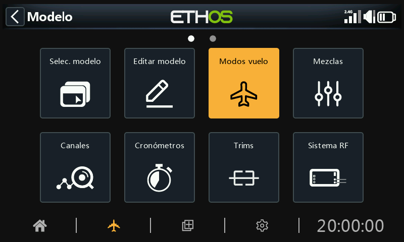
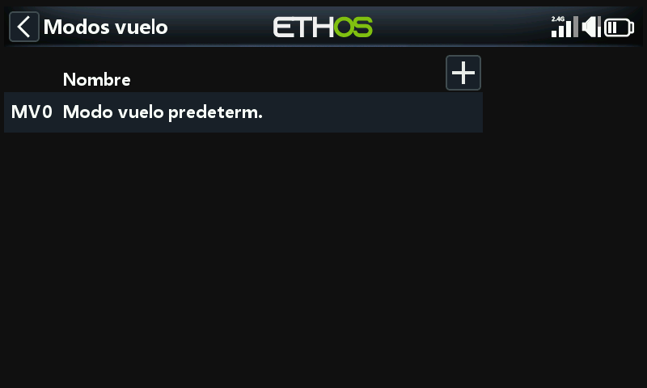
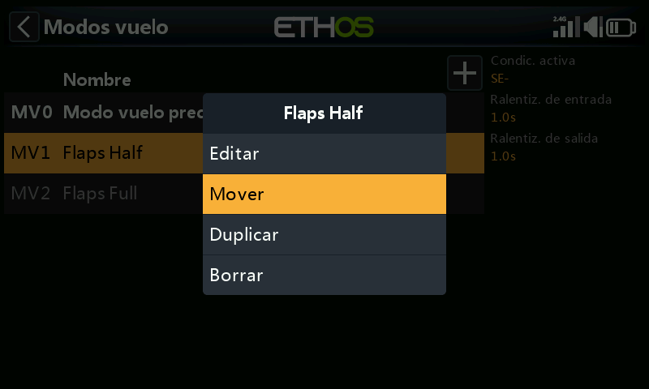
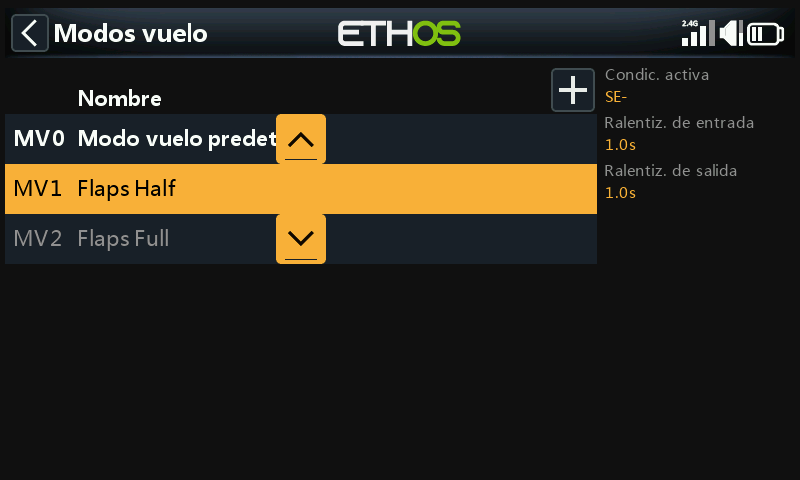

# Modos de vuelo

Los modos de vuelo aportan una increíble flexibilidad a la configuración de un modelo, ya que permiten que los modelos se configuren para tareas específicas o comportamientos. Por ejemplo, los planeadores pueden configurarse para tener modos seleccionables como Despegue, Crucero, Velocidad y Térmico. Los aviones a motor pueden tener modos de vuelo de normal de precisión, Despegue y Aterrizaje con flaps a mitad o con todo flaps desplegados. Los helicópteros pueden tener modos tales como Normal para el rodaje y despegue/aterrizaje, Ralentí 1 para vuelo acrobático y Ralentí 2 para quizás 3D.

Los modos de vuelo eliminan gran parte de la carga de trabajo del piloto con interruptores y compensadores.

La gran potencia de los modos de vuelo es que admiten compensados independientes, y pueden usarse para activar Variables y mezclas. Juntas, estas características permiten una gran flexibilidad. Consulte la [Introducción a Modos de Vuelo](../tutorials/basic-fixed-wing.md) en la sección Tutoriales para ver ejemplos aplicados de estas características.

El modo de vuelo MV0 por defecto estará inactivo hasta que se configure. Pulse el botón ‘+’ para definir un nuevo modo de modo de vuelo. Puede haber hasta 20 modos de vuelo por modelo.

## Nombre

Permite darle un nombra al modo de vuelo.

## Condición activa

Cuando se añade un modo de vuelo la condición activa por defecto es ‘inactivo’, es decir '---'. Los modos de vuelo pueden ser controlados por posiciones de interruptores, botones, interruptores de función, interruptores lógicos, un evento del sistema (como el corte o retención del acelerador) o posiciones de compensado.

Tenga en cuenta que el modo de vuelo por defecto no tiene un parámetro de ‘condición activa’ porque este es el modo de vuelo que siempre estará activo cuando ningún otro modo de vuelo lo esté. El primer modo de vuelo que tiene su interruptor en ON es el activo. Tenga en cuenta que sólo un modo de vuelo está activo a la vez.

El modo de vuelo activo se muestra en negrita.

## Ralentizado de entrada y salida

Son tiempos asignados para hacer transiciones suaves entre distintos modos de vuelo. El ejemplo muestra un segundo asignado a cada uno. Debe tener en cuenta que los retardos en entrada y salida solo funcionarán si las mezclas que los necesiten son dependientes de los modos de vuelo.

Una vez programado, el modo de vuelo activo se muestra en las mezclas. Puede programarse hasta 100 modos de vuelo distintos. Como en la mayoría de las funciones en ETHOS, el usuario puede añadir un texto descriptivo en los modos de vuelo, como pueden ser crucero, velocidad, térmico, normal, despegue, aterrizaje, etc.

También debe tener en cuenta que cuando se añade un nuevo modo de vuelo en un modelo, debe comprobarse el comportamiento correcto de todas las mezclas, ya que el modo de vuelo estará activo por defecto en todas las mezclas que usen modos de vuelo. Esto será un problema, por ejemplo, cuando se usa una mezcla para bloquear un canal específico en algún modo de vuelo.

## Gestión de modos de vuelo

Pulse sobre un modo de vuelo para abrir un menú que le permite editar, mover, duplicar y borrar. Se pueden añadir nuevos modos de vuelo pulsando el botón ‘+’ en la parte de arriba.

Un modo de vuelo clonado heredará los ajustes y mezclas originales, de forma que se comporten de la misma forma, estando activo o no cuando este modo se active. El nuevo modo clonado debería añadirse al final de la lista de modos de vuelo, para que no interfiera con los demás modos de vuelo que se hayan introducido en el modelo.

Puede utilizar la opción "Mover" para cambiar la prioridad de un modo de vuelo. La prioridad de los modos de vuelo es en orden ascendente, y el primero que tiene su interruptor en ON es el activo.
