# Gafas

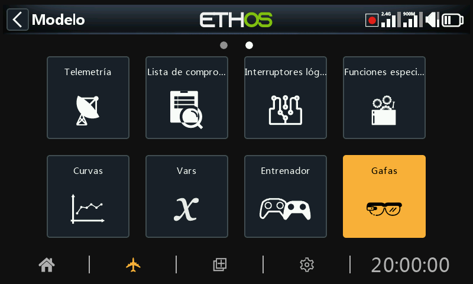

El menú Gafas facilita la conexión y configuración de gafas ActiveLook, permitiendo al usuario visualizar en tiempo real en las gafas los datos de vuelo, telemetría, y vídeo FPV video como un ‘heads-up display’.

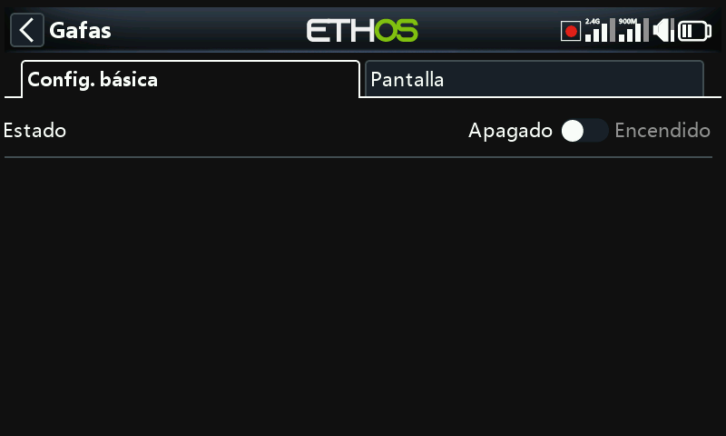

El menú Gafas consiste en dos pestañas, ‘Configuración básica’ para configurar la conexión, y ‘Pantalla’ para configurar la información que se visualiza en ellas.

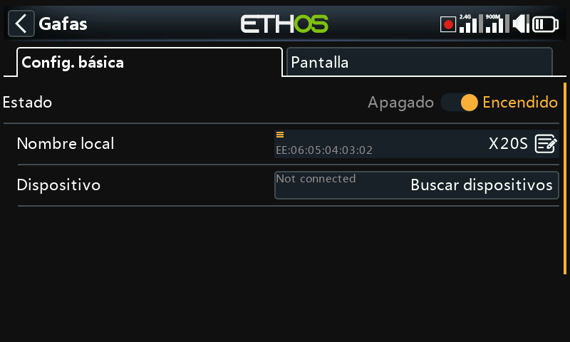

## Configuración básica

### Estado

La función Gafas puede activarse o desactivarse.

### Nombre local

#### Dirección local

Es la dirección local Bluetooth de la radio.

Es el nombre local BT que se mostrará entre los dispositivos conectados. El nombre por defecto es el modelo de la radio, pero puede editarse.

### Dispositivo

#### Buscar dispositivos

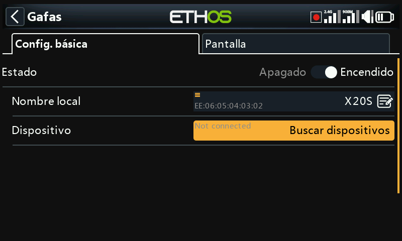

Toque en 'Buscar dispositivos' para poner la radio en modo búsqueda.

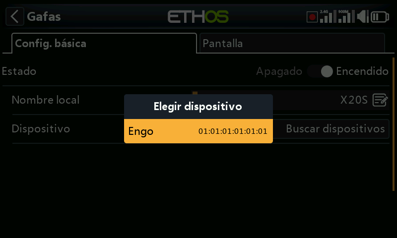

Los dispositivos encontrados se muestran en un cuadro de diálogo emergente con una solicitud para seleccionar un dispositivo. Seleccione la dirección BT que coincida con las gafas que se van a usar.

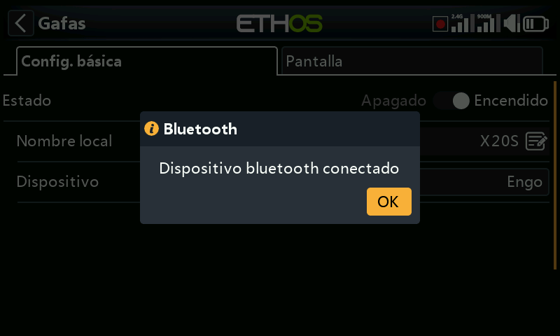

El dispositivo BT seleccionado se ha conectado.

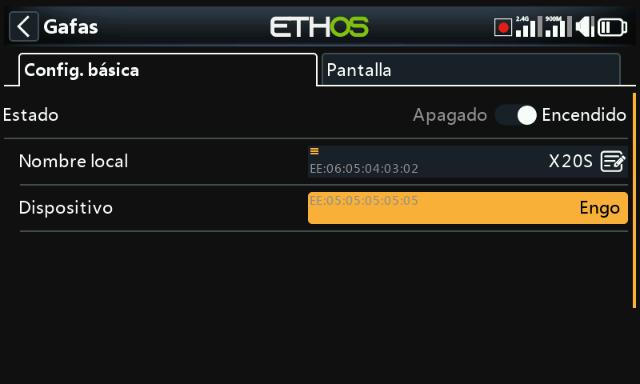

Una vez que que las gafas se han encontrado y enlazado, la dirección de Bluetooth de las gafas se muestra en la línea de Dispositivo.

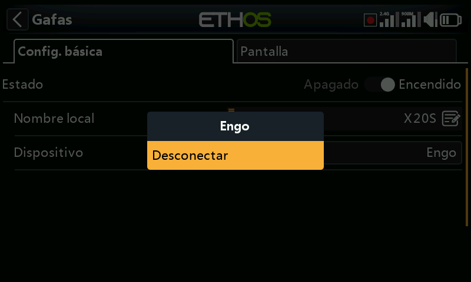

#### Desconectar

Toque en el dispositivo para mostrar una opción de Desconectar.

## Pantalla

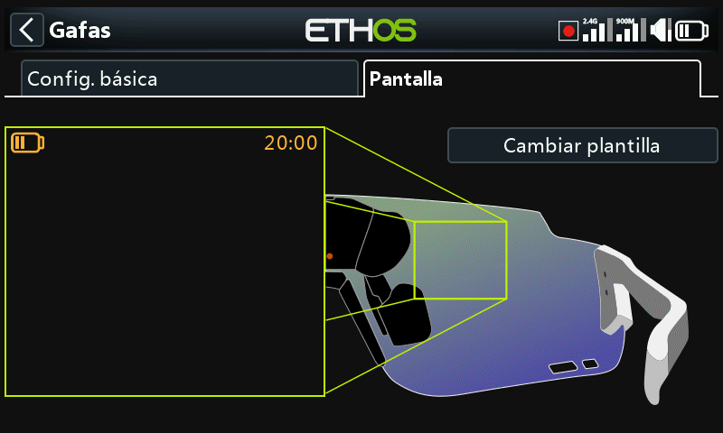

La pestaña de ‘Pantalla se usa para configurar la información que se muestra en las gafas.

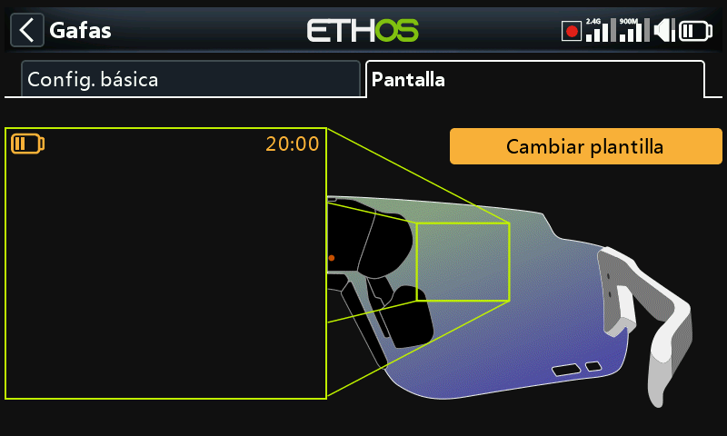

Toque el botón ‘Cambiar plantilla’ para abrir el cuadro de diálogo de selección del diseño de pantalla.

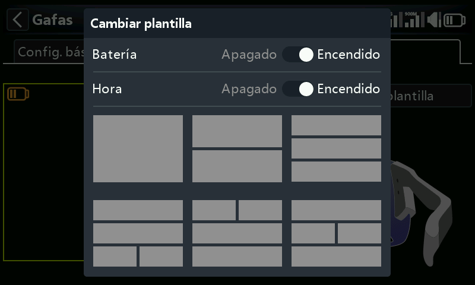

Seleccione el diseño deseadode entre las 6 opciones del menú.

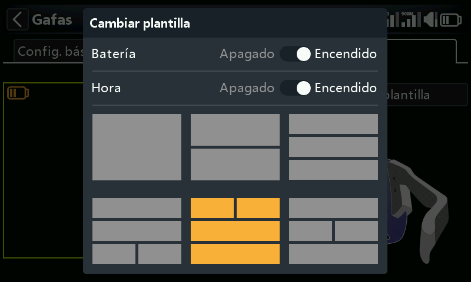

Para este ejemplo, hemos elegido la opción 5

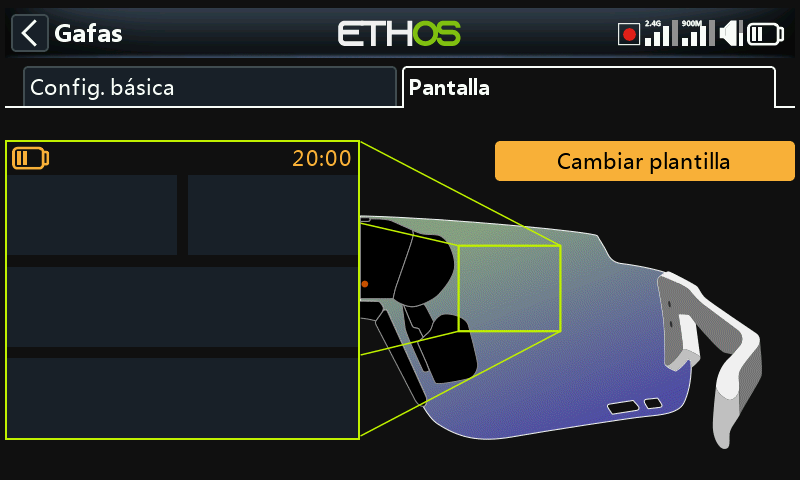

La plantilla 5 está lista para configurarse.

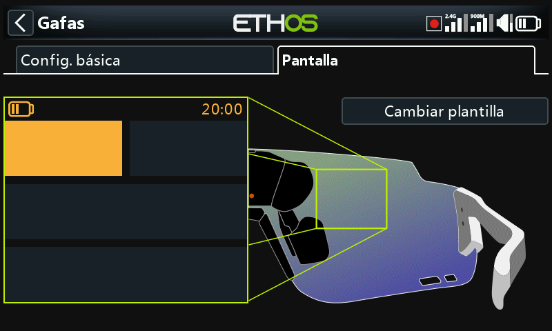

Seleccione el primer widget 1 para su ajuste.

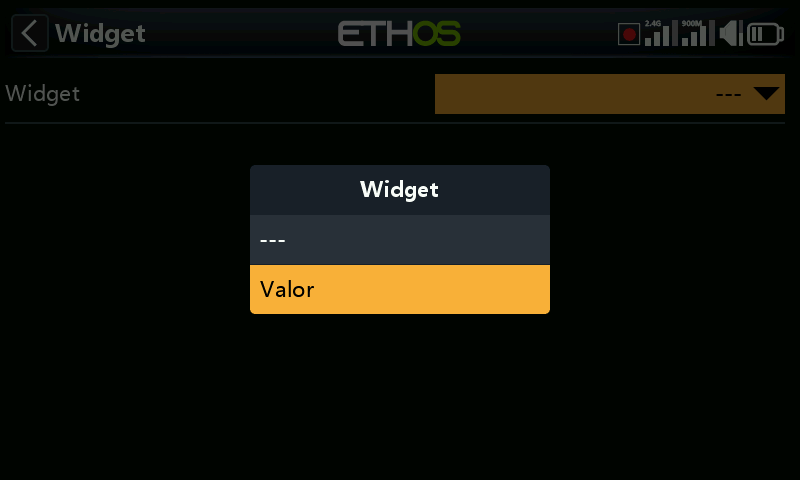

En esta etapa solo están disponibles los widgets de Valor para la selección.

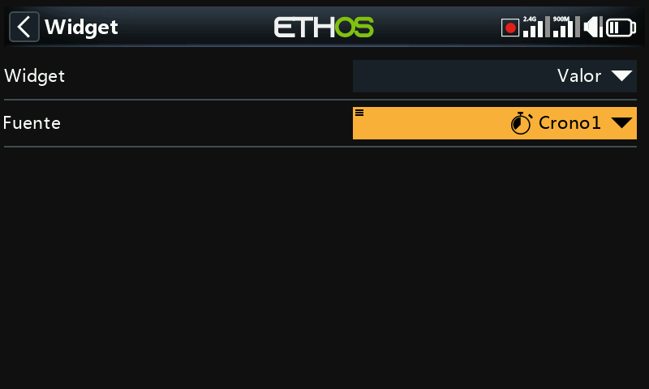

Para este ejemplo, se ha seleccionado el Crono 1 para visualizarse.

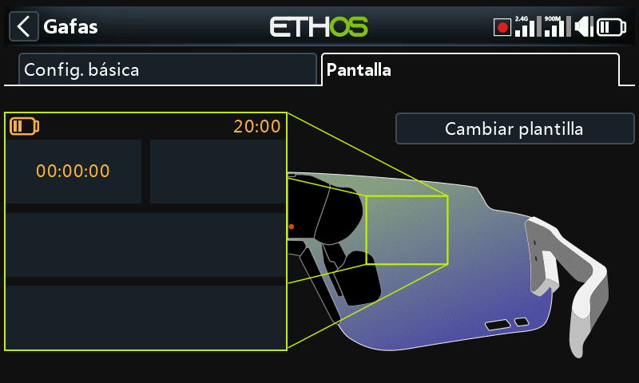

Widget 1 se ha configurado para mostrar el Crono 1.

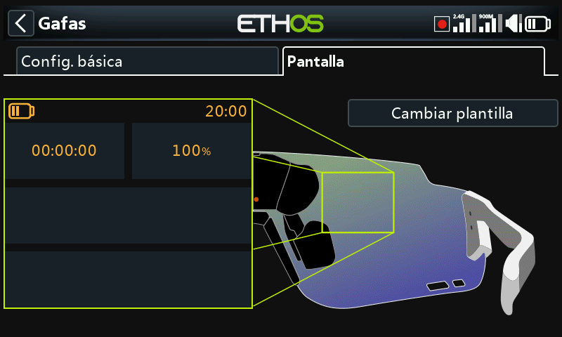

y el widget 2 para mostrar VFR Min.
