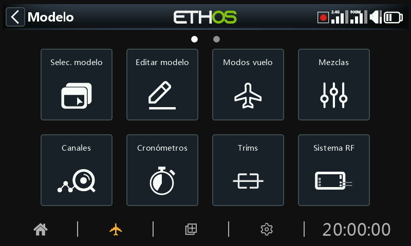

# Descripción

En la Configuración de sistema, toque algún cuadrado para configurar la sección deseada, o use el selector rotario para mover la selección al cuadrado deseado, y presione Enter. También puede deslizar la pantalla hacia la izquierda para acceder a la segunda página de funciones, o usar el selector rotario para mover la parte realzada a la segunda página. Alternativamente, se puede usar la tecla Page para cambiar entre las páginas.

## Seleccionar modelo

La opción “Selección de modelo” se utiliza para crear, seleccionar, añadir, clonar o eliminar modelos. También se utiliza para crear y gestionar carpetas de categorías de modelos definidas por el usuario.

## Editar modelo

La opción "Editar modelo" se utiliza para editar los parámetros básicos del modelo configurado por el asistente, y principalmente para editar el nombre o la imagen del modelo. También se utiliza para configurar los interruptores de función, que son específicos del modelo.

## ***M******od******o******s*** ***de vuelo***

Los modos de vuelo permiten configurar los modelos para tareas específicas o comportamientos de vuelo seleccionables mediante interruptores. Por ejemplo, los planeadores pueden configurarse para tener modos de vuelo como por ejemplo Despegue, Crucero, Velocidad y Térmico. Los aviones a motor suelen configurarse para tener modos de vuelo Normal, Despegue y Aterrizaje. Los helicópteros tienen modos como Normal para la puesta en marcha, el despegue y aterrizaje, Ralentí 1 para vuelo acrobático y Ralentí 2 para (quizás) vuelo 3D.

## Mezclas

La sección \[Mezclas\] es donde se configuran las funciones de control del modelo. Permite combinar cualquiera de las muchas fuentes de entrada como se desee y asignarlas a cualquiera de los canales de salida.

Esta sección también permite condicionar la fuente definiendo pesos/velocidades y offsets, añadiendo curvas (por ejemplo, Expo). La mezcla puede activarse con interruptores y/o modos de vuelo, y se pueden añadir los retardos que se deseen.

## Canales

La sección \[Canales\] es la interfaz entre la "lógica" de configuración y el mundo real con servos, conexiones y superficies de control, así como actuadores y transductores. En las mezclas se configura lo que queremos que hagan nuestros diferentes controles. Esta sección permite adaptar estas salidas puramente lógicas a las características mecánicas del modelo. Aquí es donde configuramos los recorridos mínimos y máximos, la inversión del servo o canal, y ajustamos el punto central del servo o del canal usando el ajuste central PPM, o añadimos un offset usando subtrim. También podemos definir una curva para corregir cualquier problema de respuesta en el mundo real. Por ejemplo, se puede utilizar una curva para asegurar que los flaps izquierdo y derecho se mueven con precisión.

## Cronómetros

La sección Cronómetros se utiliza para configurar los ocho cronómetros disponibles.

## Compensadores

La sección de compensadores le permite configurar la amplitud de compensación y el tamaño de cada paso, además de configurar el comportamiento personalizado de las 4 palancas de control. También permite el uso de compensadores cruzados y configurar el compensador instantáneo. Algunas radios tienen dos interruptores de compensado adicionales T5 y T6, que son muy útiles para ajustes en vuelo. Se pueden configurar compensadores adicionales como sea necesario.

## ***Sistema*** ***RF***

Esta sección se utiliza para configurar el ‘ID de registro del propietario’ y los módulos internos y/o externos de RF. Aquí también se realiza la vinculación del receptor y se configuran las opciones del receptor.

El ‘ID de registro de propietario’ es un ID de 8 caracteres que contiene un código aleatorio único, que puede cambiarse si se desea. Este ID se convierte en el ID de Registro de Propietario al registrar un receptor. Introduzca el mismo código en el campo ID de propietario de sus otros transmisores con los que desee utilizar la capacidad Smart Share. Esto debe hacerse antes de crear el modelo en el que se desea utilizar esta opción.

## ***Telemetr******ía***

La telemetría se utiliza para transmitir información del modelo al piloto. Esta información puede ser bastante amplia, incluyendo RSSI (intensidad de la señal del receptor) la calidad VFR del enlace (Valid Frame Rate), varios voltajes y amperajes, y cualquier otra salida de sensores como la posición GPS, altitud, etc.

Tenga en cuenta que las pantallas de telemetría se configuran como vistas principales en la sección [Configurar pantallas](../displays/index.md).

## Lista de comprobación

La sección Lista de Comprobación se utiliza para definir alertas en el arranque de la radio, para verificar elementos tales como la posición inicial del acelerador, si el failsafe está configurado, las posiciones de los potenciómetros, los sliders, y las posiciones iniciales de los interruptores.

## Interruptores lógicos

Los interruptores lógicos son interruptores virtuales programados por el usuario. No son interruptores físicos que se accionan de una posición a otra, pero pueden utilizarse como activadores de programas del mismo modo que cualquier interruptor físico. Se activan y desactivan evaluando las condiciones de la programación. Pueden usar una variedad de entradas como interruptores físicos, otros interruptores lógicos, y otras fuentes como valores de telemetría, valores de las mezclas de un canal, valores de cronómetros, o vars. Incluso pueden utilizar valores emitidos por un script LUA del modelo.

## Funciones especiales

Aquí es donde se pueden utilizar los interruptores para activar funciones especiales como el modo entrenador, la reproducción de sonidos, la salida de voz de las variables, el registro de datos, etc. Las Funciones Especiales, se utilizan para configurar funciones específicas del modelo.

## Curvas

Las curvas personalizadas pueden utilizarse en el formato de entrada, en las mezclas o en las salidas. Hay 50 curvas disponibles, y pueden ser de varios tipos (entre 2 y 21 puntos, con coordenadas x fijas o definibles por el usuario).

Una aplicación típica en las mezclas es usar una curva Expo para suavizar la respuesta alrededor del centro de la palanca. También se puede utilizar una curva para suavizar una mezcla de compensación de flaps y elevador para que la aeronave no “flote" cuando se sacan los flaps.

En las Salidas se puede utilizar una curva equilibrada para asegurar un seguimiento preciso de los flaps izquierdo y derecho.

## Vars

Las Variables (Vars) se pueden usar para nombrar y almacenar los parámetros y ajustes de un modelo para que puedan usarse en cualquier parte de la programación de la radio, incluyendo las mezclas. Las Vars se deben considerar como contenedores que almacenan información.

## Entrenador

La sección Entrenador se utiliza para configurar la radio como Maestro o Esclavo en una configuración de entrenamiento. El enlace del entrenador puede ser por Bluetooth o por cable.

## Lua

Esta página se usa para administrar las fuentes Lua y las tareas que realizan, independientemente en cada modelo.
