# Interruptores lógicos

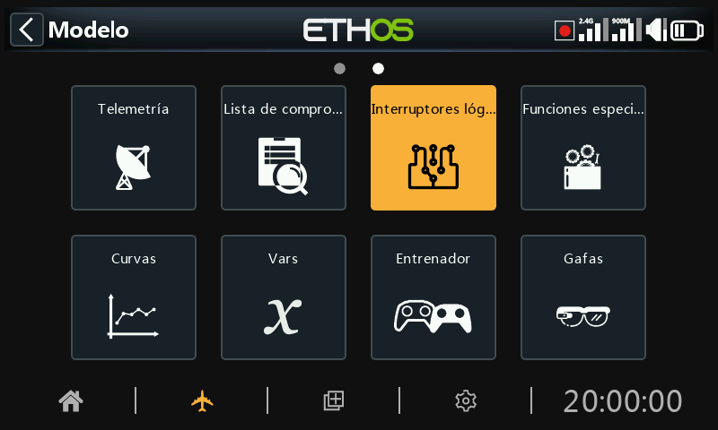

Los interruptores lógicos son interruptores virtuales programados por el usuario. No son interruptores físicos que se puedan mover de una posición a otra. Sin embargo, se pueden utilizar como activadores del programa, de la misma manera que cualquier interruptor físico. Se activan y desactivan (en términos lógicos se convierten en Verdadero o Falso) evaluando las condiciones de entrada contra la programación definida para ese interruptor lógico. Pueden usar una variedad de entradas, tales como controles físicos e interruptores, otros interruptores lógicos, y otras fuentes tales como valores de telemetría, valores de mezclas, valores de crono, giróscopo y canales de entrenador. Pueden incluso utilizar valores devueltos por un LUA script (que debe instalarse previamente).

Se admiten hasta 100 interruptores lógicos.

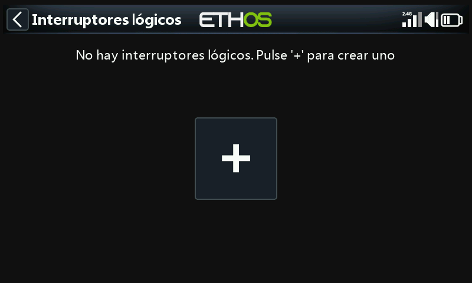

No hay interruptores lógicos predeterminados. Pulse el botón "+" para añadir un interruptor lógico.

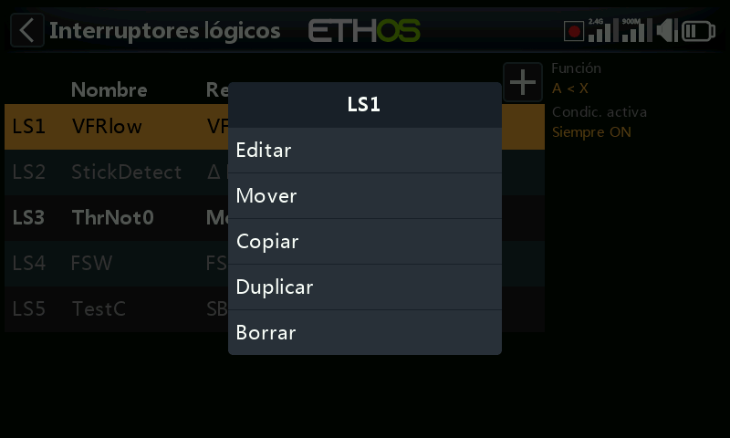

Una vez definidos los interruptores lógicos, al pulsar sobre uno de ellos aparecerá el menú emergente de la imagen anterior, que permite editar, añadir, mover, copiar/pegar, clonar o eliminar ese interruptor.

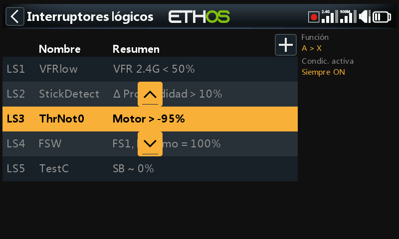

Al seleccionar "Mover" aparecerán las teclas de flecha que permiten mover el interruptor lógico hacia arriba o hacia abajo.

## Añadir interruptores lógicos

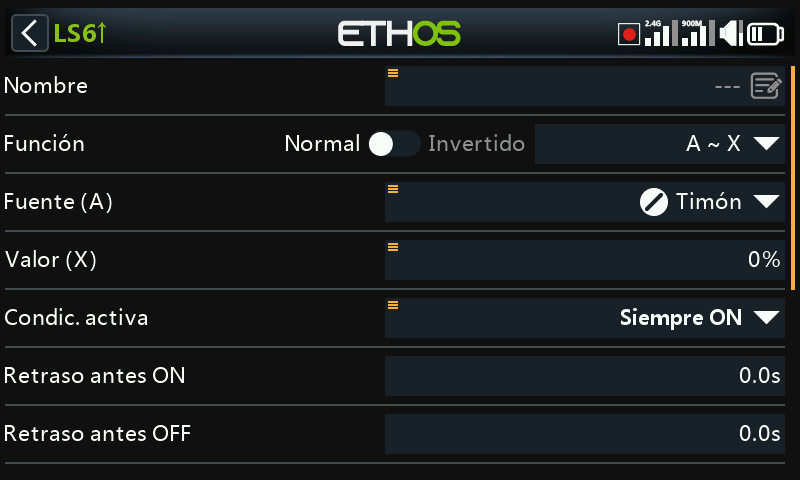

Tenga en cuenta que la etiqueta de un interruptor lógico aparecerá de color verde cuando la lógica del interruptor sea ‘Verdadera’, y en rojo cuando sea ‘Falsa’.

### Nombre

Permite asignar un nombre al interruptor lógico.

### Función

The functions available are listed below. Please note that all functions may have normal or inverted outputs. Please also refer to the shared parameters section, as well as the telemetry and comparison of sources sections following the function descriptions below.

#### A ~ X

La condición es ‘Verdadera’ si el valor de la fuente seleccionada 'A' es aproximadamente igual (dentro de un 10%) a 'X', valor definido por el usuario.

En la mayoría de los casos, es mejor utilizar la función “~” ("aproximadamente igual") que la función "exactamente igual".

#### A = X

La condición es ‘Verdadera’ si el valor de la fuente seleccionada 'A' es 'exactamente' igual a 'X', un valor definido por el usuario.

Hay que tener cuidado al utilizar la función "exactamente" igual. Por ejemplo, al comprobar si un voltaje es igual a un ajuste de 8,4V, la lectura telemétrica real puede saltar de 8,5V a 8,35V, por lo que la condición nunca se cumple y el interruptor lógico nunca se enciende.

#### A > X

La condición es ‘Verdadera’ si el valor de la fuente seleccionada 'A' es mayor que 'X', un valor definido por el usuario.

#### A < X

La condición es ‘Verdadera’ si el valor de la fuente seleccionada 'A' es menor que 'X', un valor definido por el usuario.

#### |A| > X

La condición es ‘Verdadera’ si el valor absoluto de la fuente seleccionada 'A' es mayor que 'X', un valor definido por el usuario. (Absoluto significa no tener en cuenta si 'A' es positivo o negativo, y sólo utilizar el valor).

#### |A| < X

La condición es ‘Verdadera’ si el valor absoluto de la fuente seleccionada 'A' es menor que 'X', un valor definido por el usuario. (Absoluto significa no tener en cuenta si 'A' es positivo o negativo, y sólo utilizar el valor).

#### ∆ > X

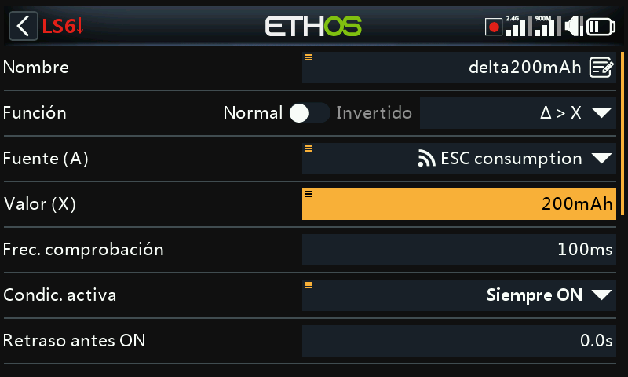

La condición es ‘Verdadera’ si el cambio en el valor 'd' (es decir, delta) de la fuente seleccionada 'A' es mayor o igual que el valor definido por el usuario 'X', dentro del 'Intervalo de comprobación'. Si el "Intervalo de comprobación" se establece en "---", el intervalo de comprobación será infinito.

Consulte Este ejemplo para ver un uso de la función Delta.

#### |∆| > X

La condición es Verdadera si el valor absoluto delta '|d|' en la fuente seleccionada 'A' es mayor o igual que el valor definido por el usuario 'X'. (Absoluto significa no tener en cuenta si 'A' es positivo o negativo). De nuevo, si el 'Intervalo de comprobación' se establece en '---', entonces el intervalo de comprobación se convierte en infinito.

#### Intervalo

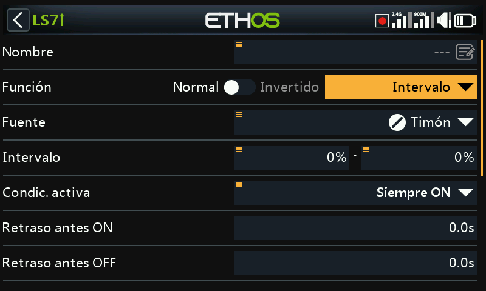

La condición es ‘Verdadera’ si el valor de la fuente seleccionada 'A' está dentro del intervalo especificado.

#### Y (AND)

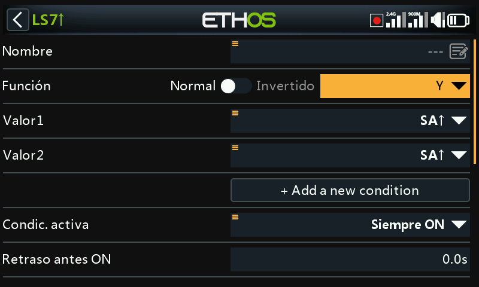

La función AND puede tener múltiples valores. La condición es ‘Verdadera’ si **todas** las fuentes seleccionadas en Valor 1, Valor 2 ... Valor(n) son verdaderas (es decir, ON).

#### O (OR)

La condición es ‘Verdadera’ si **al menos una o más** de las fuentes seleccionadas en Valor 1, Valor 2 ... Valor(n) son verdaderas (es decir, ON).

#### XOR (O Exclusivo)

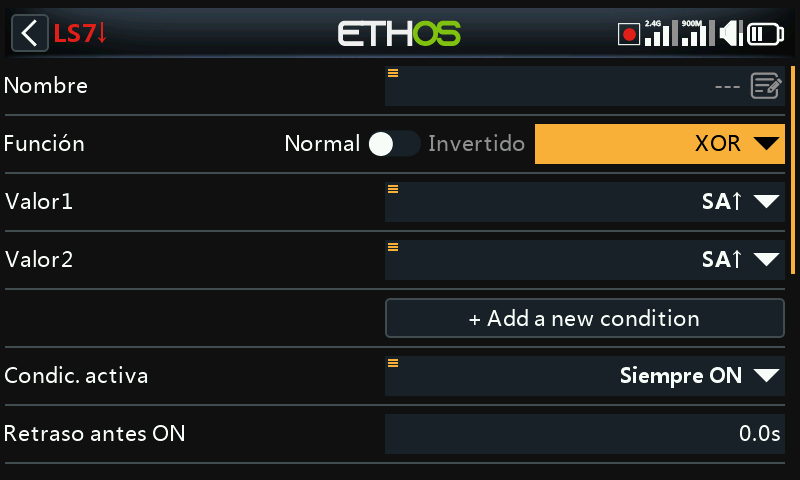

La condición es ‘Verdadera’ si **sólo una** de las fuentes seleccionadas en Valor 1, Valor 2 ... Valor(n) son verdaderas (es decir, ON).

#### Generador de cronómetros

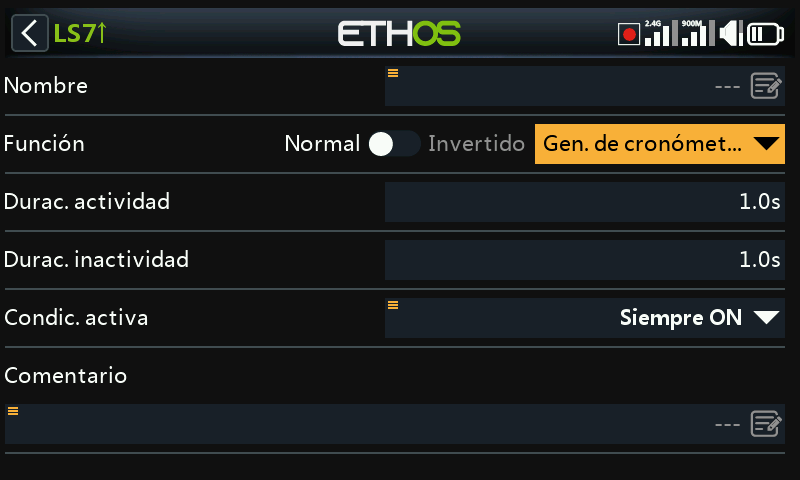

El interruptor lógico se activa y desactiva continuamente. Se enciende durante el tiempo "Duración activa" y se apaga durante el tiempo "Duración inactiva".

#### Sticky

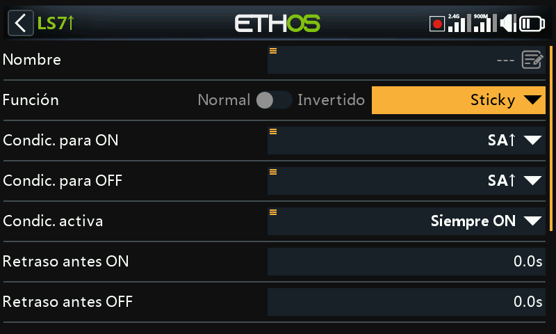

OR con opciones de borde:

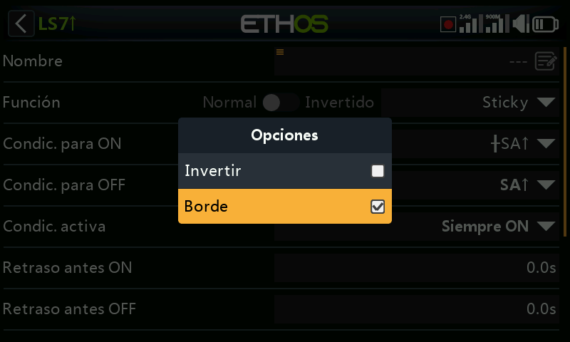

Para seleccionar la opción Borde, mantenga pulsada la tecla \[ENT\] en las condiciones de activación (Trigger ON) y desactivación (Trigger OFF) y entonces seleccione Borde. Un símbolo ‘†’ aparecerá delante de la fuente elegida para indicar que se ha seleccionado la opción borde.

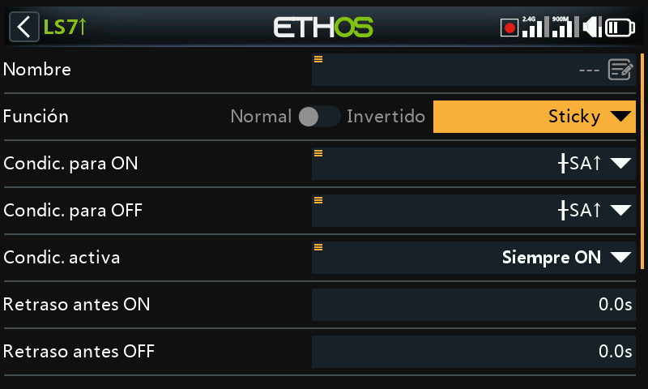

El interruptor lógico Sticky tiene una función de enganche/desenganche, también conocida como Set/Reset Flip-flop. Su operación es similar a la del un JK flip-flop, y por tanto siempre tiene estados no ambiguos en sus salidas. Se engancha (por ejemplo, cuando se hace Verdadera) cuando se cumplen las condiciones de enganche, y mantienen su valor hasta que son forzadas a hacerse falsas cuando las condiciones de desenganche se cumplen. Todo esto se puede regular con los parámetros de ‘Condición activa’. Esto quiere decir que si la condición activa se vuelve verdadera, entonces el resultado de la función de Sticky producirá el resultado acorde con la condición de enganche o desenganche, sujeto a los retrasos introducidos. Sin embargo, si la condición activa es Falsa, el resultado del interruptor lógico también se mantendrá en Falso.

**Not****a**: la función del interruptor lógico ‘Sticky’ se ha mejorado en Ethos 1.6.2 con la introducción de la opción ‘Borde’ en los parámetros de activación/desactivación, lo que permite una enorme flexibilidad en su configuración. Se debería realizar una cuidadosa comprobación para asegurar su correcta operación.

##### Condición para ON

Si la Condición para ON es por ejemplo SA↑ (sin retraso), entonces el resultado de Sticky cambiará de Falso a Verdadero tan pronto como el interruptor SA se mueva hacia arriba.

Si la condición para ON es SA↑ (retraso=1s), entonces el resultado de ‘Sticky’ cambiará de Falso a Verdadero 1 segundo después de que el interruptor SA se haya movido hacia arriba, siempre que ese interruptor SA permanezca arriba durante el retraso.

Si la condición para ON es ┼SA↑ (retraso=1s) entonces el resultado de ‘Sticky’ cambiará de Verdadero a Falso 1 segundo después de que SA esté arriba, incluso si SA no permanece arriba durante el retraso.

##### Condición para OFF

Si la condición para OFF es por ejemplo SB↑ (sin retraso) entonces el resutado de ‘Sticky’ cambiará de Verdadero a Falso tan pronto como el interruptor SB se mueva hacia arriba.

Si la condición para OFF es SB↑ (retraso=1s) entonces el resultado de ‘Sticky’ cambiaará de Verdadero a Falso 1 segundo después de que SB se mueva hacia arriba, siempre que el interruptor SB permanezca arriba durante el retraso.

Si la Condición para OFF es ┼SB↑ (retraso=1s) entonces ‘Sticky’ cambiará de Verdadero a Falso 1 segundo después de que el interruptor SB se mueva hacia arriba, incluso si SB no permanece en esa posición durante el retraso.

##### Condición Activa

Tenga en cuenta que la función ‘Sticky’ continua operando, incluso si su resultado está regulado por una entrada de una ‘Condición Activa’. Tan pronto como la condición activa se vuelva Verdadera de nuevo, la condición de activado/desactivado de ‘Sticky’ se cambiará a su resultado, sujeto a cualquier retraso.

##### Retardo antes de activo/inactivo

Los retardos para la activación/inactivación (ON / OFF) descritos arriba se aplican DESPUÉS de la condición activa. Esto quiere decir que si la condición activa cambia, los periodos de retardo se aplicarán antes de que la condición de ’Sticky’ se cambie de nuevo durante el resultado.

##### Function de alternancia

Cambios simultáneos de las condiciones de activación/desactivación de Falso a Verdadero harán que el resultado de ‘Sticky’ cambie su estado sólo una vez.

Nota: Vaya a la sección de ‘Parámetros comunes’ más abajo.

#### Borde

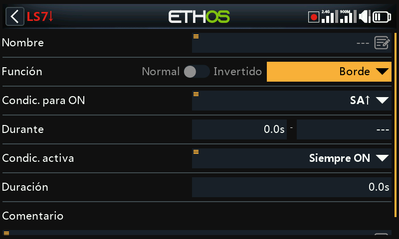

Edge es un interruptor momentáneo que se convierte en True durante el periodo especificado en 'Duración' cuando se cumplen sus condiciones de activación.

##### Opción de borde ascendente

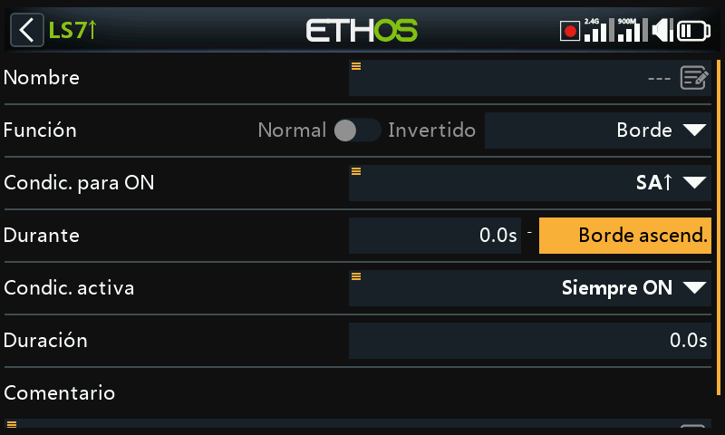

##### During = '0.0s'

“During” está dividido en dos partes \[t1:t2\]. Con t1 de “During” = 0,0s y t2= Rising Edge”, el interruptor lógico se convierte en ‘Verdadero’ (durante el periodo especificado en 'Duración') en el instante en que la 'Condición de activación designada' pasa de Falso a Verdadero.

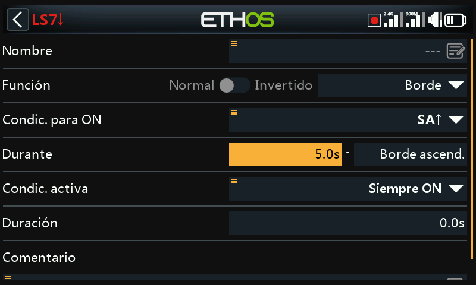

##### During >= '0.0s

“During” está dividido en dos partes \[t1:t2\]. Con t1 de “During” en un valor positivo (digamos 5.0s) y t2= “Rising Edge”, el interruptor lógico se convierte en Verdadero (durante el periodo especificado en 'Duración') 5 segundos después de que la 'Condición de activación' pase de Falso a Verdadero. Cualquier "pico" adicional durante el periodo t1 se ignora.

##### Opción de borde descendente

##### During = '0.0s'

‘During’ está dividido en dos partes: \[t1:t2\]. Con “During” t1=0.0s y t2= '---' (Falling Edge) el interruptor lógico se convierte en ‘Verdadero’ (durante el periodo especificado en 'Duración') en el instante en que la 'Condición de activación establecida' pasa de ‘Verdadera’ a ‘Falsa’.

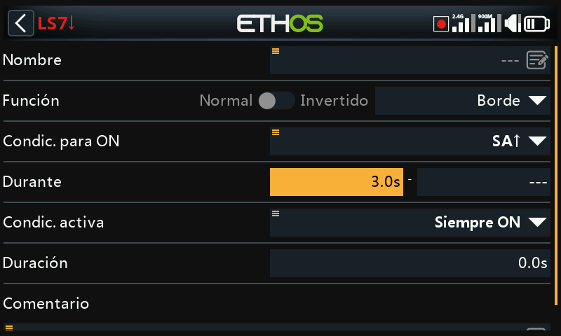

##### During >= '0.0s

“During” está dividido en dos partes \[t1:t2\]. Con t1 de “During” en un valor positivo (digamos 3.0s) y t2= '---' (Falling Edge) el interruptor lógico se convierte en ‘Verdadero’ (para el periodo especificado en 'Duración') cuando la 'Condición de Disparo establecida' transiciona de ‘Verdadera’ a ‘Falsa’, habiendo sido ‘Verdadera’ durante al menos 3 segundos.

##### Opción de pulso

“During” está dividido en dos partes \[t1:t2\]. Si se introducen valores tanto para t1 como para t2, entonces se necesita un pulso para activar el interruptor lógico.

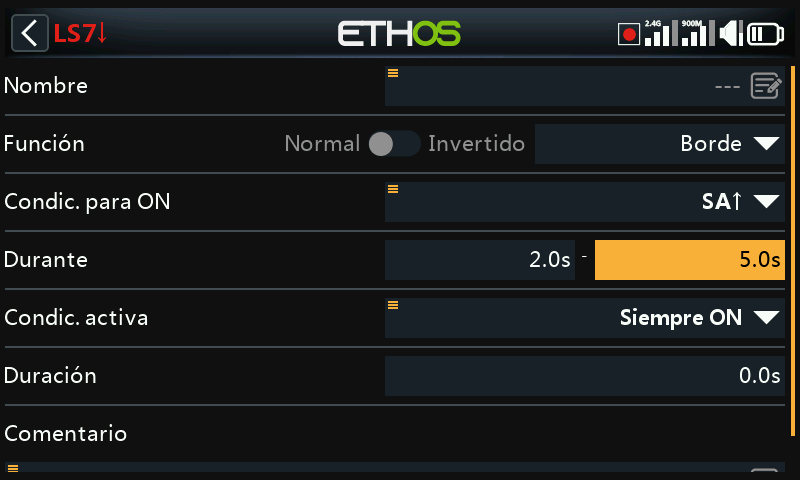

En el ejemplo anterior, el interruptor lógico se convertirá en Verdadero durante el periodo de "During" si la "Condición de activación" pasa de Falsa a Verdadera, y luego pasa de Verdadera a Falsa después de al menos 2 segundos, pero no más tarde de 5 segundos.

## Parámetros compartidos

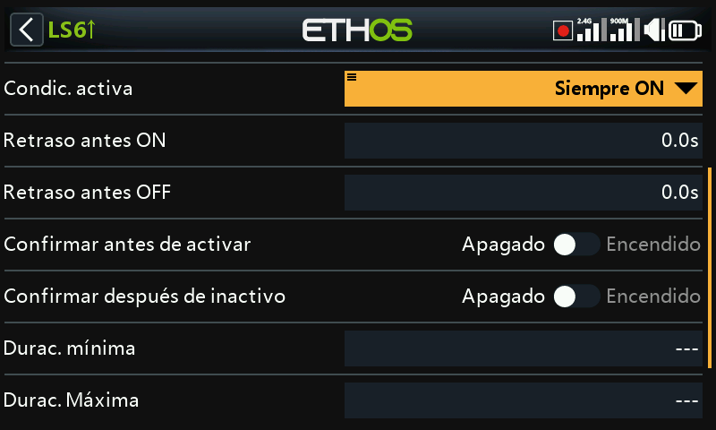

Todos los interruptores lógicos comparten una serie de parámetros:

### Condición activa

Los interruptores lógicos pueden ser controlados por el parámetro opcional 'Condición Activa'. Esto significa que, si la 'Condición Activa' es Verdadera, entonces la salida del interruptor lógico sigue la condición de la Función. Sin embargo, si la "Condición Activa" es Falsa, entonces la salida del Interruptor Lógico también se mantiene Falsa.

La ‘Condición Activa’ puede elegirse de entre las siguientes:

- Siempre activada
- Posiciones de interruptor
- Interruptores de Función
- Interruptores Lógicos
- Posiciones de compensador
- Telemetría
- Modos de vuelo
- Eventos del sistema
  - Throttle hold
  - Throttle cut
  - Throttle active
  - Telemetría activa
  - RSSI baja
  - Entrenador activo
  - Restablecimiento del vuelo

Tenga en cuenta que la función Sticky continúa operando, incluso si su salida está bloqueada por el interruptor 'Condición Activa'. Tan pronto como la condición del interruptor "Condición Activa" vuelve a ser Verdadera, la condición de la Función se conmuta a través de la salida del Interruptor Lógico.

### Retraso antes de activarse

Este valor determina el tiempo durante el cual las condiciones del interruptor lógico tienen que ser Verdaderas antes de que la salida del interruptor lógico se convierta finalmente en Verdadera. (No es relevante para el Generador de Cronómetros y Edge). Los retardos pueden ser de hasta 60.0s.

Por favor refiérase a Este ejemplo acerca del voltaje del Neuron ESC bajando por debajo de 4,2V por al menos x segundos.

### Retraso antes de inactividad

Del mismo modo, este valor determina el tiempo durante el cual las condiciones del Interruptor Lógico tienen que ser Falsas antes de que la salida del interruptor lógico se convierta en Falsa. (No es relevante para el Generador de Cronómetros y Edge). Los retardos pueden ser de hasta 60.0s.

### Confirmación antes de activarse

Cuando un interruptor lógico detecta un cambio de estado al activarse, seleccionando esta opción pedirá confirmación antes de cambiarlo.

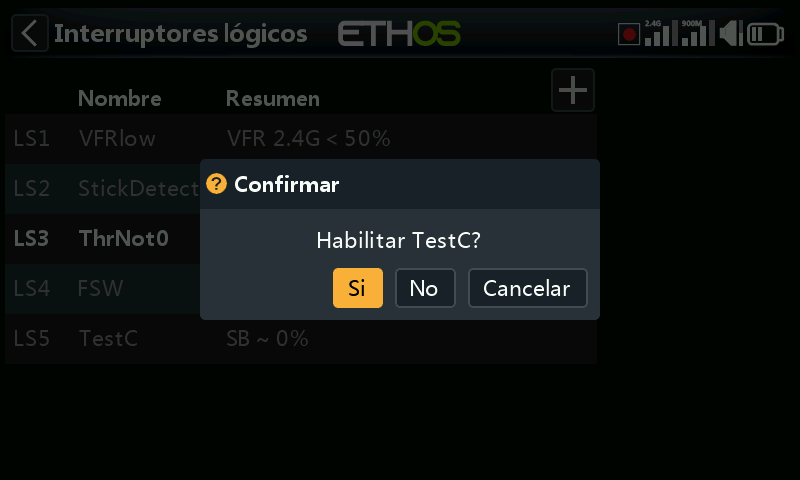

Veamos algunos ejemplos donde esta opción se puede usar:

1. Para máquinas terrestres donde se necesite usar antes de activar algún evento peligroso.

2. Para el interruptor NFC, desde el que puedes apagar el modelo desde el transmisor. Se usaría para pedir confirmación antes de hacerlo.

### Confirmación antes de desactivarse

Cuando un interruptor lógico detecta un cambio de estado al activarse, seleccionando esta opción pedirá confirmación antes de cambiarlo.

Existe la opción de Cancelar para situaciones donde el diálkogo de confirmación se active con demasiada frecuencia.

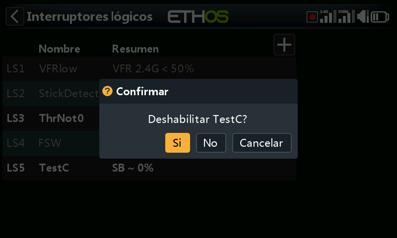

### Duración Mínima

Una vez que el interruptor lógico se convierte en Verdadero, permanecerá así al menos durante el tiempo especificado. Si la duración es la predeterminada ‘---‘, el interruptor lógico sólo se convertirá en Verdadero durante un ciclo de procesamiento de la mezcla, que es demasiado corto para verlo, por lo que la línea LSW no se pondrá en negrita. La duración se puede establecer hasta 60.0s.

### Duración Máxima

Si se ajusta una duración máxima, una vez que el interruptor lógico se convierte en Verdadero, solo permanecerá verdadero hasta que alcance la duración máxima especificada. La duración se puede establecer hasta 60.0s.

### Comentario

Se puede añadir un comentario como explicación de su uso o función, para ayudar a su comprensión. El comentario se muestra cuando se añade un interruptor lógico a un widget con valor.

## Interruptores lógicos – uso con telemetría

Adewmás de las categorías normales para una Condición Activa, los interruptores lógicos y las funciones especiales disponen de una condición de ‘Telemetría activa’ (en ‘Eventos del Sistema’) que estará activa cuando se está recibiendo telemetría.

Si la Fuente de un interruptor lógico es un sensor de telemetría, si el sensor está activo, entonces estará también activo el interruptor lógico.

¡AVISO!

Cuando se usa en una mexcla un interruptor lógico que disponga de telemetría, se debe añadir una mezcla adicional que use el mismo interruptor lógico pero invertido (por ejemplo, cunado se desactiva). Se debe añadir para asegurar que la mezcla tenga valores válidos incluso cuando se pierda la telemetría. Rcuerde que cuando una mezcla está inactiva, su canal de salida estará en neutral = 0% = 1500us, o ¡con el motor a mitad si estamos hablando del acelerador!

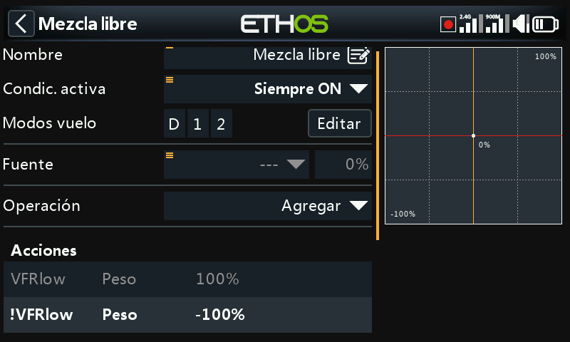

El ejemplo de arriba muestra que se ha añadido el interruptor lógico VFRlow, ¡además de su inverso !VFRlow para asegurarnos de que la mezcla siempre tenga valores válidos.

Alterntivamente, se puede usar una acción de desplazamiento you could use an Offset action:

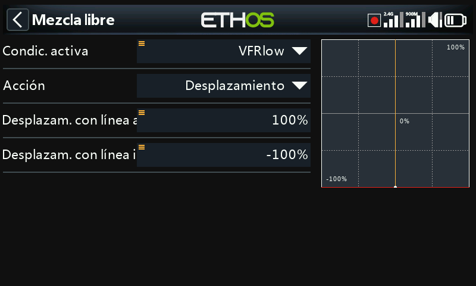

Las acciones de desplazamiento tienen dos valores por defecto: una cuando la acción de desplazamiento está activa, y otra cuando está inactiva. Así se cubren todos los casos.

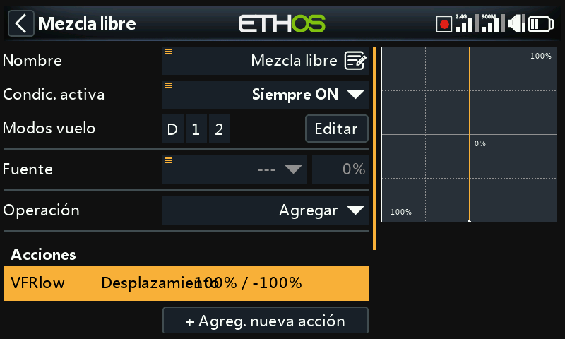

El ejemplo de arriba muestra el resumen de las líneas de mezclas que tienen en su desplazamiento valores válidos. La fuente se ha ajustado con un valor especial de 0, para que se añada el desplazamiento a ese 0% y la salida de la mezcla se haga del +100% cuando VFRlow esté activo, o -100% cuando VFRlow esté inactivo.

## Comparación de fuentes

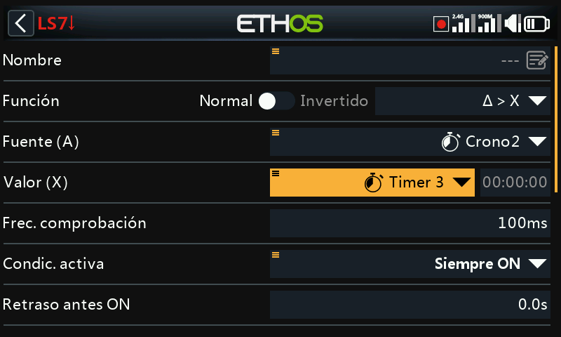

Normalmente, una fuente (A) se compara con un valor fijo (X). Sin embargo, se permite una comparación entre dos fuentes que tengan el mismo formato (por ejemplo, que usen las mismas unidades). Por ejemplo, se pueden comparar entre sí 2 cronos, 2 voltajes o 2 fuentes de RPM.

## Opción de ignorar la entrada del alumno

En los interruptores lógicos las fuentes pueden tener seleccionada la opción ‘Ignorar entrada entrenador’ para ignorar cualquier fuente procedentes de la radio esclava del alumno.

Una aplicación típica es cuando un interruptor lógico está configurado para detectar el movimiento de las palancas del instructor (por ejemplo, las palancas de alerones y profundidad) para permitir la intervención instantánea si las cosas van mal. Esta opción es necesaria para evitar que las entradas de la radio esclava (por ejemplo del alumno) activen el interruptor lógico.

Normalmente, el interruptor lógico se usa en conjunción con un interruptor para habilitar/desconectar la ‘condición activa’ en la función de la radio del maestro.

Para ver un ejemplo, vaya a la sección ‘Como hacer’ apartado 11. [Como configurar la recuperación instantánea de la función entrenador](#How to configure instant take-back for the trainer function).
