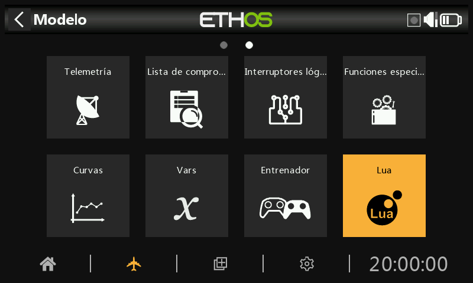
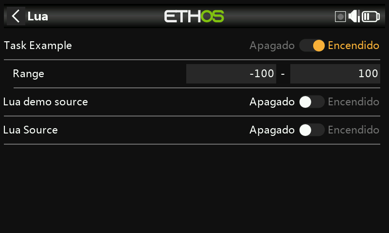

# Lua

El menú Lua sólo aparecerá si el usuario ha instalado una fuente o tarea Lua en la carpeta scripts/ de la tarjeta SD o eMMC.

Es posible usar Lua Scripts para crear fuentes personalizadas (como pueden ser sensores personalizados) o para crear rutinas que realizan acciones personalizadas tales como almacenar registros de datos en un archivo después de que se haya terminado un vuelo.

Una vez instaladas, las fuentes o las rutinas Lua estarán disponibles globalmente o en cada modelo. Este menu puede usarse para activar o configurar selectivamente las respectivas fuentes y tareas para el modelo activo.

Podrá encontrar algunos ejemplos de fuentes y rutinas en forma de scripts Lua ask en la página ETHOS-Feedback-Community, en el apartado /lua/examples/task y en el de /lua/examples/source.

## Tareas Lua

Para cada tarea:

### Habilitar tarea (Task enable)

Se listan aquí todas las tareas disponibles. Cada una de ellas puede ser habilitada para el modelo activo.

### Configuración de la tarea

Si se habilita una tarea, cualquier configuración Lua asociada se muestra para permitir configurarla para el modelo activo. La tarea dispondrá de una función de lectura y escritura que permitirá al usuario almacenar todos los parámetros de su configuración.

Como en el ejemplo de arriba, la tarea utilizada tiene un rango configurable que puede ajustarse a cada uno de los modelos que la utilice.

## Fuentes Lua

Para cada fuente:

### Habilitar fuente

Se listan aquí todas las fuentes disponibles. Cada una de ellas puede ser habilitada para el modelo activo.

### Configuración de la fuente

Si se habilita una fuente, cualquier configuración Lua asociada se muestra para permitir configurarla para el modelo activo (como puede ser el alcance en la pantalla de arriba). La fuente dispondrá de una función de lectura y escritura que permitirá al usuario almacenar todos los parámetros de su configuración.

## Funciones de scripts Lua

Las funciones Lua aplicables incluyen:

system.registerSource()

system.registerTask()

Para más detalles, vaya a la [Guia de referencia Ethos Lua](https://www.frsky-rc.com/wp-content/uploads/Downloads/EthosSuite/LuaDoc/index.html).

## Instalación

Las fuentes Lua y las tareas se instalan en el directorio ‘scripts’ de la tarjeta SD card o eMMC. Vaya a la sección [scripts](#scripts) de Sistema / Administrador de archivos.
