# Mezclas

La función Mezclas constituye el corazón de la radio. Aquí es donde se configuran las funciones de control del modelo. La sección Mezclas permite combinar cualquiera de las muchas fuentes de entrada como se desee y asignarlas a cualquiera de los canales de salida.

## Resumen de alto nivel del funcionamiento de los controles

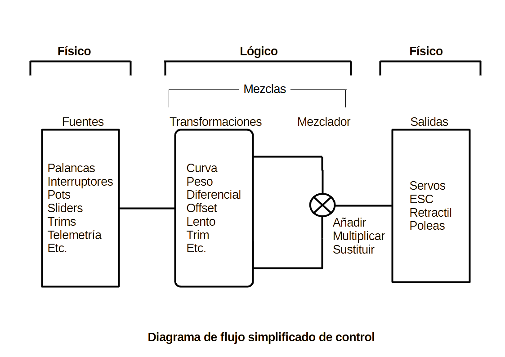

La forma de modificar los mandos comienza en los controles físicos, continúa a través de la lógica de programación de las mezclas y finaliza cuando son adaptadas a las características mecánicas del modelo en la sección de salidas. De esta forma, pasamos de un modelo físico a un modelo lógico, y acabamos de nuevo en un modelo físico.

En la sección de Mezclas se ajusta lo que queremos que hagan diferencialmente los controles. Podemos transformar las entradas usando pesos, desplazamientos, curvas, diferenciales o lento, y después mezclarlos o combinarlos como se requiera.

La sección de Salidas permite que esos resultados puramente lógico se adapten a las características mecánicas de nuestro modelo. Es la conexión entre la “lógica” de los ajustes y el mundo real de los servos, reenvíos y superficies de control, así como de los motores y de los transductores.

Ethos tiene 120 canales de mezclas disponibles para programar su modelo. Normalmente los canales más bajos se asignarán a los servos, porque los números de canal se asignan directamente a los canales en el receptor. El módulo RF (Radio Frecuencia) interno de las X20 tiene hasta 24 canales de salida disponibles.

Los canales superiores de las mezclas se pueden utilizar como "canales virtuales" en una programación más avanzada, o como canales reales utilizando varios módulos RF (Interno + Externo) y SBus. El orden de los canales es una cuestión de preferencia personal o de estandarización, o puede ser obligado por las características del receptor. Usaremos AETR (Alerón, Elevador, Acelerador, Timón) para nuestro ejemplo.

La fuente o entrada a una mezcla puede elegirse entre: entradas analógicas (las palancas, pots y deslizadores) los interruptores o los botones; cualquier interruptor lógico definido; los interruptores de compensado; cualquier canal definido; un eje giroscópico; un canal de entrenador; un cronómetro; un sensor de telemetría; un valor del sistema como el voltaje de la radio principal o el voltaje de la batería del RTC; o un valor "especial" como "mínimo", "máximo" ó 0.

En esta sección también se permite condicionar la fuente definiendo pesos/velocidades y desplazamientos, y añadiendo curvas (por ejemplo, Expo). La mezcla puede estar sujeta a un conmutador y/o modos de vuelo, y se puede añadir una función de ralentización. (Tenga en cuenta que los retardos se implementan en los conmutadores lógicos porque están relacionados con los conmutadores).

En el editor de mezclas se incluye información de ayuda contextual que cambia dinámicamente a medida que se tocan las distintas opciones. La primera línea muestra el tipo de mezcla utilizada, como 'Alerón', 'Elevadores', o 'Mezcla Libre', etc.

Se pueden definir hasta 120 mezclas.

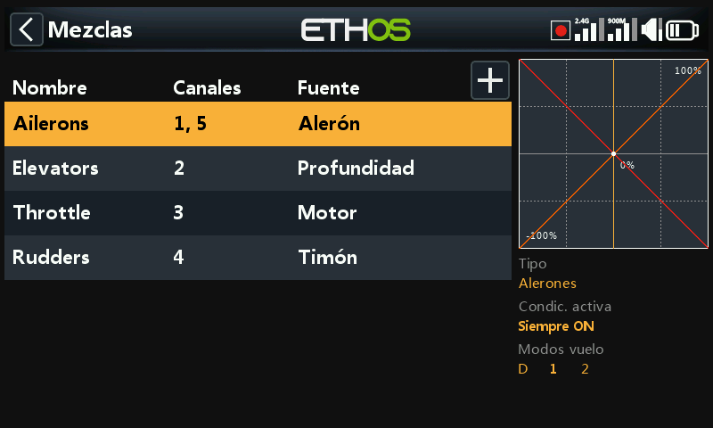

Si su modelo se creó utilizando uno de los asistentes de creación de modelos de la función "Seleccionar modelo" del menú Sistema, las líneas de las mezclas básicas se mostrarán al pulsar sobre el "Mezclas". Se mostrará un gráfico para cada mezcla seleccionada, y por debajo estarán en negrita el modo de vuelo actual y la ‘condición activa’ cuando estén seleccionados.

Además, se pueden añadir las mezclas predefinidas más habituales, así como mezclas libres configurables por el usuario. En la página principal de mezclas (vea la figura de arriba) se pueden añadir sucesivas mezclas adicionales pulsando en el símbolo ‘+’ en la línea de arriba.

Hay una mezcla para cada control y un gráfico para cada mezcla.

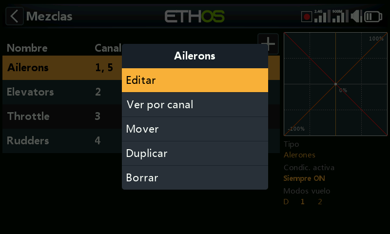

Para editar una mezcla, tóquela dos veces para que aparezca el menú emergente; a continuación, seleccione Editar. Otra opción podría ser añadir una nueva mezcla, cambiar a la vista de agrupación a ‘[Vista por canal](mixes.md)’ (descrita en una sección más abajo), mover la línea de la mezcla hacia arriba o hacia abajo, duplicarla o eliminarla.

Tenga en cuenta que las mezclas inactivas aparecen atenuadas para facilitar en su depuración.

La radio pide confirmación antes de borrar una mezcla, en caso de selección involuntaria.

## Mezclas de alerón, Elevador, TImón

Utilizaremos los Alerones como ejemplo, pero las mezclas de Elevador y Timón son similares.

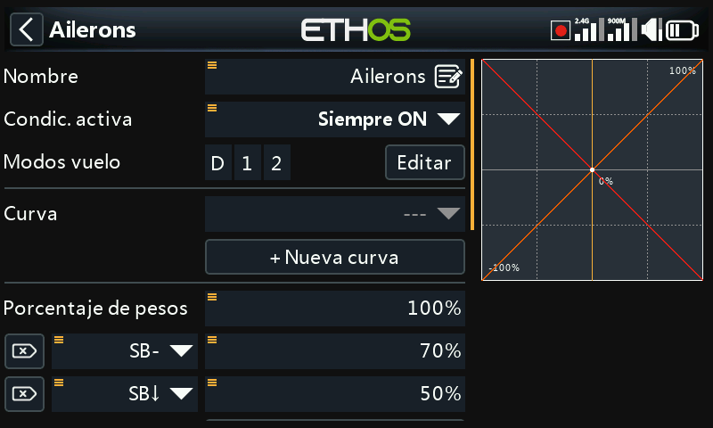

### Nombre

Se le ha llamado Alerones como nombre por defecto, pero se puede cambiar.

### Condición activa

La condición activa por defecto es 'Siempre Encendido', que es apropiada para los Alerones. Puede hacerse condicional eligiendo entre posiciones de interruptores o botones, interruptores de función, modos de vuelo, interruptores lógicos, un evento del sistema (como el corte o retención del acelerador) o posiciones de los compensadores.

### Modos de vuelo

Sólo si se ha definido algún modo de vuelo en la sección de ‘Modos de vuelo’, entonces esta línea de opción aparecerá en la pantalla. Se puede hacer condicionada a uno o más modos de vuelo. Haga clic en "Editar" y marque las casillas de los modos de vuelo en los que esta línea de mezcla debe estar activa.

### Curva

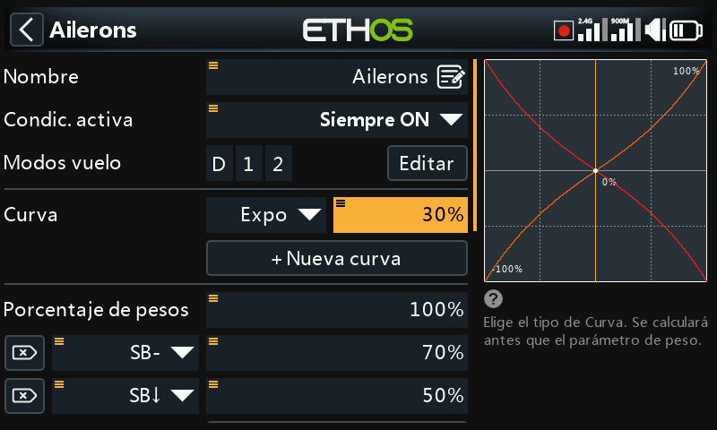

Una opción de curva estándar es Expo, que por defecto tiene un valor de 0, lo que significa que la respuesta es lineal (es decir, no hay curva). Un valor positivo suavizará la respuesta en torno a 0, mientras que un valor negativo la agudizará. El ejemplo de arriba muestra un Expo de 30%.

También se puede seleccionar cualquier curva previamente definida. El resultado de la mezcla se modificará al hacerlo esta curva. Alternativamente, se puede añadir una nueva curva.

Puede especificarse hasta 6 curvas, cada una con una condición. Si se cumple más de una condición, prevalece la curva situada más arriba en la lista. Tenga en cuenta que la curva se aplica antes que el Peso.

### Peso / Regímen

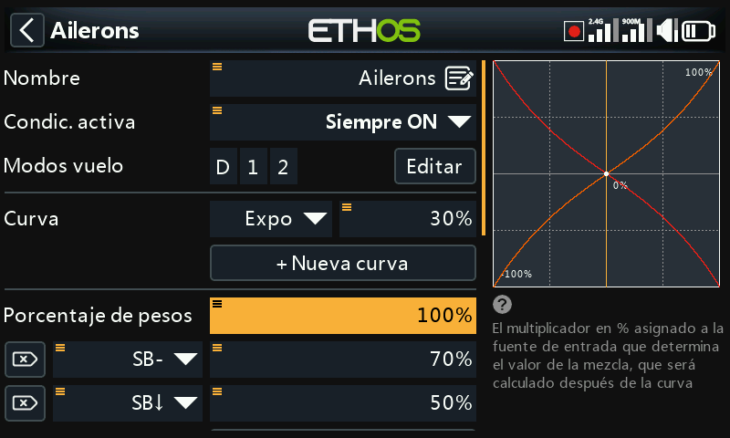

Se pueden definir múltiples pesos o regímenes, sujetos a una posición de interruptor, interruptor de función, interruptor lógico, posición de compensado o modo de vuelo. Se añade una línea para cada régimen. El régimen por defecto (es decir, la primera línea de régimen) está activa cuando ninguna de las otras líneas está activa. Hay una pequeña equis dentro de una flecha a la izquierda de los regímenes que se hayan definido que se puede utilizar para eliminar la línea.

En el ejemplo anterior se han configurado tres líneas de regímenes en el conmutador SB.

### Diferencial

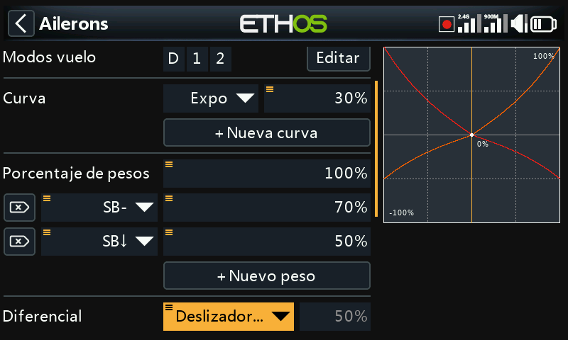

El diferencial proporciona más recorrido en una dirección. Por ejemplo, los alerones necesitan típicamente más recorrido hacia arriba que hacia abajo para reducir la guiñada adversa y mejorar las características de viraje/maniobrabilidad. Un valor positivo hará que los alerones tengan menos recorrido hacia abajo, como puede verse en el gráfico anterior. (Por defecto = 0. Rango -100 a +100).

En este ejemplo una pulsación larga en Enter abrió el diálogo para seleccionar una fuente en lugar del valor fijo por defecto, en este caso se seleccionó el deslizador derecho. El gráfico de la derecha muestra que el deslizador está al 50%, por lo que éste sería el peso para el régimen de movimiento de los alerones, pero sería ajustable en vuelo.

Un Elevador diferencial suele utilizarse para aviones que necesitan menos movimiento hacia abajo que hacia arriba, normalmente en vuelos de carreras.

Tenga en cuenta que el parámetro Diferencial sólo estará presente cuando se tiene más de un canal de alerones.

En una mezcla de timón, sólo aparecerá la opción de introducir diferencial si el modelo está configurado como cola en V.

### Compensador (Trim)

Proporciona la capacidad de desconectar el compensador asociado a una mezcla sin deshabilitarlo, de forma que se pueda usar en otro sitio.

### Recuento de canales

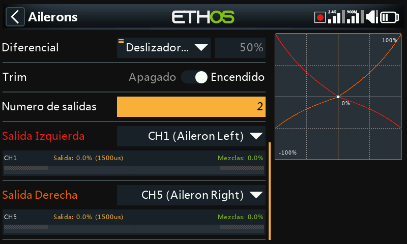

El recuento de canales define cuántos canales de salida se asignan. En este ejemplo se han configurado dos alerones en el asistente de creación de modelos.

### Salida izquierda, Salida derecha

El asistente de creación de modelos asignó Salida Izquierda a CH1 (Alerón Izquierdo), porque el orden de canales predeterminado en el menú Sistema – Palancas estaba configurado como AETR (es decir, alerón, profundidad, acelerador, timón) y la opción 'Primeros cuatro canales fijos' estaba ACTIVADA. Luego, el asistente asignó la Salida Derecha a CH5 (Alerón Derecho).  
  
Se puede alterar el valor predeterminado si es necesario, pero se debe tener cuidado para evaluar cualquier otro impacto al realizar un cambio aquí. Si la opción 'Primeros cuatro canales fijos' se desactiva, el asistente agrupa los canales similares, es decir, AAETR en lugar de AETRA.

Tenga en cuenta que \[ENT largo\] en el canal de salida seleccionado le llevará directamente a esta página en las Salidas.

Tenga debe tener en cuenta que el gráfico proporciona colores a cada salida. En el ejemplo anterior, a la Salida1 se le ha asignado el color rojo que se corresponde con la curva roja en el gráfico, y la Salida2 tiene color naranja que se corresponde con la curva naranja en el gráfico.

## Mezclas del acelerador

Las mezclas del acelerador contienen parámetros para gestionar el ‘Corte de motor’ y la ‘Retención del motor’. El ‘Corte de motor’ cuenta con un blocaje de seguridad de entrada del acelerador, mientras que la ‘Retención del motor’ tiene una simple función de encendido o apagado.

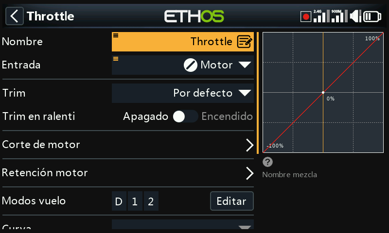

### Entrada

La fuente para la mezcla del acelerador se seleccionar aquí. Por defecto es la palanca del acelerador, pero se puede cambiar a un analógico, interruptor, compensador, canal, eje del giróscopo, canal de entrenador, temporizador o a un valor especial.

Mantenga presionada la tecla \[ENT\] en las entradas, para acceder a las opciones del acelerador.

La dirección del control de la palanca del motor se puede invertir, vaya a la sección de invertir dirección en [Opciones de fuente](#Source Options).

#### Opciones de entradas

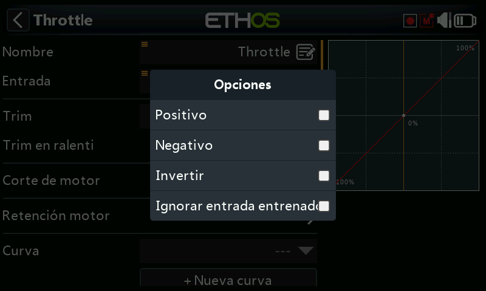

- Si se habilita ‘Positivo’, solo la parte positiva de la entrada alimentará a la mezcla.
- Si se habilita ‘Negativo’, sólo la parte negativa de la entrada alimentará a la mezcla.

Las dos opciones de arriba se utilizan normalmente en modelos de superficie donde el gatillo actúa sobre el acelerador (mitad positiva) y los frenos (mitad negativa).

- Active ‘Invertir’ para revertir el control de entrada.
- Si se activa ‘Ignorar entrada entrenador’ se previene que la radio del estudiante afecte a la mezcla. Vaya a la sección ‘[Opción de ignorar la entrada del entrenador](#Option to ignore trainer input from slave)’ para más detalles.

Vaya también a la sección de opciones en el enlace [Opciones de fuente](#Source Options).

### Compensador (Trim)

Permite cambiar el comportamiento del compensador del motor desde el valor por defecto.

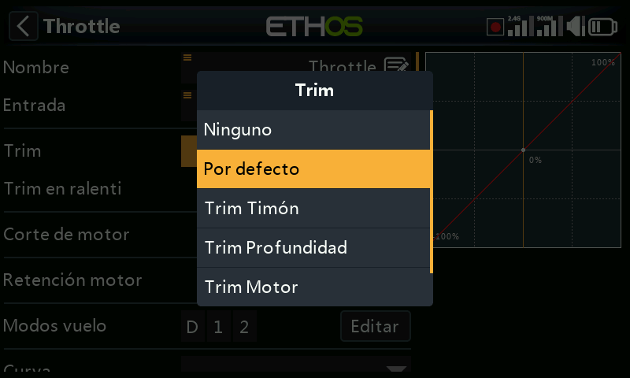

Puede modificarse para que la salida del motor sea regulada por los compensadores del timón, de la profundidad, de los alerones, o del propio motor. Las X20 Pro/R/RS y las X18 también permiten usar los compensadores T5 or T6 para este fin.

#### Compensador de motor en parte baja

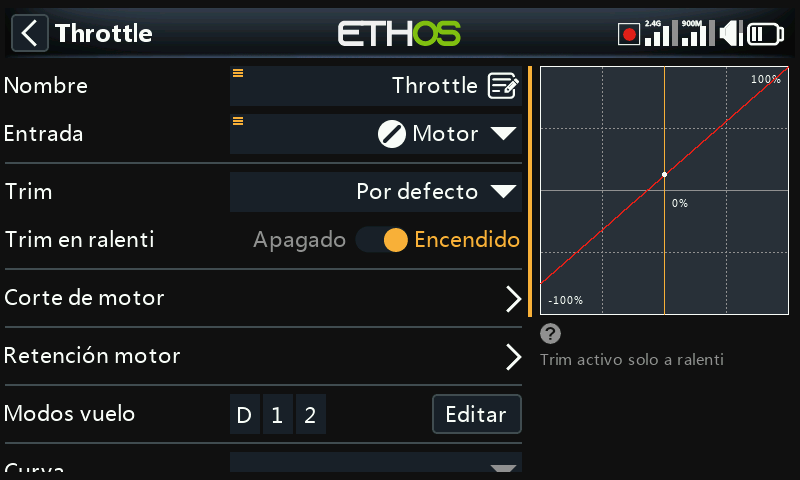

Para los motores glow y gasolina, se usa la compensación en la parte baja de la palanca, para ajustar el trim al ralentí. La velocidad del ralentí puede variar en función de la temperatura, de la meteorología, etc. por lo que es importante tener una forma de ajustarlo sin tener que variar el resto del recorrido de la palanca del motor.

Si se habilita esta opción, el canal del motor irá a una posición de ralentí de -75% cuando la palanca se pone en la parte más baja (mire la barra de trimado que se muestra en la parte baja de la imagen de arriba). El interruptor de trimado del motor puede ajustarse desde -100% hasta -50%. Si se hace así, se puede configurar el corte del motor para usarse con un interruptor.

### Corte de motor

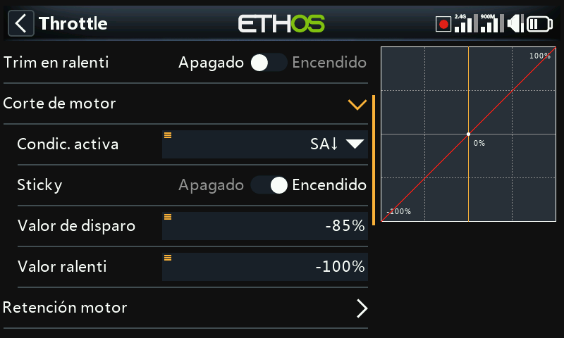

El corte del motor incorpora un blocaje de seguridad del acelerador que garantiza que el motor o el acelerador sólo puedan funcionar desde una posición baja del acelerador.

Cuando se combina con el compensado en la parte baja (vea más arriba), se puede utilizar para gestionar los ajustes del acelerador y del ralentí en modelos con motor glow o gasolina.

#### Condición activa

La condición activa puede elegirse mediante posiciones de interruptores, botones, interruptores de función, modos de vuelo, interruptores lógicos o posiciones de trimado.

#### Sticky

Cuando Sticky está en la posición ON, la salida del canal del acelerador cambiará al valor de salida de ralentí (por defecto -100%) tan pronto como se active el corte del acelerador.

Cuando Sticky está en la posición OFF, una vez que se activa el corte del motor, la salida del canal del acelerador cambiará al valor de salida de ralentí (por defecto -100%) sólo cuando la palanca del acelerador baje del valor determinado de activación (por defecto -85%).

#### Valor de activación

El valor de activación determina el valor por debajo del cual la entrada del acelerador activa el blocaje de seguridad del acelerador.

#### Valor de salida del ralentí

Por seguridad, una vez que el corte del acelerador se desactiva, la salida del canal del acelerador sólo dejará el valor de salida de ralentí si la entrada del acelerador ha estado por debajo del valor de activación. Esto asegura que el motor sólo arranca desde un valor bajo de entrada de acelerador.

Tenga en cuenta que Ethos permanecerá seguro en el arranque, incluso si la condición ‘Corte de motor’ no está activa y la entrada del motor no está al mínimo. Debe mover la palanca del motor por debajo del valor establecido antes de que canal de motor se arme, y permitir que el motor empiece a funcionar desde un valor bajo de entrada del acelerador.

### Retención del motor

La retención del motor proporciona una manera simple de bloquear el acelerador, sin activar el ‘Corte del motor’ descrito más arriba.

Por razones de seguridad, con motores eléctricos se recomienda encarecidamente utilizar la opción de ‘Corte de motor’ con su blocaje de seguridad, en lugar de la de ‘Retención del motor’.

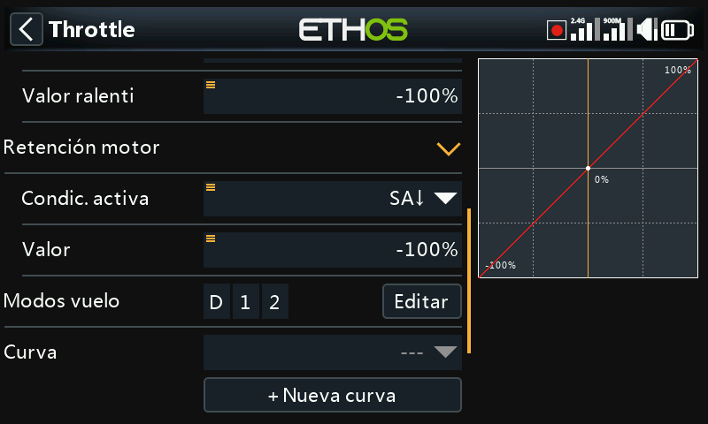

#### Condición activa

La condición activa puede elegirse mediante posiciones de interruptores, botones, interruptores de función, modos de vuelo, interruptores lógicos o posiciones de trimado.

#### Valor

Una vez que la función de retención del motor se activa, el valor ajustado se mostrará en el canal del acelerador. En los modelos eléctricos, el valor de retención del motor es normalmente (-100%).

Los valores de retención del motor, pueden establecerse también desde una fuente.

### Modos de vuelo

Si se ha definido algún modo de vuelo, entonces esta opción se mostrará en la pantalla. la mezcla puede hacerse condicional a uno o más modos de vuelo. Haga clic en "Editar" y marque las casillas de los modos de vuelo en los que esta línea de mezcla debe estar activa.

### Curva

Se puede definir una curva para modificar la salida del canal del acelerador. También se puede seleccionar cualquier curva definida previamente. Una aplicación típica sería definir una curva de zona muerta para que la salida se mantenga en -100 hasta que se mueva ligeramente la palanca del acelerador. Esto solucionará cualquier problema de calibración de la palanca.

### Recuento de canales

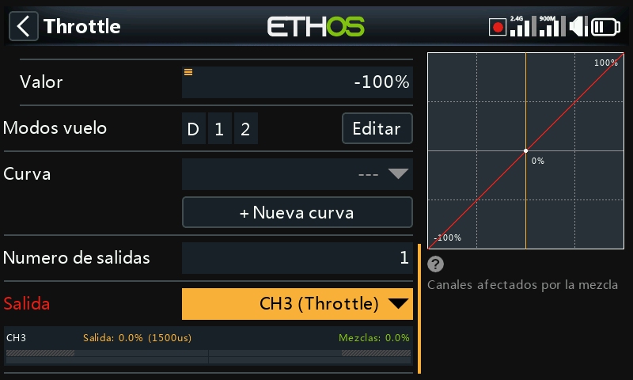

El recuento de canales define cuantos canales de salida se asignan para el motor. Por defecto se asigna 1 canal.

## Opción de visualización por canales (agrupación de mezclas)

Con mezclas complejas puede ser difícil ver el efecto de otras mezclas en un canal concreto. La opción 'Ver por canal' es especialmente útil para depurar las mezclas, porque se agrupan juntas todas las mezclas que afectan al canal seleccionado.

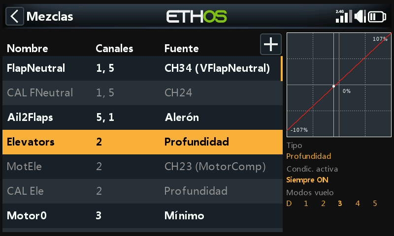

Para este ejemplo, nos fijaremos el canal de Profundidad. Podemos ver en la vista en forma de tabla de arriba que la Profundidad está en el canal 2, y que más abajo hay otras mezclas también con el canal 2 como salida.

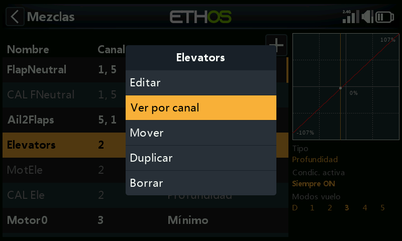

Para ver el efecto de todas las mezclas en el canal de profundidad, pulse sobre la mezcla Elevadores y seleccione 'Ver por canal' en el cuadro de diálogo.

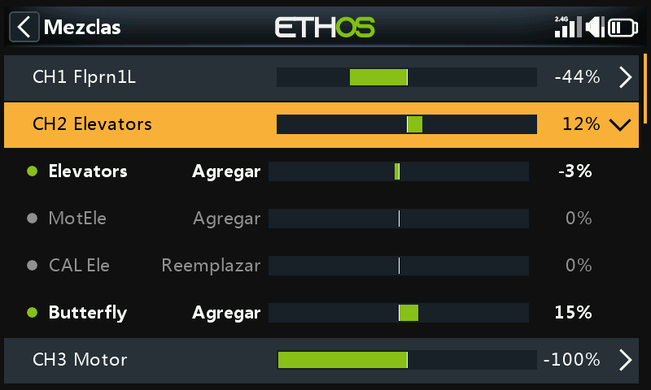

La imagen del ejemplo anterior muestra que hay dos mezclas que afectan a este canal: la mezcla Elevadores (controlada por la palanca de profundidad) y una mezcla Flaps=>Ele que añade compensación en profundidad cuando los flaps están desplegados. Mirando la línea de resumen del CH2 (resaltada), podemos ver que la salida del canal de elevadores está en +3%. Las submezclas sucesivas muestran que actualmente la palanca del elevador está en neutro (es decir, 0%), pero la mezcla de Flaps a Elevador está añadiendo +3% al canal. Accionando el interruptor de Flaps hará que esta mezcla de compensación cambie.

Con esta disposición de "Vista por canal", la contribución de las distintas mezclas que afectan a un canal puede verse fácilmente, ya que el valor de cada línea del mezclador se muestra en formato gráfico y numérico.

### Gestión de la “Vista por canal”

#### a) Desplazamiento entre canales en ‘Vista por canal’

Al hacer clic en la línea de resumen (resaltada arriba) se contraerán las líneas sucesivas que afectan al canal.

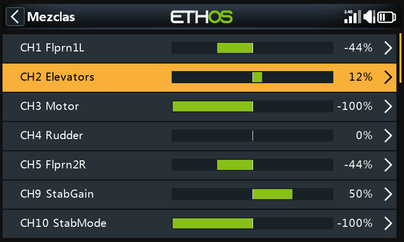

Como puede verse arriba, las submezclas para profundidad CH2 se han retraído. Ahora puede desplazarse hacia arriba o hacia abajo y seleccionar otro canal para expandirlo y mostrar las líneas de mezclas que contribuyen a ese canal.

#### b) Volver a la ***‘******Vista de tabla******’***

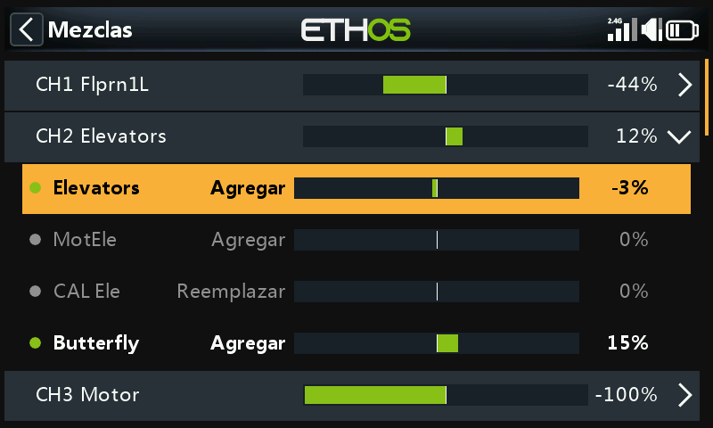

Al hacer clic en una línea de inferior (por ejemplo, en la línea resaltada arriba) aparecerá un cuadro de diálogo emergente que permite editar la mezcla, cambiar a la Vista de Tabla o eliminar la mezcla.

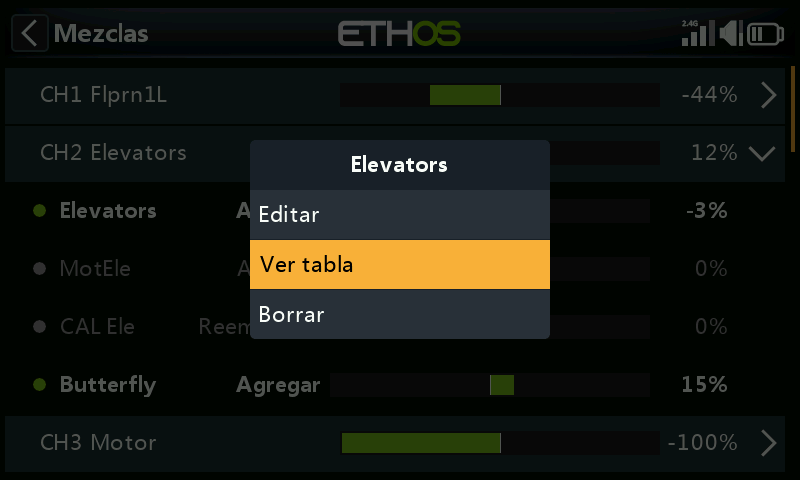

Si selecciona ‘Vista de tabla’, volverá a la vista normal de las mezclas en formato de tabla. También puede editar la mezcla resaltada o eliminarla.

Volvemos a ver las mezclas en forma de tabla.

## Mezclas predefinidas

### Biblioteca de mezclas para aviones

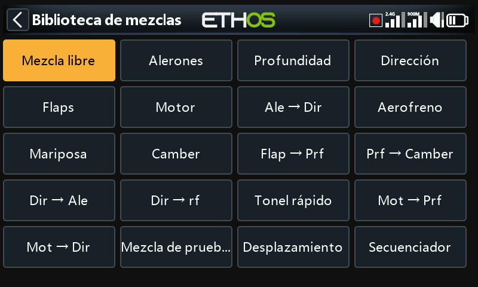

La lista de mezclas predefinidas disponibles están en la biblioteca de mezclas que se muestra en el gráfico de arriba.

Tenga en cuenta que algunas mezclas sólo aparecerán si los canales requeridos existen en el modelo en cuestión. Por ejemplo, las mezclas que afecten a los flaps solo aparecerán si hay definida una configuración válida con flaps.

#### Agregar mezcla

En la pantalla principal de mezclas (figura de arriba) se pueden añadir mezclas nuevas tocando en el símbolo ‘+’ próximo a la columna del encabezado.

Seleccione una mezcla de la lista de las mezclas predefinidas en la bliblioteca para aviones (vea la imagen de arriba).

Vamos a usar la Mezcla libre en el ejemplo.

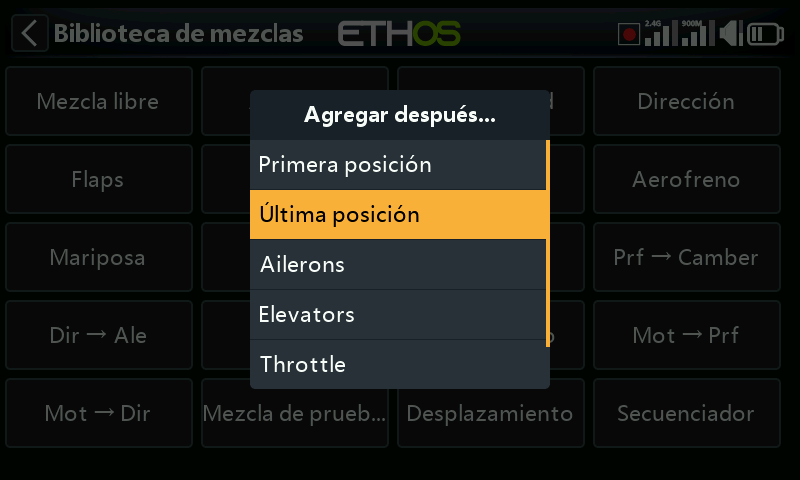

A continuación, debe elegirse la posición para la nueva línea de mezcla, en este ejemplo añadida después de "Última posición".

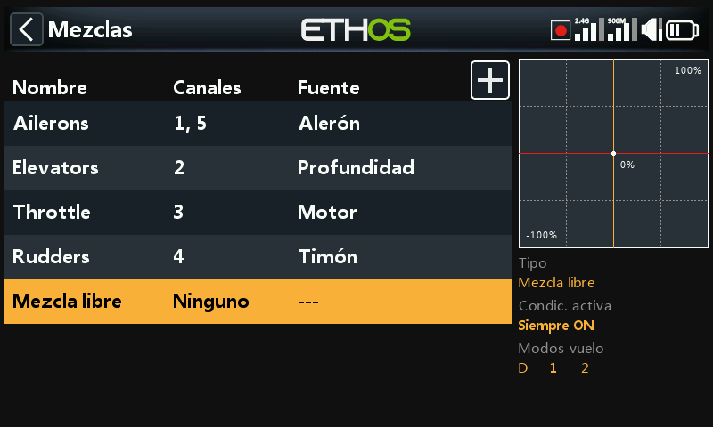

Normalmente, la nueva mezcla libre se abre para su edición, pero hemos vuelto a la vista de mezclas para enseñar que se ha añadido la mezcla libre.

Pulse sobre "Mezcla libre" para acceder al submenú de edición.

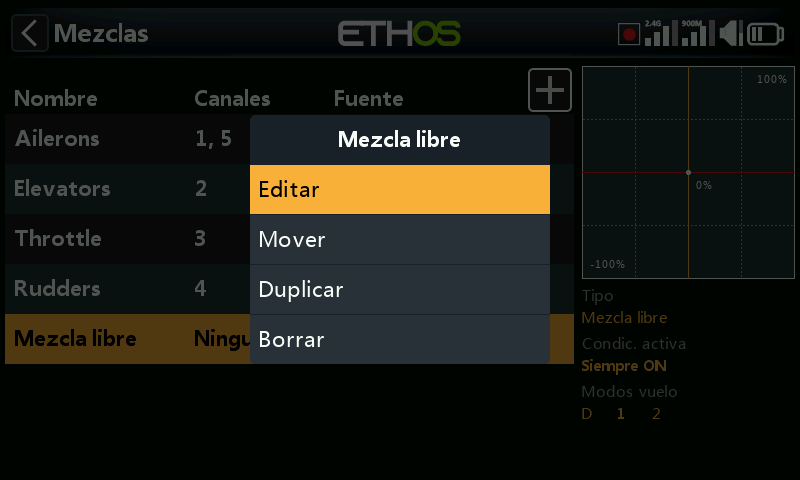

Seleccione ‘Editar’ para abrir una nueva pantalla que muestra en detalle las opciones de configuración de la 'Mezcla Libre'.

#### Mezcla libre

Las mezclas libres son aquellas en las que se permite hacer cualquier cosa, en general. Las mezclas predeterminadas son de alguna forma más potentes, pero también son más restrictivas y ajustadas a su aplicación específica. No todas las opciones están necesariamente disponibles en una mezcla libre, pero se puede hacer cualquier cosa con ella y pueden necesitarse varias mezclas libres para hacer lo mismo que una mezcla especializada.

La gráfica de la derecha mostrará la salida de la mezcla y el efecto de cualquier cambio de configuración que se realice.

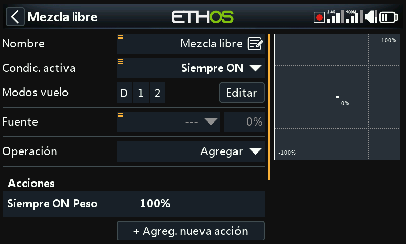

##### Nombre

Se puede introducir un nombre descriptivo para la mezcla libre.

##### Condición activa

La condición activa por defecto es 'Siempre Encendido'. Puede hacerse condicional eligiendo entre posiciones de interruptores, botones, interruptores de función, modos de vuelo, interruptores lógicos, un evento del sistema como corte o retención del acelerador, o posiciones de trimado.

##### Modos de vuelo

Si se ha definido algún modo de vuelo, esta línea se mostrará en pantalla. la mezcla puede hacerse condicional a uno o más modos de vuelo. Haga clic en "Editar" y marque las casillas de los modos de vuelo en los que esta línea de mezcla debe estar activa.

##### Fuente

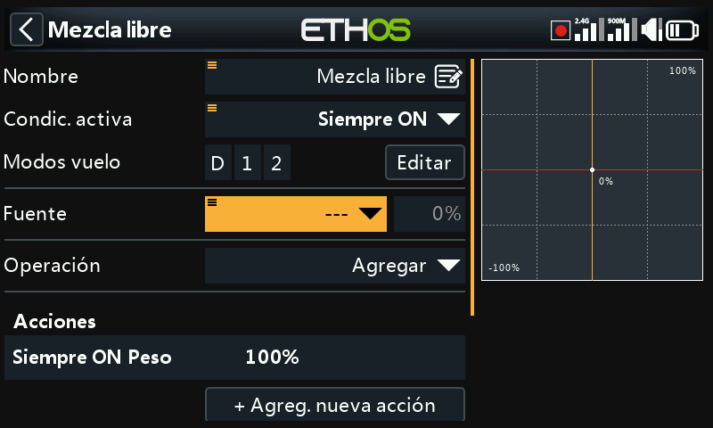

La entrada de una mezcla libre puede ser cualquier fuente, o incluso un valor fijo.

##### Categorias de la fuente

La fuente o entrada de esta mezcla se puede elegir de entre las siguientes categorías:

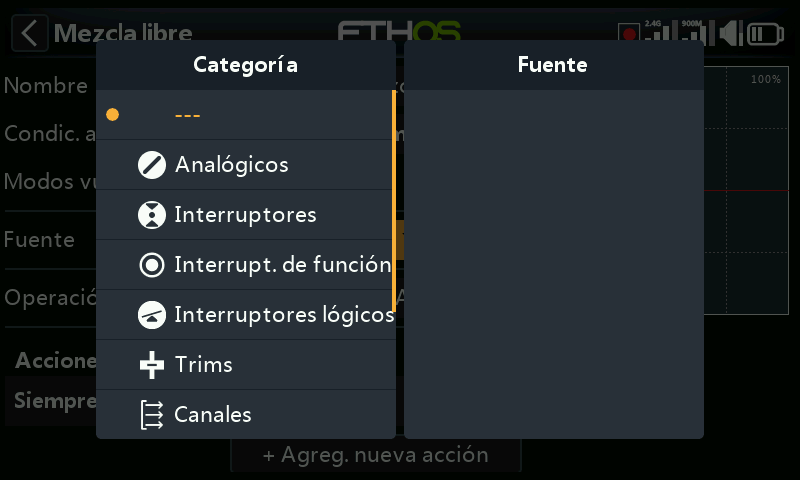

Tenga en cuenta que las categorías están ahora identificadas con un icono especial delante de cada una de ellas, para distinguirlos de los elementos renombrados por el usuario en las listas de selección. Una vez se haya seleccionado un elemento de una categoría, el icono de esta estará delante del nombre del elemento. Vaya al ejemplo para Alerones más abajo.

a) Entradas analógicas como las palancas, los pots y los deslizadores

- b) Los interruptores físicos o botones
- c) Interruptores de función
- d) Cualquier interruptor lógico que se defina
- e) Los interruptores de los compensadores
- f) Cualquiera canal que se defina
- g) Cualquier Var que se defina(Variable)
-

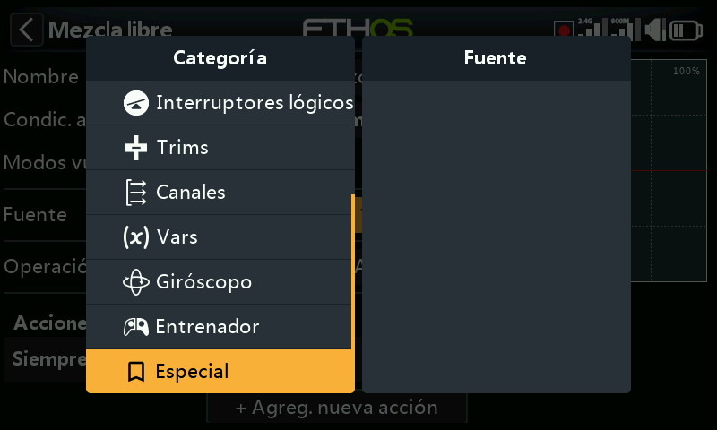

- 
- h) Un eje giroscópico
- i) Un canal del entrenador
- j) Un cronómetro
- k) Un sensor de telemetría
- l) Un valor del sistema (por ejemplo, el voltaje de la radio principal; volttaje de la batería RTC; un reloj (por ejemplo el tiempo real) la RAM disponible y tiempo de funcionamiento de la radio.
- m) Un valor "especial". Es decir, mínimo, máximo ó 0

##### Capacidad de agregar una Var mientras está en 'Seleccionar fuente'

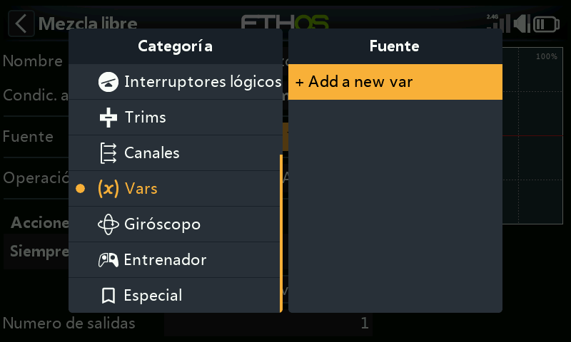

Es posible crear una nueva variable mientras se está en el cuadro de diálogo ‘Seleccionar fuente’.

##### Fuente como un valor fijo

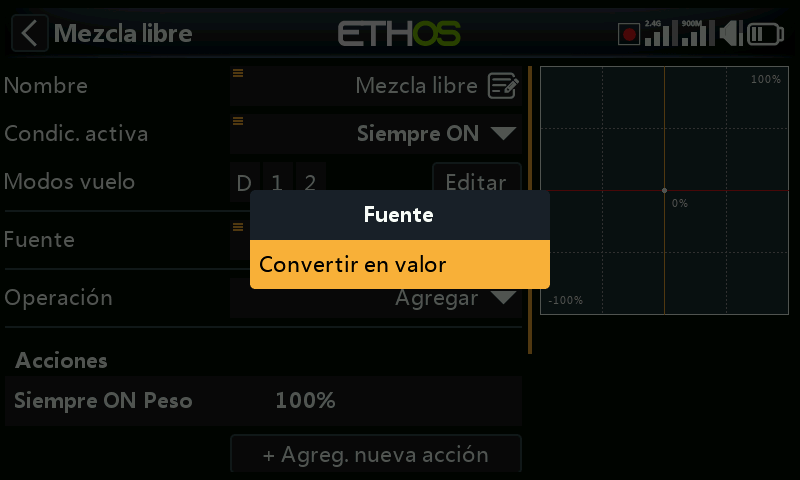

Manteniendo presionado Enter en los parámetros de la Fuente abrirá un cuadro de diálogo que le permitirá convertir las entradas en una mezcla libre a un valor fijo.

(Aunque este ejemplo es muy simple, debe considerar si es mejor usar un Var con valor fijo. El uso de Vars le permitirá poner todos los valores de sus ajustes principales en un menú con nombres significativos. Vaya a la [Sección de Variables (VARs)](variables.md) para más detalles.)

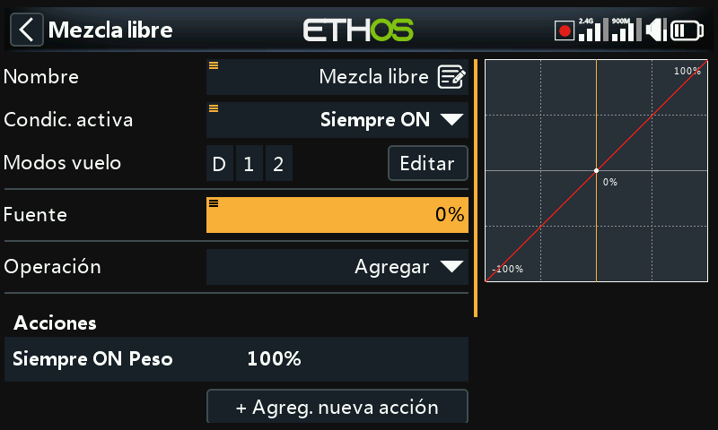

Ahora se pueden ajustar los valores fijos.

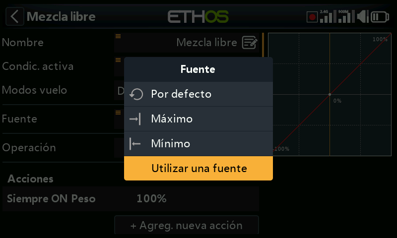

Si se mantiene presión en el valor fijo, podrá seleccionar directamente los valores Máximo, 0, Mínimo o volver a usar una fuente.

Hemos vuelto de nuevo a la opción de selección de una fuente.

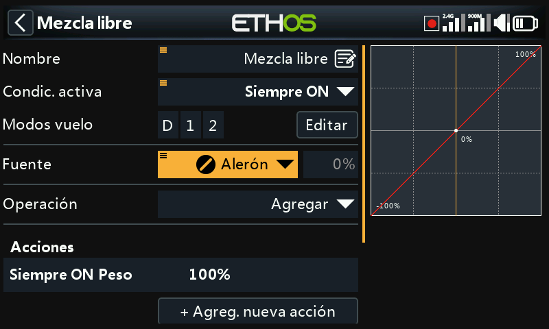

En este ejemplo, se ha elegido la palanca de alerones como fuente. Note que el icono de la categoría Entrada analógica ha aparecido por delante del ‘Alerón’.

Además, el valor de la fuente se muestra al lado de la selección de fuente, lo que es bastante útil cuando se está haciendo una depuración.

##### Operación

El tipo de Operación define cómo interactúa la línea actual de mezcla con las demás del mismo canal. Hay tres tipos de operaciones:

##### Suma

La salida de esta línea de mezcla se añadirá a cualquier otra línea de mezcla del mismo canal de salida. Tenga en cuenta que las líneas de suma pueden estar en cualquier orden (A+B+C = C+B+A).

##### Multiplicación

La salida de esta línea mezcla ser multiplicada con el resultado de otras mezclas situadas por encima de ella que afecten el mismo canal de salida.

##### Sustitución

La salida de esta línea de mezcla reemplazará el resultado de cualquier otra mezcla en el mismo canal de salida.

##### Blocaje

Un canal que está "bloqueado" nunca será afectado por ninguna otra mezcla mientras la línea de mezcla bloqueo esté activa. (Esta es una buena alternativa a la función ‘Override’ de OpenTX).

La combinación de estas operaciones permite crear operaciones matemáticas complejas.

##### Acciones

La mezcla libre es tan extremadamente flexible que se pueden definir hasta 50 acciones dentro de ella.

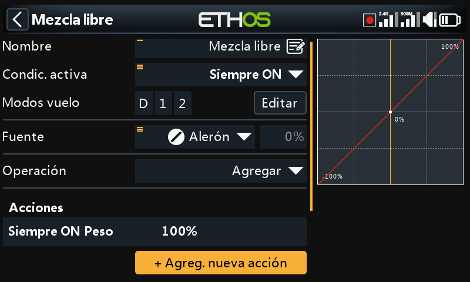

Toque en ‘+ Agregar nueva acción’ para añadir una acción a la mezcla libre.

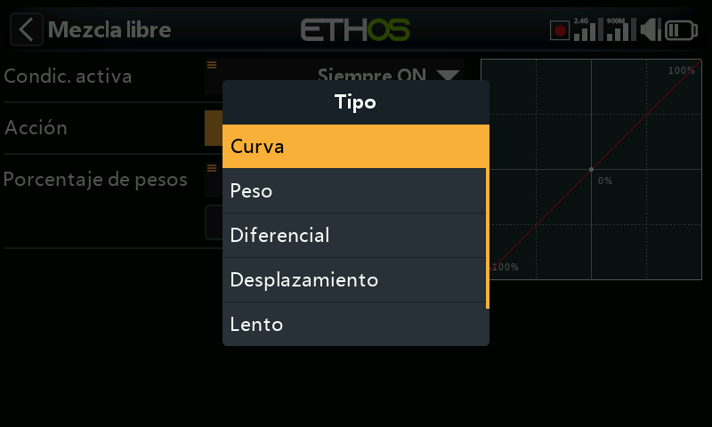

Las acciones disponibles son:

- Curva
- Peso
- Diferencial 
- Desplazamiento
- Lento
- Compensador

Las acciones pueden combinarse para crear, por ejemplo, distintos recorridos de servos combinados con múltiples curvas con exponenciales, diferentes cantidades de diferenciales, etc.

El orden recomendado para efectuar acciones es: Lento, Curva, Peso, Desplazamiento y finalmente compensadores. Debería respetarse este orden a menos que haya una razón específica para usarlo en otro orden. Por ejemplo, puede querer quitar un desplazamiento de una entrada. Para cambiar el orden, vaya a la sección [Reordenando acciones en mezclas libres](mixes.md) más abajo.

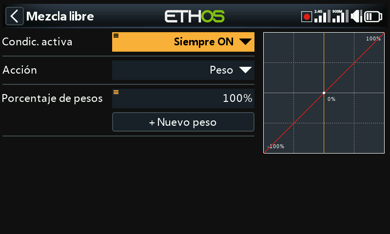

Cada acción de una mezcla libre puede tener su propia ‘Condición activa’.

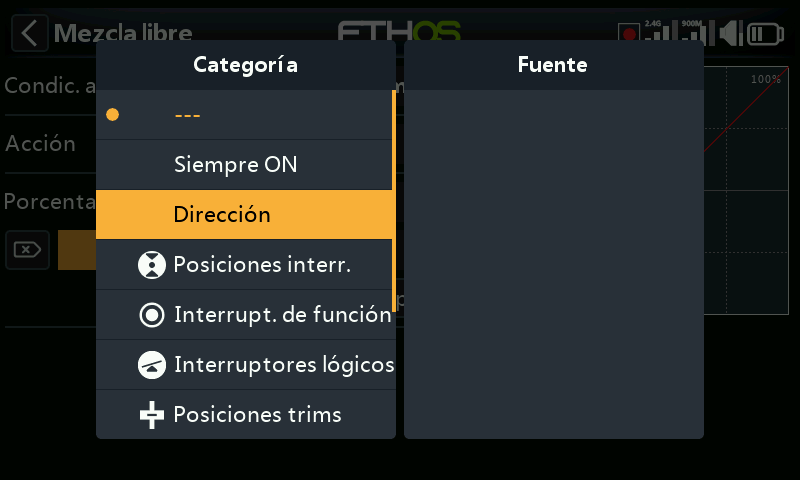

La condición activa por defecto es ‘Siempre ON’. Puede hacerse condicionada eligiendo posiciones de interruptores o de botones, interruptores de función, modos de vuelo, interruptores lógicos, un evento del sistema (como puede ser el corte o la retención del motor) o posiciones de compensado.

Además, en las opciones para condición activa de las acciones de las mezclas libre, hay disponibilidad de restricciones por ‘Dirección’.

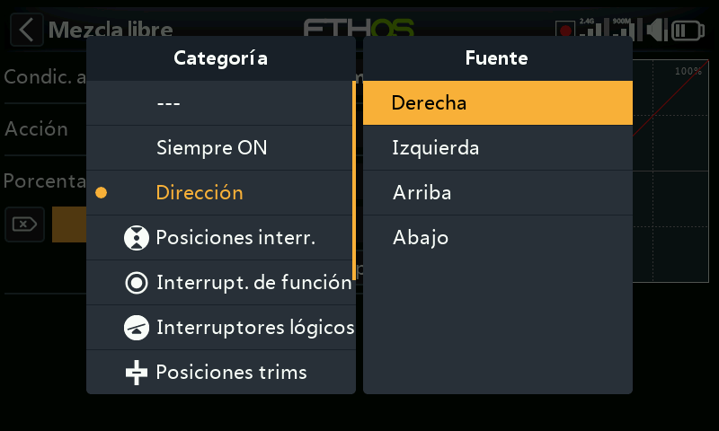

Las restricciones por dirección disponibles son: Derecha, Izquierda, Arriba y Abajo,

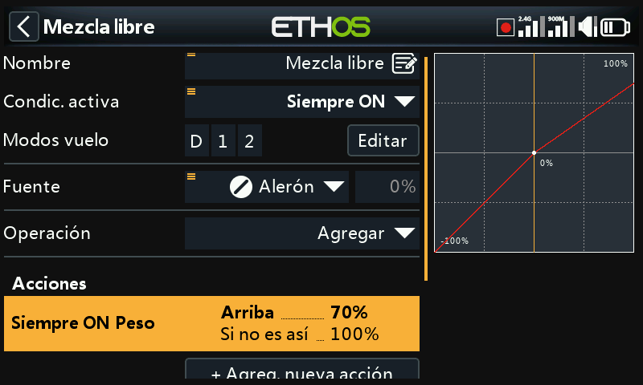

Para establecer diferentes pesos hacia arriba y hacia abajo (para emular los anteriores ‘Peso arriba’ y ‘Peso abajo’) las condiciones se pueden ajustar hacia ‘Arriba’ y las por defecto en ‘De lo contrario’. Vea también las acciones relaccionadas acciones con ‘Peso’ más abajo.

##### Acciones con ‘Peso’

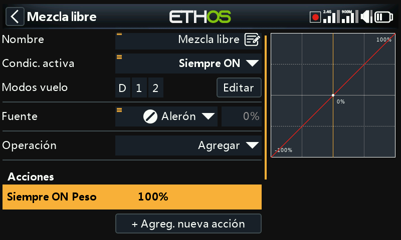

Por defecto, la Mezcla libre empieza son una acción con peso al 100% que está siempre activa.

Nota: A los efectos de este ejemplo, se han seleccionado los alerones como fuente.

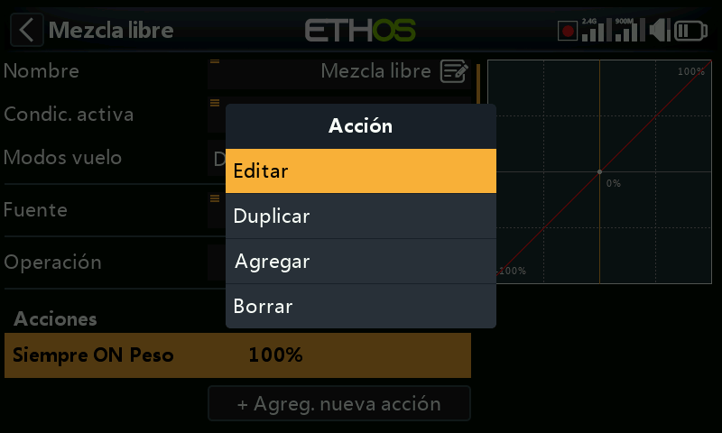

**Importante**: Para configurar el peso en una mezcla libre, toque en la linea por defecto para el peso y seleccione ‘Edit’ para hacer los cambios o añadidos. Seleccionando ‘+ Agregar una nueva acción’ tan sólo se añadirá una segunda acción para ‘Peso’.

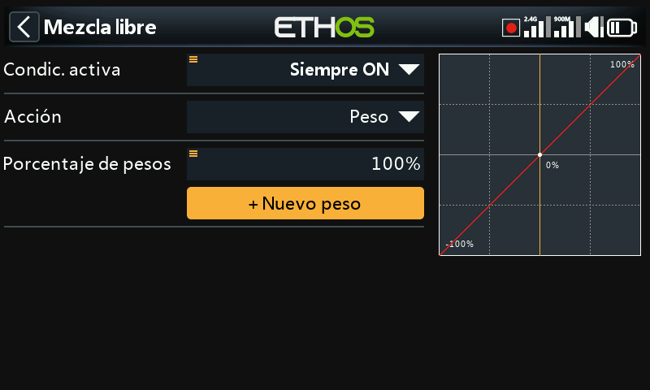

Toque en ‘+ Nuevo peso’ para agregar pesos adicionales. Como ejemplo, para crear diferentes recorridos, simplemente se añaden mas con ‘Peso’, pero condicionados a una posición de interruptor de 3 posiciones.

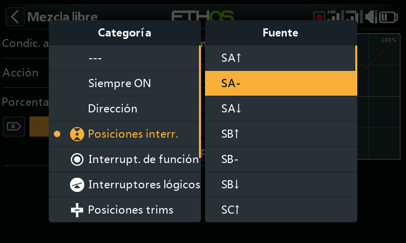

El ejemplo de arriba muestra que se seleccionará del interruptor SA- para conseguir un nuevo peso condicional.

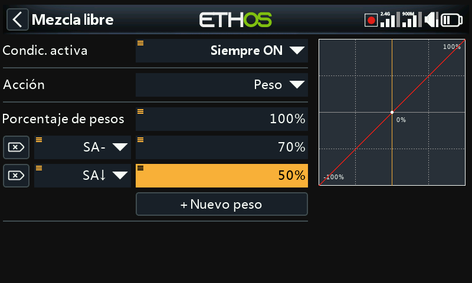

En el ejemplo de arriba, se han añadido dos pesos extra (o recorridos) usando el interruptor SA.

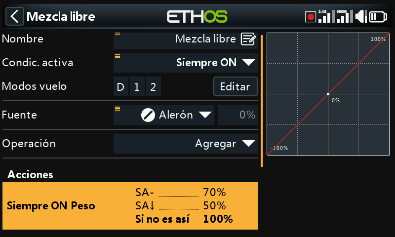

Cuando el interruptor no está en la posición intermedia o inferior, el peso será del 100%.

##### Curva

Para añadir curvas a una mezcla, seleccione ‘Curva’ en el cuadro de diálogo.

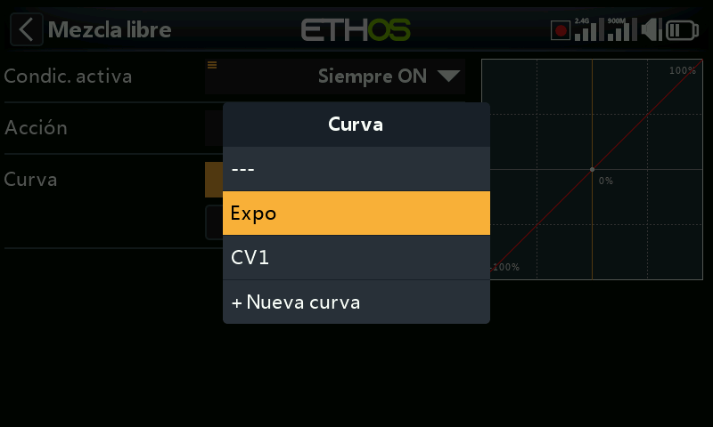

Una opción de curva estándar es Expo, que por defecto tiene un valor de 0, lo que significa que la respuesta es lineal (es decir, no hay curva). Un valor positivo suavizará la respuesta en torno a 0, mientras que un valor negativo la agudizará.

##### Ejemplo de uso de múltiples exponenciales

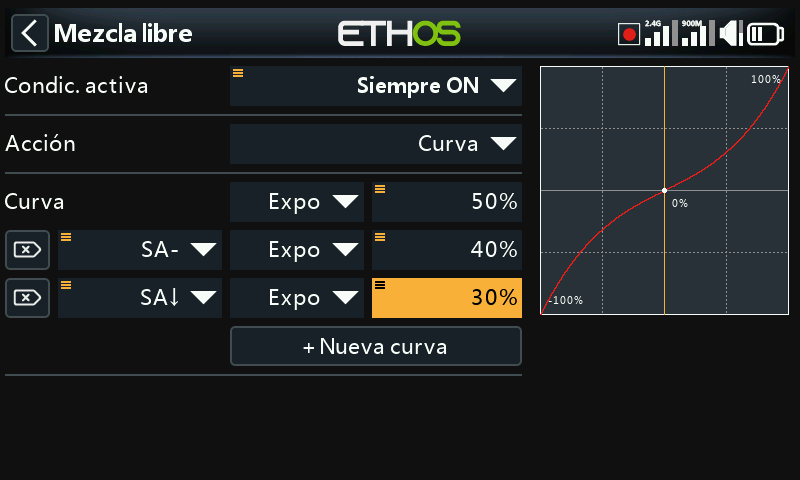

En este ejemplo se han definido 3 exponenciales diferentes que acompañan a los pesos definidos arriba.

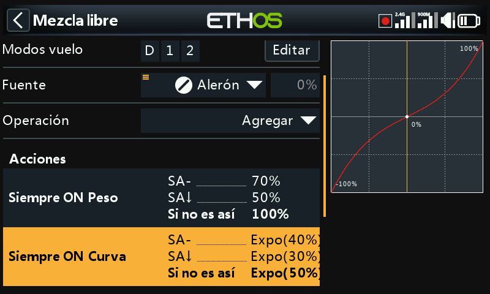

Con el interruptor SA en la posición intermedia, el peso será del 70% mientras que el exponencial será del 40%. Con el interruptor SA en la posición de abajo, el peso será del 50% y el exponencial será 30%. Con el interruptor SA en la posición por defecto (arriba) el valor de peso será de 100% mientras que la curva de exponencial estará en el 50%.

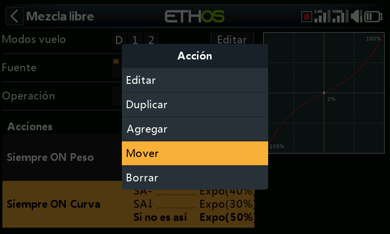

El orden recomendado para las acciones es Lento, Curva, Peso, Diferencial, Desplazamiento y Trim, así que moveremos hacia arriba nuestra acción Curva  para que esté por delante del Peso. Tocaremos \[ENT\] en la acción de curva resaltada y seleccionaremos la opción Mover.

Seleccionaremos la flecha hacia arriba resaltada, o usaremos el selector rotatorio para mover la acción Curva para situarla por encima del Peso.

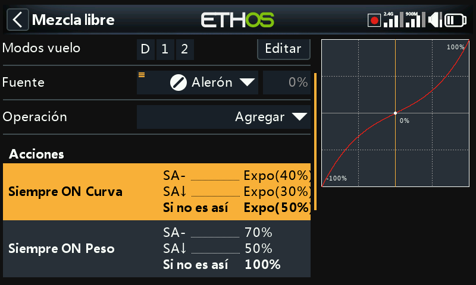

La acción curva está ahora en la primera posición.

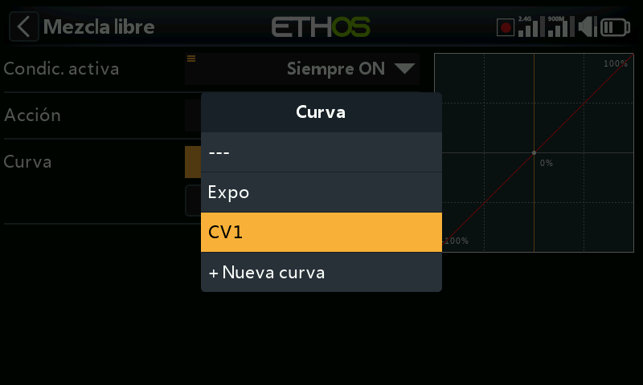

También podemos seleccionar cualquier curva definida previamente (por elemplo CV1 de arriba). La salida de la mezcla será modificada por esta nueva curva.

Tanto en las mezclas libres como en algunas otras, pueden especificarse hasta 6 curvas, cada una con una condición diferente. Si más de una condición se hace verdadera, la curva que está más arriba en la lista será la que prevalezca.

Tenga en cuenta que Curva se aplica antes que Peso.

##### Diferencial

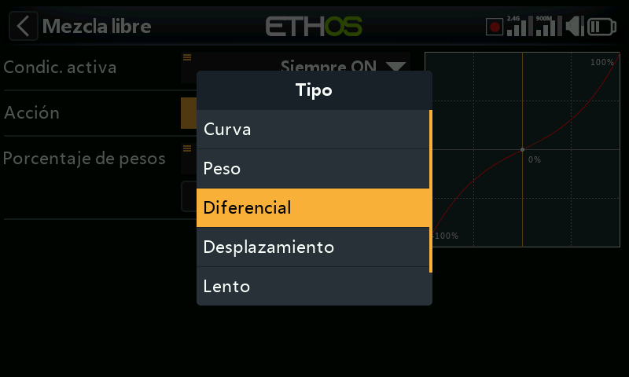

Para añadir un movimiento diferencial a una mezcla, se debe seleccionar ‘Diferencial’ en el listado de acciones del menú.

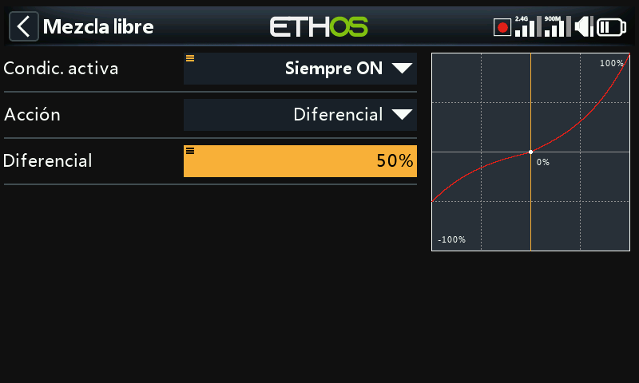

Introduciendo un valor positivo de diferencial, se obtendrá un desplazamiento menor hacia abajo. (Por defecto=0 se tiene un recorrido de -100% hasta +100%). Con un valor del 50%, el desplazamiento hacia abajo es la mitad del desplazamiento hacia arriba, como se puede ver en el ejemplo de arriba.

Encontrará más detalles, en la sección de mezclas de alerones.

##### Desplazamiento

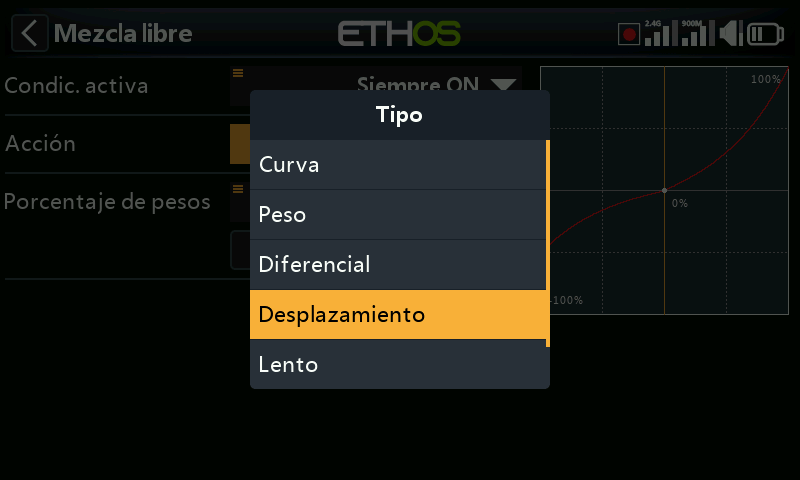

Para añadir un offset a una mezcla, seleccione ‘Desplazamiento’ en el listado de acciones del menú.

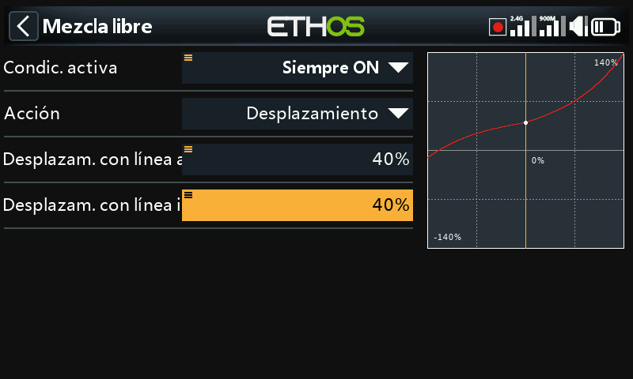

El Desplazamiento moverá la salida de la mezcla hacia arriba o hacia abajo a proporción del valor introducido. Se admiten valores negativos.

Se pueden definir dos valores en un offset, uno cuando la mezcla libre está activa, y otro cuando está inactiva.

##### Añadir compensación a una Mezcla Libre

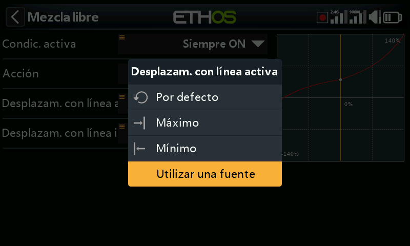

Se puede asignar un compensador a una mezcla libre, usando el interruptor de compensación como Fuente (manteniendo presionado el valor del campo) para el parámetro del Desplazamiento.

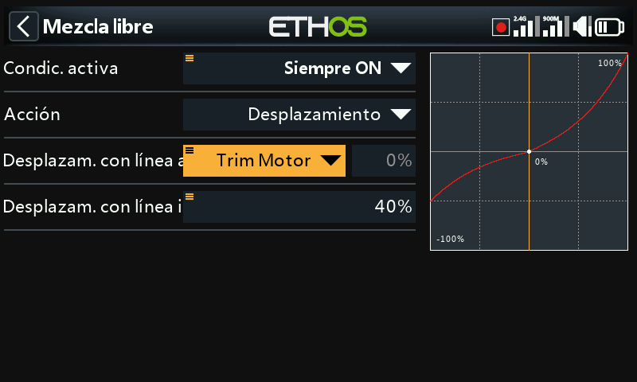

En el ejemplo de arriba, se ha seleccionado el compensador de motor como fuente para ajustar el offset.

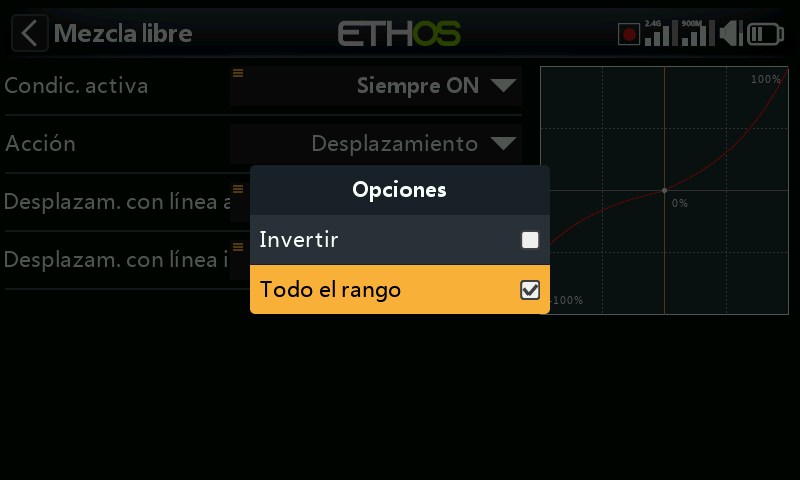

Los compensadores tendrán un movimiento por defecto de +/- 25%. Cuando se usan como fuente, los compensadores pueden cambiarse para tener todo el rango +/- 100% (Pulsando y manteniendo ENT en ese compensador).

La dirección del compensador se puede cambiar seleccionando la opción ‘Invertir’.

##### Lento

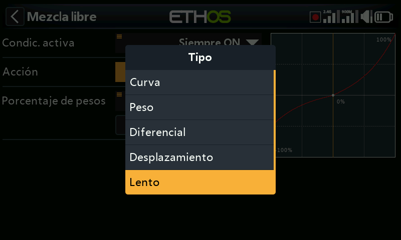

Para añadir una acción que retarde la respuesta de una salida de mezcla en relación con los cambios de la entrada, seleccione ‘Lento’ en las acciones del menú desplegable.

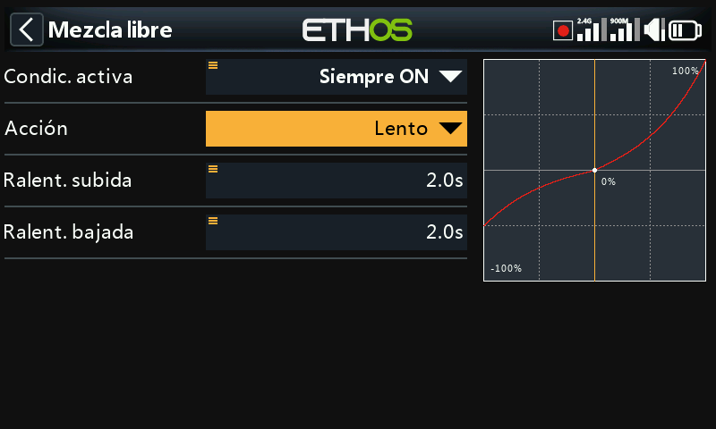

Lento se usa normalmente (por ejemplo) para retardar el movimiento de despliegue de los flaps, ya que incrementos súbitos en su movimiento pueden causar problemas de control.

Si introduce Lento como la primera acción, los valores introducidos se corresponderán con el tiempo en segundos que tardará la salida en moverse desde 0 hasta +100% (o cambiar el 100%).

Por ejemplo:

Acción 1 – Lento arriba/abajo=2s/2s

Acción 2 – Peso=50%

Si los cambios en la entrada van desde -100% hasta +100%,

La salida tardará (2+2)=4s en cambiar desde -50% hasta +50%.

Si por el contrario, la acción Lento se define después de una acción de Peso, entonces la transición para Lento será proporcionalmente más corta.

Por ejemplo:

Acción 1 – Peso=50%

Acción 2 -  Lento arriba/abajo=2s/2s

Si la entrada cambia desde -100% hasta +100%,

A la salida le llevará sólo (2+2)\*50% ‎ = 2s en cambiar desde -50% hasta +50%.

Se pueden establecer diferentes valores de retardo para arriba que para abajo.

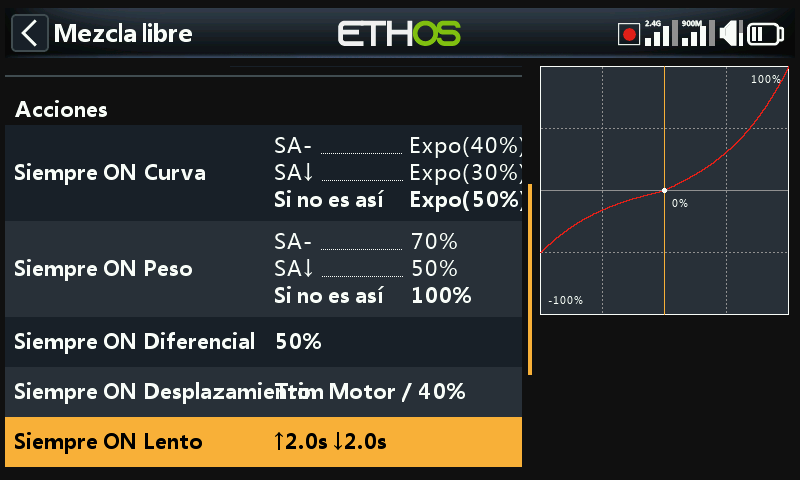

Arriba se muestra un resumen de todas las acciones de la mezcla. También observe, en el resumen de la parte de abajo, la acción Lento introducida en la parte de arriba.

##### Trim

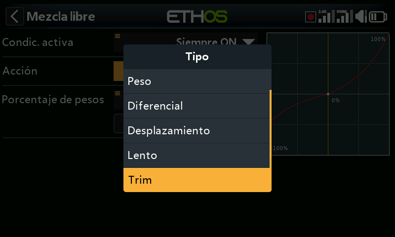

Para añadir un compensador a la mezcla, seleccione ‘Trim’ en el cuadro de diálogo. Hacerlo aquí es más sencillo que añadirlo en la acción Desplazamiento.

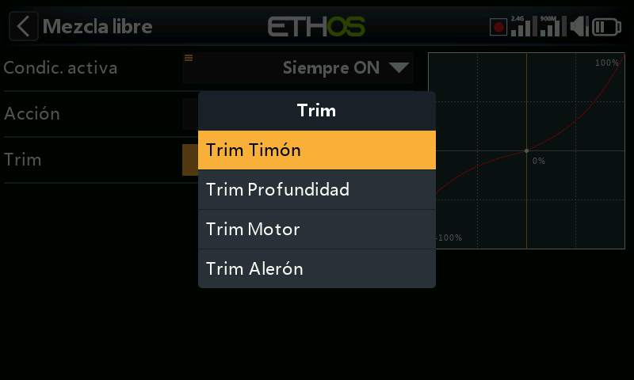

Seleccione el interruptor del trim que quiere usar.

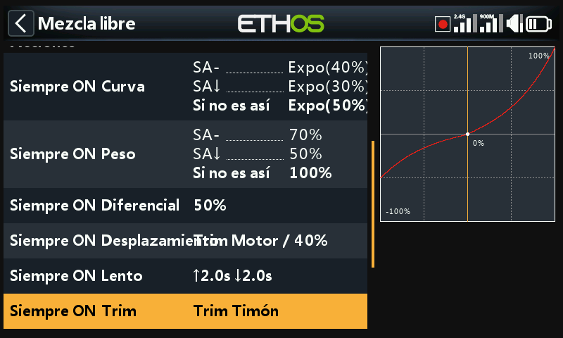

En la imagen de arriba se muestra un resumen de las acciones de la mezcla.

##### Reordenando acciones en mezclas libre

Como descrito con anterioridad, el orden que se recomienda para las acciones es Lento, Curva, Peso, Diferencial, Desplazamiento y Compensadores. Debe seguirse ese orden a menos que haya una razón específica para usar un orden distinto. Por ejemplo, puede querer retirar un desplazamiento de una entrada.

Dado que Peso es la acción por defecto que se activa cuando se crea una mezcla libre, cualquier acción adicional que se cree irá con un orden inferior, a menos que se elimine primero la acción relativa al Peso. Sin embargo, es más fácil cambiar simplemente el orden de las acciones de mezclas a su conveniencia usando la opción de ‘Mover’ en el submenú de edición.

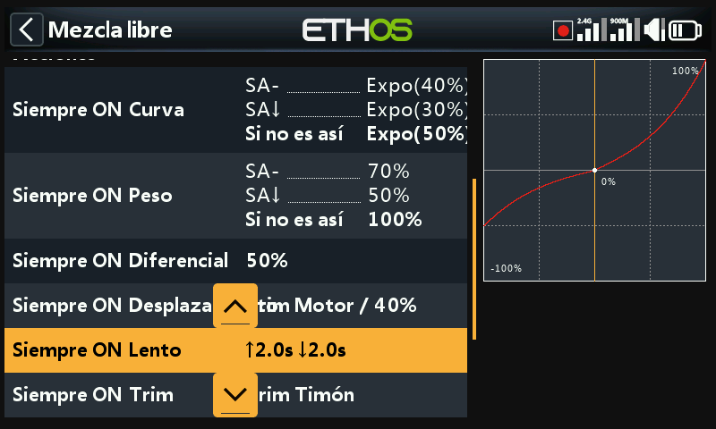

Seleccione la acción que desea mover, por ejemplo la acción ‘Lento’ de la figura de arriba, seleccione la opción ‘Mover’ en el sub-menu de edición. Unas flechas aparecerán, permitiendo que la acción se mueva el orden hacia arriba o abajo.

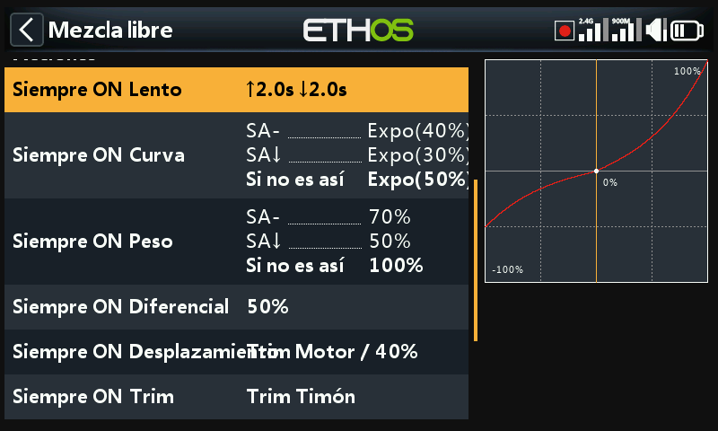

La figura resume cómo se han movido hacia arriba las acciones de Lento y Curva en la lista. Observe que Trim debe estar siempre al final.

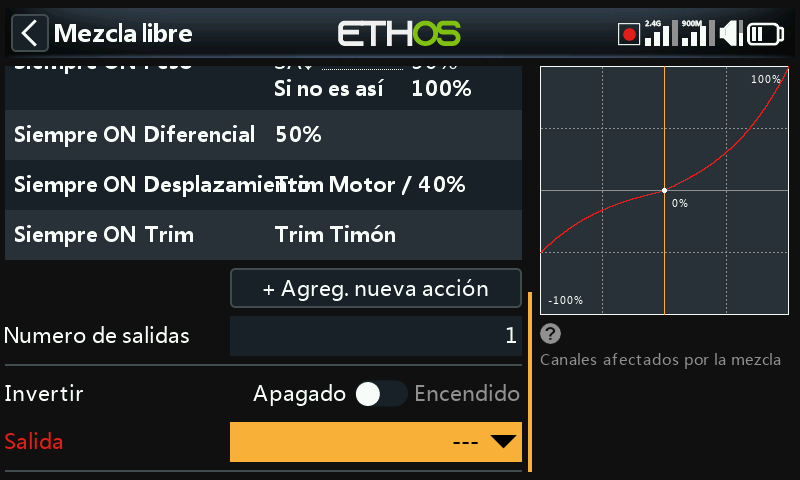

##### Recuento de canales

El recuento de canales define la cantidad de canales de salida que están asignados.

##### Invertir

La salida de una mezcla puede revertirse o invertirse habilitando esta opción. Tenga en cuenta que el cambio de sentido del servo debería hacerse en el apartado salidas. Esta opción está pensada para obtener bien la lógica de una mezcla.

##### Salida

En esta mezcla, se puede seleccionar cualquier canal para recibir la salida que se produce. Si el número de canales de arriba es mayor que uno, entonces se debe configurar un canal para cada salida.

#### ***La librería de mezclas*** ***para aviones*** ***continuará******…***

#### Alerón, Elevador, Timón

Ir a la descripción detallada de [Mezclas de Alerón Elevador Timón](mixes.md) de más arriba.

#### Flaps

La mezcla Flaps combinará una entrada para uno o más canales con Pesos individuales. También ofrece opciones para Lento hacia arriba y abajo.

#### Acelerador

La mezcla del acelerador es para el control del motor e incluye las opciones de corte del motor y retención del motor. Consulte la explicación detallada en [Mezclas de Acelerador](#Throttle Mix) de más arriba.

#### Alerón a Flap

Esta mezcla se utiliza comúnmente en los planeadores, para que los flaps se muevan junto con los alerones para aumentar la respuesta en alabeo del modelo.

#### Alerón a Timón

Una de las mezclas más utilizadas para ayudar al modelo a tener giros más coordinados sin resbales. Sin embargo, esta mezcla sólo funcionará bien para una velocidad y orientación determinada. Es mejor aprender a hacer los virajes coordinados con control manual del timón.

#### Freno aerodinámico

La mezcla de Freno Aerodinámico es similar a la mezcla Butterfly que describiremos a continuación, excepto que es controlada por una condición activa para encendido y apagado.

#### Butterfly

El frenado butterfly o crow se utiliza para controlar el régimen de descenso de un avión. Los alerones se ajustan para que suban una cantidad modesta, mientras que los flaps bajan una gran cantidad. Esta combinación crea mucha resistencia, y es muy eficaz para frenar y por lo tanto ideal para controlar la aproximación de aterrizaje. La entrada se ajusta normalmente a un deslizador (o a la palanca del acelerador en un planeador).

También es necesario compensar en profundidad para evitar que el planeador flote demasiado al aplicar crow.

Tenga en cuenta que esta mezcla incluye también la posibilidad de hacer offset para que la salida sea ‘cero’ cuando los flaps están en una posición neutral. Por ejemplo, cuando la palanca del motor (o una Fuente alternativa) está en su posición más baja y en la posición máxima cuando los flaps están totalmente bajados. Otro ejemplo podría ser usar la palanca de motor (o cualquier otra fuente) en su posición alta. Este offset se deshabilita cuando se añade una curva que tenga control total.

#### Curvatura (Camber)

La mezcla ‘Camber’ normalmente se utiliza para aplicar algo movimiento hacia abajo de las superficies del ala para aumentar la sustentación por curvatura del ala.

#### Flap a Elevador

La mezcla de Flap a Elevador es muy util para compensar en profundidad cuando se utiliza flap/camber/crow, donde se necesite una curva de compensación.

#### Elevador a Camber

También conocida como Flaps instantáneos o ‘Snap Flap’, esta mezcla añade curvatura (camber) al ala cuando se aplica profundidad. Esto permite que el ala genere sustentación de forma más eficiente cuando el avión recibe órdenes de cabeceo.

#### Timón a Alerón

Esta mezcla se utiliza para contrarrestar la guiñada inducida por el timón en el vuelo a cuchillo.

#### Timón a Elevador

Esta mezcla puede ayudar a mejorar el vuelo a cuchillo cuando hay problemas de acoplamiento de mandos.

#### Tonel rápido

El tonel rápido o ‘snap roll’ es una maniobra de autorrotación en pérdida. Durante un snap, un ala entra en pérdida mientras la otra se acelera alrededor del eje de alabeo. Esto crea una aceleración repentina del régimen de alabeo que no se puede obtener simplemente moviendo los alerones. Para conseguir esta condición en un modelo, se deben dar varias entradas, incluyendo profundidad, timón y alerones. Por ejemplo, puede realizar un giro interior a la izquierda programando la mezcla para aplicar simultáneamente elevador, timón izquierdo y alerón izquierdo durante 1 ó 2 segundos. Se recupera la maniobra neutralizando las palancas y añadiendo inmediatamente timón a la derecha para corregir la pérdida de rumbo.

#### Acelerador a Elevador

Esta mezcla permite la compensación en profundidad para aviones que cambian la posición de cabeceo al modificar el motor.

Tenga en cuenta que esta mezcla incluye también la posibilidad de hacer offset para que la salida sea ‘cero’ cuando el motor esté en su posición más baja, y que esté al máximo cuando el motor esté en su posición más alta. Este offset se deshabilita cuando se añade una curva que tenga control total de la salida correspondiente.

#### Acelerador a Timón

Esta mezcla ayudará a que el avión vuele recto con el acelerador a fondo; generalmente es necesaria cuando se vuela en una subida vertical.

Tenga en cuenta que esta mezcla incluye también la posibilidad de hacer offset para que la salida sea ‘cero’ cuando el motor esté en su posición más baja, y que esté al máximo cuando el motor esté en su posición más alta. Este offset se deshabilita cuando se añade una curva que tenga control total de la salida correspondiente.

#### Mezcla de pruebas

Esta mezcla es ideal para pruebas extensivas de todos los servos. Incluye un ajuste de movimiento, además de Lento Arriba y Abajo.

#### Desplazamiento

La mezcla Offset se utiliza para añadir un valor fijo a la mezcla cuando se requiere un desplazamiento del centro. Una aplicación común es para los flaps, donde el soporte del servo se desplaza en una dirección con el fin de maximizar el recorrido hacia abajo de los flaps. Esto da como resultado que los flaps estén en una posición a medio camino hacia abajo con el servo en neutral. La mezcla de Offset se puede utilizar entonces para llevar los flaps a la posición 'superficie neutral' cuando la salida de la mezcla de los flaps sea cero.

#### Secuenciador

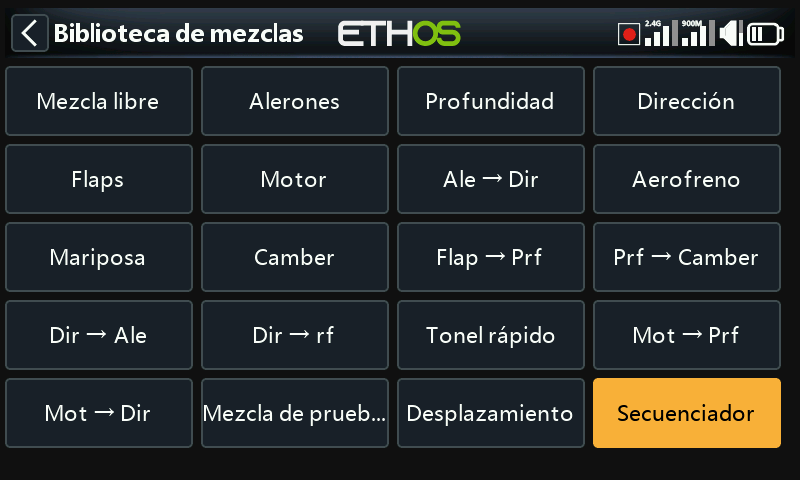

La mezcla Secuenciador permite que múltiples canales se secuencien hacia adelante y hacia atrás utilizando bases de tiempo y curvas programables. Es muy útil para programar cosas como el tren de aterrizaje y las secuencias de las compuertas del tren. El secuenciador se ha diseñado con los controles necesarios para que la secuencia sea fácil de programar, mientras permite una flexibilidad total, limitada solo por su imaginación.

Antes de empezar la programación, deberá hacer un poco de planificación sobre cómo quiere que funcione el secuenciador.

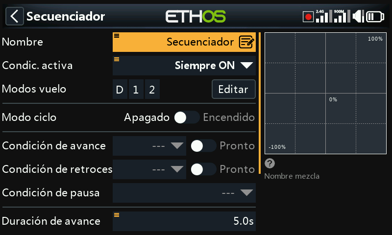

##### Nombre

Aquíi se puede introducir un nombre descriptivo para la mezcla del secuenciador.

##### Condición activa

La condición activa predeterminada es 'Siempre encendido'. Puede volverse condicional al elegir entre posiciones de interruptor o de botón, interruptores de función, modos de vuelo, interruptores lógicos, un evento del sistema como corte de acelerador o retención, o posiciones del trim.

##### Modos de vuelo

Si se han definido modos de vuelo en la sección 'Modos de vuelo', entonces este parámetro estará disponible. La mezcla puede hacerse condicional a uno o más modos de vuelo. Haz clic en 'Editar' y marca las casillas de los modos de vuelo en los que esta mezcla debe estar activa.

##### Modo ciclo

Con el modo ciclo activado, el secuenciador funcionará hacia adelante y hacia atrás continuamente en un bucle. Con el modo ciclo desactivado, se debe cumplir la condición de avance o retroceso antes de que comience la secuencia correspondiente.  
  
Un buen ejemplo de aplicación para el modo de bucle es una secuencia de prueba de servos.

##### Condición de avance

La condición de avance inicia el secuenciador en dirección hacia adelante. Luego se ejecutará hasta completarse durante el tiempo que se indica en la ‘Duración de avance’, a menos que el parámetro ‘Pronto’ esté activado.

##### Pronto

La opción ‘Pronto’ permite que la secuencia de ejecución en avance se termine antes si se cumple la condición hacia atrás.

##### Condición de retroceso

La condición de retroceso inicia el secuenciador en dirección hacia atrás. Luego se ejecutará hasta completarse durante el tiempo que se indica en la ‘Duración de retroceso’, a menos que el parámetro ‘Pronto’ esté activado.

##### Early

La opción ‘Pronto’ permite que la secuencia de ejecución hacia atrás se termine antes si se cumple la condición hacia adelante

##### Condición de Pausa

El secuenciador se puede pausar activando la condición de pausa. Permanecerá en modo de pausa hasta que la condición de pausa vuelva a ser falsa.

##### Duración de avance

Aquí se puede configurar la base de tiempo para la secuencia de avance.

##### Duración de retroceso

Aquí se puede configurar la base de tiempo para la secuencia de retroceso. Puede ser diferente a la duración en avance.

##### Salida1

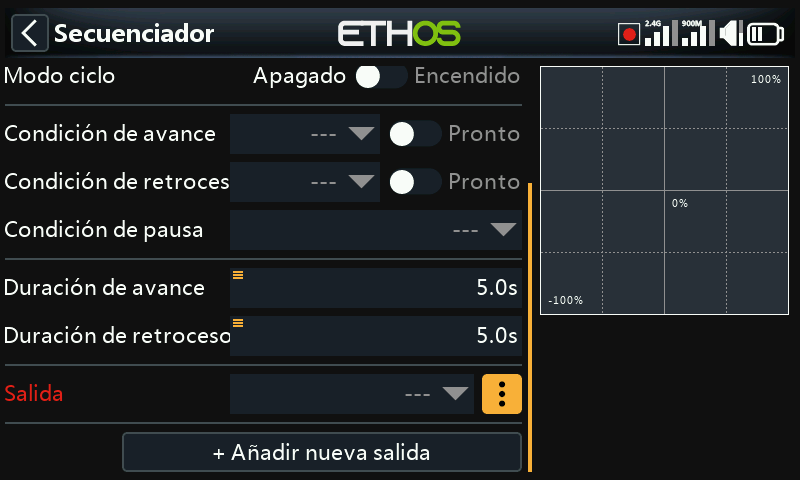

Se puede seleccionar cualquier canal para recibir una salida del secuenciador.

##### Menú de Salida1

Toque en los 3 puntos para abrir el menú de opciones de la curva.

##### Opciones de curva

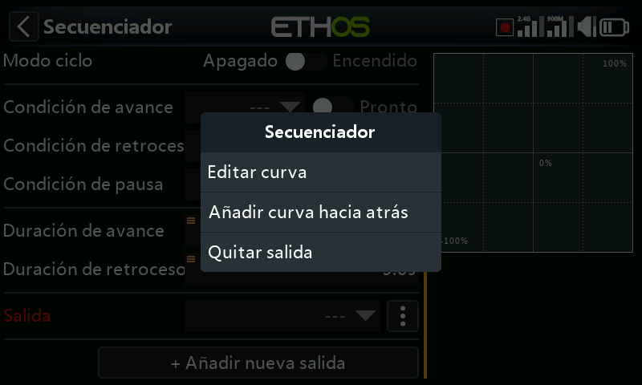

##### Editar curva

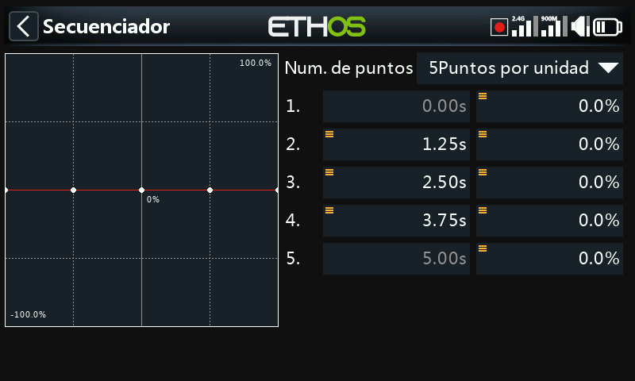

La curva tiene 5 puntos por defecto, pero puede tener hasta 21. Tanto las coordenadas X como Y son configurables.

##### Añadir una curva hacia atrás

Por defecto, el sistema usa la misma curva para las dos direcciones, pero se puede añadir una curva distinta hacia atrás.

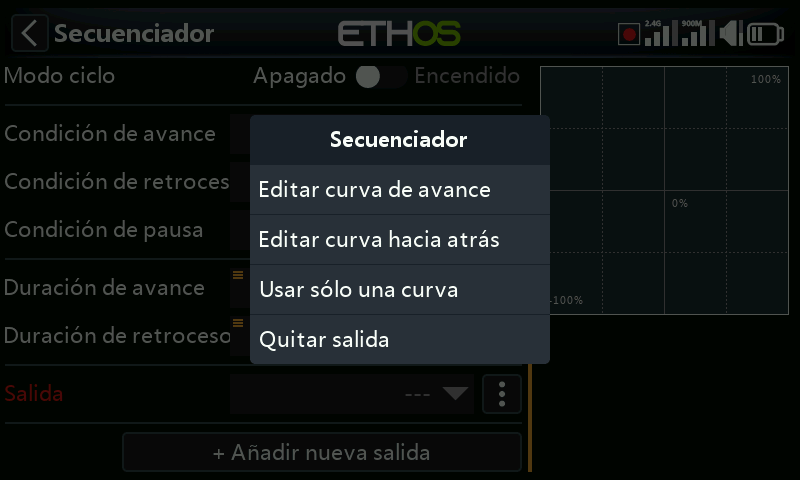

Una vez que se ha añadido una curva hacia atrás, el menu de opciones le permitirá editar cualquiera de las dos curvas.

##### Editar curva hacia adelante

Las curvas hacia adelante se pueden editar. Cuando existan dos curvas, una flecha indicará la que está siendo editada.

El ejemplo de curva que se muestra arriba es perfectamente válida para su aplicación en una secuencia de prueba de servos.

##### Editar curva hacia atrás

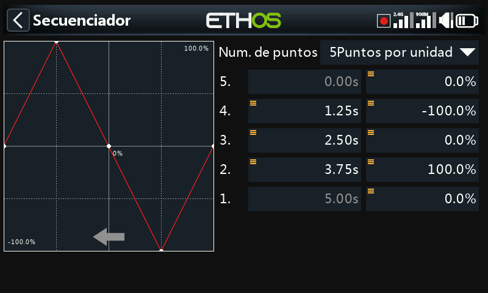

Las curvas hacia atrás también se pueden editar. Cuando existan dos curvas, una flecha indicará la que está siendo editada.

Si se crea una curva hacia atrás después de que se haya creado una curva hacia adelante, la misma curva será replicada hacia atrás, y entonces podrá ser modificada.

##### Usar sólo una curva

Si cambia de opinión, la curva hacia atrás puede eliminarse, seleccionando la opción ’Usar solo una curva’.

##### Eliminar salida

La salida también se puede eliminar.

##### Añadir una nueva salida

Se pueden añadir salidas adicionales, cada una con su propia curva/s.

Como ejemplo, esto permite que una salida controle las compuertas del tren, y que otra salida controle el tren retráctil. Usando las curvas de cada salida, se puede configurar una secuencia para abrir primero lentamente las compuertas del tren, seguido de la secuencia del tren, y finalmente cerrar las compuertas de nuevo, ajustandolas de tal forma que se ajuste el tiempo correcto para cada paso. Las curvas se pueden configurar con la inclinación suficiente para controlar la velocidad de los cambios en las salidas, o hacerlo instantáneamente si el tren de aterrizaje usa un controlador de secuencia propio.

Vaya a la sección ‘Como configurar un secuenciador de compuertas y tren’ para ver un ejemplo.

##### Resumen de la operación del Secuenciador

Una vez que se ha cumplido su condición de avance, cada salida de mezcla del secuenciador sigue su curva de avance (o única) de izquierda a derecha durante la duración del avance. De manera similar, una vez que se ha cumplido su condición de retroceso, cada salida de mezcla del secuenciador sigue su curva de retroceso (o única) de derecha a izquierda durante la duración del retroceso.

El parámetro ‘Pronto’ permite que el secuenciador cambie de dirección anticipadamente, mientras que la condición ‘Pausa’ permite que la secuencia se detenga. En modo bucle, la operación es continua.

Todo lo anterior, por supuesto, estará sujeto a las condiciones activas y modos de vuelo configurados.

### Biblioteca de mezclas para planeadores

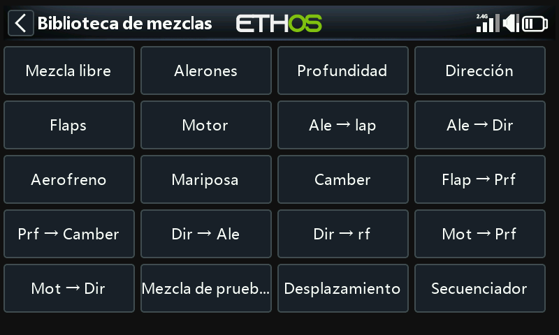

La lista de mezclas predefinidas disponibles en la biblioteca de mezclas para planeadores se muestra en la figura de arriba

Tenga en cuenta que algunas mezclas sólo aparecerán si los canales requeridos existen en el modelo en cuestión. Por ejemplo, las mezclas que afecten a los flaps solo aparecerán si hay definida una configuración válida con flaps. Las mezclas relacionadas con los flaps aparecerán en la biblioteca de mezclas si se han definido flaps al editar el modelo.

#### Mezcla libre

Consulte la descripción de [Mezcla libre](mixes.md) en la sección anterior Biblioteca de mezclas para aviones.

#### Alerón, Elevador, Timón

Por favor refiérase a la descripción detallada para mezclas de [Alerón Elevator Timón](mixes.md) de más arriba.

#### Flaps

La mezcla de Flaps mezclará una Entrada a uno o más canales con Pesos individuales. También ofrece opciones de Lento Arriba y Abajo.

#### Acelerador

La mezcla del acelerador es para el control del motor e incluye las opciones de corte del motor y retención del motor. Consulte la explicación detallada de mezclas de M[ezclas de acelerador](#Throttle Mix) más arriba.

#### Alerón a Flap

Esta mezcla se utiliza comúnmente en los planeadores para que los flaps se muevan junto con los alerones para aumentar la respuesta de los alerones del modelo.

#### Alerón a Timón

Esta mezcla se usa habitualmente para ayudar al modelo a tener giros más coordinados. Sin embargo, esta mezcla sólo funcionará bien para una velocidad y orientación determinada, Es mejor aprender a hacer los virajes coordinados con control manual del timón.

#### Aerofreno

La mezcla de Airbrake es similar a la mezcla de Butterfly que se describe a continuación, excepto que es controlada por una condición activa de encendido y apagado.

#### Butterfly

El frenado Butterfly o Crow se utiliza para controlar la velocidad de descenso de un avión. Los alerones se ajustan para que suban una cantidad modesta, mientras que los flaps bajan una gran cantidad. Esta combinación crea mucha resistencia, y es muy eficaz para frenar y por lo tanto ideal para controlar la aproximación de aterrizaje. La entrada se ajusta normalmente en un deslizador (o a la palanca del acelerador en un planeador).

También es necesario compensar en profundidad para evitar que el planeador flote demasiado al aplicar el Crow.

Tenga en cuenta que esta mezcla incluye también la posibilidad de hacer offset para que la salida sea ‘cero’ cuando los flaps están en una posición neutral. Por ejemplo, cuando la palanca del motor (o una Fuente alternativa) está en su posición más baja y en la posición máxima cuando los flaps están totalmente bajados. Otro ejemplo podría ser usar la palanca de motor (o cualquier otra fuente) en su posición alta. Este offset se deshabilita cuando se añade una curva que tenga control total de la salida correspondiente.

#### Curvatura (Camber)

La mezcla Camber se utiliza normalmente para aplicar movimiento hacia abajo de las superficies del ala para aumentar la sustentación.

#### Flap a Elevador

La mezcla de Flap a Elevador es útil para la compensación de flaps/camber/crow, donde se requiere una curva de compensación personalizada.

#### Elevador a Camber

También conocido como Snap Flap, esta mezcla añade curvatura al ala cuando se aplica el elevador. Esto permite que el ala genere sustentación de forma más eficiente cuando el avión recibe órdenes de cabeceo.

#### Timón a Alerón

Esta mezcla puede utilizarse para contrarrestar la guiñada inducida por el timón.

#### Timón a Elevador

Esta mezcla puede ayudar cuando hay problemas de acoplamiento. También puede utilizarse para añadir una función diferencial cuando se añade una cola en V en el modelo.

#### Acelerador a Elevador

Esta mezcla permite la compensación en profundidad para aviones que cambian el cabeceo al cambiar el acelerador.

#### Acelerador a Timón

Esta mezcla ayudará a que el avión vuele recto con el acelerador a fondo; generalmente es necesaria cuando se vuela en una subida vertical.

#### Mezcla para pruebas

Esta mezcla es ideal para pruebas extensivas de recorrido de servos. Incluye un ajuste de rango, así como Lento Arriba y Abajo.

Por seguridad, la mezcla de prueba evita usar los canales del acelerador.

#### Desplazamiento (Offset)

La mezcla Offset se utiliza para añadir un valor fijo a la mezcla cuando se requiere un desplazamiento del centro. Una aplicación común es para los flaps, donde el soporte del servo se desplaza en una dirección con el fin de maximizar el recorrido hacia abajo de los flaps. Esto da como resultado que los flaps estén en una posición a medio camino hacia abajo con el servo en neutral. La mezcla de Offset se puede utilizar entonces para llevar los flaps a la posición 'superficie neutral' cuando la salida de la mezcla de los flaps sea cero.

### Biblioteca de mezclas para helicópteros

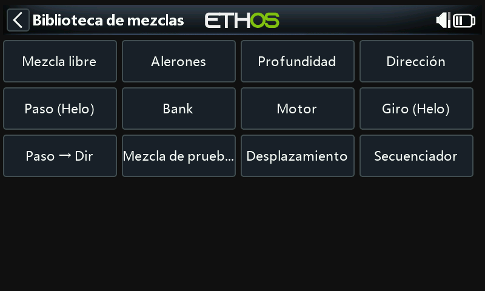

#### Mezcla libre

Consulte la descripción de M[ezcla Libre](mixes.md) en la sección anterior Biblioteca de mezclas para aviones.

#### Alerón, Elevador, Timón

Consulte la descripción detallada de la mezcla [Alerón Elevador Timón](mixes.md) en la Bibliotec de mezclas para aviones.

#### Paso (Pitch)

La mezcla de Paso \[‘Pitch’\] conecta el control de paso (por defecto, la palanca de motor) al canal del paso, que normalmente es el canal 6. Controla el colectivo.

#### Bank

En los helicóperos que cuentan con el típico sistema FBL, el modo bank permite a los pilotos cambiar en vuelo entre ajustes previamente guardados. Cuando se asigna esa mezcla a un interruptor de tres posiciones, se puede ciclar en el aire entre esos banks (tipicalmente Bank 0, 1, y 2) para cambiar rápidamente en el aire los parámetros de vuelo o activar las funciones de rescate como sea necesario.

#### Acelerador

La mezcla del acelerador es para el control del motor e incluye las opciones de corte del motor y retención del motor. Consulte la explicación detallada de M[ezcla de acelerador](#Throttle Mix) de más arriba.

#### Giróscopo

Esta mezcla se utiliza para proporcionar ajustes de ganancia al controlador FBL, que pueden (por ejemplo) depender del modo de vuelo. El canal del giróscopo suele ser el canal 5.

#### Paso a Timón

Esta mezcla sirve para combinar el paso con el canal del timón.

#### Mezcla de pruebas

Esta mezcla es ideal para la pruebas extensivas del recorrido de los servos. Incluye un ajuste de régimen, así como Lento Arriba y Abajo.

#### Desplazamiento (Offset)

La mezcla Offset se utiliza para añadir un valor fijo al mezclador cuando se requiere un offset.

### Biblioteca de mezclas para multirotores

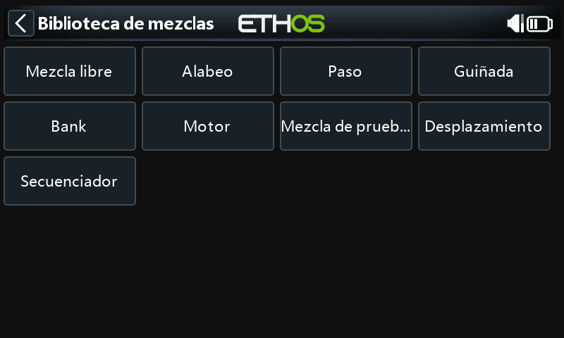

#### Mezcla libre

Consulte la descripción de M[ezcla libre](mixes.md) en la sección de Biblioteca de aviones

#### Balanceo, Cabeceo y Guiñada

Estas mezclas son similares a las mezclas de Alerón, Elevador y Timón. Consulte la descripción anterior de las mezclas de [Aleron Elevador Timón](mixes.md) de más arriba.

#### Bank

En los típicos multicópteros, el modo bank permite a los pilotos cambiar en vuelo entre ajustes previamente guardados. Cuando se asigna esa mezcla a un interruptor de tres posiciones, se puede ciclar en el aire entre esos banks (tipicalmente Bank 0, 1, y 2) para cambiar rápidamente en el aire los parámetros de vuelo o activar las funciones de rescate como sea necesario.

#### Acelerador

La mezcla del acelerador es para el control del motor e incluye las opciones de corte del motor y retención del motor. Consulte la explicación detallada de la [Mezcla de acelerador](#Throttle Mix) más arriba.

#### Mezcla de pruebas

Esta mezcla es ideal para la prueba extensiva de recorrido de los servos. Incluye un ajuste de régimen, así como Lento Arriba y Abajo.

#### Desplazamiento

La mezcla Offset se utiliza para añadir un valor fijo al mezclador cuando se requiere un offset.
