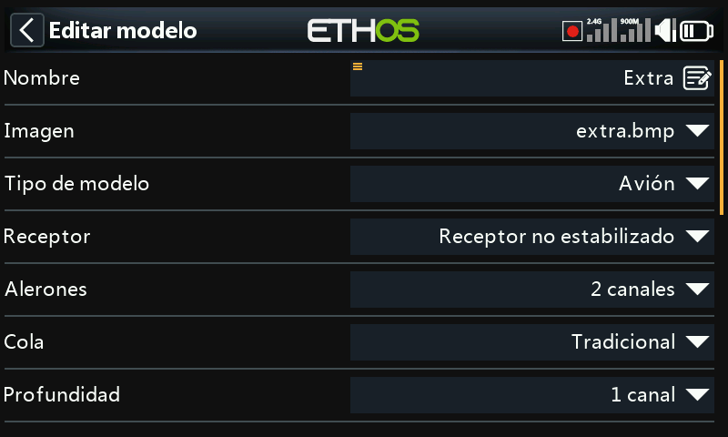
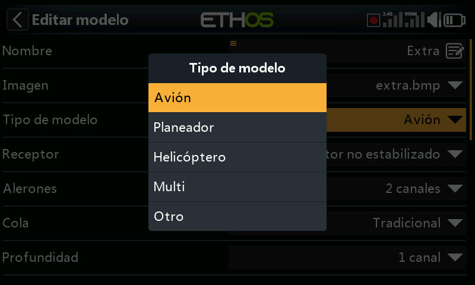
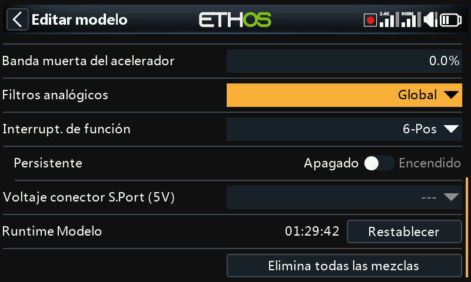
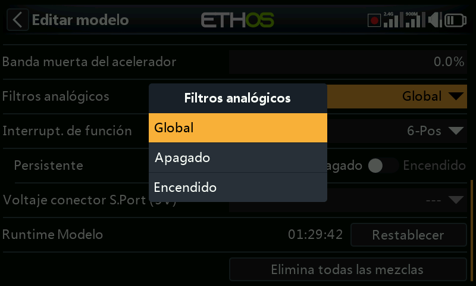
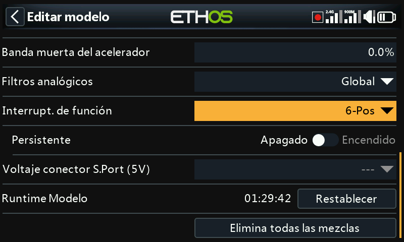
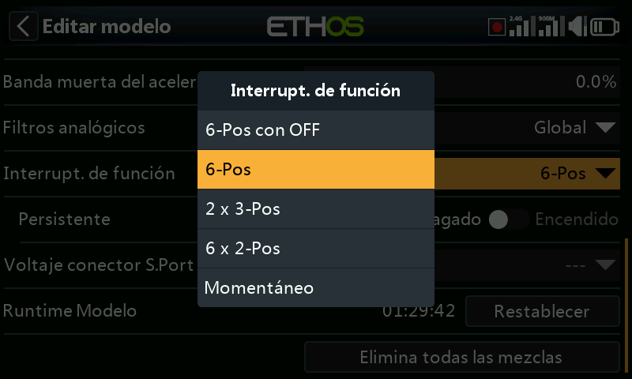
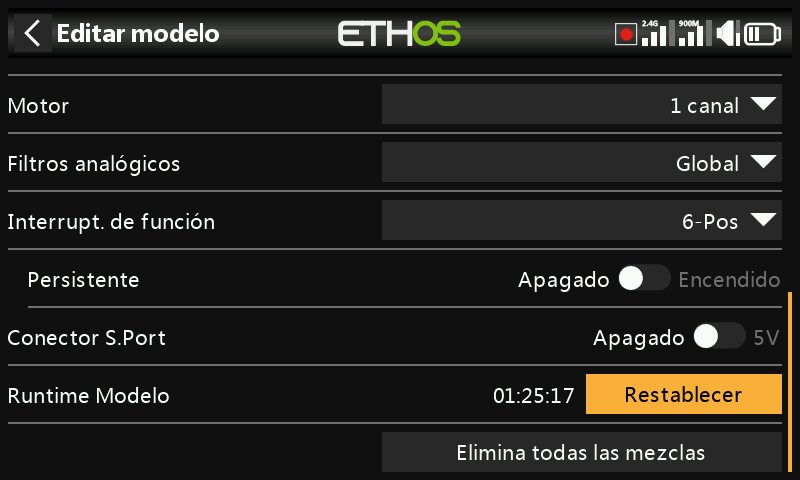
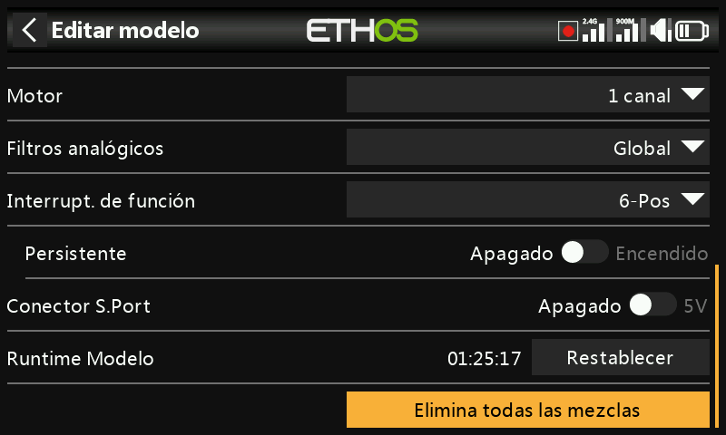

# Edición del modelo

Permite editar los parámetros a nivel de modelo que el asistente configuró
inicialmente: principalmente la identificación, pero también algunas
excepciones y utilidades propias de cada modelo.

## Nombre, imagen

Permite cambiar el nombre del modelo o su imagen; al buscar una imagen se
muestra una miniatura de previsualización.

## Tipo de modelo

!!! warning
    Cambiar el tipo de modelo restablece **todas** las mezclas.

## Asignación de canales

Cambiar el tipo de cola o, en un helicóptero, el tipo de plato cíclico
también restablece todas las mezclas. En los demás canales se puede
modificar el número de canales asignados o dejarlos sin asignar.

## Filtro de analógicos

[Configuración del sistema → Hardware](../system-setup/hardware.md) dispone de un
filtro analógico-digital global que puede reducir las oscilaciones alrededor del
centro de la palanca; este ajuste por modelo lo anula únicamente para este modelo.

## Interruptores de función {: #function-switches }

Los seis interruptores de función están disponibles en cualquier sitio donde
aparezca un parámetro **Condición activa**, pero —a diferencia de los
interruptores normales— no pueden usarse como fuente de uso general. Se
configuran de una de estas formas:

- **6 posiciones con OFF**: al pulsar un interruptor de función queda
  enclavado en ON; al pulsar de nuevo *el mismo*, se apagan los seis.
- **6 posiciones**: al pulsar un interruptor de función queda enclavado en
  ON hasta que se pulsa *otro distinto*, que toma el relevo.
- **2 × 3 posiciones**: divide los seis en dos grupos de tres, con un
  interruptor activo por grupo.
- **6 × 2 posiciones**: seis interruptores enclavados independientes de
  encendido/apagado.
- **Momentáneo**: seis interruptores independientes, cada uno activo sólo
  mientras se mantiene pulsado.
- **Persistente**: si se habilita, el interruptor de función conserva su
  estado al apagar la emisora o recargar el modelo, en lugar de
  restablecerse.

## Conector SPort

El pin de 5 V del conector S.Port de la emisora puede habilitarse o
deshabilitarse para cada modelo, lo que resulta útil, por ejemplo, para
alimentar un receptor externo en una configuración de entrenador.

## Tiempo de uso del modelo

Contabiliza el tiempo total que este modelo ha estado volando o en
funcionamiento.

## Restablecer todas las mezclas

Restablece todas las mezclas del modelo a su estado por defecto.
