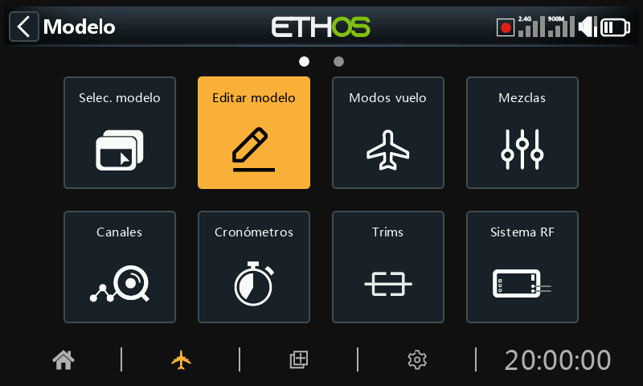
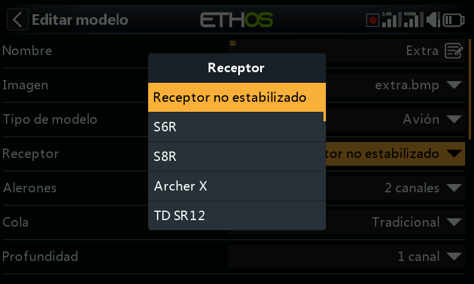
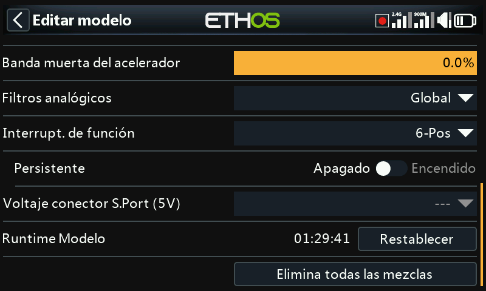
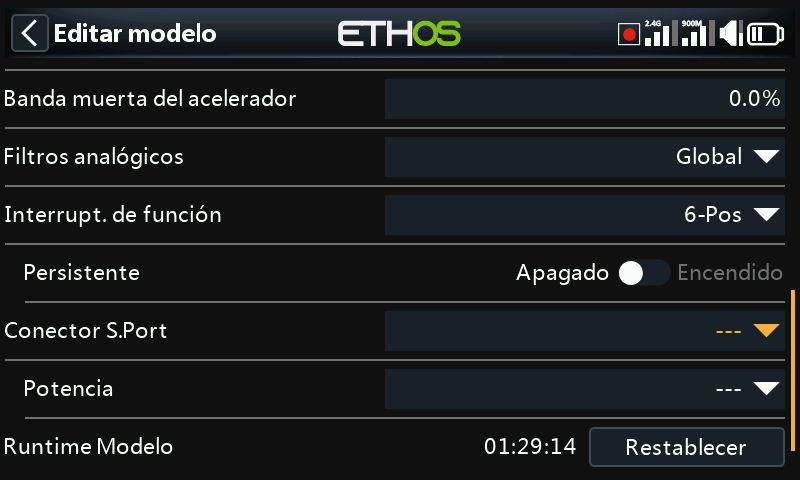

# Editar modelo

La opción "Editar modelo" se utiliza para editar los parámetros básicos del modelo después de configurarlos el asistente, o cuando se desee.

## Nombre, Imagen

Se puede cambiar el nombre del modelo, asignarle una imagen, o modificarla. Al buscar una imagen, se muestra una vista previa en miniatura para facilitar la localización de la imagen correcta.

Los mapas de bits del modelo deben estar ubicados en la carpeta [bitmaps/models](#bitmaps-models-) en la tarjeta SD o eMMC.

## Tipo de modelo

Si se cambia el tipo de modelo, se restablecerán todas las mezclas.

## Receptor

Lista los tipos de receptores actualizados, que se pueden cambiar.

## Asignación de canales

Cambiar el tipo de cola, o el plato cíclico de un helicóptero, hará que se reinicien todas las mezclas. En los otros canales se puede cambiar el número de canales de salida asignados, o quitar su asignación.

## Banda muerta del acelerador

Permite configurar una banda muerta en el acelerador para aceleradores basados en ‘cero’ es decir que tengan adelante y reversa, para evitar movimientos no deseados del motor cuando la palanca está en neutral.

## Filtros analógicos

En la página Hardware hay un filtro de conversión analógico-digital, en el apartado F[iltros analógicos](../system-setup/hardware.md), que puede mejorar la vibración del mando (‘jitter’) alrededor del centro de las palancas. Este ajuste, específico para cada modelo, puede usarse para anular los ajustes globales de la radio.

## Interruptores de función

Los seis interruptores de función están disponibles en todos los campos donde se pueda seleccionar una "condición activa". Tenga en cuenta que no se pueden usar como fuente, a diferencia de los interruptores normales que sí se pueden usar.

### Configuración

Pueden configurarse del siguiente modo:

#### 6-Pos con OFF

Al pulsar cualquier interruptor de función, éste se activará. Sin embargo, si se pulsa por segunda vez un interruptor que ya está en ON, se apagará dejando los seis interruptores de función en OFF.

#### 6-POS

Al pulsar cualquier interruptor de función, éste se activará hasta que se pulse otro interruptor de función distinto que hará que el interruptor anterior se apague.

#### 2 x 3-Pos

Divide los 6 interruptores de función en dos grupos de 3. Cada grupo puede tener solo un interruptor en ON.

#### 6 x 2-Pos

Divide los 6 interruptores de función en 6 interruptores distintos. Cada interruptor puede estar en ON u OFF.

#### Momentáneo

Divide los 6 interruptores de función en 6 interruptores momentáneos. Cada interruptor está en ON mientras esté pulsando.

### Persistente

Si se activa, el interruptor de función estará siempre en el mismo estado cuando se vuelva a encender la radio o se reinicie el modelo.

## Energía del conector Sport (5V)

El pin ‘+’ (central) en el conector S.Port puede configurarse de la siguiente manera:  
a) El pin ‘+’ (central) en el conector S.Port puede dejarse apagado. Use la opción ‘---’.  
b) El pin ‘+’ (central) en el conector S.Port puede configurarse como ‘Siempre encendido’ para proporcionar +5V a un dispositivo periférico.  
c) El pin ‘+’ (central) en el conector S.Port puede ser controlado por un interruptor u otra fuente para proporcionar +5V a un dispositivo periférico.  
  
Se debe tener cuidado de no sobrecargar la salida.

## Tiempo de funcionamiento del modelo

Es un cronómetro que tiene en cuenta el tiempo de funcionamiento global del modelo. Presione el botón de reinicio del tiempo de ejecución del modelo para reiniciarlo.

## Elimina todas las mezclas

Al seleccionar "Elimina todas las mezclas" se restablecerán todas las mezclas del modelo.
