# **Seleccionar m****odel****o**

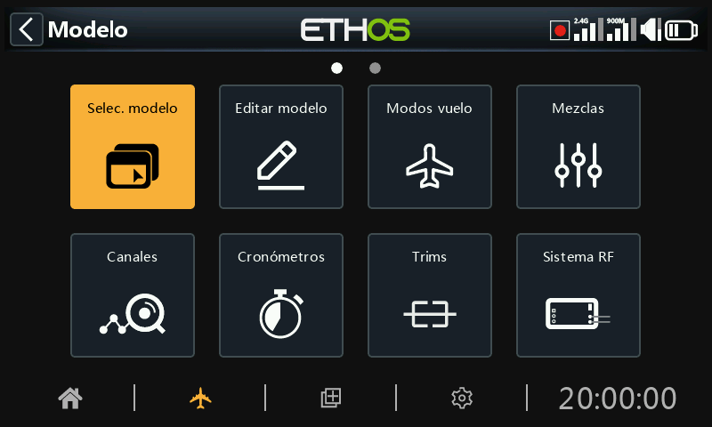

A la opción Seleccionar modelo se accede seleccionando 'Selec. modelo' en el menú Modelo. Se utiliza para seleccionar el modelo a usar, añadir un nuevo modelo, clonarlo, borrarlo o enviar y recibir el modelo a través de Bluetooth.

## Gestión de carpetas de modelos

Ethos le permite crear sus propias carpetas de modelos para categorizar y agrupar sus modelos. Los nombres típicos de las carpetas de modelos suelen ser Avión, Planeador, Heli, Quad, Warbird, Barco, Coche, Plantilla, Archivo, etc.

Hasta que haya creado y organizado sus carpetas, Ethos creará automáticamente la carpeta ‘Sin categoría’. Esto ocurre cuando se actualiza a la versión Ethos 1.1.0 alpha 17 o posterior, o cuando se copia un modelo de la red o de un amigo en la carpeta \\Models de la tarjeta SD o eMMC.  Ethos borrará automáticamente la carpeta ‘Sin categoría’ cuando ya no sea necesaria.

Para crear una primera carpeta, toque el símbolo ‘+’ a la derecha de la etiqueta ‘Sin categorizar’, o mantenga presionada la tecla Page Up/Down.

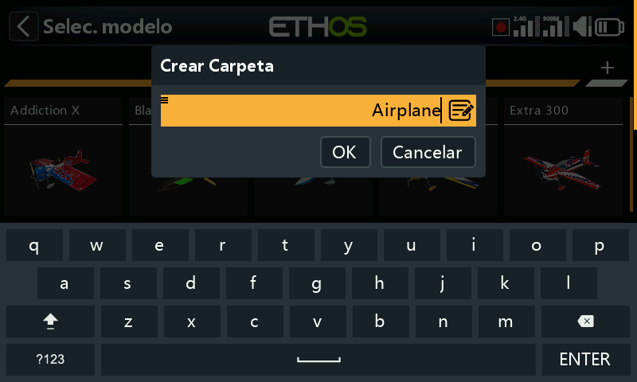

Introduzca el nombre en el cuadro de diálogo "Crear carpeta" y pulse aceptar. Los nombres de las carpetas pueden tener un máximo de 15 caracteres. Repita el proceso para el resto de categorías. Tenga en cuenta que estas carpetas aparecen como subcarpetas debajo de la carpeta \\Models en la tarjeta SD o eMMC.

Las carpetas de categorías de modelos se ordenan alfabéticamente, pero la carpeta "Sin categoría" siempre aparecerá la última de la lista.

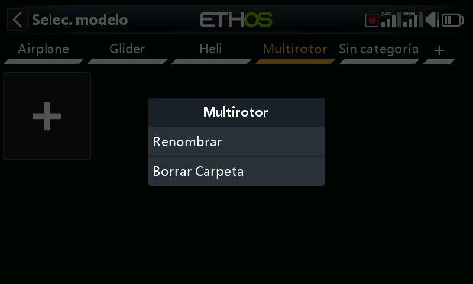

Al pulsar sobre el nombre de una carpeta, aparece un cuadro de diálogo que permite renombrarla o eliminarla. Si había modelos en la carpeta que se está borrando, Ethos los colocará automáticamente en la carpeta ‘Sin categoría’.

## Añadir un nuevo modelo

Para crear un nuevo modelo, seleccione la categoría de modelo en la que desea crear el modelo y pulse sobre el icono \[+\] para crear el nuevo modelo o recibirlo desde otra radio Ethos vía Bluetooth.

Seleccione ‘Crear Modelo’ para iniciar el asistente de creación de modelo. (Es posible que tenga que crear primero sus categorías de modelos, véase más arriba).

Elija el tipo de modelo que desea crear y siga las instrucciones.

Hay asistentes (“wizards”) para:

- Avión
- Planeador
- Helicóptero
- Multirrotor
- Otro

Los asistentes le ayudan con la configuración básica para el tipo de modelo seleccionado.

Los asistentes incluyen la opción de realizar mezclas predeterminadas cuando se usan receptores Frsky estabilizados, como pueden ser los modos de ganancia y estabilización.

### Receptores estabilizados

Los receptores estabilizados de FrSky requieren un orden de canales especificos denominado AETR. Por ese motivo, el ‘orden de los Canales’ en el menú de las palancas debe dejarse en este orden AETR por defecto y se debe activar la opción ‘Los cuatro primeros canales fijos’ para asegurar que el orden de los canales creados por el asistente estará ajustado al receptor.

Para un modelo de tipo Avión, la página siguiente es el Motor, que permite la selección del número de canales necesario para los motores (si es que hay alguno).

Para un modelo de tipo Avión, se seleccionan a continuación los canales de alerones y Flaps.

A partir de Ethos 26.1.0 el nuevo asistente de creación de modelos asignará los canales empezando desde la izquierda y alternando desde fuera a dentro, estando en línea con la documentación de los receptores de Frsky.

De esta forma, en un modelo sencillo con 2 alerones, 1 profundidad, 1 timón y 1 motor el orden de los canales será como sigue (asumiendo que el ordend e los canales por defecto es AETR y los ‘Cuatro primeros canales fijos’ se hayan seleccionado):

CH1	Alerón Izquierdo

CH2	Profundidad

CH3	Motor

CH4	Timón

CH5	Alerón derecho

### Actualizando modelos a Ethos 1.7.0

Durante la actualización a Ethos 1.7 las mezclas de los modelos existentes se convertirán para ajustarse al nuevo esquema desde la izquierda.

Hay 3 escenarios:

a) Los modelos existentes con el orden de canales por defecto para 1.6.x que contaba desde la derecha se reordenarán para ajustarse al nuevo esquema para contar desde la izquierda. Sin embargo, la colocación de los canales se mantendrá exactamente igual para que no se tenga que cambiar ningún cable en el modelo. Sólo se reorganizarán las mezclas en una nueva secuencia, pero los canales de salida originales se mantienen para que el modelo continue ooperando corresctamente. Por ejemplo, el orden de las mezclas será:

Desde

CH1 Alerón Derecho

CH2 Profundidad

CH3 Motor

CH4 Timón

CH5 Alerón Izquierdo

a

CH5 Alerón Izquierdo

CH2 Profundidad

CH3 Motor

CH4 Timón

CH1 Alerón Derecho

b) Los modelos existentes que hayan tenido sus canales intercambiados para contar desde la izquierda tendrán sus mezclas reorganizadas para asegurar que el diferencial de alerón continúe funcionando correctamente, pero las asignaciones de canales permanecen igual que antes.

c) Los modelos existentes que tengan sus canales intercambiados mediante inversión de la mezcla de alerones y el renombrado de los canales de salida, trabajarán correctamente después de la actualización, pero pueden tener algún conflicto relaccionado con ese renombrado de los canales. Para resolver este problema, se necesitará deshacer la inversión de las mezclas que se hayan hecho anteriormente:

i) Re-invertir la mezcla de Alerones con valores positivos de Peso y Diferencial.

ii) Intercambiar los canales de salida de la mezcla de alerones, usandola función ‘Intercambio de canales’ del menú de canales.

iii) También habremos de renombrar los dos canales para las funciones correctas de izquierda a derecha.

iv) **¡PRECAUCIÓN!** Después de hacer los cambios, confirme que las mezclas y los canales de salida trabajan correctamente y en el orden correcto, con las hélices desmontadas.

Para una revisión en profundidad de los tres escenarios de conversión, vaya al [Apéndice A - Conversión de modelos de Ethos desde 1.6.3 a 1.7.0](../how-to/converting-1.6-models.md)

Para un modelo de tipo Avión, a continuación elegiremos la configuración de la cola de forma tradicional en cruz, en forma de V, o sin cola (por ejemplo en un ala en delta o en un ala volante).

### Alas Delta

Se puede conseguir ajustar los elevones de un Ala en Delta, creando un nuevo avión que disponga de 2 alerones y ninguna superficie de cola, lo que resultará en que la mezcla de elevones se construya automáticamente. Los pesos de la mezcla se establecerán por defecto en el 50% para proporcionar un total del 100% si se aplican simultáneamente los alerones y el elevador.

Alternativamente, cuando se utilice un receptor estabilicado, la mezcla en delta se puede realizar por el receptor. Para esta situación, en el wizard se debe seleccionar 1 alerón y 1 elevador, ya que la mezcla de los elevones las realizará el receptor. Siga el manual del receptor estabilizado para más detalles.

Para un modelo con ala en delta que disponga de ambas superficies, alerones y elevador, permita que se termine el asistente como si el modelo tuviera cola. De esta forma se configurarán los canales necesarios de alerón y profundidad , con o sin timón de dirección, como se requiera.

Para un modelo de tipo Avión, una vez elegido una cola tradicional en T, el número de canales de profundidad y del timón podrán también ser configurados.

Después de ajustar las opciones de los canales, el paso que se muestra arriba le permitirá reasignar las funciones del modelo a canales diferentes. El asistente obedece el ‘Orden de los canales’ configurado en la sección de las palancas, excepto cuando se configure un receptor Frsky estabilizado que requiere que los canales estabilizados tengan un orden específico. Para más detalles, siga las intrucciones del manual del receptor.

En el último paso, se podrá definir el nombre del modelo y asignarle una imagen. Tenga en cuenta que los nombres de los modelos pueden tener hasta 15 caracteres.

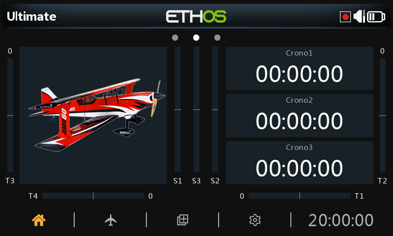

El nuevo modelo ya se ha creado.

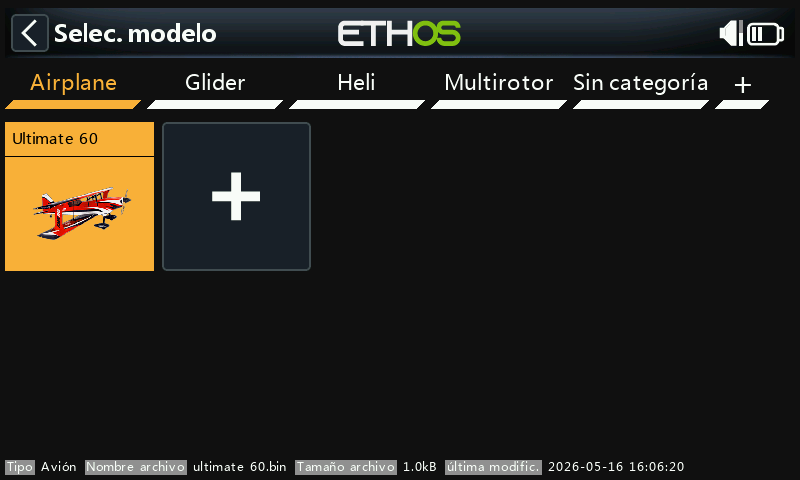

El modelo creado aparecerá en la carpeta de categorías de modelos definida por el usuario que estaba activa cuando se inició el asistente, y se ordenará alfabéticamente dentro de cada grupo.

Consulte el [Ejemplo de avión básico de la fija](../tutorials/basic-fixed-wing.md) en la sección Tutoriales de programación para ver un ejemplo completo.

## Renombrar el canal de salida del asistente

Los nuevos modelos utilizan las siguientes reglas de nomenclatura de los canales:

- Cuando la mezcla tiene solo una salida, no hay numeración ni sufijo de nombre.
    - Cuando la mezcla hace algo diferente en las salidas, entonces los canales de salida necesitan un nombre explícito (es decir, "izquierda" / "derecha" para los alerones)
    - Cuando la mezcla hace exactamente los mismos cálculos en todas las salidas, entonces el nombre tendrá solo un número como sufijo.

## Seleccionar un modelo

Pulse sobre "Seleccionar modelo" para que aparezca una lista de sus modelos.

Tenga en cuenta que, después de una actualización de Ethos, el sistema convertirá los modelos individualmente cuando sean seleccionados en la pantalla. No hay necesidad de seleccionar cada modelo porque la conversión puede hacerse posteriormente, incluso con una actualización posterior de Ethos. No hay un retraso significativo en la elección del modelo. Cuando la conversión se ha efectuado, la marca de fecha de la última modificación debajo del modelo cambiará a la fecha actual. Si no se necesita conversión del modelo, la fecha continuará siendo la de la última modificación que se hizo en el modelo.

### Selección rápida

Mantenga presionado el icono de un modelo, o mantenga presionada Enter seleccionará ese modelo inmediatamente.

## Menú de administración de modelos

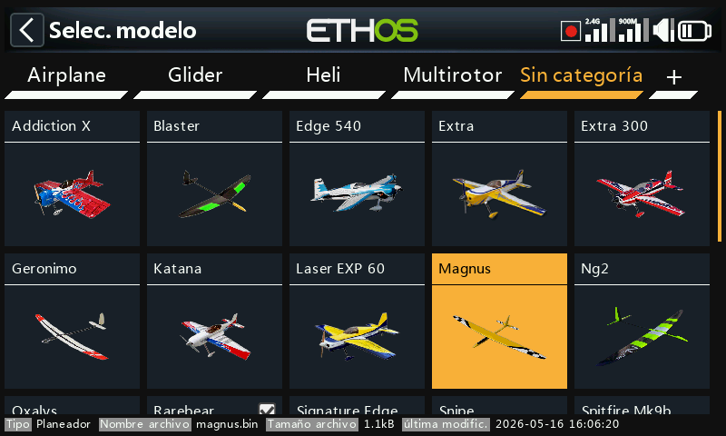

Toque en un modelo para resaltarlo y entonces toque otra vez en él para que aparezca el menú de administración del modelo.

### Seleccionar el modelo

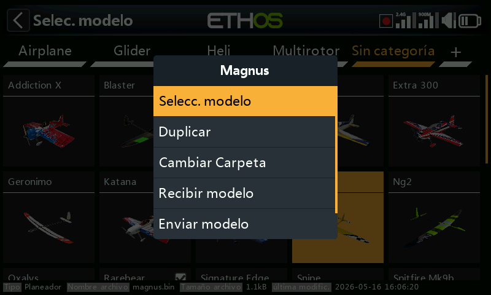

Toque en ‘Seleccionar modelo’ para que el modelo seleccionado se convierta en el modelo actual.

Alternativamente, se puede usar el método de ‘selección rápida’ descrito arriba.

### Duplicar un modelo

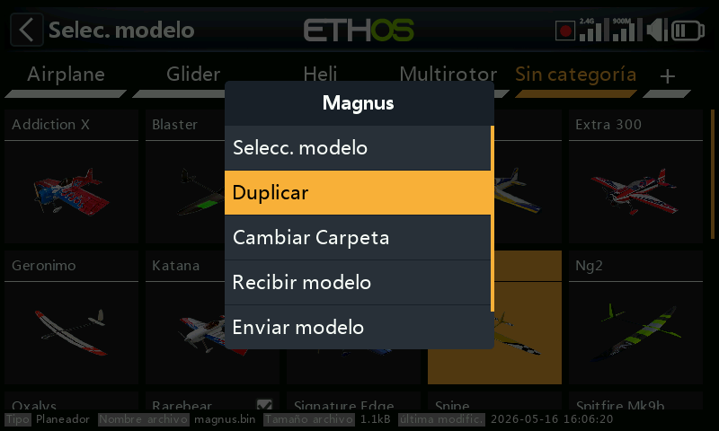

Toque en ‘Duplicar’ para hacer una copia exacta del modelo resaltado.

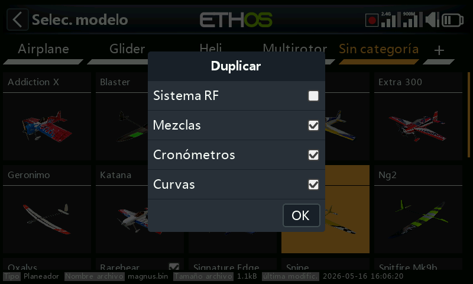

Se abrirá un cuadro de diálogo que le permitirá personalidar el duplicado.

Por defecto, el sistema RF no se duplica, con lo que el módulo RF estará apagado en el nuevo modelo pero con un número de modelo diferente. Si se selecciona la opción 'Sistema RF', la configuración RF, incluido el número de modelo, se clonará.

Las mezclas, cronómetros y curvas del modelo no se clonarán si no se seleccionan.

Toque en ‘OK’ para proceder. Un diálogo de confirmación de ‘¡Modelo duplicado con éxito!’ aparecerá cuando se acabe el proceso.

### Cambiar carpeta

Para mover un modelo a otra carpeta, toque en el icono del modelo, y seleccione ‘Cambiar Carpeta’ en el menú.

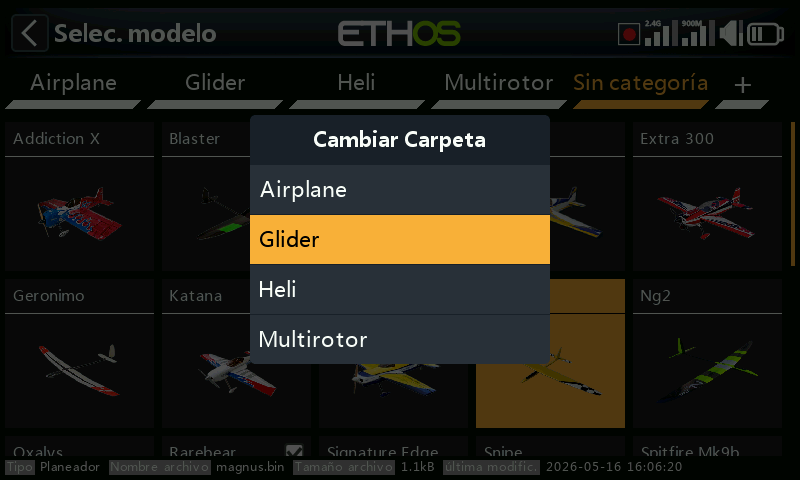

Toque en la carpeta a la que desea moverlo.

## Recibir un modelo

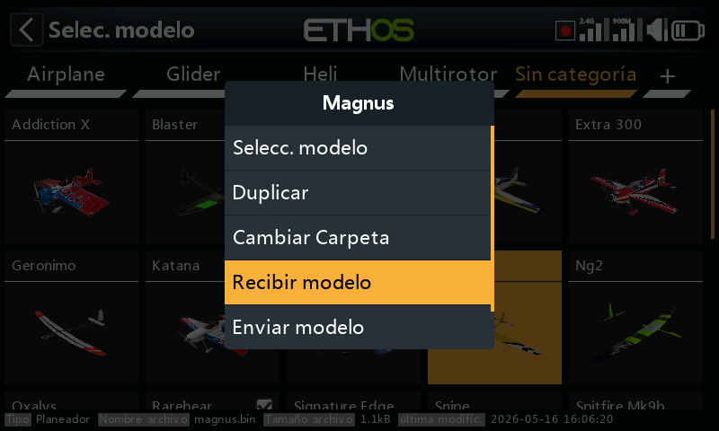

Toque en ‘Recibir modelo’ para iniciar el proceso de recibir un modelo de otra radio Ethos a través de Bluetooth. Tenga en cuenta que debe iniciarse antes ‘Recibir modelo’ que ‘Enviar modelo’ en la radio que lo envía.

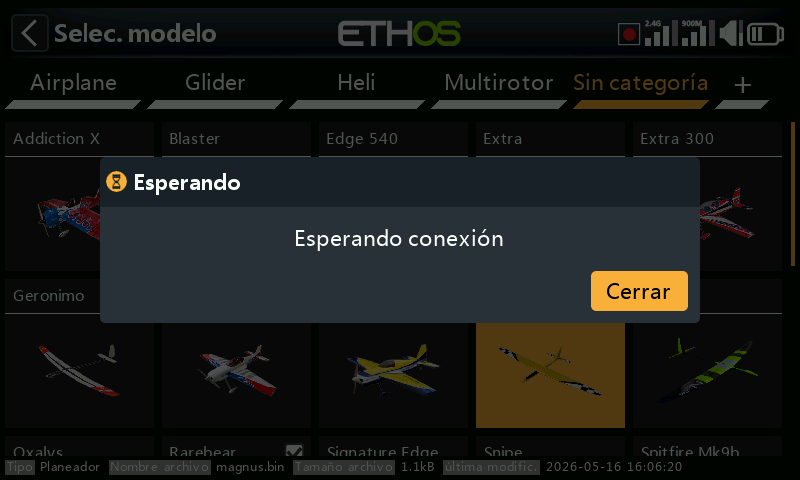

Hasta que se encuentre una conexión Bluetooth, se mostrará un cuadro de diálogo de 'Esperando conexión'.

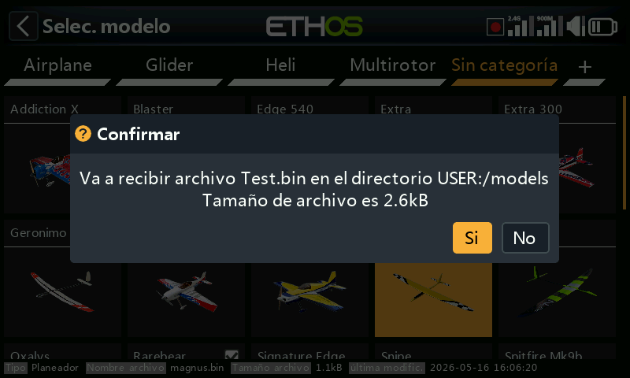

Una vez que se ha establecido una conexión, se mostrará el dialogo de confirmación 'Va a recibir archivo… en el directorio….' esperando la confirmación para continuar.

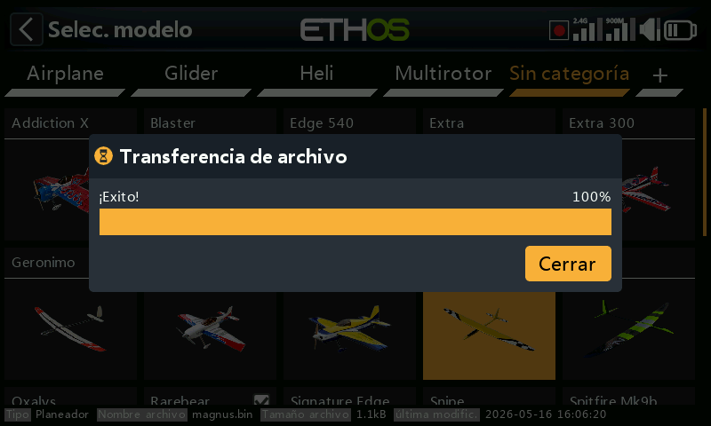

La transferencia del archivo comenzará y se mostrará una barra con el progreso del proceso, seguido de un mensaje de finalización con éxito.

### Enviar un modelo

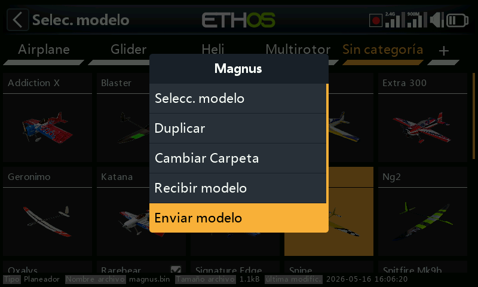

Toque en ‘Enviar modelo’ para iniciar la transferencia de un modelo a otro radio Ethos vía Bluetooth. Tenga en cuenta que ‘Recibir modelo’ debe iniciarse antes de ‘Enviar modelo’ en el radio que envía.

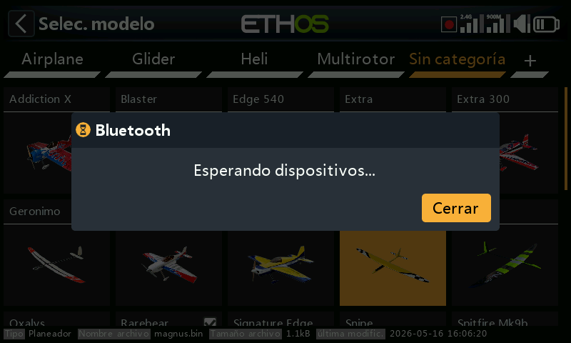

Hasta que se encuentre una conexión Bluetooth, se mostrará un cuadro de diálogo 'Esperando dispositivos'.

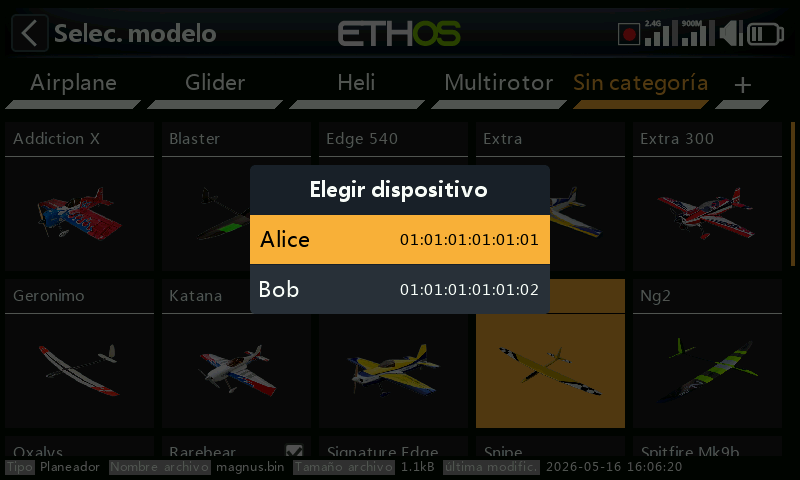

Una vez que encuentren los dispositivos, se mostrará un cuadro de diálogo para seleccionar dispositivos. Seleccione el dispositivo al que se quiere enviar el modelo.

La transferencia del archivo comienza y se muestra una barra de progreso.

Aparacerá una mensaje de éxito a la finalización del proceso.

### Borrar

Toque en ‘Borrar’ para eliminar un modelo. Esta opción no estará disponible para el modelo activo.

## Recibir un modelo desde otra radio Ethos

También puede iniciarse la recepción de un modelo directamente desde el menú 'Seleccionar modelo'. Simplemente tocando el icono \[+\] después de seleccionar la categoría de modelo en la que se desea crear el modelo.

Toque en ‘Recibir modelo’ para iniciar el proceso de recibir un modelo de otra radio Ethos a través de Bluetooth.  
  
Para más detalles, consulte la sección [Recibir modelo](#Receive model) mencionada más arriba.
