# Selección de modelo

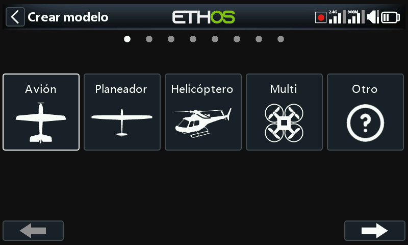

Permite crear, seleccionar, clonar y eliminar modelos, así como gestionar las
carpetas de categorías definidas por el usuario en las que se organizan.

## Gestión de las carpetas de modelos

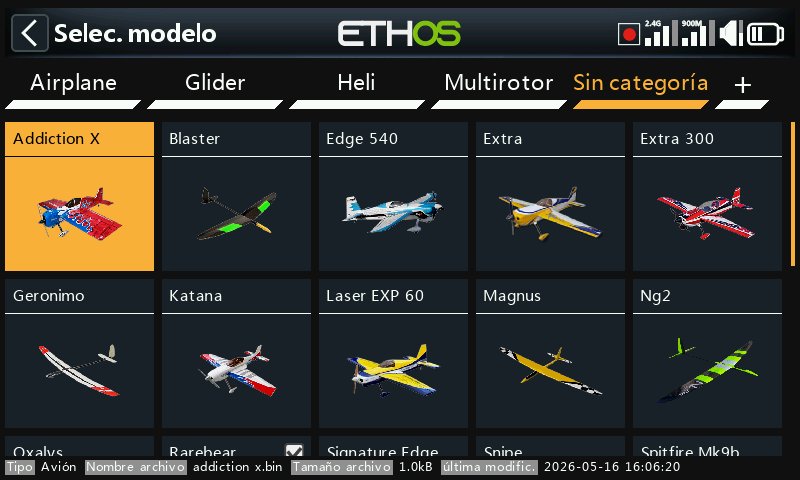

Ethos permite agrupar los modelos en carpetas propias, normalmente del tipo
Avión, Velero, Heli, Quad, Warbird, Barco, Coche, Plantilla o Archivo.
Hasta que se cree alguna, los modelos residen en una carpeta automática
**Uncategorized** (creada al actualizar a Ethos 1.1.0 alpha 17 o posterior, o
cuando se copia un archivo de modelo en `\Models` desde otra ubicación); Ethos
vuelve a eliminarla en cuanto queda vacía.

Para crear una carpeta, pulse **+** junto a "Uncategorized" (o mantenga pulsado
`PAGE` arriba/abajo), asígnele un nombre (hasta 15 caracteres) y confirme. Las
carpetas se ordenan alfabéticamente, con **Uncategorized** siempre al final, y
se corresponden directamente con subcarpetas dentro de `\Models` en la SD
card/eMMC. Al pulsar sobre el nombre de una carpeta se abren las opciones de
renombrar o eliminar; al eliminar una carpeta, los modelos que contenga vuelven
a Uncategorized.

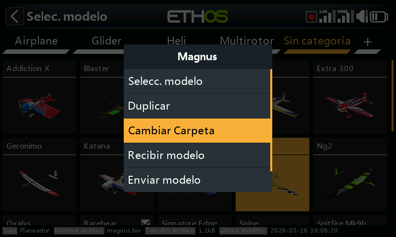

Para mover un modelo, pulse sobre su icono, seleccione **Change folder** y
después pulse sobre el destino:

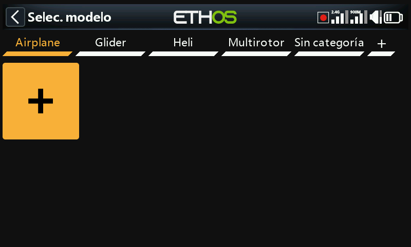

## Añadir un nuevo modelo

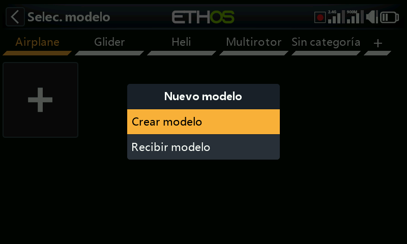

Seleccione la categoría en la que desea crear el modelo, pulse **+** y después
**Create model** para iniciar el asistente (cree antes la categoría si aún no
existe). Hay asistentes disponibles para **Airplane**, **Glider**,
**Helicopter**, **Multirotor** y **Other**; cada uno recorre la configuración
básica de ese tipo de modelo, incluidas las mezclas predefinidas opcionales
para receptores estabilizados FrSky (ganancia, modo de estabilización). Los
nombres de modelo pueden tener hasta 15 caracteres.

### Receptores estabilizados y orden de canales

Los receptores estabilizados FrSky requieren específicamente el orden de canales
**AETR**: deje [Palancas → Orden de canales](../system-setup/controls.md) en su
valor por defecto AETR con **First four channels fixed** activado, de modo que
la salida del asistente coincida con lo que espera el receptor.

El asistente asigna los canales de derecha a izquierda. Para 2 alerones +
1 elevador + 1 timón + 1 motor, el resultado es:

| Canal | Función |
|---|---|
| 1 | Alerón 1 (alerón derecho) |
| 2 | Elevador |
| 3 | Acelerador |
| 4 | Timón |
| 5 | Alerón 2 (alerón izquierdo) |

Con esta asignación, el diferencial de alerones es **positivo** en el caso
normal (más recorrido hacia arriba que hacia abajo). Los propios manuales de
receptores de FrSky documentan actualmente la convención *opuesta* (de izquierda
a derecha, es decir, canal 1 = alerón izquierdo, canal 5 = alerón derecho), en
cuyo caso el diferencial tendría que ser **negativo** para obtener el mismo
efecto físico.

!!! tip
    Se recomienda emplear la convención de Ethos de forma coherente: todas las
    funciones de estabilización siguen funcionando correctamente en cualquiera
    de los dos casos, ya que la dirección de la compensación se establece
    durante la configuración de la estabilización. Si necesita ajustarse a la
    convención del manual del receptor, lo más sencillo es crear el modelo con
    el asistente de la forma habitual y después utilizar **Swap channels** en
    [Salidas](outputs.md) para intercambiar los dos canales de alerones; así se
    mantiene positivo el signo del diferencial de la mezcla de alerones.

### Pasos del asistente

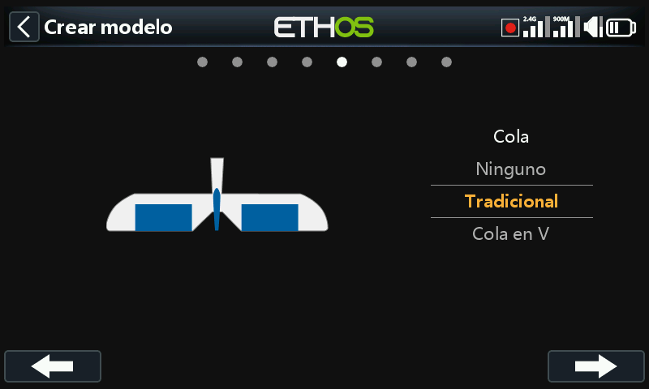
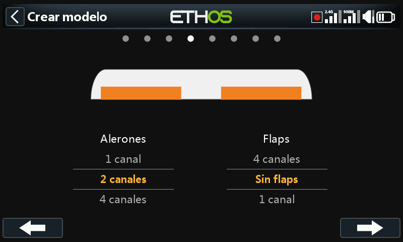
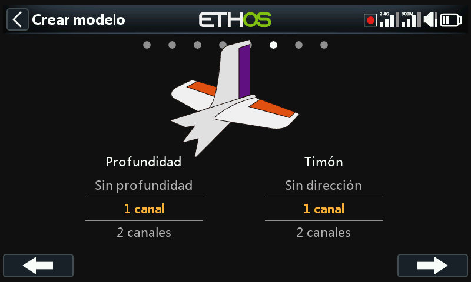
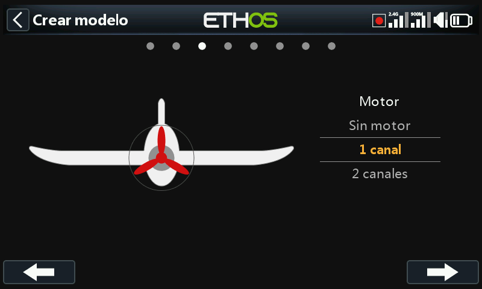
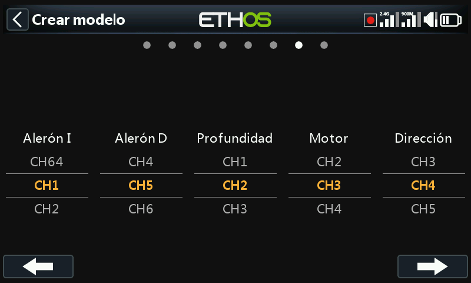
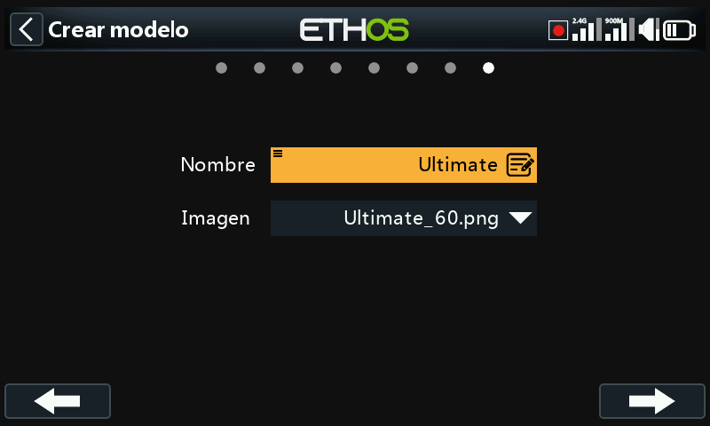
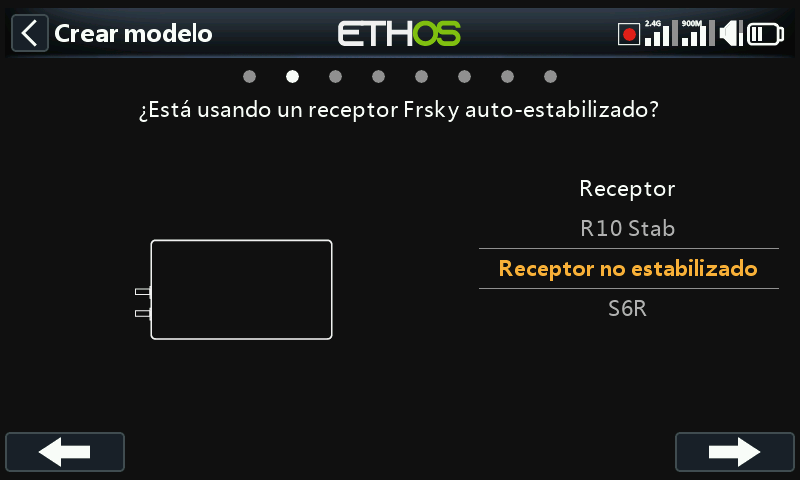

Para un **Airplane**, tras el tipo de cola y el número de superficies, el
asistente continúa con el número de canales del motor y después con el número de
canales de alerones/flaps.

La **configuración de la cola** permite elegir entre cola tradicional en cruz,
cola en V o sin cola (delta/ala volante):

- **Delta/ala volante**: al crear un modelo Airplane con 2 alerones y sin
  superficies de cola se genera automáticamente la mezcla de elevones, con pesos
  por defecto del 50 % para que la aplicación simultánea a fondo de alerón +
  elevador siga sumando el 100 %.
- **Delta con un receptor estabilizado que realiza la mezcla**: en su lugar
  seleccione 1 alerón y 1 elevador; la mezcla de elevones se realiza en el
  receptor, según indique su propio manual.
- **Delta con superficies dedicadas de alerones y elevador**: deje que el
  asistente se ejecute como si el modelo tuviera cola; configurará los canales
  de alerones y elevador necesarios (con o sin timón) y no se creará ninguna
  mezcla de elevones.

El paso de **reasignación de canales** permite modificar la asignación por
defecto del asistente, teniendo en cuenta que los receptores estabilizados
necesitan sus canales en un orden concreto (consulte las instrucciones del
propio receptor). El último paso establece el nombre del modelo y le asocia una
imagen.

El modelo terminado queda en la carpeta de categoría que estuviera activa al
iniciar el asistente, ordenado alfabéticamente dentro de ella. Consulte
[Ejemplo básico de ala fija](../tutorials/basic-fixed-wing.md) para ver un
ejemplo completo paso a paso.

## Recibir un modelo desde otra radio Ethos

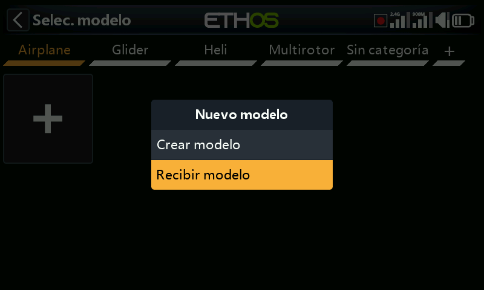

Seleccione la categoría de destino, pulse **+** y después **Receive model**: la
radio queda a la espera y muestra su dirección Bluetooth para que el emisor
pueda localizarla. En la radio que envía, pulse sobre el modelo y seleccione
**Send model**; la radio receptora pide confirmación del nombre del archivo
entrante antes de aceptarlo.

## Seleccionar un modelo

Pulse sobre **Model select** para ver la lista de modelos.

!!! note "Conversión de modelos tras una actualización de Ethos"
    Ethos convierte cada modelo individualmente la primera vez que se
    *selecciona* después de una actualización de versión, no todos a la vez al
    actualizar: no hay ningún retardo perceptible y puede hacerse en cualquier
    momento posterior, incluso con una versión de Ethos aún más reciente. La
    fecha de **Last Modification** que aparece en la parte inferior de la
    pantalla de selección se actualiza cuando se produce una conversión (o
    cuando se edita el modelo; en caso contrario, permanece igual).

**Selección rápida**: un toque prolongado o una pulsación larga de `ENT` sobre
el icono de un modelo cambia inmediatamente a dicho modelo.

**Menú de gestión de modelos**: pulse sobre un modelo para resaltarlo y pulse de
nuevo para abrir el menú:

- **Set current model**
- **Clone**: duplica el modelo. Un clon recibe automáticamente un nuevo número
  de receptor; si en su lugar le reasigna el número de receptor del original,
  funciona sin necesidad de volver a hacer el binding.
- **Change folder**
- **Send**/**Receive**: hacia o desde otra radio, como se ha descrito arriba.
- **Delete**: solo se ofrece para un modelo que no sea el actual.
