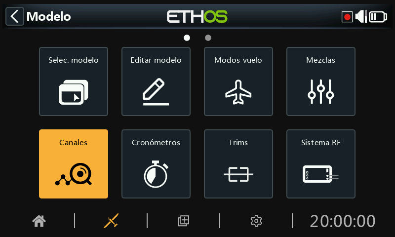
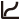
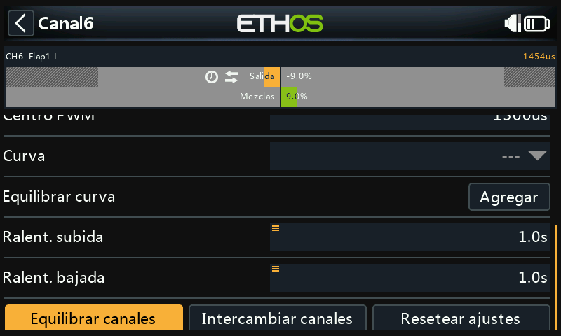
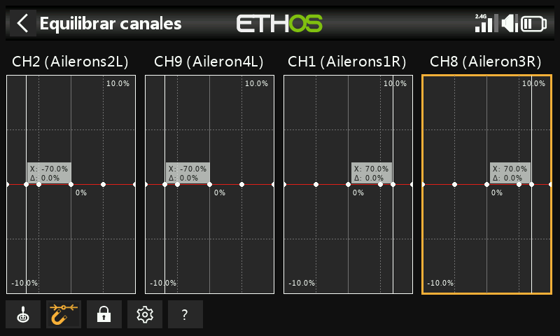

# Canales

La sección Salidas es la interfaz entre la "lógica" de configuración y el mundo real con servos, reenvíos y superficies de control, así como actuadores y transductores. En las Mezclas hemos configurado lo que queremos que hagan nuestros diferentes controles. Esta sección permite adaptar estas salidas puramente lógicas a las características mecánicas del modelo. Es donde configuramos los movimientos mínimo y máximo, la inversión del servo o canal, y ajustamos el punto central del servo o canal usando el ajuste central PPM, o añadimos un desplazamiento usando subtrim. También podemos definir una curva para corregir cualquier problema de respuesta en el mundo real. También hay una utilidad para equilibrar los canales. Los distintos canales son salidas, por ejemplo, CH1 corresponde al conector de servo #1 del receptor (con los ajustes de protocolo por defecto).

Aunque la radio está configurada para usar porcentajes como entrada, los servos y los dispositivos de salida están controlados por una señal PWM (Pulse Width Modulation) que se mide en μs (microsegundos). La relación entre esas unidades sería como sigue:

−150%	=	732 μs

−100%	=	988 μs

0%	=	1500 μs

100%	=	2012 μs

150%	=	2268 μs

Tenga en cuenta que un canal que no esté asignado a una mezcla, tendrá ajustada su salida a neutral = 0% = 1500us. Esto también sucederá con los canales cuya mezcla o mezclas estén inactivas, así que hay que tener cuidado en asegurarse de que los canales siempre tienen una mezcla activa. Si el canal del motor está en = 0% = 1500us ¡¡estará siempre a mitad de motor!!

La pantalla de Canales muestra dos gráficos de barras para cada canal. La barra inferior (verde) muestra el valor de las mezclas para el canal, mientras que la barra superior (naranja) muestra el valor real (tanto en % como en µS) de la Salida después del procesado, que es lo que se envía al receptor. En el ejemplo anterior puede ver que tanto las mezclas como los valores de salida para CH4 Throttle están al -100%.

Los ajustes Mín y Máx del canal se indican con unas secciones grises en la barra de arriba (la naranja). Para su ajuste, vea la sección de más abajo.

Los canales que no se están emitiendo señales al módulo RF se muestran con un fondo más oscuro. En el ejemplo anterior, se están transmitiendo los ocho canales, por lo que tienen un fondo gris más claro.

Los iconos         aparecerán  en la vista de canales si los valores por defecto de las salidas [Dirección](#Output direction), [Curva](#Output curve) de salida, y [Lento Arriba/Abajo](#Output slow up-down) se han cambiado o si se ha configurado un [Equilibrado de Canales](#Balance channels). Para detalles, vaya a cada uno de los respectivos ajustes más abajo.

Nota: Para un acceso rápido a esta pantalla de monitorización, una pulsación larga de la tecla \[Enter\] desde la pantalla de Mezclas y la de Modos de Vuelo le llevará directamente a los Canales.

## Configuración de los canales

Pulse sobre el canal de salida que desea editar o revisar.

### Vista previa del canal

En la parte superior de la pantalla de configuración de salidas se muestra una vista previa del canal. El valor de la mezcla se muestra en verde, mientras que el valor de salida del canal se muestra en naranja (en el tema por defecto).

Los puntos Mín y Máx del ajuste de recorrido de cada canal se indican con una sección grisácea en la barra superior (naranja).

### Nombre

El nombre puede editarse.

### Dirección

Cambiará la salida del canal, normalmente para invertir la dirección del servo.

	Cuando se active, aparecerá un icono de doble flecha en la página de salidas. Para ver un ejemplo, mire el CH6 Flaps1 L en las imagen de canales más arriba.

Tenga en cuenta que no afectará a las mezclas que regulan la salida, y tampoco cambiará los límites inferior y superior (vea más abajo)

### Min/Max

Los valores mínimo y máximo del canal son límites "duros", es decir, no se pueden sobrepasar. Deben ajustarse para evitar atascos mecánicos. Tenga en cuenta que sirven como ajustes de ganancia o "punto final", por lo que la reducción de estos límites reducirá el recorrido proporcionalmente, en lugar de recortarlo. Tenga en cuenta que los límites por defecto son de +/- 100,0%, pero pueden aumentarse aquí hasta +/- 150,0%.

Los ajustes min y max del canal también están indicados por una sección en gris en la barra naranja superior.

#### Advertencia:

Cuando se utiliza un sistema redundante con SBUS, no es posible realizar movimientos del servo superiores a +/- 125%.

Nota: Los parámetros de los puntos Mín/Máx tienen recorridos de (-150% hasta 0%) y de (0% hasta +150%) respectivamente. Cuando se usan VARs como Fuente para ajustar los parámetros Mín/Máx, a menos que el Var tenga un recorrido idéntico será necesario ajustar el recorrido del Var para que se ignoren, al objeto de evitar valores inesperados debidos al proceso de conversión de los recorridos. Por favor, vaya a la sección  [Var options](../getting-started/user-interface-and-navigation.md) para detalles de esta opción.

Si se utiliza más del 125% en el receptor principal que controla las salidas PWM, y este receptor entra en modo a prueba de fallos, las posiciones del servo recibidas desde un receptor redundante a través de SBUS se limitan al 125%.

En concreto, si una salida del receptor principal supera el 125%, en el momento de conmutar al receptor redundante, la salida cambiará al 125%.

#### Ayuda a los ajustes

Cuando se deban ajustar los límites de salida máximo y mínimo, el extremo que se está modificando estará marcado en negrita.

Como ejemplo, si quiere ajustar el fin de recorrido Max (Endpoint) para el canal del elevador, cuando mueva ligeramente la palanca del elevador hacia la arriba, el valor máximo se mostrará en negrita para indicar que es el final al que se está ajustando. Si mueve la palanca hacia abajo, se marcará en negrita el valor mínimo.

### Centro/Subtrim

Se utiliza para introducir un desplazamiento en la salida, típicamente utilizado para centrar el brazo de un servo. Tenga en cuenta que los puntos finales de recorrido no se verán afectados.

#### Advertencia:

No caiga en la tentación de utilizar Subtrim para añadir grandes desplazamientos – sólo se conseguirá una gran cantidad de diferencial en la respuesta del servo. La forma correcta es añadir una mezcla con desplazamiento.

### Centro del PWM

Es similar al subtrim, con la diferencia de que un ajuste hecho aquí cambiará la totalidad de la banda de movimiento del servo (incluyendo los límites físicos). Este ajuste no será visible en el monitor del canal porque se hace efectivamente en el servo. La ventaja de usar el centrado PPM para centrar mecánicamente la superficie de control es que separa la función de centrado de la función de compensado.

### Curva

Permite seleccionar una curva Expo o personalizada para condicionar la salida. La ventana emergente permite seleccionar una curva existente o añadir una nueva curva.  Después de configurar la curva, se añade un botón Editar para que pueda editar la curva fácilmente.

	Cuando se activa, aparece un icono de curva en el gráfico del canal, vea un ejemplo en el canal 5 Timon en la imagen de Canales de más arriba.

### Lento arriba/abajo

La respuesta de la salida puede ralentizarse con respecto a los cambios de la entrada. ‘Lento’ podría utilizarse, por ejemplo, para ralentizar el movimiento del tren de aterrizaje cuando se acciona mediante un servo proporcional normal. El valor es el tiempo en segundos que tardará la salida en cubrir el rango de 0 a +100%.

 Cuando se haya configurado, aparecerá un icono de un reloj en la pantalla del canal. Observe los canales CH6 Flap1 L y CH7 Flap2 R en el grafico de canales más arriba.

### Retraso

Tenga en cuenta que en los interruptores lógicos hay también disponible una función de retardo.

### Intercambio de canales

Esta característica permite intercambiar dos canales de salida.

Las opciones para el intercambio se abrirán con el primer canal ya relleno. Seleccione el canal a intercambiar, y haga click en OK. Tenga en cuenta que el intercambio ocurre inmediatamente. Todas las mezclas, etc. existentes, se ajustarán adecuadamente.

### Restablecer ajustes

Si se restablecen los ajustes, se borrarán todos los parámetros del canal de salida cuando este canal ya no sea necesario. Un diálogo de confirmación aparece para evitar borrados accidentales.

Se usa para evitar que los ajustes no estén en sus valores por defecto si se reutiliza el canal para otra cosa.

### Equilibrar canales

Esta característica le permitirá equilibrar parejas seleccionadas o grupos hasta 4 canales para asegurarse de que se mueven al unísono. Por ejemplo, tener los flaps desequilibrados puede resultar en un alabeo no deseado, mientras que un desequilibrio en los motores de un modelo multimotor puede resultar en una guiñada indeseada.

#### Resumen

Esta funcionalidad crea automáticamente una curva equilibrada y diferencial para cada canal seleccionado. Se puede elegir el número de puntos de equilibrado. Comparando las posiciones físicas de las superficies de control (por ejemplo, los flaps) en cada punto de las curvas, se pueden ajustar fácilmente para que sean iguales. El resultado final es un ajuste perfecto del movimiento de las superficies.

#### Prerequisitos

Antes de equilibrar canales, se recomienda seguir el proceso siguiente:

1. Ajuste correctamente las direcciones de los servos de cada una de las superficies.
2. Con las mezclas en neutral, use como sea necesario el centrado PWM para ajustar correctamente los ángulos de los reenvíos de los servos.
3. Configure los límites Min/Max y el Subtrim.
4. Configure todas las otras curvas.
5. Configure Lento.
6. Proceda a ‘Equilibrar Canales’ para ecualizar y equilibrar el movimiento de las superficies de control en múltiples puntos de su recorrido.

#### Cómo se usa

#### Abra la página de Editar del canal más a la izquierda que quiere equilibrar. En este ejemplo hemos elegido el canal 6 ‘Flap1 L’. Vaya hacia abajo y toque en ‘Equilibrar canales’ para empezar.



Un menú de ‘Elegir canales’ se abre para elegir los canales que van a equilibrarse.



Seleccione los canales en el orden en que desea que aparezcan en la pantalla. En nuestro ejemplo CH6 (Flap1 L) está señalado porque hemos empezado por este canal.

En radios sin pantalla táctil, seleccione el canal/es deseado y presione ENT para seleccionarlo. Finalmente, presione la tecla \[Page\] para resaltar el botón de OK y presione ENT para confirmar la selección.

Los canales se mostrarán en el orden en que han sido seleccionados. En este ejemplo, el CH6 (Flap1 L) se seleccionó primero, y después el CH7 (Flaps2 R). La salida de la mezcla se muestra a lo largo del eje X, mientras que los valores del ajuste de equilibrado diferencial se muestran en los ejes Y.

Toque en el gráfico de uno de los canales (o mueva el selector y presione ENTER) para editar la curva de equilibrado. La tecla PAGE servirá para cambiar el canal mientras se están editando las curvas.

La entrada (mostrada como una línea blanca vertical) debe ajustarse para alinear el valor X con un punto de la curva antes de hacer el ajuste.

##### Botones del menú

 Se pueden usar la/s fuente/s configuradas en las mezclas de los canales, u opcionalmente cualquier otro input analógico. Si selecciona esta opción de 'Auto analog input', la primera palanca, slider o pot que mueva se usará como la fuente para el eje X, no sólo en el gráfico sino también en el modelo.

Cuando se habilita, el punto más cercano del eje X de la curva se seleccionará automáticamente para su ajuste con el selector rotatorio, como en el ejemplo de arriba.

La entrada debe ajustarse para alinear el valor de X con un punto de la curva, antes de que el ajuste se realice.

 Tocando en el icono del candado, o presionando la tecla ENTER mientras se está en la edición del gráfico, se cambiará el modo blocaje entre ON y OFF. Cuando está activado, todas las entradas estarán bloqueadas para que pueda soltarse la palanca, permitiéndole observar las superficies de control mientras ajusta la curva.

 Abre el diálogo de configuración para el canal elegido. Es posible modificar el número de puntos de todas las curvas, o tan sólo algunos, y elegir si se suavizan o no.

**?** Este botón servirá para ver los archivos de ayuda. También se puede hacer presionando la tecla MDL.

En el ejemplo de arriba, la opción del Imán se ha de-seleccionado. EL punto de la curva a ajustar está remarcado, y puede moverse usando las teclas 'SYS'  y 'DISP'.

De nuevo, la entrada debe ajustarse para alinear el cursor (valor X) con un punto de la curva antes de que se haga el ajuste.

#### Opción Multicanal

Se pueden equilibrar simultáneamente hasta 4 canales. De nuevo, los canales deben seleccionarse en el orden que se quiera mostrar, normalmente contando desde la izquierda y desde fuera a dentro. El ejemplo de arriba muestra la asignación de canales para un receptor TD SR12.

#### Revisar, editar o eliminar la curva de equilibrado

Una vez que un canal ha sido equilibrado, su curva puede ser revisada, editada o borrada desde la página de configuración del canal.

	Tenga en cuenta que el icono de equilibrado se muestra en el gráfico del canal (barra naranja). En el ejemplo de arriba también aparece el icono de cambio de dirección, indicando que la salida se ha invertido, que también puede verse en el propio gráfico ya que la dirección de salida (barra naranja) está en sentido contrario a la mezcla (barra verde).
