# Salidas

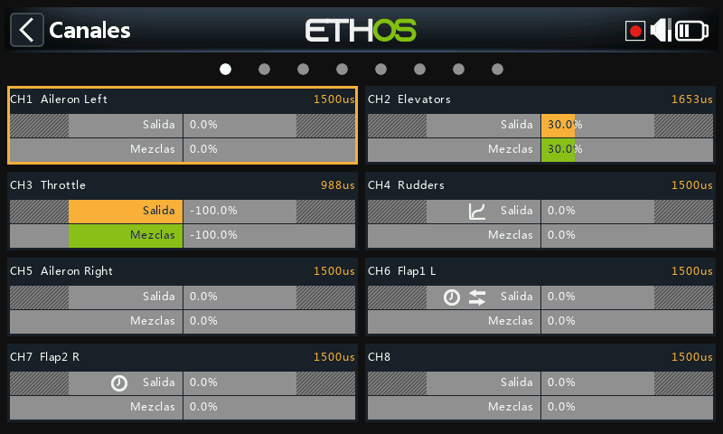

Las Salidas son la frontera entre la "lógica" pura de las [Mezclas](mixes.md) y
el mundo real: servos, reenvíos, superficies de control, actuadores y
transductores. Es donde los fines de recorrido, la inversión, el centrado y las
curvas de corrección se adaptan a las características mecánicas del modelo. Cada
canal de salida corresponde a una salida de servo del receptor (CH1 → conector
de servo #1, con los ajustes de protocolo por defecto).

Ethos trabaja en porcentajes, pero los servos están controlados en última
instancia por una señal PWM cuyo ancho de pulso se mide en microsegundos:

| % | µs |
|---|---|
| −150% | 732 |
| −100% | 988 |
| 0% | 1500 |
| 100% | 2012 |
| 150% | 2268 |

!!! warning
    Un canal **sin ninguna mezcla activa** tendrá su salida ajustada a neutral
    (0% / 1500µs); esto incluye los canales cuya mezcla o mezclas estén
    inactivas en ese momento. Hay que tener cuidado en asegurarse de que todo
    canal que se utilice realmente tenga siempre una mezcla activa que lo
    respalde. En el canal del acelerador en concreto, el neutral significa
    **medio motor**.

La pantalla de Salidas muestra dos barras por canal: la barra inferior (verde)
muestra el valor de las mezclas para ese canal, mientras que la barra superior
(naranja) muestra el valor real de la Salida después del procesado, que es lo
que se envía al receptor (tanto en % como en µs). Los límites Mín/Máx se indican
con unas secciones grises en la barra naranja. Los canales que no se están
emitiendo al módulo RF se muestran con un fondo más oscuro. En un canal
aparecerán pequeños iconos cuando sus ajustes de Dirección, Curva, Lento o
Equilibrado se hayan cambiado respecto a los valores por defecto, de modo que se
pueden identificar de un vistazo los canales que no están por defecto.

!!! tip
    Una pulsación larga de `ENT` desde la pantalla de Mezclas o desde las
    pantallas de Modos de Vuelo le llevará directamente aquí.

## Edición de un canal {: #editing-a-channel }

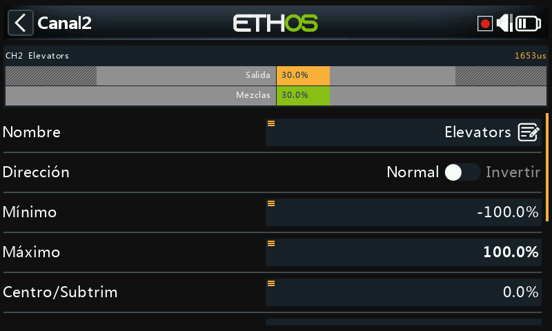
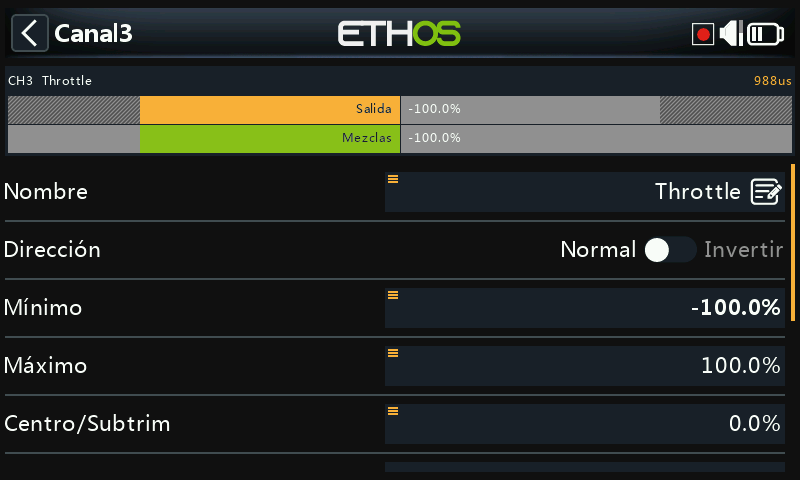

Pulse sobre un canal para abrirlo. En la parte superior se muestra una vista
previa con el valor de la mezcla (en verde) frente al valor de salida del canal
(en naranja), con unos pequeños marcadores blancos que denotan los puntos
Mín/Máx del recorrido.

- **Nombre**: puede editarse.
- **Dirección**: invierte la salida del canal, normalmente para invertir el
  sentido de giro del servo. Aparece como un icono de doble flecha en el canal.
  **No** afecta a las mezclas que regulan la salida y **tampoco** intercambia
  los límites Mín/Máx.
- **Mín/Máx**: son límites "duros", es decir, no se pueden sobrepasar; deben
  ajustarse para evitar atascos mecánicos. Sirven como ajustes de ganancia o
  "punto final", por lo que reducirlos reduce el recorrido proporcionalmente en
  lugar de recortarlo. Los límites por defecto son de ±100%, pero pueden
  aumentarse hasta ±150%. Durante el ajuste, el extremo hacia el que se está
  moviendo estará marcado en negrita (por ejemplo, mueva ligeramente la palanca
  del elevador hacia arriba y el valor Máx se mostrará en negrita, para indicar
  que es el extremo que se está ajustando).

  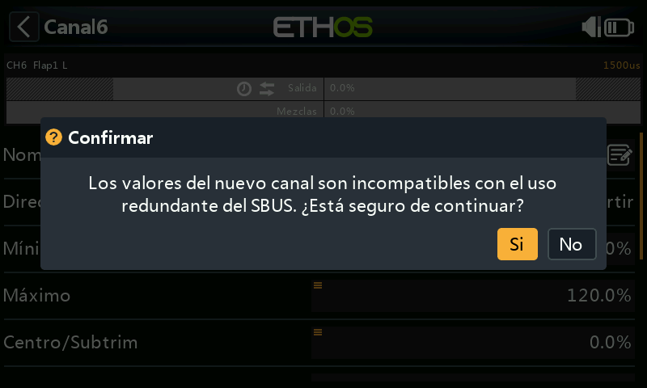

  !!! warning "Redundancia SBUS"
      Cuando se utiliza un sistema redundante con SBUS, no es posible realizar
      movimientos del servo superiores a aproximadamente ±125%. Los propios
      campos Mín/Máx tienen recorridos asimétricos (−150–0% y 0–150%): si se
      accionan desde una [Var](variables.md), a menos que la Var tenga un
      recorrido idéntico será necesario activar **Ignorar recorrido** (vea las
      [opciones de
      fuente](../getting-started/user-interface-and-navigation.md#choosing-a-source)),
      o la conversión automática de los recorridos producirá valores
      inesperados. Si la salida del receptor principal supera el 125% y este
      entra en modo a prueba de fallos, el receptor redundante que toma el
      control a través de SBUS la limitará al 125%.

- **Centro/Subtrim**: introduce un offset en la salida, típicamente para centrar
  el brazo de un servo; los puntos finales de recorrido no se ven afectados.

  !!! warning
      No caiga en la tentación de utilizar el subtrim para añadir grandes
      compensaciones: sólo se conseguirá una gran cantidad de diferencial en la
      respuesta del servo. La forma correcta es añadir una **mezcla con
      offset** para todo lo que vaya más allá de un centrado fino.

- **Centro del PWM**: es similar al subtrim, con la diferencia de que un ajuste
  hecho aquí desplaza *toda* la banda de movimiento del servo, incluyendo los
  límites físicos, ya que se hace efectivamente en el propio servo y no será
  visible en el monitor del canal. Así se separa la función de centrado
  mecánico de la función de compensado.
- **Curva**: permite seleccionar una curva Expo o personalizada (existente o
  nueva, con un botón **Editar** una vez configurada) para corregir la respuesta
  en el mundo real; por ejemplo, para asegurar que los flaps izquierdo y derecho
  se mueven con precisión. Aparece como un icono de curva en el canal.
- **Lento arriba/abajo**: ralentiza la respuesta de la salida con respecto a los
  cambios de la entrada; el valor es el tiempo en segundos que tardará la salida
  en cubrir el rango de 0 a 100%. Podría utilizarse, por ejemplo, para
  ralentizar el movimiento del tren de aterrizaje cuando se acciona mediante un
  servo proporcional normal. Aparece como un icono de reloj en el canal. (Un
  **retardo**, distinto de "lento", está disponible en los [interruptores
  lógicos](logical-switches.md)).

## Intercambio de canales {: #swap-channels }

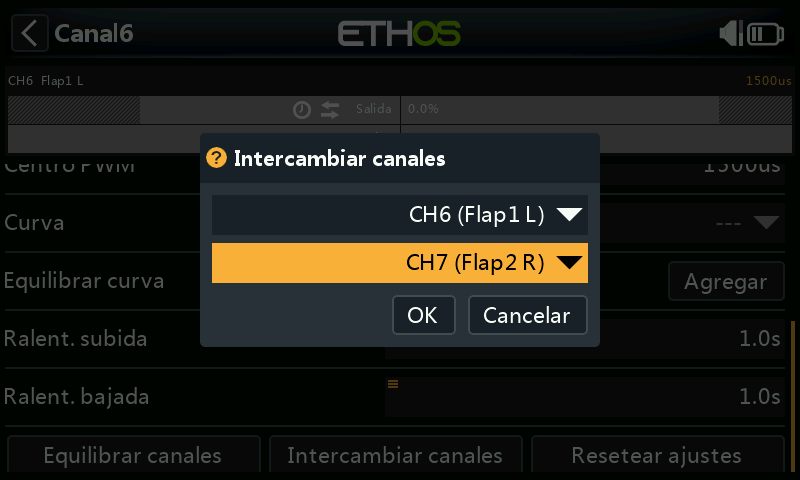
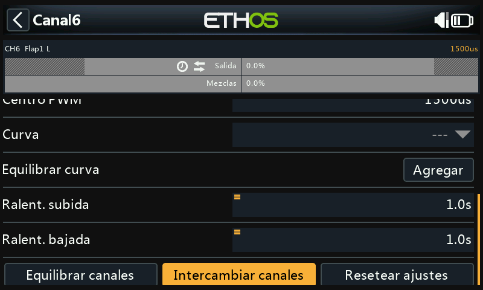

Permite intercambiar dos canales de salida. El diálogo se abrirá con el canal
actual ya relleno; seleccione el otro canal y confirme. Tenga en cuenta que el
intercambio ocurre inmediatamente y que todas las mezclas que hagan referencia a
cualquiera de los dos canales se ajustarán adecuadamente.

## Restablecer ajustes

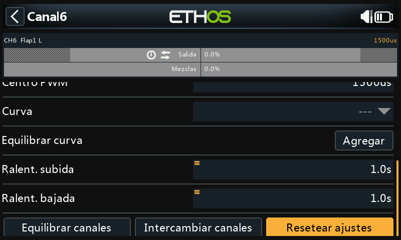

Borra todos los parámetros del canal devolviéndolos a sus valores por defecto,
lo que resulta útil antes de reutilizar un canal para otra cosa. Un diálogo de
confirmación aparece para evitar borrados accidentales.

## Equilibrar canales {: #balance-channels }

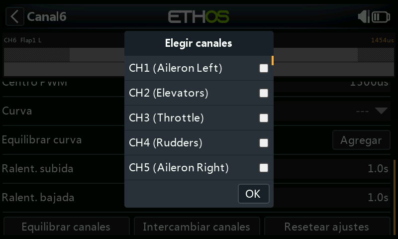
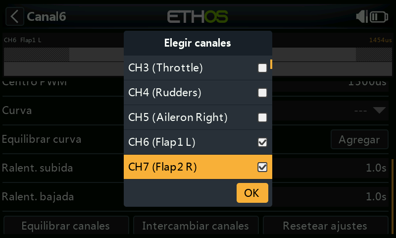

Permite equilibrar una pareja (o hasta 4) de canales para asegurarse de que se
mueven al unísono. Por ejemplo, tener los flaps desequilibrados puede resultar
en un alabeo no deseado, mientras que un desequilibrio en los motores de un
modelo multimotor puede resultar en una guiñada indeseada. Ethos creará
automáticamente una curva de equilibrado diferencial para cada canal
seleccionado; comparando las posiciones físicas de las superficies de control en
cada punto de las curvas, se pueden ajustar fácilmente para que sean iguales, y
el resultado final es un ajuste perfecto del movimiento de las superficies.

**Antes de equilibrar**, siga este orden:

1. Ajuste correctamente las direcciones de los servos de cada superficie.
2. Con las mezclas en neutral, use si es necesario el **Centro del PWM** para
   ajustar correctamente los ángulos de los reenvíos de los servos.
3. Configure los límites Mín/Máx y el Subtrim.
4. Configure todas las otras curvas.
5. Configure Lento.
6. *Entonces* proceda a equilibrar y ecualizar el movimiento a lo largo de todo
   el recorrido.

**Cómo se usa**: elija los canales a equilibrar y el orden en que desea que
aparezcan en la pantalla:

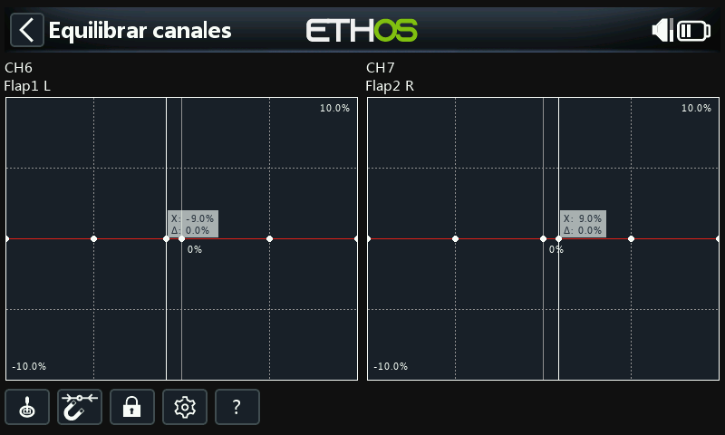

La salida de la mezcla se muestra a lo largo del eje X, mientras que los valores
del ajuste de equilibrado diferencial se muestran en el eje Y. Toque en el
gráfico de uno de los canales (o selecciónelo y pulse `ENT`) para editar su
curva de equilibrado; la tecla `PAGE` sirve para cambiar de canal mientras se
están editando las curvas:

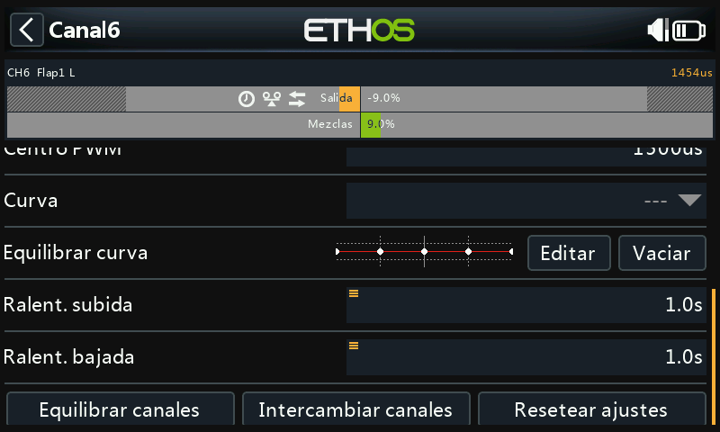

Botones del menú:

- **Fuente**: normalmente se usan la o las fuentes configuradas en las mezclas
  de los canales, u opcionalmente cualquier otro input analógico; con la opción
  **Auto analog input**, la primera palanca, slider o pot que mueva se usará
  como fuente para el eje X, no sólo en el gráfico sino también en el modelo.
- **Imán**: el punto más cercano del eje X de la curva se seleccionará
  automáticamente para su ajuste con el selector rotatorio:

  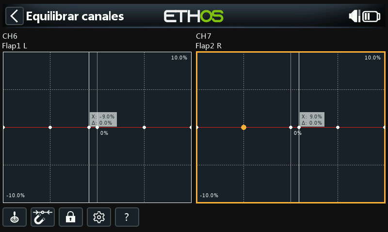
  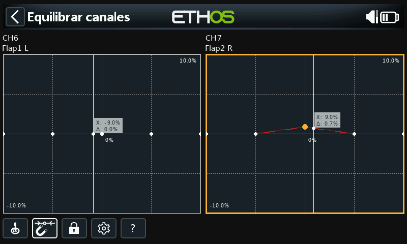

  La entrada debe ajustarse para alinear el valor de X con un punto de la curva
  antes de que el ajuste se realice.
- **Bloqueo**: tocando en el icono del candado, o presionando `ENT` mientras se
  está en la edición del gráfico, se conmuta el modo bloqueo; cuando está
  activado, todas las entradas quedan bloqueadas para que pueda soltar la
  palanca y observar las superficies de control mientras ajusta la curva.
- **Configuración**: permite cambiar el número de puntos por canal (todos o
  individualmente) y si cada curva se suaviza.
- **Ayuda** (`?`, también la tecla `MDL`): abre la ayuda integrada.

**Multicanal**: se pueden equilibrar hasta 4 canales conjuntamente:

Una vez configurada, una curva de equilibrado se puede revisar, editar o borrar
desde la propia página de configuración del canal; un icono de equilibrado la
identifica en el gráfico del canal (junto con un icono de Dirección, si este
tampoco está en su valor por defecto).
