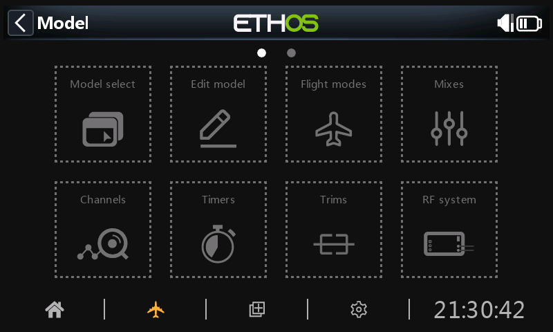
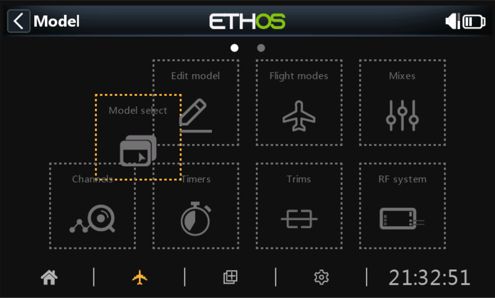

# Reorganizando el menú del modelo

Los elementos del menú del modelo se pueden reorganizar para adaptarse a tus preferencias. Mantener pulsado activará la opción. Los iconos del menú del modelo se mostrarán con líneas punteadas para indicar que la opción de reorganización está activa.

Nota: Esta característica no está disponible en radios que no dispongan de pantalla táctil.

Los elementos del menú del modelo ahora se pueden arrastrar para adaptarlos. Toque fuera de los íconos o presione RTN para finalizar la edición.
