# Sistema RF

Esta sección se utiliza para configurar los módulos RF internos y/o externos. Incluyendo el ID de Registro de Propietario.

## Desactivar el módulo de RF

Los módulos internos y externos de RF se pueden desactivar manteniendo pulsada la tecla PAGE mientras se enciende la radio. Recibirá un aviso de el módulo está apagado permanentemente. Sin embargo, el Estado de los módulos de RF seguirá activo. Si se reinicia la radio, se recuperará el estado normal.

## ID de registro del propietario

El ID de registro de propietario es un ID de 8 caracteres que contiene un código aleatorio único, que puede cambiarse si se desea. Este ID se convierte en el ID de Registro al registrar un receptor (ver más abajo). Introduzca el mismo código en el campo ID de propietario de sus otros transmisores con los que desee utilizar la función Smart Share. Esto debe hacerse antes de crear el modelo en el que desea utilizarla.

### Nota sobre compatibilidad con OpenTX y EdgeTX

La ‘Owner registration ID’ es compatible con EdgeTX pero solo parcialmente compatible con OpenTX. Debe tener 8 caracteres que pueden ser una mezcla de mayúsculas, minúsculas y números, pero no se pueden incluir caracteres especiales.

## Módulo interno  TD-ISRM (X18 y X20/S/HD)

Para el módulo interno de radiofrecuencia TD ISRM Pro, vaya a la sección [Modulo interno TD-ISRM Pro](rf-system.md).

### Resumen

El módulo de RF interno de las radios X18 y X20/S/HD tiene un nuevo diseño que proporciona emisiones de RF en tándem de 2,4 GHz y 900 MHz. Puede funcionar en 3 modos: ACCESS, ACCST D16 o TD MODE.

**¡****At****e****n****c****i****ó****n**! A lo largo de este manual y en los menús de las radios cuando se menciona el término genérico ‘900M’ significa que se usa la banda VHF. Las frecuencias de operación autorizadas en esta banda son 915Mhz para FCC o 868Mhz para LBT como sea aplicable para operación de la radio en el país del usuario.

### Estado

El módulo interno de RF puede estar encendido o apagado.

### Tipo

Modos de transmisión del módulo interno de RF. Las radios X20/X20S operan en las bandas de 2.4GHz y/o de 900MHz. Los modos ACCESS y TD (Tandem) pueden operar simultánea o individualmente en las dos bandas de 2.4GHz y/o de 900MHz, mientras que el modo ACCST D16 opera solamente en la banda de 2.4GHz. El modo de transmisión debe corresponderse con el que tiene el receptor elegido, o no seremos capaces de emparejarlo. Después de cambiar el modo de operación, deberemos comprobar con mucho cuidado la operación de nuestro modelo (especialmente el Failsafe) y verificar que todos y cada uno de los canales del receptor funcionan como debe ser.

#### Modo ACCESS

En el modo ACCESS las emisiones de RF de 2.4G y 900M trabajan en tándem con un conjunto de controles ACCESS. Puede haber tres receptores 2.4G registrados y vinculados, tres receptores 900M registrados y vinculados, o una combinación de tres receptores de 2.4G y 900M.

En el modo ACCESS con una combinación de receptores 2.4G y 900M la telemetría para los enlaces de radiofrecuencia de ambas bandas 2,4G y 900M están activos al mismo tiempo. Los sensores se identifican en telemetría como 2.4G o 900M. Tenga en cuenta que la banda 2.4G admite 24 canales, mientras que la banda 900M admite sólo 16 canales.

Existe una nueva función en la fuente del receptor de telemetría de ETHOS denominada RX. RX proporciona el número de receptor que tiene el receptor activo que envía telemetría. RX está disponible en telemetría como cualquier otro sensor para visualizar en tiempo real los interruptores lógicos, funciones especiales y registro de datos.

Vaya al modo ACCESS en la sección más abajo.

#### Modo ACCST D16

En ACCST D16, el módulo de RF realiza solamente emisiones en la banda de 2,4G.

Para más informacioón, vaya a la sección del modo [ACCST D16](rf-system.md) más abajo.

#### Modo TD

En el modo TD, el módulo RF se configura en modo de largo alcance y baja latencia que utiliza simultáneamente los enlaces RF de 2,4G y 900M en tándem para trabajar con los nuevos receptores Tándem. Los receptores Tandem admiten 24 canales en ambas bandas.

Para más información, vaya a la sección [TD Modo](rf-system.md) más abajo.

### Opciones de usar firmware FLEX

A la hora de elegir la versión de firmware, la mayoría de usuarios utiliza cualquiera de estos firmwares:

(a) Versión LBT (Listen Before Talk) en la UE, en el que la banda 900M usa el modo de frecuencia 868Mhz, o

(b) Versión FCC en el resto del mundo, en el que la banda 900M usa el modo de frecuencia 915Mhz.

Sin embargo, la versión Flex ofrece la posibilidad de cambiar dinámicamente entre ambas en el uso de los modos ACCESS, ACCST D16, o TD.

Los cambios en las pantallas de configuración se muestran en las imágenes de arriba. En el tipo de modulación, ahora aparecen dos columnas. La primera selecciona el protocolo Frsky a usar (ACCESS, ACCST D16, or TD mode).

En la segunda columna se seleccionan los modos FLEX915M o FLEX 868M.

Cuando selecciona FLEX915M, la banda de 2.4G cambia a la modulación FCC. Cuando se selecciona FLEX868M, la banda de 2.4G cambia a la modulación LBT europea.

Las antenas deberían cambiarse para ajustarse a la frecuencia seleccionada.

Ambas versiones permiten diferentes selecciones de potencia de transmisión.

**Nota para usuarios europeos**: El uso de potencias de 200mW y 500mW está permitido en la banda de 868 MHz. Y en las últimas actualizaciones de TD y RF, estos niveles de potencia trabajan también con telemetría. Para cumplimiento de la normativa, si selecciona 25mW, los datos de telemetría se transmitirán vía 868MHz, pero si selecciona 200mW o 500mW la telemetría se enviará por la banda 2.4G.

Notas:

a) En modo ACCESS puede tener cualquier combinación de receptores de 900M y/o 2.4G receivers, hasta un máximo de 3.

b) La opción ACCST D16 sólo funciona en la banda 2.4G.

c) En modo TD, se pueden tener hasta 3 receptores TD.

### Tipo: ACCESS

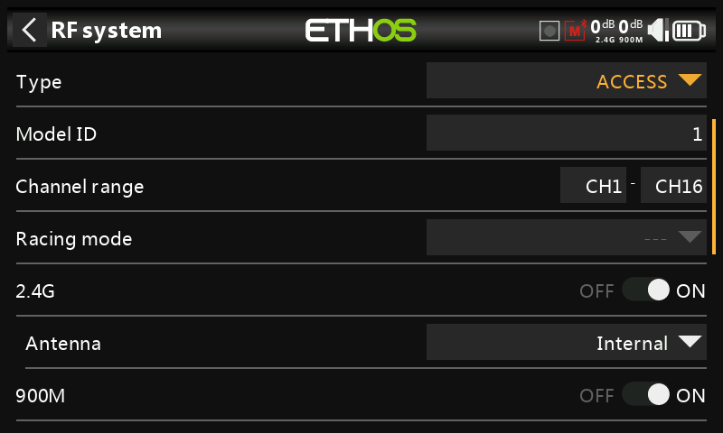

ACCESS cambia la manera en la que los receptores se emparejan y conectan con el transmisor. El proceso, se realiza en dos fases. En la primera, se realiza el registro del receptor en la radio o radios en los que se van a usar. Este registro solo se necesita realizar una vez entre el receptor y el transmisor. Una vez registrado, un receptor puede emparejarse y re-vincularse inalámbricamente con cada una de las emisoras con las que se haya registrado, sin necesidad de pulsar el botón de emparejamiento en el receptor.

Una vez seleccionado el modo ACCESS, se deben ajustar los siguientes parámetros

#### ID del Modelo

Cuando se crea un nuevo modelo, el Sistema le asigna automáticamente una ID de modelo. Esta ID de modelo debe ser un número único, ya que la función Smart Match se asegurará de que sólo los receptores con el ID de modelo correcto se puedan emparejar, de forma que sólo responderán al número con el que se unieron. Este número se envía al receptor en el momento de establecer el enlace. Este enlace del receptor sigue siendo tan importante como lo era antes de usarse ACCESS.

La ID del modelo se puede cambiar manualmente desde 00 a 63, con el valor por defecto establecido en 1.

Tenga en Cuenta que la ID del modelo se cambia cuando se clona un modelo.

#### Rango de canales:

ACCESS es capaz de manejar hasta 24 canales. Normalmente se elegirá entre Ch1-8, Ch1-16, o Ch1-24 como número de canales a los que se desea transmitir. Tenga en cuenta que Ch1-16 es la cantidad establecida por defecto. La cantidad de canales que se emiten para un receptor se configuran en las opciones disponibles en cada receptor.

El número de canales elegido en el transmisor afecta al ritmo de actualización de la información que se transmite. Ocho canales se actualizan cada 7ms. Si se usan más de 8 canales, el ritmo de actualización será:

| Gama de canales | Tasa de actualización | Notas |
| --- | --- | --- |
| 1-24 | 21ms | Ch1-8, luego Ch9-16, después Ch17-24, enviados en rotación |
| 1-16 | 14ms | Ch1-8, luego Ch9-16, enviados alternativamente |
| 1-8 | 7ms | Ch1-8 |
| Modo Carrera | 4ms | Sólo servos digitales |

#### Modo carrera (Racing mode)

El modo Carrera ofrece una muy baja latencia de 4ms con determinados receptores del tipo RS. Tanto el módulo de transmisión como los receptores usados deben tener el último firmware (v2.1.7 o superior).

Si el intervalo de canales se ajusta Ch1-8, sería posible asignar una fuente (por ejemplo, un interruptor) para poder cambiar al modo carrera. Una vez que se empareja el receptor RS y se habilita el modo carrera, el receptor debe ser apagado y encendido de nuevo para que este modo surta efecto.

#### 2.4G

Activa o desactiva el módulo RF de 2.4G.

**Antena:** Seleccione Antena Interna o Externa (en el conector ANT1). Aunque la etapa de RF tiene protección incorporada, es una buena práctica asegurarse de que se ha instalado una antena externa antes de seleccionar la opción de antena Externa. Tenga en cuenta que la selección de antena se realiza por modelo, por lo que cada vez que se cambia de modelo, ETHOS establece el modo de antena para el modelo en cuestión.

#### 900M

Activa o desactiva el módulo RF 900M.

##### **Antena:** Seleccione Antena Interna o Externa (en el conector ANT2). Aunque la etapa de RF tiene protección incorporada, es una buena práctica asegurarse de que se ha instalado una antena externa antes de seleccionar la antena Externa. Tenga en cuenta que la selección de antena se realiza por modelo, por lo que cada vez que se realiza un cambio de selección de modelo, ETHOS establece el modo de antena para el modelo en cuestión.

##### **Potencia:**

FCC: Seleccione la potencia de RF deseada entre 10, 25, 100, 200, 500mW,  10mW~1W (Auto-adaptativo).

LBT: Seleccione la potencia de RF deseada entre 25mW (telemetría vía 868MHz), 200mW o 500mW (telemetría vía 2.4GHz).

En el modo ACCESS las emisiones de RF de 2.4G y 900M trabajan en tándem con un conjunto de controles ACCESS. Puede haber hasta tres receptores registrados y vinculados, que pueden ser todos 2.4G, todos de 900M, o una combinación de 2.4G y 900M para ese total máximo de tres receptores.

#### Primera fase: Registro de receptores

#### Registro

1. Si su receptor todavía no se ha registrado, inicie el proceso de registro seleccionando \[Registrar\]. Si ya está registrado, vaya directamente a la sección de emparejamiento.

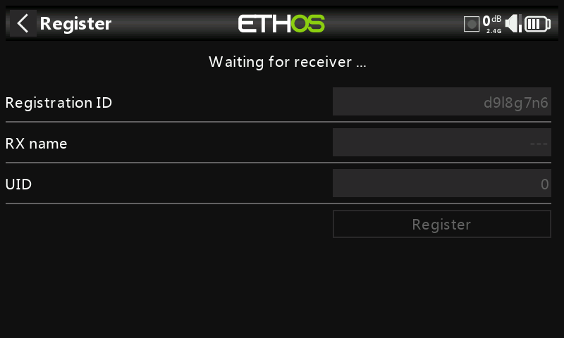

Aparecerá un cuadro de mensaje con el texto ‘Esperando al receptor’ (‘Waiting for receiver...’ y se repetirá una alerta de voz ‘Registrando’ ("Register").

2. Mientras mantiene pulsado el botón de enlace del receptor, enciéndalo y espere a que se activen los LED rojo y verde.

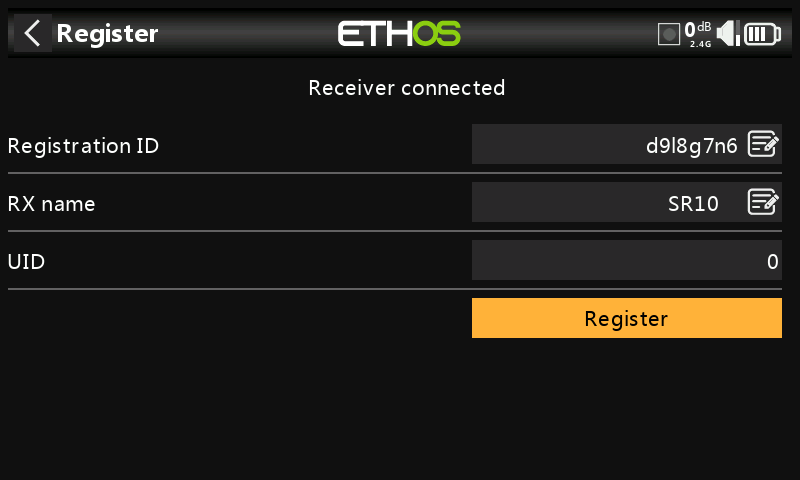

El mensaje "Esperando..." cambia a "Receptor conectado", y el campo con el Nombre del receptor se rellenará automáticamente.

- 3. En esta fase se pueden configurar el ID Reg. y el UID:

- **ID de registro**: El ID de registro es a nivel de propietario o del transmisor. Debe ser un código único para su radio y los transmisores que vaya a utilizar con Smart Share. Su valor predeterminado es el de la configuración de ID de registro de propietario descrita anteriormente al principio de esta sección, pero puede editarse aquí. Si dos radios tienen el mismo ID, puede mover los receptores (con el mismo número de receptor para un modelo determinado) entre ellos, simplemente utilizando el proceso de emparejamiento con la radio y el receptor encendidas.

- **Nombre RX**: Se rellena automáticamente, pero el nombre puede cambiarse si se desea. Esto puede ser útil si está utilizando más de un receptor y necesita recordar, por ejemplo, que RX4R1 es para Ch1-8 o RX4R2 es para Ch9-16 o RX4R3 es para Ch17-24 cuando vuelva a enlazar más tarde. Aquí se puede introducir un nombre para cada receptor.

- **El UID** se utiliza para distinguir entre varios receptores usados simultáneamente en un mismo modelo. Puede dejarse por defecto en 0 para un solo receptor. Cuando se va a utilizar más de un receptor en el mismo modelo, el UID debe cambiarse, normalmente 0 para Ch1-8, 1 para Ch9-16, y 2 para Ch17-24. Tenga en cuenta que este UID no puede ser leído de nuevo desde el receptor, por lo que es una buena idea etiquetar el receptor.

- 4. Pulse \[Registrar\] para completar. Aparecerá un cuadro de diálogo con el texto "Registro correcto". Pulse \[Aceptar\] para continuar.

5. Apague el receptor. En este punto, el receptor está registrado, pero aún debe vincularse al transmisor que se va a utilizar. Ahora está listo para la vinculación.

#### Segunda fase: Vinculación y opciones de módulos

#### Emparejamiento

La vinculación de receptores permite que un receptor registrado se vincule a uno de los transmisores con los que se ha registrado en la primera fase y entonces responderá a ese transmisor hasta que se vuelva a vincular a otro transmisor. Asegúrese de realizar una comprobación de alcance antes de volar el modelo.

Advertencia - Muy importante

No realice la operación de emparejamiento con un motor eléctrico conectado o un motor en marcha de combustión interna.

1. Apague el receptor.

2, Confirme que se encuentra en el modo ACCESS.

3. Receptor 1 \[Vincular\]: Inicie el proceso de vinculación seleccionando \[RX1\], y seleccione \[Vincular\] en la lista desplegable.

Cada pocos segundos una alerta de voz anunciará "Vincular" para confirmar que se encuentra en modo de vinculación. Aparecerá el mensaje "Esperando receptor...".

4. Encienda el receptor sin tocar el botón F/S. Aparecerá el mensaje "Seleccionar dispositivo" y el nombre del receptor que acaba de encender.

5. Desplácese hasta el nombre del receptor y selecciónelo.

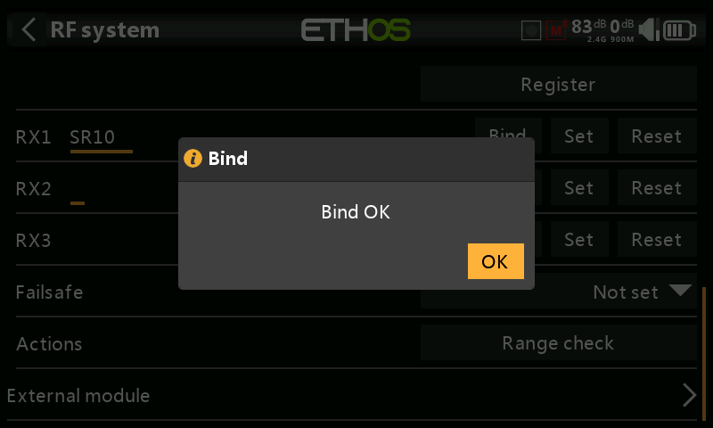

Aparecerá un mensaje indicando que la vinculación se ha realizado correctamente.

Aparecerá un mensaje indicando que la vinculación se ha realizado correctamente.

6. Apague el transmisor y el receptor.

7. Encienda el transmisor y a continuación el receptor. Si el LED verde del receptor está encendido y el LED rojo apagado, el receptor está enlazado con el transmisor. No será necesario repetir la vinculación del módulo receptor/transmisor, a menos que se sustituya uno de los dos.

El receptor ya está listo para usarse. El receptor sólo será controlado (sin verse afectado por otros transmisores) por el transmisor al que esté vinculado.

Repita la operación para los receptores 2 y 3, si procede.

Consulte también la sección Telemetría para obtener información sobre [RSSI](#RSSI and VFR discussion).

#### Opciones del receptor

Con el receptor encendido, pulse sobre \[RX1\], 2 o 3, y para que aparezcan las Opciones de receptor y otras operaciones con el mismo:

Pulse sobre Opciones:

*T**elemetría:* La telemetría se puede desactivar para este receptor.

*Telemetr**ía* *reducida para potencia de* *25mW*: Casilla para limitar la potencia de telemetría a 25mW (normalmente 100mW), posiblemente necesaria si por ejemplo los servos experimentan interferencias de RF enviada cerca de ellos.

*Alta velocidad PWM*: La velocidad de actualización de los servos está completamente determinada por el receptor.  Esta casilla permite una velocidad de actualización PWM de 7ms (vs 18ms estándar). Asegúrese de que sus servos pueden manejar esta velocidad de actualización.

Consulte la sección [Channel Range (Access) section](rf-system.md) para obtener información detallada sobre la frecuencia de actualización ajustada en el transmisor.

*Puerto*: Permite seleccionar el SmartPort en el receptor para utilizar S.Port, F.Port o el protocolo FBUS (F.Port2). El protocolo F.Port fue desarrollado con el equipo Betaflight para integrar las señales SBUS y S.Port separadas. FBUS (F.Port2) también permite que un dispositivo Host se comunique con varios dispositivos esclavos en la misma línea. Para más información sobre el protocolo de puertos, consulta la explicación del protocolo en la web oficial de FrSky.

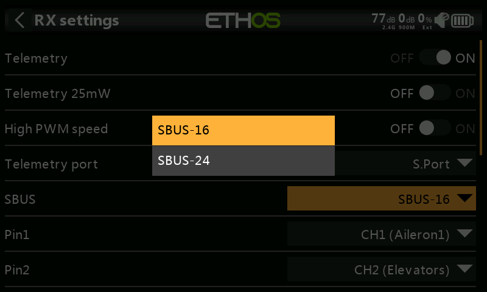

*SBUS:* Permite seleccionar el modo de canal SBUS-16 o SBUS-24. Tenga en cuenta que todos los dispositivos SBUS conectados tienen que soportar el modo SBUS-24 para activar el nuevo protocolo. SBUS-24 es un desarrollo de FrSky del protocolo SBUS-16 de Futaba.

*Mapeado de canales*: El cuadro de diálogo Opciones del receptor también ofrece la posibilidad de Reasignar canales a los pines del receptor.

La función Compartir proporciona la capacidad de mover el receptor a otra radio ACCESS que tenga un ID de Registro de Propietario diferente. Cuando se toca la opción Compartir, el LED verde del receptor se apaga.

En la radio de destino B, vaya a la sección Sistema RF y Receptor(es) y seleccione Vincular. Tenga en cuenta que el proceso Compartir omite el paso Registro en la radio B, ya que el ID de registro del propietario se transfiere desde la radio A. Aparecerá el nombre del receptor de la radio de origen. Seleccione el nombre, el receptor se vinculará y su LED se iluminará en verde.

Aparecerá el mensaje "Bind successful".

Pulse sobre OK. La radio B controla ahora el receptor. El receptor permanecerá vinculado a esta radio hasta que decida cambiarla.

Pulse el botón EXIT de Radio A para detener el proceso Compartir.

El receptor se puede volver a mover a la radio A re-enlazándolo a la radio A.

Nota: No es necesario utilizar 'Compartir' si todas sus radios están utilizando el mismo ID de propietario / número de registro. Sólo tiene que poner la radio que desea utilizar en modo de enlace, encender el receptor, seleccionar el receptor en la radio y se enlazará con esa radio. Puede cambiar a otra radio de la misma manera. Es mejor mantener los mismos números de modelo de receptor al copiar los modelos.

ISi cambia de opinión sobre compartir un modelo, seleccione "Restablecer vinculación" para limpiar y restaurar su vinculación. Reinicie el receptor y quedará vinculado a su emisora.

##### Restaurar valores de fábrica

Pulse en el botón de \[Factory reset\] para restablecer el receptor a los ajustes de fábrica y limpiar su UID. El receptor perderá también el registro en la X20. Tenga en cuenta que este restablecimiento de fábrica también borrará la calibración de los datos en los 6-ejes de los receptores estabilizados.

#### Opciones del receptor (con el Rx apagado)

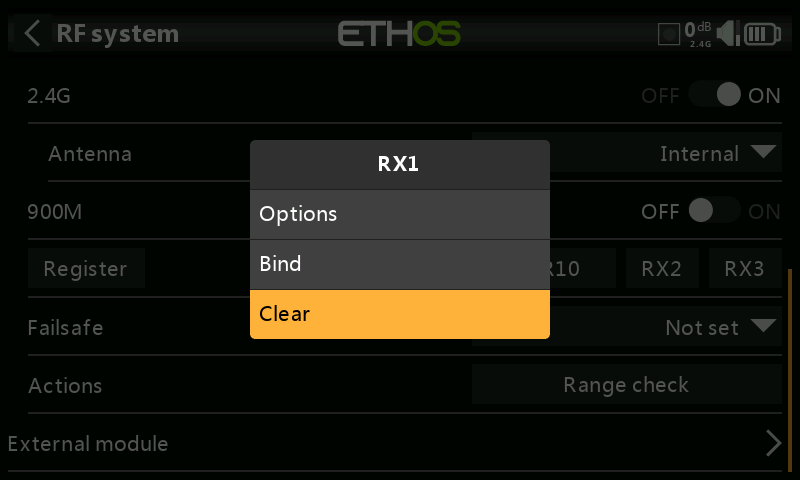

Con el receptor apagado, pulse en el RX1, 2 o 3 para ver las opciones del receptor.

Si pulsa en opciones, la radio intentará conectarse y esperará al receptor.

Si pulsa en Vinculación \[bind\] por ejemplo podría Volver a vincularse con un modelo que ha sido emparejado con otra emisora.

Si pulsa en \[Clear\] se efectuará un restablecimiento de la vinculación.

##### Añadir un receptor redundante

Se puede conectar un segundo receptor a un hueco no utilizado (por ejemplo, RX2 o RX3) para proporcionar redundancia en caso de problemas de recepción del primero. Un receptor 2.4G o 900M puede ser el respaldo para la redundancia.

La redundancia para el control que proporciona FrSky es siempre evaluada “per-frame” siendo elegida la mejor disponible. Pero si hay dos frames buenas, el receptor elegirá su mejor frame interno. Por lo tanto, el control puede alternarse como sea necesario con cada frame (activa/activa conmutada por fallo).

El ejemplo siguiente muestra un receptor 900M añadido al primero.

1. Conecte el puerto SBUS-Out del receptor redundante al puerto SBUS IN del receptor principal.

2. Active la banda de 900M en el módulo interno de RF.

2a. Configure las opciones de potencia de la antena.

**Antena**: Seleccione la antena interna o externa (en este caso, conector ANT2). Aunque la etapa de RF dispone de protección interna incorporada, es una buena práctica asegurarse de instalar una antena externa antes de seleccionar la opción de antena externa. Tenga en cuenta que la selección de antena depende de cada modelo, por lo que cada vez que se cambia de modelo, Ethos ajustará el modo de antena que se ha designado para ese modelo.

**Potencia**:

FCC: Seleccione la potencia deseada de RF de entre 10, 25, 100, 200, 500mW, 10mW~1W (Auto-adaptativo).

LBT: Seleccione la potencia deseada de RF de entre 25mW (telemetry via 868MHz), 200mW or 500mW (telemetry via 2.4GHz).

3. Si su receptor no ha sido registrado todavía, inicie el proceso de registro seleccionando \[Registro\]. Si ya lo estuviera, vaya directamente a la sección de vinculación.

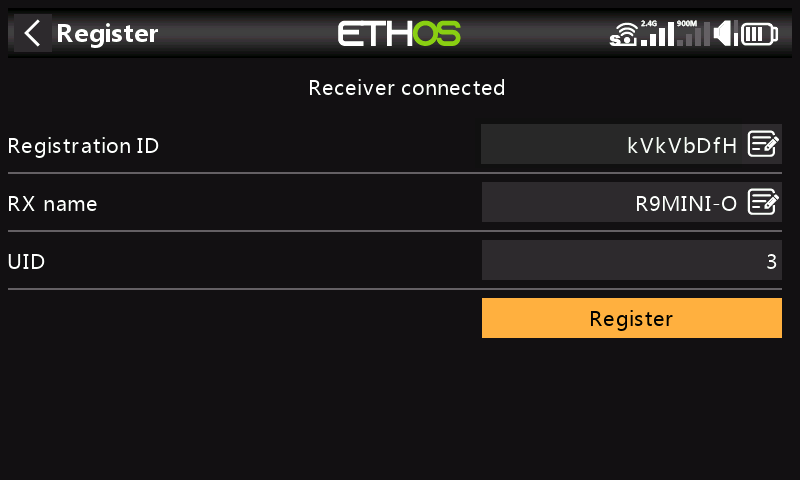

4. Registre el nuevo receptor, en el ejemplo de arriba R9MINI-O.

5. Desconecte los receptores.

6. Pulse el botón de RX2 o RX3.

Cada pocos segundos una alerta de voz anunciará ‘Bind’ para confirmar que está en modo de emparejamiento. Al mismo tiempo, aparecerá un mensaje ‘Waiting for receiver…’.

7. Encienda los receptores.

8. Seleccione el receptor R9 redundante

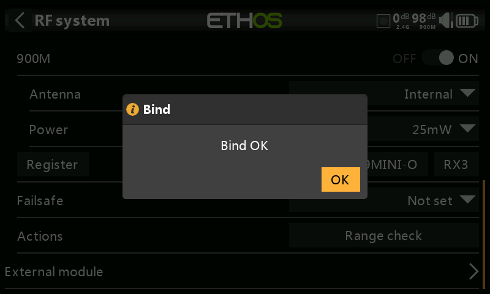

9. Pulse OK. Asegúrese de que el LED verde del receptor redundante está encendido. El receptor redundante ya está vinculado.

10. El receptor redundante aparecerá ahora en la lista.

Nota: Aunque es posible enlazar tanto el receptor principal como el redundante a la misma UID, encendiéndolos individualmente, no tendrá acceso a las Opciones Rx mientras ambos estén encendidos.

#### Modo a prueba de fallos (Failsafe)

El modo a prueba de fallos determina lo que ocurre en el receptor cuando se pierde la señal del transmisor.

Los datos del modo a prueba de fallos se envían desde el transmisor cada 10 segundos, aproximadamente. Tenga en cuenta que para los receptores TD, TW, AP y AP Plus, los datos se guardan ahora en el receptor, lo que significa que el modo a prueba de fallos estará disponible inmediatamente si el receptor se reinicia por cualquier razón. Tenga en cuenta que el Modo a prueba de fallos debe restablecerse y comprobarse después de actualizar los receptores con esta característica.

Pulse sobre el cuadro desplegable para ver las opciones a prueba de fallos:

##### Mantener (Hold)

‘Hold’ mantendrá las últimas posiciones de mando recibidas.

##### A medida

‘Custom’ permite mover los servos a posiciones predefinidas personalizadas. La posición para cada canal puede definirse por separado. Cada canal tiene las opciones de No Fijado, Mantener, Personalizado o Sin Pulsos. Si se selecciona Personalizado, se muestra el valor del canal. Si se pulsa el icono Set con una flecha, se utiliza el valor actual del canal.

Alternativamente, puede introducirse un valor fijo para ese canal pulsando sobre el valor.

##### Sin pulsos

‘No pulses’ desactiva los pulsos (para uso con controladores de vuelo que tienen GPS de retorno a casa en caso de pérdida de señal).

##### Receptor

La selección de "Receiver" en los receptores de la serie X o posteriores permite configurar el failsafe directamente en el receptor.

***Advertencia*****:** Asegúrese de probar cuidadosamente los ajustes de Failsafe que elija, especialmente los canales que controlan el giroscopio en receptores estabilizados.

#### Comprobación de alcance

Se debe realizar una comprobación de alcance en el campo cuando el modelo esté listo para volar.

La comprobación de alcance se activa seleccionando "Comprobación de alcance".

Cada pocos segundo una alerta de voz anunciará "Comprobación de alcance" para confirmar que se encuentra en el modo de comprobación de alcance. Una ventana emergente mostrará el número de receptor y los valores VFR% y RSSI para evaluar cómo se está comportando la calidad de recepción. Cuando la comprobación de alcance está activa, se reduce la potencia del transmisor, lo que a su vez reduce el alcance para la comprobación de alcance.

El nivel de la comprobación de alcance de FrSky es 0,1mW (-10dB) y no de 1mW ( 0dB)

El nivel normal es +18dB +2dB para las antenas = +20dB

En condiciones ideales, con la radio y el receptor a 1 m del suelo, sólo debería obtener una alarma crítica a unos 30 m de distancia.

Actualmente ACCESS en el modo de comprobación de alcance, proporciona datos de para un receptor a la vez en el enlace 2.4G y un receptor a la vez en el enlace 900M. Si tiene tres receptores 2.4G registrados y vinculados como Receptor 1, 2 y 3, uno de los receptores será el receptor de telemetría activo y su número será mostrado por el sensor RX como 0, 1, o 2. Ese será el receptor que está enviando los datos RSSI y VFR. Si apaga ese receptor, el siguiente receptor se convertirá en el receptor de telemetría activo en una prioridad de 0, 1, y luego 2. Cada uno de los tres receptores puede ser comprobado apagando los otros receptores.

Sensor RX 0 = Receptor 1

Sensor RX 1 = Receptor 2

Sensor RX 2 = Receptor 3

Consulte también la sección Telemetría para obtener información sobre los valores [VFR and RSSI](#RSSI and VFR discussion).

### Tipo: ACCST D16

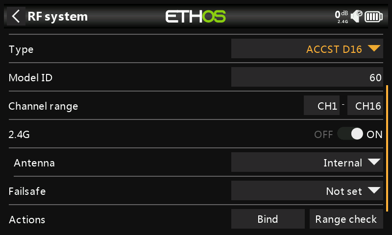

El modo ACCST D16 es para la transmisión bidireccional full dúplex en ACCST de 16 canales, también conocida como modo "X". Para uso con los receptores de la serie "X".

##### ID del Modelo

Cuando se crea un nuevo modelo, el ID de modelo se asigna automáticamente. El ID del modelo debe ser un número único, ya que la función de correspondencia de modelos garantiza que sólo se vinculará el ID del modelo correcto. Este número se envía al receptor durante la vinculación, de modo que sólo responderá al número al que está vinculado. El ID de modelo puede modificarse manualmente.

##### Número de canales

Elección de cuáles de los canales internos de la radio se transmiten realmente por el aire. En el modo D16 puede elegir entre 8 canales con envío de datos cada 9 ms, y 16 canales con envío de datos cada 18 ms.

Tenga en cuenta que las velocidades de actualización de los servos están completamente determinadas por el receptor. Para ACCST, por favor consulte el manual de su receptor para más detalles sobre la selección del modo HS (High PWM Speed) de 9ms. Asegúrese de que sus servos pueden manejar esta velocidad de actualización.

##### 2.4G

ACCST D16 funciona en 2.4G, por lo que la sección RF 2.4G está activada por defecto.

##### Antena

Seleccione Antena Interna o Externa (en el conector ANT1). Aunque la etapa de RF tiene protección incorporada, es una buena práctica asegurarse de que se ha instalado una antena externa antes de seleccionar la antena Externa. Tenga en cuenta que la selección de antena se realiza por modelo, por lo que cada vez que se cambia de modelo, ETHOS establece el modo de antena para el modelo en cuestión.

#### Emparejamiento

1. Inicie el proceso de vinculación seleccionando \[Vincular\]. Cada pocos segundos una alerta de voz anunciará "Bind" para confirmar que se encuentra en modo Bind. En el modo D16 se abrirá un menú emergente durante la vinculación para permitir la selección del modo de funcionamiento del receptor. Las opciones se refieren a las salidas PWM, y se aplican a los receptores que permiten elegir entre estas 4 opciones de abajo. Asegúrese de que el firmware del receptor y del módulo RF admiten esta opción. Si no lo hacen, es necesario realizar una vinculación normal con el botón F/S (consulte el manual del receptor).

Hay 4 modos con las combinaciones de Telemetría on/off y canal 1-8 o 9-16. Esto es útil cuando se utilizan dos receptores para redundancia o para conectar más de 8 servos utilizando dos receptores.

2. Encienda el receptor, poniéndolo en modo ‘bind’ según las instrucciones del receptor. (Generalmente se hace manteniendo presionado el botón ‘Failsafe’ del receptor durante el encendido).

3. Se encenderán los LED rojo y verde. El LED verde se apagará y el LED rojo parpadeará cuando finalice el proceso de vinculación.

4. Pulse OK en el transmisor para finalizar el proceso de vinculación y apague y encienda el receptor.

5. Si el LED verde del receptor está encendido y el LED rojo apagado, el receptor está conectado al transmisor. No será necesario repetir la vinculación del módulo receptor/transmisor, a menos que se sustituya uno de los dos. El receptor sólo será controlado (sin ser afectado por otros transmisores) por el transmisor al que está vinculado.

Advertencia - Muy importante

No realice la operación de vinculación con un motor eléctrico conectado o un motor en marcha de combustión interna.

#### Modo a prueba de fallos (Failsafe)

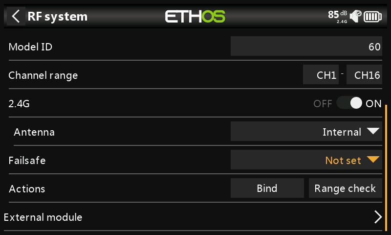

El modo a prueba de fallos determina lo que ocurre en el receptor cuando se pierde la señal del transmisor.

Los datos del Modo a prueba de fallos se envían desde el transmisor cada 10 segundos.

Pulse sobre el menú desplegable para ver las opciones a prueba de fallos:

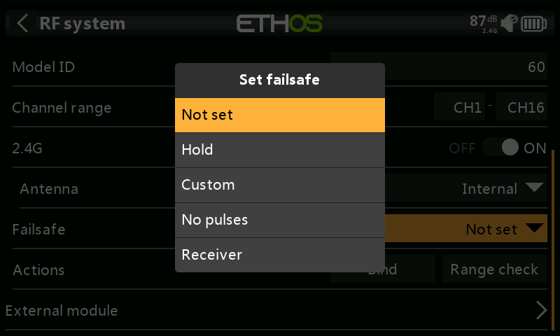

‘Hold’ mantendrá las últimas posiciones recibidas por el receptor.

Personalizado permite mover los servos a posiciones predefinidas personalizadas. La posición para cada canal puede definirse por separado. Cada canal tiene las opciones Not Set, Hold, Custom o No Pulses. Si se selecciona Personalizado, se muestra el valor del canal. Si se pulsa el icono fijado con una flecha, se utiliza el valor actual del canal. Alternativamente, se puede introducir un valor fijo para ese canal pulsando sobre el valor.

Sin Pulsos desactiva los pulsos (para uso con controladores de vuelo que tienen GPS de retorno a casa en caso de pérdida de señal).

La selección de "Receptor" en los receptores de la serie X o posteriores permite configurar el failsafe en el receptor.

***Advertencia*****:** Asegúrese de probar cuidadosamente los ajustes de Failsafe que elija, especialmente los canales que controlan el giroscopio en receptores estabilizados.

#### Comprobación de alcance

Se debe realizar una comprobación de alcance en el campo cuando el modelo esté listo para volar.

La comprobación del alcance se activa seleccionando "Prueba de Alcance".

Cada pocos segundos, una alerta de voz anunciará "Comprobación de alcance" para confirmar que se encuentra en el modo de comprobación de alcance. Una ventana emergente mostrará el número de receptor y los valores VFR% y RSSI para evaluar cómo se está comportando la calidad de la recepción. Cuando la comprobación de alcance está activa, reduce la potencia del transmisor, lo que a su vez reduce el alcance para la comprobación de alcance.

El nivel de la comprobación de alcance de FrSky es 0,1mW (-10dB) y no de 1mW ( 0dB)

El nivel normal es +18dB +2dB para las antenas = +20dB

En condiciones ideales, con la radio y el receptor a 1 m del suelo, sólo debería obtener una alarma crítica a unos 30m de distancia.

Consulte la sección Telemetría para obtener información sobre los valores [VFR y RSSI](#RSSI and VFR discussion).

### Type: TD Mode

En este modo, los receptores operan en las dos bandas simultáneamente. Hay una constante comparación de la calidad de los paquetes de datos entre ambas bandas durante las transmisiones de señal y de telemetría, de forma que se aplicará en cada momento el mejor paquete de datos de ambas banda, para asegurarse de que la transmisión y recepción de datos siempre es la mejor.

ACCESS y MODO TD cambian la forma en que los receptores se vinculan y conectan con el transmisor. El proceso se divide en dos fases. La primera fase consiste en registrar el receptor en la radio o radios con las que se va a utilizar. El registro sólo debe realizarse una vez entre cada pareja receptor/transmisor. Una vez registrado, un receptor se puede vincular y volver a vincular de forma inalámbrica con cualquiera de las radios con las que está registrado, sin necesidad de utilizar el botón de vinculación del receptor.

Una vez seleccionado el MODO TD, deben configurarse los siguientes parámetros:

#### ID del modelo

Cuando se crea un nuevo modelo, el ID de modelo se asigna automáticamente. El ID de modelo debe ser un número único, ya que la función Smart Match garantiza que sólo se vinculará el ID de modelo correcto. Este número se envía al receptor durante la vinculación, de modo que sólo responderá al número al que está vinculado. El emparejamiento de los receptores sigue siendo tan importante como lo era antes de ACCESS.

El ID de modelo puede modificarse manualmente. Tenga en cuenta también que el ID de modelo se cambia cuando se clona el modelo.

#### Número de Canales:

Dado que Tandem admite 24 canales, normalmente se elige Ch1-8, Ch1-16, Ch1-24, Ch9-16 o Ch17-24 para el receptor que se está configurando. Tenga en cuenta que Ch1-16 es el predeterminado.

#### Modo carrera

El modo carrera (Racing) ofrece una latencia muy baja de 4 ms con receptores como los TD MX.

Si el número de canales se ajusta a Ch1-8, es posible seleccionar una fuente que active el modo Carrera (por ejemplo, un interruptor). Una vez vinculado el receptor (véase más abajo) y habilitado el modo Carrera, es necesario reciclar el receptor para que el modo Carrera surta efecto.

2.4G

El módulo RF 2.4G ya está activado.

**Antena:** Seleccione Antena Interna o Externa (en el conector ANT1). Aunque la etapa de RF tiene protección incorporada, es una buena práctica asegurarse de que se ha instalado una antena externa antes de seleccionar la antena Externa. Tenga en cuenta que la selección de antena se realiza por modelo, por lo que cada vez que se cambia de modelo, ETHOS establece el modo de antena para el modelo en cuestión.

##### 900M

El módulo RF 900M ya está activado.

**Antena**: Seleccione Antena Interna o Externa (en el conector ANT2). Aunque la etapa de RF tiene protección incorporada, es una buena práctica asegurarse de que se ha instalado una antena externa antes de seleccionar la antena Externa. Tenga en cuenta que la selección de antena se realiza por modelo, por lo que cada vez que se selecciona un cambio de modelo, ETHOS establece el modo de antena para el modelo en cuestión.

**Potencia**:

FCC: Seleccione la potencia de RF deseada entre 10, 25, 100, 200, 500mW, 10mW~1W (Auto-adaptativo).

LBT: Seleccione la potencia de RF deseada entre 25mW (Telemetría vía 868Mhz), 200nW o 500mW (telemetría vía 2,4GHz).

En el modo TD MODE, las emisiones de RF de 2,4g y 900M funcionan en tándem con un conjunto de controles ACCESS. Puede haber tres receptores Tandem registrados.

#### Primera Fase: Registro de receptores

#### Registro:

1. Si su receptor todavía no se ha registrado, inicie el proceso de registro seleccionando \[Register\]. Si ya lo está, vaya a la sección de vinculación más abajo.

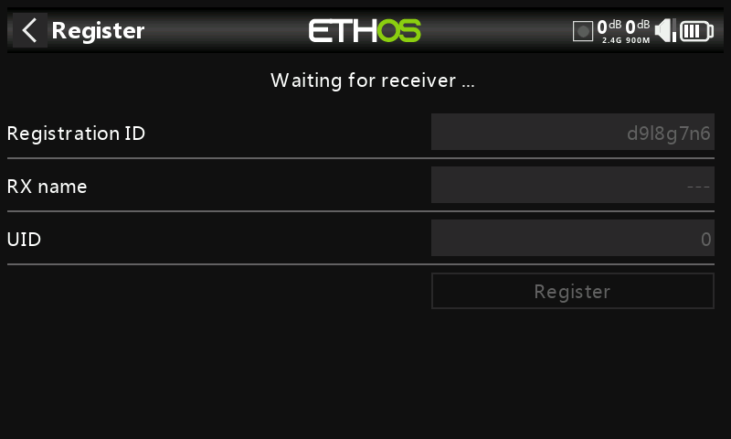

Aparecerá un cuadro de mensaje con el texto "Waiting for receiver..." y se repetirá la alerta de voz "Register".

2. Mientras mantiene pulsado el botón de enlace, encienda el receptor y espere a que se activen los LED rojo y verde.

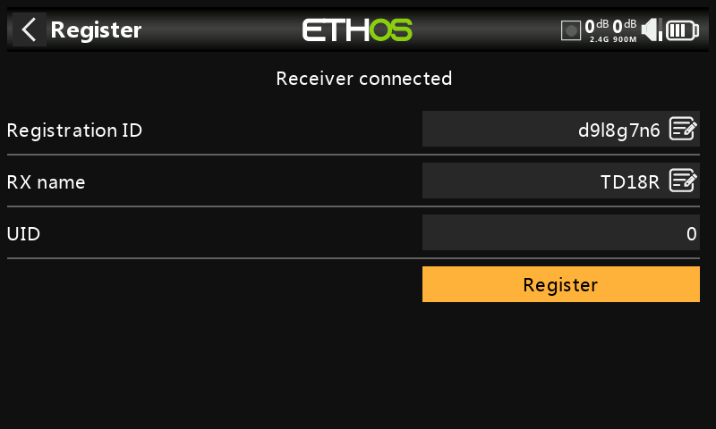

El mensaje "Esperando receptor..." cambia a "Receptor conectado", y el campo Nombre Rx se rellenará automáticamente.

3. En esta fase se pueden configurar el ID Reg. y el UID:

- ID de registro: El ID de registro es a nivel de propietario o transmisor. Debe ser un código único para su radio y los transmisores que vaya a utilizar con Smart Share. Su valor predeterminado es el de la configuración de ID de registro de propietario descrita anteriormente al principio de esta sección, pero puede editarse aquí. Si dos radios tienen el mismo ID, puede mover receptores (con el mismo número de receptor para un modelo determinado) entre ellas simplemente utilizando el proceso de vinculación con el receptor encendido.
- 
  - Nombre RX: Se rellena automáticamente, pero el nombre puede cambiarse si se desea. Esto puede ser útil si está utilizando más de un receptor y necesita recordar cuál está vinculado a qué canales.
- El UID se utiliza para distinguir entre varios receptores utilizados simultáneamente en un mismo modelo. Puede dejarse por defecto en 0 para un solo receptor. Cuando se vaya a utilizar más de un receptor en el mismo modelo, deberá cambiarse el UID. Tenga en cuenta que este UID no se puede leer de nuevo desde el receptor, por lo que es una buena idea etiquetar el receptor.

4. Pulse \[Registrar\] para completar. Aparecerá un cuadro de diálogo con el texto "Registro correcto". Pulse \[OK\] para continuar.

5. Apague el receptor. En este punto, el receptor está registrado, pero aún debe vincularse al transmisor que se va a utilizar. Ahora está listo para la vinculación.

#### Segunda fase – vinculación y opciones de módulos

La vinculación de receptores permite que un receptor registrado se vincule a uno de los transmisores con los que se ha registrado en la fase 1, y entonces responderá a ese transmisor hasta que se vuelva a vincular a otro transmisor. Asegúrese de realizar una comprobación de alcance antes de volar el modelo.

Advertencia - Muy importante

No realice la operación de vinculación con un motor eléctrico conectado o un motor en marcha de combustión interna.

1. Apague el receptor.

2. Confirme que se está en MODO TD.

3. Receptor 1 \[Bind\]:

Inicie el proceso de vinculación seleccionando RX1.

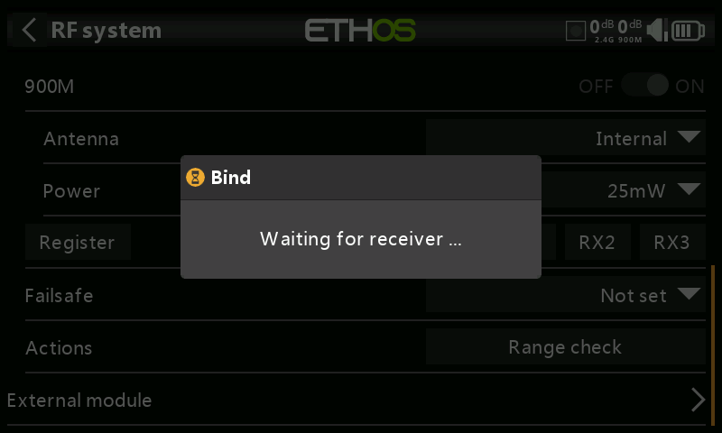

4. Una alerta de voz anunciará 'Bind' cada pocos segundos, para confirmar que estás en modo de vinculación. Aparecerá el mensaje "Esperando al receptor...".

5. Encienda el receptor sin tocar el botón de enlace F/S.

6. Aparecerá el mensaje "Seleccionar dispositivo" y el nombre del receptor que acaba de encender. Desplácese hasta el nombre del receptor y selecciónelo.

Aparecerá un mensaje indicando que la conexión se ha realizado correctamente.

7. Apague el transmisor y el receptor.

8. Encienda el transmisor y, a continuación, el receptor. Si el LED verde del receptor está encendido y el LED rojo apagado, el receptor está enlazado con el transmisor. No será necesario repetir la vinculación del módulo receptor/transmisor, a menos que se sustituya uno de los dos.

El receptor sólo será controlado (sin verse afectado por otros transmisores) por el transmisor al que esté vinculado.

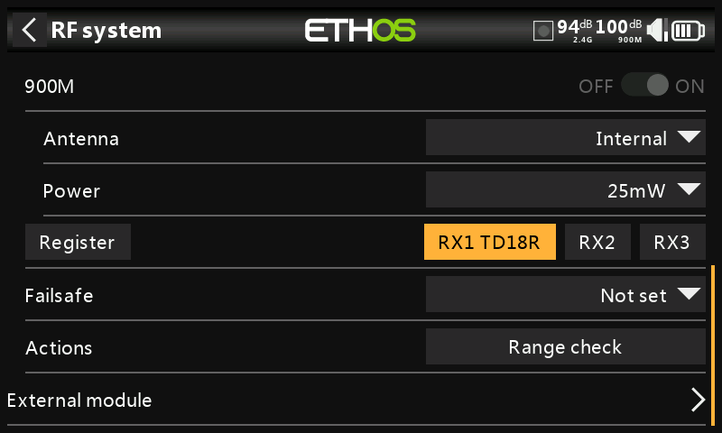

El receptor seleccionado mostrará ahora para RX1 el nombre que aparece junto a él:

Tenga en cuenta que ambas bandas 2.4G y 900M se emparejan en una sola operación. El receptor ya está listo para su uso.

Repita la operación para los receptores 2 y 3, si procede.

Consulte también la sección Telemetría para obtener información sobre [RSSI](#RSSI and VFR discussion).

#### Opciones del Receptor

Pulse el Receptor Rx1, Rx2 o Rx3, y para que aparezcan las Opciones de receptor:

Pulse sobre Opciones:

*Telemetr**ía*: La telemetría puede desactivarse para este receptor.

*Potencia* *r**educ**i**d**a de* *t**elemetr**ía* *con* *25mW*: Casilla para limitar la potencia de la telemetría a 25mW (normalmente es de 100mW), que puede necesitarse si por ejemplo los servos experimentan interferencias causadas cuandop la RF se envía muy cerca de ellos.

*Alta Velocidad PWM*: Casilla para habilitar una velocidad de actualización PWM de 7ms (vs 20ms que es la estándar). Asegúrese de que sus servos pueden manejar esta velocidad de actualización.

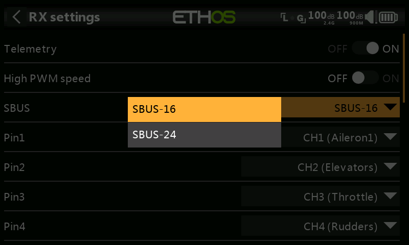

*SBUS:* Permite seleccionar el modo de canal SBUS-16 o SBUS-24. Tenga en cuenta que todos los dispositivos SBUS conectados tienen que soportar el modo SBUS-24 para activar el nuevo protocolo. SBUS-24 es un desarrollo de FrSky del protocolo SBUS-16 de Futaba.

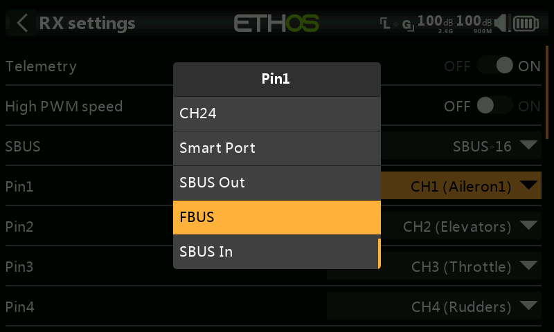

*Pin1 a Pin(nn)*: El cuadro de diálogo Opciones del receptor también ofrece la posibilidad de Reasignar canales a cada uno de los pines del receptor. Además, cada puerto de salida puede reasignarse a los protocolos Smart Port, SBUS-Out o FBUS (antes conocido como F.Port2). Finalmente, el puerto de salida 1 puede reasignarse como puerto SBUS In.

El protocolo F.Port fue desarrollado con el equipo de Betaflight para integrar las señales separadas SBUS y S.Port. FBUS (F.Port2) también permite a un dispositivo Host comunicarse con varios dispositivos esclavos en la misma línea. Para más información sobre el protocolo de puertos, consulta la explicación del protocolo en la web oficial de FrSky.

##### Registro de datos de vuelo (caja negra del receptor)

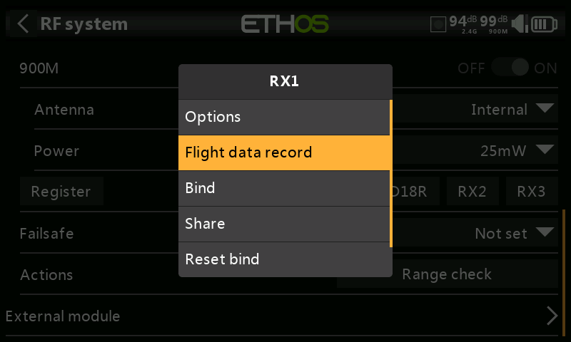

Proporciona un registro el estado de salud del receptor.

incluidos el reinicio al encenderse, el reinicio de los pines de salida y los resultados de la activación, el temporizador de vigilancia, la detección de bloqueo y la detección de caída de voltaje.

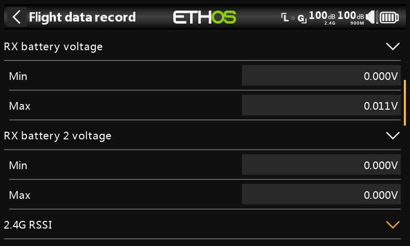

Valores mínimo y máximo de los voltajes de los receptores 1 y 2 (si están presentes) desde el encendido.

Valores mínimo y máximo de los niveles RSSI 2.4G y VFR (Valid Frame Rate) desde el encendido.

Valores mínimo y máximo de los niveles RSSI y VFR (Valid Frame Rate) de 900M desde el encendido.

Valores mínimo y máximo del puerto de entrada analógica AIN, y la corriente de la placa receptora desde el encendido.

##### Guardar en archivo

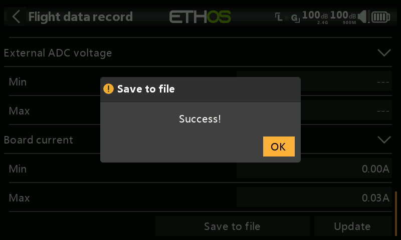

Pulse sobre "Guardar en archivo" para guardar los datos en un archivo con formato .csv en la carpeta Logs. El archivo puede leerse con un editor de texto o, más cómodamente con LibreOffice (por ejemplo).

Actualizar

Pulse el botón Actualizar para actualizar los datos del Registro de Datos de Vuelo.

La función Compartir ofrece la posibilidad de mover el receptor a otra radio Tandem que tenga un ID de registro de propietario diferente. Cuando se pulsa la opción Compartir, el LED verde del receptor se apaga.

En la radio de destino B, vaya a la sección Sistema RF y Receptor(n) y seleccione Vincular. Tenga en cuenta que el proceso Compartir omite el paso de Registro en la radio B, ya que el ID de registro del propietario se transfiere desde la radio A. Aparecerá el nombre del receptor de la radio de origen. Seleccione el nombre, el receptor se vinculará y su LED se iluminará en verde.

Aparecerá el mensaje "Bind successful".

Pulse sobre OK. La radio B controla ahora el receptor. El receptor permanecerá vinculado a esta radio hasta que decida cambiarla.

Pulse el botón EXIT de Radio A para detener el proceso Compartir.

El receptor se puede volver a mover a la radio A volviéndolo a enlazar a la radio A.

Nota: No necesita usar 'Compartir' si todas sus radios están usando el mismo ID de propietario / número de registro. Sólo tiene que poner la radio que desea utilizar en modo de enlace, encender el receptor, seleccionar el receptor en la radio y se enlazará con esa radio. Puede cambiar a otra radio de la misma manera. Es mejor mantener los mismos números de modelo de receptor al copiar los modelos.

Si cambias de opinión sobre compartir un modelo, selecciona "Restablecer vinculación" para limpiar y restaurar tu vinculación. Reinicia el receptor y quedará vinculado a tu emisora.

##### Reinicio del Receptor (Reset)

Pulse sobre el botón Restablecer para restablecer los ajustes de fábrica del receptor y borrar el UID. El receptor dejará de estar registrado en la X20.

#### Opciones del receptor (con Rx apagado)

Con el receptor apagado, seleccione RX1, RX2 o RX3 para obtener las opciones del receptor

Si selecciona Opciones, la radio intentará conectarse y esperar al receptor.

Si selecciona Vincular (Bind) por ejemplo, puede volver a vincular un modelo que había sido conectado con otro transmisor.

Si selecciona Borrar (Clear) se ejecutará un restablecimiento de la vinculación.

### Establecer el modo a prueba de fallos (Failsafe)

El modo a prueba de fallos determina lo que ocurre en el receptor cuando se pierde la señal del transmisor.

Los datos del Modo a prueba de fallos se envían desde el transmisor cada 10 segundos. Tenga en cuenta que para los receptores TD, TW, AP y AP Plus los datos del este modo se almacenan ahora en el receptor, lo que significa que los ajustes estarán disponibles inmediatamente si el receptor se reinicia por cualquier razón.  Tenga en cuenta que el Modo a prueba de fallos  debe restablecerse y comprobarse después de actualizar los receptores con esta característica.

Pulse sobre el cuadro desplegable para ver las opciones del modo a prueba de fallos:

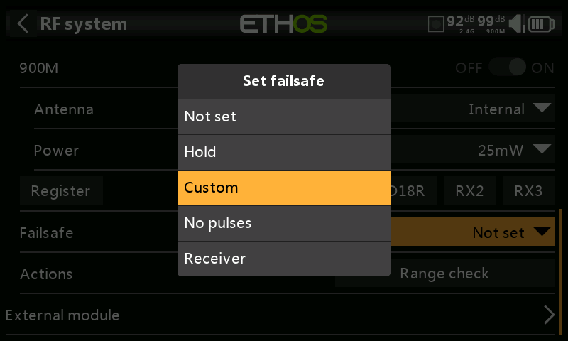

#### Mantener (Hold)

Hold mantendrá las últimas posiciones recibidas por el receptor.

#### Personalizado (Custom)

Personalizado permite mover los servos a posiciones personalizadaas predefinidas. La posición para cada canal se puede definir por separado. Cada canal tiene las opciones Not Set, Hold, Custom o No Pulses. Si se selecciona Personalizado, se muestra el valor del canal. Si se pulsa el icono fijado con una flecha, se utiliza el valor actual del canal. Alternativamente, se puede introducir un valor fijo para ese canal pulsando sobre el valor.

#### Sin pulsos (No pulses)

Sin Pulsos desactiva los pulsos que se envían al receptor (para uso con controladores de vuelo que tienen GPS de retorno a casa en caso de pérdida de señal).

#### Receptor (Receiver)

La selección de "Receptor" en los receptores de la serie X o posteriores permite configurar el failsafe directamente en el receptor.

***Advertencia*****:** Asegúrese de probar cuidadosamente los ajustes de Failsafe que elija, especialmente los canales que controlan el giroscopio en receptores estabilizados.

### Comprobación de alcance

Se debe realizar una comprobación de alcance en el campo cuando el modelo esté listo para volar.

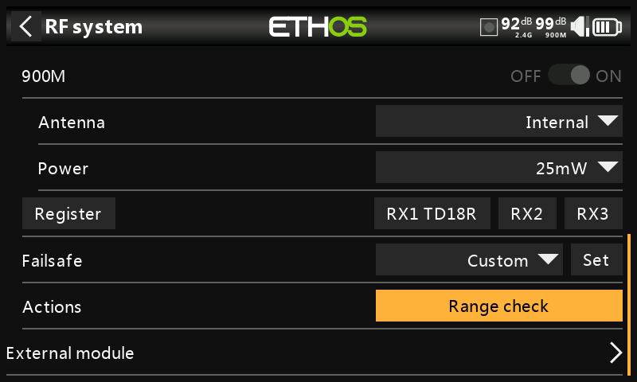

La comprobación de alcance se activa seleccionando "Comprobación de alcance".

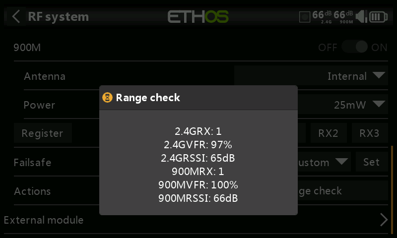

Una alerta de voz anunciará "Comprobación de alcance" cada pocos segundos, para confirmar que se encuentra en el modo de comprobación de alcance. Una ventana emergente mostrará el número de receptor y los valores VFR% y RSSI para evaluar cómo se está comportando la calidad de la recepción. Cuando la comprobación de alcance está activa, reduce la potencia del transmisor, lo que a su vez reduce el alcance para la comprobación.

El nivel de la comprobación de alcance de FrSky es 0,1mW (-10dB) y no de 1mW ( 0dB)

El nivel normal es +18dB +2dB para las antenas = +20dB

En condiciones ideales, con la radio y el receptor a 1 m del suelo, sólo debería obtener una alarma crítica a unos 30 m de distancia.

Actualmente TD MODE en modo de comprobación de alcance proporciona datos de comprobación de alcance para un receptor a la vez en el enlace 2.4G y un receptor a la vez en el enlace 900M. Si tiene tres receptores 2.4G registrados y vinculados como Receptor 1, 2 y 3, uno de los receptores será el receptor de telemetría activo y su número será mostrado por el sensor RX como 0, 1, o 2. Ese será el receptor que está enviando los datos RSSI y VFR. Ese será el receptor que está enviando los datos RSSI y VFR. Si apaga ese receptor, el siguiente receptor se convertirá en el receptor de telemetría activo en una prioridad de 0, 1, y luego 2. Cada uno de los tres receptores puede ser comprobado apagando los otros receptores.

Sensor RX 0 = Receptor 1

Sensor RX 1 = Receptor 2

Sensor RX 2 = Receptor 3

Consulte también la sección Telemetría para obtener información sobre los valores [VFR y RSSI](#RSSI and VFR discussion).

## Módulo Interno TD-ISRM Pro (X20 Pro/R/RS)

Para los módulos de RF TD ISRM vaya a la sección [Módulo Interno TD-ISRM](#Internal module TD-ISRM).

### Generalidades

La tarjeta de RF TD-ISRM Pro ofrece triple redundancia de RF utilizando las bandas 2.4G FSK, 2.4G (LoRa) y 900M (LoRa), que abre los límites del rendimiento de la RF.

#### FSK

FSK es un tipo de Modulación de Frecuencia (FM Frequency Modulation) en el que la señal modulada asume valores discretos, al tiempo que varía la frecuencia de transmisión a un grupo predeterminado de valores discretos de frecuencia. Si la información se compone tan solo de dos valores (binaria), algunas veces se las denominan como frecuencias de marca y espacio.

#### LoRa

LoRa (abreviatura de Long Range) consiste en una técnica de modulación inalámbrica de frecuencia derivada de la denominada tecnología ‘Chirp Spread Spectrum’ (CSS). Esta tecnología codifica la información en las Ondas de radio usando pulsos ‘chirp’ similares a los sonidos que usan los delfines y los murciélagos para comunicarse. Las transmisiones moduladas con LoRa son robustas contra perturbaciones y se pueden recibir a grandes distancias.

En una sola placa ISRM se incluyen tres secciones separadas y aisladas de RF:

- Una sección doble de RF con capacidad de emitir en 2.4G FSK y 2.4G LoRa.
- Una sección de RF de modulación 2.4G ACCESS que soporta las modulaciones ACCESS y ACCST D16, y que también se usa para Tandem.
- Tandem también utiliza la sección de RF ACCESS 900M, además de proporcionar redundancia a los otros receptores.

Se pueden seleccionar muchos modos y configuraciones diferentes combinando estas tres secciones de RF.

**¡Atención!** A lo largo de este manual y en los menús de las radios cuando se menciona el término genérico ‘900M’ significa que se usa la banda VHF. Las frecuencias de operación autorizadas en esta banda son 915Mhz para FCC o 868Mhz para LBT como sea aplicable para operación de la radio en el país del usuario.

#### Modos del TD-ISRM Pro

##### ACCESS/ACCST D16

En el modo ACCESS, las señales de RF en 2.4G y 900M trabajarán en tándem con un solo conjunto de controles ACCESS. Se pueden tener registrados y vinculados tres receptores de 2.4G, tres receptores registrados y vinculador de 900M, o una combinación de ambos hasta un total de tres receptores.

Cuando el modo ACCESS se configura con una combinación de receptores de 2.4G y 900M, los enlaces de telemetría están activos al mismo tiempo en las dos bandas. Los sensores de telemetría estarán identificados en una sola de las bandas, 2.4G o 900M. Tenga en Cuenta que la banda de 2.4G soporta 24 canales, mientras que la banda de 900M sólo soporta 16 canales.

La sección ACCST también ofrece la posibilidad de usar la modulación ACCST D16 con la opción de un receptor de 900M para redundancia.

Para más detalles, vaya a la sección ACCESS/ACCST D16 más abajo.

##### TD Tandem Doble Banda 2.4G/900M

En el modo TD, el módulo de RF está en un modo de largo alcance con baja latencia que usa enlaces de bandas 2.4G y 900M alternativamente para trabajar con hasta tres receptores Tandem. Tandem soporta hasta 24 canales en ambas bandas.

Este modo es similar al mod TD de la X20. Vaya a la sección del modo TD para detalles en su ajuste.

##### TW 2.4G TWIN/900M.

En el modo TW se dispone de un enlace en 2.4G FSK y otro en 2.4G LoRa que se pueden usar hasta con tres receptores TWIN. Para redundancia, también dispone de la posibilidad de usar de usar un receptor de 900M para redundancia, vía los puertos de SBUS IN/OUT. Con esto se mejora la fiabilidad de la señal de RF, particularmente en escenarios con operaciones de RC a larga distancia.

Vea la sección de M[odo TW](#TW Mode) más abajo

##### TD-Pro

Se utilizará con los futuros receptores FrSky TD-Pro.

Existe la posibilidad de asignar en Ethos una Fuente de telemetría denominada RX. RX proporciona el número de receptor al receptor activo que esté enviando la telemetría. RX aparece en telemetría como cualquier otro sensor en tiempo real, además de aparecer como interruptor lógico, funciones especiales y registro de datos.

Vaya a las siguientes secciones para detalles de su configuración.

### ACCESS/ACCST D16

En el modo ACCESS/ACCST D16 los enlaces de RF en las bandas de 2.4G y 900M pueden trabajar en tándem con un conjunto de controles.

#### ACCESS 2.4G con un receptor 900M para redundancia

Es similar al modo de ACCESS en la X20. Se pueden vincular hasta un total de tres receptores ACCESS o 900M. Vaya a la sección de [X20 ACCESS](rf-system.md) para detalles de sus ajustes.

#### ACCST D16 con un receptor 900M para redundancia

Este modo solamente está disponible en la X20 Pro. Se puede usar un receptor ACCST D16 en conjunción con un receptor redundante 900M.

##### ID del modelo

Cuando se crea un nuevo modelo, la ID del modelo se asigna automáticamente. Esta ID debe ser única ya que la función ‘Model Match’ asegura que solo una correcta ID de Modelo pueda ser vinculada. Este número se envía al receptor durante el emparejamiento, de forma que éste solo responderá al número de vinculación que le ha sido asignado. Esta ID de Modelo se puede cambiar manualmente.

##### Número de canales

Permite elegir el número de canales internos de la emisora que se van a poner en el aire. En modo D16 se puede elegir entre 8 canales que emiten datos cada 9ms, y 16 canales con datos emitidos cada 18ms.

Tenga en cuenta que la velocidad de actualización de datos depende completamente del receptor. Para ACCST deberá ver el manual de su receptor para detalles sobre cómo seleccionar el modo 9ms HS (High PWM Speed). Asegúrese de que sus servos son capaces de manejar este régimen de actualización.

##### Modo carrera

El modo Carrera (‘Racing mode’) no está disponible para ACCST.

##### 2.4G FSK

Habilita o desactiva el módulo de RF de 2.4G.

##### Protocolo

Seleccione ACCST D16.

##### Vinculación (Bind)

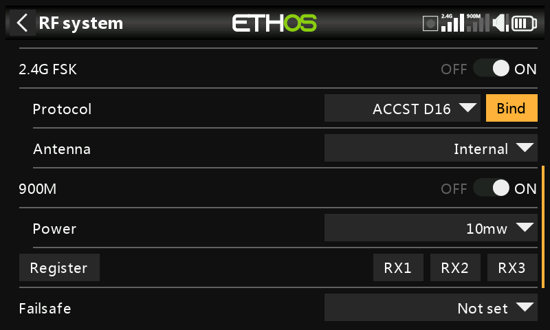

Asegúrese de que el módulo de 900M está encendido.

1. Inicie el proceso de vinculación seleccionando \[Bind\]. Una alerta por voz anunciará ‘Vinculando’ (‘Bind’) cada pocos segundos, para confirmar que está en modo de emparejamiento.

En el modo D16 aparecerá un cuadro de diálogo que le permitirá la selección del modo de operación del receptor. Están disponibles cuatro modos de operación con combinaciones de Telemetría On/Off y canales del 1-8 y del 9-16. Está pensado así para permitir la operación de dos receptores redundantes o para poder conectar más de 8 servos usando dos receptores.

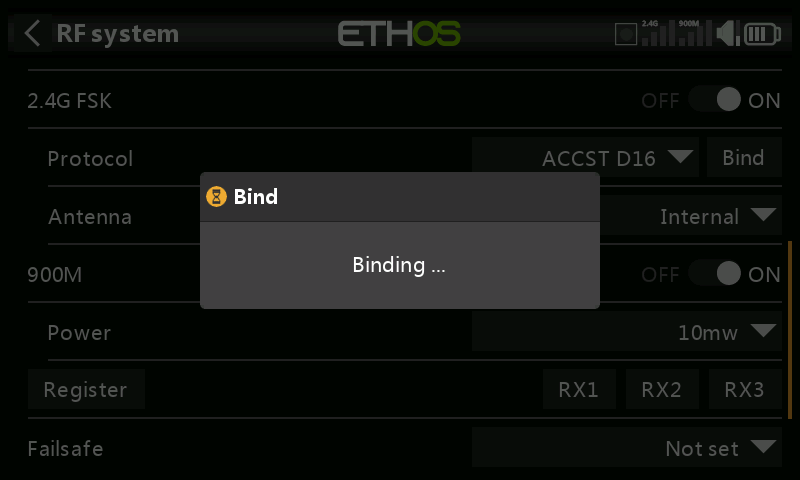

2. Encienda el receptor en modo de vinculación como se explica en las instrucciones del receptor. (Generalmente se hace manteniendo pulsado el botón de Failsafe del receptor cuando se enciende éste).

3. Los LEds rojo y verde se encenderán. Cuando el proceso de emparejamiento se haya completado, el LED verde se apagará y el rojo parpadeará.

4. Pulse OK en el transmisor para salir del proceso de vinculación, y apague y encienda el receptor.

5. Si el LED verde del receptor permanece encendido, y el LED rojo está apagado, el receptor está correctamente conectado a la emisora. Este proceso de vinculación entre el transmisor y el receptor no deberá repetirse a menos de que uno de ellos se reemplace. El receptor solo podrá ser controlado por la emisora a la que está vinculado, sin que le afecten las emisiones de otros transmisores.

Precaución – Muy importante

No realice la operación de vinculación con un motor eléctrico conectado o con un motor de combustión interna funcionando.

##### Antena

Selecciona la antena Interna o Externa (en el conector ANT2). Aunque la etapa de RF dispone de un sistema de protección integrado, es una buena práctica de seguridad verificar que la antena externa se ha instalado antes de seleccionarla en la emisora. Tenga en Cuenta que la selección de antena se realiza modelo por modelo, por lo que cada vez que el modelo se selecciona, Ethos ajusta automáticamente las antenas para ese modelo específico.

##### Potencia

Seleccione la potencia deseada para la emisión de RF entre 25 y 100mW.

##### Añadir un receptor redundante 900M.

La redundancia para el control que proporciona FrSky es siempre evaluada “per-frame” siendo elegida la mejor disponible. Pero si hay dos frames buenas, el receptor elegirá su mejor frame interno. Por lo tanto, el control puede alternarse como sea necesario con cada frame (activa/activa conmutada por fallo).

##### 900M

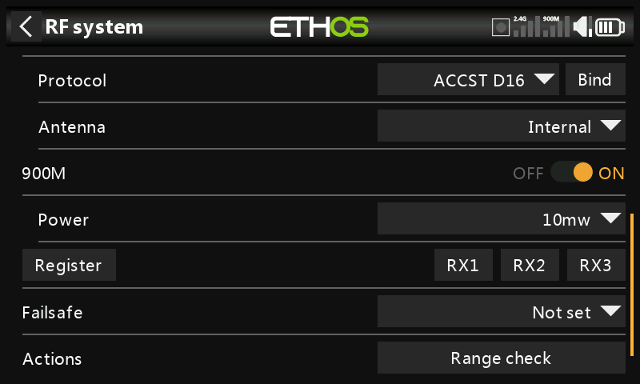

Conecte el puerto SBUS-Out del receptor redundante al puerto SBUS-IN del receptor principal.

Asegúrese de que el módulo 900M está habilitado.

##### Potencia

FCC: Seleccione la potencia RF deseada de entre 10, 25, 100, 200, 500mW, 10mW~1W (Auto-adaptativo).

LBT: Seleccione la potencia RF deseada de 25mW (telemetría vía 868MHz), 200mW o 500mW (telemetría vía 2.4GHz).

##### Registro

Si su receptor todavía no ha sido registrado, inicie el proceso de registro seleccionando \[Register\]. Los pasos a seguir son los mismos que los descritos en la sección [ACCESS](rf-system.md).

Apague los receptores.

##### Vinculación (Bind)

Seleccione 'Bind' para empezar la vinculación del receptor 900M.

Una alerta por voz anunciará ‘Bind’ cada pocos segundos para confirmar que se encuentra en modo vinculación. Aparecerá en la pantalla el mensaje ‘Esperando al receptor…’.

Encienda los receptores.

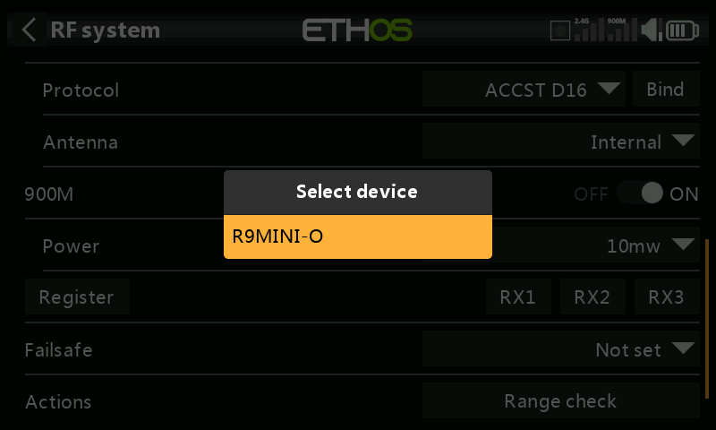

Seleccione el receptor redundante R9MINI-O.

Seleccione OK cuando termine el proceso. Asegúrese de que el LED verde del receptor redundante está encendida. El receptor redundante ya está vinculado.

El receptor redundante también aparecerá en el listado.

##### Opciones del receptor

Las opciones disponibles para este receptor son similares a las descritas en la sección ACCESS.

##### Restablecimiento del receptor

Seleccione el botón \[Reset\] para devolver al receptor a sus ajustes de fábrica y borrar su UID. El receptor también perderá su registro.

#### Modo a prueba de fallos (Failsafe)

Las opciones disponibles para el modo a prueba de fallos son similares a las descritas en la sección ACCESS.

#### Prueba de alcance

Las opciones disponibles para la prueba de alcance son similares a las descritas en la sección de ACCESS.

#### Sólo ACCST D16

Con la opción 900M desconectada, sólo estará activo el modo ACCST D16.

##### ID del modelo

Cuando se crea un nuevo modelo, la ID del modelo se asigna automáticamente. Esta ID debe ser única ya que la función ‘Model Match’ asegura que solo una correcta ID de Modelo pueda ser vinculada. Este número se envía al receptor durante el emparejamiento, de forma que éste solo responderá al número de vinculación que le ha sido asignado. Esta ID de Modelo se puede cambiar manualmente.

##### Número de canales

Permite elegir el número de canales internos de la emisora que se van a poner en el aire. En modo D16 se puede elegir entre 8 canales que emiten datos cada 9ms, y 16 canales con datos emitidos cada 18ms.

Tenga en cuenta que la velocidad de actualización de datos depende completamente del receptor. Para ACCST deberá ver el manual de su receptor para detalles sobre cómo seleccionar el modo 9ms HS (High PWM Speed). Asegúrese de que sus servos son capaces de manejar este régimen de actualización.

##### Modo carrera

El modo Carrera no está disponible para ACCST.

##### 2.4G FSK

Habilita o desactiva el módulo de 2.4G RF.

##### Protocolo

Seleccione ACCST D16.

##### Antena

Selecciona la antena Interna o Externa (en el conector ANT2). Aunque la etapa de RF dispone de un sistema de protección integrado, es una buena práctica de seguridad verificar que la antena externa se ha instalado antes de seleccionarla en la emisora. Tenga en Cuenta que la selección de antena se realiza modelo por modelo, por lo que cada vez que el modelo se selecciona, Ethos ajusta automáticamente las antenas para ese modelo específico.

##### 900M

El módulo interno 900M estará apagado.

##### Modo a prueba de fallos (Failsafe)

Las opciones disponibles para el modo a prueba de fallos son similares a las tratadas en la sección ACCESS.

##### Acciones

##### Vinculación

1. Inicie el proceso de vinculación seleccionando \[Bind\]. Una alerta por voz anunciará ‘Bind’ cada pocos segundos, para confirmar que está en el modo de emparejamiento.

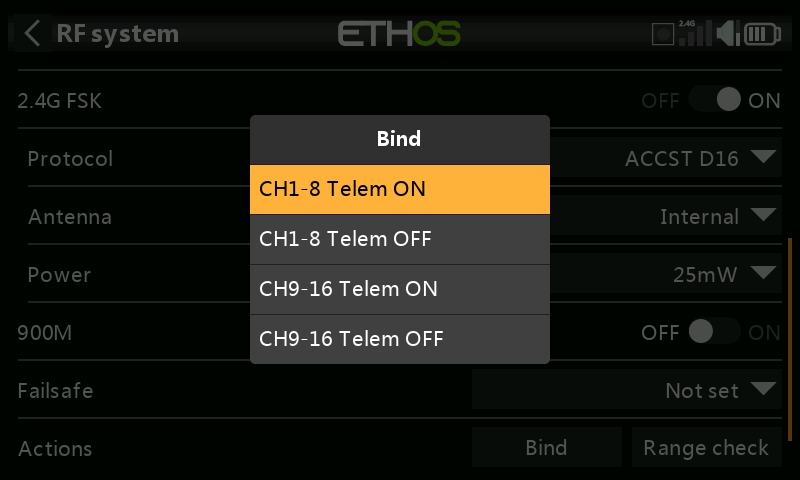

En el modo D16 aparecerá un cuadro de diálogo que le permitirá la selección del modo de operación del receptor. Están disponibles cuatro modos de operación con combinaciones de Telemetría On/Off y canales del 1-8 y del 9-16. Está pensado así para permitir la operación de dos receptores redundantes o para poder conectar más de 8 servos usando dos receptores.

2. Encienda el receptor en el modo de vinculación, de acuerdo con las instrucciones del receptor. (Generalmente se hace manteniendo pulsado el botón de Failsafe en el receptor mientras se enciende).

3. Los LEDs rojo y verde se encenderán. El LED verde se apagará y el rojo parpadeará hasta que el proceso de emparejamiento termine.

4. Seleccione OK en la emisora para finalizar el proceso de vinculación, y apague y encienda el receptor.

5. Si el LED verde del receptor está encendido, y el rojo apagado, el receptor estará vinculado a la emisora. Este proceso de vinculación no se tendrá que repetir, a menos que uno de ellos sea reemplazado. El receptor solo podrá ser controlado por el transmisor al que está vinculado (sin ser afectado por las emisiones de otro transmisor).

Precaución – Muy importante

No realice el proceso de vinculación con un motor eléctrico conectado o con un motor de combustión interna encendido.

##### Prueba de alcance

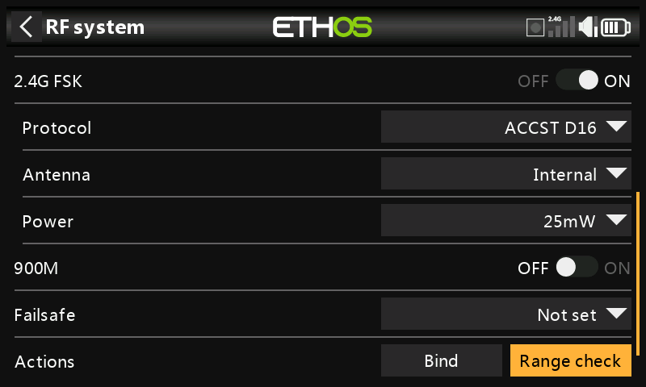

Seleccione 'Range check' para activar la prueba de alcance.

Cada pocos segundos, una alerta por voz anunciará ‘Range check’ para confirmar que está en modo de prueba de alcance. Un cuadro de diálogo mostrará el número del receptor, el VFR% y el valor de RSSI para evaluar el comportamiento de la calidad de recepción. Cuando se active el modo de prueba de alcance, la potencia de la emisora se reduce, lo que hace que el alcance sea menor. En condiciones ideales, con la emisora y el receptor a 1 m sobre el suelo, no deberían aparecer alertas críticas a menos de 30 metros de distancia.

Vaya a la sección de Telemetría para conocer los detalles de loa valores de [VFR y RSSI](#RSSI and VFR discussion).

### Modo TW

En el modo TW existe un enlace de RF en modulación 2.4G FSK y otro en 2.4G LoRa, para usarse con hasta tres receptores TWIN, además de disponer de la opción de un receptor redundante en 900M (vía puertos SBUS IN/OUT).

Puede haber tres receptores TW registrados y vinculados, tres receptores 900M registrados y vinculado, o una combinación de ellos, para un total de tres receptores TW y 900M.

El modo TW funcionando con una combinación de receptores 2.4G FSK, 2.4G LoRa y 900M, los receptores con enlace de telemetría en 2.4G y 900M estarán activos al mismo tiempo. Los sensores estarán identificados en telemetría como 2.4G y 900M. Tenga en Cuenta que la banda de 2.4G es capaz de manejar 24 canales, mientras que la banda de 900M sólo usa 16 canales.

En las siguientes secciones tendremos los detalles para su configuración.

### Tipo

Modo de transmisión del módulo interno de RF. Este modo debe corresponderse con el del receptor. De lo contrario, el modelo no se vinculará. Después de un cambio de modo, se debe comprobar cuidadosamente la operación del modelo (especialmente el Failsafe) y verificar que todos los canales del receptor están funcionando como se pretende.

### Tipo: Modo ***TW***

La forma en la que los receptores se conectan y vinculan al transmisor está dividida en dos fases. La primera consiste en registrar el receptor en la radio o radios en los que se va a usar. Ese registro solo necesita realizarse una vez entre cada pareja emisor/receptor. Una vez registrado, el receptor podrá vincularse una y otra vez de forma inalámbrica con cualquiera de las radios con las que se ha registrado, sin necesidad de usar el botón de registro en el receptor.

Habiendo seleccionado el modo TW, se deben ajustar los siguientes parámetros:

#### ID del modelo

Cuando se crea un nuevo modelo, la ID del modelo se asigna automáticamente. Esta ID debe ser única ya que la función ‘Smart Match’ asegura que solo una correcta ID de Modelo pueda ser vinculada. Este número se envía al receptor durante el emparejamiento, de forma que éste solo responderá al número de vinculación que le ha sido asignado. La vinculación del receptor es más importante que nunca.

Esta ID de Modelo se puede cambiar manualmente desde 00 a 63, siendo el valor por defecto de 1.

Tenga en cuenta que la ID del modelo se cambia cuando el modelo se clona.

#### Número de canales:

Como el modo TW es capaz de manejar hasta 24 canales, normalmente se elegirá entre las opciones Ch1-8, Ch1-16, o Ch1-24 para determinar el número de canales que serán transmitidos. Tenga en cuenta que el modo por defecto es elegir Ch1-16. Los canales recibidos por el receptor se configuran en las opciones de cada receptor.

La elección del número de canales del transmisor afectará también a los tiempos de actualización de los datos emitidos. Los datos de 8 canales se transmiten cada 7ms. Si se usan más de 8 canales, los datos se actualizarán como sigue:

| Número de canales | Tasa de actualización | Notas |
| --- | --- | --- |
| 1-24 | 21ms | Ch1-8, Ch9-16, y Ch17-24 enviados en rotación |
| 1-16 | 14ms | Ch1-8, Ch9-16, enviados alternativamente |
| 1-8 | 7ms | Ch1-8 |
| Modo carrera | 4ms | Sólo con servos digitales |

#### Modo carrera

El Modo Carrera ofrece una baja latencia de 4ms con receptores del tipo TW MX.

Si se seleccionan canales Ch1-8, es posible seleccionar una fuente (por ejemplo, un interruptor) para activas este Modo Carrera. Una vez el receptor está vinculado (vea más abajo) y se ha activado el Modo Carrera, se debe reciclar el receptor para que este modo surta efecto.

#### 2.4G FSK

Activa o desconecta la sección 2.4G FSK del módulo interno de RF.

##### Antena

Seleccione la antena Interna o Externa (en el conector ANT2). Aunque la etapa de RF dispone de un sistema de protección integrado, es una buena práctica de seguridad verificar que la antena externa se ha instalado antes de seleccionarla en la emisora. Tenga en Cuenta que la selección de antena se realiza modelo por modelo, por lo que cada vez que el modelo se selecciona, Ethos ajusta automáticamente las antenas para ese modelo específico.

#### 900M

Activa o desconecta la sección de 868M/900M del módulo interno de RF.

##### Antena

El módulo de RF 900M opera solo con antena interna.

Potencia:

FCC: Selecciona la potencia deseada de emisión entre 10, 25, 100, 200, 500mW, 10mW~1W (Auto-adaptativo).

LBT Selecciona la potencia deseada de emisión entre 25mW (telemetría vía 868Mz) 200mW o 500mW (Telemetría vía 2,4G).

#### 2.4G ***Lo******R******a*** ***(Long Range)***

Activa o desconecta la sección 2.4G del módulo interno de RF.

##### Antena

Seleccione la antena Interna o Externa (en el conector ANT1). Aunque la etapa de RF dispone de un sistema de protección integrado, es una buena práctica de seguridad verificar que la antena externa se ha instalado antes de seleccionarla en la emisora. Tenga en Cuenta que la selección de antena se realiza modelo por modelo, por lo que cada vez que el modelo se selecciona, Ethos ajusta automáticamente las antenas para ese modelo específico

##### Potencia

Selecciona la potencia de emisión entre 25 y 100mW.

En el modo TW los enlaces en las bandas de 2.4G FSK, 2.4G LoRa y 900M trabajan en tándem con los controles. Puede haber tres receptores TW registrados y vinculados, tres receptores 900M registrados y vinculados, o una combinación de receptores TW y 900M hasta un total de tres receptores.

#### Primera fase: Registro

#### Registro

1. Si su receptor no ha sido todavía registrado, inicie el proceso de registro seleccionando \[Register\]. Si ya lo ha hecho, vaya directamente a la sección de vinculación.

Aparecerá un mensaje de 'Esperando receptor...' con una alerta por voz de ‘Registrando’.

2. Encienda el receptor mientras mantiene presionado su botón de vinculación. Espere a que se activen los dos LEDs rojo y blanco.

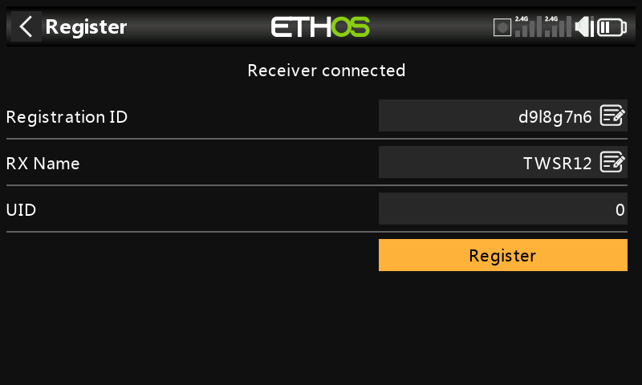

En la pantalla, el mensaje 'Esperando receptor…' cambiará a ‘Receptor Conectado’, y el nombre del receptor se rellenará automáticamente.

3. En esta fase se pueden configurar el ID Reg. y el UID:

- **ID de registro**: El ID de registro es a nivel de propietario o del transmisor. Debe ser un código único para su radio y los transmisores que vaya a utilizar con Smart Share. Su valor predeterminado es el de la configuración de ID de registro de propietario descrita anteriormente al principio de esta sección, pero puede editarse aquí. Si dos radios tienen el mismo ID, puede mover los receptores (con el mismo número de receptor para un modelo determinado) entre ellos, simplemente utilizando el proceso de emparejamiento con la radio y el receptor encendidas.
- 
  - **Nombre RX**: Se rellena automáticamente, pero el nombre puede cambiarse si se desea. Hacer esto puede ser útil si está utilizando más de un receptor y necesita recordar, por ejemplo, que RX4R1 es para Ch1-8 o RX4R2 es para Ch9-16 o RX4R3 es para Ch17-24 cuando vuelva a enlazar más tarde. Aquí se puede introducir un nombre para cada receptor.
- **El UID** se utiliza para distinguir entre varios receptores usados simultáneamente en un mismo modelo. Puede dejarse por defecto en 0 para un solo receptor. Cuando se va a utilizar más de un receptor en el mismo modelo, el UID debe cambiarse, normalmente 0 para Ch1-8, 1 para Ch9-16, y 2 para Ch17-24. Tenga en cuenta que este UID no puede ser leído de nuevo desde el receptor, por lo que es una buena idea etiquetar el receptor.

4. Pulse \[Registrar\] para completar. Aparecerá un cuadro de diálogo con el texto "Registro correcto". Pulse \[Aceptar\] para continuar.

5. Apague el receptor. En este punto, el receptor está registrado, pero aún debe vincularse al transmisor que se va a utilizar. Ahora está listo para la vinculación.

#### Segunda fase – vinculación y opciones de módulos

#### Emparejamiento

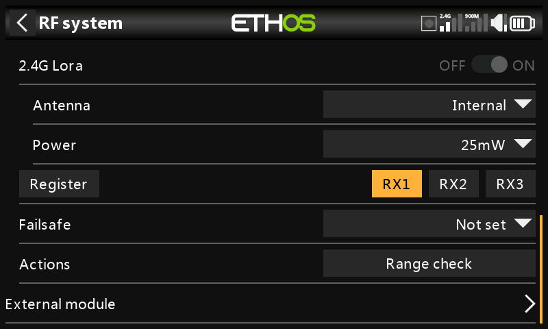

La vinculación de receptores permite que un receptor registrado se vincule a uno de los transmisores con los que se ha registrado en la primera fase y entonces responderá a ese transmisor hasta que se vuelva a vincular a otro transmisor. Asegúrese de realizar una comprobación de alcance antes de volar el modelo.

Advertencia - Muy importante

No realice la operación de emparejamiento con un motor eléctrico conectado o un motor en marcha de combustión interna.

1. Apague el receptor.

2. Confirme que se encuentra en el modo TW.

3. Receptor 1 \[Bind\]: Inicie el proceso de vinculación seleccionando \[RX1\], y eligiendo ‘Bind’ en el menú desplegable. Una alerta por voz anunciará ‘Bind’ cada pocos segundos para confirmar que se ha entrado en modo de emparejamiento. Aparecerá el mensaje ‘Esperando receptor…’ en la pantalla.

4. Encienda el receptor sin tocar el botón F/S bind. Aparecerá el mensaje "Seleccionar dispositivo" y el nombre del receptor que acaba de encender.

5. Desplácese hasta el nombre del receptor y selecciónelo.

Aparecerá un mensaje indicando que la vinculación se ha realizado correctamente.

6. Apague el transmisor y el receptor.

7. Encienda el transmisor y a continuación el receptor. Si el LED verde del receptor está encendido y el LED rojo apagado, el receptor está enlazado con el transmisor. No será necesario repetir la vinculación del módulo receptor/transmisor, a menos que se sustituya uno de los dos.

El receptor ya está listo para usarse. El receptor sólo será controlado (sin verse afectado por otros transmisores) por el transmisor al que esté vinculado.

El receptor seleccionado aparecerá con su nombre junto a él:

El receptor ya está listo para usarse

Repita el proceso para los receptores 2 y 3 cuando sea necesario.

Vaya a la sección de Telemetría para más detalles sobre [RSSI](#RSSI and VFR discussion).

#### Opciones del receptor

Seleccione RX1, RX2 o RX3 para que aparezcan las Opciones del Receptor correspondiente:

Seleccione Opciones

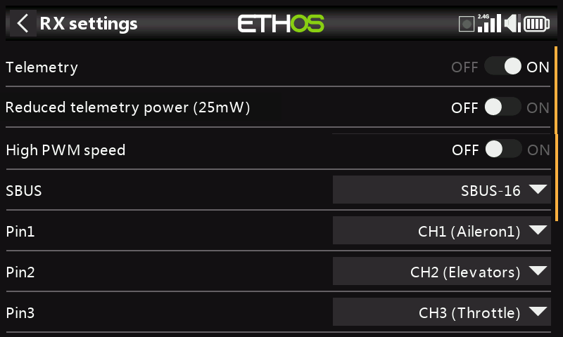

*Telemetr**ía*: La Telemetría puede desactivarse para ese receptor.

*Potencia r**educ**i**d**a de* *t**elemetr**ía* *con* *25mW*: Casilla para limitar la potencia de la telemetría a 25mW (normalmente es de 100mW), que puede necesitarse si por ejemplo los servos experimentan interferencias causadas cuandop la RF se envía muy cerca de ellos.

*Alta velocidad PWM*: La velocidad de actualización de los servos está completamente determinada por el receptor.  Esta casilla permite una velocidad de actualización PWM de 7ms (vs 18ms estándar). Asegúrese de que sus servos pueden manejar esta velocidad de actualización.

Consulte la sección [Sección Numero de canales (TW)](rf-system.md) para obtener información detallada sobre la frecuencia de actualización ajustada en el transmisor.

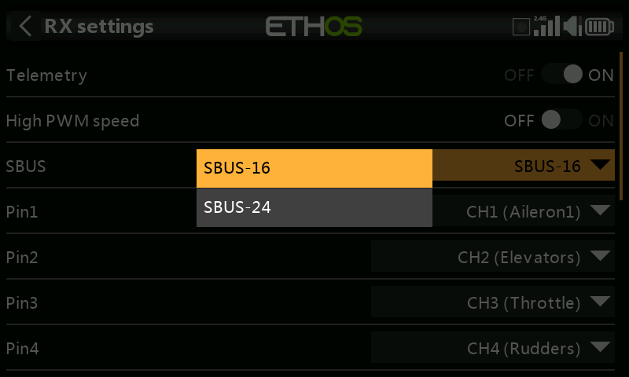

*SBUS**:* Permite la selección de un canal en modo SBUS-16 o modo SBUS-24. Tenga en cuenta que todos los dispositivos SBUS conectados deben soportar el modo SBUS-24 para que se active el nuevo protocolo. SBUS-24 es un desarrollo de FrSky basado en el protocolo SBUS-16 de Futaba.

*Mapeado de canales*: El cuadro de diálogo Opciones del receptor también ofrece la posibilidad de Reasignar canales a los pines del receptor.

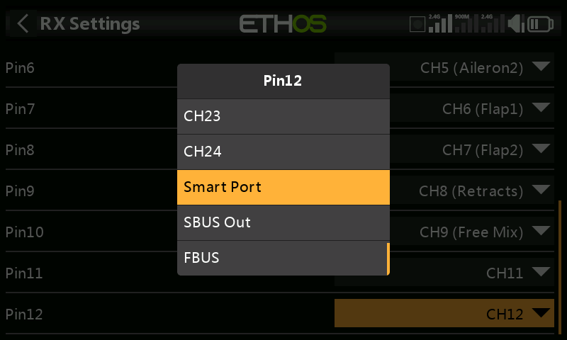

*Opciones para Pin1-12*: Permite la posibilidad de poder reasignar los canales de la radio a los distintos pines del receptor. Además, cada Puerto de las salidas se puede reasignar a un puerto con protocolos Smart Port, SBUS Out, o FBUS (previamente conocidos como F.Port2).

El protocolo F.Port fue desarrollado por un equipo de Betaflight para integrar las señales separadas de SBUS y S.Port. FBUS (F.Port2) también permite a un dispositivo Host comunicarse con varios dispositivos esclavos usando la misma línea. Para más información de este protocolo, vaya a su explicación detallada en el website oficial de Frsky.

El Pin 1 también se puede utilizar para ajustar el SBUS IN. Tenga en cuenta que en el ejemplo de arriba, los canales se han empujado uno hacia abajo para hacer sitio para incluir SBUS IN en el Pin1 (CH1 Aileron1 está en el Pin2).

##### Grabación de datos de vuelo (Receiver black box)

Proporciona un registro el estado de salud del receptor. incluido el reinicio al encenderse, el reinicio de los pines de salida y los resultados de la activación, el temporizador de vigilancia, la detección de bloqueo y la detección de caída de voltaje.

Valores mínimo y máximo de los voltajes de los receptores 1 y 2 (si están presentes) desde el encendido.

Valores mínimo y máximo de los niveles RSSI 2.4G y VFR (Valid Frame Rate) desde el encendido.

Valores mínimo y máximo de los niveles RSSI y VFR (Valid Frame Rate) de 900M desde el encendido.

Valores mínimo y máximo del puerto de entrada analógica AIN, y la corriente de la placa receptora desde el encendido.

##### Guardar en archivo

Pulse sobre "Guardar en archivo" para guardar los datos en un archivo con formato .csv en la carpeta Logs. El archivo puede leerse con un editor de texto o, más cómodamente con LibreOffice (por ejemplo).

Actualizar

Pulse el botón Actualizar para actualizar los datos del Registro de Datos de Vuelo.

La función Compartir proporciona la capacidad de mover el receptor a otra radio con modo TW que tenga un ID de Registro de Propietario diferente. Cuando se toca la opción Compartir, el LED verde del receptor se apaga.

En la radio de destino B, vaya a la sección Sistema RF TW y Receptor(n) y seleccione Vincular. Tenga en cuenta que el proceso Compartir omite el paso Registro en la radio B, ya que el ID de registro del propietario se transfiere desde la radio A. Aparecerá el nombre del receptor de la radio de origen. Seleccione el nombre, el receptor se vinculará y su LED se iluminará en verde.

Aparecerá el mensaje "Bind successful".

Pulse sobre OK. La radio B controla ahora el receptor. El receptor permanecerá vinculado a esta radio hasta que decida cambiarla.

Pulse el botón EXIT de Radio A para detener el proceso Compartir.

El receptor se puede volver a mover a la radio A re-enlazándolo a la radio A.

Nota: No es necesario utilizar 'Compartir' si todas sus radios están utilizando el mismo ID de propietario / número de registro. Sólo tiene que poner la radio que desea utilizar en modo de enlace, encender el receptor, seleccionar el receptor en la radio y se enlazará con esa radio. Puede cambiar a otra radio de la misma manera. Es mejor mantener los mismos números de modelo de receptor al copiar los modelos.

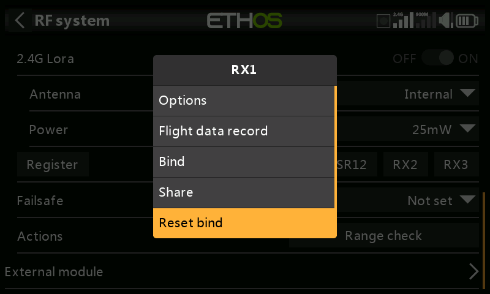

Si cambia de opinión sobre compartir un modelo, seleccione "Restablecer vinculación" para limpiar y restaurar su vinculación. Reinicie el receptor y quedará vinculado a su emisora.

##### Reinicio del receptor – Factory Reset

Pulse sobre el botón Restablecer \[Reset\] para restablecer los ajustes de fábrica del receptor y borrar el UID. El receptor dejará de estar registrado en la X20.

#### Añadir un receptor redundante

Se puede vincular un segundo receptor en un hueco no usado. Por ejemplo, como RX2 o RX3, para proporcionar redundancia en caso de problemas en la recepción.

La redundancia para el control que proporciona FrSky es siempre evaluada “per-frame” siendo elegida la mejor disponible. Pero si hay dos frames buenas, el receptor elegirá su mejor frame interno. Por lo tanto, el control puede alternarse como sea necesario con cada frame (activa/activa conmutada por fallo).

En el ejemplo de abajo, se muestra como hemos añadido un receptor de 900M:

1. Conecte el puerto SBUS OUT del receptor redundante al puerto SBUS IN del receptor principal.

Tenga en cuenta que puede tener que reasignar un Puerto del receptor para la función SBUS IN. Para más detalle, vaya a la sección de [Mapeo de canales](#Channel Mapping - TW).

2. Active la banda 900M en el módulo interno de RF. Tenga en Cuenta que ese modulo solo opera con la antena interior.

2a. Configure las opciones de potencia de emisión de RF.

**Potencia**:

FCC: Seleccione la potencia de RF deseada entre 10, 25, 100, 200, 500mW, 10mW~1W (Auto-adaptativo).

LBT: Seleccione la potencia RF deseada entre 25mW (telemetría vía 868MHz), 200mW o 500mW (telemetría vía 2.4GHz).

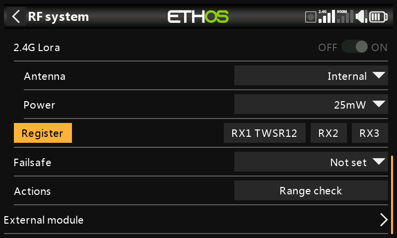

3. Si su receptor no ha sido registrado todavía, inicie el proceso de registro seleccionando \[Registro\]. Si ya lo estuviera, vaya directamente a la sección de vinculación.

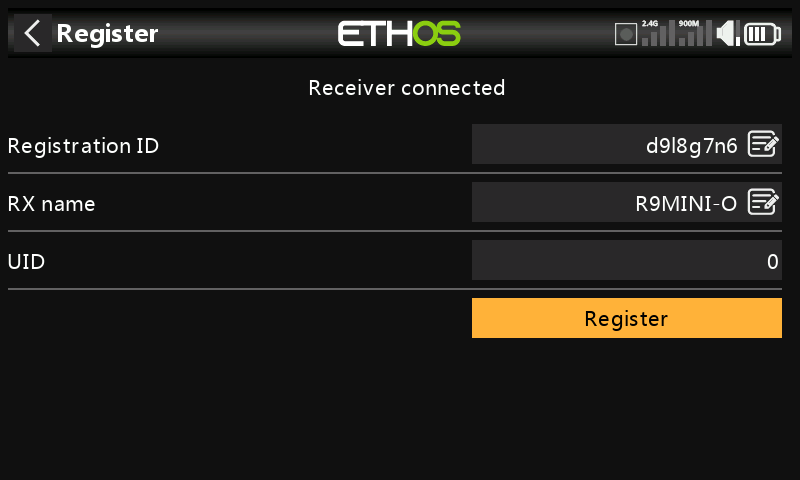

4. Registre el nuevo receptor, en el ejemplo de arriba R9MINI-O.

5. Desconecte los receptores.

6. Pulse el botón vinculación del RX2 o RX3.

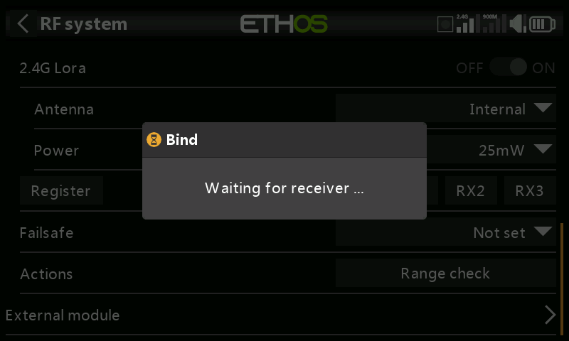

Una alerta de voz anunciará ‘Bind’ cada pocos segundos para confirmar que está en modo de emparejamiento. Al mismo tiempo, aparecerá un mensaje ‘Waiting for receiver…’.

7. Encienda los receptores.

8. Seleccione el receptor redundante R9MINI-O.

9. Pulse OK. Asegúrese de que el LED verde del receptor redundante está encendido. El receptor redundante ya está vinculado.

10. El receptor redundante aparecerá ahora en la lista, en nuestro caso R9MINI.

Nota: Aunque es posible enlazar tanto el receptor principal como el redundante a la misma UID encendiéndolos individualmente, no tendrá acceso a las Opciones del Rx mientras ambos estén encendidos

### Modo a prueba de fallos (Failsafe)

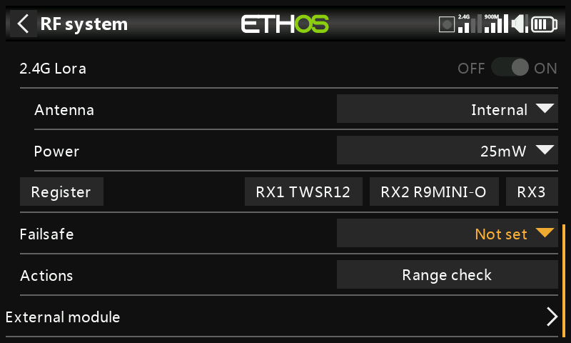

El modo a prueba de fallos determina lo que ocurre en el receptor cuando se pierde la señal del transmisor.

Los datos del Modo a prueba de fallos se envían desde el transmisor cada 10 segundos. Tenga en cuenta que para los receptores TD, TW, AP y AP Plus los datos del este modo se almacenan ahora en el receptor, lo que significa que los ajustes estarán disponibles inmediatamente si el receptor se reinicia por cualquier razón.

Pulse sobre el cuadro desplegable para ver las opciones a prueba de fallos:

#### Mantener (Hold)

‘Hold’ mantendrá las últimas posiciones de mando recibidas.

#### A medida

‘Custom’ permite mover los servos a posiciones predefinidas personalizadas. La posición para cada canal puede definirse por separado. Cada canal tiene las opciones de No Fijado, Mantener, Personalizado o Sin Pulsos. Si se selecciona Personalizado, se muestra el valor del canal. Si se pulsa el icono Set con una flecha, se utiliza el valor actual del canal.

Alternativamente, puede introducirse un valor fijo para ese canal pulsando sobre ese valor.

#### Sin pulsos (No Pulses)

‘No pulses’ desactiva los pulsos (para uso con controladores de vuelo que tienen GPS de retorno a casa en caso de pérdida de señal).

#### Receptor

La selección de "Receiver" en los receptores de la serie X o posteriores permite configurar el failsafe directamente en el receptor.

*Advertencia*: Asegúrese de probar cuidadosamente los ajustes de Failsafe elegidos.

### Comprobación de alcance

Se debe realizar una comprobación de alcance en el campo cuando el modelo esté listo para volar.

La comprobación de alcance se activa seleccionando "Comprobación de alcance".

Una alerta de voz anunciará "Comprobación de alcance" cada pocos segundos para confirmar que se encuentra en el modo de comprobación de alcance. Una ventana emergente mostrará el número de receptor y los valores VFR% y RSSI para evaluar cómo se está comportando la calidad de recepción. Cuando la comprobación de alcance está activa, se reduce la potencia del transmisor, lo que a su vez reduce el alcance para la comprobación de alcance. En condiciones ideales, con la radio y el receptor a 1 m del suelo, sólo debería obtener una alarma crítica a unos 30 m de distancia.

Actualmente TW en el modo de comprobación de alcance, proporciona datos de para un receptor a la vez en el enlace 2.4G y un receptor a la vez en el enlace 900M. Si tiene tres receptores 2.4G registrados y vinculados como Receptor 1, 2 y 3, uno de los receptores será el receptor de telemetría activo y su número será mostrado por el sensor RX como 0, 1, o 2. Ese será el receptor que está enviando los datos RSSI y VFR. Si apaga ese receptor, el siguiente receptor se convertirá en el receptor de telemetría activo en una prioridad de 0, 1, y luego 2. Cada uno de los tres receptores puede ser comprobado apagando los otros receptores.

Sensor RX 0 = Receptor 1

Sensor RX 1 = Receptor 2

Sensor RX 2 = Receptor 3

Consulte también la sección Telemetría para obtener información sobre los valores [VFR y RSSI](#RSSI and VFR discussion).

## Módulo externo de RF - FrSky

Actualmente Ethos soporta los siguientes módulos externos de FrSky: XJT Lite, R9M Lite, R9M Lite Access, R9M Lite Pro Access, TWIN Lite Pro, PPM y SBUS. Para módulos de terceros por favor vaya a la siguiente sección.

Los módulos externos pueden funcionar en ACCESS, ACCST D16, TD MODE, ELRS o TWIN MODE. Consulte las siguientes secciones para obtener detalles de configuración.

### Estado

El módulo externo puede estar activado o desactivado.

### Tipo: XJT Lite

#### Protocolo

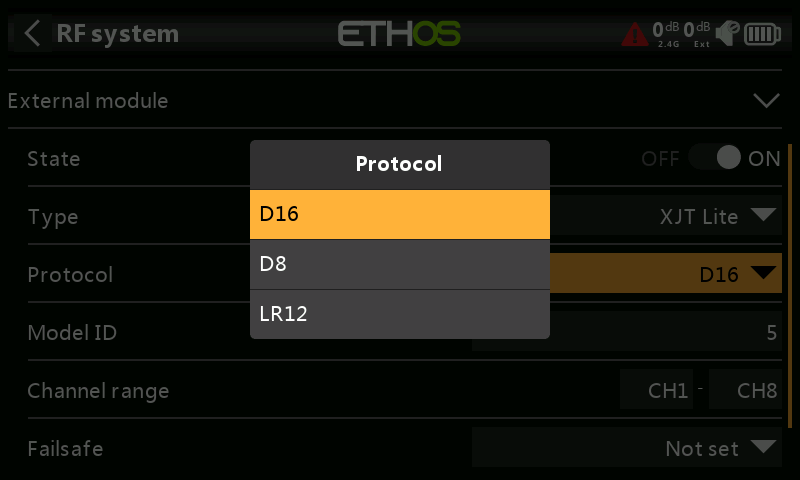

El XJT Lite puede funcionar en los modos D16 (hasta 16 canales), D8 (hasta 8 canales) o LR12 (hasta 12 canales).

### Tipo: R9M Lite

#### Protocolo

El R9M Lite puede funcionar en los siguientes modos:

| Modo | Frecuencia de funcionamiento RF | Potencia RF |
| --- | --- | --- |
| FCC | 915 MHz | 100mW (con telemetría) |
| EU | 868 MHz | 25mW (con telemetría) / 100mW (sin telemetría) |
| FLEX 868 MHz | Ajustable | 100mW (con telemetría) |
| FLEX 915 MHz | Ajustable | 100mW (con telemetría) |

### Tipo: R9M Lite ACCESS

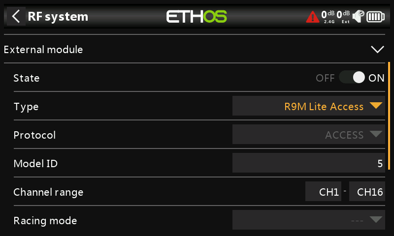

#### Protocolo

El R9M Lite ACCESS funciona en modo ACCESS.

### Tipo: R9M Lite Pro ACCESS

#### Protocolo

El R9M Lite Pro ACCESS funciona en modo ACCESS.

| Modo | Frecuencia de funcionamiento RF | Potencia RF |
| --- | --- | --- |
| FCC | 915 MHz | 10mW / 100mW / 500mW / 100mW~1W (Autoadaptable) |
| EU | 868 MHz | Modo telemetría (25mW) / Modo no telemétrico (200mW / 500mW) |

### Tipo: TWIN Lite Pro

El Twin Lite PRO es un potente módulo de RF que permite a las radios compatibles con ETHOS conectarse a los receptores de la serie TW y soportar simultáneamente en el mismo receptor las frecuencias duales 2.4G del protocolo TW. El protocolo TW activo-activo es diferente de las soluciones generales de redundancia activa-standby (donde un receptor toma el control de la señal sólo cuando el otro está en modo a prueba de fallos). Con el protocolo TW las bandas de frecuencia dual 2.4G están activas en los módulo de serie TW y el receptor, al mismo tiempo.

El módulo RF cuenta con dos antenas externas 2.4G montadas en RF para proporcionar una cobertura multidireccional y más amplia para la transmisión de señales en comparación con un diseño de antena única. Aprovechando estas características, el sistema Twin puede ofrecer con total confianza menos latencia y mayor fiabilidad a una velocidad de datos más rápida.

Además del modo TW, este módulo también es compatible con los modos ACCST D16, ACCESS y ELRS 2.4G. Esto significa que los usuarios pueden beneficiarse de una amplia gama de opciones de receptores compatibles para elegir y enlazar al construir el modelo RC. El módulo Twin Lite Pro ofrece opciones de potencia de RF resistentes hasta 500mW, construido con la carcasa del módulo en metal mecanizado CNC que ayuda a la disipación de calor, este sistema puede garantizar un control estable de largo alcance hasta decenas de kilómetros y durante largas horas de trabajo.

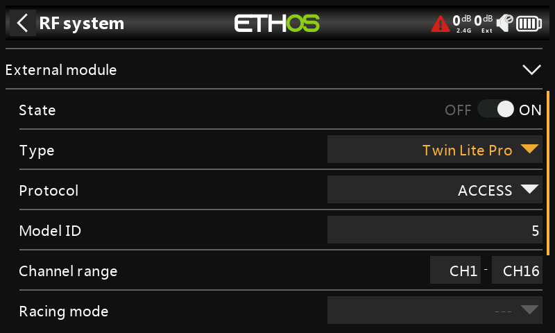

#### Estado

El módulo externo puede estar activado o desactivado.

#### Protocolo

Modo de transmisión del módulo RF TWIN Lite Pro. Además del modo TW, este módulo también es compatible con los modos ACCST D16, ACCESS y ELRS 2.4G.

El Modo debe coincidir con el tipo soportado por el receptor o el modelo no se enlazará. Después de un cambio de Modo, compruebe cuidadosamente el funcionamiento del modelo (¡especialmente Failsafe!) y verifique completamente que todos los canales del receptor funcionan según lo previsto.

#### Protocolo: Modo TW

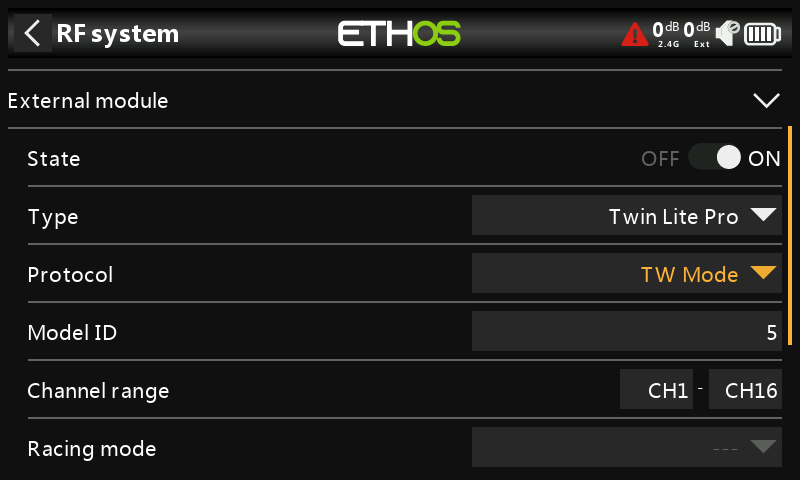

En términos de vinculación, el Modo TW es similar al ACCESS en la forma en que los receptores se vinculan y conectan con el transmisor. El proceso se divide en dos fases. La primera fase es el registro del receptor en la radio o radios con las que se va a utilizar. El registro sólo debe realizarse una vez entre cada pareja receptor/transmisor. Una vez registrado, un receptor se puede vincular y volver a vincular de forma inalámbrica con cualquiera de las radios con las que está registrado, sin necesidad de utilizar el botón de vinculación del receptor.

Una vez seleccionado el modo TW, deben configurarse los siguientes parámetros:

##### ID del modelo

Cuando se crea un nuevo modelo, el ID del modelo se asigna automáticamente. El ID de modelo debe ser un número único, ya que la función Smart Match garantiza que sólo se vinculará el ID de modelo correcto. Este número se envía al receptor durante la vinculación, de modo que sólo responderá al número al que está vinculado. El ID de modelo puede modificarse manualmente. Tenga en cuenta también que el ID de modelo se cambia cuando se clona el modelo.

##### Número de Canales:

Dado que el Modo TW admite 24 canales, normalmente se elige Ch1-8, Ch1-16, Ch9-16 o Ch17-24 para el receptor que se está configurando. Tenga en cuenta que Ch1-16 es el predeterminado. El número de canales de un receptor se configura en las opciones disponibles para cada receptor.

La elección del número de canales del transmisor también afecta a las velocidades de actualización transmitidas. Ocho canales se transmiten cada 7ms. Si se utilizan más de 8 canales, las frecuencias de actualización de los canales son las siguientes:

| Número de canales | Tasa de actualización | Notas |
| --- | --- | --- |
| 1-24 | 21ms | Ch1-8, luego Ch9-16, luego Ch17-24 enviados en rotación |
| 1-16 | 14ms | Ch1-8, Ch9-16, enviados alternativamente |
| 1-8 | 7ms  | Ch1-8 |
| Modo carrera | 4ms | Sólo servos digitales |

##### Modo carrera

El modo Carrera ofrece una latencia muy baja de 4 ms con receptores RS. El módulo TD-ISRM y el receptor RS deben tener la versión 2.1.7 o posterior.

Si el intervalo de canales se establece en Ch1-8, es posible seleccionar una fuente (por ejemplo, un interruptor) que activará el modo Carrera. Una vez vinculado el receptor RS (véase más abajo) y habilitado el modo Carrera, es necesario volver a alimentar el receptor RS para que el modo Carrera surta efecto.

##### Potencia

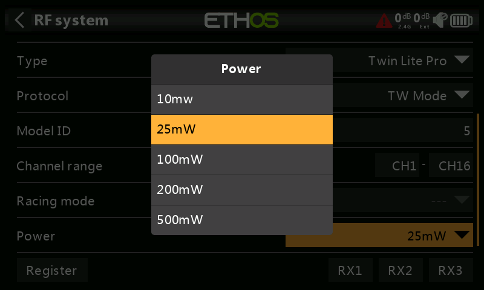

Seleccione la potencia de RF deseada entre 10, 25, 100, 200, 500mW.

##### Primera fase: Registro

1. Si su receptor no ha sido registrado todavía, inicie el proceso de registro seleccionando \[Registro\]. Si ya lo estuviera, vaya directamente a la sección de vinculación.

Aparecerá un cuadro de mensaje con el texto "Esperando..." y una alerta de voz repetida "Registrando".

2. Mientras mantiene pulsado el botón de enlace, encienda el receptor y espere a que se activen los LED rojo y verde.

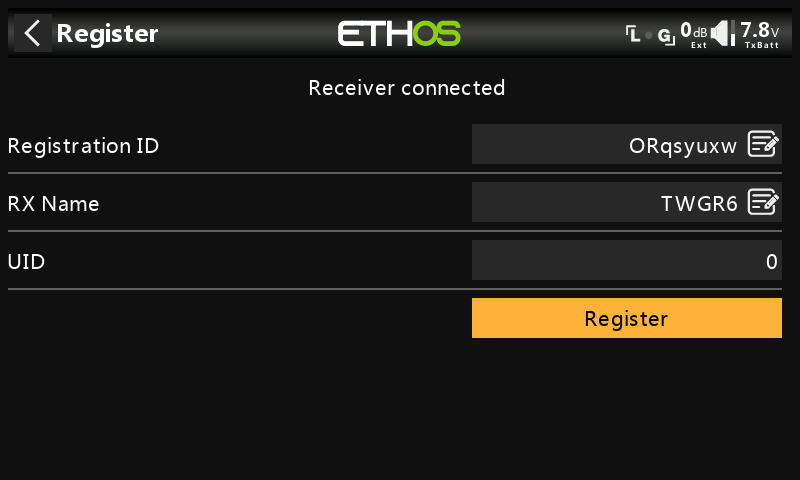

El mensaje "Esperando..." cambia a "Receptor conectado", y el campo Nombre Rx se rellenará automáticamente.

3. En esta fase se pueden configurar el ID Reg. y el UID:

- **ID de registro**: El ID de registro es a nivel de propietario o transmisor. Debe ser un código único para su radio y los transmisores que vaya a utilizar con Smart Share. Su valor predeterminado es el de la configuración de ID de registro de propietario descrita anteriormente al principio de esta sección, pero puede editarse aquí. Si dos radios tienen el mismo ID, puede mover receptores (con el mismo número de receptor para un modelo determinado) entre ellas simplemente utilizando el proceso de vinculación con la radio y el receptor encendidos.
- 
  - **Nombre RX**: Se rellena automáticamente, pero el nombre puede cambiarse si se desea. Esto puede ser útil si está utilizando más de un receptor y necesita recordar, por ejemplo, que RX4R1 es para Ch1-8 o RX4R2 es para Ch9-16 o RX4R3 es para Ch17-24 cuando vuelva a enlazar más tarde. Aquí se puede introducir un nombre para el receptor.
- El UID se utiliza para distinguir entre varios receptores utilizados simultáneamente en un mismo modelo. Puede dejarse por defecto en 0 para un solo receptor. Cuando se va a utilizar más de un receptor en el mismo modelo, el UID debe cambiarse, normalmente 0 para Ch1-8, 1 para Ch9-16, y 2 para Ch17-24. Tenga en cuenta que este UID no se puede leer de nuevo desde el receptor, por lo que es una buena idea etiquetar el receptor.

4. Pulse \[Registrar\] para finalizar.

5. Aparecerá un cuadro de diálogo con el texto "Registro ok". Pulse \[Aceptar\] para continuar.

6. Apague el receptor. En este punto, el receptor está registrado, pero aún debe vincularse al transmisor para poder utilizarlo.

##### Segunda fase – vinculación y opciones de módulos

La vinculación de receptores permite que un receptor registrado se vincule a uno de los transmisores con los que se ha registrado en la fase 1, y entonces responderá a ese transmisor hasta que se vuelva a vincular a otro transmisor. Asegúrese de realizar una comprobación de alcance antes de volar el modelo.

**Nº de receptor**: Confirme el número de receptor con el que va a funcionar el modelo. El emparejamiento de receptores sigue siendo tan importante como antes del ACCESS.  El número de receptor define el comportamiento de la función Smart Match. Este número se envía al receptor durante la vinculación, que entonces sólo responderá al número al que fue vinculado. El ID del modelo puede cambiarse manualmente.

##### Advertencia - Muy importante

No realice la operación de vinculación con un motor eléctrico conectado o un motor en marcha de combustión interna.

1. Apague el receptor.

2. Confirme que se encuentra en el modo ACCESS.

3. Receptor 1 \[Vincular\]: Inicie el proceso de vinculación seleccionando \[RX1\] y seleccione \[Bind\] en el cuadro de diálogo. Una alerta de voz anunciará "Vincular" cada pocos segundos para confirmar que se encuentra en modo de vinculación. Aparecerá el mensaje "Esperando receptor...".

4. Encienda el receptor sin tocar el botón F/S del receptor. Aparecerá el mensaje "Seleccionar dispositivo" y el nombre del receptor que acaba de encender.

5. Desplácese hasta el nombre del receptor y selecciónelo. Aparecerá un mensaje indicando que la vinculación se ha realizado correctamente.

6. Apague el transmisor y el receptor.

7. Encienda el transmisor y a continuación el receptor. Si el LED verde del receptor está encendido y el LED rojo apagado, el receptor está enlazado con el transmisor. No será necesario repetir la vinculación del módulo receptor/transmisor, a menos que se sustituya uno de los dos.

El receptor sólo será controlado (sin verse afectado por otros transmisores) por el transmisor al que esté vinculado.

El receptor seleccionado mostrará ahora para RX1 el nombre que aparece junto a él: TDMX

El receptor ya está listo para su uso.

Repita la operación para los receptores 2 y 3, si procede.

Consulte también la sección Telemetría para obtener información sobre [RSSI](#RSSI and VFR discussion).

##### Opciones del receptor

Tap the RX1, RX2 or RX3 button to bring up Receiver Options:

Pulse sobre Opciones:

##### Opciones

Telemetría 25mW: Casilla para limitar la potencia de telemetría a 25mW (normalmente 100mW), posiblemente necesaria si por ejemplo los servos experimentan interferencias de la RF cuando se emite cerca de ellos.

Alta velocidad PWM: La velocidad de actualización de los servos está completamente determinada por el receptor. Esta casilla permite una velocidad de actualización PWM de 7ms (vs 18ms estándar). Asegúrese de que sus servos pueden manejar esta velocidad de actualización.

Consulte la sección [Número de canales (Access)](rf-system.md) para obtener más información sobre los ajustes de la frecuencia de actualización en el transmisor.

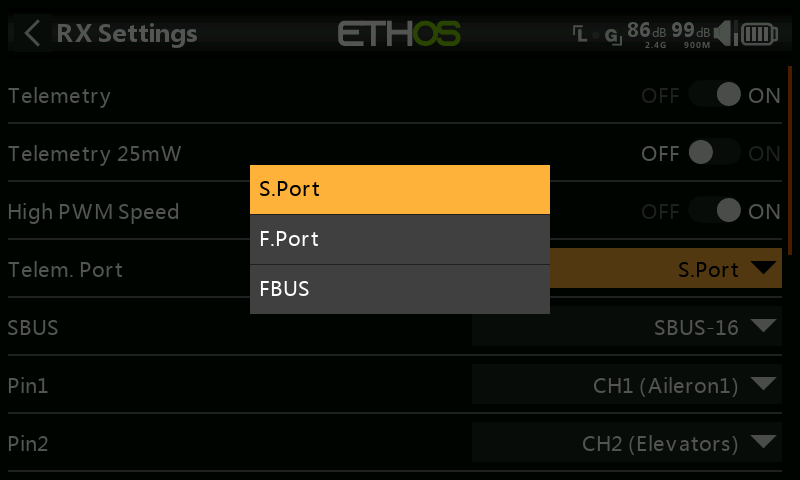

***Puerto***: Permite seleccionar el SmartPort en el receptor para su uso por cualquiera de los puertos S.Port, F.Port o por el protocolo FBUS (F.Port2). El protocolo F.Port se desarrolló con el equipo de Betaflight para integrar las señales separadas SBUS y S.Port. FBUS (F.Port2) también permite a un dispositivo Host comunicarse con varios dispositivos Slave en la misma línea. Para más información sobre el protocolo de puertos, consulta la explicación del protocolo en la web oficial de FrSky.

***SBUS****:* Permite seleccionar el modo de canal SBUS-16 o SBUS-24. Tenga en cuenta que todos los dispositivos SBUS conectados tienen que soportar el modo SBUS-24 para activar el nuevo protocolo. SBUS-24 es un desarrollo de FrSky del protocolo SBUS-16 de Futaba.

***Asignación de canales***: El cuadro de diálogo Opciones del receptor también ofrece la posibilidad de Reasignar canales a los pines del receptor.

##### Grabación de datos de vuelo

Proporciona un registro el estado de salud del receptor. incluido el reinicio al encenderse, el reinicio de los pines de salida y los resultados de la activación, el temporizador de vigilancia, la detección de bloqueo y la detección de caída de voltaje.

##### Compartir

La función Compartir proporciona la capacidad de mover el receptor a otra radio ACCESS que tenga un ID de Registro de Propietario diferente. Cuando se toca la opción Compartir, el LED verde del receptor se apaga.

En la radio de destino B, vaya a la sección Sistema RF y Receptor(es) y seleccione Vincular. Tenga en cuenta que el proceso Compartir omite el paso Registro en la radio B, ya que el ID de registro del propietario se transfiere desde la radio A. Aparecerá el nombre del receptor de la radio de origen. Seleccione el nombre, el receptor se vinculará y su LED se iluminará en verde.

Aparecerá el mensaje "Bind successful".

Pulse sobre OK. La radio B controla ahora el receptor. El receptor permanecerá vinculado a esta radio hasta que decida cambiarla.

Pulse el botón EXIT de Radio A para detener el proceso Compartir.

El receptor se puede volver a mover a la radio A haciendo el re-enlace con la radio A.

Nota: No necesita usar 'Compartir' si todas sus radios están usando el mismo ID de propietario / número de registro. Sólo tiene que poner la radio que desea utilizar en modo de enlace, encender el receptor, seleccionar el receptor en la radio y se enlazará con esa radio. Puede cambiar a otra radio de la misma manera. Es mejor mantener los mismos números de modelo de receptor al copiar los modelos.

##### Restablecer enlace

Si cambias de opinión sobre compartir un modelo, selecciona "Restablecer vinculación" para limpiar y restaurar tu vinculación. Reinicia el receptor y quedará vinculado a tu emisora.

##### Restablecimiento del receptor

Pulse sobre el botón Restablecer para restablecer los ajustes de fábrica del receptor y borrar el UID. El receptor no estará ya registrado en la X20/X20S.

#### Modo a prueba de fallos (Failsafe)

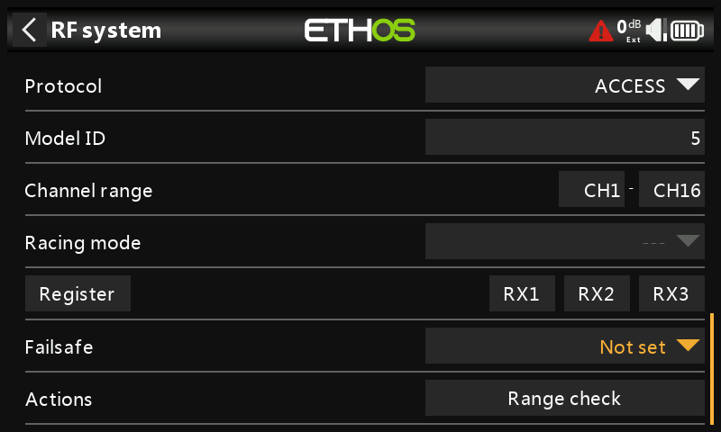

El modo a prueba de fallos determina lo que ocurre en el receptor cuando se pierde la señal del transmisor.

Pulse sobre el cuadro desplegable para ver las opciones de failsafe:

##### Mantener

Hold mantendrá las últimas posiciones recibidas.

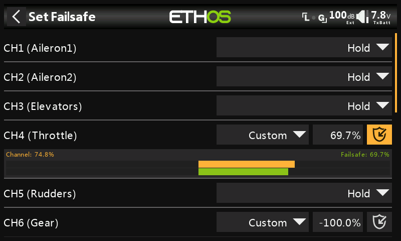

##### A medida (Custom)

Custom permite mover los servos a posiciones predefinidas personalizadas. La posición para cada canal puede definirse por separado. Cada canal tiene las opciones de No Fijar, Mantener, Personalizado o Sin Pulsos. Si se selecciona Personalizado, se muestra el valor del canal. Si se pulsa el icono fijado con una flecha, se utiliza el valor actual del canal. Alternativamente, se puede introducir un valor fijo para ese canal pulsando sobre el valor.

##### Sin pulsos (No Pulses)

Sin Pulsos desactiva los pulsos (para uso con controladores de vuelo que tienen GPS de retorno a casa en caso de pérdida de señal).

##### Receptor

La selección de "Receptor" en los receptores de la serie X o posteriores permite configurar la seguridad en el propio receptor.

***Advertencia***: Asegúrese de probar cuidadosamente los ajustes de Failsafe que elija, especialmente los canales que controlan el giroscopio en receptores estabilizados.

##### Comprobación de alcance

Se debe realizar una comprobación de alcance en el campo cuando el modelo esté listo para volar.

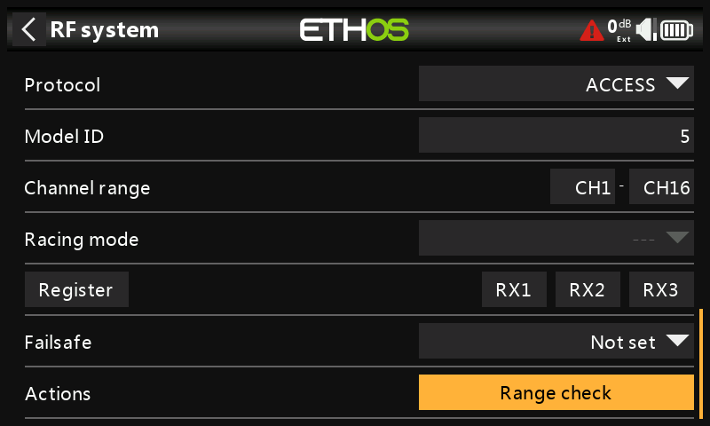

La comprobación de alcance se activa seleccionando "Range Check". Una alerta de voz anunciará 'Comprobación de alcance' cada pocos segundos para confirmar que se encuentra en el modo de comprobación de alcance. Una ventana emergente mostrará el número de receptor y los valores VFR% y RSSI para evaluar cómo se está comportando la calidad de recepción. Cuando la comprobación de alcance está activa, reduce la potencia del transmisor, lo que a su vez reduce el alcance para la comprobación de alcance. En condiciones ideales, con la radio y el receptor a 1 m del suelo, sólo debería obtener una alarma crítica a unos 30 m de distancia.

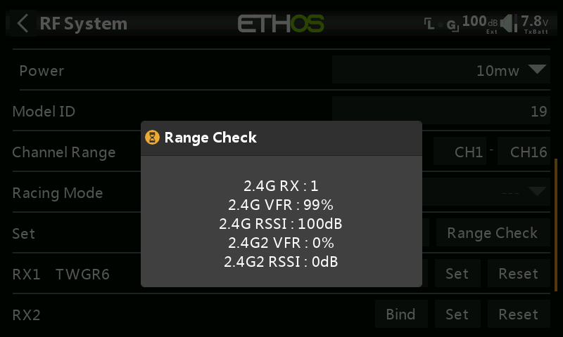

Actualmente el Modo TW con el modo de comprobación de alcance proporciona datos de comprobación de alcance para un receptor a la vez, mostrando ambos enlaces de 2.4G. Si tiene tres receptores registrados y vinculados como Receptor 1, 2 y 3, uno de los receptores será el receptor de telemetría activo y su número será mostrado por el sensor RX como 0, 1, o 2. Ese será el receptor que está enviando los datos RSSI y VFR. Si apaga ese receptor, el siguiente receptor se convertirá en el receptor de telemetría activo en una prioridad de 0, 1, y luego 2. Cada uno de los tres receptores puede ser comprobado apagando los otros receptores.

Sensor RX 0 = Receptor 1

Sensor RX 1 = Receptor 2

Sensor RX 2 = Receptor 3

Consulte también la sección Telemetría para obtener información sobre los valores [VFR y RSSI](#RSSI and VFR discussion).

#### Tipo: ELRS

El protocolo ELRS es compatible con el proyecto de código abierto Express LRS. ExpressLRS 2.4G pretende lograr un rendimiento integral tanto en velocidad como en latencia y alcance.

Si se usa un módulo ELRS de verdad (en lugar de un módulo TWIN Lite Pro con su RF modulada en modo ELRS) necesita instalar el correspondiente Script Lua en la carpeta script/elrs para que aparezca ELRS como un módulo opcional.

##### Número de canales

Se admiten doce canales. Consulte la sección Modo de conmutación a continuación para obtener más detalles sobre las opciones de configuración.

##### Ajuste - Configurar

##### Velocidad de los paquetes de información

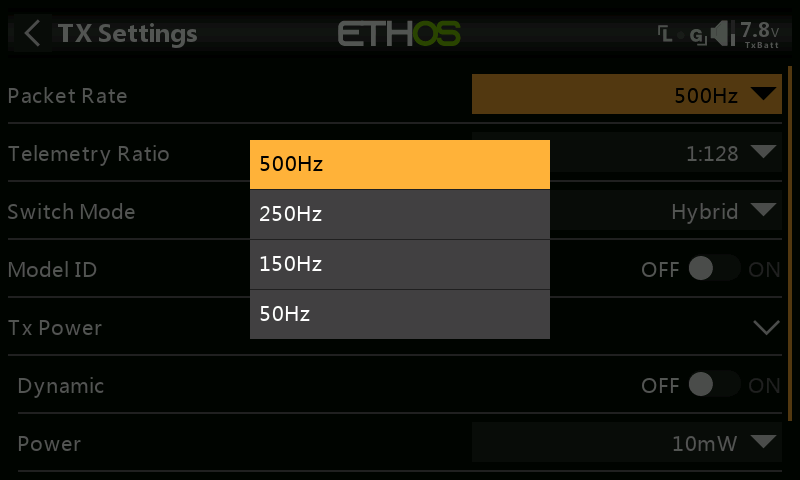

Al modificar la velocidad de refresco de los paquetes de información se permite alcanzar un compromiso entre alcance y latencia. A mayor velocidad de paquetes, menor latencia, pero a costa del alcance.

##### Ratio de telemetría

La relación de telemetría determina la frecuencia con la que se envían los datos de telemetría. Por ejemplo, 1:64 significa que los datos de telemetría se envían 1 vez cada 64 emisiones. Las opciones son 1:128, 1:64, 1:32, 1:16, 1:8, 1:4 y 1:1.

##### Modo de commutación (Switch Mode)

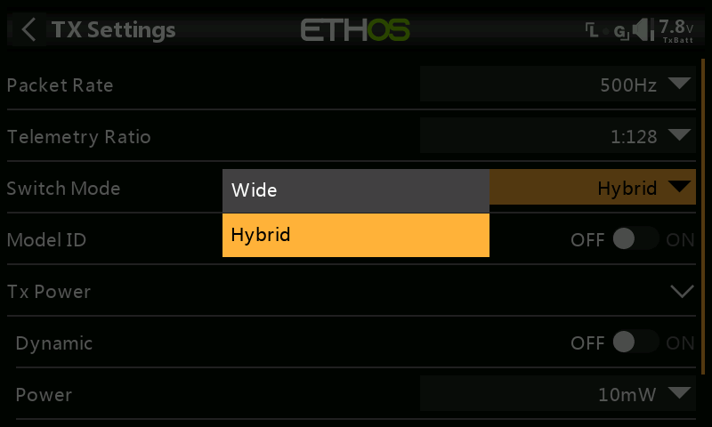

El ajustes del Modo de conmutación (‘Switch Mode’) controlan cómo se envían al receptor los canales AUX1-AUX8 (canales 5 a 12). Los 4 primeros canales principales son siempre de 10 bits. Las opciones son Híbrido y Ancho.

Con el modo “**Híbrido” (Hybrid)**, la mayoría de los canales sólo serán de 2 o 3 posiciones, esto se hace para reducir la latencia.

La opción **"Ancho”** (**Wide)** hace que tus canales sean de 64 o 128 bits, que es una resolución suficiente para la mayoría de las necesidades.

Tenga en cuenta que AUX1 (canal 5) está destinado al armado, por lo que siempre es de 2 posiciones. Posición baja (1000) para desarmar y posición alta (2000) para armar.

##### Coincidencia de modelo (Model Match)

Si está activada, la Coincidencia de modelo (‘Model Match’) garantiza que se ha seleccionado el modelo correcto.

##### Potencia de TX

##### Potencia Dinámica

Activando la opción Potencia Dinámica, se permite al sistema ajustar automáticamente la potencia de salida dependiendo del VFR y del RSSI, esto puede potencialmente ahorrar batería. Sin embargo, para ello debe tener activada la telemetría.

##### Potencia

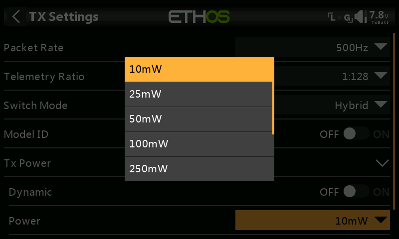

Los ajustes de potencia disponibles son 10mW, 25mW, 50mW, 100mW, 250mW, 500mW o 1000mW.

##### Telemetría ELRS

Las dos capturas de pantalla anteriores muestran los sensores típicos recibidos de un receptor ELRS.

### Tipo: PPM

El módulo RF externo puede funcionar en modo PPM.l Vaya a la sección de [Módulo externo](trainer.md) en Modelo / Entrenador para detalles sobre como configurar un entrenador esclavo usando PPM Out con el pin PXX OUT en la bahía del módulo externo.

##### Número de canales

Por defecto, se transmitirán los canales 1 al 8.

### Tipo: SBUS

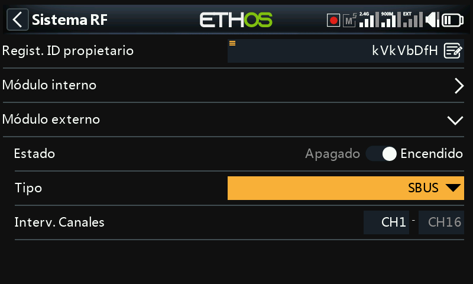

El módulo externo de RF puede operar en modo SBUS. Vaya a la sección [Módulo Externo](trainer.md) en Modelo / Entrenador para detalles para configurar un entrenador esclavo usando SBUS Out en el pin PXX OUT de la bahía del módulo externo.

##### Número de Canales

Por defecto, se transmitirán los canales 16 canales con SBUS.

### Tipo: Trainer master (PPM)

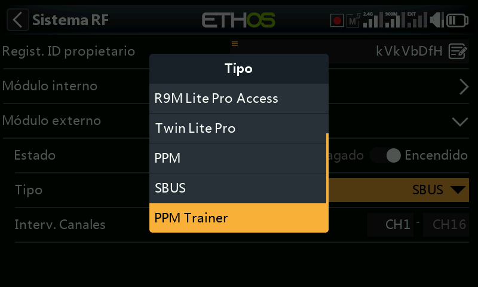

El módulo externo de radiofrecuencia se puede configurar para que opere como ‘Trainer master’ en modo PPM.

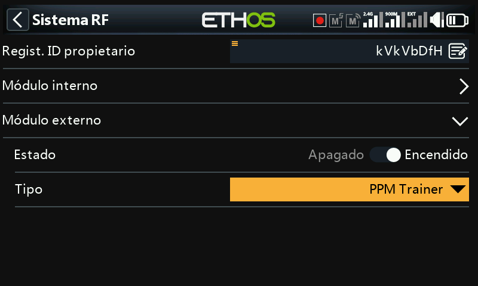

##### Configuración de Trainer master

Vaya a la sección de [Configuración del Trainer master](#Trainer master configuration) para detalles sobre configurar el modo Trainer master.

##### Conexiones del módulo externo

Consulte los detalles de conexión del módulo externo que se muestran a continuación para la opción SBUS (Trainer Master).  
  
De manera similar, la opción Trainer master (PPM) proporciona una entrada PPM en el pin PXX IN de la bahía del módulo externo, para ser utilizada con un receptor antiguo que tenga una salida CPPM, de manera similar a la opción SBUS que se muestra a continuación.

### Tipo: Trainer master (SBUS)

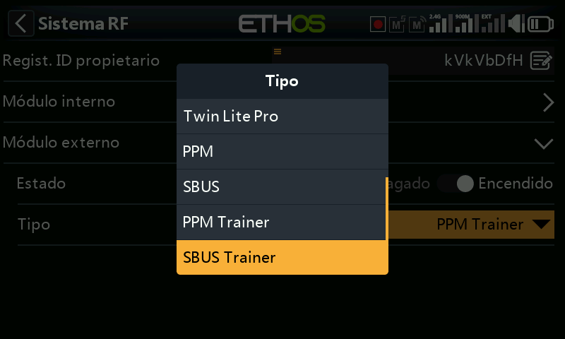

El módulo externo de RF se puede configurar para operar como ‘Trainer master’ en modo SBUS.

##### Configuración del Trainer master

Vaya a la sección [Configuración del Trainer master](#Trainer master configuration) para detalles de cómo configurar el modo Trainer master.

##### Conexiones en el módulo externo

Esta opción proporciona una entrada SBUS en el pin PXX IN en la bahía del módulo externo. Esto permite la instalación de un receptor FrSky con salida SBUS (por ejemplo, Archer RS o similar) en la bahía del módulo para actuar como el extremo receptor de un enlace de entrenador inalámbrico y conectar CUALQUIER radio FrSky al X20 como una caja de enlace (buddy box).

La radio esclava o del estudiante estará entonces vinculada a este receptor y transmitirá de manera normal. Mientras la función de entrenador maestro esté activa, se permite que los canales recibidos controlen el modelo.

##### Diagrama de pines del módulo externo

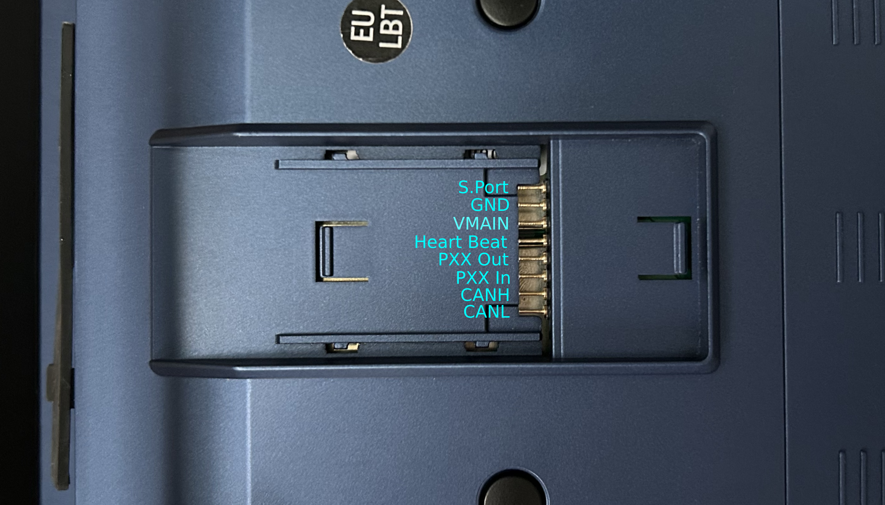

## Módulos externos de RF – Terceros

### Tipo

Actualmente se admiten los módulos RF externos Ghost, Multimodule, Express LRS y Crossfire. En el futuro se admitirán más módulos de terceros.

El soporte de módulos de terceros debe ser instalado manualmente por el usuario y se consigue instalando un script Lua que añade a ETHOS el soporte del módulo. Este mecanismo siempre será necesario para utilizar módulos de terceros y sus correspondientes scripts LUA estén instalados. La selección de módulos de terceros sólo aparecerán en la pantalla de RF una vez instalado el script Lua.

Por favor, consulte el post [Módulos externos de terceros](https://www.rcgroups.com/forums/showpost.php?p=49550649&postcount=18844) en el hilo X20 y Ethos en rcgroups para obtener más información, así como la sección  [scripts para módulos externos](../system-setup/file-manager.md) para obtener detalles sobre la ubicación para almacenar los scripts Lua para la instalación de módulos de terceros compatibles.

#### Multimódulos

Ethos soporta la actualización de firmware del módulo Multiprotocolo IRX4 Lite

Copie el archivo de firmware del módulo a la carpeta Firmware de la radio, use el administrador de archivos para navegar hasta el archivo. Una vez seleccionado vuelva a pulsar en él y seleccione ‘Flash external multimodule’. La actualización comenzará, con una barra mostrando su progreso.
