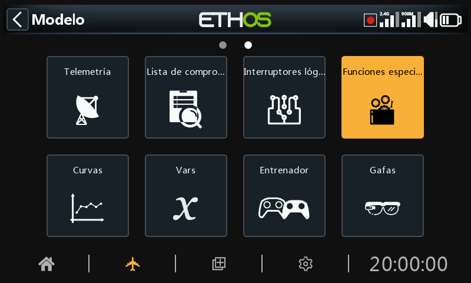
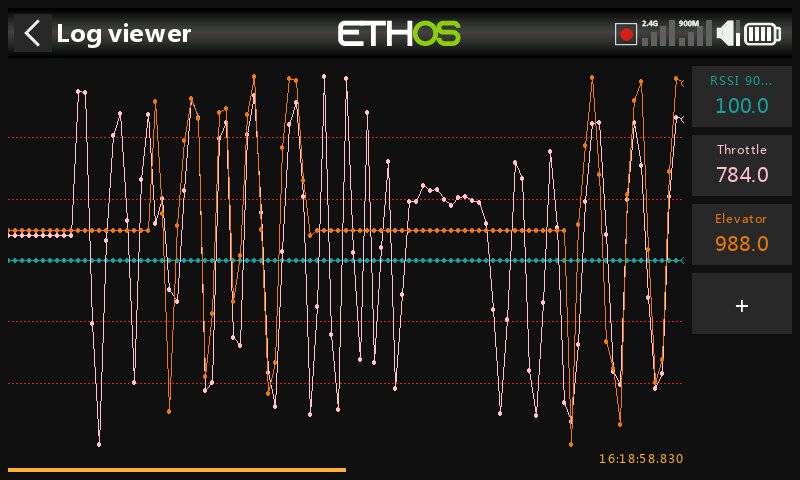

# Funciones especiales

Las Funciones Especiales pueden configurarse para reproducir valores, sonidos, etc. Se admiten hasta 100 funciones especiales.

No hay funciones especiales por defecto. Toque en el botón ‘+’ del menu vacío para añadir una función especial.

Una vez definidas las Funciones Especiales, al pulsar sobre una de ellas aparecerá el menú emergente anterior, que le permitirá editar, añadir, mover, copiar/pegar, clonar o eliminarla.

Al seleccionar "Mover" aparecerán las flechas que permiten desplazar la función especial hacia arriba o hacia abajo.

## Tipos de funciones especiales

Actualmente se admiten las siguientes Funciones Especiales:

- Restablecer
- Captura de pantalla
- Ajustar el Failsafe
- Reproducir audio
- Vibración
- Registros de datos
- Leer texto (sólo en X20 Pro)
- Ir a una página
- Bloquear la pantalla táctil
- Seleccionar un modelo
- Reproducir Vario

### Parámetros comunes de las funciones especiales

Los siguientes parámetros son comunes a todas las Funciones Especiales:

#### Estado

Habilita o deshabilita la función especial.

#### Condición activa

La función especial puede estar 'Siempre activada' o activarse mediante posiciones de interruptores, interruptores de función, modos de vuelo, interruptores lógicos, posiciones de trim o modos de vuelo.  
  
Para seleccionar el inverso, por ejemplo, del interruptor SG-arriba, si mantiene presionado Enter sobre el nombre del interruptor y selecciona la casilla Negativo en la ventana emergente, el valor del interruptor cambiará a !SG-arriba. Esto significa que la función especial estará activa cuando el interruptor SG no esté en la posición superior.

#### Global

Al seleccionar Global, la función especial se agrega a todos los modelos existentes y a cualquier nuevo modelo creado en el futuro. Si un modelo existente ya tiene la función, la función global se agrega como una nueva función. Desactivar la función global en cualquier modelo elimina la función de todos los modelos excepto del modelo seleccionado actualmente.  
  
Las funciones especiales globales se almacenan en el archivo radio.bin, mientras que las locales se almacenan en el archivo del modelo. Por lo tanto, sobreviven a la eliminación del modelo y no tienen concepto de ‘original’.

### Acción: Restablecer

#### 		Consulte también los 'parámetros comunes de las Funciones especiales' más arriba.

#### Restablecer

Se pueden restablecer las siguientes categorías:

- - Datos de vuelo: reinicia la telemetría y todos los cronómetros
- - Todos los Cronómetros: reinicia los 8 cronómetros.

- Toda la telemetría: restablece todos los valores de telemetría.

- Crono: los cronos también se pueden resetear individualmente.

Tenga en cuenta que seleccionando ‘Restablecer: Datos de vuelo’, ‘Restablecer: Telemetría completa’ y ‘Restablecer: Sensor de telemetría’ también se borrarán cualquier alerta de punto rojo de ‘sensor perdido’ o ‘conflicto de sensor’.  Por favor, consulte  [Alertas de sensor perdido / conflicto](#Sensor lost - conflict alerts).

### Acción: Captura de pantalla

Guardará una captura de pantalla en la ubicación:

SD Card (drive letter)/screenshots/ o

RADIO (drive letter)/screenshots/

#### 			Consulte también los 'parámetros comunes de las Funciones especiales' más arriba.

### Acción: Ajustar el failsafe

#### 			Consulte también los 'parámetros comunes de las Funciones especiales' más arriba.

#### Condición Activa

Cuando se activa, todos los valores actuales de los canales en el menú de Canales se copian a la configuración de failsafe y luego se envían al receptor, y después se reenvían aproximadamente cada 10 segundos.

Vea también los [Ajustes de failsafe](#Failsafe).

#### Módulo

Selecciona el ajuste del failsafe a través del módulo de RF interno o externos de la radio.

### Acción: Reproducir ***audio***

#### Esta función especial se utiliza para reproducir archivos de audio o el valor de fuentes seleccionadas usando un secuenciador. Se puede configurar una secuencia de hasta 100 comandos de 'Reproducir archivo' y/o 'Reproducir valor', los cuales se reproducirán en secuencia.

#### Consulte también los 'parámetros comunes de las Funciones especiales' más arriba.

#### Voz

Se pueden configurar hasta 3 voces distintas en Ethos. Seleccione la que quiera usar para escuchar el audio (‘Reproducir Audio’).

Vaya a la sección de [Eleccion de Voces](#Audio (Voices)) en los ajustes generales para más detalles sobre configuración de voces del sistema o personalizadas.

#### Prioridad

La opción ‘Prioridad’ de ‘Reproducir audio’ asegura que todas las ‘Alertas del sistema’ se reproducen immediatamente.

Las entradas de ‘Reproducir audio’ tienen una prioridad por defecto de 1. Por tanto, todas las alertas del sistema tendrán una prioridad de 0 interrumpirán todas las alertas que tengan menor prioridad (por ejemplo, un número mayor).

#### Repetir

El valor puede reproducirse una vez, o repetirse con la frecuencia introducida aquí, con una duración de hasta 10 minutos.

#### Saltar al inicio

Si se activa, el audio de voz no se reproducirá al encenderse la radio.

#### Restablecer

Cuando se activa, si una secuencia está en (o alcanza) una ‘Duration de espera’ o estado ‘Condición de espera’, la secuencia se restablecerá. Si la ‘Condición activa’ es todavía Verdadera, la secuencia se volverá a repetir.

#### Secuencia

#### 	Consulte también los 'parámetros comunes de las Funciones especiales' más arriba.

Se puede configurar una secuencia de hasta 100 líneas de ‘Reproducir Audio’ y/o ‘Reproducir valor’, que se reproducirán secuencialmente.

Las opciones disponibles son:

##### Reproducir fichero

‘Reproducir Fichero’ reproducirá el archivo de audio seleccionado.

Vaya a la sección de [Elección de Voces](#Choice of Voices) para detalles de sonidos de usuario, elegir las voces a usar, la localización de los archivos, etc.

##### Reproducir valor

‘Reproducir valor’ reproducirá el valor de la fuente seleccionada. La fuente puede ser cualquiera de las siguientes:

- Analógica, es decir palancas, pots o sliders
- Interruptores
- Interruptores lógicos
- Compensadores
- Canales
- Giróscopo
- Reloj del sistema (hora)
- Entrenador
- Cronómetros
- Telemetría

##### Tiempo de espera

‘Tiempo de espera’ introducirá un retraso en la reproducción del valor, por el tiempo introducido, de hasta 10 minutos.

##### Condición de espera

‘Condición de espera’ pausará la reproducción del valor, hasta que se cumpla la condición de espera.

#### Ejemplos

En el ejemplo de arriba, la condición activa es el interruptor lógico VFRlow. Cuando se active, se usa ‘Reproducir Fichero’ para reproducir un archivo de sonido muy bajo de VFR, llamado ‘vfrlow.wav’, que va seguido de otro ‘Reproducir valor’ que reproduce el valor mínimo de VFR que se ha grabado (por Telemetría).

El ejemplo muestra cómo se usa la ‘Condición de espera’ para pausar la secuencia hasta que el interruptor SH se mueva a la posición más baja.

#### Administración de secuencias

Tocando en una línea de la secuencia se obtiene un cuadro de diálogo que le permite editarla, añadir una nueva, mover la línea hacia arriba o abajo, o borrarla.

### Acción: Vibración (Haptic)

Esta Función Especial asigna vibración háptica a una acción.

#### 	Consulte también los 'parámetros comunes de las Funciones especiales' más arriba.

#### Patrón

Establece el patrón de vibración háptica. Las opciones son simple, doble, triple, quíntuple y muy breve.

#### Fuerza

Seleccione la intensidad de la vibración háptica, entre 1 y 10. El valor predeterminado es 5.

#### Repetir

La vibración puede ejecutarse una vez o repetirse con la frecuencia introducida aquí.

#### Seleccionar motores de vibración

##### Las emisoras X20 Pro AW y X20RS tienen opcionalmente la capacidad de programar vibración para en las palancas.

##### Tenga en cuenta que las emisoras X20 Pro y X20R pueden actualizarse también mediante la instalación de motores de vibración MC20R en las palancas. Vaya a la sección ‘[Habilitar actualización para vibración en los gimbal](#Enabling haptic gimbal upgrades)’ para activar esa opción.

##### Se pueden seleccionar las siguientes opciones:

- Vibración en la palanca derecha

### Acción: Escribir registros

Esta función especial se utiliza para configurar en un archivo .csv, el registro periódico de palancas/potenciómetros/deslizadores, interruptores, interruptores lógicos y valores de canales.

Los archivos de registro se almacenan en formato '.csv' en la carpeta 'Logs' de la tarjeta SD o eMMC. La hora y la fecha del RTC se registran con los datos, y es importante para dar sentido a los datos mediante la separación de los datos de registro en sesiones.

#### 	Consulte también los 'parámetros comunes de las Funciones especiales' más arriba.

#### Intervalo de escritura

El intervalo de escritura de los registros es ajustable por el usuario entre 100 y 500 ms.

#### Palancas/Pots/Sliders

Permite el registro de Palancas/Pots/Sliders.

#### Interruptores

Activa el registro de los interruptores.

#### Interruptores lógicos

Activa el registro de los interruptores lógicos.

#### Canales

Activa el registro de los canales enviados al módulo de RF.

#### Visor de registros

Para visualizar los archivos de registro, navegue a la carpeta /Logs de la tarjeta eMMC o SD usando el File Explorer, seleccione el archivo deseado y seleccione ‘abrir’.

1. El archive se leerá a la memoria, pero se puede cancelar la operación mientras se está leyendo.

2. Seleccione los canales que se van a ver en el RHS. En el ejemplo, se han seleccionado los canales del motor y el elevador. La RSSI se selecciona por defecto.

El botón \[DISP\] mueve el foco al primer botón de la columna de la derecha.

3. La pantalla se puede ampliar con el selector rotatorio o moviendo el dedo hacia la derecha o izquierda. La pantalla de arriba se ha expandido hacia la izquierda para compararse con la anterior.

4. La pantalla se puede ampliar o alejar girando el selector rotatorio mientras se presiona la techa \[page\].

### Acción: Reproducir Texto (Sólo en X20 Pro)

Esta función especial utiliza un procesador interno TTS (Text-To-Speech) para generar la lectura de un texto definido por el usuario, en lugar de seleccionar un archivo .wav grabado anteriormente.

#### 	Consulte también los 'parámetros comunes de las Funciones especiales' más arriba.

#### Texto

El usuario especifica el texto que se va a convertir en audio y se va a reproducir. Si se usan letras mayúsculas, se deletrearán las letras una a una, por ejemplo ‘OFF’ se reproducirá como O-F-F. Si se usan minúsculas el TTS reproducirá la palabra ‘off’.

#### Repetir

El texto se puede reproducir una vez o repetirse con la frecuencia que se introduzca aquí.

#### Saltar al inicio

Si se habilita, no se reproducirá el texto al encender la radio.

### Acción: Ir a la Página

Esta función especial cambiará la pantalla a una página seleccionada.

#### 	Consulte también los 'parámetros comunes de las Funciones especiales' más arriba.

#### Página

Selecciona la página de la radio que se quiere mostrar.

Las pantallas de destino pueden ser las de cualquier Modelo, Sistema, Configurar pantallas, Principal, o Grabación de datos de vuelo, para el receptor seleccionado.

### Acción: Blocar pantalla táctil

Esta función especial blocará la pantalla táctil de la radio para prevenir su operación inadvertida.

Tenga en Cuenta que ‘lock touchscreen’ se puede también activar presionando \[ENT\] y \[Page\] simultáneamente por 1 segundo en la pantalla de inicio.

#### 	Consulte también los 'parámetros comunes de las Funciones especiales' más arriba.

### Acción: Seleccionar modelo

Esta función especial seleccionará un modelo específico cuando se cumplan unas condiciones determinadas.

#### 	Consulte también los 'parámetros comunes de las Funciones especiales' más arriba.

#### Modelo

Seleccione el modelo que se desea seleccionar.

#### Confirmación

Seleccione esta opción si desea que se le pida confirmación antes de seleccionar el modelo.

### Acción: Reproducir vario

Permite seleccionar una fuente de vario.

El valor por defecto que se usa en los varios de Frsky es normalmente el sensor de VSpeed, pero se puede usar cualquier otro sensor que use m/s como unidad de medida.

Una vez que se selecciona la fuente, aparecerán los parámetros ‘Rango’ y ‘Centro’.

#### Rango

Los valores por defecto para la subida o bajada son de +/- 10m/s, pero este valor puede incrementarse hasta +/- 100m/s.

Cuando el régimen de subida está por encima del valor de centrado (más abajo) el tono de los pitidos del vario se incrementa linealmente hasta que se alcanza al máximo valor de Rango. El tono del pitido a su máximo régimen de subida puede configurarse en los ajustes de sonidos, en la sección [Vario](../system-setup/general.md).

El tono se hará continuo cuando el régimen de subida esté cayendo. El tono del pitido decrecerá linealmente hasta que se alcance el mínimo régimen de bajada.

#### Centro

El régimen por defecto que define un régimen cero de subida o bajada es de +/- 0.3m/s, pero puede incrementarse hasta +/- 2m/s.

El pitido del Vario será continuo cuando el régimen de subida esté entre esos valores centrados. El tono del sonido a régimen cero puede configurarse en la sección [Vario](../system-setup/general.md) de los Ajustes de Audio.

Los pitidos pueden silenciarse seleccionando ‘Silencio’ (‘Silent’) En lugar de ‘pitido’ (‘Beep’).
