# Funciones especiales

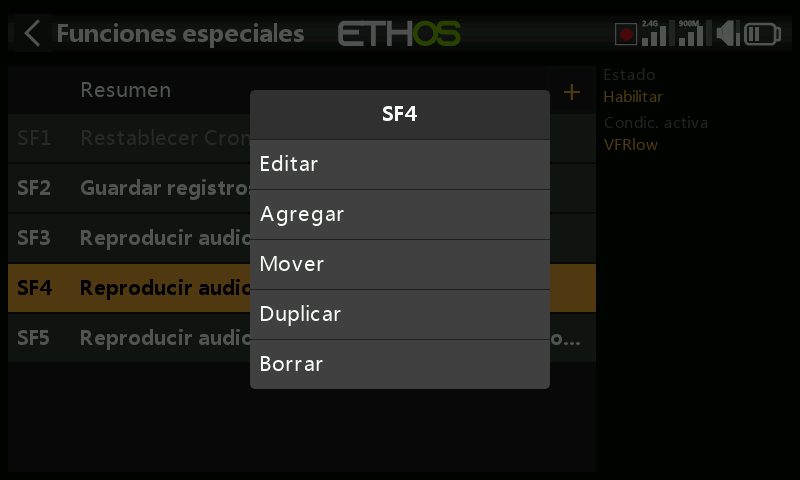

Las funciones especiales activan una acción —reproducir audio, capturar la
pantalla, escribir registros, respuesta háptica y más— cuando una condición
se cumple. Se admiten hasta 100; por defecto no existe ninguna. Añada una
con **+**; toque una existente para **Editar**/**Mover**/**Copiar-pegar**/
**Clonar**/**Eliminar**.

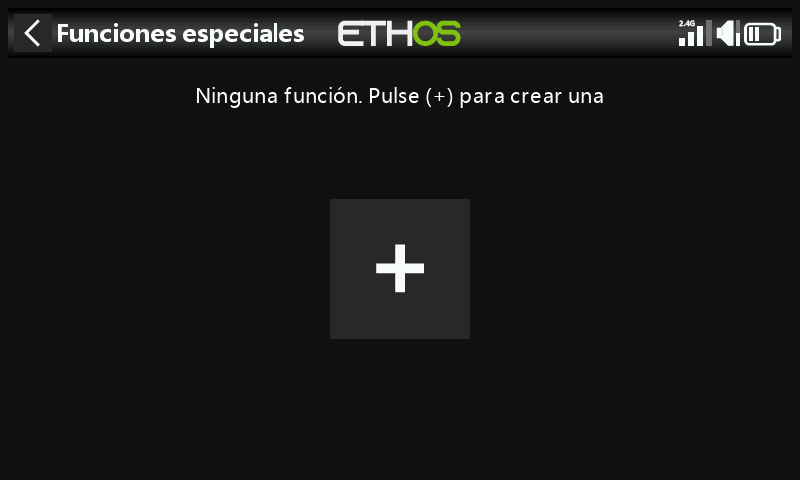
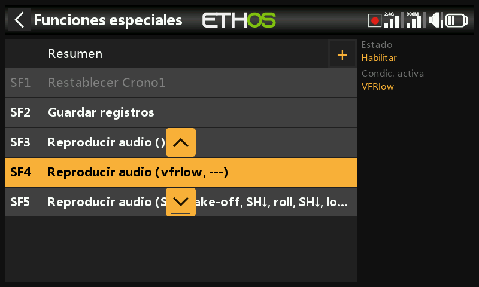

## Campos comunes a todas las acciones

- **Estado** — activa/desactiva esta función sin eliminarla.
- **Condición activa** — **Siempre activa**, o condicionada por posiciones
  de interruptor/interruptor de función/interruptor lógico/trim o por fases
  de vuelo. Mantenga pulsado `ENT` sobre un interruptor y marque
  **Negativo** para invertirlo (por ejemplo, `SG-up` se convierte en
  `!SG-up`, activo siempre que SG *no* esté arriba).
- **Global** — añade esta función a **todos** los modelos, existentes y
  futuros. Si un modelo ya tiene una función local configurada de forma
  idéntica, Global la añade como una entrada adicional; al desactivar Global
  de nuevo se elimina de todos los modelos excepto del actualmente
  seleccionado. Las funciones globales residen en `radio.bin`; las locales
  residen en el archivo del modelo.

## Acciones {: #actions }

**Reiniciar** — reinicia los **Datos de vuelo** (telemetría + temporizadores),
**Todos los temporizadores** o **Toda la telemetría**.

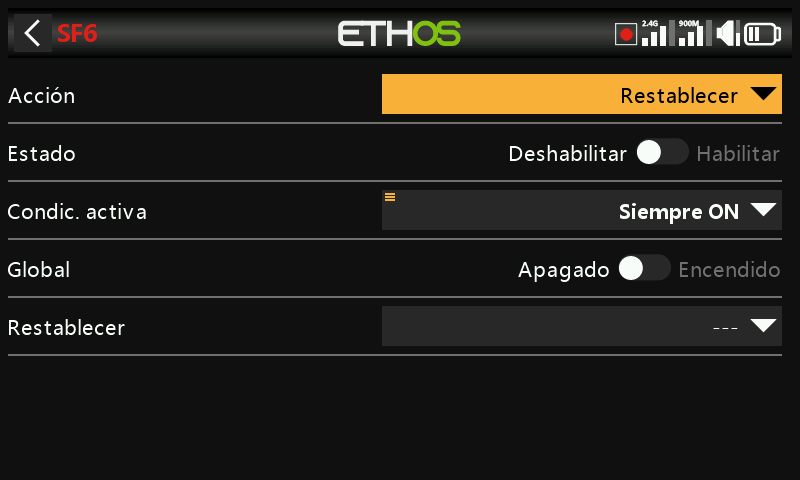

**Captura de pantalla** — guarda una captura de pantalla en `screenshots/`
de la SD card/eMMC.

**Establecer failsafe** — captura las posiciones actuales de los canales
como failsafe, a través del **Módulo** de RF interno o externo.

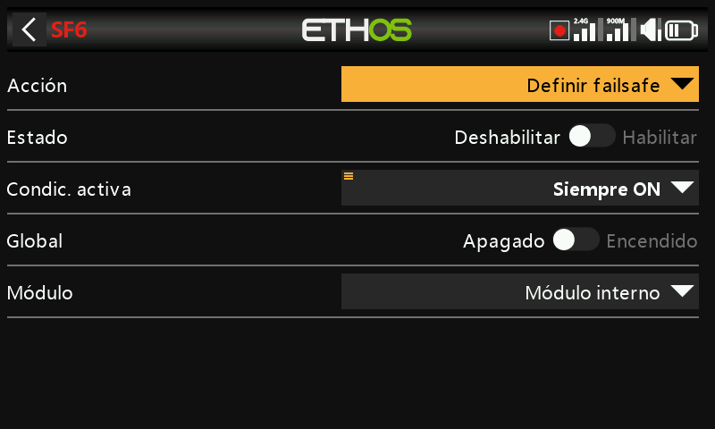

**Reproducir audio** — la acción más completa, que admite una secuencia
entera:

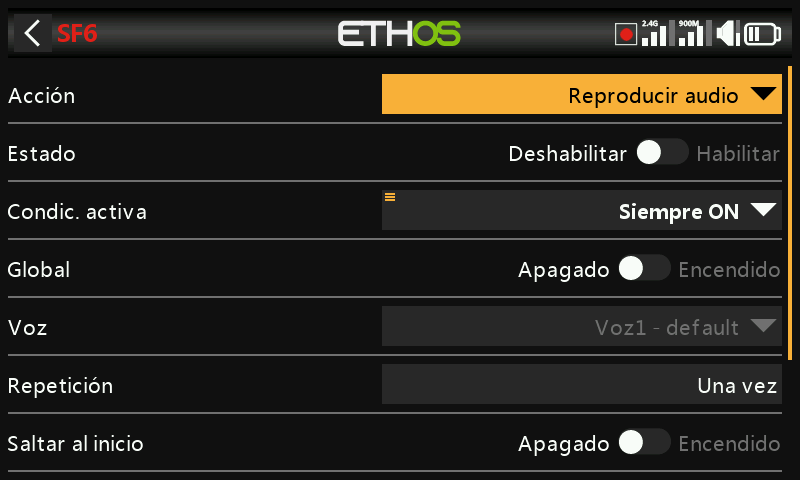

- **Voz** — cuál de las hasta 3 voces configuradas se utilizará (consulte
  [General](../system-setup/general.md#audio-settings)).
- **Repetir** — reproducir una vez o repetir a un intervalo configurable
  (hasta 10 minutos).
- **Omitir al arrancar** — evita que esta función se dispare durante el
  arranque.
- **Secuencia** — hasta 100 pasos, cada uno de ellos:

  - **Reproducir archivo** — reproduce un archivo de audio elegido.

    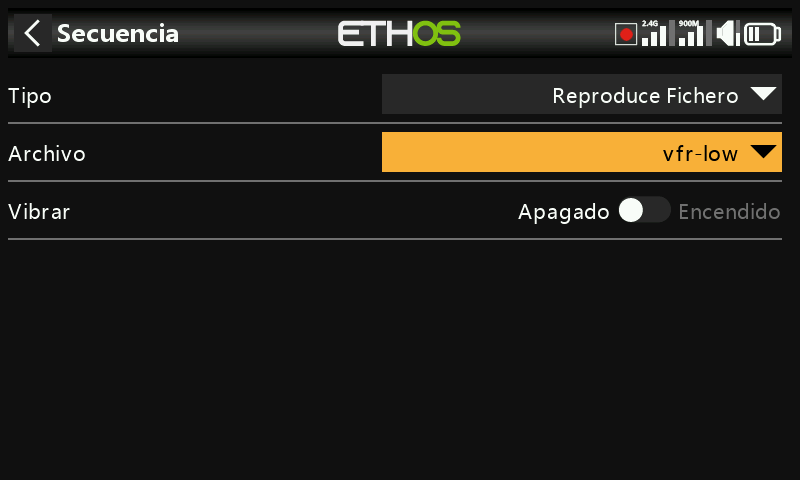

  - **Reproducir valor** — enuncia el valor de una fuente: analógicos,
    interruptores, interruptores lógicos, trims, canales, giróscopo, reloj
    del sistema, entrenador, temporizadores o telemetría.

    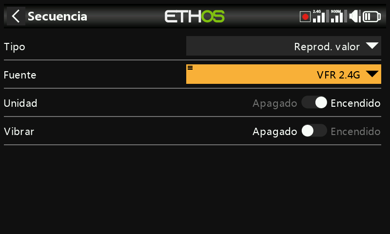

  - **Esperar duración** — una pausa fija, de hasta 10 minutos.
  - **Esperar condición** — pausa la secuencia hasta que se cumpla una
    condición.

  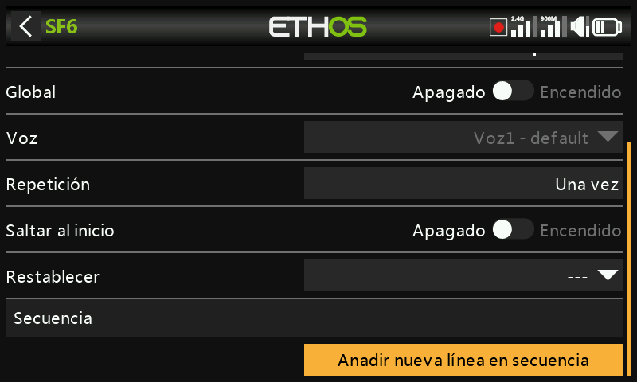
  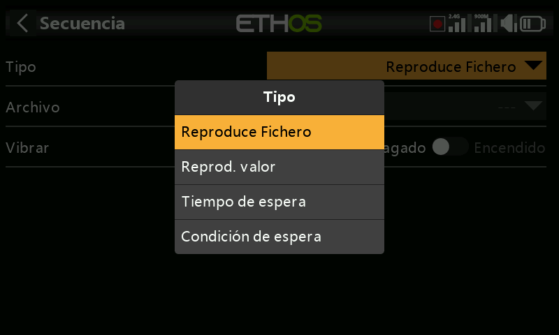

  Por ejemplo: reproducir `vfrlow.wav` cuando el interruptor lógico
  `VFRlow` se active, y a continuación enunciar el valor mínimo de VFR
  registrado —

  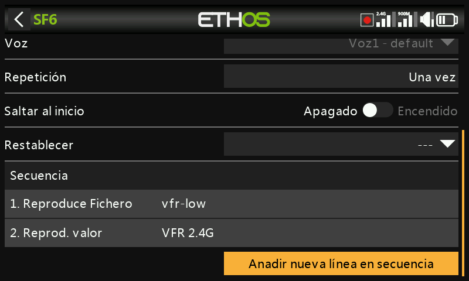

  — o pausar una secuencia hasta que el interruptor SH se mueva hacia abajo
  antes de continuar:

  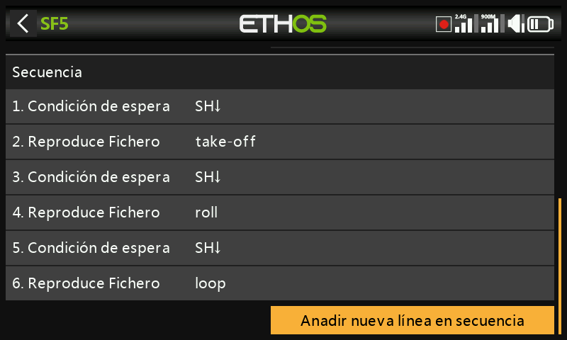

  Toque cualquier línea de la secuencia para editarla, añadir, reordenar o
  eliminarla:

  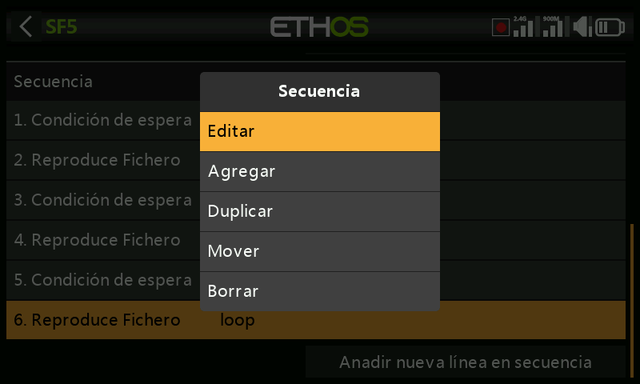

**Háptico** — respuesta por vibración:

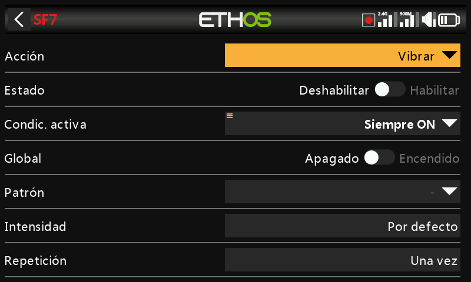

- **Patrón** — simple, doble, triple, quíntuple o muy breve.

  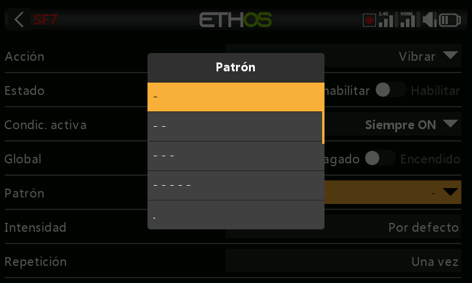

- **Intensidad** — 1–10 (por defecto 5).
- **Repetir** — una vez o a un intervalo determinado.
- **Seleccionar motores hápticos** — en emisoras con motores hápticos en los
  gimbals (X20 Pro AW, X20RS, o una X20 Pro/X20R mejorada con gimbals MC20R
  — consulte
  [Hardware](../system-setup/hardware.md#radio-specific-hardware-options)):
  **Por defecto** (háptico interno), **Todos los motores**, **Stick
  izquierdo** o **Stick derecho**.

  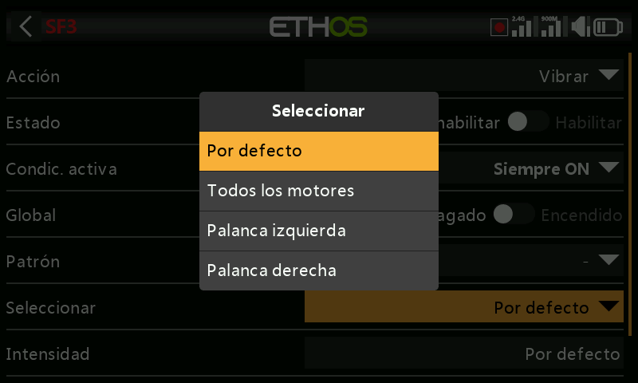

**Escribir registros** — escribe registros `.csv` en `Logs/` de la SD
card/eMMC, con marca de tiempo del RTC (esencial para distinguir después
unas sesiones de vuelo de otras):

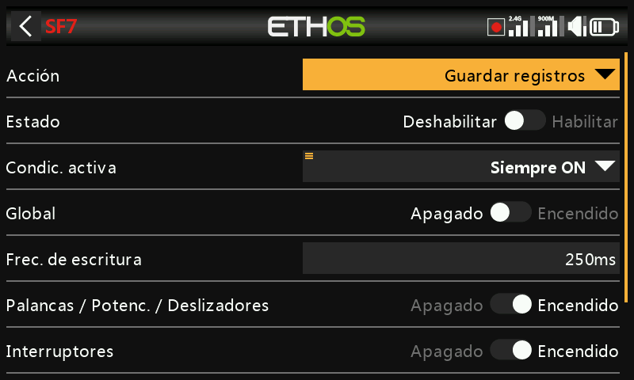

- **Intervalo de escritura** — 100–500 ms.
- **Sticks/Potenciómetros/Deslizadores**, **Interruptores**, **Interruptores
  lógicos**, **Canales** — categorías de registro que se activan de forma
  independiente.

  **Visualización de los registros**: abra un archivo de registro desde
  `/Logs` en el Administrador de archivos. Elija qué canales representar
  (RSSI está seleccionado por defecto); desplácese con el codificador
  rotativo o con un deslizamiento del dedo, y haga zoom girando el
  codificador mientras mantiene pulsado `PAGE`. `DISP` traslada el foco al
  primer botón de la columna derecha.

**Reproducir texto** (solo X20 Pro) — síntesis de voz en el propio equipo en
lugar de un archivo pregrabado:

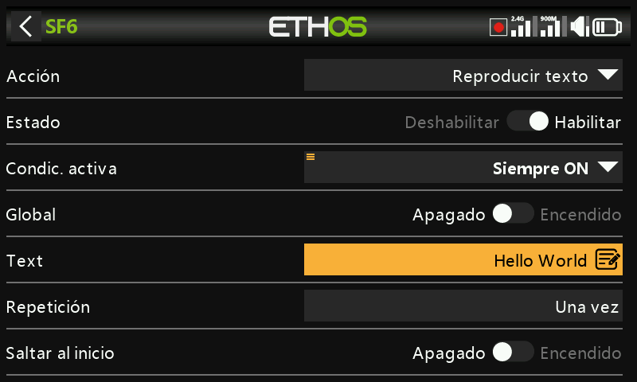

- **Texto** — la cadena que se enunciará. TODO EN MAYÚSCULAS se deletrea
  letra por letra (por ejemplo, "OFF" → "O-F-F"); en minúsculas se pronuncia
  como palabra ("off").
- **Repetir**, **Omitir al arrancar** — como arriba.

**Ir a pantalla** — cambia la visualización a una pantalla elegida, por
ejemplo para saltar al registro de datos de vuelo de un receptor cuando se
pulsa un botón:

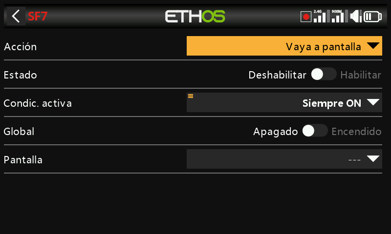
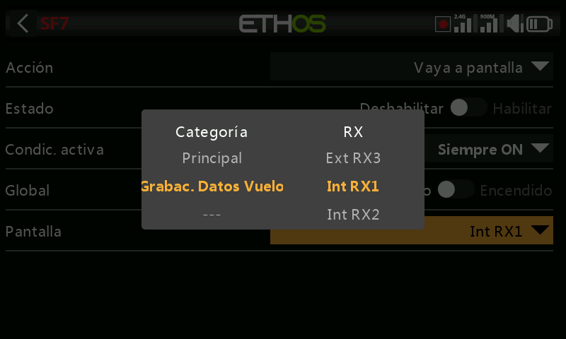

**Bloquear pantalla táctil** — bloquea la pantalla táctil frente a entradas
involuntarias (también accesible directamente manteniendo pulsados `ENT` +
`PAGE` juntos durante 1 s desde la pantalla de inicio):

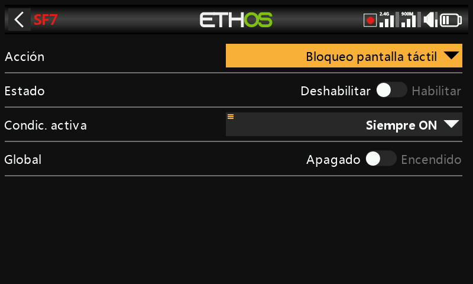

**Cargar modelo** — carga un **Modelo** especificado cuando se activa, con
un aviso de **Confirmación** opcional antes de realizar el cambio:

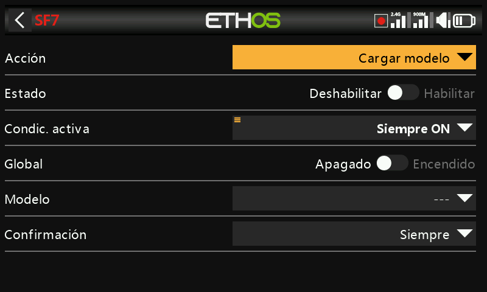

**Reproducir vario** — genera el audio del vario a partir de una fuente
elegida (normalmente el sensor VSpeed de un vario FrSky, aunque funciona
cualquier sensor con unidades m/s):

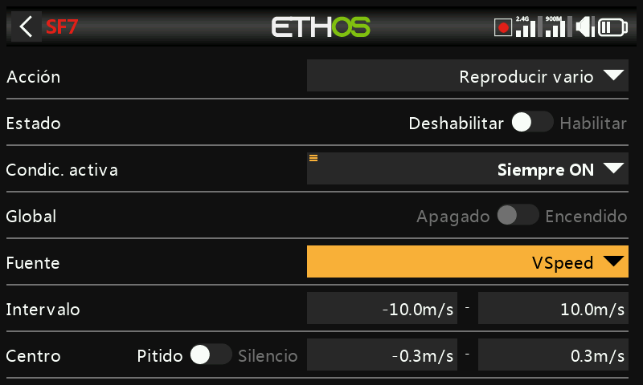

- **Rango** — tasa de ascenso/descenso asignada al tono, por defecto
  ±10 m/s (hasta ±100 m/s). Por encima de **Centro**, el tono sube
  linealmente con la tasa de ascenso hasta el valor máximo del Rango (el
  tono de tasa máxima se ajusta en [General →
  Vario](../system-setup/general.md#vario)); al descender se emite un tono
  continuo cuyo tono desciende hacia el valor mínimo del Rango.
- **Centro** — la banda de "ascenso cero", por defecto ±0,3 m/s (hasta
  ±2 m/s); dentro de ella el tono es constante (el tono de tasa cero también
  se ajusta en General → Vario). Cambie **Pitido**→**Silencio** para silenciar
  el tono por completo.

  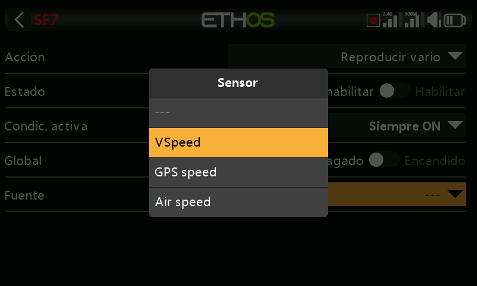
