# Telemetría

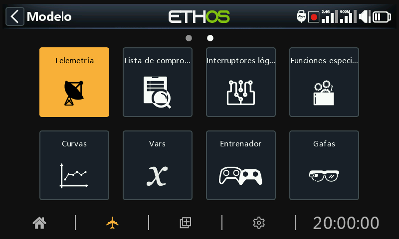

FrSky ofrece un sistema de telemetría muy completo. La potencia de la telemetría ha elevado el hobby de RC a un nivel completamente nuevo, y permite mucha más sofisticación y una experiencia mucho más satisfactoria.

## Telemetría a través de Smart Port (Smart Port telemetry)

De serie, los sensores de FrSky tienen un diseño que no necesita de un hub. Smart Port (S.Port) utiliza un bus físico de tres hilos compuesto por Gnd, V+ y Señal. Los dispositivos de telemetría S.Port se encadenan entre sí en cualquier secuencia si se conectan al S.Port receptores compatibles con las series X, S y posteriores. El receptor puede lograr una comunicación semi-dúplex a una velocidad de 57600bps (F.Port y FBUS son más rápidos) con muchos dispositivos compatibles a través de esta conexión con poca o ninguna configuración manual.

### ID Física Yphysical ID)

Smart Port admite hasta 28 nodos, incluido el receptor host. Cada nodo debe tener una ID física única para garantizar que no haya conflictos en la comunicación. Las ID físicas pueden oscilar entre 00 hex y 1B hex (entre decimal 00 y 27).

| Dec. | Hex | ID física por defecto |  | Dec. | Hex | ID física por defecto |
| --- | --- | --- | --- | --- | --- | --- |
| 00 | 00 | Vario | 14 | 0E |  |  |
| 01 | 01 | FLVSS | 15 | 0F |  |  |
| 02 | 02 | Actual | 16 | 10 | SD1 |  |
| 03 | 03 | GPS | 17 | 11 |  |  |
| 04 | 04 | RPM | 18 | 12 | VS600 |  |
| 05 | 05 | SP2UART (Host) | 19 | 13 |  |  |
| 06 | 06 | SP2UART (Remoto) | 20 | 14 |  |  |
| 07 | 07 | FAS-xxx | 21 | 15 |  |  |
| 08 | 08 | TBD(SBEC) | 22 | 16 | Suite Gas |  |
| 09 | 09 | Air speed | 23 | 17 | FSD |  |
| 10 | 0A | ESC | 24 | 18 | Gateway |  |
| 11 | 0B |  | 25 | 19 | Bus redundante |  |
| 12 | 0C | Servo XACT | 26 | 1A | SxR |  |
| 13 | 0D |  | 27 | 1B | Bus Master |  |

La tabla anterior lista los Physical IDs por defecto de los dispositivos FrSky S.Port. Tenga en cuenta que si tiene más de uno de cualquiera de ellos, el ID Físico de los dispositivos duplicados debe cambiarse para asegurar que cada dispositivo de la cadena S.Port tiene un ID Físico único.

### Identidad de Aplicación

Nota: Para aplicaciones especiales, es posible tener sensores con la misma ID de Aplicación y distinta ID Física, siempre y cuando los avisos de detección de conflictos entre sensores estén deshabilitados. Vaya a la sección de [Avisos de conflictos entre sensores](#Sensor conflict warning) de ‘Cómo hacer’ para deshabilitar esos avisos.

|  |  |  |
| --- | --- | --- |
|  |  |  |
|  |  |  |
|  |  |  |
|  |  |  |
|  |  |  |
|  |  |  |
|  |  |  |
|  |  |  |

1. a) Un dispositivo puede tener más de un rango de ID de aplicación; véase, por ejemplo, el sensor de corriente anterior.
2. b) Cuando dos receptores redundantes tienen sus puertos de telemetría S.Port conectados, entonces los paquetes para un sensor en particular recibidos por cualquiera de los receptores se fusionarán incluso si el receptor redundante está en una banda o módulo diferente.

### Características principales del S.Port :

Cada valor recibido a través de la telemetría se trata como un sensor independiente, que tiene sus propias propiedades, tales como

- El valor del sensor
  - El número de identificación física del puerto S.Port y el ID de datos (también conocido como ID de aplicación)
  - El nombre del sensor (editable)
  - La unidad de medida
  - La precisión en decimales
  - Opción de registro en la tarjeta SD o eMMC

El sensor también registra su valor mínimo/máximo.

Como ya se ha mencionado, se pueden conectar más de un sensor del mismo tipo, pero el ID Físico debe cambiarse en la Configuración de Dispositivo (o usando la aplicación FrSky Airlink o el programador de servo SBUS SCC) para asegurar que cada sensor en la cadena S.Port tiene un ID Físico único. Ejemplos son un sensor para cada célula en una Lipo de 2 x 6S, o la monitorización de amperajes individuales de motor en un modelo multi motor.

El mismo sensor puede duplicarse, por ejemplo, con diferentes unidades o para su uso en cálculos como la altitud absoluta, la altitud sobre el punto de partida, la distancia, etc.

Cada sensor puede resetearse individualmente con una función especial, por lo que por ejemplo se puede restablecer el desplazamiento de altitud a su punto de partida sin perder todos los demás valores mín./máx.

Los sensores FrSky, una vez configurados, son auto descubiertos cada vez que se enciende todo el sistema. Sin embargo, cuando se instalan por primera vez, deben "descubrirse" manualmente para que el sistema los reconozca.

Los sensores de telemetría pueden ser:

- Reproducidos con anuncios de voz
- Usados en sensores calculados
- Utilizados en interruptores lógicos para alertas, etc.
- Usados en vars
- Utilizados en mezclas para acciones proporcionales
- Mostrados en pantallas personalizadas de telemetría
- Vistos directamente en la página de configuración de telemetría sin tener que configurar una pantalla de telemetría personalizada.

Las pantallas se actualizan cuando se reciben los datos o se detectan pérdidas de comunicación con el sensor.

## Control y telemetría FBUS

El protocolo FBUS (antes F.Port 2.0) es un protocolo mejorado que integra SBUS para control y S.Port para telemetría en una sola línea. Este nuevo protocolo permite que un dispositivo anfitrión se comunique en una línea con varios accesorios esclavos. Por ejemplo, los servos FBUS se controlan a través de una conexión en cadena y al mismo tiempo envían la telemetría del servo al receptor a través de la misma conexión. Todos los dispositivos FBUS conectados a un receptor ACCESS (Host) pueden ser configurados inalámbricamente desde la radio en este protocolo.

La velocidad de transmisión FBUS es de 460.800 bps, mientras que F.Port era de 115.200 y S.Port de 57.600 bps. Este hecho por sí solo hace que los tres protocolos sean incompatibles entre sí.

## Características de la telemetría en ACCESS

La telemetría de receptor único con ACCESS funciona de la misma manera que antes con ACCST.

### Telemetría Multi-receptor

- Registre y vincule los receptores (consulte Configuración del modelo.
- Conecte el sensor y el receptor Smart Ports en cadena.
- Descubra nuevos sensores (consulte los ajustes de  [Telemetría](#Telemetry settings)) y compruebe cuidadosamente que la conmutación del Smart Port funciona correctamente.

La fuente de telemetría cambiará automáticamente en función del RX activo. El sensor interno RX muestra el ID del RX activo que está enviando telemetría, por ejemplo, RX1, RX2 o RX3.

Cuando cambia la fuente de telemetría del receptor, la vinculación de los puertos S.Port del receptor continuará automáticamente con la telemetría de los sensores externos conectados a los puertos S.Port. Sin embargo, tenga en cuenta que no enlaza los sensores internos del receptor. Los datos de los sensores RSSI, VFR, RxBatt, ADC2 y RX(n) se envían para el receptor fuente, por lo que sí cambian dependiendo de la fuente.

La telemetría simultánea de los tres receptores se desarrollará más adelante. Se esperan nuevos avances en este campo.

### Tipos de sensores:

#### 1. Sensores internos

Las radios y receptores FrSky incorporan funciones de telemetría para controlar la intensidad de la señal que recibe el modelo.

Indicador de intensidad de la señal del receptor (RSSI): Valor transmitido por el receptor de tu modelo a tu emisora que indica la intensidad de la señal que está recibiendo el modelo. Se pueden configurar avisos para que te avise cuando caiga por debajo de un valor mínimo, indicando que estás en peligro de volar fuera de alcance. Entre los factores que afectan a la calidad de la señal se encuentran las interferencias externas, una distancia excesiva, antenas mal orientadas o dañadas, etc.

Las alarmas por defecto para los modos ACCESS, TD y TW son 35 para 'RSSI Bajo' y 32 para 'RSSI Crítico'. La pérdida de control se producirá cuando el RSSI caiga a alrededor de 28.

##### Alerta individual de RSSI por banda

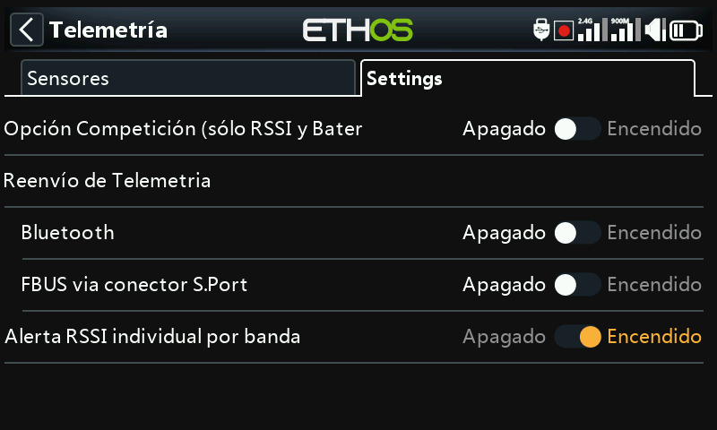

Cuando se usan los protocolos TD o TW, existe la opción de recibir alertas de voz individuales por cada banda, en las pestañas de ajustes.

Con esta opción no seleccionada, se recibirá sólo una alerta de RSSI baja o crítica por cada móduilos internos y externos que se tengan. La lógica de ETHOS monitoriza ambos RSSI para ver si están por debajo de los umbrales de ajuste antes de lanzar el mensaje de aviso. También lanzará una alerta cuando no se descubran sensores para RSSI.

Con esta opción seleccionada, en un receptor TD se recibirán alertas de RSSI para cada una de las bandas en uso, i.e. 2.4G y 900M. Para un receptor TW también se recibirán alertas de RSSI para cada banda en uso, i.e. 2.4FSK,  2.4LoRa y 900M.

Las alarmas por defecto para ACCESS también son 35 para 'RSSI bajo' and 32 for 'RSSI Crítico'. La pérdida de control ocurrirá cuando el RSSI baje por debajo de 28.

Las alarmas por defecto para ACCST son 45 y 42 respectivamente. La pérdida de control se producirá cuando el RSSI caiga a 38.

El aviso para cuando la telemetría se pierde completamente se anuncia como 'Telemetría perdida'. Tenga en cuenta que NO sonarán más alarmas, porque el enlace de telemetría ha fallado, y la radio ya no puede avisarle de un RSSI o cualquier otra condición de alarma. En esta situación es aconsejable volver para investigar el problema.

Tenga en cuenta que cuando la radio y el receptor están demasiado cerca (menos de 1m) el receptor puede saturarse causando alarmas espureas, dando lugar a un molesto bucle de alarma "Telemetría perdida" - "Telemetría recuperada".

El RSSI es menos valioso que el VFR para determinar el estado del enlace de control, pero se aproxima bastante a la hora de determinar el alcance efectivo del enlace.

Antes de ACCESS V2.1, el RSSI estaba basado en una combinación de la intensidad de la señal recibida y la tasa de tramas perdidas. Ahora, se han eliminado las tramas perdidas del cálculo del RSSI, y se han añadido como un nuevo sensor VFR (Valid Frame Rate) para proporcionar una medida de la calidad del enlace entre el emisor y el receptor.

VRF es el número de paquetes de datos válidos recibidos por cada 100 paquetes que se reciben.

Se puede configurar una advertencia para que avise cuando el VFR caiga por debajo de un valor mínimo, lo que indica que la calidad del enlace está bajando peligrosamente. El valor predeterminado de "Aviso de valor bajo" es 50.

Cada uno de los receptores del tipo TD (2.4 FSK y 900M) y TW (2.4 FSK y 2.4 LoRa) tiene dos RSSI y dos flujos VFR de telemetría, con sus avisos correspondientes. Ahora, la lógica de Ethos monitoriza ambos VFR para asegurarse que están realmente por debajo del correspondiente umbral, antes de enviar el mensaje de alerta.

##### Rx VFR

Tenga en cuenta de los receptores TD, TW, AP y AP Plus disponen de un nuevo valor de telemetría denominado "Rx VFR". Dependiendo del tipo de receptor, podrá ver un valor VFR para FSK, un VFR para Lora, un VFR para 900M, además del nuevo RX VFR.

El Rx VFR recibe sus datos desde FSK, Lora, o 900M, dependiendo de la banda desde la que se estén recibiendo los datos. Cuenta cada paquete de datos correcto independientemente de la banda desde la que se recibe. Si sólo se va a monitorizar un dato de VFR, seleccionar ‘Rx VFR’ es la mejor opción.

Otro sensor interno estándar es el voltaje de la batería del receptor.

Algunos receptores admiten una segunda entrada de voltaje analógica, disponible en telemetría como sensor ADC2.

#### 2. Sensores 'Externos'

El actual sistema de telemetría de FrSky hace uso de los sensores FrSky Smart Port. Las series de receptores X, S y posteriores habilitados para telemetría, tienen la interfaz Smart Port. Múltiples sensores Smart Port se pueden conectar en cadena, haciendo que el sistema sea fácil de implementar. La mayoría de los receptores también tienen uno o ambos puertos de entrada analógica A1/A2, que son útiles para controlar los voltajes de la batería, etc.

## Configuración de telemetría

### Generalidades

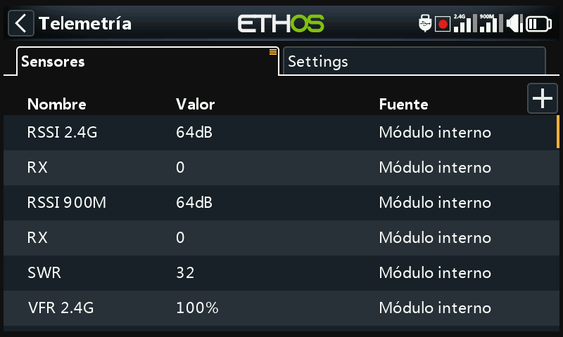

Hay dos pestañas en Telemetría

#### Pestaña de sensores

Esta pestaña de usa para descubrir nuevos sensores, añadir sensores DIY y calculados y cuando se han de editar los sensores. Hasta 100 sensores distintos están contemplados.

Se pueden añadir sensores calculatdos, tales como de Consumo, Distancia y Viajes, Multi Lipo, Porcentaje, Potencia y Personalizados.

Las opciones de edicón de sensores incluyen registro de datos y configuración de umbrales thresholds. Cuando se descubre cualquier sensor, tendrá una descripción individualizada para 2.4G o 900M de forma que sus datos se puedan usar por todo el sistema.

#### Pestaña de ajustes

Se usa para habilitar el modo ‘Sólo competición’, y para permitir enviar telemetría por  Bluetooth, así como activar alertas RSSI individuales por cada banda en los receptores TD y TW. Vea la sección ‘[Pestaña de ajustes](telemetry.md)’ más abajo.

### Opciones de la pestaña de sensores

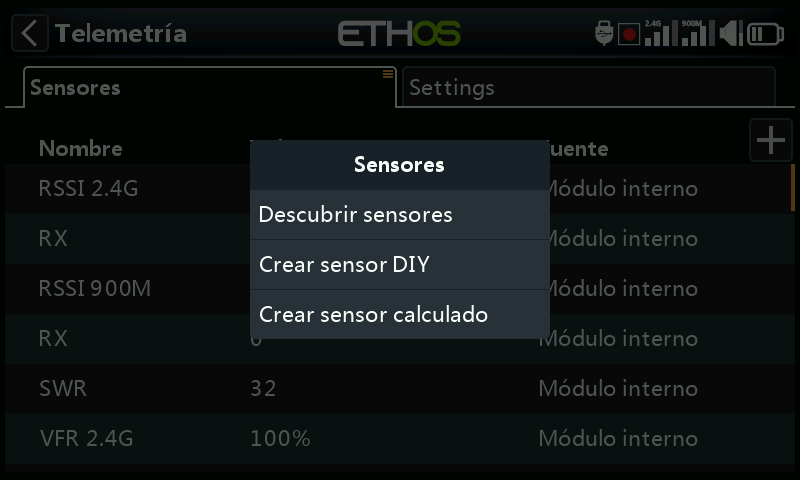

Toque en el botón ‘+’ en la derecha de la página de la pestaña de sensores para abrir el diálogo con las opciones.

#### Descubrir nuevos sensores

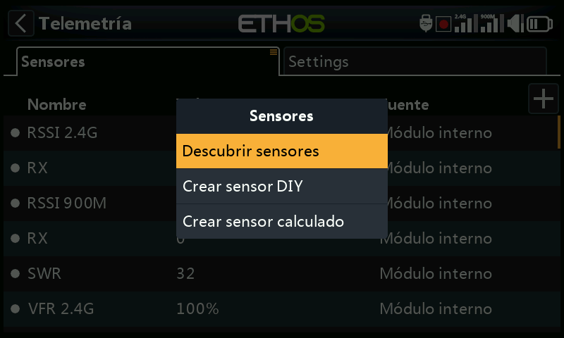

Una vez conectados los sensores, y el receptor y la radio estén vinculados y encendidos, pulse en «Descubrir sensores» para ver los nuevos sensores disponibles.

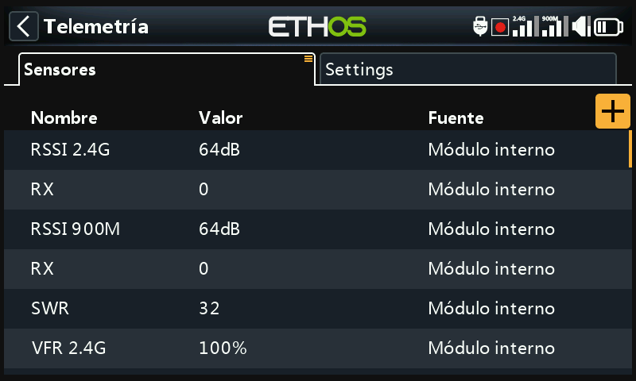

Durante la detección, la pantalla se completará automáticamente con todos los sensores encontrados. Una vez detectados todos los sensores, se debe finalizar el proceso de detección. Consulte la opción «Detener detección» más abajo.

Un punto blanco parpadeante en la columna izquierda indica que se están recibiendo datos de los sensores; si no se reciben datos, el valor se muestra en rojo. Como se mencionó anteriormente, se admiten hasta 100 sensores.

La pantalla del ejemplo anterior muestra los sensores internos y externos de un receptor SR10 Pro, que son:

RSSI 2.4G (Indicador de Intensidad de Señal del Receptor)

RX 0: Se ha añadido una nueva función de fuente de telemetría ETHOS denominada RX. RX proporciona el número de receptor del receptor activo que está enviando telemetría. RX está disponible en la telemetría como cualquier otro sensor para visualización en tiempo real, interruptores lógicos, funciones especiales y registro de datos.

RSSI 900M (Indicador de Intensidad de Señal del Receptor)

RX 0: Véase más arriba.

SWR: Valor de ROE de la antena si se utiliza una antena externa.

VFR 2.4G: Porcentaje de tramas válidas (VFR) del receptor de 2.4G.

Otros sensores pueden incluir:

VFR 900M, porcentaje de tramas válidas del receptor 900M

RxBatt, medida del voltaje de la batería del receptor

ADC2, entrada de voltaje analógico del receptor

R.Angle, ángulo de alabeo del receptor

P.Angle, ángulo de cabeceo del receptor

AccY, aceleración en el eje Y del receptor

AccZ, aceleración en el eje Z del receptor

AccX, aceleración en el eje X del receptor

Tenga en cuenta que los valores mínimo y máximo están también definidos para cada sensor, incluso si no están mostrados en la lista de sensores. Por ejemplo, cuando se ha definido la Altitud, Altitud- y Altitud+ los valores máximo y mínimo de la altitud también estará disponible. Vea [Opciones de sensor](#Sensor options) para más detalles.

Se deben descubrir los sensores para cada modelo, y cada vez que se añade un sensor.

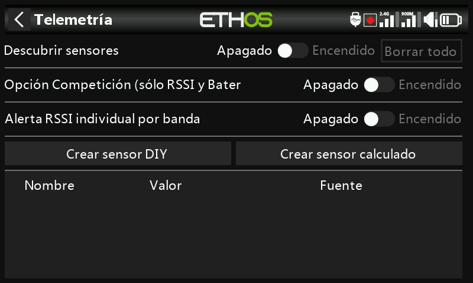

### Alertas individuales de RSSI por banda

Cuando se usan protocolos TD o TW, existe la opción de recibir alertas vocales individuales de RSSI por cada banda en uso. Vaya a la sección [RSSI](telemetry.md) más arriba.

### Sensores

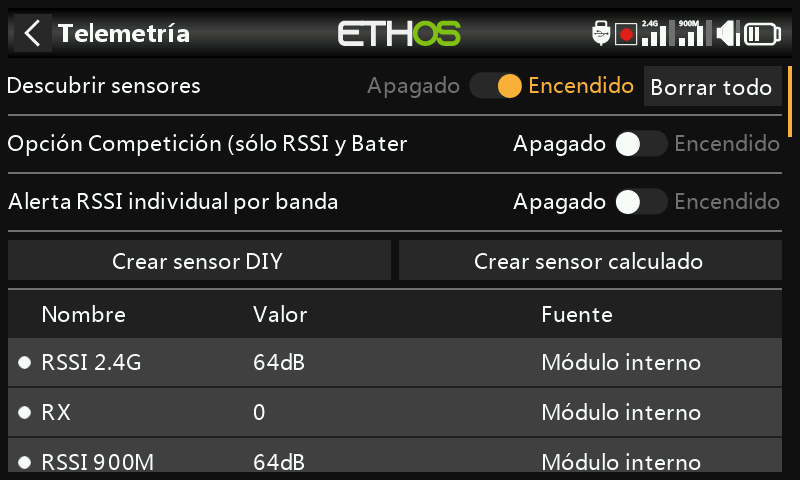

#### Descubrir nuevos sensores:

Una vez que los sensores han sido conectados, la radio y el receptor han sido vinculados, y ambos están encendidos, active 'Descubrir nuevos sensores' para descubrir nuevos sensores disponibles. Un punto parpadeante en la columna izquierda indica que se están recibiendo datos del sensor. El valor se muestra en rojo si no se están recibiendo datos. Se admiten hasta 100 sensores.

Durante la detección de los sensores, la pantalla se rellenará automáticamente con todos los sensores encontrados.

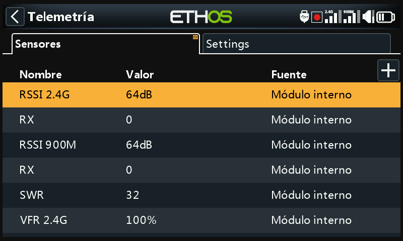

La pantalla de ejemplo anterior muestra los sensores "internos" y externos de un receptor SR10 Pro, que son:

RxBatt, la medida de tensión de la batería del receptor

RSSI 2.4G (indicador de intensidad de la señal del receptor)

RX 0: Existe una nueva función de fuente de receptor de telemetría de ETHOS denominada RX. RX proporciona el número de receptor del receptor activo que envía telemetría. RX está disponible en telemetría como cualquier otro sensor para visualización en tiempo real, interruptores lógicos, funciones especiales y registro de datos.

RSSI 900M (Receiver Signal Strength Indicator)

RX 0: Ver arriba.

RxBatt, La medida del voltaje del receptor de 2.4G

SWR, el valor SWR de la antena, si se usa una antena externa

VFR 2.4G, el porcentaje de  Valid Frame Rate percentage del receptor de 2.4G

VFR 900M, el porcentaje de Valid Frame Rate del receptor de 900M

RxBatt, la medida del voltaje de la batería del receptor

Otros sensores pueden incluir:

ADC2, La entrada analógica de voltaje del receptor

R.Angle, El ángulo de alabeo del receptor

P.Angle, El ángulo de cabeceo del receptor

AccY, La aceleración en el eje Y del receptor

AccZ, La aceleración en el eje Z del receptor

AccX, La aceleración en el eje X del receptor

VFR, El porcentaje de ‘Valid Frame Rate’ del receptor 900M

Tenga en cuenta que los valores mínimo y máximo también se definen para cada parámetro, aunque no se muestren en la lista de sensores. Por ejemplo, cuando se define Altitud, también estarán disponibles Altitud- y Altitud+ para la altitud mínima y máxima.

La detección de sensores debe realizarse para cada modelo, y cada vez que se añade un nuevo sensor.

##### Alertas de sensor perdido / conflicto

Cuando se pierde un sensor, aparece un punto rojo junto al sensor en lugar del punto blanco intermitente normal, lo que indica que se está recibiendo telemetría del sensor.  
  
Cuando hay un conflicto de sensor, también aparece un punto rojo junto al/los sensor(es). Un conflicto de sensor ocurre cuando su ID físico o su ID de aplicación no es único. Por favor, consulte las secciones anteriores para más detalles.

Las alertas del punto rojo solo se borrarán con un reinicio del sensor o de la telemetría. (Tenga en cuenta que un reinicio de vuelo también reinicia la telemetría.)

#### Detener descubrir sensores:

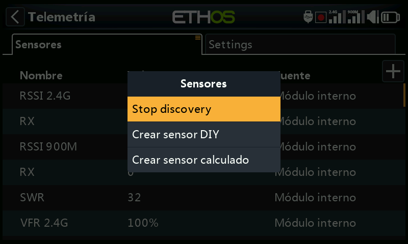

Una vez que se hayan descubierto todos los sensores, toque el botón ‘+’ en la pestaña Sensores, luego toque en ‘Detener descubrimiento’ para finalizar el proceso de descubrirlos.

#### Borrar todos los sensores:

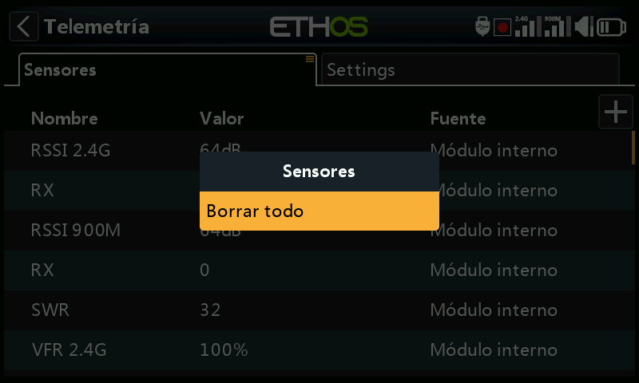

Toque en la pestaña Sensores para que aparezca la opción 'Borrar todo'. Esta opción eliminará todos los sensores para que pueda comenzar de nuevo.

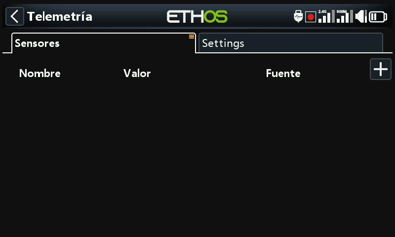

Todos los sensores han sido eliminados. Toque el botón ‘+’ en la parte derecha de la página de la pestaña Sensores para abrir el cuadro de diálogo de opciones, luego seleccione ‘Descubrir nuevos sensores’ para comenzar de nuevo (ver arriba).

#### Editar y configurar sensores

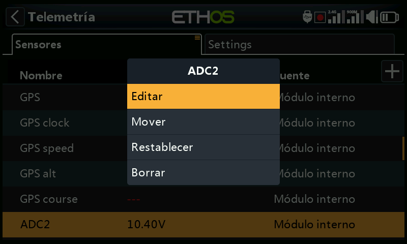

Toque un sensor, luego seleccione 'Editar' en el cuadro de diálogo emergente para editar la configuración del sensor. Alternativamente, seleccione 'Mover' para reordenar los sensores, 'Restablecer' para restablecer el sensor o 'Borrar' para eliminarlo.

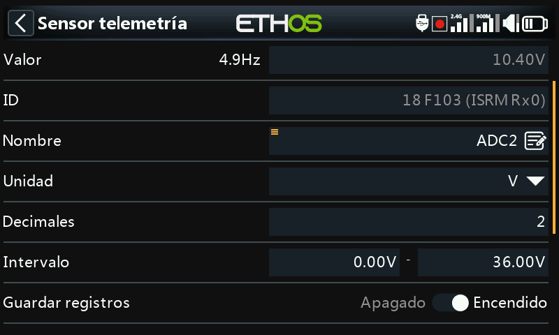

##### Valor

Muestra la lectura actual del sensor, además de mostrar el ritmo de actualización del sensor.

##### ID

Muestra el ID físico del sensor y el ID de la aplicación. También se muestra el ID del receptor que lo envía.

##### Nombre

Muestra el nombre del sensor, que puede editarse (En el ejemplo, la entrada analógica ADC2).

##### Unidad

La unidad de medida (En este ejemplo, Voltios).

##### Decimales

Los decimales de precisión.

##### Rango

Los límites bajo y alto de un rango se pueden establecer como un valor fijo para la escala. Se usa principalmente cuando se utiliza un valor de telemetría como fuente para un canal. Esto permite que el Rango se establezca en la escala deseada. (En los receptores más recientes de FrSky, la entrada analógica tiene un rango de 0-36V.)

##### Escribir registros

Cuando está habilitado, los datos del sensor se registrarán en la tarjeta SD o eMMC.

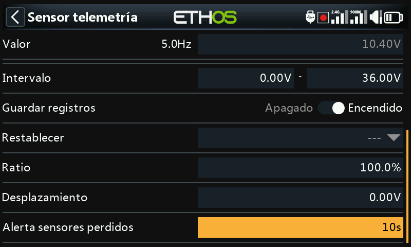

##### Restablecer

Para restablecer un sensor, se puede seleccionar una fuente. Tenga en cuenta que el restablecimiento también borrará cualquier alerta de punto rojo de 'sensor perdido' o 'conflicto de sensor'. Por favor, consulte  [Alertas de sensor perdido / conflicto](#Sensor lost - conflict alerts).

##### Retardo del aviso de sensor perdido

Cuando se seleccione la opción 'Avisos desactivados', se suprimirá la advertencia de sensor perdido. Alternativamente, se puede establecer un retraso de 1 a 30 segundos, con un valor predeterminado de 10 s. Esto permite filtrar pérdidas breves, pero se deben comprender los riesgos asociados.  
  
El mensaje de audio 'sensor perdido' se reproduce solo una vez cuando se pierden muchos sensores simultáneamente.  
  
Para los sensores del receptor, esta advertencia está desactivada por defecto, ya que al ser internos es poco probable que se pierdan.

#### Avisos específicos de sensor

El menú de edición puede variar dependiendo de los sensores, por ejemplo:

##### ADC2

Vea la pantalla del ejemplo en la imagen de arriba

##### Ratio

La relación se puede ajustar para corregir la escala de la entrada del sensor.

##### Desplazamiento

De igual forma, se puede introducir un desplazamiento.

##### RSSI

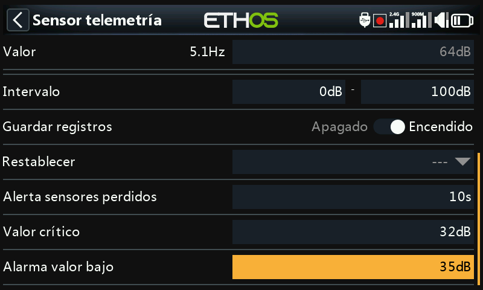

##### Valor crítico

Algunos sensores, como el RSSI, tienen alertas integradas. El RSSI tiene dos alertas, siendo la primera el ajuste del umbral de valor crítico.

##### Alarma de bajo valor

La segunda alerta es el ajuste del valor bajo del umbral del RSSI.

Vea la sección de Telemetría Access para detalles sobre las [Alertas de RSSI](#RSSI and VFR discussion).

##### VFR

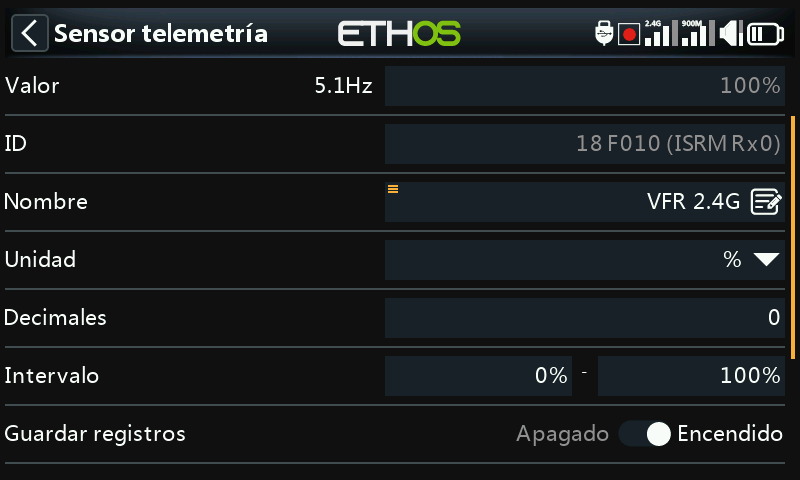

VFR es la tasa de fotogramas válida para el receptor.

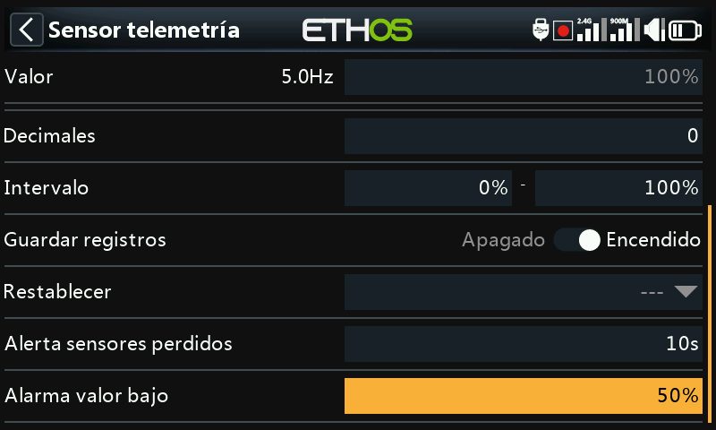

##### Alerta de bajo valor

El sensor VFR tiene una configuración de umbral de valor bajo. La alerta predeterminada está al 50%. Los valores por debajo de ese valor indican que la calidad del enlace se ha deteriorado a un nivel preocupante.

##### VSpeed

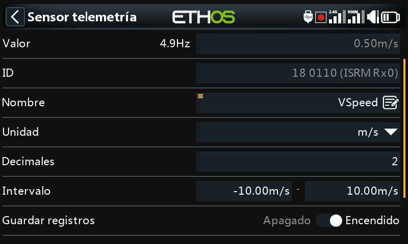

Vspeed es la velocidad vertical del modelo, medida por un sensor vario.

##### Valor

Muestra la lectura actual del sensor, además de mostrar el ritmo de actualización del sensor.

##### ID

ID presenta la ID Física y la de Aplicación. También se muestra la identificación del receptor.

##### Nombre

E nombre del sensor, que puede editarse (en el ejemplo se ha usado el VSpeed).

##### Unidad

Se ponen las unidades de medida (m/s en este ejemplo).

##### Decimales

Los decimales de precisión.

##### Intervalo

El intervalo por defecto es +/- 10m/s, pero puede incrementarse hasta +/- 100m/s.

##### Guardar registros

Cuando se activa, los ddatos del sensor serán archivados en la tarjeta SD o eMMC.

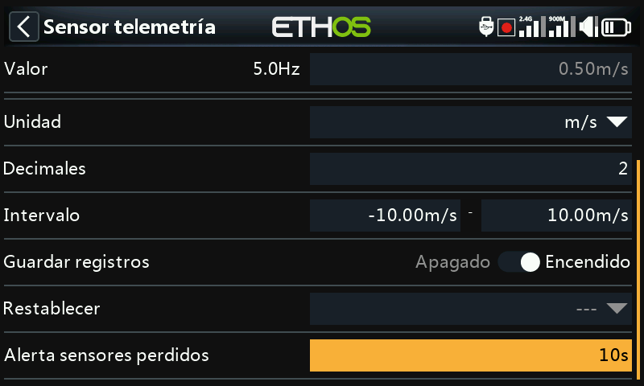

##### Restablecer

Cualquier fuente se puede configurar para restablecer los datos de un sensor. Tenga en cuenta que el restablecimiento también borrará cualquier alerta de punto rojo de 'sensor perdido' o 'conflicto de sensor'. Por favor, consulte  [Alertas de sensor perdido / conflicto](#Sensor lost - conflict alerts).

##### Retraso del aviso de pérdida de sensor

When set to ‘Warning disabled’ it will suppress the sensor lost warning. Alternatively, a delay of 1 to 10 seconds may be set, with a default of 5s. This makes it possible to filter out short losses, but the risks must be understood.

On the receiver this warning is disabled by default because it is unlikely to be lost because it is internal.

Nota: Los ajustes relaccionados con un vario se encuentran ahora en la función especial ‘[Play vario](#Play vario)’.

#### Crear un sensor DIY

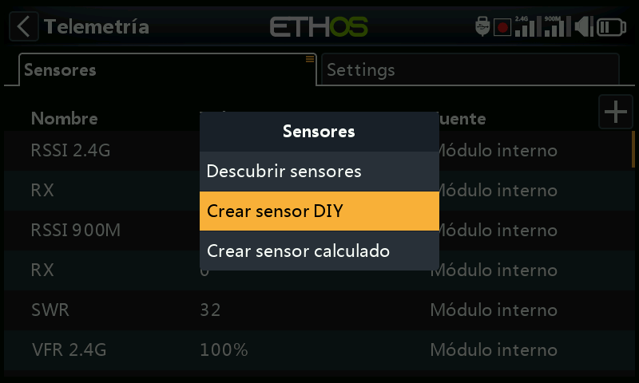

Toque el botón ‘+’ a la derecha de la pestaña Sensores para abrir el cuadro de diálogo de opciones. Luego selecciona ‘Crear sensor DIY’ para añadir un sensor DIY o de terceros.

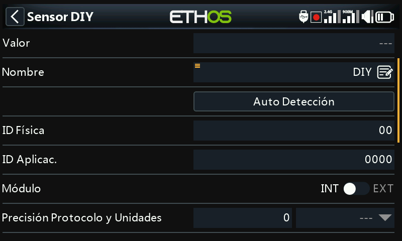

##### Valor

Valor del sensor que se recibe.

##### Nombre

Nombre del sensor, que se puede editar.

##### Detección automática

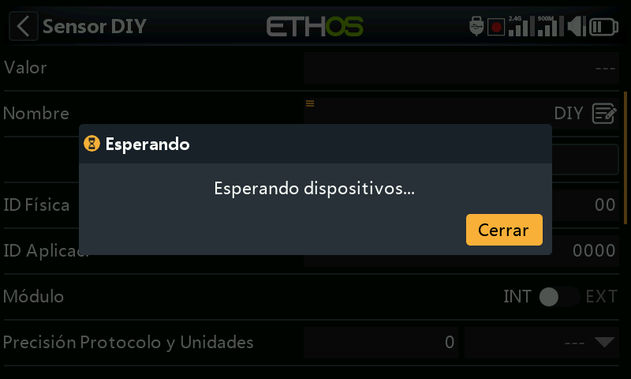

‘Detección automática’ intentará descubrir su sensor DIY. Si ya ha sido encontrado, entonces ‘Detección automática’ no lo mostrará. Si hay otros sensores que no han sido descubiertos, también se mostrarán en la lista.

##### ID Física

ID físico de dos caracteres del sensor. Se rellenará mediante Auto Detección si se selecciona.

##### ID de Aplicación

ID de aplicación del sensor de cuatro caracteres. Se rellenará con 'Detección automática' si se selecciona.

##### Módulo

Permite seleccionar un módulo RF interno o externo. Se rellenará con 'Detección automática' si se selecciona.

##### Precisión del protocolo / unidad

Permite establecer la precisión del protocolo entrante, de 0 a 3 decimales. También permite seleccionar las unidades de medida.

##### Mostrar decimales / unidad

Permite establecer la precisión que se mostrará, de 0 a 3 decimales. También permite seleccionar las unidades de medida que se mostrarán.

##### Intervalo

Se pueden establecer los límites bajo y alto de un intervalo como un valor fijo para la escala. Esto se utiliza principalmente cuando se usa un valor de telemetría como fuente para un canal. Esto permite que el intervalo se ajuste a la escala deseada.

##### Ratio

La proporción predeterminada del 100 % puede cambiarse para corregir las lecturas que se están recibiendo.

##### Desplazamiento

El desplazamiento predeterminado de 0 puede cambiarse para corregir las lecturas recibidas.

##### Escribir registros

Cuando está habilitado, los datos del sensor se registrarán en la tarjeta SD o eMMC. Los registros están habilitados por defecto.

##### Restablecer

Se puede configurar una fuente para reiniciar el sensor. Tenga en cuenta que el restablecimiento también borrará cualquier alerta de punto rojo de 'sensor perdido' o 'conflicto de sensor'. Por favor, consulte  [Alertas de sensor perdido / conflicto](#Sensor lost - conflict alerts).

##### Retraso del aviso de pérdida de sensor

Cuando se establece en ‘No configurado’ suprimirá la advertencia de sensor perdido. Alternativamente, se puede establecer un retraso de 1 a 10 segundos, con un valor predeterminado de 5 s. Permite filtrar pérdidas de corta duración, pero se deben comprender los riesgos asociados a ello.

#### Crear un sensor calculado

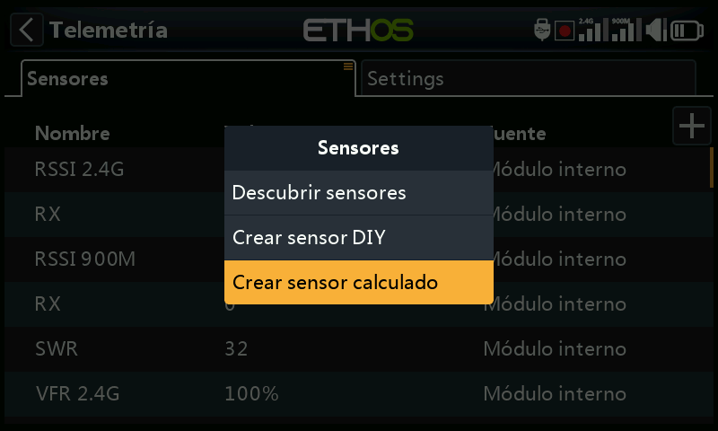

Toque el botón ‘+’ en la parte derecha de la pestaña de Sensores para abrir el cuadro de diálogo de opciones. Luego seleccione ‘Crear sensor calculado’ para agregar un sensor calculado.

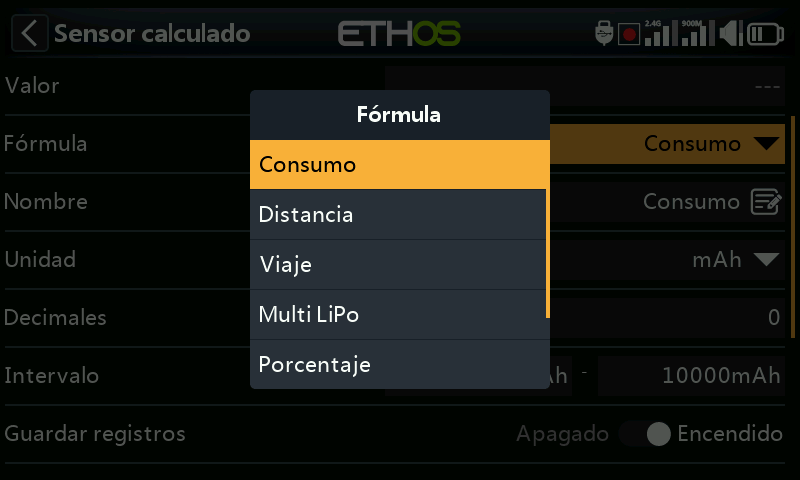

Se pueden agregar sensores calculados, como pueden ser de Consumo, Distancia, Viaje, Multi Lipo, Porcentaje, Potencia y Personalizado.

##### Sensor de consumo

El sensor calculado de Consumo permite calcular la energía consumida por el motor a partir de un sensor de corriente, como los de la serie FAS.

##### Valor

Muestra el valor actual del sensor seleccionado (véase la Fuente más abajo).

##### Fórmula

Selecciona la fórmula de cáculo de Consumo.

##### Nombre

Nombre del sensor, que puede editarse.

##### Unidad

Las medidas pueden ser de mAh o Ah.

##### Decimales

La medida puede tener entre 0 y 4 decimales.

##### Intervalo

El intervalo puede ser entre 0 y un máximo de 1000Ah.

##### Guardar registros

Los registros se escribirán en la tarjeta SD o eMMC en la carpeta Logs, si está habilitado.

##### Restablecer

Se puede configurar una fuente para restablecer el sensor.

##### Fuente

Después de descubrir los sensores, seleccione su sensor actual.

##### Persistente

La función Persistente permite almacenar el valor del sensor en la memoria cuando se apaga la radio o se cambia de modelo, y se volverá a cargar la próxima vez que se utilice el modelo.

El botón de reinicio permite que el sensor se reinicie mientras está en la pantalla de edición.

##### Sensor de distancia

El sensor calculado de Distancia permite calcular la distancia recorrida a partir de un sensor GPS.

##### Valor

Muestra el valor actual del sensor seleccionado (vea Fuente más abajo).

##### Formula

Selecciona la fórmula de cáculo de la distancia.

##### Nombre

Nombre del sensor, que puede editarse.

##### Unidad

Las medidas pueden efectuarse en cm, m, km o piés.

##### Decimales

La medida puede tener entre 0 y 4 decimales.

##### Intervalo

El intervalo puede estar desde 0 hasta un máximo de 20km.

##### Guardar registros

Los registros se escribirán en la tarjeta SD o eMMC en la carpeta de registros, si se habilita.

##### Restablecer

Se puede configurar una Fuente para restablecer el sensor.

##### Fuente GPS

Después de descubrir los sensores, seleccione su sensor fuente de GPS.

##### **Fuente de a****ltitud**

Después de descubris los sensores, seleccione el sensor de altitud.

##### Persistente

La función Persistente permite almacenar el valor del sensor en la memoria cuando se apaga la radio o se cambia de modelo, y se volverá a cargar la próxima vez que se utilice el modelo.

El botón de reinicio permite reiniciar el sensor mientras se está en la pantalla de edición.

##### Sensor de viaje

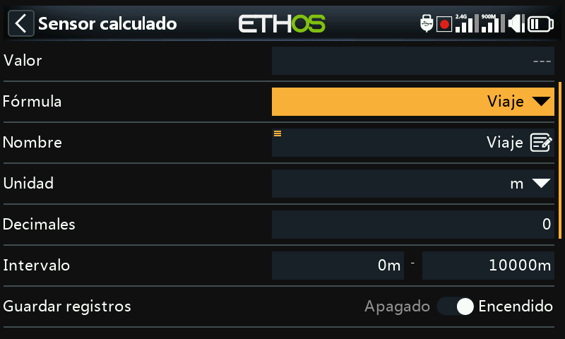

El sensor de cálculo de viaje permite calcular la distancia acumulada entre coordenadas GPS a partir de un sensor GPS.

##### Valor

Muestra el valor actual del sensor seleccionado (vea Fuente más abajo).

##### Fórmula

Selecciona la fórmula de cáculo del viaje.

##### Nombre

Nombre del sensor, que puede editarse.

##### Unidad

Las medidas pueden ser en cm, m, km o piés.

##### Decimales

Se muestran las cantidades entre 0 y 4 decimales.

##### Intervalo

El intervalo puede ser entre 0 hasta un máximo de 1000km.

##### Guardar registros

Los registros se guardarán en la tarjeta SD o eMMC en el dorectorio de registros, si habilitado.

##### Restablecer

Se puede configurar una Fuente para reiniciar el sensor.

##### Fuente

Después de descubrir los sensores, seleccion su sensor GPS.

##### Persistente

La función Persistente permite almacenar el valor del sensor en la memoria cuando se apaga la radio o se cambia de modelo, y se volverá a cargar la próxima vez que se utilice el modelo.

El botón de reinicio permite reiniciar el sensor mientras se está en la pantalla de edición.

##### Sensor Multi Lipo

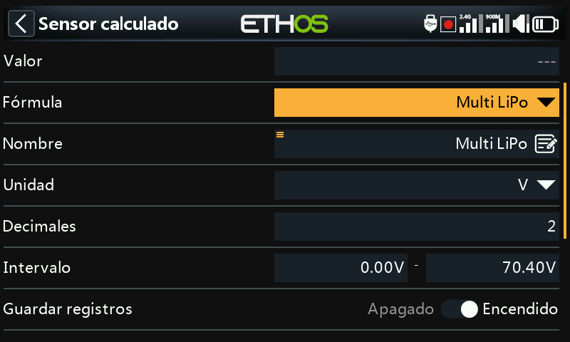

El sensor calculado Multi Lipo permite conectar en cascada dos sensores lipo para monitorizar baterías lipo de más de 6S.

##### Valor

Muestra el valor actual del sensor seleccionado (vea Fuente más abajo).

##### Fórmula

Selecciona la fórmula Multi Lipo.

##### Nombre

Nombre del sensor, que puede editarse

##### Unidad

Las medidas \`pueden ser en Volts o mV.

##### Decimales

Se pueden mostrar entre 0 y 4 decimales.

##### Intervalo

El intervalo puede ser entre 0 hasta un máximo de 67.2V (para 8S).

##### Guardar registros

Los registros se guardarán en la tarjeta SD o eMMC en la carpeta de registros, si se habilita.

##### Restablecer

Se puede configurar una fuente para reinicar un sensor.

##### Contar

El número de sensores lipo a configurar.

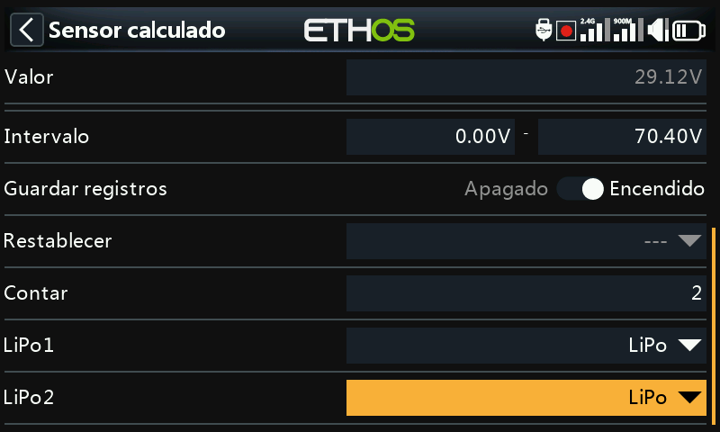

##### LiPo1, LiPo2, hasta LiPo ’n’

Seleccione los sensores lipo en el orden correcto, desde la celda de menor carga hasta la de mayor carga.

Para evitar conflictos con el S.port, es necesario modificar la ID física y de aplicación de los sensores LiPo adicionales mediante la herramienta de configuración de voltaje LiPo en el menú de configuración del dispositivo. También es recomendable detectarlos uno por uno y cambiarles el nombre para poder distinguirlos.

##### Sensor de porcentaje

El sensor calculado de Porcentaje permite convertir los valores de un sensor a un porcentaje.

##### Valor

Muestra el valor actual de un sensor (vea Fuente más abajo).

##### Fórmula

Selecciona la fórmula de Porcentaje.

##### Name

Nombre del sensor, que puede editarse.

##### Unidad

Las unidades son fijas como ‘%’.

##### Decimales

Se muestran entre 0 y 4 decimales.

##### Intervalo

El intervalo puede ser entre 0% hasta 100%.

##### Guardar registros

Los registros se guardarán en la tarjeta SD o eMMC en la carpeta de registros, si se habilita.

##### Restablecer

Se puede configurar una Fuente para reiniciar e sensor.

##### Sensor

Después de descubrir sensores, seleccione el sensor que se va a convertir en porcentaje.

Invert

Allows the source to be inverted, to show for example remaining percentage.

##### Sensor de Potencia

El sensor calculado de Potencia permite calcular la potencia desde una fuente de voltaje y amperaje.

##### Valor

Muestra el cálculo actual en Watios de los sensores seleccionados (vea Amperaje y Voltaje más abajo).

##### Fórmula

Selecciona la fórmula usada para calcular la potencia.

##### Nombre

Nombre del sensor, que puede editarse.

##### Unidad

Las unidades pueden ser mW o ‘W’.

##### Decimales

Se pueden mostrar entre 0 y 4 decimales.

##### Intervalo

El intervalo puede ser desde 0 hasta 1000000W.

##### Guardar registros

Los registros se guardarán en la tarjeta SD o eMMC en la carpeta de registros, si se activa.

##### Restablecer

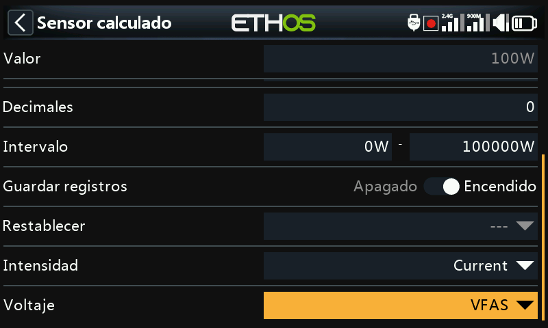

Permite reiniciar el sensor.

##### Amperaje

Después de descubrir los sensores, seleccione el sensor a usar para Amperaje.

##### Voltaje

Después de descubrir los sensores, seleccione el sensor a usar para Volaje.

##### Sensor personalizado

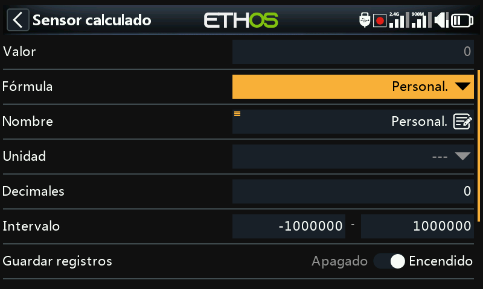

El sesor calculado personalizado permite al usuario definir un sensor para calcular desde múltiples fuentes.

##### Valor

Muestra el valor calculado actual del sensor personalizado.

##### Fórmula

Selecciona la fórmula personalizada.

##### Name

Nombre del sensor, que puede editarse.

##### Unidad

Se pueden seleccionar la unidad de entre ‘mV’, ‘V’, ‘mA’, ‘A’, ‘mAh’, ‘Ah, ‘mW’, ‘W’, ‘cm’, ‘m’, ‘km’ ‘ft’, ‘cm/s’, ‘m/s’, m/min’, ‘ft/s’, ‘ft/min’, ‘km/h’, ‘mph’, ‘knots’, ‘°C’, ‘°F’, ‘%’, ‘us’, ‘ms’, ‘s’, ‘m’, ‘h’, ‘dB’, ‘dBm’, ‘Hz’, ‘MHz’, ‘g’, ‘°’, ‘rad’, ‘ml’, ‘ml/m’, ‘ml/p’, ‘r/m’, ‘Pa’, ‘kPa’, ‘MPa’, ‘bar’, y ‘PSI’.

##### Decimales

Se pueden mostrar entre 0 y 4 decimales.

##### Intervalo

El intervalo puede ser desde -1000000 hasta 1000000.

##### Guardar registros

Los registros se guardarán en la tarjeta SD o eMMC en la carpeta de registros, si se habilita.

##### Restablecer

Permite reiniciar el sensor.

##### Fuente

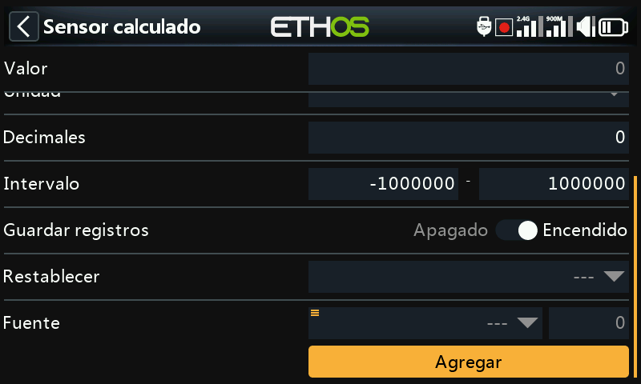

Después de descubrir sensores, seleccione el primer sensor a usar para el cáculo.

Haga click en ‘Agregar’ para añadir más líneas de cálculo que puedan ser necesarias.

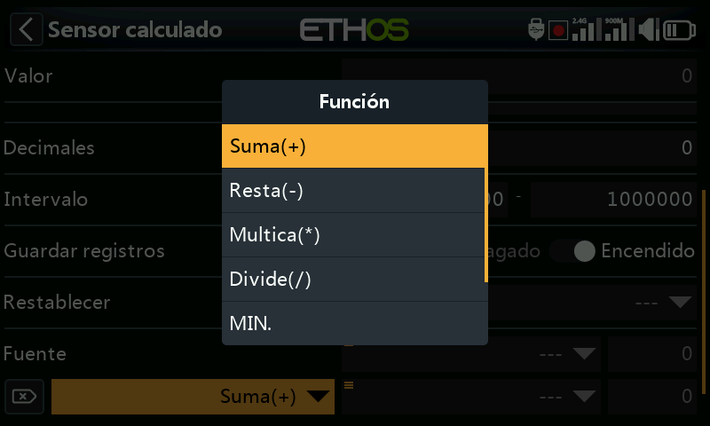

Están disponibles los siguientes operadores matemáticos:

- Suma(+)
- Resta(-)
- Multiplicación(x)
- División (/)
- MIN
- MAX
- SQRT (Raiz cuadrada)

##### Ejemplos

##### Sensor de potencia

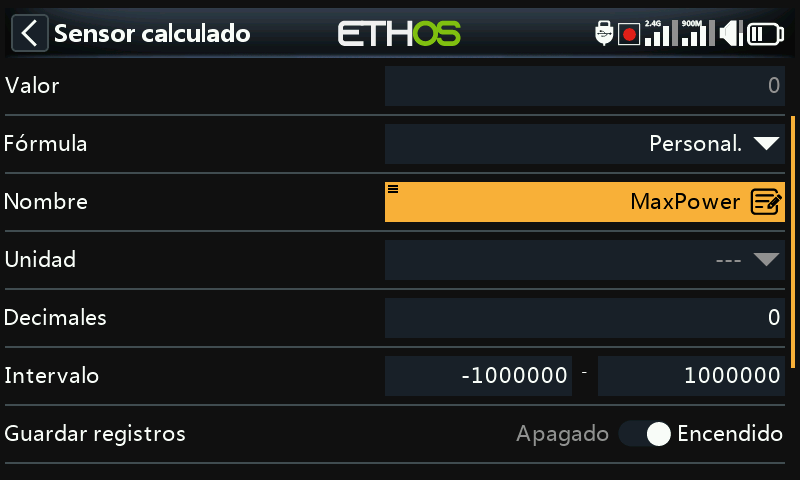

Hemos nombrado a sensor calculado como MaxPower.

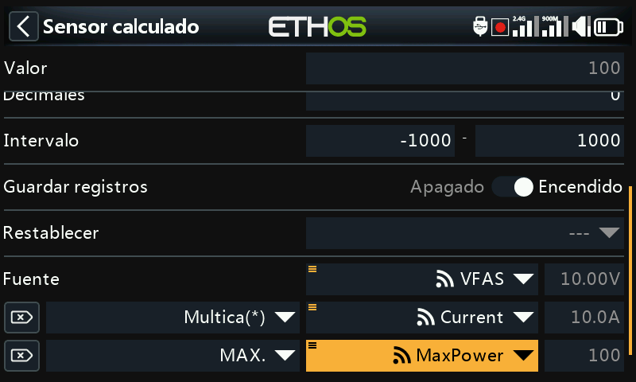

En el simple ejemplo de arriba, un sensor de voltaje VFAS y un sensor de amperaje Current se han multiplicado para calcular la potencia. Después, se ha añadido una función Max para referenciar el valor de amperaje de nuestro sensor calculado ‘MaxPower’ para que calcule el valor máximo. El campo de valor muestra 288W que es el valor máximo alcanzado durante la prueba.

##### Aritméticas con una constante

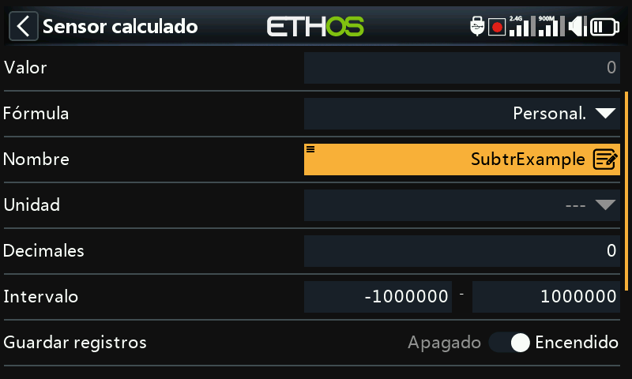

El sensor personalizado se ha llamado SubtrExample.

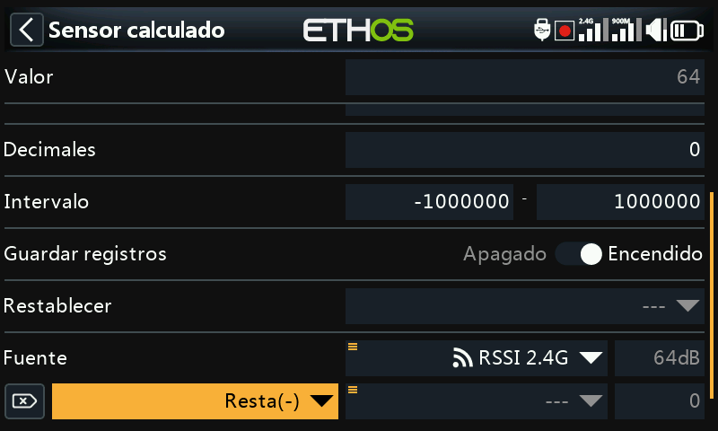

Se ha seleccionado como fuente ‘RSSI 2.4G’. Fíjese en que el valor de RSSI es 64dB.

Después, añadimos una acción y seleccionamos ‘Resta’.

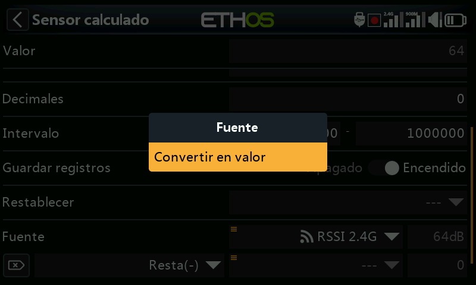

Nos movemos hasta Fuente, mantenemos presionado Enter, y seleccionamos ‘Convertir en valor’.

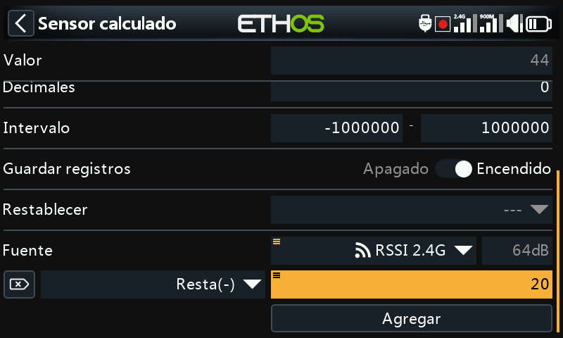

Ahora ya se puede editar el valor (que es ahora una constante) para ser usado en la función Resta.

El Valor muestra ahora 44dB, que es el resultado de restar 20 del valor original de la fuente que era 64dB.

##### Valor de cálculo interno de una fuente

Este ejemplo es simplemente para mostrar el valor de cálculo interno de una fuente. Usaremos un sensor calculado personalizado con la fuente configurada en Motor. Con el acelerador al 100%, podemos ver que el valor interno es +1024.

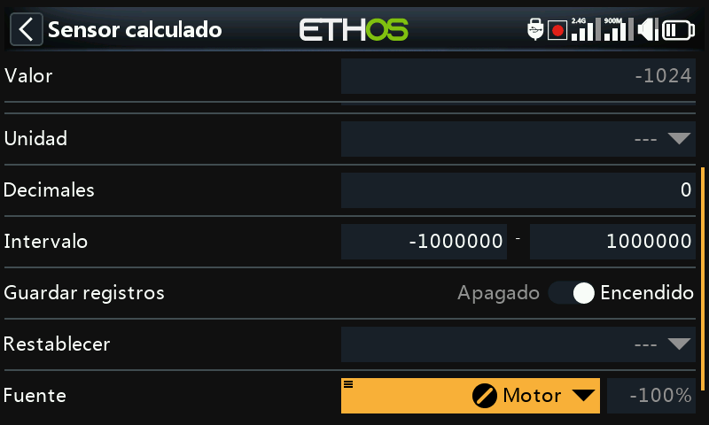

Con el acelerador al -100%, podemos ver que el valor interno está en -1024. Así que el valor interno de una fuente está entre +/-1024 cuando la fuente está en +/-100%.

### Pestaña de configuración

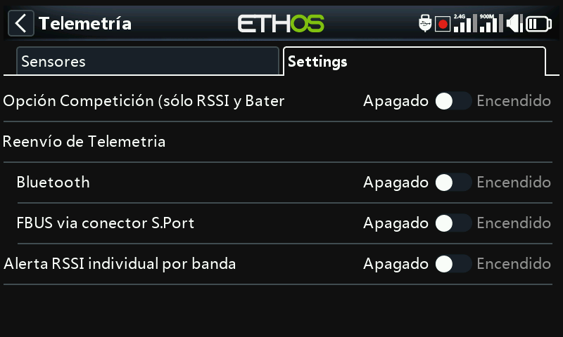

La pestaña de configuración se utiliza para habilitar el modo 'solo competición', y habilitar Bluetooth para enviar telemetría y para activar una 'alarma de RSSI individual por banda' para receptores TD y TW.

#### Competición (sólo RSSI y batería)

Ethos dispone de un modo de competición que le permite desconectar la telemetría para participar en aquellas competiciones que permiten tener sensores de telemetría instalados, pero sólo si están apagados. Sólo se permiten sensores que permiten enlaces de estado del modelo, como son el RSSI y la batería del Rx.

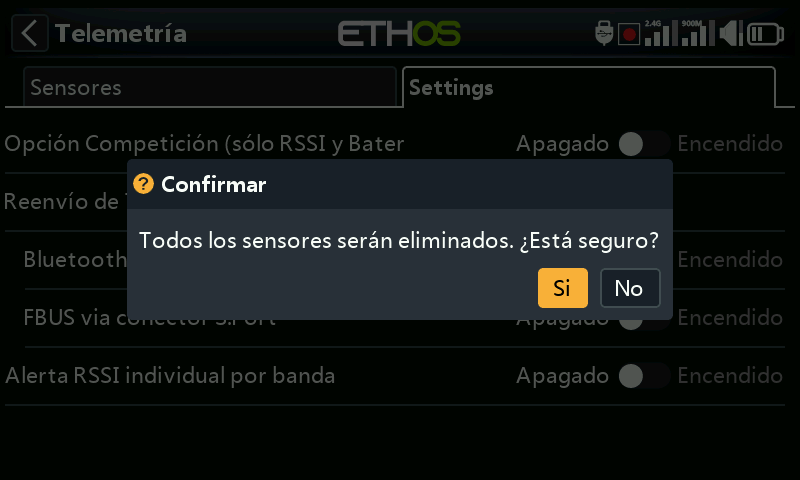

Al activar este modo, se borrarán todos los sensores excepto RSSI y RxBatt. Una vez desactivado este modo, la radio debe apagarse y encenderse antes de que los sensores puedan Volver a descubrirse con esta opción apagada.

#### Reenvío de telemetría

La telemetría se puede transmitir mediante Bluetooth o con el protocolo FBUS a través del conector S.Port.

#### Bluetooth

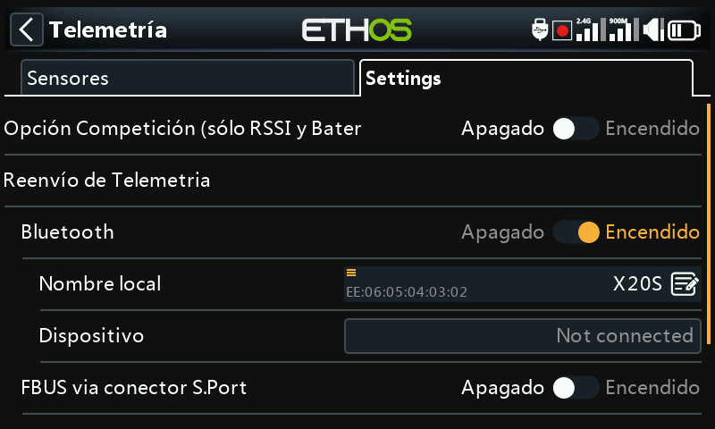

En el modo de telemetría Bluetooth, la radio puede trabajar con la aplicación FrSky FreeLink para mostrar los datos de telemetría en su teléfono móvil. También se puede usar esta aplicación para configurar otros dispositivos Frsky, como pueden ser los receptores estabilizados.

##### FBUS a través del conector S.Port

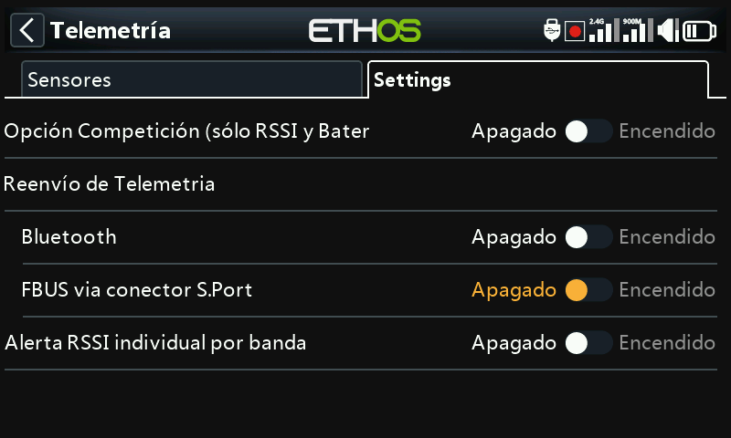

La telemetría también se puede transmitir en formato FBUS a través del conector S.Port situado en la parte superior de la radio.

#### Alerta de RSSI individual por banda

Cuando se usen protocolos TD o TW, existe la opción de recibir alertas por voz de RSSI individuales por cada banda. Vea la sección [RSSI](telemetry.md) más arriba.
