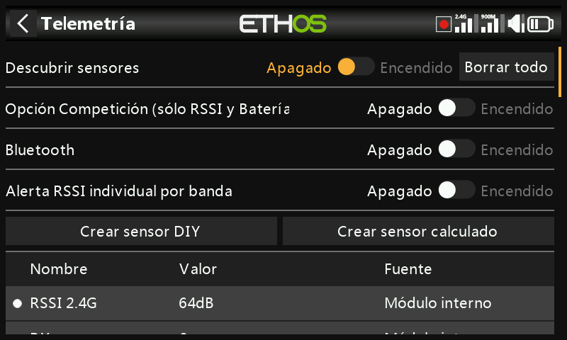
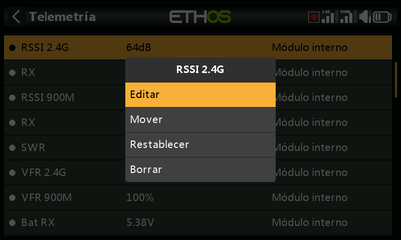

# Telemetría

La telemetría transmite información desde el modelo hacia el piloto: calidad
del enlace (RSSI, VFR), tensiones y corrientes, y cualquier otro dato que
comunique un sensor conectado (posición GPS, altitud, etcétera). Se admiten
hasta 100 sensores por modelo; el descubrimiento y la configuración se realizan
aquí, pero la telemetría se *muestra* realmente como [widgets de pantallas de
visualización](../displays/index.md), que se configuran por separado en
Configurar pantallas.

## Cómo funciona la telemetría FrSky {: #how-frsky-telemetry-works }

Los sensores de FrSky no requieren concentrador: el **Smart Port (S.Port)** es
un bus de 3 hilos (Gnd, V+, Señal), encadenable en cualquier orden a la conexión
S.Port de los receptores de la serie X/S y posteriores, que funciona en
semidúplex a 57.600 bps (F.Port y FBUS son más rápidos).

- **ID físico** — hasta 28 nodos (incluido el receptor) comparten el bus, y cada
  uno necesita un ID físico único (00–1B hexadecimal). Los dispositivos FrSky se
  entregan con valores predeterminados razonables (p. ej. Vario = 00,
  FLVSS = 01, Current = 02, GPS = 03); si conecta dos dispositivos iguales, el
  ID físico del segundo debe cambiarse mediante la [configuración de
  dispositivos](../system-setup/devices.md).
- **ID de aplicación** — independiente del ID físico: un sensor puede comunicar
  varios valores, cada uno con su propio ID de aplicación. Un Vario tiene un
  único ID físico pero dos ID de aplicación (Altitud, Velocidad vertical); un
  FLVSS tiene un ID físico y un ID de aplicación (Tensión). Monitorizar dos
  baterías 6S con dos sensores FLVSS implica cambiar **ambos** ID en el segundo:
  el ID físico para una comunicación exclusiva en el bus, y el ID de aplicación
  para que el receptor pueda distinguir entre Lipo 1 y Lipo 2 (p. ej. `0300` →
  `0301`). Lo habitual es variar el 4.º dígito hexadecimal, de 0 a F.

  !!! note
      Que varios sensores compartan el ID de aplicación con distintos ID físicos
      solo es válido con la [detección de conflictos de
      sensores](../system-setup/alerts.md) desactivada: se trata de una
      configuración para casos especiales, no del caso predeterminado.

Cada valor recibido se gestiona como un sensor propio: valor, ID físico/de
aplicación, un nombre editable, unidad, precisión decimal, un indicador opcional
de registro en la SD card y sus propios mínimos/máximos acumulados. Los sensores
se descubren automáticamente en cada encendido una vez configurados, pero deben
descubrirse **manualmente** la primera vez. Una vez descubierto, un sensor puede
anunciarse por voz, alimentar [sensores calculados](#calculated-sensors),
utilizarse en [interruptores lógicos](logical-switches.md),
[Vars](variables.md) o [mezclas](mixes.md), mostrarse en una pantalla de
telemetría personalizada o leerse directamente desde esta página de
configuración sin necesidad de crear ninguna pantalla.

**FBUS** (antes F.Port2) mejora aún más esto, combinando el control SBUS y la
telemetría S.Port en una sola línea a 460.800 bps (frente a los 115.200 de
F.Port y los 57.600 de S.Port; las tres velocidades son mutuamente
incompatibles), y permite que un host se comunique con varios accesorios
esclavos por esa única línea, todos configurables de forma inalámbrica desde la
emisora.

### Telemetría con varios receptores (ACCESS Trio)

Con hasta tres receptores registrados en [sistema
RF](rf-system.md#registering-and-binding-a-receiver-access), cada receptor
vinculado puede configurarse individualmente (pines de puerto, etc.) mediante
RX1/RX2/RX3. Normalmente hay una sola vía de telemetría entrante por enlace RF;
los sistemas Tandem/TD son la excepción, ya que emplean 2,4 GHz y 900 MHz como
dos vías en un mismo módulo. La fuente de telemetría activa puede cambiar
durante el vuelo según las condiciones de RF; el sensor **RX** indica en tiempo
real qué receptor está enviando telemetría (y lo registra).

La configuración habitual: encadenar el bus de sensores S.Port a través de los
tres receptores, compartiendo una alimentación común, y después registrar/
vincular cada receptor y descubrir los sensores con normalidad; la fuente de
telemetría cambia automáticamente conforme cambia el RX activo, y los datos de
los sensores S.Port *externos* siguen disponibles de forma transparente. (Los
sensores internos del receptor —RSSI, VFR, RxBatt, ADC2 y RX— no se enlazan de
este modo; siempre se comunican los del receptor que sea en ese momento la
fuente. La telemetría simultánea de los tres a la vez está prevista, pero
todavía no está disponible.)

## Sensores de calidad del enlace

- **RSSI** (indicador de intensidad de la señal en el receptor) — la intensidad
  con la que llega al receptor la emisión de la emisora. Alarmas
  predeterminadas: **ACCESS**/**TD**/**TW** 35 (bajo) / 32 (crítico), pérdida de
  control en torno a 28; **ACCST** 45 / 42, pérdida de control en torno a 38.
  «Telemetría perdida» se activa cuando el enlace desaparece por completo; a
  partir de ese momento **no puede sonar ninguna otra alarma**, ya que la
  emisora no dispone de telemetría que evaluar; tómelo como una señal para
  regresar de inmediato. (A menos de ~1 m de separación, el receptor puede
  saturarse y generar ciclos falsos de alarmas de pérdida/recuperación; no es un
  fallo real.) El RSSI aproxima bien el alcance efectivo, pero el VFR es el
  indicador de calidad del enlace más fiable.

  

  Los receptores TD comunican un RSSI por banda (2.4G, 900M); los receptores TW
  también comunican uno por banda (2.4FSK, 2.4LoRa, 900M): active **Alerta RSSI
  individual por banda** para obtener avisos de voz separados para cada una en
  lugar de una única alerta combinada:

  

- **VFR** (tasa de tramas válidas) — paquetes válidos por cada 100 recibidos; es
  el sustituto, a partir de ACCESS 2.1, de integrar la tasa de tramas perdidas
  en el RSSI. El **aviso de valor bajo** predeterminado es del 50 %.

  

  Los receptores TD/TW comunican dos flujos VFR (uno por banda); en cambio, **Rx
  VFR** (en receptores TD/TW/AP/AP Plus) cuenta todas las tramas correctas
  independientemente de la banda por la que hayan llegado: es el valor a vigilar
  si solo se desea seguir un único valor VFR.

- **RxBatt** — tensión de la batería del receptor.
- **ADC2** — una segunda entrada analógica de tensión, en los receptores que la
  admiten.
- **SWR** — SWR de la antena, al utilizar una antena externa.
- Sensores de actitud/movimiento, cuando se admiten: **R.Angle**, **P.Angle**,
  **AccX/Y/Z**.

Todo sensor numérico obtiene además automáticamente sensores de mínimo/máximo
`<nombre>-`/`<nombre>+`, aunque no aparezcan en la lista principal de sensores.

## Descubrimiento de sensores {: #discovering-sensors }

Con todo vinculado y alimentado, active **Descubrir nuevos sensores**: un punto
intermitente (o un valor en rojo, si aún no hay datos) marca cada sensor a
medida que se detecta, y la pantalla se rellena automáticamente. Esto debe
repetirse **para cada modelo**, y de nuevo cada vez que se añada un sensor
nuevo.

- Vuelva a poner el descubrimiento en **Off** una vez terminado.
- **Eliminar todo** borra todos los sensores para empezar de cero.

  

- El **modo competición** reduce la telemetría únicamente a RSSI y RxBatt, para
  competiciones que solo permiten sensores de estado del enlace. Desactivarlo de
  nuevo requiere apagar y encender la emisora antes de poder redescubrir los
  sensores.

  

- El modo de telemetría por **Bluetooth** se empareja con la aplicación para
  móvil FrSky FreeLink, que puede mostrar la telemetría en directo y también
  configurar dispositivos FrSky como los receptores estabilizados.

  

## Edición de un sensor {: #editing-a-sensor }

Pulse un sensor para acceder a **Editar**, **Mover**, **Restablecer** o
**Eliminar**. Campos comunes: **Valor** (solo lectura), **ID** (ID físico + ID
de aplicación, y receptor emisor), **Nombre**, **Unidad**, **Decimales**,
**Rango** (límites fijos de escala, relevantes principalmente cuando el sensor
se utiliza como fuente de un canal), **Escribir registros**, **Restablecer**
(una fuente que restablece este sensor) y **Retardo del aviso de pérdida de
sensor** (desactivable por completo, o de 1 a 30 s, 10 s por defecto, para
filtrar cortes breves; tenga en cuenta el riesgo de ajustarlo demasiado alto; el
mensaje de «sensor perdido» solo se reproduce una vez aunque se pierdan muchos
sensores a la vez; está desactivado por defecto en los sensores internos del
receptor, ya que estos rara vez desaparecen).

Algunos sensores añaden campos propios:

- **ADC2** — **Ratio** y **Offset**, para corregir la escala.

  

- **RSSI** — umbrales de **Valor crítico** y **Aviso de valor bajo**.
- **VFR** — **Aviso de valor bajo** (50 % por defecto).
- **VSpeed** (velocidad vertical del vario) — **Rango** hasta ±100 m/s (±10 m/s
  por defecto). El comportamiento del audio del vario reside ahora en la
  [función especial Play Vario](special-functions.md), no aquí.

  

## Sensores DIY / de terceros

**Crear sensor DIY** añade manualmente un sensor que no sea de FrSky:
**Detección automática** (rellena automáticamente el ID físico, el ID de
aplicación y el módulo, si es posible), o bien se configuran a mano, junto con
**Decimales/unidad del protocolo** (precisión entrante, de 0 a 3 decimales, y su
unidad nativa) y **Decimales/unidad de visualización** (independientes de los
del propio protocolo), además de los mismos campos **Rango**/**Ratio**/
**Offset**/**Escribir registros**/**Restablecer**/**Retardo del aviso de pérdida
de sensor** que cualquier otro sensor.

## Sensores calculados {: #calculated-sensors }

Permiten derivar un nuevo sensor a partir de uno o varios ya existentes:

- **Consumo** — energía consumida, integrada a partir de un sensor de corriente
  (p. ej. la serie FAS). Unidad mAh/Ah, rango hasta 1000 Ah.

  

- **Distancia** — a partir de una fuente GPS (más una fuente de altitud, para la
  distancia en 3D). Unidades cm/m/km/ft, hasta 20 km.

  

- **Trayecto** — distancia acumulada entre posiciones GPS sucesivas. Mismas
  unidades, hasta 1000 km.

  

- **Multi Lipo** — encadena dos o más sensores de tensión Lipo para monitorizar
  baterías de más de 6S (hasta 67,2 V/8S). Seleccione cada sensor de celdas de
  menor a mayor; cada sensor Lipo adicional necesita que se cambien previamente
  su ID físico **y** su ID de aplicación en la [configuración de
  dispositivos](../system-setup/devices.md) (la herramienta de configuración de
  tensión Lipo que hay allí resulta de ayuda), descubrirse de uno en uno y
  renombrarse para poder distinguirlos.

  

- **Porcentaje** — reescala un sensor a 0–100 %, con una opción **Invertir**
  (p. ej. para mostrar el porcentaje *restante* en lugar del consumido).

  

- **Potencia** — vatiaje a partir de una pareja de fuentes de **Corriente** y
  **Tensión**, hasta 1.000.000 W.

  

- **Personalizado** — una fórmula arbitraria encadenada a partir de una o varias
  fuentes.

Todos los sensores calculados disponen además de **Persistente** (se conserva al
apagar o cambiar de modelo, y se recarga en el siguiente uso) y de un botón
**Restablecer** en la propia pantalla de edición.

### Sensores personalizados

Parten de una fuente y, mediante **Añadir**, encadenan más operaciones:
**Sumar(+)**, **Restar(-)**, **Multiplicar(×)**, **Dividir(/)**, **Min**,
**Max**, **Sqrt**. Las unidades se eligen de una larga lista que abarca tensión,
corriente, capacidad, potencia, distancia, velocidad, tiempo, temperatura,
porcentaje, ángulos, presión y más; rango de −1.000.000 a 1.000.000, de 0 a 4
decimales.

!!! example "Potencia máxima"
    Multiplique un sensor de tensión (`VFAS`) por un sensor de corriente
    (`Current`) y después añada un paso **Max** que haga referencia al valor
    actual del propio sensor (`MaxPower`) para registrar la lectura más alta
    observada: 288 W en esta ejecución de ejemplo:

    

!!! example "Aritmética con una constante"
    Fuente ajustada a `RSSI 2.4G` (lectura de 64 dB) y después una acción
    **Restar** en cuya propia fuente se realiza una pulsación larga y se aplica
    **Convertir a valor**, con lo que pasa a ser una constante editable (20) en
    lugar de una fuente en vivo; el resultado es un valor estable de 44 dB
    (64 − 20):

    
    

!!! note "El valor interno de una fuente"
    Toda [fuente](../getting-started/user-interface-and-navigation.md#choosing-a-source)
    tiene un rango interno de números enteros de ±1024 que se corresponde con su
    rango mostrado de ±100 %; se puede ver directamente apuntando un sensor
    personalizado, por ejemplo, al Acelerador: a fondo se lee **+1024** de forma
    interna, y en el extremo opuesto se lee **−1024**.

    
    
