# Cronómetros

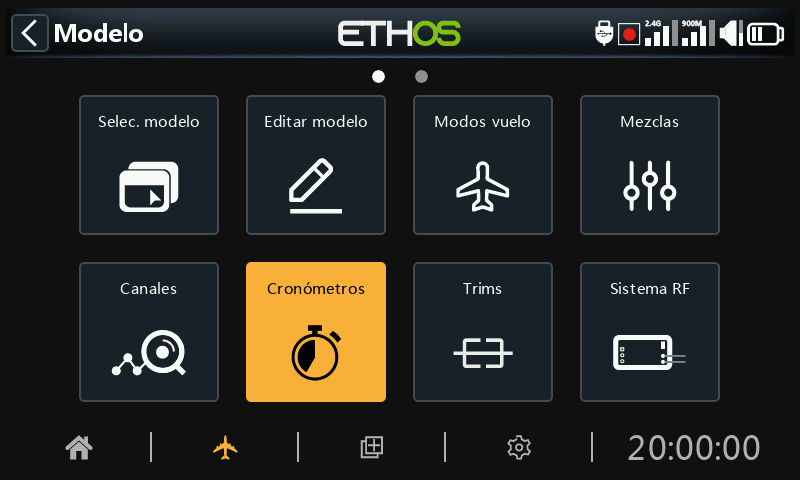

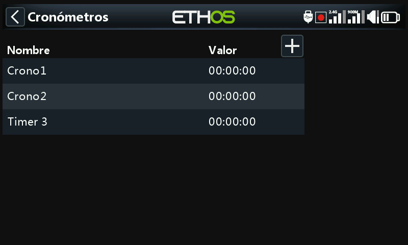

Hay 8 cronómetros totalmente programables que pueden contar de forma ascendente o cuenta-atrás.

En la pantalla principal de cronómetros, (vea arriba) se pueden añadir nuevos cronómetros tocando en el símbolo ‘+’ situado a la derecha en la cabecera.

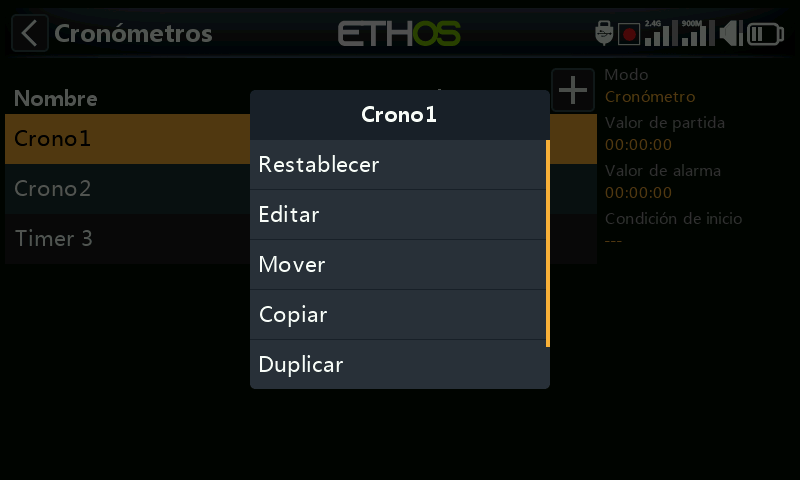

Al tocar cualquier línea del temporizador, aparece una ventana emergente con opciones para restablecer, editar, añadir uno nuevo, mover, o copiar/pegar el cronómetro.

## Cuenta-atrás (cronómetro descendente)

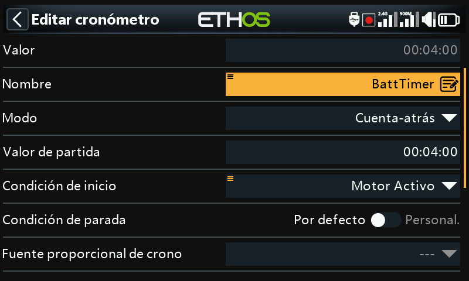

### Valor

Muestra el valor actual del cronómetro.

### Nombre

Permite dar un nombre al cronómetro.

### Modo

El cronómetro puede contar ascendente o **Cuenta-atrás** (Descendente).

### Valor de inicio

Si el cronómetro de ha ajustado para cuenta-atrás (descendente) este valor será el de inicio para la cuenta-atrás hasta cero.

### Condición de inicio

La condición de inicio es la que activa el cronómetro. Si la condición de inicio está ajustada por defecto, el cronómetro empezará a medir y parará con la condición de inicio. Si la condición de parada no es por defecto, el cronómetro empezará a medir cuando la condición de inicio sea verdadera y luego seguirá midiendo indefinidamente.

### Condición de paro

Si la condición de parada es por defecto, el cronómetro estará controlado sólo por la condición de inicio.

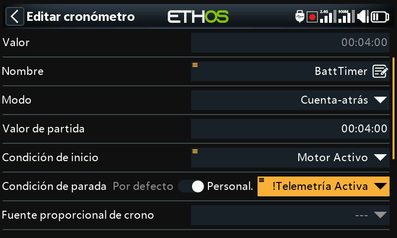

Si el cronómetro no se ha configurado por defecto, una vez que ha empezado la cuenta la condición de parada es la que controlará el cronómetro. El cronómetro se parará cuando la condición de parada sea verdadera (True) pero continuará funcionando si la condición de parada es falsa (False).

En el ejemplo de arriba, el cronómetro se activa cuando el acelerador activo se hace verdadero (true) y se para cuando la telemetría ya no está activa.

### Fuente proporcional de tiempo

Si se ajusta a ‘---’ el cronómetro contará en tiempo real. Si se selecciona una Fuente proporcional para temporizar, la velocidad del cronómetro estará controlada por esa Fuente, por ejemplo, la palanca del motor o incluso el canal del motor. Cuando el valor de motor sea -100%, el crono se parará. Cuando el valor es de +100%, el crono contará en tiempo real. Cuando los valores de motor sean intermedios, el crono contará proporcionalmente.

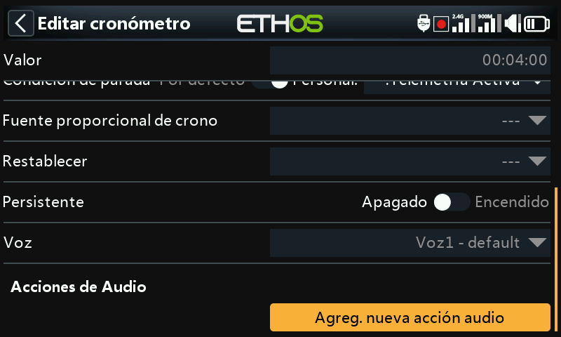

### Reseteo

El crono se puede restablecer con posiciones de interruptor, de función, interruptores lógicos, o ajustes de compensado. Tenga en cuenta que el crono se mantendrá en reseteo mientras la condición de reseteo siga siendo válida.

### Persistente

Activar la condición Persistente, permite almacenar el valor del crono en la memoria cuando la radio se apaga o el modelo se cambia. El valor se recargará la próxima vez que el modelo se seleccione.

### Voz

Seleccione la voz que desee para usar alertas por voz. Para más detalles, vaya a la sección de [Selección de Voces](#Choice of Voices) ya descrita anteriormente.

### Acciones audio

Las Acciones Audio con muy potentes y flexibles, permitiendo que las alertas de los cronómetros se ajusten exactamente a las necesidades del usuario.

Toque en ‘Agregar una nueva acción de audio’.

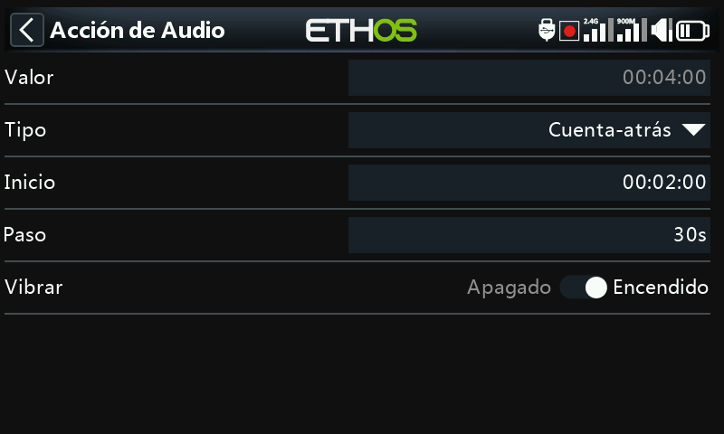

Seleccione el tipo de acción de audio requerida, por ejemplo. ‘Cuenta-atrás’ en la imagen de arriba.

#### Inicio

El valor de desde el que la acción de Cuenta-atrás empieza a contar.

#### Paso

Este valor ajusta los intervalos entre los cuales se realizarán los anuncios del valor del cronómetro. Este valor puede ajustarse hasta 10 minutos (600 segundos).

#### Vibrar

Si se activa, los avisos estarán acompañados de vibración.

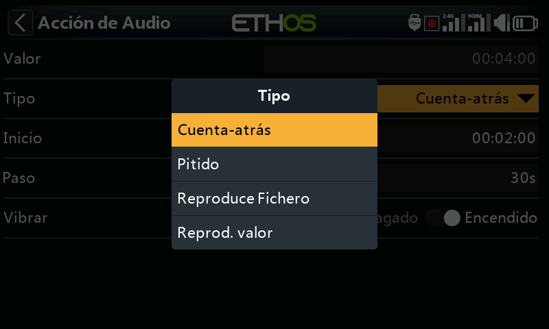

Los tipos de acciones de audio incluyen ‘Cuenta-atrás’ (por voz), ‘Pitido’ (el sistema da pitidos en lugar de los avisos), ‘Reproducir fichero’ y ‘Reproducir valor’.

En este ejemplo de arriba, se han configurado 3 acciones de audio:

- Primero, una cuenta atrás de 2 minutos que avisará cada 30 segundos. Se ha habilitado que la alerta se dará por voz y vibración.
- Después se ha establecido una Cuenta-atrás de 10 segundos remanentes, que activarán un pitido cada segundo. También se ha activado la vibración.
- Finalmente, un aviso de audio personalizado llamado ‘timer-1-elapsed’ se activará cuando el crono acabe (por ejemplo, llegue a cero) acompañado de una vibración.

Se pueden añadir acciones audio adicionales, simplemente tocando el botón ‘Añadir’. Tenga en cuenta que el listado debe estar hecho en orden de prioridad, con la mayor prioridad al final de la lista.

## Cronómetro ascendente

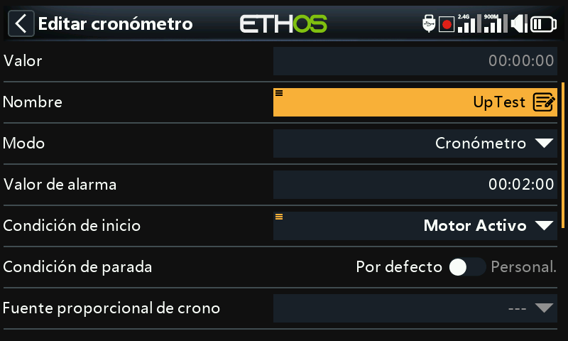

### Valor

Muestra el valor actual del cronómetro.

### Nombre

Permite darle un nombre al cronómetro.

### Modo

El crono puede contar de forma **Ascendente** o Descendente.

### Valor de alarma

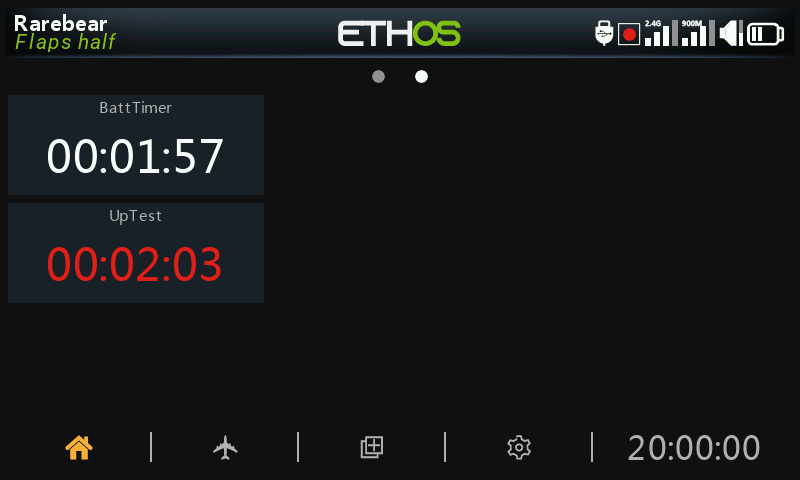

Si el crono se ha ajustado para contar hacia arriba, el valor establecido en las alarmas condicionará el valor en el que el crono se pare. El crono seguirá contando tiempo, pero el valor se pondrá de color rojo en el asistente.

### ***C******ondi******c******i******ó******n*** ***de inicio***

La condición de inicio es la que activa el crono. Si la condición de paro (párrafo siguiente) está en su valor por defecto, entonces el crono empieza y para de contar si se cumple sólo la condición de inicio. Si la condición de paro no está en su valor por defecto, entonces el crono empieza a contar cuando la condición de inicio es verdadera, y luego seguirá contando tiempo.

### ***C******ondi******c******i******ó******n*** ***de paro***

Si la condición de paro está por defecto, entonces el crono solo se controlará por la condición de inicio.

Si no está ajustada por defecto, una vez que el crono empieza a contar, la condición de paro lo controla. El crono se parará cuando la condición de paro sea verdadera, pero seguirá contando mientras la condición de paro sea Falsa.

### Fuente proporcional de tiempo

Si se ajusta a ‘---’ el cronómetro contará en tiempo real. Si se selecciona una Fuente proporcional para temporizar, la velocidad del cronómetro estará controlada por esa Fuente, por ejemplo, la palanca del motor o incluso el canal del motor. Cuando el valor de motor sea -100%, el crono se parará. Cuando el valor es de +100%, el crono contará en tiempo real. Cuando los valores de motor sean intermedios, el crono contará proporcionalmente.

### Restablecer el crono

El crono se puede restablecer con posiciones de interruptor, de función, interruptores lógicos, o ajustes de compensado. Tenga en cuenta que el crono se mantendrá en reseteo mientras la condición de reseteo siga siendo válida.

### Persistente

Activando la condición Persistente, se permite almacenar el valor del crono en la memoria cuando la radio se apaga o el modelo se cambia. El valor se recargará la próxima vez que el modelo se seleccione.

### Voz

Seleccione la Voz que se usará para las alertas por voz. Para más detalles, vaya a la sección de [Selección de Voces](#Choice of Voices) ya descrita anteriormente.

### Acciones de audio

Las Acciones Audio con muy potentes y flexibles, permitiendo que las alertas de los cronómetros se ajusten exactamente a las necesidades del usuario.

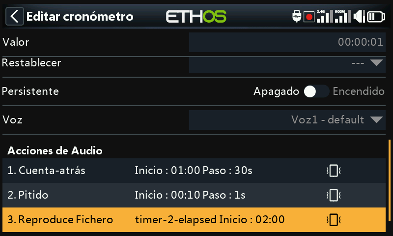

En este ejemplo, se han configurado 3 acciones de audio:

- Primero, una cuenta atrás de 2 minutos que avisará cada 30 segundos. Se ha habilitado que la alerta se dé por voz y vibración.
- Después se ha establecido una ‘Cuenta-atrás’ de 10 segundos remanentes, que activarán un pitido cada segundo. También se ha activado la vibración.
- Finalmente, un aviso personalizado de audio extraído de un archivo llamado ‘timer-2-elapsed’ se activará cuando el crono se pare al llegar al valor de alarma, acompañado de una vibración.

Se pueden añadir acciones audio adicionales, simplemente tocando el botón ‘Añadir’. Tenga en cuenta que el listado debe estar hecho en orden de prioridad, con la mayor prioridad al final de la lista.
