# Entrenador

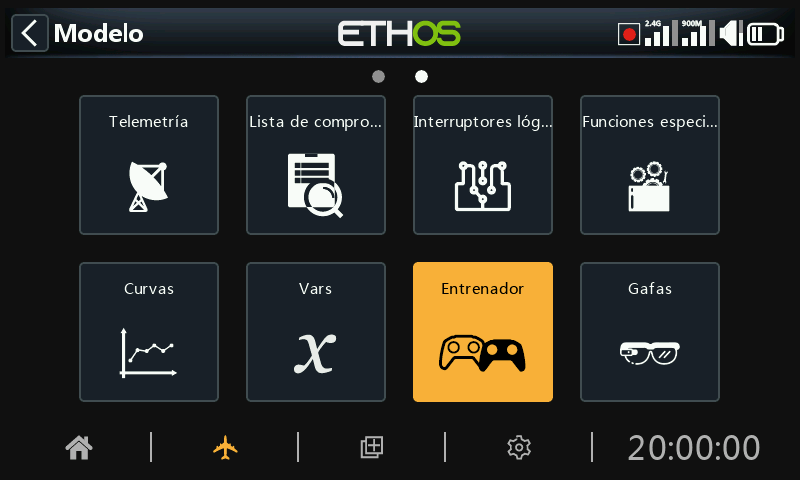

La función de Entrenador puede configurarse como maestro o esclavo. En modo maestro, pueden transferirse hasta 16 controles desde la radio esclava o del estudiante a la radio maestra o del instructor cuando la 'condición activa' está activa. En modo esclavo, un número configurable de canales se transfiere al maestro.  
  
Existen 5 métodos para configurar enlaces de entrenador, los cuales pueden usarse simultáneamente en cualquier dirección mediante:  
▪ Cable de entrenador  
▪ Bluetooth  
▪ SBUS en el conector del módulo externo  
▪ PPM en el conector del módulo externo (este no puede usarse al mismo tiempo que SBUS en el módulo externo)  
▪ SBUS en el conector S.Port de la radio  
  
Lo anterior también puede usarse para otras aplicaciones, como un módulo de seguimiento de cabeza que envía señales que la radio utiliza para controlar la vista de una cámara FPV.

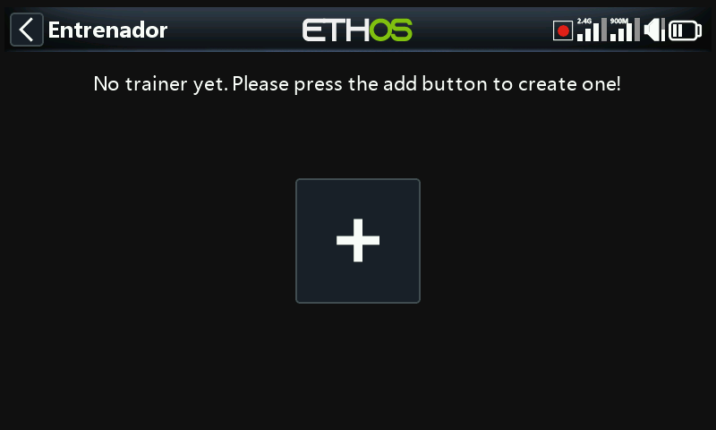

No hay enlaces de entrenador predeterminados. Toque el botón ‘+’ para agregar un nuevo enlace de entrenador.

Elija el método de conexión de entre las cuatro opciones que se listan.

## Cable entrenador

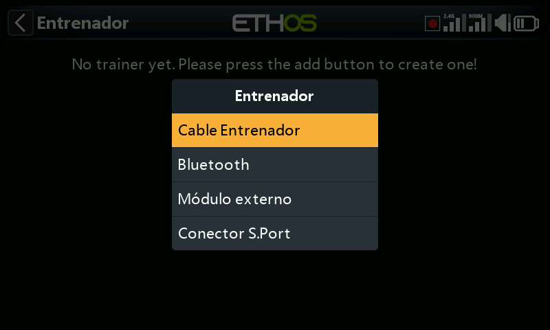

Toque en la opción ‘Cable Entrenador para configurar un enlace de entrenamiento usando un cable físico, que debería ser un cable audio mono de 3.5mm.

### Estado

La función Cable Entrenador puede deshabilitarse. Esto permite al usuario habilitar solo una pestaña de entrenador a la vez, mientras se conservan las diferentes configuraciones.

### Modo entrenador

#### Alumno (esclavo)

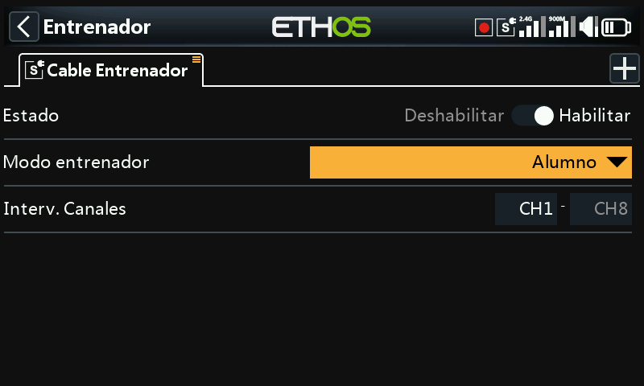

El modo por defecto para Cable Entrenador es Alumno.

##### Intervalo de Canales

Se transmiten ocho canales, con el número de canal de inicio configurable.

#### Maestro

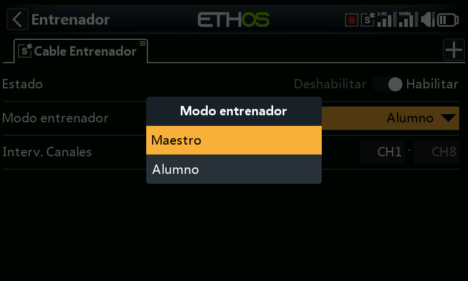

El modo Cable Entrenador puede cambiarse a Maestro para configurar la radio para el tutor.

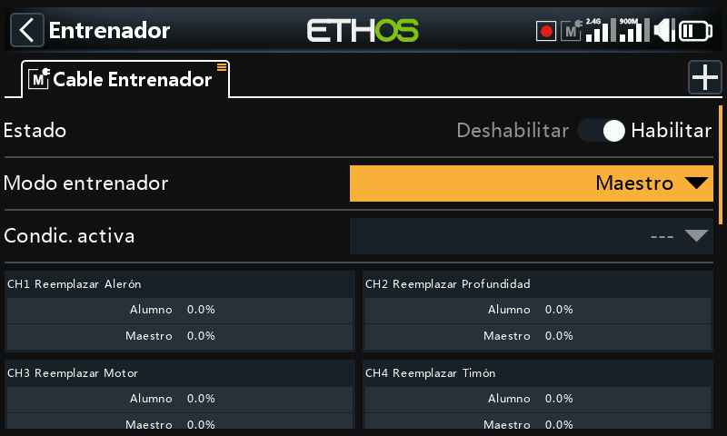

##### Configuración de modo Maestro

Vea la sección de [Configuración del modo Maestro](#Trainer master configuration) más abajo, para detalles sobre la configuración de su condición activa y los canales esclavizados.

#### Opciones del Cable Entrenador

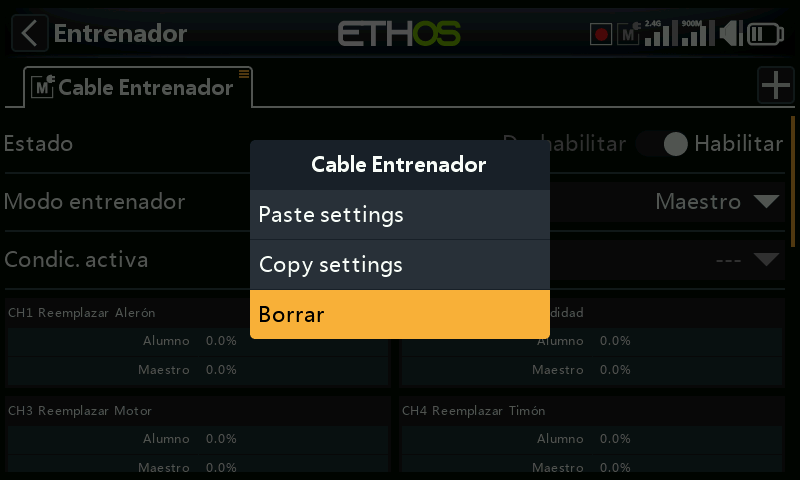

Tocando la pestaña ‘Cable Entrenador’ hará aparecer sus opciones.

Si se ha configurado el Cable Entrenador en modo maestro, entonces las opciones de copiar seguidas de pegar estarán disponibles. Esto permite que los ajustes del maestro se copien y se peguen entre los métodos de entrenamiento.   
  
Finalmente, hay disponible una opción de borrar para eliminar la pestaña de configuración del cable entrenador.

## Bluetooth

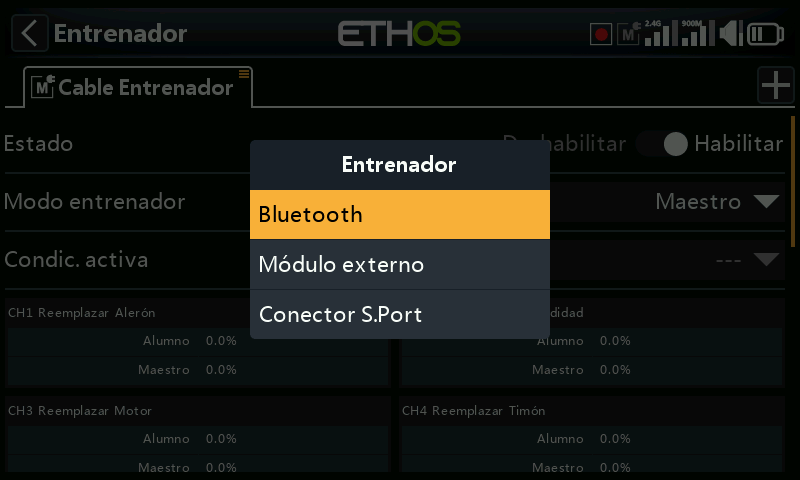

Seleccione la opción ‘Bluetooth’ para configurar una enlace de entrenamiento mediante Bluetooth.

### Estado

La función de entrenamiento por Bluetooth puede deshabilitarse. Permite al usuario habilitar solo una pestaña de entrenador a la vez, mientras se conservan las diferentes configuraciones.

### Modo del Entrenador

#### Alumno (esclavo)

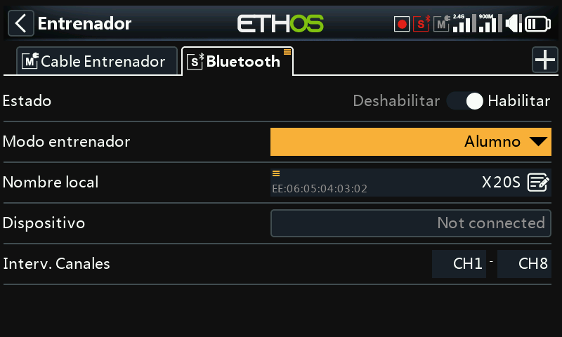

El modo de entrenamiento por defecto para bluetooth es Alumno (esclavo).

##### Nombre local

Es el nombre local BT que se mostrará en los dispositivos conectados. El nombre por defecto será el de la emisora.

##### Dispositivo

Detalla el estado de la conexión Bluetooth.

##### Intervalo de canales

Por defecto se transmitirán los primeros ocho canales, pero esta opción es configurable.

#### Maestro

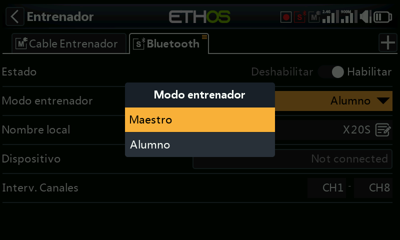

El modo de entrenamiento Bluetooth trainer puede cambiarse a Maestro para configurar la radio del tutor.

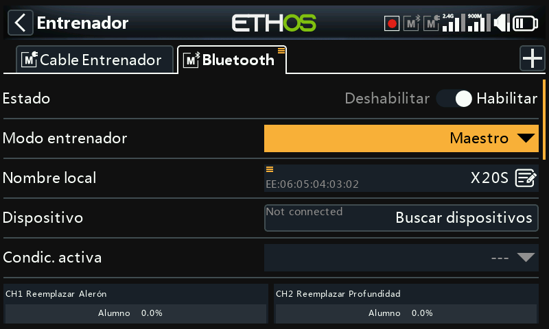

##### Nombre local

Es el nombre local BT que se mostrará entre los dispositivos conectados. El valor por defecto es el del modelo de la radio, pero puede editarse.

##### Dispositivo

##### Buscar dispositivos

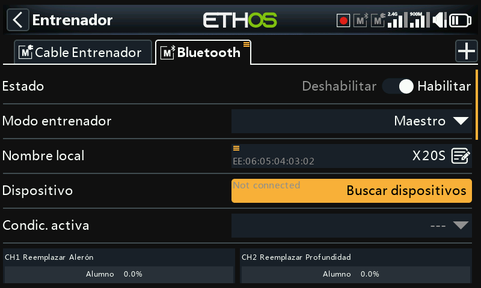

Toque en 'Buscar dispositivos' para poner la radio en modo de detección BT.

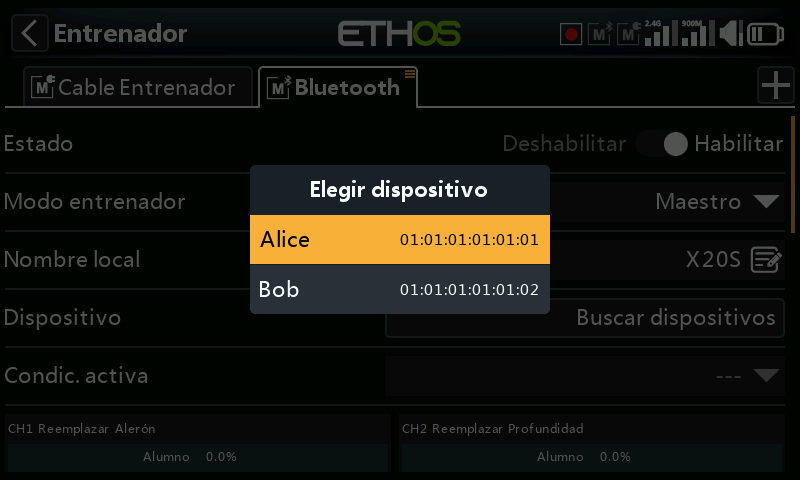

Los dispositivos encontrados se enumeran en un cuadro de diálogo emergente con una solicitud para seleccionar uno de ellos. Seleccione la dirección BT que coincida con la radio que se utilizará como compañero de entrenamiento.

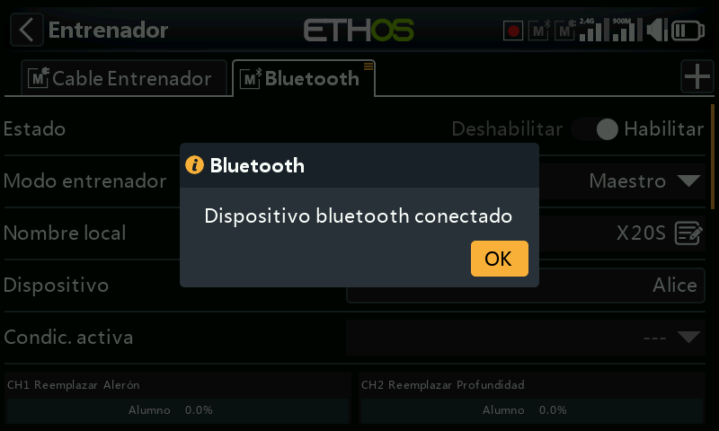

El dispositivo BT seleccionadose ha conectado.

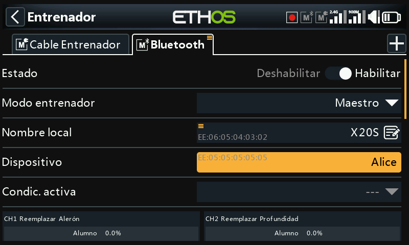

Una vez que se ha encontrado y enlazado un dispositivo Bluetooth, la dirección Bluetooth del dispositivo remoto se muestra en la línea del Dispositivo.

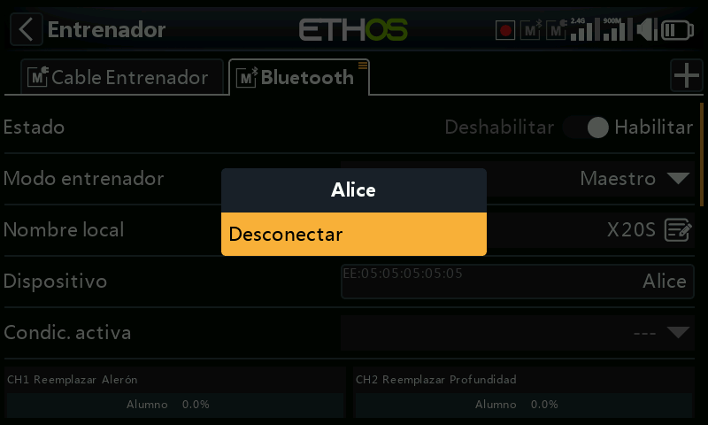

##### Desconectar

Toque en el dispositivo para que aparezca la opción de Desconectar.

#### Configuración del Maestro

##### Condición activa

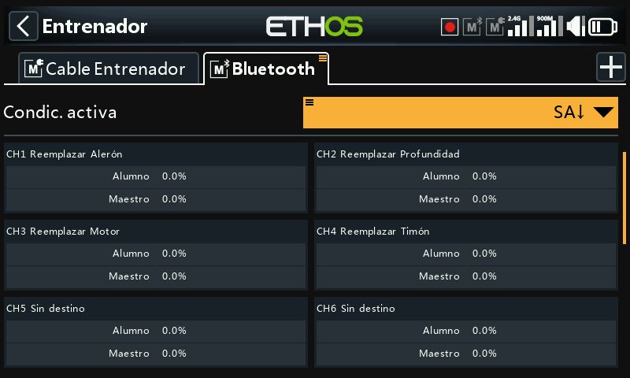

El control del modelo puede transferirse a la radio del estudiante mediante un interruptor o botón, un interruptor de función, interruptor lógico, posición de ajuste o modo de vuelo.

##### Canales de entrenamiento

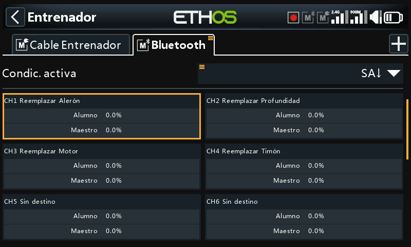

Se pueden transferir hasta 16 controles desde la radio del estudiantea la radio del maestro cuando la 'Condición active' que se ajuste arriba esté activa.

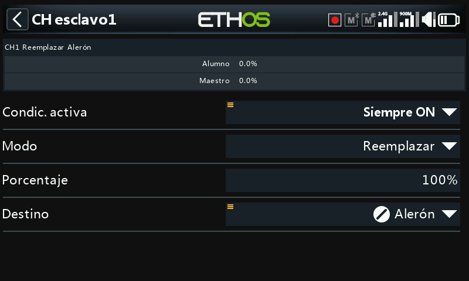

Toque en cada canal para configurarlo individualmente.

##### Active condition

Cada canal esclavo también puede ser controlado individualmente por una fuente seleccionada. Así que, por ejemplo, la entrada del elevador del estudiante puede ser desactivada durante una sesión.

##### Modo

##### OFF

Deshabilita el canal para uso del entrenador.

##### Añadir

Selecciona el modo aditivo, donde ambas señales del maestro y del alumno se añaden de forma que el profesor y el estudiante puedan actuar a la vez.

##### Reemplazar

Reemplaza el control de la radio principal con la del estudiante, de modo que el estudiante tenga control total mientras la 'condición activa' esté activada. Este es el modo de uso normal.

##### Porcentaje

Normalmente se ajusta a 100%, pero puede usarse para escalar las entradas del alumno.

##### Destino

Asigna el canal de la radio del estudiante a la función correspondiente.

### Option de Ignorar entradas de entrenador

En los interruptores lógicos, las fuentes pueden tener esta opción configurada para ignorar las fuentes que provienen de la entrada del entrenador. Una aplicación típica es cuando un interruptor lógico está configurado para detectar el movimiento de las palancas del entrenador principal (por ejemplo, la palanca del elevador) para permitir una intervención instantánea si algo sale mal. Esta opción es necesaria para evitar que las entradas de la palanca del estudiante activen el interruptor lógico.

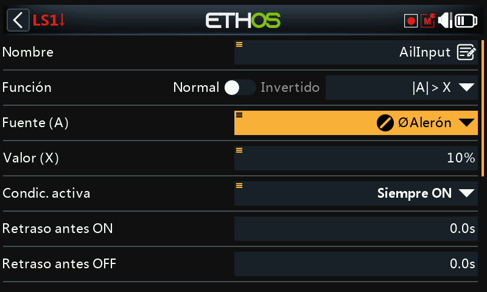

El pequeño icono de 'círculo tachado' muestra que la fuente del Elevador ignorará las entradas del Elevador desde la radio del estudiante.

### Opciones de entrenamiento Bluetooth

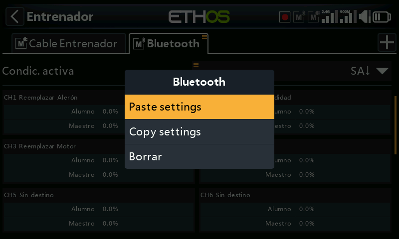

Tocando la pestaña 'Bluetooth' se muestran las opciones de la pestaña Bluetooth.  
  
Si se ha configurado un maestro con Bluetooth, entonces las opciones de copiar seguidas de pegar se volverán disponibles. Esto permite copiar y pegar los ajustes de entrenamiento del maestro entre los distintos métodos de entrenamiento.

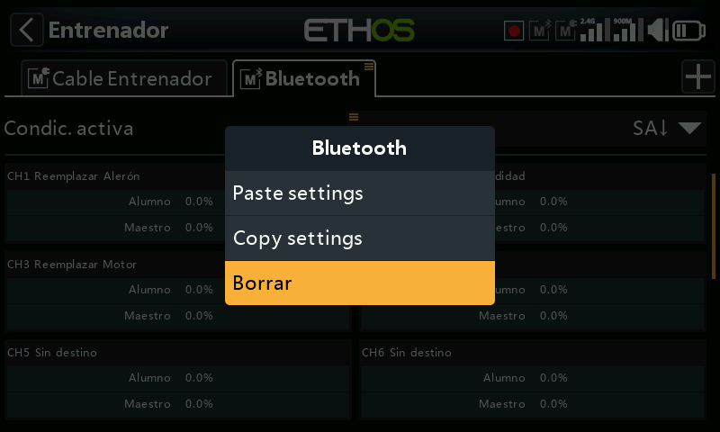

Finalmente, estará disponible un opción Borrar para eliminar la configuración BT.

## Módulo externo

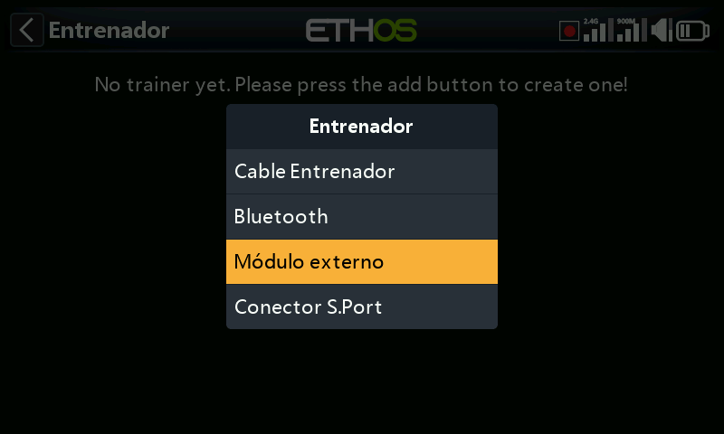

Seleccione la opción ‘Módulo externo’ para configurar un enlace de entrenador usando un módulo externo.

### Estado

La función de entrenamiento por módulo externo puede deshabilitarse. Esto permite al usuario habilitar una sola pestaña de entrenamiento cada vez, conservando otras configuraciones diferentes.

### Modo de entrenamiento

### Alumno (esclavo)

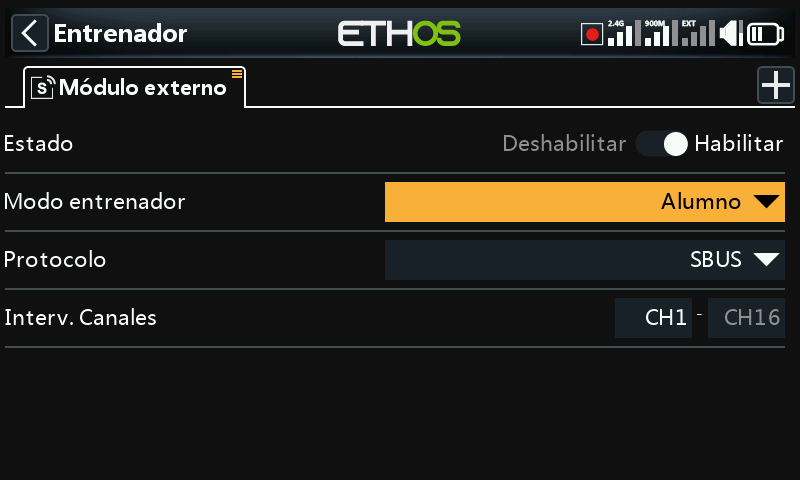

El modo por defecto para entrenamiento a través de módulo externo es Alumno (esclavo).

##### Protocolo

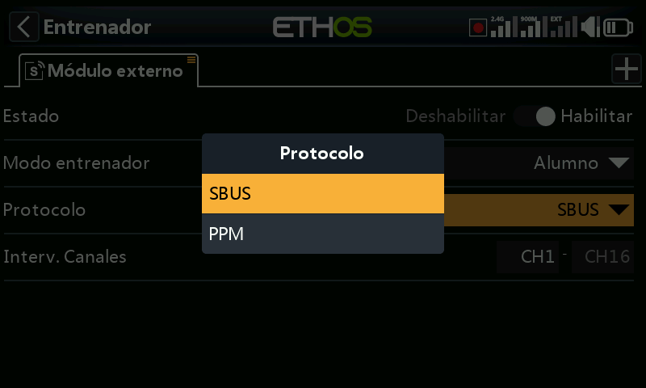

Hay 2 opciones de protocolo para un enlace de entrenador esclavo usando la interfaz del módulo externo en la parte trasera del radio:

##### SBUS

Vea la sección [SBUS](rf-system.md) en Modelo /RF para detalles sobre configurar el interface del módulo externo para una conexión SBUS de entrenamiento.

##### PPM\`

Vea la sección [PPM](#PPM) en Modelo /RF para detalles sobre configurar el interface del módulo externo para una conexión PPM de entrenamiento.

##### Rango de canales

Con SBUS se transmiten16 canale. Con PPM se transmiten ocho canales, pero el canal de inicio es configurable.

#### Maestro

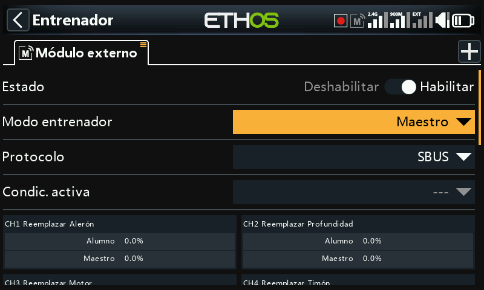

##### Protocolo

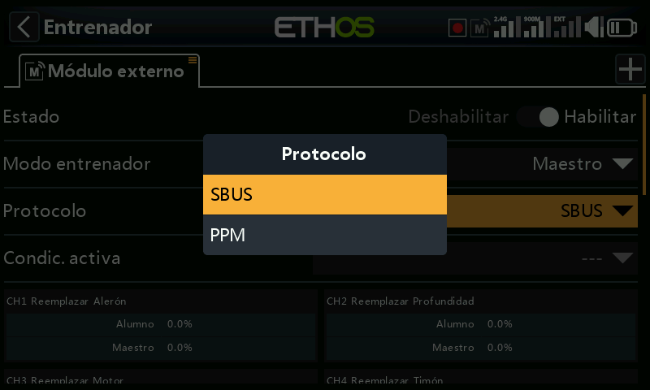

Hay 2 protocolos opcionales para enlaces como maestro usando la interfax del módulo externo de la parte trasera de la radio:

##### Entrenador maestro (SBUS)

Vea la sección [Entrenador maestro (SBUS)](rf-system.md) en Modelo /RF para detalles sobre configuración del interface del módulo externopara una conexión SBUS de entrenamiento.

##### Entrenador maestro (PPM)

Vea la [Trainer master (PPM)](rf-system.md) en Modelo /RF para detalles sobre configuración del interface del módulo externopara una conexión PPM de entrenamiento.

##### Trainer master configuration

Vea la sección [Configuración del entrenador maestro](#Trainer master configuration) más abajo, para detalles sobre la configuración de la ‘Condición activa’ del modo maestro de entrenamiento y los canales esclavos.

#### Opciones del cable entrenador

Tocando en la pestaña del ‘conector S.Port’ aparecerán las opciones disponibles.

Si se ha configurado un entrenador maestro, entonces las opciones de copiar seguidas de pegar se vuelven disponibles. Esto permite que la configuración del entrenador maestro se copie y se pegue entre los métodos del alumno.  
  
Finalmente, está disponible una opción Borrar para eliminar la pestaña de configuración del módulo externo.

## Conector S.Port

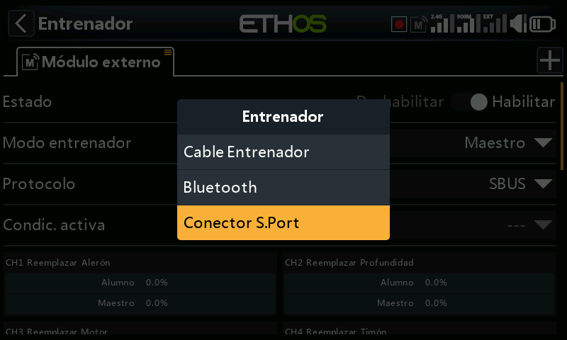

Seleccione la opción ‘Conector S.Port’ para configurar un enlace de entrenamiento usando el conector S.Port de la parte superior de la radio.

### Estado

La función de enlace de entrenamiento a través del conector puede deshabilitarse. Esto permite que el usuario utilice una pestaña de entrenamiento cada vez, conservando las diferentes configuraciones.

### Modo de Entrenamiento

#### Alumno (esclavo)

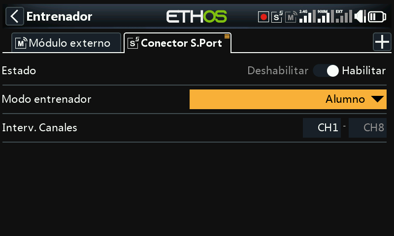

El modo predeterminado para un entrenador con conector S.Port es Alumno (esclavo).

##### Intervalo de canales

Por defecto se transmiten los primeros ocho canales, pero esto se puede configurar.

#### Maestro

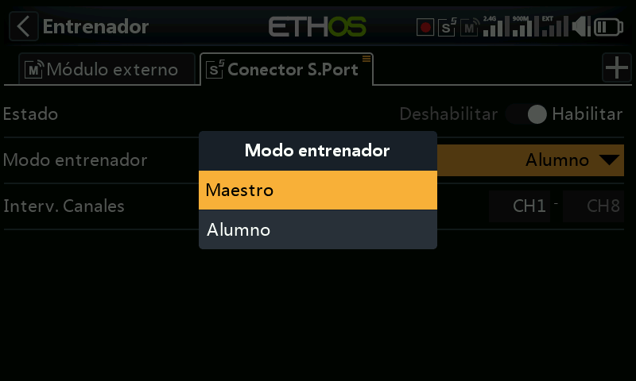

El modo de entrenamiento del conector S.Port puede cambiarse a Maestro para configurar la radio para el tutor.

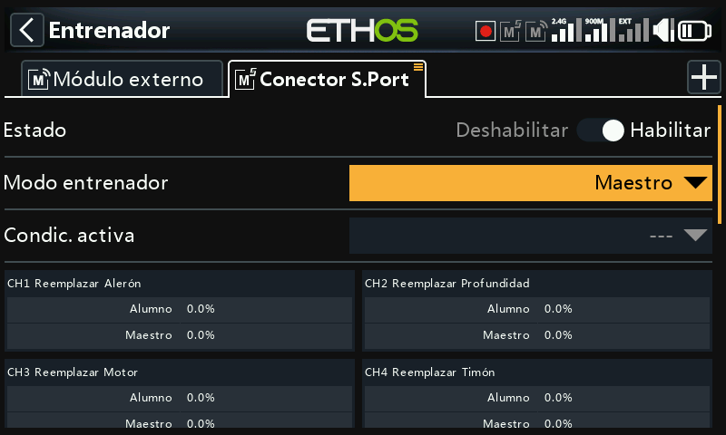

##### Configuración del entrenador maestro

Vea la sección [Configuración del entrenador maestro](#Trainer master configuration) más abajo para configurar la ‘Condición activa’ y los canales esclavos del entrenador maestro.

#### Opciones del cable entrenador

Al tocar la pestaña 'Conector S.Port' se muestran las opciones de la pestaña.  
  
Si se ha configurado un entrenador maestro, entonces las opciones de copiar seguidas de pegar se vuelven disponibles. Esto permite que la configuración del entrenador maestro se copie y se pegue entre los métodos del entrenador.  
  
Finalmente, hay una opción de Borrar que estará disponible para eliminar la pestaña de configuración del conector S.Port.
