# Entrenador

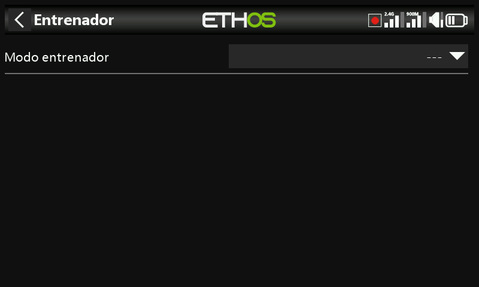

La función Entrenador está desactivada por defecto. La radio se puede configurar
como **Maestro** (la radio del instructor, que recibe hasta 16 controles de la
radio del alumno) o como **Esclavo** (la radio del alumno, que transfiere al
maestro un número configurable de canales).

## Modo Maestro

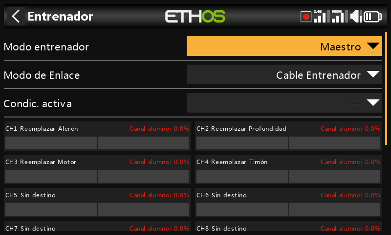
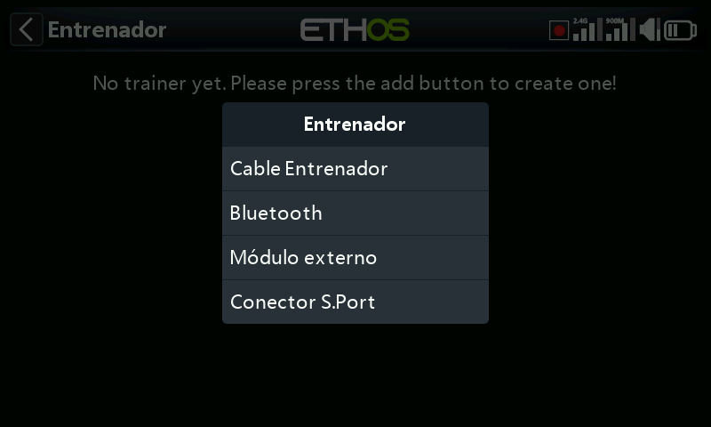

### Modo de enlace

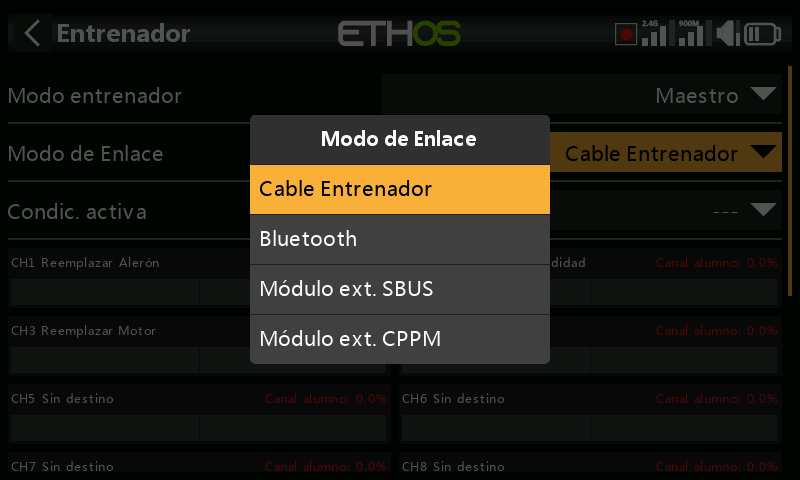

- **Cable de entrenamiento** — un cable de audio mono de 3,5 mm entre las dos radios.
- **Bluetooth** —

  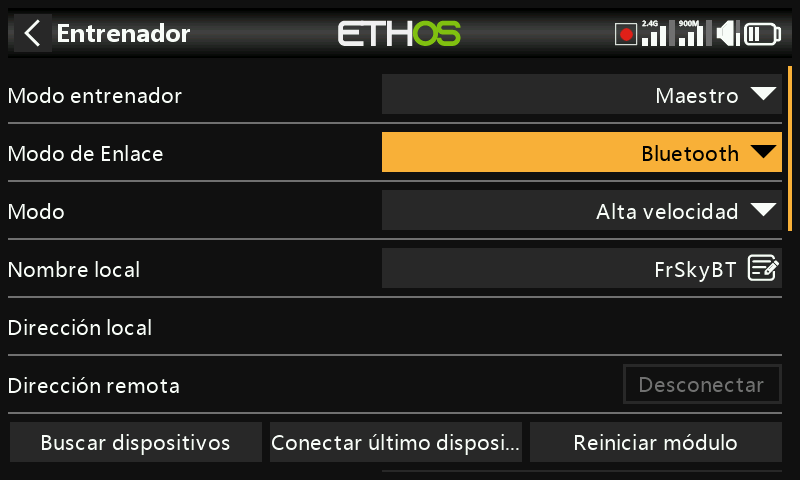

  - **Modo** — velocidad normal o alta velocidad; para una latencia más baja,
    utilice el ajuste de alta velocidad si ambas radios lo admiten.

    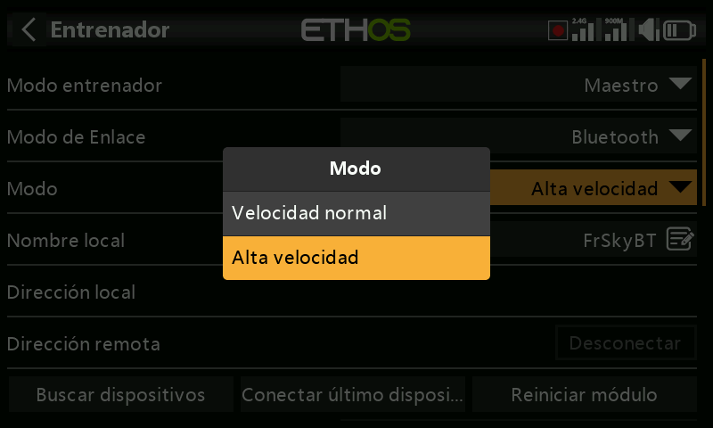

  - **Nombre local** — el nombre BT local que se mostrará en los dispositivos
    que se conecten (por defecto `FrSkyBT`, pero puede editarse).
  - **Dirección local** — la dirección Bluetooth local de la radio.
  - **Dirección remota** — la dirección Bluetooth del dispositivo remoto, una
    vez encontrado y vinculado.
  - **Buscar dispositivos** (solo en modo Maestro) — pone la radio en modo de
    búsqueda BT de los dispositivos cercanos:

    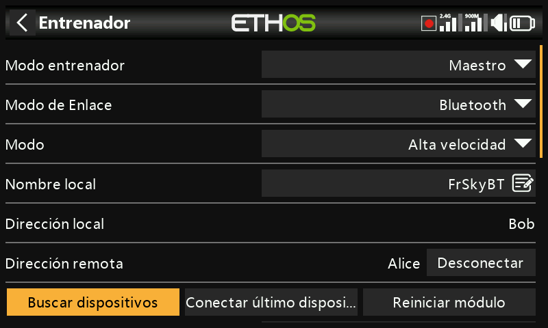
    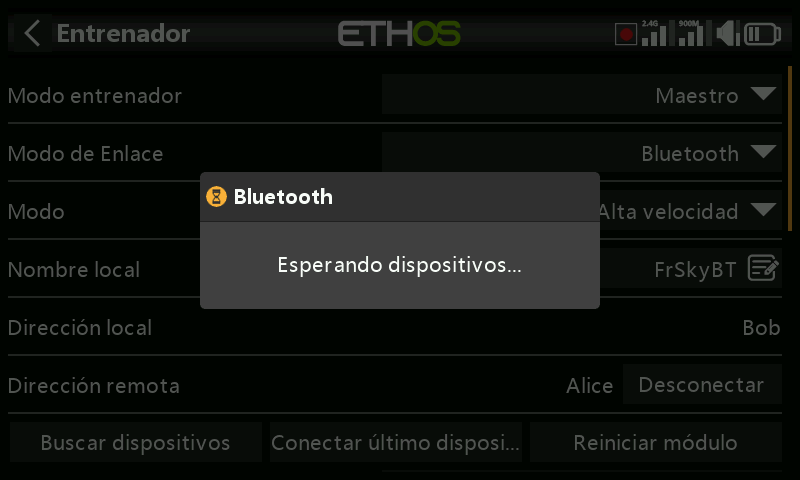
    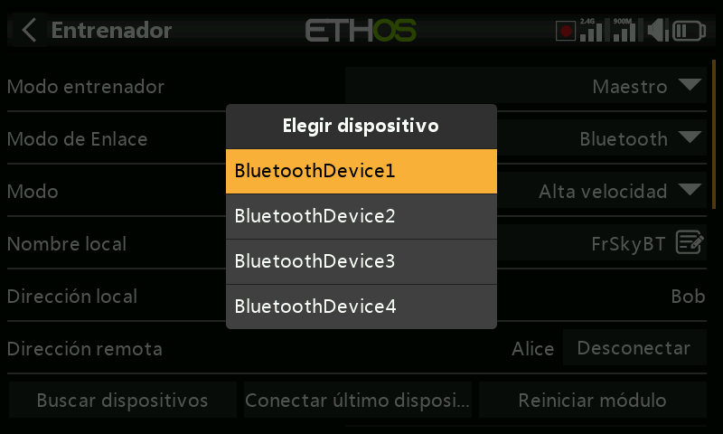
    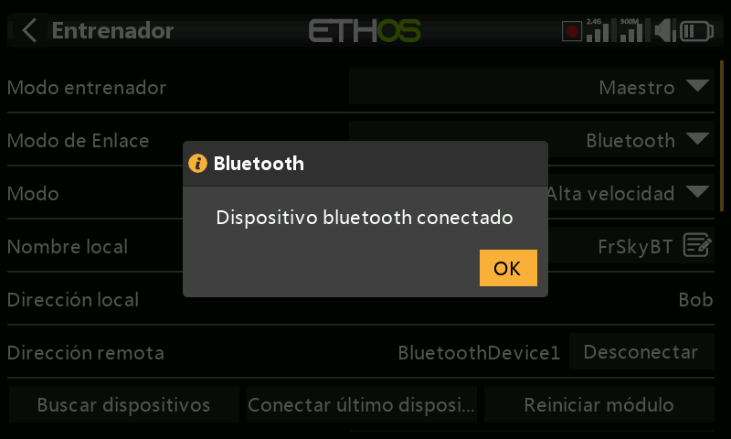

  - **Conectar el último dispositivo** / **Restablecer el módulo** — conecta con
    el último dispositivo configurado, o restablece el módulo y limpia todos los
    ajustes de su configuración.

- **Módulo SBUS externo** — proporciona una entrada SBUS al pin PXX-IN de la
  bahía del módulo externo de la radio, para instalar un receptor FrSky dotado
  de salida SBUS (por ejemplo, un Archer RS) que actúe como el extremo receptor
  de un enlace inalámbrico de entrenamiento, de forma que **cualquier** radio
  FrSky pueda hacer de radio del alumno (buddy box), emparejada con ese receptor.
- **Módulo externo CPPM** — de forma similar, proporciona una entrada CPPM al
  pin PXX-IN, para usarse con un receptor antiguo que tenga salida CPPM.

### Condición activa

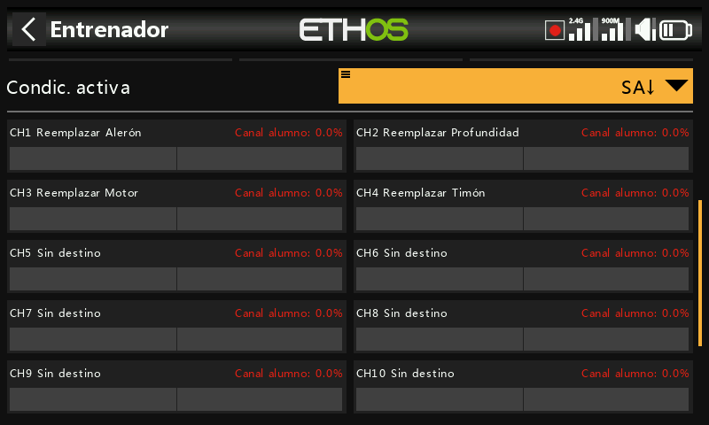

Un interruptor o botón, un interruptor de función, un interruptor lógico, la
posición de compensado o el modo de vuelo que cede el control del modelo a la
radio del alumno mientras esté activo.

### Canales del entrenador

Se pueden transferir hasta 16 canales de la radio del alumno a la radio maestra
mientras la 'Condición activa' esté activa. Pulse sobre cada canal para
configurarlo individualmente:

- **Condición activa** — una condición propia de cada canal; por ejemplo, para
  desactivar únicamente la palanca de profundidad del alumno durante parte de
  una sesión de entrenamiento.
- **Modo** — **OFF** (desactiva el canal para uso del entrenador), **Añadir**
  (modo aditivo, en el que se suman las señales del maestro y del alumno para
  que ambos puedan actuar sobre la función a la vez) o **Sustituir** (el modo de
  uso normal: el alumno tiene el control total de este canal mientras está
  activada la condición).
- **Porcentaje** — escala las entradas del alumno; normalmente se ajusta al 100 %.
- **Destino** — asigna el canal del alumno a la función correspondiente.

Consulte [Guía práctica: recuperación instantánea del control](../how-to/instant-takeback.md)
para ver un ejemplo práctico de cómo el instructor recupera el control al
instante mediante un interruptor, y [Ignorar la entrada del alumno](../getting-started/user-interface-and-navigation.md#choosing-a-source)
para evitar que el movimiento de las palancas del alumno active un interruptor
lógico que vigila las palancas del propio instructor.

## Modo Esclavo

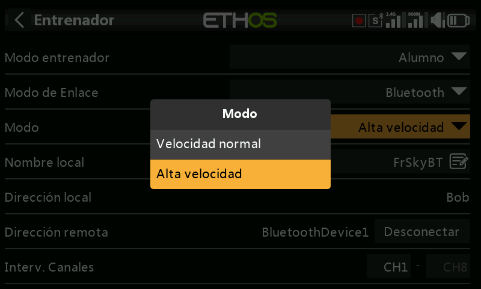

- **Modo de enlace** — las mismas opciones de cable de entrenamiento, Bluetooth
  o módulo externo SBUS/CPPM que en Maestro (con los mismos campos Bluetooth
  **Modo**/**Nombre local**/**Dirección local**/**Dirección remota**).

  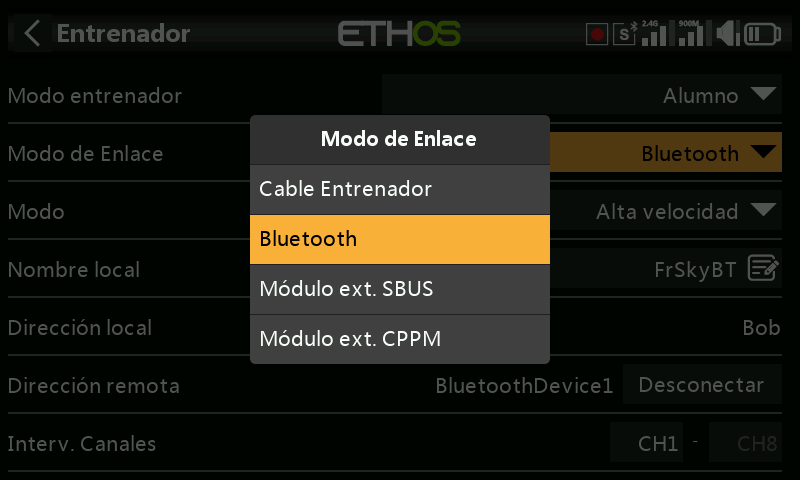

- **Número de canales** — selecciona qué rango de canales de esta radio se
  transfiere a la radio maestra.

  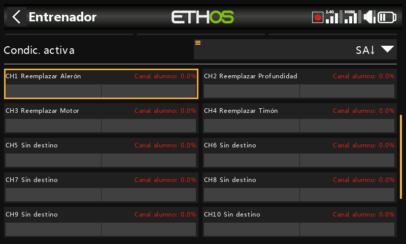
  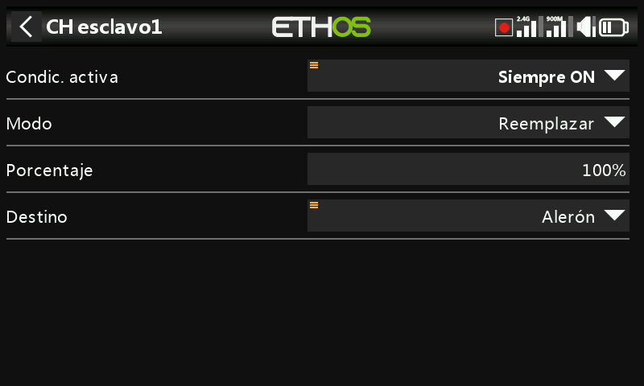
