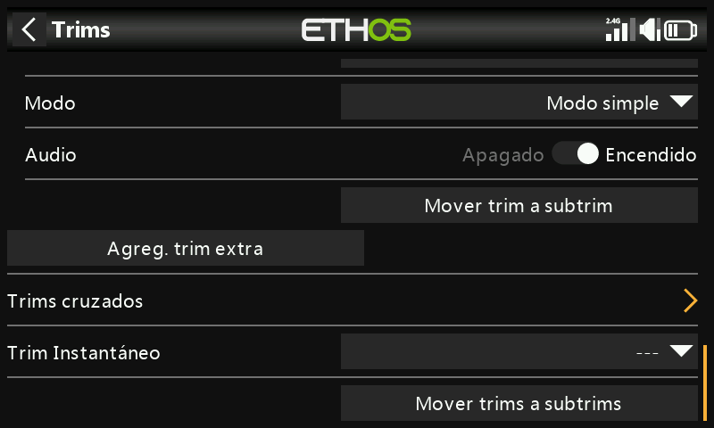

# Trims

Configura el intervalo de compensado de cada palanca, el tamaño de paso y
su comportamiento, además de los compensadores cruzados y el compensador
instantáneo. La **X20 Pro/R/RS** y la **X18** añaden dos interruptores de
compensado adicionales, **T5**/**T6**, útiles para ajustes en vuelo más
allá de las cuatro palancas principales:

Cada palanca dispone de su propio conjunto independiente de ajustes de
compensado.

## Ajustes de compensado {: #trim-settings }

- **Range** (intervalo de compensado) — por defecto ±25%, ajustable hasta
  el ±100% completo de la palanca. En la pantalla principal, un
  compensador con el intervalo por defecto muestra de −100 a 100; uno de
  intervalo completo (100%) muestra de −400 a 400 (4× el intervalo
  normal).

  !!! warning
      Ampliar el intervalo implica que mantener pulsado un compensador
      demasiado tiempo puede añadir compensado suficiente como para hacer
      el modelo impilotable.

- **Step** (paso) — granularidad del interruptor de compensado: **Extra
  fine** (extra fino), **Fine** (fino), **Medium** (medio), **Coarse**
  (grueso), **Exponential** (exponencial: fino cerca del centro y grueso
  hacia los extremos) o **Custom** (personalizado: un porcentaje concreto
  por clic).

  

  | Paso | µs por clic (intervalo 25%) |
  |---|---|
  | Extra fine | 0,5 |
  | Fine | 1 |
  | Medium | 2 |
  | Coarse | 4 |
  | Exponential | 0,3–16 |

  Personalizado, con un intervalo del 25%: paso del 1% = 1 µs/clic, paso
  del 100% = 128 µs/clic. Con un intervalo del 100%: paso del 1% =
  5 µs/clic, paso del 100% = 512 µs/clic.

## Modo

Por defecto, el compensador está siempre activo, pero **Mode** (modo)
cambia ese comportamiento. Al cambiar de modo, el compensador se pone a 0.

- **OFF** — deshabilita por completo el compensador.

  

  Útil, por ejemplo, en un modelo eléctrico que no necesita compensador de
  gases: el compensador liberado puede
  [reasignarse para ajustar una Var](variables.md).

- **Easy** (modo simple) — un único valor de compensado compartido en
  todos los modos de vuelo. Esto es normalmente apropiado para alerones y
  timón, ya que su trimado casi no varía en los distintos modos de vuelo.

  

- **Independiente por modo de vuelo** — el compensador afectará tan sólo
  al modo de vuelo activo. Esta opción se usa normalmente para el
  compensado en profundidad, ya que su compensado típicamente variará en
  cada modo de vuelo, debido generalmente a la distinta configuración de
  las alas; de hecho, ésta suele ser la razón principal de tener que usar
  los modos de vuelo.

  

- **Custom** (personalizado) — el comportamiento del compensado se ajusta
  por completo a las necesidades de cada usuario, a partir de los
  **comportamientos** que uno mismo añada.

### Comportamientos de compensado personalizados

Cada línea de comportamiento tiene una condición y una de estas opciones:

- **Unplugged** (desenchufado) — deshabilita el compensador de forma
  selectiva bajo esa condición (en lugar de desactivarlo por completo con
  Mode = OFF).

  
  

- **Normal** (por defecto) — comportamiento de compensado normal.
- **Equal (to another trim)** (igual a otro compensador) — el compensador
  de una condición específica sigue exactamente el valor del compensador
  de otra condición.

  

- **Offset + (another trim)** (desplazamiento + otro compensador) — el
  compensador de una condición específica se añade al compensador de otra
  condición.

  

**Ejemplo práctico** — un planeador con un compensado base en profundidad
en **Cruise** (crucero) y compensadores dependientes para **Speed**
(velocidad) y **Thermal** (térmico):

1. Compense para vuelo nivelado en el modo por defecto (Cruise).
2. Añada un comportamiento: **Offset + Default**, con la condición
   `FM5(Speed)`. A partir de ahora, cualquier ajuste del compensador que
   se haga en el modo Speed se guardará como un desplazamiento de los
   valores de compensado base de Cruise: distinto, pero dependiente de él.

   

3. Añada un segundo comportamiento: **Offset + Default**, con la condición
   `FM4(Thermal)`, de la misma forma. (Tenga en cuenta que, una vez creado
   el primer comportamiento, el cuadro de diálogo ofrece además
   `Equal FM5(Speed)` y `Offset + FM5(Thermal)`, ya que ahora también
   puede referirse a ese comportamiento).

   

Con esta configuración, si más adelante hay que cambiar el compensado base
de crucero (por ejemplo, porque se ha alterado el centro de gravedad), los
compensadores de Speed y Thermal se desplazarán automáticamente en la
misma medida, ya que son desplazamientos sobre él y no valores
independientes.

- **Audio** — para un compensador reasignado a otro propósito se pueden
  desactivar los sonidos estándar de compensado, si ya no tiene sentido
  oírlos.

## Compensadores adicionales

**Add an extra trim** (añadir un trim extra) crea un compensador más allá
de las cuatro palancas estándar (y T5/T6): **Name** (nombre), las fuentes
**Up** (arriba) y **Down** (abajo) que lo accionan, además de las mismas
opciones **Range**, **Step**, **Mode** y **Audio** descritas arriba.

## Compensadores cruzados

Permite elegir qué interruptor de compensado ajusta realmente cada
palanca; es decir, que el compensado de una palanca se accione con un
control físico de compensado distinto del habitual. (T5/T6 sólo están
disponibles en la X20 Pro y la X18).

## Compensador instantáneo {: #instant-trim }

Mientras está activo, la posición actual de las palancas se añade a cada
uno de sus respectivos compensadores por defecto (y cruzados). Es mejor
asignarlo a un interruptor que pueda usarse sin tener que soltar las
palancas: actívelo con el avión volando recto y nivelado para ajustar
instantáneamente los compensadores, en lugar de pulsar repetidamente un
compensador cuando el modelo está totalmente fuera de compensación.
Desactívelo de nuevo después del vuelo de compensado, para evitar
desajustar los compensadores accidentalmente más adelante.

!!! note
    El compensador instantáneo sólo estará activo mientras se visualiza
    una de las pantallas principales.

## Mover trims a subtrims

Después de compensar el modelo para vuelo nivelado, esta función mueve el
valor de compensado de un canal (por ejemplo, el de profundidad) a su
ajuste de [Subtrim](outputs.md) en Salidas y deja el compensador a cero en
la pantalla principal: así se comprueba más fácilmente que los
compensadores de vuelo no se han movido desde entonces.

Cuando se usan modos de vuelo, un canal puede tener más de un valor de
compensado relevante, mientras que el Subtrim en Salidas es un ajuste
global que se aplica a todos los modos de vuelo. Esta función lo tiene en
cuenta: toma el compensado del modo de vuelo **seleccionado en ese
momento**, lo transfiere al Subtrim, resetea ese compensador y ajusta los
compensadores de todos los *demás* modos de vuelo en ese mismo canal para
compensarlo, de forma que la posición real de las superficies de control
en cada modo de vuelo acabe siendo la misma que antes.

!!! tip
    Ejecute siempre esta función desde el mismo modo de vuelo «base» (por
    ejemplo, crucero en un velero) para mantener la coherencia: se puede
    repetir sin problema mientras se haga siempre así.

Valores grandes de compensadores y de subtrim producen movimientos muy
asimétricos; es más inteligente corregir el problema mecánicamente.
Procure que los reenvíos queden a 90° con las superficies en neutro (con
la excepción de los flaps, en los que se sacrifica recorrido hacia arriba
para maximizar el recorrido hacia abajo) y, una vez que el reenvío esté lo
más cerca posible, use el **PWM center** (centrado PWM) para ajustarlo
exactamente a 90°.
