# Compensadores (Trims)

La sección de Compensadores le permite configurar el rango total de compensación, el recorrido del compensado con cada click, o configurar ajustes independientes para cada uno de las 4 palancas de control. También permite configurar ajustes cruzados de compensación y el compensado instantáneo (Instant trim).

Las radios X20 Pro/R/RS y la X18, tienen dos interruptores de compensado adicionales (T5 y T6) que son muy útiles para efectuar ajustes en vuelo.

Se pueden configurar compensadores adicionales cuando se requiera.

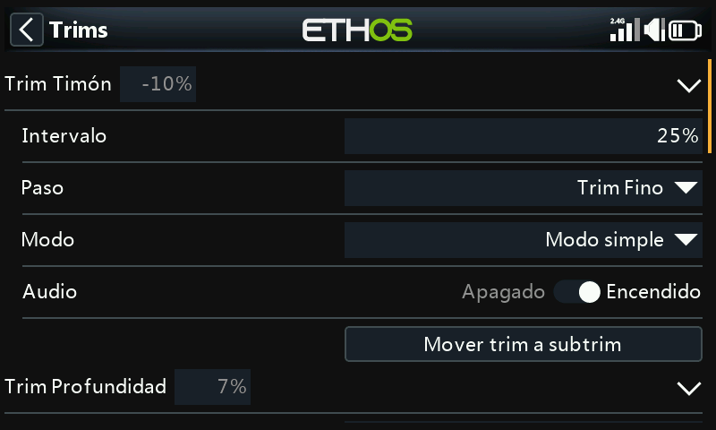

Hay un conjunto de compensadores para cada una de las palancas.

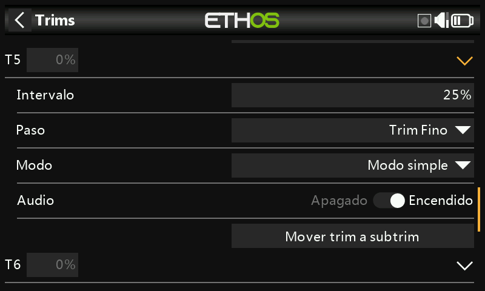

La X20 Pro y la X18 tienen dos interruptores de compensado adicionales T5 y T6.

## Ajustes de compesadores

### Intervalo de compensado

El movimiento de compensación por defecto es +/- 25%. Este rango se puede cambiarse para cubrir todo el movimiento completo de la palanca (100%). Mucho cuidado con esta opción, ya que mantener presionados los interruptores de compensación durante demasiado tiempo podría añadir tanta compensación y hacer su modelo imposible de volar.

Tenga en cuenta que en la pantalla principal el movimiento por defecto del compensador se mostrará desde -100 hasta +100. En caso de poner el ajuste del compensador al 100% mostrará -400 hasta +400 (4 veces el movimiento normal del compensador).

### Paso de compensación

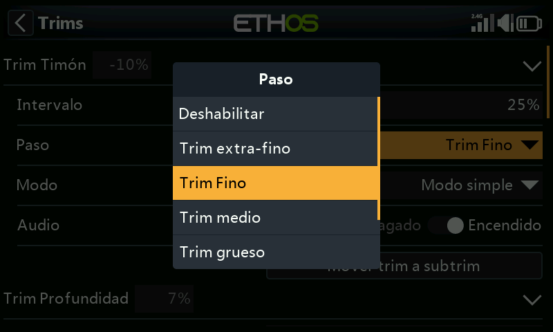

El parámetro Paso de compensación permite desactivar los compensadores o configurar el recorrido de la superficie a cada click del interruptor del compensador, desde Extra Fino, a Fino, Medio, Grueso, Exponencial, o personalizado. El ajuste Exponencial proporciona pasos finos cerca del centro y pasos gruesos más alejados. El ajuste Personalizado permite especificar el paso de compensador como un porcentaje.

Estableciendo el movimiento por defecto del 25%, los pasos de compensado por click serán:

Extra fino	0.5us

Fino	1us

Medio	2us

Grueso	4us

Exponencial	0.3us to 16us

Fara un compensador personalizado y con el movimiento al 25%, los pasos por click son:

Tamaño de paso 1%	1us

Tamaño de paso 100%	128us por paso

Para un compensador personalizado y con el movimiento al 100%, los pasos por click son:

Tamaño del paso 1%	5us

Tamaño del paso 100%	512us por paso

### Modos

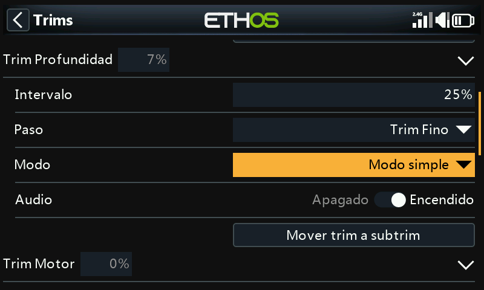

Por defecto, los compensadores están siempre funcionando, pero las opciones de compensado se pueden alterar para modificar su modo de comportamiento dependiendo de distintas condiciones.

Nota: Los compensadores se ajustarán a 0 cuando se cambia el modo de compensado

Hay cuatro modos de ajustar el comportamiento del compensador:

#### Apagado

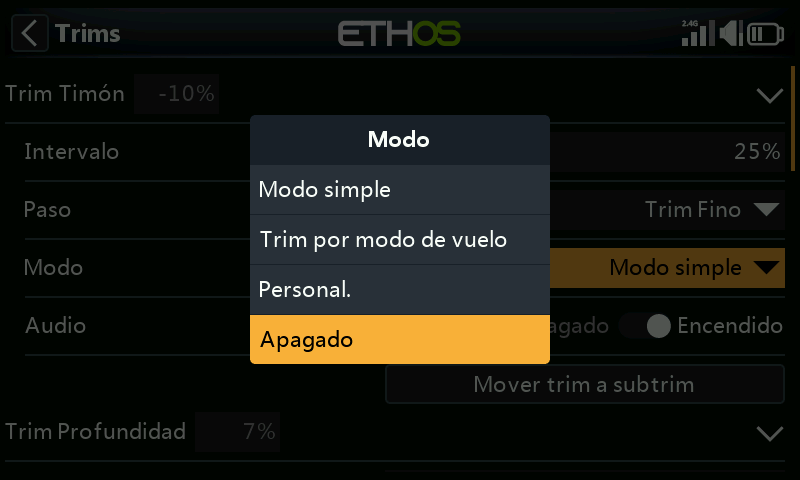

Con el modo de compensación en Apagado, se deshabilita la compensación.

Como ejemplo, en modelos eléctricos el compensador de motor no se necesita y puede desactivarse seleccionando su modo a OFF. El interruptor puede reprogramarse para ajustar una variable. Para más detalle, vea como [Reprogramar trim](variables.md) en la sección de Vars.

#### Modo simple

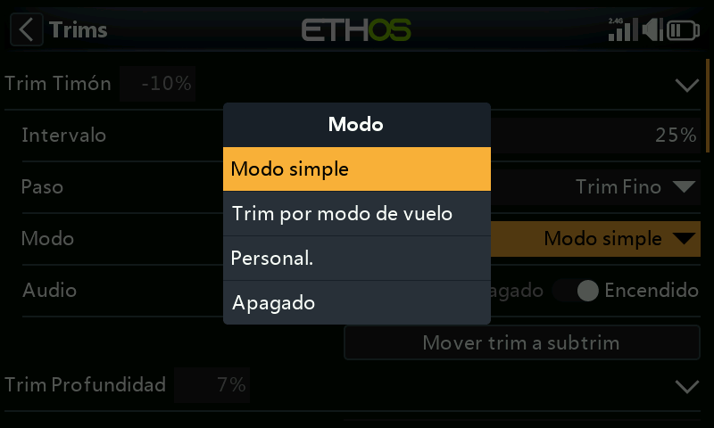

En el modo Simple, hay sólo un compensador por cada una de las palancas de control, por lo que el valor de compensado se comparte en todos los modos de vuelo. Esto es normalmente apropiado para alerones y timón, ya que su trimado casi no varía en los distintos modos de vuelo.

#### Independiente por modo de vuelo

#### Personalizado

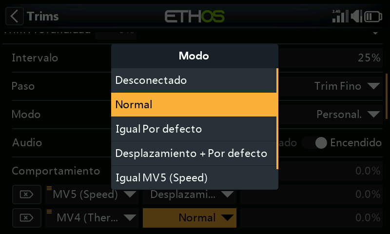

En el modo personalizado, el comportamiento del compensado se puede ajustar a las necesidades del usuario.

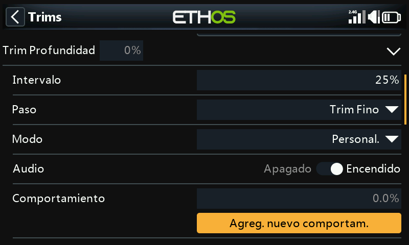

Una vez que se selecciona el modo personalizado, aparecerá un nuevo cuadro de diálogo de Comportamiento. Seleccione ‘Añadir nuevo comportamiento’.

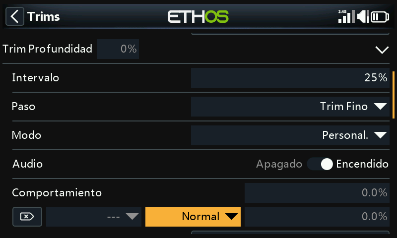

Se añadirá una nueva línea para comportamiento de compensador.

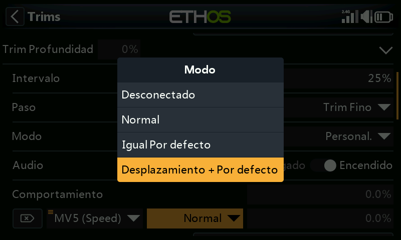

Las opciones iniciales para el comportamiento son:

- Desenchufado.
- Normal (por defecto)
- Igual por defecto
- Desplazamiento + por defecto

Cada una de estas opciones se describe a continuación:

##### Compensador desconectado

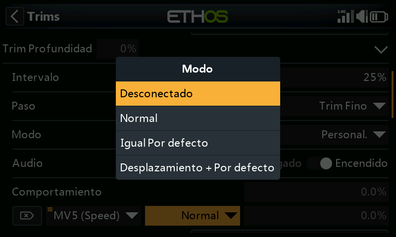

Los compensadores se pueden deshabilitar seleccionando la opción ‘Desconectado’.

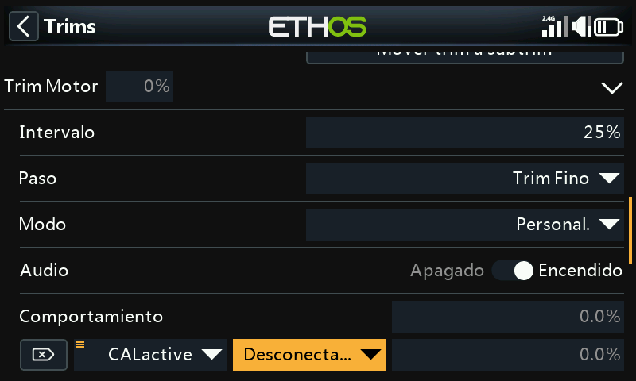

Los compensadores se pueden deshabilitar selectivamente, cambiándo desde ‘Siempre encendido’ a la condición deseada. Para deshabilitar completamente el compensador, ajustelo a la posición desconectado, como se ha explicado arriba.

##### Igual (a otro compensador)

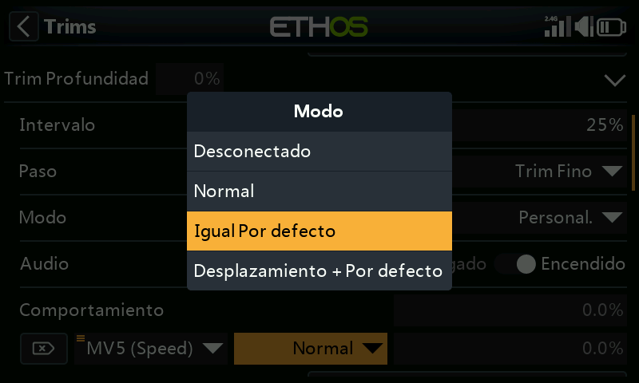

El compensador de una condición específica, puede configurarse para que sea igual al de otra condición.

##### Desplazamiento + (otro compensador)

El compensador para una condición específica puede configurarse para que se añada al compensador de otra condición.

##### Ejemplo de ‘Offset trim’

En muchos modelos, puede necesitarse un compensado base en profundidad cuando se vuela en su modo de vuelo habitual, y posteriormente disponer de compensaciones diferente en profundidad dependiente del modo de vuelo en que se esté.

Como ejemplo, en los planeadores el modo de vuelo por defecto suele llamarse ‘Crucero’ (Cruise) en el que ls profundidad se ajusta para vuelo nivelado.

Pero se pueden necesitar compensaciones en profundidad diferentes en otros modos de vuelo, como puede ser ‘Velocidad’ y ‘Térmico’. Vamos a ‘Añadir un nuevo comportamiento’ para estos modos.

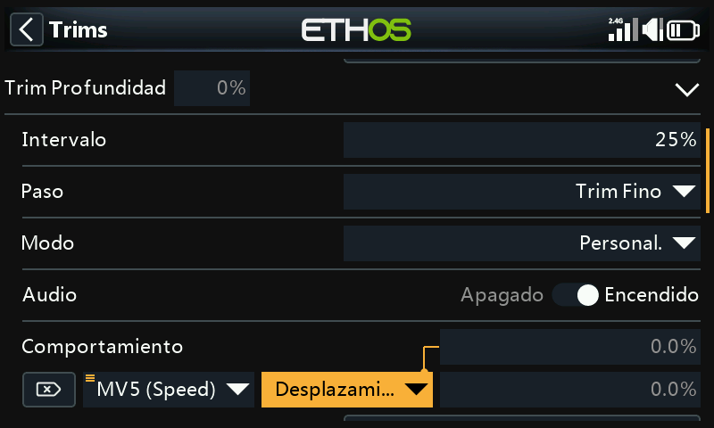

Configuramos el primer comportamiento como ‘Desplazamiento + por defecto’ con la condición ‘MV5(Velocidad)’. Cuando el MV5(Speed) se selecciona, cuanquier ajuste del compensador será guardado con un desplazamiento de los valores de compensado base del MV0(Crucero). Por lo tanto, el compensado en MV5(velocidad) será distinto, pero dependiente del compensado base.

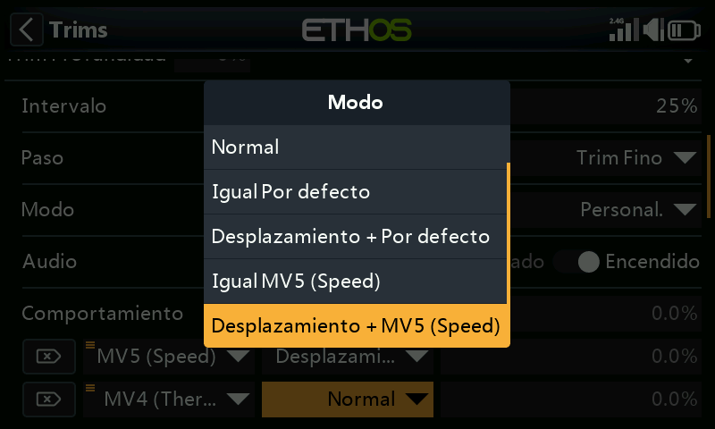

Tenga en cuenta que cuando configuramos el segundo comportamiento, ahora tendremos dos opciones: ‘Igual MV5(Velocidad)’ y ‘Desplazamiento + MV5(Térmico)’ en los cuadros de diálogo. Todo ello debido al primer comportamiento que realizamos arriba.

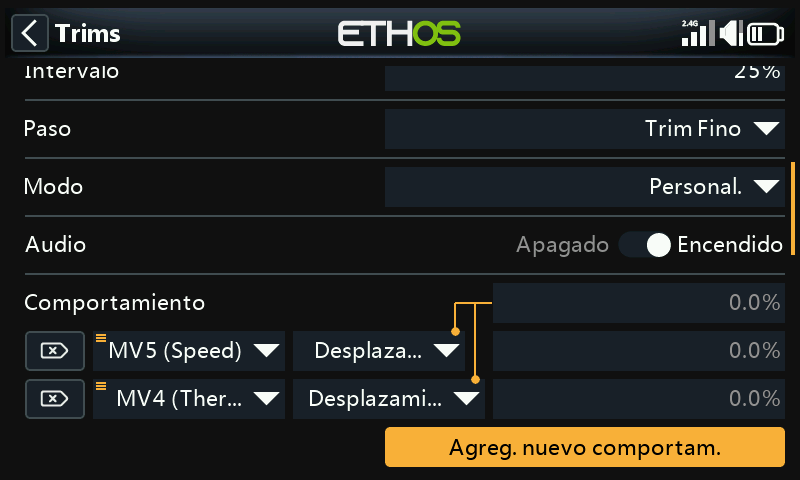

Si configuramos el Segundo comportamiento como ‘Offset + Default’ condicionado a ‘MV4(Térmico)’, cuando seleccionamos el modo MV4(Térmico) cualquier ajuste de compensado se guardará como un offset al compensado base en el modo MV0 (Crucero). De esta forma, el compensado del modo MV4(Térmico) será distinto, pero también dependiente del compensador base.

Si el compensado base en el modo crucero se tiene que cambiar porque se ha alterado el centro de gravedad del planeador, los compensadores dependientes para los modos velocidad y térmico también cambiarán en la misma cantidad.

### Audio

Para cada uno de los compensadores, se pueden desactivar los sonidos si no se desea que suenen. Por ejemplo, si un compensador ha sido reasignado para otro propósito.

### Mover trim a subtrim

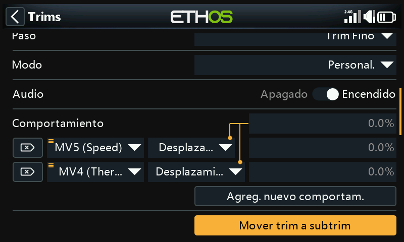

Después de compensar su modelo para vuelo nivelado, se puede usar esta funciónpara mover el valor requerido de compensador (de, por ejemplo, el timón de profundidad) a los ajustes del subtrim en los canales, y reajustar el compensador a cero en la pantalla principal. Esta acción hace más fácil comprobar que la compensación no se ha movido durante el vuelo siguiente.

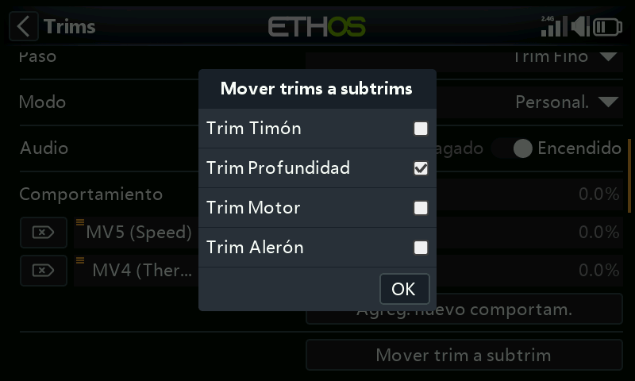

La opción ‘Mover trims a subtrims’ del compensador de profundidad seleccionará por defecto el compensador de profundidad. Se pueden añadir a otros compensadores, o se puede usar la opción maestra de ‘Mover trims a subtrims’ que se explica más abajo para seleccionar la opción en todos los compensadores a la vez.

## Compensadores adicionales

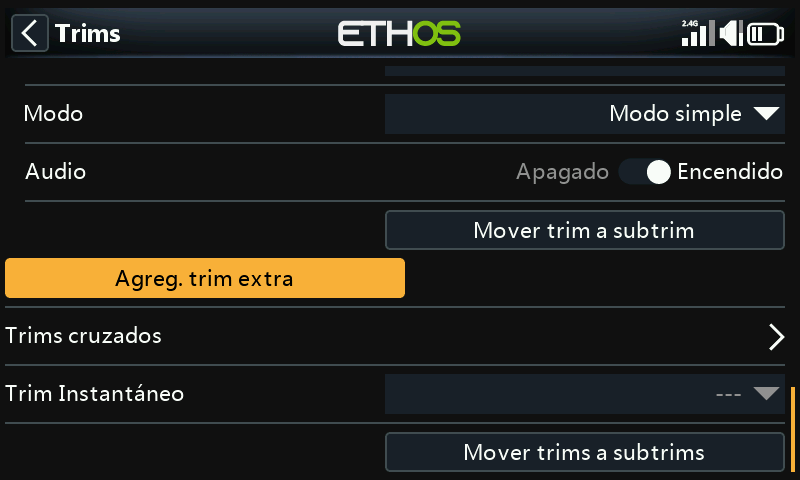

Se pueden crear compensadores adicionales pulsando en el botón ‘Agregar un trim extra’.

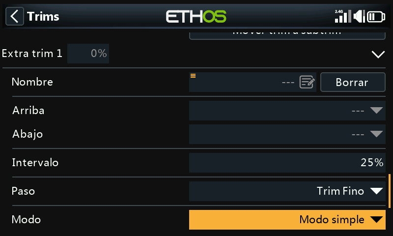

### Nombre

Se puede asignar un nombre al nuevo compensador.

### Arriba

Selecciona la fuente que se usará para incrementar el valor de compensado.

### Abajo

Selecciona la fuente que se usará para disminuir el valor de compensado.

### Intervalo de compensado

Vea más arriba la descripción de rangos de compensado.

### Paso

Vea más arriba la descripción de los pasos para compensadores estándar.

### Modo

Vea más arriba la descripción de cómo configurar el comportamiento estándar de los compensadores.

### Audio

Para cada uno de los compensadores, se pueden desactivar los sonidos si no se desea que suenen. Por ejemplo, si un compensador ha sido reasignado para otro propósito.

## Compensadores cruzados

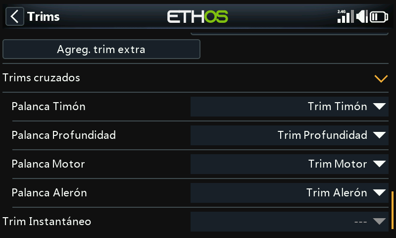

Para cada una de las palancas, se pueden seleccionar compensadores cruzados, con lo que se puede elegir cual interruptor de compensado se usará para cada una de ellas. (Los interruptores T5 y T6 sólo están disponibles en la X20 Pro y X18).

## Compensador Instantáneo

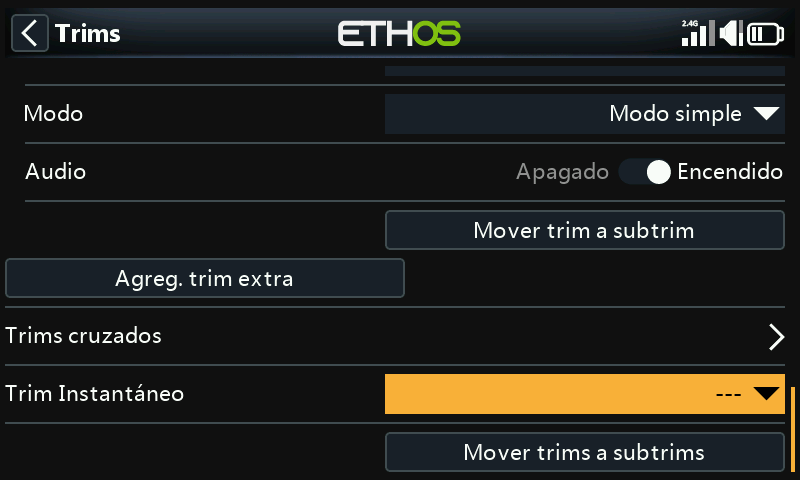

Cuando esta función se activa, la posición actual de las palancas se añade a cada uno de sus respectivos valores de trimado por defecto (incluso cuando se usan compensadores cruzados). Es mejor activarlo mediante un interruptor que pueda usarse sin tener que soltar las palancas, que se usará para ajustar instantáneamente los trim cuando el avión esté volando recto y nivelado. De esta forma, se evitará tener que pulsar frenéticamente los respectivos compensadores cuando el avión está totalmente fuera de compensación. Esta función debería desactivarse después de compensar perfectamente el avión para evitar desajustarlo de nuevo accidentalmente.

Tenga en cuenta que el Compensador Instantáneo sólo estará activo en una de las pantallas principales.

## Mover trims a subtrims

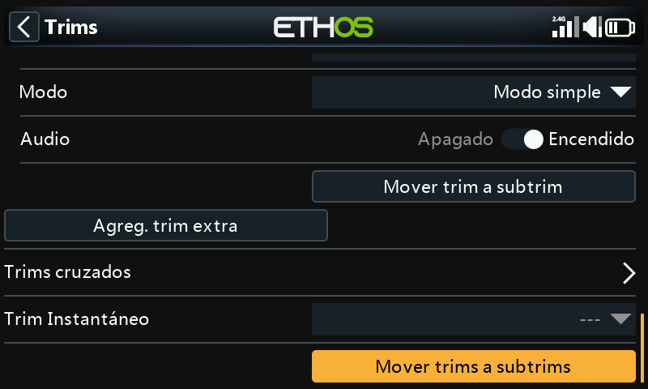

Después de compensar el modelo para vuelo nivelado, se puede usar esta función para mover los valores requeridos de compensado hacia los ajustes del Subtrim en los Canales, y restaurando el compensador a la posición de cero en la pantalla principal. Con esto se consigue comprobar más fácilmente que sus compensadores no se han movido.

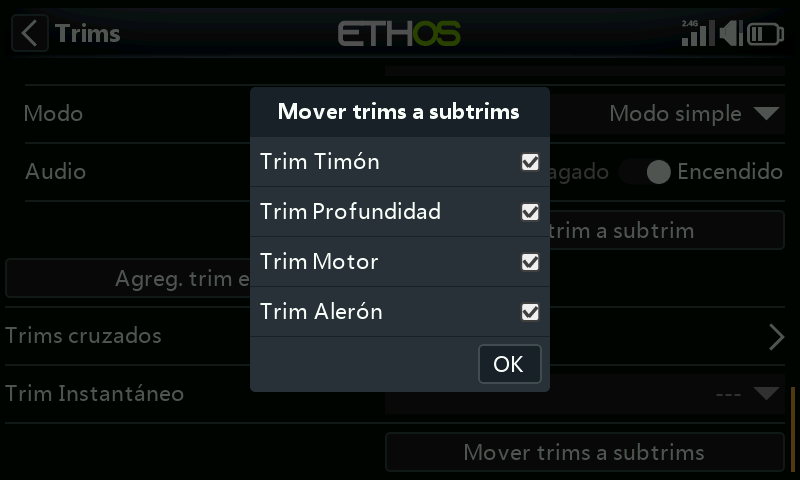

Revise los compensadores que quiere mover a los subtrims. Seguramente deseará  no seleccionar el compensador del motor.

Cuando se usan modos de vuelo, puede que tengamos que considerar más de un valor de compensado para cada canal. Los parámetros del Subtrim en Canales son un ajuste global que se aplica en todos los modos de vuelo, mientras que los valores de compensado pueden variar de acuerdo con el modo de vuelo. Como consecuencia, la función tomará el compensado del modo de vuelo seleccionado, transferirá los ajustes de compensado al Subtrim, reseteará el compensador, y ajustará los compensadores afectados de los otros modos de vuelo. Al final, las posiciones de las superficies de control de cada modo de vuelo deberían ser las mismas que eran antes de la operación ‘Mover Trims a subtrims’.

Grandes valores de compensado o del subtrim pueden tener efectos adversos debido a que resulten movimientos muy asimétricos. Sería más inteligente corregir el problema mecánicamente. Se deberían realizar todos los esfuerzos posibles para conseguir que los reenvíos del servo estén próximos a 90 grados cuando las superficies estén en neutral, con excepción de los flaps en los que sacrificas el recorrido hacia arriba para maximizar el recorrido hacia abajo. Después de conseguir tener los reenvíos lo más cercanos posibles a los 90 grados, se debe usar el centrado PWM para ajustarlos exactamente a 90 grados.

No hay problema en repetir Trims a Subtrims, pero se debe ser consistente y siempre hacerlo en el mismo modo de vuelo, por ejemplo en el modo de vuelo ‘base’. En un velero, el modo de vuelo ‘base’ suele ser el de crucero, y es el que se debe compensar primero.
