# Variables (Vars)

Las Variables (Vars) se pueden usar para almacenar y darle un nombre a los parámetros y ajustes de un modelo, de forma que puedan ser referenciados a otro lugar en la programación de la radio, incluyendo las mezclas. Las Vars deben contemplarse como contenedores de información.

Las hemos separado en una sección aparte, para permitir una separación limpia entre los datos de configuración de un modelo y su lógica de programación. Así, se pueden centralizar todos los ajustes de configuración en un solo sitio, darle un nombre que tenga sentido, y tenerlos donde sean fáciles de encontrar y editar, sin que debamos saltar entre docenas de mezclas u otros elementos de configuración, permitiéndonos pasar directamente a los parámetros relevantes.

Las Vars pueden albergar valores fijos (por ejemplo, constantes), o se pueden ajustar con límites definidos por el usuario, para evitar malos valores capaces potencialmente de causar una rotura. Cada Var puede contener múltiples configuraciones con valores dependientes de condiciones activas configuradas (como pueden ser los modos de vuelo). Las Acciones se pueden configurar para que alteren su valor en función de otros parámetros, como puede ser la reasignación de un compensador para modificar las condiciones en vuelo, o usar acciones de sumas/restas/multiplicaciones/divisiones a través de distintas entradas. Las Vars son persistentes entre sesiones.

Las Vars son también extremadamente útiles cuando se desea tener un valor de ajuste que se va a usar en múltiples sitios. Por ejemplo, en un planeador que tenga alerones partidos en cada ala, se le puede programar para que los interiores se puedan usar como flaps durante el aterrizaje, mientras que en el resto del vuelo las cuatro superficies puedan actuar como alerones y deban compartir un ajuste diferencial común que contrarreste las guiñadas adversas durante los virajes. Todo esto se consigue a través de las Vars.

Las Vars pueden sustituirse por el valor numérico normal en todos sus parámetros a través de su características ‘Opciones’, que se identifican en el icono de menú (símbolo de hamburguesa). Para más detalle, vaya a la sección C[aracterísticas opcionales](../getting-started/user-interface-and-navigation.md).

Hay disponibles 64 Vars.

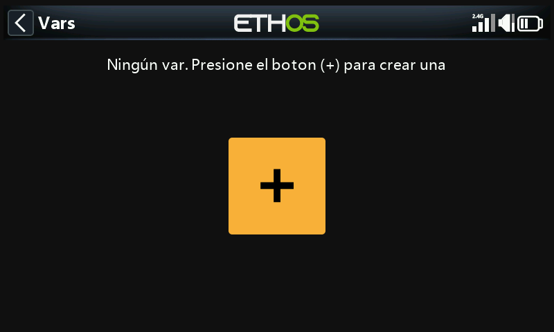

No habrá ninguna Var por defecto. Pulse en el símbolo ‘+’ para añadir una nueva.

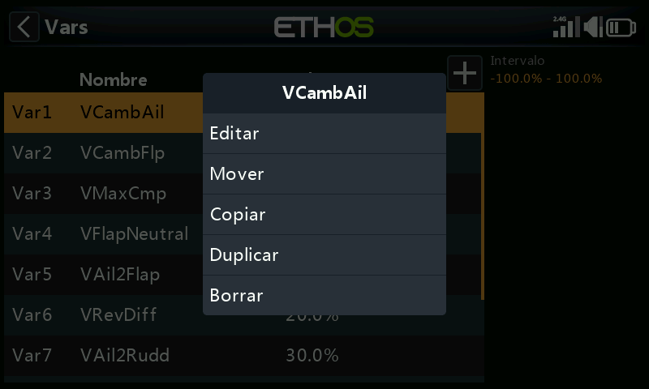

Una vez que se haya definido alguna Var, tocando en una de las Var de la lista aparecerá un cuadro de diálogo que le permitirá Editar, Mover, Copiar/Pegar, Duplicar o Borrar la Var seleccionada.

## Añadir Vars

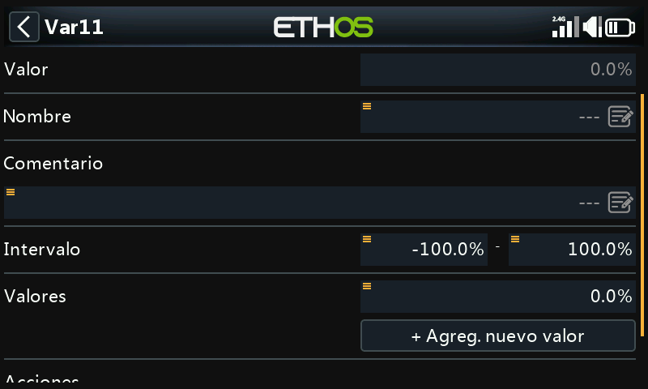

### Valor

Muestra el valor actual de la Var.

### Nombre

Permite darle un nombre a la Var.

### Comentario

Se puede añadir un comentario como explicación de su uso o función, para ayudar a su comprensión.

### Rango

Los límites inferior y superior se pueden hasta un decimal de entre +/- 500% para que la Var se pueda mantener en unos límites definidos.

### Valores

#### Values fijos

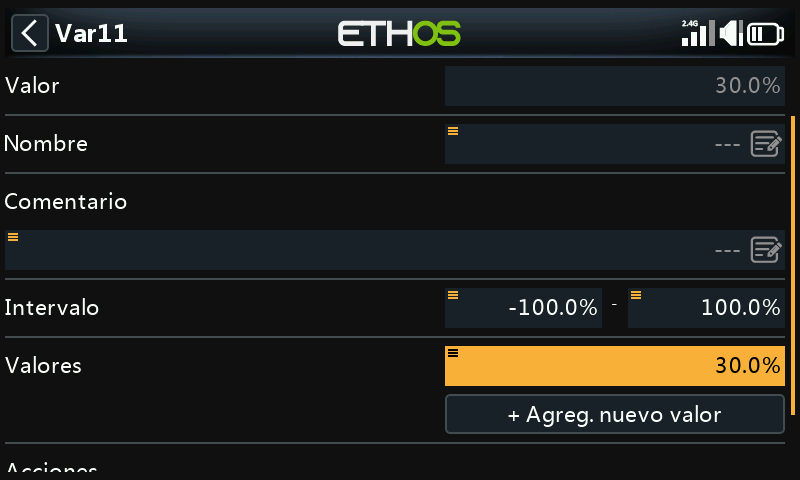

Las Vars pueden contener desde un valor fijo individual (poe ejemplo, una constante) hasta uno decimal, como en el ejemplo de arriba.

#### Valores múltiples or variables

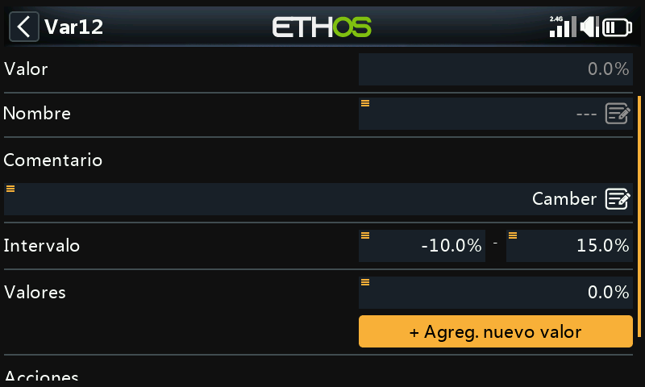

Seleccionar ‘Agreg. Nuevo valor’ para añadir un nuevo valor al Var.

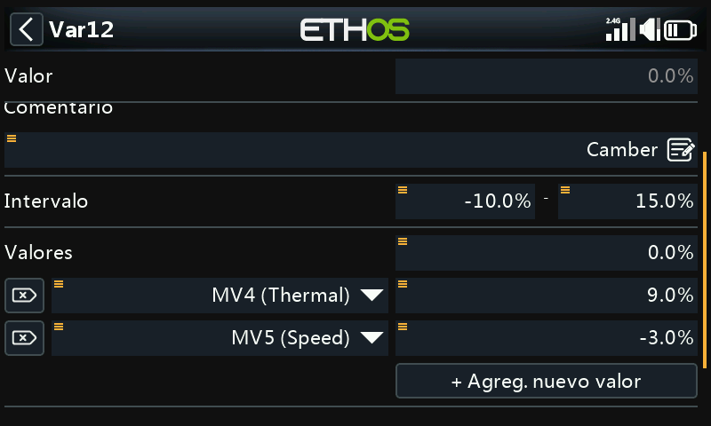

Cada Var puede contener configuraciones con múltiples valores dependientes de condiciones activas (como en los Modos de Vuelo) que se configuren. En el ejemplo de arriba, si el modo de vuelo Térmico MV4 está activo, la Var12 tendrá un valor de 9%. Cuando el modo Velocidad MV5 es el que está activo, la Var12 tendrá un valor de -3%.

Tenga en cuenta que se ha ajustado un rango de entre -10% y +15% para evitar valores más grandes de lo deseado.

La Vars son persistentes entre sesiones.

### Acciones

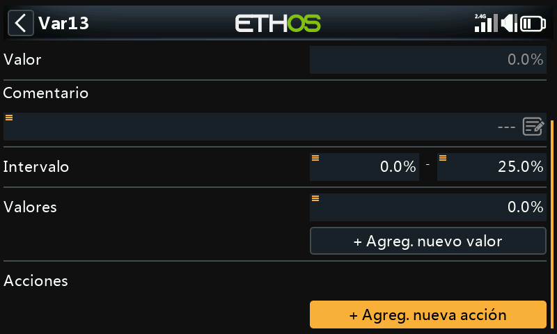

Se pueden ‘Agreg, nueva acción’ a las Var, por ejemplo para reprogramar compensadores o realizar cálculos.

#### Reasignar un compensador

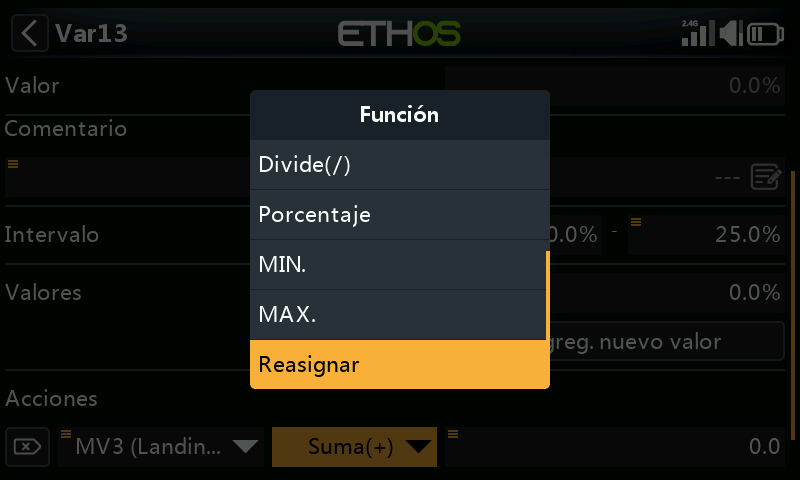

Vamos a reasignar un compensador para ajustar los valores de una Var.

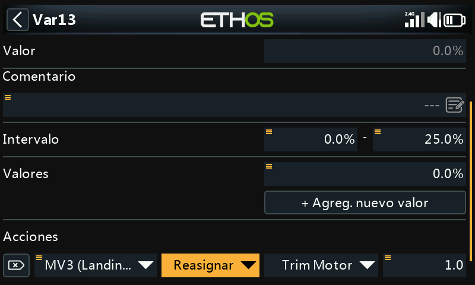

En el ejemplo de arriba, se ha definido una acción para reasignar el compensador del motor para inducir una compensación Camber solamente durante el modo de vuelo Landing MV3. Se ha introducido un rango de 0 - 25% para mantener el valor de la Var en unos límites razonables. Se puede definir un valor en los pasos de compensación de hasta un decimal, por ejemplo 1.0% en el valor de arriba.

La reasignación de compensadores solo se hace para una condición activa específica. El resto del tiempo operarán acorde con su función normal.

#### Acciones aritméticas

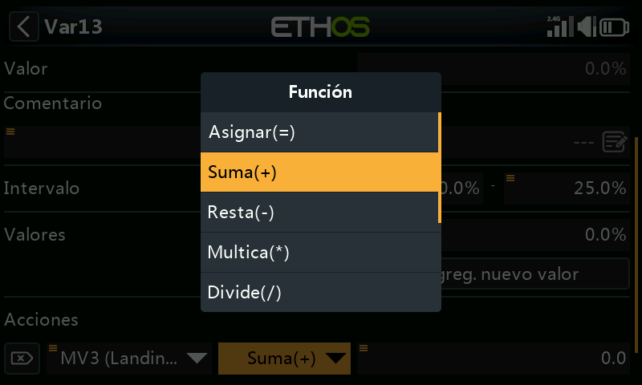

Las Acciones pueden también:

- Asignar a una Var un valor específico
- Sumar(+) a la Var una cantidad
- Restar(-) una cantidad de la Var
- Multiplicar(\*) la Var por un parámetro
- Dividir(/) la Var por un parámetro
- Aplicarle un porcentaje a la Var
- Min
- Max

Las acciones se controlan a través de entradas.

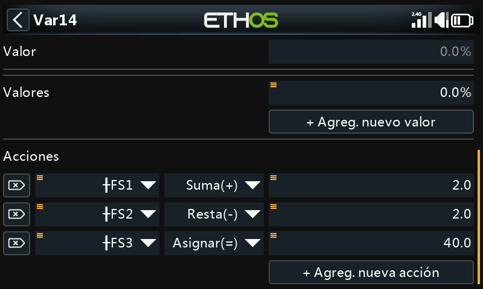

En el ejemplo de arriba, el interruptor de función FS3 (edge) asignará un valor de 40% a la Var, el FS1(edge) incrementará su valor en 2 con cada pulsación de botón, hasta que se alcance el valor máximo, y de forma similar el FS2(edge) disminuirá su valor en 2 hasta que se alcance el valor mínimo. Tenga en cuenta que la opción Edge debe seleccionarse (manteniendo presionado el FS) de forma que la acción sólo se ejecutará cuando el interruptor de función cambia de estado.

## Eliminar Vars

Si se eliminar una VAR, en todos los sitios en los que se haya usado se convertirán, al mismo tiempo.
