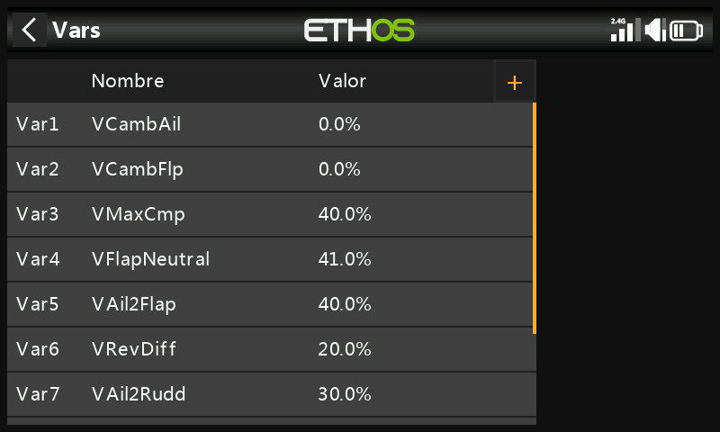

# Variables

Las variables ("Vars") son contenedores con nombre para los valores de configuración propios de un modelo, referenciables desde cualquier otro punto de la programación, incluidas las [mezclas](mixes.md). Mantenerlas en su propia sección separa los *datos de configuración* del modelo de su *lógica de programación*: en lugar de rastrear docenas de mezclas para encontrar y ajustar un valor, todo reside en un único lugar con un nombre significativo. Hay 64 Vars disponibles; ninguna existe por defecto. Añada una con **+**; pulse sobre una Var existente para **Editar**/**Mover**/**Copiar**/**Clonar**/**Borrar**.

Una Var puede contener una constante fija, o ser ajustable dentro de límites definidos por el usuario (para evitar que valores erróneos provoquen un accidente), y puede contener un valor *distinto* por cada condición activa (por ejemplo, por fase de vuelo). Los valores son persistentes entre sesiones. Una Var sustituye a cualquier valor numérico ordinario en cualquier lugar donde esté disponible la [función Opciones](../getting-started/user-interface-and-navigation.md#the-options-feature) (los campos con el icono de hamburguesa).

!!! example
    Un velero con alerones divididos (cuyas secciones interiores hacen también de flaps de aterrizaje) necesita un único valor compartido de diferencial de alerones utilizado en todos los casos en que las cuatro superficies actúan como alerones: una Var que contenga ese único valor, referenciada desde cada mezcla relevante, lo mantiene coherente y hace que solo haya que ajustarlo en un sitio.

## Añadir una Var

- **Valor** — valor actual (visualización de solo lectura).
- **Nombre** — editable.
- **Comentario** — texto libre que explica su propósito.
- **Rango** — límites inferior/superior (un decimal, dentro de ±500 %) que el valor de la Var nunca podrá superar.

### Valores

- **Fijo** — una única constante, con un decimal.
- **Múltiple/variable** — **Añadir nuevo valor** asocia un valor a cada condición activa. Por ejemplo, `Var12` vale 9 % mientras la fase de vuelo Thermal (FM4) está activa, y −3 % mientras Speed (FM5) está activa, con su Rango limitado a −10 %…+15 % para que ninguno de los dos pueda exceder límites razonables:

  
  

### Acciones

Las acciones modifican el valor de una Var a lo largo del tiempo, controladas por una entrada.

**Trim reasignado** — cede uno de los trims físicos al ajuste de esta Var en lugar de su función normal, normalmente restringido a una condición activa:

!!! example
    Reasigne el trim del acelerador para ajustar una Var de compensación de curvatura, pero solo mientras la fase de vuelo Landing (FM3) esté activa, con un Rango de 0–25 % y un paso de 1,0 % por clic. Fuera de esa condición activa, el trim vuelve automáticamente a su función ordinaria.

**Acciones aritméticas** — controladas por cualquier entrada:

- **Asignar** — fija la Var a un valor concreto.
- **Sumar** / **Restar** / **Multiplicar** / **Dividir** — operación aritmética sobre el valor actual.
- **Porcentaje** — aplica un porcentaje de la entrada de control.
- **Mín** / **Máx** — limita la Var frente a la entrada de control.

  

!!! example
    `FS3(edge)` asigna directamente 40 % a una Var; `FS1(edge)` suma 2 en cada pulsación (limitado al máximo del Rango); `FS2(edge)` resta 2 en cada pulsación (limitado al mínimo del Rango). Aquí importa la opción **Edge** (pulsación larga sobre el interruptor de función): sin ella, la acción se repetiría continuamente mientras se mantuviese el interruptor accionado, en lugar de ejecutarse una vez por pulsación.

  
