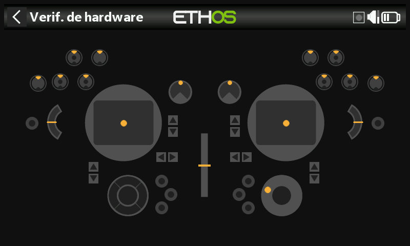

# X20 Pro / X20 Pro AW

Diferencias respecto al X20S, que es la referencia con la que está escrito este manual;
se aplican al **X20 Pro** y, en su mayoría, se extienden también al **X20 Pro AW**
y a la familia **X20R/RS**.

- **Almacenamiento** — memoria interna eMMC de 8 GB por defecto, SD card opcional — vaya a
  [General → Ubicación del
  almacenamiento](../system-setup/general.md#storage-location-x18-and-x20-prorrs).
- **Compensadores adicionales** — añade los interruptores de compensado **T5** y **T6** — vaya a
  [Compensadores](../model-setup/trims.md#trim-settings).
- **Interruptores adicionales** — dos pulsadores con enclavamiento, **K** y **L**,
  en los hombros traseros, además de las posiciones de interruptor **M**/**N** si están
  cableadas (habitualmente interruptores en el extremo de las palancas) — vaya a [Hardware →
  Interruptores](../system-setup/hardware.md#switches-settings).
- **Pots adicionales** — **Ext1**/**Ext2**, empleados normalmente con gimbals de 3 ejes
  — vaya a [Hardware → Pots/Sliders](../system-setup/hardware.md#potssliders-settings).
  Esto desplaza el índice del [inspector de valores ADC](../system-setup/hardware.md#adc-value-inspector):
  Ext1/Ext2 se sitúan entre Pot2 y los sliders.
- **Vibración háptica** — las emisoras **X20 Pro AW** y **X20RS** se suministran con gimbals MC20R
  que llevan incorporados motores de vibración en las palancas; una **X20 Pro** o
  una **X20R** pueden actualizarse igualmente mediante la instalación de gimbals MC20R,
  que se activa en [Hardware → Habilitar actualización para vibración en los
  gimbal](../system-setup/hardware.md#radio-specific-hardware-options).
  Una vez activada, [Seleccionar motores de
  vibración](../model-setup/special-functions.md#actions) ofrece Por defecto (vibración interna),
  Todos los motores, Vibración en la palanca izquierda o Vibración en la palanca derecha.
- **Selector rotatorio** — las X20 Pro AW y X20R/RS emplean un selector más sensible;
  la opción **medios pasos** en [Hardware → Opción del
  selector](../system-setup/hardware.md#radio-specific-hardware-options)
  atenúa su respuesta.
- **Módulo de RF interno** — las X20 Pro/R/RS emplean el módulo **TD-ISRM Pro**
  (compatible con LoRa, con modos tándem de doble banda y TD-Pro además
  de ACCESS/ACCST D16), en lugar del módulo TD-ISRM de las
  X18/X20/X20S/X20HD — vaya a [Sistema de RF](../model-setup/rf-system.md).
