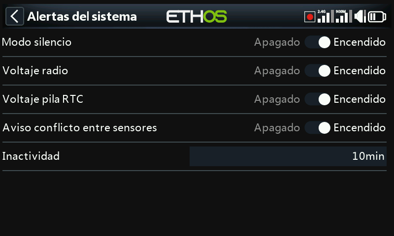

# Alertas

Cuatro avisos que afectan a toda la emisora, cada uno activable de forma
independiente, distintos de las [funciones especiales](../model-setup/special-functions.md)
y de los [interruptores lógicos](../model-setup/logical-switches.md) de cada modelo
que configura usted mismo.

- **Modo silencioso** — un aviso hablado al encender la radio cuando esta
  comprobación está activada y [General → Modo de audio](general.md) está
  ajustado a Silencioso, como recordatorio de que la emisora está silenciada.
- **Tensión principal** — "Radio battery is low" cuando la batería principal de
  la emisora cae por debajo del umbral de **Tensión baja** establecido en
  [Batería](battery.md).
- **Tensión RTC** — "RTC battery is low" cuando la pila de botón del RTC cae por
  debajo de 2,5 V (el umbral predeterminado). El registro de datos depende del
  reloj en tiempo real; una hora no válida dificulta la lectura de los registros,
  sobre todo a la hora de distinguir unas sesiones de vuelo de otras. Este aviso
  puede silenciarse temporalmente mientras se espera a sustituir la pila, pero no
  debería dejarse desactivado indefinidamente.
- **Aviso de conflicto de sensores** — detecta ID de sensores de telemetría en
  conflicto. Solo conviene desactivarlo si tiene sensores que no cumplen la
  especificación S.Port.
- **Inactividad** — un aviso hablado "Prolonged inactivity" (más una vibración
  háptica, por si el volumen está bajado) cuando la emisora ha permanecido sin
  usarse durante más tiempo del configurado: 10 minutos por defecto.
