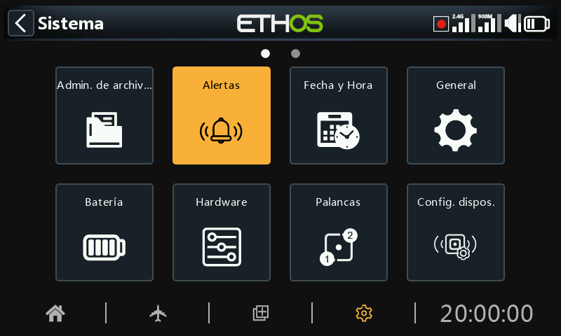

# Alertas

Las Alertas del Sistema son:

## Modo silencio

Se emitirá una Alerta de Modo Silencio al iniciar la radio cuando la Comprobación de Modo Silencio esté ACTIVADA y el Audio se haya configurado en modo Silencio en System / General / [Audio mode](#Audio mode)

## Voltaje principal de la radio

Se emitirá una alerta de voz "Batería de radio baja" cuando la alerta de comprobación del voltaje de la batería principal esté activada y la batería de la radio principal esté por debajo del umbral establecido en el parámetro "Bajo voltaje" en Sistema / Batería.

## Voltaje RTC

Se emitirá una alerta de voz que indica que la pila del ‘Batería RTC está baja’ cuando la comprobación del voltaje de la batería del RTC está activada y la pila de botón del RTC está por debajo de 2,5 V, umbral predeterminado de la batería del RTC. Se puede apagar hasta que se haya sustituido la pila del RTC, pero no se debe apagar indefinidamente. La hora real se utiliza en el registro de datos, y una hora no válida causará dificultades en la lectura de los registros, especialmente cuando se quiera distinguir entre las sesiones de vuelo.

## Aviso de conflicto de sensores

La detección de conflictos entre sensores puede desactivarse, pero sólo debería necesitarse si tiene sensores que no cumplen las especificaciones del S.Port.

## Inactividad

Cuando la radio no se haya utilizado durante más tiempo que el establecido en "Inactividad", se emitirá una alerta de voz "Inactividad detectada" y también una alerta háptica en caso de que se baje el volumen de la radio. El tiempo predeterminado es de 10 minutos.
