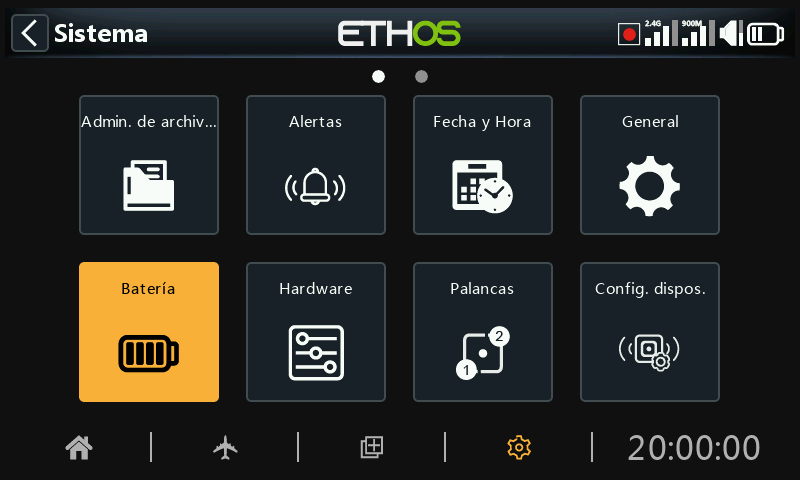

# Batería

La sección Batería sirve para calibrar las baterías de la radio y ajustar los umbrales de alarma.

## Voltaje radio

Este es el voltaje actual de la batería de la radio, pero también se usa para los ajustes de calibración del voltaje. Para ello, debe introducir el voltaje real que tiene la batería, medido con un multímetro. El valor predeterminado es 8,4 V para una batería de litio de 2 celdas que esté cargada.

## Alerta batería baja

Es la tensión umbral de alarma de bajo voltaje. El valor predeterminado es 7,2V, aunque un valor de 7,4V le dará un margen extra de seguridad.

Se abrirá un cuadro de aviso y se emitirá cada minuto una alerta de voz de "Batería de radio baja" cuando el voltaje de la batería principal caiga por debajo del umbral ajustado aquí, si está activada la comprobación de la batería de la radio en Sistema / Alertas [Voltaje de Batería](alerts.md).

### ¡Atención!

Cuando se emite esta alerta, sería prudente aterrizar y cargar la batería de la radio. Esta alerta se repite cada minuto, incluso cuando el diálogo de aviso está abierto en la pantalla.

Tenga en cuenta que cuando el voltaje de la batería de la radio baje a 6,0 V, la radio se apagará para proteger la batería interna LiIon (2 x 3,0 V).

## Rango visualización voltaje

Estos ajustes establecen el rango de la visualización gráfica de la batería en la parte superior derecha de la pantalla. Los límites por defecto para la batería Li-Ion de serie son 6.4 y 8.4V. Muchos pilotos aumentan el voltaje de detección inferior para activar la alerta de bajo voltaje TX antes y evitar una descarga profunda de la batería.

El valor MIN estará indicado cuando se apaga el primer punto y MAX se indicará cuando el cuarto punto de la barra esté encendido, cuando se usa la representación gráfica de voltaje de batería.

Si la batería se cambia por otra de distinto tipo, los límites deben ajustarse adecuadamente.

## Voltaje pila RTC

Muestra el voltaje de la pila RTC (Reloj en tiempo real) de la radio. El voltaje es de 3,0v para una pila nueva. Si el voltaje es inferior a 2,7 V, sustituya la pila de la radio para asegurarse de que el reloj funciona correctamente. Si el voltaje cae por debajo de 2.5V, se emitirá una alerta. Por favor, vea las sección Alertas / [Comprobación de la batería RTC](alerts.md).
